# 5. Scheduler（调度器）

## 一、学习心得与要点速记

### 1.1 宏的威力

- 宏的作用实在是太 NB 了，解决了太多的问题。

### 1.2 架构设计感悟

- 人家的临界区保护和我的还不太一样，没招了。
- 一个好的架构都是逻辑段和硬件段相解耦的，而且都是先明确逻辑段的变化，再进行硬件段的变化。
- 关于位图的思考与优化。

### 1.3 学习方法反思

- 感觉应该先看调度器的，好多线程里面的知识都用到了调度器模块。
- 感觉每次卡代码的时候老是看着看着就忘了这个函数是干什么的了。

### 1.4 核心发现

- **RAII 思想（资源获取即初始化）的启示：** 在 C 语言中，`rt_sched_lock` 和 `rt_sched_unlock` **必须严格成对出现**。如果在加锁和解锁之间的代码逻辑中不小心 `return` 了，或者发生了无限循环，系统中断将永远无法打开，这被称为"死锁"。因此，在编写 RTOS 内核相关代码时，必须时刻警惕你的代码分支，确保每一条执行流最终都能走到解锁操作。


# 第二部分：调度器架构总览

---

## 二、调度器架构总览

### 2.1 调度器模块架构图

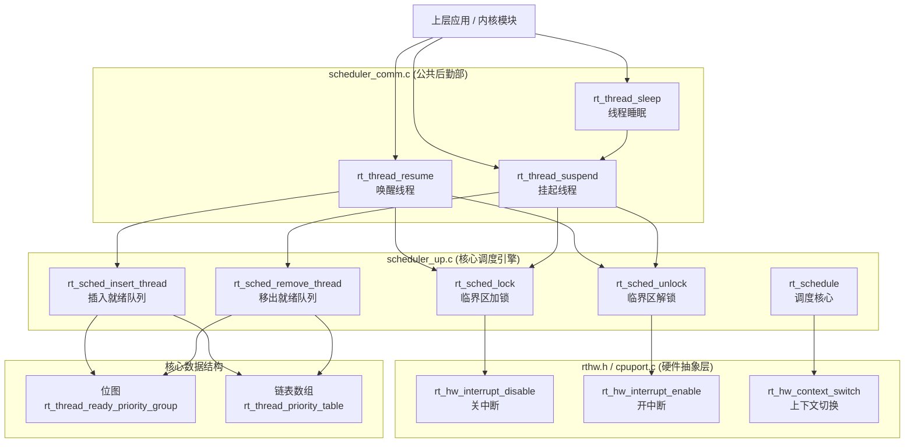
```mermaid
graph TD
    %% 外部调用者
    App[上层应用 / 内核模块]

    %% 公共接口层
    subgraph "scheduler_comm.c (公共后勤部)"
        rt_thread_resume[rt_thread_resume <br> 唤醒线程]
        rt_thread_suspend[rt_thread_suspend <br> 挂起线程]
        rt_thread_sleep[rt_thread_sleep <br> 线程睡眠]
    end

    %% 核心调度层
    subgraph "scheduler_up.c (核心调度引擎)"
        rt_schedule[rt_schedule <br> 调度核心]
        rt_sched_lock[rt_sched_lock <br> 临界区加锁]
        rt_sched_unlock[rt_sched_unlock <br> 临界区解锁]
        rt_sched_insert_thread[rt_sched_insert_thread <br> 插入就绪队列]
        rt_sched_remove_thread[rt_sched_remove_thread <br> 移出就绪队列]
    end

    %% 硬件抽象层
    subgraph "rthw.h / cpuport.c (硬件抽象层)"
        rt_hw_interrupt_disable[rt_hw_interrupt_disable <br> 关中断]
        rt_hw_interrupt_enable[rt_hw_interrupt_enable <br> 开中断]
        rt_hw_context_switch[rt_hw_context_switch <br> 上下文切换]
    end

    %% 数据结构层
    subgraph "核心数据结构"
        Bitmap[位图<br/>rt_thread_ready_priority_group]
        ListTable[链表数组<br/>rt_thread_priority_table]
    end

    %% 调用关系
    App --> rt_thread_resume
    App --> rt_thread_suspend
    App --> rt_thread_sleep
    
    rt_thread_resume --> rt_sched_lock
    rt_thread_resume --> rt_sched_insert_thread
    rt_thread_resume --> rt_sched_unlock
    
    rt_thread_suspend --> rt_sched_lock
    rt_thread_suspend --> rt_sched_remove_thread
    rt_thread_suspend --> rt_sched_unlock
    
    rt_thread_sleep --> rt_thread_suspend
    
    rt_sched_lock --> rt_hw_interrupt_disable
    rt_sched_unlock --> rt_hw_interrupt_enable
    
    rt_sched_insert_thread --> Bitmap
    rt_sched_insert_thread --> ListTable
    rt_sched_remove_thread --> Bitmap
    rt_sched_remove_thread --> ListTable
    
    rt_schedule --> rt_hw_context_switch
```

### 2.2 模块职责划分

| 模块 | 文件 | 核心职责 |
|------|------|----------|
| 公共接口层 | `scheduler_comm.c` | 提供线程唤醒、挂起、睡眠等高层接口 |
| 核心调度层 | `scheduler_up.c` | 实现调度算法、临界区保护、队列管理 |
| 硬件抽象层 | `rthw.h` / `cpuport.c` | 封装 CPU 相关的关中断、上下文切换操作 |
| 数据结构层 | 内核全局变量 | 维护就绪队列位图和链表数组 |

### 2.3 核心数据结构

#### 位图

```c
rt_uint32_t rt_thread_ready_priority_group;
```

这是一个 32 位无符号整数，每一位对应一个优先级：

- 第 `n` 位为 `1`：表示优先级 `n` 有线程就绪
- 第 `n` 位为 `0`：表示优先级 `n` 无线程就绪

#### 链表数组

```c
rt_list_t rt_thread_priority_table[RT_THREAD_PRIORITY_MAX];
```

这是一个双向链表数组，每个元素挂载对应优先级的所有就绪线程。

#### 数据结构关系图

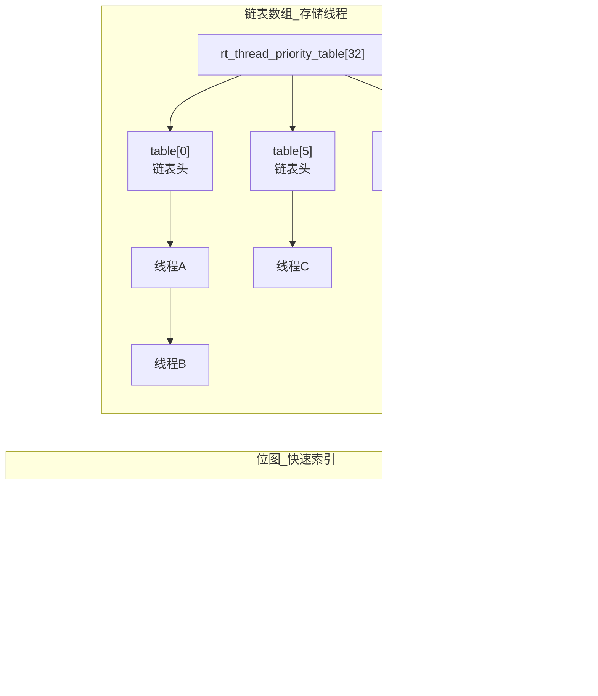
```mermaid
graph LR
    subgraph 位图_快速索引
        BIT["rt_thread_ready_priority_group<br/>32位整数"]
        BIT --> |第0位=1| P0["优先级0有就绪线程"]
        BIT --> |第5位=1| P5["优先级5有就绪线程"]
        BIT --> |第31位=0| P31["优先级31无就绪线程"]
    end
    
    subgraph 链表数组_存储线程
        ARR["rt_thread_priority_table[32]"]
        ARR --> T0["table[0]<br/>链表头"]
        ARR --> T5["table[5]<br/>链表头"]
        ARR --> T31["table[31]<br/>链表头"]
        
        T0 --> TH1["线程A"]
        TH1 --> TH2["线程B"]
        
        T5 --> TH3["线程C"]
    end
```

### 2.4 前置配置说明

#### 核心宏定义

```c
#define __RT_IPC_SOURCE__
```

这是一个内部控制宏。在 RT-Thread 中，有些核心数据结构（比如 IPC 进程间通信或调度的底层细节）只允许内核源码文件访问，对普通的应用层代码是隐藏的。定义了这个宏，再包含头文件时，就能解锁这些"内核级"的隐藏结构。

#### 核心头文件

```c
#include <rtthread.h>
```

这是 RT-Thread 的**总头文件**。后面看到的 `rt_list_t`（双向链表）、`rt_uint32_t`（标准数据类型）、`RT_THREAD_PRIORITY_MAX`（最大优先级宏）以及 `struct rt_thread`（线程控制块档案）的定义，全都来自于这个文件。

```c
#include <rthw.h>
```

这是**硬件抽象层头文件**。`hw` 代表 Hardware，里面声明了与 CPU 架构强相关的底层函数，比如关中断 `rt_hw_interrupt_disable`、开中断 `rt_hw_interrupt_enable`、触发上下文切换 `rt_hw_context_switch` 等。

#### 软件与硬件解耦

为什么不把 `<rthw.h>` 里的东西直接写进 `<rtthread.h>`？

因为操作系统内核（如排队算法、优先级查找）在任何芯片上都是一样的，这是**纯软件逻辑**。而触发调度的动作（如触发 PendSV 异常）在不同芯片上是完全不同的。将它们分开，使得 RT-Thread 可以极快地移植到千奇百怪的芯片上，你只需要换掉底层硬件相关的实现，调度器源码（`scheduler.c`）一行都不用改！

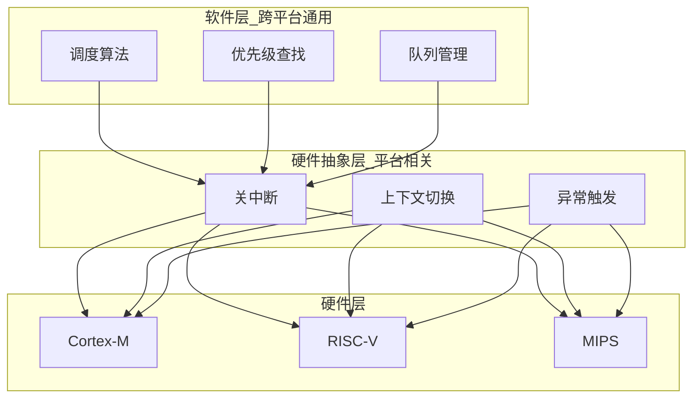
```mermaid
graph TB
    subgraph 软件层_跨平台通用
        A[调度算法]
        B[优先级查找]
        C[队列管理]
    end
    
    subgraph 硬件抽象层_平台相关
        D[关中断]
        E[上下文切换]
        F[异常触发]
    end
    
    subgraph 硬件层
        G[Cortex-M]
        H[RISC-V]
        I[MIPS]
    end
    
    A --> D
    B --> D
    C --> D
    
    D --> G
    E --> G
    F --> G
    
    D --> H
    E --> H
    F --> H
    
    D --> I
    E --> I
    F --> I
```
# 第三部分：核心函数剖析

---

## 三、核心函数剖析

### 3.1 临界区保护机制

#### 一句话总结

`rt_sched_lock` 和 `rt_sched_unlock` 是调度器的**"门卫"**，通过关中断的方式打造一个绝对安全的无干扰环境，保护内核数据结构不被中断破坏。

#### rt_sched_lock（加锁，保护现场）

```c
rt_err_t rt_sched_lock(rt_sched_lock_level_t *plvl)
{
    rt_base_t level;
    
    /* 第一步：防呆校验 */
    if (!plvl)
    {
        return -RT_EINVAL;
    }
    
    /* 第二步：关中断 */
    level = rt_hw_interrupt_disable();
    
    /* 第三步：保存现场 */
    *plvl = level;
    
    return RT_EOK;
}
```

##### 代码逻辑解析

| 步骤 | 代码 | 作用 |
|------|------|------|
| 防呆校验 | `if (!plvl)` | 防止空指针导致 HardFault |
| 关中断 | `rt_hw_interrupt_disable()` | 调用底层汇编指令，关闭 CPU 中断响应 |
| 保存现场 | `*plvl = level` | 记录关闭前的中断状态，供后续恢复 |

#### rt_sched_unlock（解锁，恢复现场）

```c
rt_err_t rt_sched_unlock(rt_sched_lock_level_t level)
{
    /* 恢复中断状态 */
    rt_hw_interrupt_enable(level);
    
    return RT_EOK;
}
```

#### 临界区保护流程

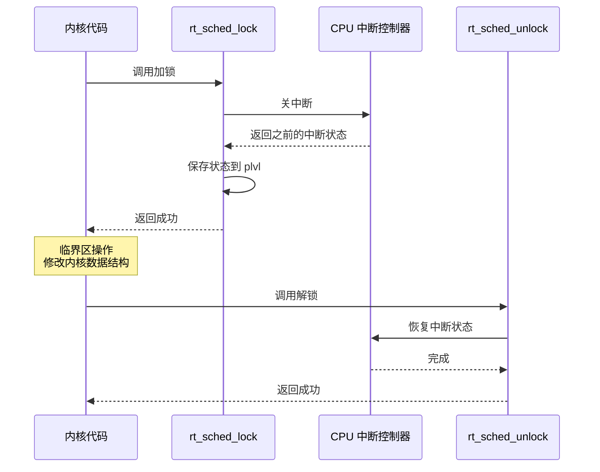
```mermaid
sequenceDiagram
    participant Code as 内核代码
    participant Lock as rt_sched_lock
    participant CPU as CPU 中断控制器
    participant Unlock as rt_sched_unlock
    
    Code->>Lock: 调用加锁
    Lock->>CPU: 关中断
    CPU-->>Lock: 返回之前的中断状态
    Lock->>Lock: 保存状态到 plvl
    Lock-->>Code: 返回成功
    
    Note over Code: 临界区操作<br/>修改内核数据结构
    
    Code->>Unlock: 调用解锁
    Unlock->>CPU: 恢复中断状态
    CPU-->>Unlock: 完成
    Unlock-->>Code: 返回成功
```

---

### 3.2 调度器初始化与启动

#### rt_system_scheduler_init（搭建空舞台）

在系统刚启动时，把调度器所需的"挂号排队通道"（就绪链表）和"指示灯"（优先级位图）全部清零初始化。

```c
/**
 * @brief Initialize the system scheduler for single-core systems
 */
void rt_system_scheduler_init(void)
{
    rt_base_t offset;
    
    // [解析] 将调度器锁的嵌套层数清零。
    // 确保系统刚启动时，调度器的大门是完全敞开的（未上锁状态）。
    rt_scheduler_lock_nest = 0;

    LOG_D("start scheduler: max priority 0x%02x",
          RT_THREAD_PRIORITY_MAX);

    // [解析] 这是一个极度关键的防呆操作。
    // 遍历所有的优先级级别（如 0~31），为每一个优先级初始化一个双向链表表头。
    // rt_list_init 会将链表节点的前驱和后继指针都指向自己形成闭环，
    // 防止后续有线程向就绪队列“插队”时遇到野指针导致系统崩溃。
    for (offset = 0; offset < RT_THREAD_PRIORITY_MAX; offset ++)
    {
        rt_list_init(&rt_thread_priority_table[offset]);
    }

    /* initialize ready priority group */
    // [解析] 将 32 位的“就绪优先级位图”清零。
    // 每一位代表一个优先级，0 表示此时没有任何线程在排队。
    rt_thread_ready_priority_group = 0;

#if RT_THREAD_PRIORITY_MAX > 32
    /* initialize ready table */
    // [解析] 如果系统支持大于32个优先级（比如256级），则需要二级位图（数组）。
    // 这里将其整块内存清零，确保初始状态一尘不染。
    rt_memset(rt_thread_ready_table, 0, sizeof(rt_thread_ready_table));
#endif /* RT_THREAD_PRIORITY_MAX > 32 */
}


```

#### rt_system_scheduler_start（大幕拉开，永不回头）

找出当前排队中优先级最高的那个线程（通常是 `main` 线程），把 CPU 的控制权彻底交给它，从此开启多线程调度，这个函数永远不会 `return`。

```c
/**
 * @brief Start the system scheduler and switch to the highest priority thread
 */
void rt_system_scheduler_start(void)
{
    struct rt_thread *to_thread;
    rt_ubase_t highest_ready_priority;

    // [解析] 第1步：寻将。
    // 调用位图查表算法，瞬间（O(1)时间复杂度）找出当前排队队列中，优先级数字最小（特权最高）的线程。
    to_thread = _scheduler_get_highest_priority_thread(&highest_ready_priority);

    // [解析] 第2步：官宣。
    // 向全系统的数据结构宣告：当前 CPU 马上要服侍的线程就是 to_thread 了。
    rt_cpu_self()->current_thread = to_thread;

    /* flush critical switch flag */
    // [解析] 清除底层上下文切换的挂起标志。
    CLR_CRITICAL_SWITCH_FLAG();

    // [解析] 第3步：出列。
    // 既然该线程马上就要占用 CPU 运行了，它就不再处于“就绪排队”状态，
    // 因此把它从刚刚初始化的就绪链表中踢出去。
    rt_sched_remove_thread(to_thread);
    
    // [解析] 修改该线程档案库中的状态为“正在运行”(RUNNING)。
    RT_SCHED_CTX(to_thread).stat = RT_THREAD_RUNNING;

    /* switch to new thread */
    // [解析] 第4步：点火起飞。最核心的底层魔法！
    // 将选出来的线程的“栈顶指针(sp)”传给这个纯汇编编写的函数。
    // 底层硬件会直接把栈里的寄存器数据弹出到 CPU 中，并强制改变 PC（程序计数器）指针。
    rt_hw_context_switch_to((rt_uintptr_t)&to_thread->sp);

    /* never come back */
    // [解析] 永远不会执行到这里！
    // 因为上一句代码根本不是普通的 C 函数调用，它是一次暴力的“硬件劫持”。
    // C 语言原本的返回路径（LR寄存器）被抛弃，CPU 已经被拐跑去执行新线程的代码了。
}
```

#### 初始化与启动流程

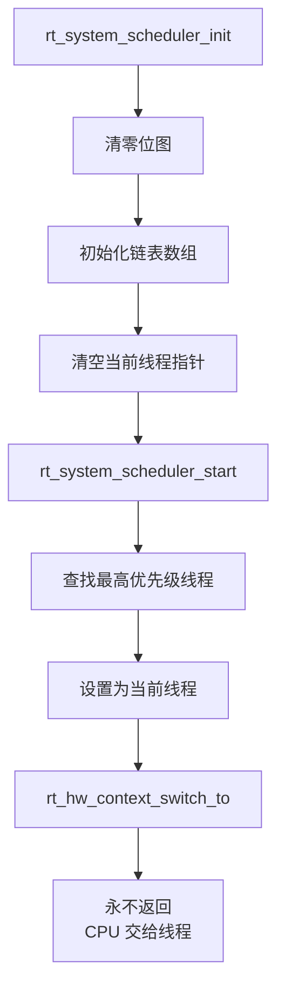
```mermaid
flowchart TD
    A[rt_system_scheduler_init] --> B[清零位图]
    B --> C[初始化链表数组]
    C --> D[清空当前线程指针]
    
    D --> E[rt_system_scheduler_start]
    E --> F[查找最高优先级线程]
    F --> G[设置为当前线程]
    G --> H[rt_hw_context_switch_to]
    H --> I[永不返回<br/>CPU 交给线程]
```

---

### 3.3 调度核心算法

#### 一句话总结

`rt_schedule` 是整个操作系统的**"最高指挥官"**。它在绝对安全的环境下（关中断），审视当前的排队情况，决定当前正在干活的线程是否需要被"赶下台"，并精准执行 CPU 控制权的交接仪式。

#### 核心代码逻辑

```c
void rt_schedule(void)
{
    rt_base_t level;
    struct rt_thread *to_thread;
    struct rt_thread *from_thread;
    struct rt_thread *curr_thread;

    /* disable interrupt */
    // [解析] 1. 拉起警戒线。调度涉及极其敏感的链表操作，绝不允许被硬件中断打断。
    level = rt_hw_interrupt_disable();

    /* using local variable to avoid unnecessary function call */
    curr_thread = rt_thread_self();

    /* check the scheduler is enabled or not */
    // [解析] 2. 检查调度器是否被锁。
    // 如果锁了（lock_nest > 0），说明有线程正在进行不可分割的绝密操作，不准切换！
    if (rt_scheduler_lock_nest == 0)
    {
        rt_ubase_t highest_ready_priority;

        // [解析] 3. 检查是否有线程在排队（就绪位图不为0）
        if (rt_thread_ready_priority_group != 0)
        {
            /* need_insert_from_thread: need to insert from_thread to ready queue */
            int need_insert_from_thread = 0;

            // [解析] 4. O(1) 算法揪出当前排队中优先级最高的 VIP 线程
            to_thread = _scheduler_get_highest_priority_thread(&highest_ready_priority);

            // [解析] 5. 核心博弈逻辑：评估当前正在运行的线程 (curr_thread)
            if ((RT_SCHED_CTX(curr_thread).stat & RT_THREAD_STAT_MASK) == RT_THREAD_RUNNING)
            {
                // [情况A：我还是老大] 当前线程的优先级数字 < 排队VIP的数字（数字越小优先级越高）
                if (RT_SCHED_PRIV(curr_thread).current_priority < highest_ready_priority)
                {
                    to_thread = curr_thread; // 保持现状，不切换
                }
                // [情况B：平起平坐，且我不想让] 优先级一样，且当前线程没有主动要求让出 CPU（Yield）
                else if (RT_SCHED_PRIV(curr_thread).current_priority == highest_ready_priority
                         && (RT_SCHED_CTX(curr_thread).stat & RT_THREAD_STAT_YIELD_MASK) == 0)
                {
                    to_thread = curr_thread; // 时间片可能还没用完，继续运行
                }
                // [情况C：我必须下台] 排队的 VIP 优先级比我高，或者我主动调用了 yield 让出 CPU
                else
                {
                    need_insert_from_thread = 1; // 标记：等会要把我重新塞回排队队列里
                }
            }

            // [解析] 6. 执行换人操作（如果发现 to_thread 已经不是 current_thread 了）
            if (to_thread != curr_thread)
            {
                /* if the destination thread is not the same as current thread */
                rt_current_priority = (rt_uint8_t)highest_ready_priority;
                from_thread                   = curr_thread;
                rt_cpu_self()->current_thread = to_thread;

                RT_OBJECT_HOOK_CALL(rt_scheduler_hook, (from_thread, to_thread));

                // [解析] 如果当前线程是被“抢占”或“主动让出”的，它还没死也没有睡着，必须放回就绪队列排队
                if (need_insert_from_thread)
                {
                    rt_sched_insert_thread(from_thread);
                }

                // [解析] 清除当前线程的“让出(Yield)”标志位
                if ((RT_SCHED_CTX(from_thread).stat & RT_THREAD_STAT_YIELD_MASK) != 0)
                {
                    RT_SCHED_CTX(from_thread).stat &= ~RT_THREAD_STAT_YIELD_MASK;
                }

                // [解析] 将即将上台的 to_thread 从就绪队列踢出，状态改为 RUNNING
                rt_sched_remove_thread(to_thread);
                RT_SCHED_CTX(to_thread).stat = RT_THREAD_RUNNING | (RT_SCHED_CTX(to_thread).stat & ~RT_THREAD_STAT_MASK);

                /* switch to new thread */
                LOG_D("[%d]switch to priority#%d...", ...);

                RT_SCHEDULER_STACK_CHECK(to_thread);

                // [解析] 7. 最底层的上下文切换魔法（极度关键！）
                if (rt_interrupt_nest == 0)
                {
                    // [情况 A：普通线程环境下的切换]
                    // 说明是在普通的函数调用中触发了调度（例如调用了 rt_thread_sleep）。
                    extern void rt_thread_handle_sig(rt_bool_t clean_state);
                    RT_OBJECT_HOOK_CALL(rt_scheduler_switch_hook, (from_thread));

                    // 执行汇编级别的线程切换
                    rt_hw_context_switch((rt_uintptr_t)&from_thread->sp,
                                         (rt_uintptr_t)&to_thread->sp);

                    /* enable interrupt */
                    // [注意] 当 CPU 再次执行到这句话时，可能已经是几天之后了（等这个线程再次被调度回来时）
                    rt_hw_interrupt_enable(level);

#ifdef RT_USING_SIGNALS
                    // ... 信号处理相关代码 ...
#endif
                    goto __exit;
                }
                else
                {
                    // [情况 B：中断环境下的切换]
                    // 说明是在中断服务函数(ISR)里面触发了调度（比如定时器中断发现时间片到了）。
                    LOG_D("switch in interrupt");
                    // 中断里的切换逻辑完全不同，通常只是悬起一个软中断（如 PendSV），等真正的硬件中断退出时才切。
                    rt_hw_context_switch_interrupt((rt_uintptr_t)&from_thread->sp,
                                                   (rt_uintptr_t)&to_thread->sp, from_thread, to_thread);
                }
            }
            else
            {
                // [解析] 虽然评估后不需要换人，但由于从队列中重新取了一次，刷新一下自身状态
                rt_sched_remove_thread(curr_thread);
                RT_SCHED_CTX(curr_thread).stat = RT_THREAD_RUNNING | (RT_SCHED_CTX(curr_thread).stat & ~RT_THREAD_STAT_MASK);
            }
        }
    }
    else
    {
        // [解析] 如果调度器被锁了，没法切换。
        // 但为了不错过这次切换请求，插个“眼”（设置挂起标志）。等解锁时会自动触发调度。
        SET_CRITICAL_SWITCH_FLAG();
    }

    /* enable interrupt */
    // [解析] 8. 恢复之前的警戒线状态
    rt_hw_interrupt_enable(level);

__exit:
    return;
}
```

#### 为什么需要区分两种上下文切换？

```c
rt_hw_context_switch          /* 普通线程环境 */
rt_hw_context_switch_interrupt /* 中断环境 */
```

这是底层的硬件架构决定的（尤其是 ARM Cortex-M 架构）：

- **普通线程环境：** CPU 会直接触发一次软中断并立即执行环境保存和恢复。
- **中断环境：** 如果当前正在执行一个硬件中断（比如串口接收中断，此时 `rt_interrupt_nest > 0`），绝不能立刻进行任务切换！因为硬件中断的上下文和普通线程是完全不同的。`rt_hw_context_switch_interrupt` 的作用通常是"仅仅打个标记"（设置 PendSV 挂起位），等中断退出后，CPU 再自动触发切换。

#### 调度流程图

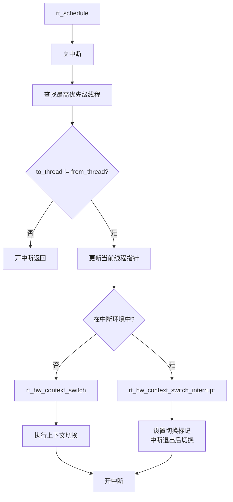
```mermaid
flowchart TD
    A[rt_schedule] --> B[关中断]
    B --> C[查找最高优先级线程]
    C --> D{to_thread != from_thread?}
    
    D -->|否| E[开中断返回]
    D -->|是| F[更新当前线程指针]
    
    F --> G{在中断环境中?}
    G -->|否| H[rt_hw_context_switch]
    G -->|是| I[rt_hw_context_switch_interrupt]
    
    H --> J[执行上下文切换]
    I --> K[设置切换标记<br/>中断退出后切换]
    
    J --> L[开中断]
    K --> L
```

---

### 3.4 线程初始化与启动

#### rt_sched_thread_init_priv（新建档案袋）

给线程分配初始的优先级和时间片，并将底层链表和掩码重置为干净状态。

```c
/**
 * @brief Initialize thread's scheduling private data
 * * [解析] 这个函数通常在 rt_thread_init() 或 rt_thread_create() 的底层被调用。
 * 它的核心任务是给刚刚分配好内存的线程控制块(TCB)，填上最基础的调度参数（优先级和时间片）。
 */
void rt_sched_thread_init_priv(struct rt_thread *thread, rt_uint32_t tick, rt_uint8_t priority)
{
    // [解析] 初始化线程内部自带的链表节点（相当于这个线程的“排队挂号单”）。
    // 将其前驱和后继指针都指向自己，形成闭环，防止野指针。
    rt_list_init(&RT_THREAD_LIST_NODE(thread));

    /* priority init */
    // [解析] 断言防御：确保传入的优先级数字没有越界（越界会导致后面算位图时内存溢出）。
    RT_ASSERT(priority < RT_THREAD_PRIORITY_MAX);
    
    // [解析] 为什么要有两个优先级记录？
    // init_priority 是“出厂设置”，永远不变。
    // current_priority 是“当前生效”的优先级。
    // 这是为了应对 RTOS 经典的“优先级反转”问题预留的伏笔：
    // 当低优先级拿了高优先级想要的锁时，系统会临时把 current_priority 提上去，等用完再用 init_priority 恢复。
    RT_SCHED_PRIV(thread).init_priority    = priority;
    RT_SCHED_PRIV(thread).current_priority = priority;

    /* don't add to scheduler queue as init thread */
    // [解析] 因为线程才刚建好，还没准备好运行，所以先把代表它在位图中位置的特征码全部清零。
    RT_SCHED_PRIV(thread).number_mask = 0;
#if RT_THREAD_PRIORITY_MAX > 32
    RT_SCHED_PRIV(thread).number = 0;
    RT_SCHED_PRIV(thread).high_mask = 0;
#endif /* RT_THREAD_PRIORITY_MAX > 32 */

    /* tick init */
    // [解析] 时间片分配：
    // init_tick：系统规定这个线程每次上场最多能运行几个 Tick。
    // remaining_tick：当前兜里还剩下多少 Tick。（同优先级线程轮转调度时，每过一个 Tick 减 1，减到 0 就换人）。
    RT_SCHED_PRIV(thread).init_tick = tick;
    RT_SCHED_PRIV(thread).remaining_tick = tick;
}


```

#### rt_sched_thread_startup（发放身份牌）

根据线程的优先级，提前算出它在调度器位图中对应的"专属掩码"，并将其状态改为挂起（SUSPEND），等待被正式唤醒。

```c
/**
 * @brief Initialize thread scheduling attributes for startup
 * * [解析] 当调用 rt_thread_startup() 准备让线程起飞时，会先调用这个函数。
 * 它的核心任务是：利用位运算，提前把线程在调度器“二维位图”中的坐标算好并缓存下来。
 */
void rt_sched_thread_startup(struct rt_thread *thread)
{
#if RT_THREAD_PRIORITY_MAX > 32
    // [解析] 当系统支持 256 级优先级时，RT-Thread 采用了一个 32(组) x 8(位) 的二维位图结构。
    
    // 算组号 (number)：将优先级除以 8 (即右移 3 位)。这就找到了该线程属于 32 个组里的哪一组。
    RT_SCHED_PRIV(thread).number = RT_SCHED_PRIV(thread).current_priority >> 3;            /* 5bit */
    
    // 算组掩码 (number_mask)：将 1 左移 number 位。
    // 将来用它来点亮全局变量 rt_thread_ready_priority_group 里的那盏灯，告诉系统“这一组里有线程就绪了”。
    RT_SCHED_PRIV(thread).number_mask = 1L << RT_SCHED_PRIV(thread).number;
    
    // 算组内掩码 (high_mask)：将优先级对 8 取模 (即与上 0x07)。
    // 将来用它来点亮 rt_thread_ready_table[number] 里的那盏灯，精确定位到具体的线程。
    RT_SCHED_PRIV(thread).high_mask = 1L << (RT_SCHED_PRIV(thread).current_priority & 0x07);  /* 3bit */
#else
    // [解析] 当系统只有 32 级优先级时，一个 32 位的整型变量就足够表示了（一维位图）。
    // 直接把 1 左移优先级数，算出唯一特征码即可。
    RT_SCHED_PRIV(thread).number_mask = 1L << RT_SCHED_PRIV(thread).current_priority;
#endif /* RT_THREAD_PRIORITY_MAX > 32 */

    /* change thread stat, so we can resume it */
    // [解析] 特征码算好了，状态置为挂起（SUSPEND）。
    // 此时它还没有真正进入就绪链表，外层函数接着会调用 rt_thread_resume() 把它正式挂入链表。
    RT_SCHED_CTX(thread).stat = RT_THREAD_SUSPEND;
}
```

#### 线程初始化流程

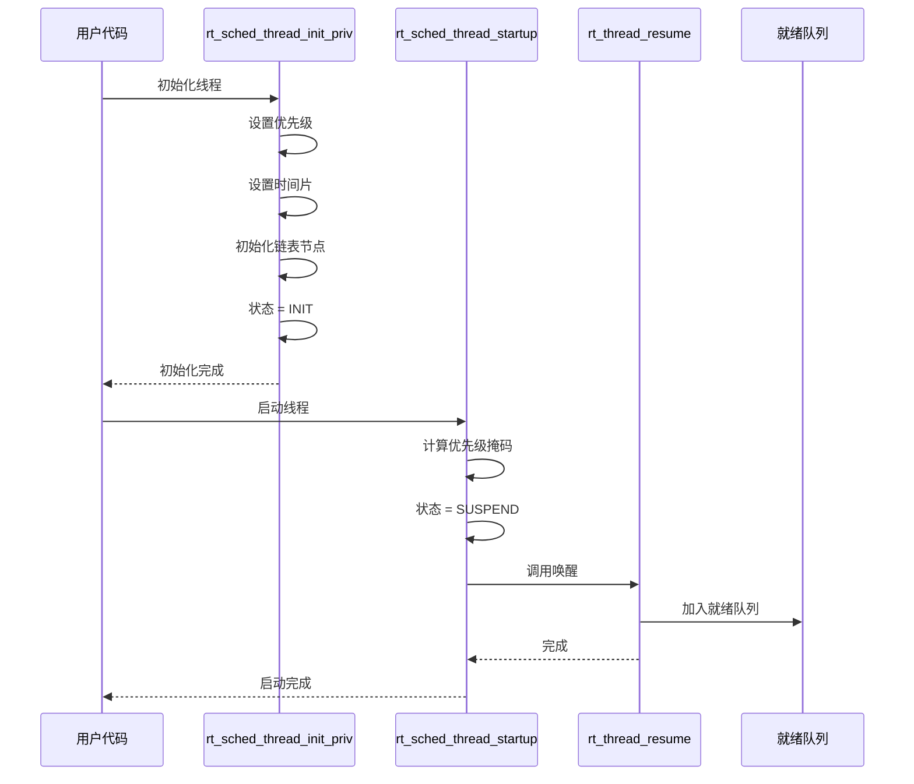
```mermaid
sequenceDiagram
    participant User as 用户代码
    participant Init as rt_sched_thread_init_priv
    participant Startup as rt_sched_thread_startup
    participant Resume as rt_thread_resume
    participant Queue as 就绪队列
    
    User->>Init: 初始化线程
    Init->>Init: 设置优先级
    Init->>Init: 设置时间片
    Init->>Init: 初始化链表节点
    Init->>Init: 状态 = INIT
    Init-->>User: 初始化完成
    
    User->>Startup: 启动线程
    Startup->>Startup: 计算优先级掩码
    Startup->>Startup: 状态 = SUSPEND
    Startup->>Resume: 调用唤醒
    Resume->>Queue: 加入就绪队列
    Resume-->>Startup: 完成
    Startup-->>User: 启动完成
```

---

### 3.5 线程插入与删除

#### rt_sched_insert_thread（插入就绪队列）

```c
/**
 * @brief This function will insert a thread to the system ready queue.
 * @note  Please do not invoke this function in user application.
 * // [解析] 这是内核私有函数。普通应用写代码只能用 rt_thread_startup 或 rt_thread_resume，
 * // 它们在底层最终都会调用这个函数把线程“挂号”到调度器里。
 */
void rt_sched_insert_thread(struct rt_thread *thread)
{
    rt_base_t level;

    RT_ASSERT(thread != RT_NULL);

    /* disable interrupt */
    // [解析] 操作全局就绪链表和位图，是极其危险的动作，必须关中断进入临界区。
    level = rt_hw_interrupt_disable();

    /* it's current thread, it should be RUNNING thread */
    // [解析] 特殊情况：如果要求插入的线程恰好就是当前正在运行的线程。
    // 这说明它没有被人抢占，只是想刷新一下自己的状态。
    if (thread == rt_current_thread)
    {
        // 强制清除它旧的状态（通过位掩码消除），只保留 RUNNING 状态。
        RT_SCHED_CTX(thread).stat = RT_THREAD_RUNNING | (RT_SCHED_CTX(thread).stat & ~RT_THREAD_STAT_MASK);
        goto __exit; // 直接退出，不需要操作链表。
    }

    /* READY thread, insert to ready queue */
    // [解析] 正常情况：把状态改为 READY（就绪态）。
    RT_SCHED_CTX(thread).stat = RT_THREAD_READY | (RT_SCHED_CTX(thread).stat & ~RT_THREAD_STAT_MASK);
    
    /* there is no time slices left(YIELD), inserting thread before ready list*/
    // [解析] 这里是 RTOS “时间片轮转”调度的核心逻辑！
    // 如果这个线程的 YIELD 标志位是 1（说明它是主动让出 CPU，或者是时间片耗尽了被赶下来的）
    if((RT_SCHED_CTX(thread).stat & RT_THREAD_STAT_YIELD_MASK) != 0)
    {
        // 惩罚机制：把它插入到该优先级链表的**最前面**的**前驱**（也就是队尾）。
        // 这样一来，链表中其他同优先级的兄弟就能排到它前面去执行了。
        rt_list_insert_before(&(rt_thread_priority_table[RT_SCHED_PRIV(thread).current_priority]),
                              &RT_THREAD_LIST_NODE(thread));
    }
    /* there are some time slices left, inserting thread after ready list to schedule it firstly at next time*/
    else
    {
        // 优待机制：如果它是刚刚创建、或者刚刚被唤醒（时间片没用完），
        // 就把它插入到该优先级链表的**最前面**的**后继**（也就是队头）。
        // 这样下一次调度同优先级时，它能第一个上场。
        rt_list_insert_after(&(rt_thread_priority_table[RT_SCHED_PRIV(thread).current_priority]),
                              &RT_THREAD_LIST_NODE(thread));
    }

    LOG_D("insert thread[%.*s], the priority: %d", ...);

    /* set priority mask */
    // [解析] 链表挂好了，接下来是给位图“点灯”。
    // 这两个 mask 就是我们在上一个函数 `rt_sched_thread_startup` 里提前算好的。
#if RT_THREAD_PRIORITY_MAX > 32
    // 如果是 256 优先级，先点亮第 number 组内部的灯。
    rt_thread_ready_table[RT_SCHED_PRIV(thread).number] |= RT_SCHED_PRIV(thread).high_mask;
#endif /* RT_THREAD_PRIORITY_MAX > 32 */
    
    // 点亮全局位图上的组指示灯（如果是 32 级优先级，这就是唯一的那盏灯）。
    // 告诉调度器：“老子在这排队了，有空来看看！”
    rt_thread_ready_priority_group |= RT_SCHED_PRIV(thread).number_mask;

__exit:
    /* enable interrupt */
    // [解析] 撤销警戒线，开中断。
    rt_hw_interrupt_enable(level);
}


```

#### rt_sched_remove_thread（移出就绪队列）

```c
/**
 * @brief This function will remove a thread from system ready queue.
 */
void rt_sched_remove_thread(struct rt_thread *thread)
{
    rt_base_t level;

    RT_ASSERT(thread != RT_NULL);

    /* disable interrupt */
    level = rt_hw_interrupt_disable(); // 必须关中断！

    LOG_D("remove thread[%.*s], the priority: %d", ...);

    /* remove thread from ready list */
    // [解析] 第一步：先把这哥们从挂号队伍（双向链表）里踢出去。
    rt_list_remove(&RT_THREAD_LIST_NODE(thread));
    
    // [解析] 第二步：核心判断！
    // 踢走一个人不难，难的是要不要把位图上的“灯”灭掉。
    // 如果这哥们是这个优先级里排队的最后一个人（也就是把这哥们踢走后，这个优先级链表空了），
    // 那么就必须把对应的灯灭掉。否则调度器找过来发现没人，系统会崩溃。
    if (rt_list_isempty(&(rt_thread_priority_table[RT_SCHED_PRIV(thread).current_priority])))
    {
#if RT_THREAD_PRIORITY_MAX > 32
        // 如果是 256 级优先级：
        // 1. 先把这个组内的对应灯灭掉（按位与上取反的掩码 `&= ~mask`）。
        rt_thread_ready_table[RT_SCHED_PRIV(thread).number] &= ~RT_SCHED_PRIV(thread).high_mask;
        
        // 2. 如果灭掉这盏灯之后，发现整个组（8个位）全黑了（== 0），
        if (rt_thread_ready_table[RT_SCHED_PRIV(thread).number] == 0)
        {
            // 才允许去灭掉 32 位全局位图上对应的组指示灯。
            rt_thread_ready_priority_group &= ~RT_SCHED_PRIV(thread).number_mask;
        }
#else
        // 如果是 32 级优先级，直接把全局位图上的这盏灯灭掉即可。
        rt_thread_ready_priority_group &= ~RT_SCHED_PRIV(thread).number_mask;
#endif /* RT_THREAD_PRIORITY_MAX > 32 */
    }

    /* enable interrupt */
    rt_hw_interrupt_enable(level); // 开中断
}
```

#### 双向链表与位图的"共生关系"

这是 RTOS 调度器最美妙的设计之一：

- **双向链表**（`rt_thread_priority_table`）：负责存储"真正的病人档案（线程指针）"，但遍历链表太慢了。
- **位图**（`rt_thread_ready_priority_group`）：作为"挂号室外面的电子屏幕"，快速指示哪些优先级有就绪线程。

`insert` 和 `remove` 这两个函数，本质上就是在维护这块"屏幕"的准确性。进人必亮灯，走人必查空。这保证了调度器在后续找最高优先级线程时，完全不需要碰链表，只看这块"屏幕"就能一击命中。

#### 插入删除流程图

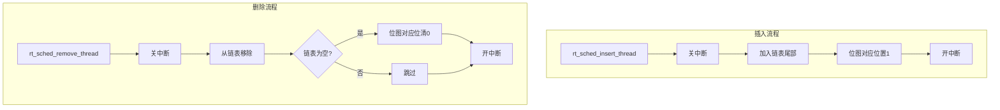
```mermaid
flowchart TD
    subgraph 插入流程
        A1[rt_sched_insert_thread] --> A2[关中断]
        A2 --> A3[加入链表尾部]
        A3 --> A4[位图对应位置1]
        A4 --> A5[开中断]
    end
    
    subgraph 删除流程
        B1[rt_sched_remove_thread] --> B2[关中断]
        B2 --> B3[从链表移除]
        B3 --> B4{链表为空?}
        B4 -->|是| B5[位图对应位清0]
        B4 -->|否| B6[跳过]
        B5 --> B7[开中断]
        B6 --> B7
    end
```

---

### 3.6 调度器锁机制

#### rt_enter_critical / rt_exit_critical

这是**"调度器锁"**。通过增加一个嵌套计数器（`rt_scheduler_lock_nest`），来**禁止系统进行线程切换**，但**不禁止硬件中断**。

```c
/**
 * @brief Enter critical section and lock the scheduler
 * // [解析] 所谓的“进入临界区（调度级）”，其实就是给调度器上锁。
 */
rt_base_t rt_enter_critical(void)
{
    rt_base_t critical_level;

    // [解析] rt_atomic_add 是一个原子操作（底层也会有关中断/开中断的保护）。
    // 它将全局变量 rt_scheduler_lock_nest 的值加 1。
    // 只要这个计数器大于 0，调度器 (rt_schedule) 即使被触发了，也会直接 return，不执行线程切换。
    critical_level = rt_atomic_add(&rt_scheduler_lock_nest, 1) + 1;
    
    // [解析] 返回当前的嵌套层级，方便后面调用 rt_exit_critical_safe 时进行匹配校验。
    return critical_level;
}

/**
 * @brief Exit critical section and unlock scheduler
 * // [解析] 解除调度器锁。如果计数器清零，还要顺便处理一下积压的调度请求。
 */
void rt_exit_critical(void)
{
    rt_base_t level;

    /* disable interrupt */
    // [解析] 为什么操作一个普通的计数器也要关中断？
    // 因为这几行代码（减计数、判断、清零、顺带调度）必须一气呵成，不能中途被其他中断打断。
    level = rt_hw_interrupt_disable();

    // [解析] 嵌套层数减 1，表示扒掉了一层锁。
    rt_scheduler_lock_nest --;
    
    // [解析] 如果计数器归零（或者因为出错导致小于0），说明最后一层大门终于打开了。
    if (rt_scheduler_lock_nest <= 0)
    {
        rt_scheduler_lock_nest = 0;
        /* enable interrupt */
        // [解析] 注意这里的时序！在判断需要不需要调度之前，先把中断打开。
        // 因为 rt_schedule() 内部会有它自己的一套关开中断逻辑，不能带锁进入。
        rt_hw_interrupt_enable(level);

        // [解析] 关键逻辑：“秋后算账”！
        // 在调度器被锁住的这段时间里，如果有高优先级线程就绪了，调度器没法切，
        // 但它会置位这个标志：IS_CRITICAL_SWITCH_PEND()。
        // 现在大门开了，必须立刻执行一次迟到的调度 (rt_schedule)。
        if (IS_CRITICAL_SWITCH_PEND())
        {
            CLR_CRITICAL_SWITCH_FLAG();
            rt_schedule();
        }
    }
    else
    {
        /* enable interrupt */
        // [解析] 嵌套还没清零，说明外面还有锁罩着，直接开中断走人即可。
        rt_hw_interrupt_enable(level);
    }
}

/**
 * @brief Safely exit critical section with level checking
 * // [解析] 这是 Debug 模式专属的“防呆解锁”函数。
 */
#ifdef RT_DEBUGING_CRITICAL
void rt_exit_critical_safe(rt_base_t critical_level)
{
    rt_base_t level;
    level = rt_hw_interrupt_disable();

    // [解析] _critical_error_occurred 是一个防死循环的标志。
    if (!_critical_error_occurred)
    {
        // [解析] 核心校验：你传入的解锁钥匙(critical_level) ，
        // 必须和当前大门上挂着的锁的层数(rt_scheduler_lock_nest) 一模一样！
        if (critical_level != rt_scheduler_lock_nest)
        {
            int dummy = 1;
            _critical_error_occurred = 1;

            // [解析] 如果不一样，说明代码写错了！（比如：加锁1次，却解锁了2次；或者在A函数加锁，在不同层级的B函数乱解锁）。
            // 打印极其详尽的案发现场（函数名、当前层级、传入层级，甚至追溯调用栈）。
            rt_kprintf("%s: un-compatible critical level\n" \
                       "\tCurrent %d\n\tCaller %d\n", ...);
            rt_backtrace();

            // [解析] 直接将系统卡死在这里（while(1)），因为调度器锁乱了，系统继续跑必崩无疑。早死早超生。
            while (dummy) ;
        }
    }
    rt_hw_interrupt_enable(level);

    // [解析] 校验通过后，才去调用真正的解锁函数。
    rt_exit_critical();
}
#endif
```

#### 关中断 vs 调度器锁

初学者最容易死在一个问题上：**既然已经有了 `rt_hw_interrupt_disable`（关中断），为什么还要搞一个 `rt_enter_critical`（调度器锁）？它们有什么区别？**

我们用一个"医院"的比喻来彻底讲透：

##### 关中断（rt_hw_interrupt_disable）

相当于**把整个医院的大门锁死**，任何人（包括急诊病人）都进不来。这是最强硬的手段，但代价极大——系统无法响应任何外部事件，实时性被完全破坏。

##### 调度器锁（rt_enter_critical）

相当于**只锁住诊室的门**，急诊病人（中断）依然可以进来挂号，但医生（CPU）不会换人，始终由当前线程继续看病。这比关中断温和得多，实时性影响较小。

#### 对比表格

| 特性 | 关中断 | 调度器锁 |
|------|--------|----------|
| 中断响应 | **禁止** | **允许** |
| 线程切换 | 禁止 | 禁止 |
| 实时性影响 | 极大 | 较小 |
| 适用场景 | 极短临界区 | 较长临界区 |
| 嵌套支持 | 需手动保存状态 | 自动计数器支持 |

#### 调度器锁流程

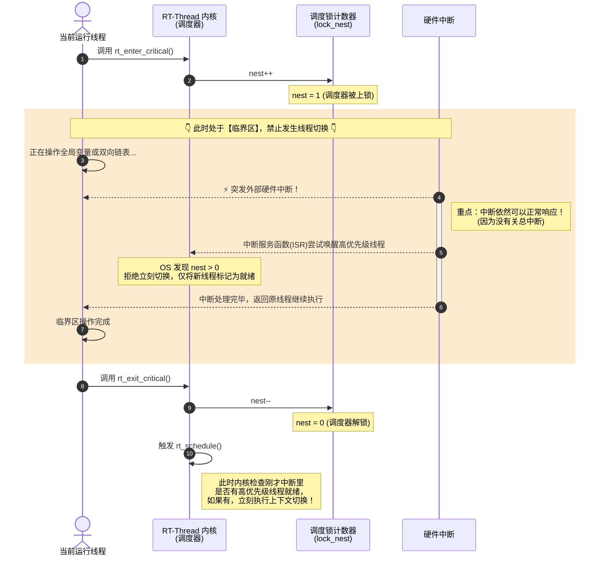
```mermaid
sequenceDiagram
    autonumber
    
    %% 定义角色与样式
    actor Thread as 当前运行线程
    participant OS as RT-Thread 内核<br>(调度器)
    participant Counter as 调度锁计数器<br>(lock_nest)
    participant HW as 硬件中断

    Thread->>OS: 调用 rt_enter_critical()
    OS->>Counter: nest++
    Note over Counter: nest = 1 (调度器被上锁)
    
    rect rgb(253, 235, 208)
        Note over Thread, HW: 👇 此时处于【临界区】，禁止发生线程切换 👇
        
        Thread->>Thread: 正在操作全局变量或双向链表...
        
        %% 模拟突发中断
        HW-->>Thread: ⚡ 突发外部硬件中断！
        activate HW
        Note right of HW: 重点：中断依然可以正常响应！<br/>(因为没有关总中断)
        HW-->>OS: 中断服务函数(ISR)尝试唤醒高优先级线程
        Note over OS: OS 发现 nest > 0 <br/>拒绝立刻切换，仅将新线程标记为就绪
        HW-->>Thread: 中断处理完毕，返回原线程继续执行
        deactivate HW
        
        Thread->>Thread: 临界区操作完成
    end

    Thread->>OS: 调用 rt_exit_critical()
    OS->>Counter: nest--
    Note over Counter: nest = 0 (调度器解锁)
    
    OS->>OS: 触发 rt_schedule()
    Note right of OS: 此时内核检查刚才中断里<br/>是否有高优先级线程就绪，<br/>如果有，立刻执行上下文切换！
```


# 第四部分：核心问题解答

---

## 四、核心问题解答

### 4.1 位图与链表实现

#### Q1：位图和链表的实现是如何实现的？

##### 核心数据结构

```c
/* 位图：32 位整数 */
rt_uint32_t rt_thread_ready_priority_group;

/* 链表数组：32 个双向链表头 */
rt_list_t rt_thread_priority_table[32];
```

##### 位图操作原理

位图本质上是一个"快速索引表"，用于 O(1) 时间复杂度内找到最高优先级。

```c
/* 设置位图某一位（表示该优先级有线程就绪） */
rt_thread_ready_priority_group |= (1 << priority);

/* 清除位图某一位（表示该优先级无线程就绪） */
rt_thread_ready_priority_group &= ~(1 << priority);

/* 查找最高优先级（找到最低位的 1） */
priority = __rt_ffs(rt_thread_ready_priority_group) - 1;
```

##### __rt_ffs（Find First Set）函数

```c
/* 内置函数或汇编实现 */
int __rt_ffs(rt_uint32_t value)
{
    if (value == 0) return 0;
    
    int pos = 1;
    if ((value & 0xFFFF) == 0) { pos += 16; value >>= 16; }
    if ((value & 0xFF) == 0)   { pos += 8;  value >>= 8;  }
    if ((value & 0xF) == 0)    { pos += 4;  value >>= 4;  }
    if ((value & 0x3) == 0)    { pos += 2;  value >>= 2;  }
    if ((value & 0x1) == 0)    { pos += 1; }
    
    return pos;
}
```

##### 链表操作原理

```c
/* 初始化链表头 */
void rt_list_init(rt_list_t *l)
{
    l->next = l->next = l;
}

/* 在链表尾部插入节点 */
void rt_list_insert_after(rt_list_t *l, rt_list_t *n)
{
    l->prev->next = n;
    n->prev = l->prev;
    n->next = l;
    l->prev = n;
}

/* 从链表中移除节点 */
void rt_list_remove(rt_list_t *n)
{
    n->next->prev = n->prev;
    n->prev->next = n->next;
    n->next = n->prev = n;
}
```

##### 位图与链表协同工作流程

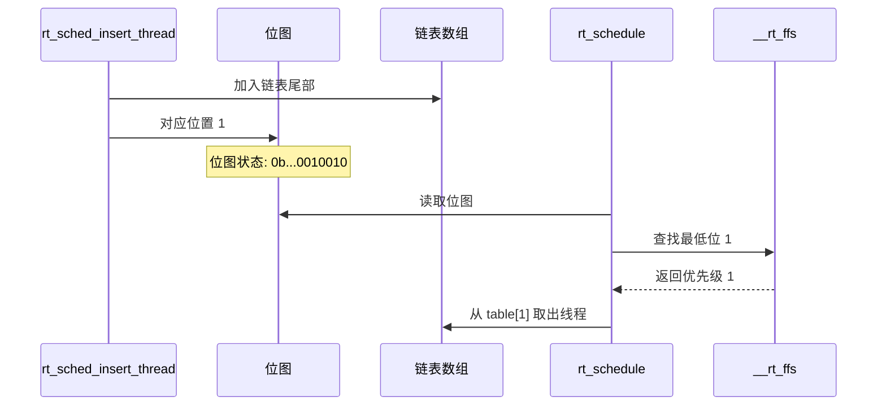
```mermaid
sequenceDiagram
    participant Insert as rt_sched_insert_thread
    participant Bitmap as 位图
    participant List as 链表数组
    
    Insert->>List: 加入链表尾部
    Insert->>Bitmap: 对应位置 1
    
    Note over Bitmap: 位图状态: 0b...0010010
    
    participant Schedule as rt_schedule
    participant FFS as __rt_ffs
    
    Schedule->>Bitmap: 读取位图
    Schedule->>FFS: 查找最低位 1
    FFS-->>Schedule: 返回优先级 1
    Schedule->>List: 从 table[1] 取出线程
```

##### 时间复杂度分析

| 操作 | 时间复杂度 | 说明 |
|------|------------|------|
| 插入线程 | O(1) | 直接操作链表和位图 |
| 删除线程 | O(1) | 直接操作链表和位图 |
| 查找最高优先级 | O(1) | 位图 + FFS 算法 |
| 遍历所有就绪线程 | O(n) | 需要遍历链表 |

---

### 4.2 状态掩码操作

#### Q2：这个掩码的操作是什么？

```c
RT_SCHED_CTX(thread).stat = RT_THREAD_RUNNING | 
    (RT_SCHED_CTX(thread).stat & ~RT_THREAD_STAT_MASK);
```

##### 问题背景

这行代码看起来非常晦涩，但它实际上是 RT-Thread 线程状态管理的核心技巧。

##### 状态定义

```c
/* 线程状态掩码 */
#define RT_THREAD_STAT_MASK     0x1F    /* 低 5 位存储状态 */

/* 线程状态值 */
#define RT_THREAD_INIT          0x00
#define RT_THREAD_READY         0x01
#define RT_THREAD_SUSPEND       0x02
#define RT_THREAD_RUNNING       0x03
#define RT_THREAD_CLOSE         0x04

/* 线程标志位（高 3 位） */
#define RT_THREAD_STAT_YIELD    0x10    /* 让出 CPU 标志 */
#define RT_THREAD_STAT_SIGNAL   0x20    /* 信号标志 */
```

##### 位操作解析

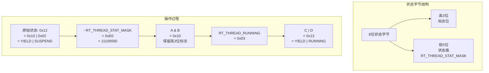
```mermaid
graph TB
    subgraph 状态字节结构
        BYTE["8位状态字节"]
        BYTE --> HIGH["高3位<br/>标志位"]
        BYTE --> LOW["低5位<br/>状态值<br/>RT_THREAD_STAT_MASK"]
    end
    
    subgraph 操作过程
        A["原始状态: 0x12<br/>= 0x10 | 0x02<br/>= YIELD | SUSPEND"]
        B["~RT_THREAD_STAT_MASK<br/>= 0xE0<br/>= 11100000"]
        C["A & B<br/>= 0x10<br/>保留高3位标志"]
        D["RT_THREAD_RUNNING<br/>= 0x03"]
        E["C | D<br/>= 0x13<br/>= YIELD | RUNNING"]
    end
    
    A --> B --> C --> D --> E
```

##### 代码等价展开

```c
/* 原始代码 */
thread->stat = RT_THREAD_RUNNING | (thread->stat & ~RT_THREAD_STAT_MASK);

/* 等价展开 */
rt_uint8_t old_flags = thread->stat & ~RT_THREAD_STAT_MASK;  /* 保留高3位标志 */
thread->stat = RT_THREAD_RUNNING | old_flags;                 /* 设置新状态 + 保留标志 */

/* 更直观的写法 */
thread->stat = (thread->stat & 0xE0) | RT_THREAD_RUNNING;
```

##### 设计意图

这种设计允许线程状态和标志位**共存于一个字节**中：

- **低 5 位**：存储线程的实际状态（INIT/READY/RUNNING/SUSPEND/CLOSE）
- **高 3 位**：存储额外的标志位（YIELD/SIGNAL 等）

这样既节省了内存，又能在状态切换时保留标志位信息。

---

### 4.3 调度器锁详解

#### Q3：调度器锁到底是干什么的？

##### 核心概念

`rt_enter_critical` / `rt_exit_critical` 是**"调度器锁"**，通过增加一个嵌套计数器（`rt_scheduler_lock_nest`），来**禁止系统进行线程切换**，但**不禁止硬件中断**。

##### 与关中断的区别

| 特性 | 关中断 | 调度器锁 |
|------|--------|----------|
| 中断响应 | **禁止** | **允许** |
| 线程切换 | 禁止 | 禁止 |
| 实时性影响 | 极大 | 较小 |
| 适用场景 | 极短临界区 | 较长临界区 |
| 嵌套支持 | 需手动保存状态 | 自动计数器支持 |

##### 医院比喻

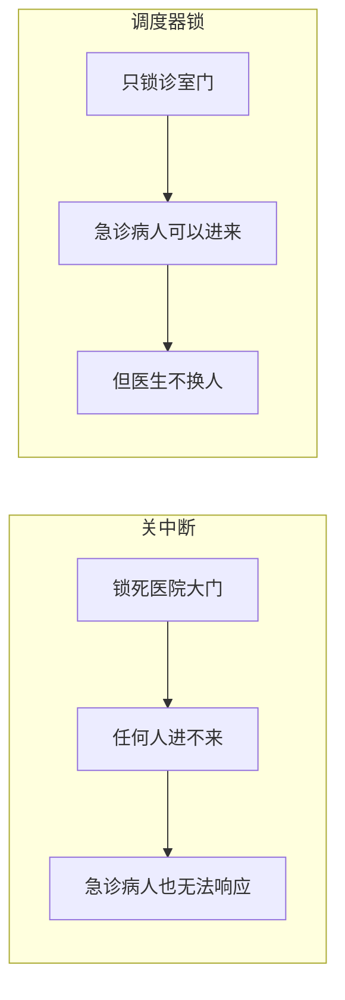
```mermaid
graph LR
    subgraph 关中断
        A1[锁死医院大门] --> A2[任何人进不来]
        A2 --> A3[急诊病人也无法响应]
    end
    
    subgraph 调度器锁
        B1[只锁诊室门] --> B2[急诊病人可以进来]
        B2 --> B3[但医生不换人]
    end
```

##### 典型应用场景

```c
/* 场景1：保护较长的临界区 */
rt_enter_critical();

/* 一系列操作... */
for (int i = 0; i < 1000; i++)
{
    process_data(buffer[i]);
}

rt_exit_critical();

/* 场景2：嵌套调用 */
void func_a(void)
{
    rt_enter_critical();
    /* ... */
    func_b();  /* 内部也会调用 enter_critical */
    /* ... */
    rt_exit_critical();
}

void func_b(void)
{
    rt_enter_critical();  /* nest = 2 */
    /* ... */
    rt_exit_critical();   /* nest = 1，不会触发调度 */
}
```

##### 嵌套计数器原理

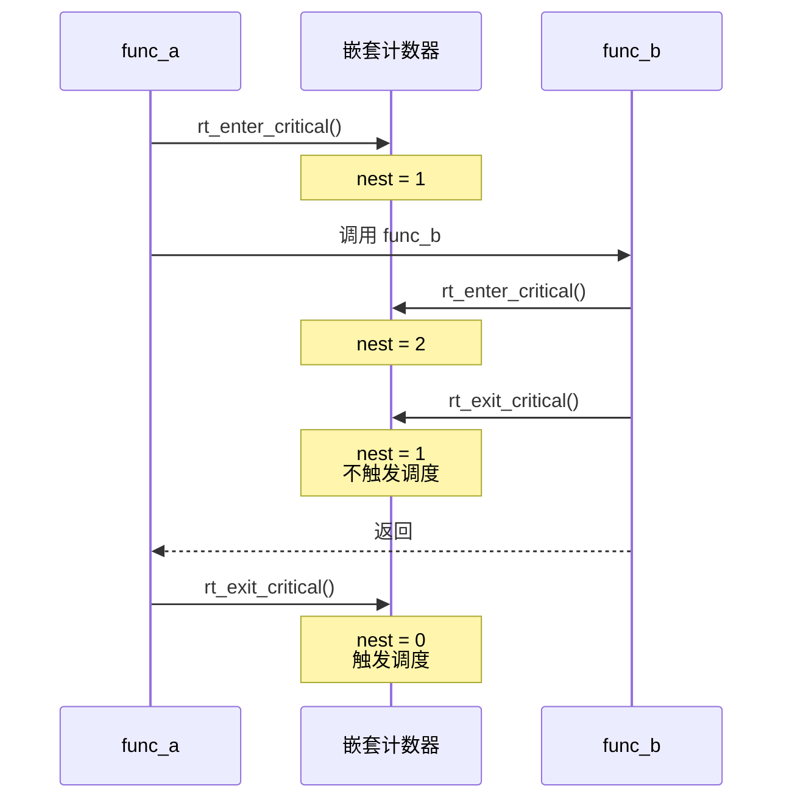
```mermaid
sequenceDiagram
    participant A as func_a
    participant Counter as 嵌套计数器
    participant B as func_b
    
    A->>Counter: rt_enter_critical()
    Note over Counter: nest = 1
    
    A->>B: 调用 func_b
    B->>Counter: rt_enter_critical()
    Note over Counter: nest = 2
    
    B->>Counter: rt_exit_critical()
    Note over Counter: nest = 1<br/>不触发调度
    
    B-->>A: 返回
    A->>Counter: rt_exit_critical()
    Note over Counter: nest = 0<br/>触发调度
```

---

### 4.4 上下文切换时机

#### Q4：为什么需要区分两种上下文切换？

```c
rt_hw_context_switch          /* 普通线程环境 */
rt_hw_context_switch_interrupt /* 中断环境 */
```

##### 根本原因

这是底层的硬件架构决定的（尤其是 ARM Cortex-M 架构）。

##### 普通线程环境

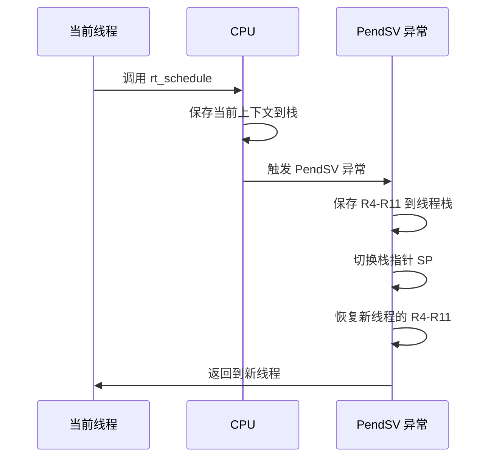
```mermaid
sequenceDiagram
    participant Thread as 当前线程
    participant CPU as CPU
    participant PendSV as PendSV 异常
    
    Thread->>CPU: 调用 rt_schedule
    CPU->>CPU: 保存当前上下文到栈
    CPU->>PendSV: 触发 PendSV 异常
    PendSV->>PendSV: 保存 R4-R11 到线程栈
    PendSV->>PendSV: 切换栈指针 SP
    PendSV->>PendSV: 恢复新线程的 R4-R11
    PendSV->>Thread: 返回到新线程
```

##### 中断环境

如果当前正在执行一个硬件中断（比如串口接收中断，此时 `rt_interrupt_nest > 0`），绝不能立刻进行任务切换！

因为硬件中断的上下文和普通线程是完全不同的。`rt_hw_context_switch_interrupt` 的作用通常是"仅仅打个标记"（设置 PendSV 挂起位），等中断退出后，CPU 再自动触发切换。

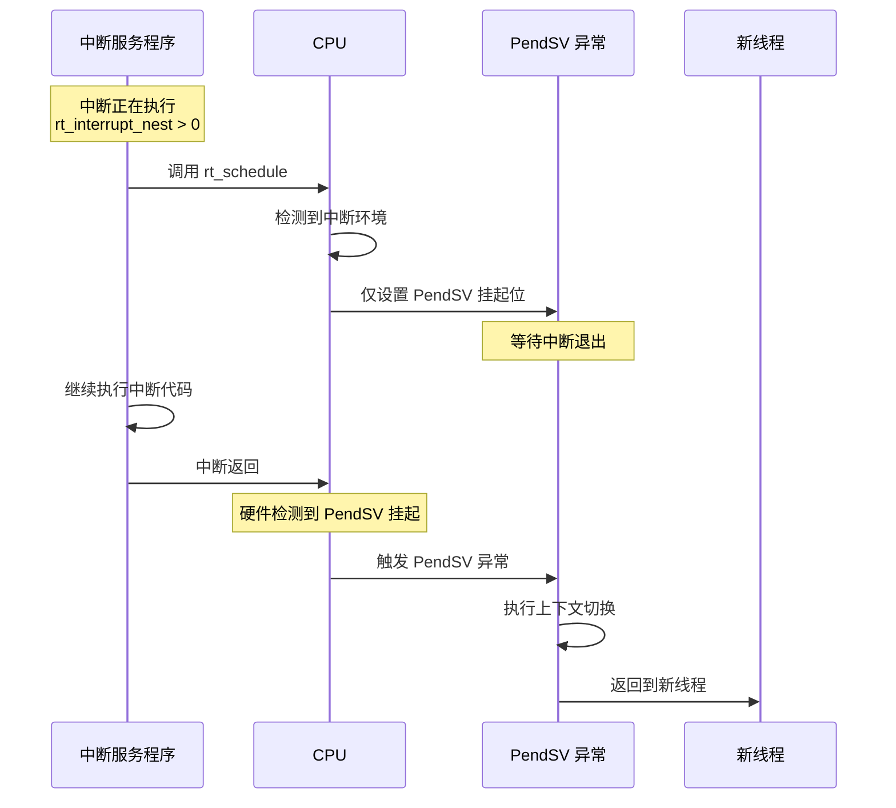
```mermaid
sequenceDiagram
    participant ISR as 中断服务程序
    participant CPU as CPU
    participant PendSV as PendSV 异常
    participant Thread as 新线程
    
    Note over ISR: 中断正在执行<br/>rt_interrupt_nest > 0
    
    ISR->>CPU: 调用 rt_schedule
    CPU->>CPU: 检测到中断环境
    CPU->>PendSV: 仅设置 PendSV 挂起位
    Note over PendSV: 等待中断退出
    
    ISR->>ISR: 继续执行中断代码
    ISR->>CPU: 中断返回
    
    Note over CPU: 硬件检测到 PendSV 挂起
    CPU->>PendSV: 触发 PendSV 异常
    PendSV->>PendSV: 执行上下文切换
    PendSV->>Thread: 返回到新线程
```

##### 为什么中断环境不能直接切换？

| 原因 | 说明 |
|------|------|
| 栈结构不同 | 中断使用 MSP（主栈），线程使用 PSP（进程栈） |
| 返回地址不同 | 中断返回地址由硬件压栈，不能随意修改 |
| 优先级问题 | 中断优先级高于 PendSV，直接切换会导致异常 |
| 状态不一致 | 中断上下文保存不完整，直接切换会丢失数据 |

---

### 4.5 延迟处理模式

#### Q5：调度器上锁时如何处理调度请求？

当系统发现自己处于"调度器上锁"状态时，它并没有简单粗暴地忽略这次调度请求，而是通过 `SET_CRITICAL_SWITCH_FLAG()` 记录下来。

##### 延迟处理机制

```c
void rt_schedule(void)
{
    /* ... */
    
    if (rt_scheduler_lock_nest > 0)
    {
        /* 调度器已上锁，记录切换请求 */
        SET_CRITICAL_SWITCH_FLAG();
        return;
    }
    
    /* 正常调度流程 */
    /* ... */
}

void rt_exit_critical(void)
{
    rt_scheduler_lock_nest--;
    
    if (rt_scheduler_lock_nest <= 0)
    {
        rt_scheduler_lock_nest = 0;
        
        /* 检查是否有延迟的调度请求 */
        if (GET_CRITICAL_SWITCH_FLAG())
        {
            CLEAR_CRITICAL_SWITCH_FLAG();
            rt_schedule();  /* 执行延迟的调度 */
        }
    }
}
```

##### 延迟处理流程

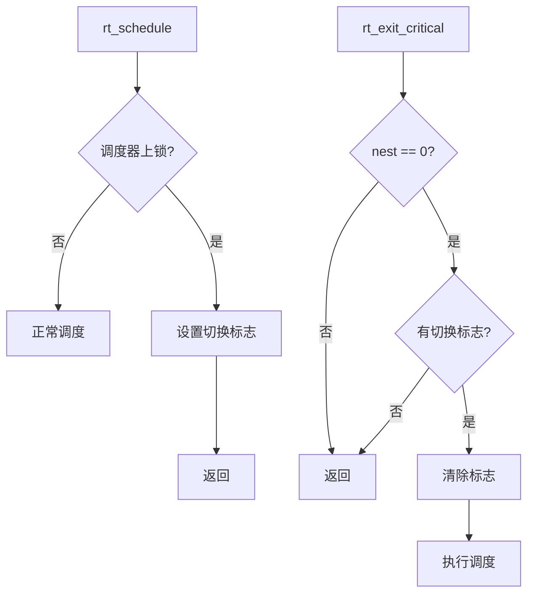
```mermaid
flowchart TD
    A[rt_schedule] --> B{调度器上锁?}
    B -->|否| C[正常调度]
    B -->|是| D[设置切换标志]
    D --> E[返回]
    
    F[rt_exit_critical] --> G{nest == 0?}
    G -->|否| H[返回]
    G -->|是| I{有切换标志?}
    I -->|否| H
    I -->|是| J[清除标志]
    J --> K[执行调度]
```

##### 设计启示

这是一种非常优雅的解耦设计，确保了系统既能保护临界区，又不会丢失高优先级线程的响应要求。


# 第五部分 + 第六部分：架构设计思考 + 总结

---

## 五、架构设计思考

### 5.1 延迟处理模式

#### 设计哲学

当系统发现自己处于"调度器上锁"状态时，它并没有简单粗暴地忽略这次调度请求，而是通过 `SET_CRITICAL_SWITCH_FLAG()` 记录下来。这是一种非常优雅的解耦设计，确保了系统既能保护临界区，又不会丢失高优先级线程的响应要求。

#### 实现机制

```c
/* 调度器上锁时的调度请求 */
void rt_schedule(void)
{
    if (rt_scheduler_lock_nest > 0)
    {
        /* 不忽略，而是记录 */
        SET_CRITICAL_SWITCH_FLAG();
        return;
    }
    /* ... 正常调度 ... */
}

/* 解锁时检查并执行延迟的调度 */
void rt_exit_critical(void)
{
    rt_scheduler_lock_nest--;
    
    if (rt_scheduler_lock_nest <= 0)
    {
        rt_scheduler_lock_nest = 0;
        
        if (GET_CRITICAL_SWITCH_FLAG())
        {
            CLEAR_CRITICAL_SWITCH_FLAG();
            rt_schedule();  /* 执行延迟的调度 */
        }
    }
}
```

#### 延迟处理流程

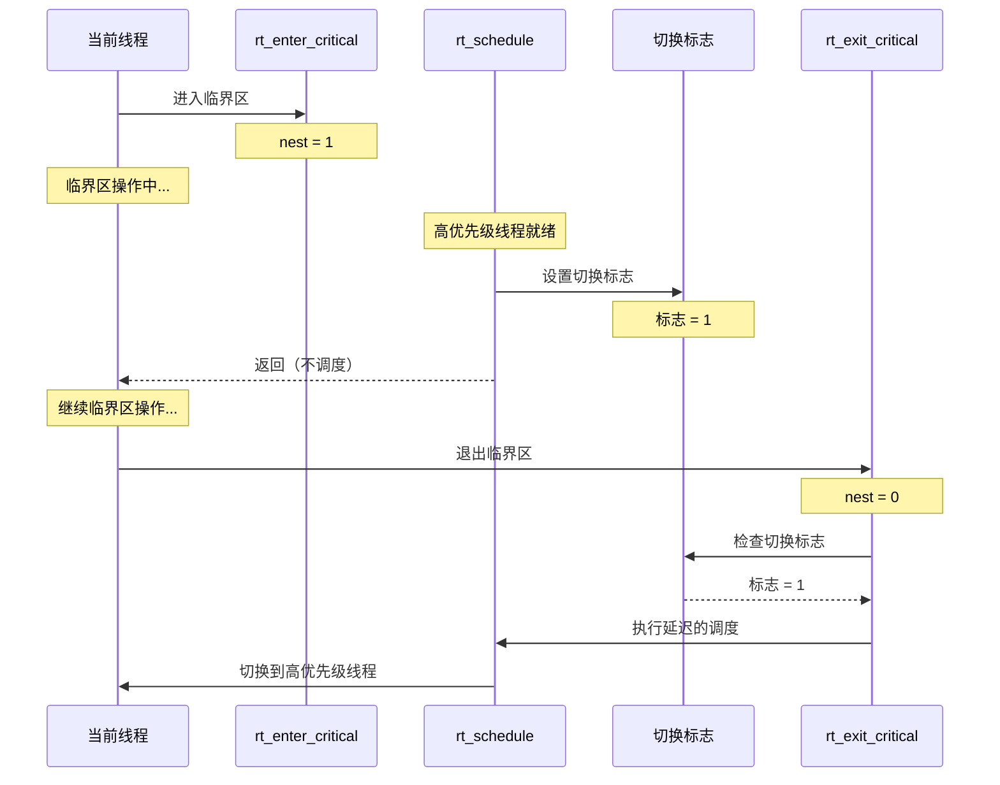
```mermaid
sequenceDiagram
    participant Thread as 当前线程
    participant Lock as rt_enter_critical
    participant Schedule as rt_schedule
    participant Flag as 切换标志
    participant Unlock as rt_exit_critical
    
    Thread->>Lock: 进入临界区
    Note over Lock: nest = 1
    
    Note over Thread: 临界区操作中...
    
    Note over Schedule: 高优先级线程就绪
    Schedule->>Flag: 设置切换标志
    Note over Flag: 标志 = 1
    Schedule-->>Thread: 返回（不调度）
    
    Note over Thread: 继续临界区操作...
    
    Thread->>Unlock: 退出临界区
    Note over Unlock: nest = 0
    Unlock->>Flag: 检查切换标志
    Flag-->>Unlock: 标志 = 1
    Unlock->>Schedule: 执行延迟的调度
    Schedule->>Thread: 切换到高优先级线程
```

#### 设计启示

| 传统做法 | 延迟处理模式 |
|----------|--------------|
| 忽略调度请求 | 记录调度请求 |
| 可能丢失高优先级响应 | 保证响应不丢失 |
| 简单但不安全 | 复杂但可靠 |

---

### 5.2 极致的防御性编程

#### 设计哲学

在内核开发中，不能假设上层逻辑是绝对完美的。在每次循环或调度核心点，强行将状态机拨正，是保持系统长期稳定运行的秘诀。

#### 典型实践

```c
void rt_schedule(void)
{
    /* ... */
    
    /* 强制清除 YIELD 标志 */
    thread->stat &= ~RT_THREAD_STAT_YIELD;
    
    /* 强制重置 RUNNING 状态 */
    thread->stat = RT_THREAD_RUNNING | (thread->stat & ~RT_THREAD_STAT_MASK);
    
    /* ... */
}
```

#### 防御性编程检查清单

| 检查项 | 实现方式 | 目的 |
|--------|----------|------|
| 参数有效性 | `RT_ASSERT(ptr != RT_NULL)` | 防止空指针崩溃 |
| 数组边界 | `RT_ASSERT(index < MAX)` | 防止越界访问 |
| 状态一致性 | 强制重置状态 | 防止状态异常 |
| 锁配对检查 | 嵌套计数器 | 防止死锁 |
| 中断嵌套检查 | `rt_interrupt_nest` | 防止上下文错误 |

#### 防御性编程流程

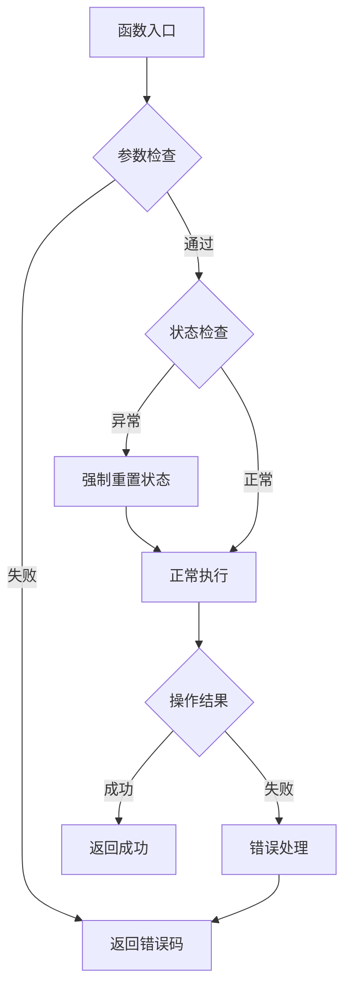
```mermaid
flowchart TD
    A[函数入口] --> B{参数检查}
    B -->|失败| C[返回错误码]
    B -->|通过| D{状态检查}
    
    D -->|异常| E[强制重置状态]
    D -->|正常| F[正常执行]
    E --> F
    
    F --> G{操作结果}
    G -->|成功| H[返回成功]
    G -->|失败| I[错误处理]
    I --> C
```

---

### 5.3 RAII 思想在 C 语言中的应用

#### 设计哲学

在 C 语言中，`rt_sched_lock` 和 `rt_sched_unlock` **必须严格成对出现**。如果在加锁和解锁之间的代码逻辑中不小心 `return` 了，或者发生了无限循环，系统中断将永远无法打开，这被称为"死锁"。

#### 错误示例

```c
/* ❌ 错误：提前返回导致死锁 */
void bad_function(void)
{
    rt_sched_lock(&level);
    
    if (some_condition)
    {
        return;  /* 忘记解锁！系统死锁 */
    }
    
    rt_sched_unlock(level);
}

/* ❌ 错误：异常分支导致死锁 */
void bad_function2(void)
{
    rt_sched_lock(&level);
    
    while (wait_condition())
    {
        /* 如果条件永远不满足，死锁 */
    }
    
    rt_sched_unlock(level);
}
```

#### 正确示例

```c
/* ✅ 正确：确保所有分支都解锁 */
void good_function(void)
{
    rt_sched_lock(&level);
    
    if (some_condition)
    {
        rt_sched_unlock(level);  /* 提前解锁 */
        return;
    }
    
    rt_sched_unlock(level);
}

/* ✅ 正确：使用 goto 统一退出 */
void good_function2(void)
{
    rt_sched_lock(&level);
    
    if (error_condition)
    {
        goto exit;
    }
    
    /* ... 正常逻辑 ... */
    
exit:
    rt_sched_unlock(level);
}
```

#### RAII 检查流程

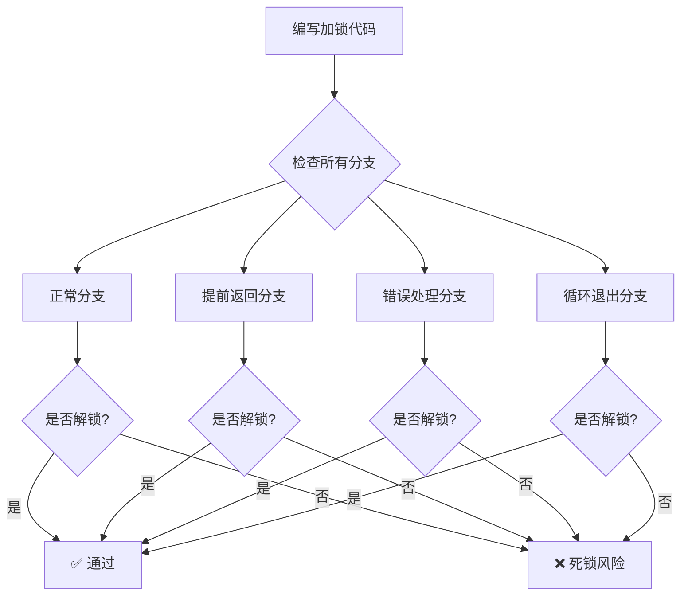
```mermaid
flowchart TD
    A[编写加锁代码] --> B{检查所有分支}
    B --> C[正常分支]
    B --> D[提前返回分支]
    B --> E[错误处理分支]
    B --> F[循环退出分支]
    
    C --> G{是否解锁?}
    D --> H{是否解锁?}
    E --> I{是否解锁?}
    F --> J{是否解锁?}
    
    G -->|是| K[✅ 通过]
    G -->|否| L[❌ 死锁风险]
    H -->|是| K
    H -->|否| L
    I -->|是| K
    I -->|否| L
    J -->|是| K
    J -->|否| L
```

---

### 5.4 位操作的艺术

#### 设计哲学

位图和位掩码是嵌入式系统的灵魂。通过精妙的位操作，可以在 O(1) 时间复杂度内完成复杂的查找和判断。

#### 核心技巧

```c
/* 技巧1：设置某一位 */
bitmap |= (1 << n);

/* 技巧2：清除某一位 */
bitmap &= ~(1 << n);

/* 技巧3：切换某一位 */
bitmap ^= (1 << n);

/* 技巧4：检查某一位 */
if (bitmap & (1 << n)) { /* 该位为 1 */ }

/* 技巧5：找到最低位的 1 */
int pos = __rt_ffs(bitmap) - 1;

/* 技巧6：保留某些位，清除其他位 */
value = value & mask;

/* 技巧7：保留某些位，设置新值 */
value = (value & ~mask) | new_value;
```

#### 位操作应用场景


```mermaid
graph TB
    subgraph 调度器
        A1[就绪队列位图]
        A2[优先级查找]
    end
    
    subgraph 线程状态
        B1[状态值存储]
        B2[标志位存储]
    end
    
    subgraph 事件标志
        C1[事件位图]
        C2[等待条件判断]
    end
    
    subgraph 设备驱动
        D1[寄存器操作]
        D2[标志位判断]
    end
    
    A1 --> A2
    B1 --> B2
    C1 --> C2
    D1 --> D2
```

#### 性能对比

| 操作 | 数组遍历 | 位图操作 |
|------|----------|----------|
| 查找最高优先级 | O(n) | O(1) |
| 设置状态 | O(1) | O(1) |
| 清除状态 | O(1) | O(1) |
| 内存占用 | 大 | 极小 |

---

### 5.5 软硬件解耦设计

#### 设计哲学

一个好的架构都是逻辑段和硬件段相解耦的，而且都是先明确逻辑段的变化，再进行硬件段的变化。

#### 分层架构

```mermaid
graph TB
    subgraph 逻辑层_跨平台通用
        A[调度算法]
        B[优先级查找]
        C[队列管理]
        D[状态机]
    end
    
    subgraph 接口层_抽象定义
        E[rt_hw_interrupt_disable]
        F[rt_hw_interrupt_enable]
        G[rt_hw_context_switch]
    end
    
    subgraph 硬件层_平台相关
        H[Cortex-M 实现]
        I[RISC-V 实现]
        J[MIPS 实现]
    end
    
    A --> E
    B --> E
    C --> E
    D --> E
    
    E --> H
    F --> H
    G --> H
    
    E --> I
    F --> I
    G --> I
    
    E --> J
    F --> J
    G --> J
```

#### 解耦带来的好处

| 特性 | 解耦前 | 解耦后 |
|------|--------|--------|
| 移植难度 | 高（需修改核心代码） | 低（只需实现硬件层） |
| 代码复用 | 低 | 高 |
| 测试难度 | 高（依赖硬件） | 低（可模拟测试） |
| 维护成本 | 高 | 低 |

---

## 六、总结

### 6.1 核心知识点速查表

| 主题 | 核心要点 |
|------|----------|
| 临界区保护 | 关中断保护，保存/恢复中断状态 |
| 调度算法 | 位图 + 链表数组，O(1) 时间复杂度 |
| 线程管理 | 初始化 → 启动 → 插入队列 → 删除 |
| 调度器锁 | 嵌套计数器，禁止切换但允许中断 |
| 上下文切换 | 区分线程环境和中断环境 |
| 延迟处理 | 调度器上锁时记录请求，解锁后执行 |
| 状态管理 | 位掩码操作，状态 + 标志共存 |

### 6.2 关键函数速查

| 函数名 | 作用 | 使用场景 |
|--------|------|----------|
| `rt_sched_lock` | 临界区加锁 | 保护内核数据结构 |
| `rt_sched_unlock` | 临界区解锁 | 恢复中断状态 |
| `rt_system_scheduler_init` | 调度器初始化 | 系统启动时调用 |
| `rt_system_scheduler_start` | 启动调度器 | 系统启动时调用，永不返回 |
| `rt_schedule` | 执行调度 | 线程切换核心函数 |
| `rt_sched_insert_thread` | 插入就绪队列 | 线程就绪时调用 |
| `rt_sched_remove_thread` | 移出就绪队列 | 线程阻塞时调用 |
| `rt_enter_critical` | 调度器上锁 | 保护较长临界区 |
| `rt_exit_critical` | 调度器解锁 | 恢复调度 |

### 6.3 数据结构速查

| 数据结构 | 类型 | 作用 |
|----------|------|------|
| `rt_thread_ready_priority_group` | `rt_uint32_t` | 就绪队列位图 |
| `rt_thread_priority_table[32]` | `rt_list_t[]` | 就绪线程链表数组 |
| `rt_current_thread` | `rt_thread_t` | 当前运行线程指针 |
| `rt_scheduler_lock_nest` | `rt_int16_t` | 调度器锁嵌套计数器 |
| `rt_interrupt_nest` | `rt_uint8_t` | 中断嵌套计数器 |

### 6.4 学习路径建议

```mermaid
graph LR
    A[调度器架构<br/>总览] --> B[临界区保护<br/>关中断机制]
    B --> C[调度算法<br/>位图 + 链表]
    C --> D[线程管理<br/>初始化/启动]
    D --> E[上下文切换<br/>PendSV 机制]
    E --> F[调度器锁<br/>嵌套计数器]
    F --> G[延迟处理<br/>标志位机制]
```

### 6.5 调试技巧

#### 常见问题排查

| 问题现象 | 可能原因 | 排查方法 |
|----------|----------|----------|
| 系统死锁 | 锁未配对释放 | 检查所有分支是否都有解锁 |
| 线程无法切换 | 调度器锁未释放 | 检查 `rt_scheduler_lock_nest` 值 |
| 优先级反转 | 临界区过长 | 缩短临界区或使用优先级继承 |
| 调度延迟 | 中断时间过长 | 优化中断处理时间 |

#### 调试命令

```bash
/* FinSH 调试命令 */
msh /> list_thread      /* 列出所有线程 */
msh /> list_sem         /* 列出所有信号量 */
msh /> list_mutex       /* 列出所有互斥量 */
msh /> free             /* 查看内存使用 */
```

---

> **文档信息**
> - 整理日期：2026-04-16
> - 基于 RT-Thread 源码学习笔记
> - 涵盖调度器架构、核心函数、位图机制、上下文切换等核心主题
