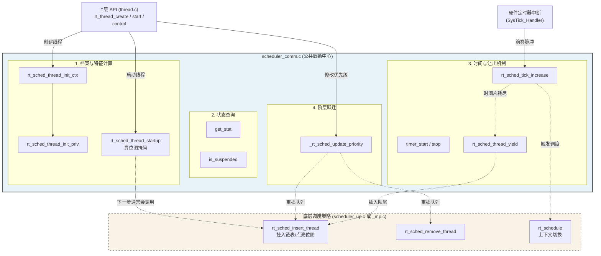

## 日记

- 他的分层更加细化，从硬件到底层驱动层到调用层,为什么呢，应为硬件的驱动是不同的，核心架构不同，底层驱动层也不同，多核到单核。所以要多层封装，
- 人家为了获得对象，都这么严谨可靠，也是没招了
- 其实好多上层的调度和彻底封装都在Thread的模块


👉 **1. 一句话总结 (Core Purpose)** `scheduler_comm.c` 是 RT-Thread 调度子系统的**“公共后勤与状态管理中心”**。它封装了所有与底层硬件（单核/多核）无关的、纯粹是对线程状态（TCB）进行配置、查询、修剪和流转的通用操作，从而为上层应用提供了一套统一且干净的 API。

---

### 🔍 2. 宏观模块拆解与关联 (Module Breakdown)

整个 `scheduler_comm.c` 文件其实可以清晰地划分为四大功能区块：

**一、 初始化与特征码分配 (Initialization)**

- `rt_sched_thread_init_priv`: “建立原始档案”。初始化链表节点，赋予初始优先级和时间片，特征码全部归零。
    
- `rt_sched_thread_startup`: “颁发身份掩码”。根据优先级，用位运算计算出在就绪位图中的唯一坐标（`number`, `high_mask`, `number_mask`），状态变为 `SUSPEND` 等待发车。
    
- `rt_sched_thread_init_ctx`: “宏观户籍登记”。设置初始态 `INIT`，如果在 SMP 环境下，还负责分配 CPU 的亲和力（默认是不绑定 `RT_CPU_DETACHED`）。
    

**二、 状态与属性查询 (Getter / Inquiry)**

- `rt_sched_thread_get_stat`: 安全读取当前线程状态（自带剥离额外 Flag 标签的功能）。
    
- `rt_sched_thread_get_curr_prio`: 查阅当前生效的优先级（需加锁保护）。
    
- `rt_sched_thread_get_init_prio`: 查阅出厂优先级（只读数据，无锁极速访问）。
    
- `rt_sched_thread_is_suspended`: 严格校验线程是否真正在睡觉。
    

**三、 时间与轮转控制 (Timing & Round-Robin)**

- `rt_sched_thread_timer_start` / `_stop`: 管理线程内部挂载的那个“私人超时闹钟”的启停标志位。这是实现“带超时时间的阻塞”的基石。
    
- `rt_sched_thread_yield`: “主动让位”。自己时间片还没用完，但大度地把剩余时间片补满，打上 `YIELD` 标签退回队尾。
    
- `rt_sched_tick_increase`: “死神倒计时”。通常由 SysTick 触发，无情扣减当前线程的时间片。一旦归零，强行塞回队尾并呼叫调度器。
    

**四、 优先级阶层跃迁 (Priority Modification)**

- `_rt_sched_update_priority`: 核心打手。安全地在就绪链表中拔插节点，并彻底重算线程的特征掩码。
    
- `rt_sched_thread_change_priority`: 临时改变优先级（如用于优先级继承，解决死锁）。
    
- `rt_sched_thread_reset_priority`: 永久重置优先级。





#### `rt_sched_thread_init_ctx`

`rt_sched_thread_init_ctx` 是线程诞生的**“第一道登记手续”**。它负责赋予线程初始的生命体征（INIT 状态），在多核（SMP）环境下为其设定 CPU 绑定规则，最后再将详细的优先级和时间片配置外包给底层的 `init_priv` 函数去完成。


- 问题：RT_SCHED_CTX()这东西到底是啥玩意儿

- **线程状态机的第一步 (Lifecycle 起点)：** 所有的 RTOS 都有一个核心状态机。在 RT-Thread 中，线程的一生通常是：`INIT (初始化)` -> `SUSPEND (挂起)` -> `READY (就绪排队)` -> `RUNNING (正在运行)`。 这个函数确立了原点。只有在经历了 `INIT` 和配置完特征码（变成 `SUSPEND`）后，用户才能调用 `rt_thread_startup()` 将其推入 `READY` 状态参与真正的 CPU 争夺。
    
- **SMP 多核调度中的“亲和力 (CPU Affinity)”与“负载均衡”：** 这几行关于 SMP 的代码非常关键。如果不加限制（`bind_cpu = RT_CPUS_NR`），多核调度器为了效率最大化，会把这个线程扔给当前最闲的那个 CPU 核心。 但在实际的高级嵌入式开发中，我们有时需要**“强行绑定”**。比如：处理以太网高速数据的线程，我们希望它永远在 Core 1 上跑，以独占 Core 1 的 L1 Cache；而把 UI 刷新和按键处理全绑在 Core 0 上。这时候，我们就可以在创建线程后，手动修改 `bind_cpu`，从而影响底层的调度策略。

```c
/**
 * @brief Initialize thread scheduling context
 * // [解析] 初始化线程的调度上下文。当用户调用 rt_thread_create 或 rt_thread_init 创建一个新线程时，
 * // 内核底层就会走到这里，开始为这个刚分配好内存的“植物人”注入灵魂。
 */
void rt_sched_thread_init_ctx(struct rt_thread *thread, rt_uint32_t tick, rt_uint8_t priority)
{
    /* setup thread status */
    // [解析] 第 1 步：赋予初始生命体征。
    // 刚创建出来的线程，就像刚出生的婴儿，还不能立刻干活（还不在就绪队列里）。
    // 所以它的初始状态被严格设定为 RT_THREAD_INIT（初始化态）。
    RT_SCHED_CTX(thread).stat = RT_THREAD_INIT;

#ifdef RT_USING_SMP
    /* not bind on any cpu */
    // [解析] 第 2 步：多核 (SMP) 环境下的特殊“户口登记”。
    
    // bind_cpu 代表“线程亲和力(Affinity)”，也就是这个线程被死死绑在哪个 CPU 核上。
    // RT_CPUS_NR 是系统里 CPU 核心的总数。比如双核系统，核心是 0 和 1，RT_CPUS_NR 就是 2。
    // 把绑定的核心设为“总数(2)”，在底层逻辑中代表一个无效的核心 ID，
    // 它的真正含义是：“我不挑剔，任何一个空闲的核心我都可以去跑”。
    RT_SCHED_CTX(thread).bind_cpu = RT_CPUS_NR;
    
    // oncpu 代表“当前这个瞬间，线程正在哪个核上运行”。
    // 既然线程才刚建好，还在襁褓中，当然不在任何 CPU 上，所以标记为 RT_CPU_DETACHED（已脱离/未挂载）。
    RT_SCHED_CTX(thread).oncpu = RT_CPU_DETACHED;
#endif /* RT_USING_SMP */

    // [解析] 第 3 步：向下委托。
    // 宏观的登记做完了，接下来调用我们上一节精读过的函数，
    // 去把时间片(tick)、优先级(priority)以及底层的位图掩码(mask)都给算好并初始化。
    rt_sched_thread_init_priv(thread, tick, priority);
}
```


### `rt_sched_thread_timer_start` 和 `_sched_thread_timer_stop`


- 问题：RT_SCHED_DEBUG_IS_LOCKED;什么意思？

- **什么是 `thread_timer`（私人闹钟）？** 每个人的手机里都可以定很多个闹钟。在 RT-Thread 中，每一个 `rt_thread` 结构体在被创建时，系统都会顺带在它肚子里内置一个定时器对象（`rt_timer`），这就是它的私人闹钟。
    
- **为什么要自带一个定时器？（核心使用场景）** 这是为了实现 RTOS 中极其重要的一句话：**“带超时的阻塞等待”**。 假设一个线程执行了 `rt_sem_take(sem, 100)`，意思是：“我要拿信号量，如果没有，我最多在这里死等 100 个 Tick。如果 100 个 Tick 还没人给我，我就不等了，直接报错返回”。 底层流程是这样的：
    
    1. 线程发现拿不到信号量，准备将自己挂起（从就绪链表移到阻塞链表）。
        
    2. 设置私人闹钟的时间为 100。
        
    3. 调用 `rt_timer_start` 启动闹钟。
        
    4. **调用 `rt_sched_thread_timer_start`（即当前函数）设置标志位。**
        
    5. 触发线程切换，当前线程“睡死”过去。
        
    
    **接下来会发生两种结局：**
    
    - **结局 A (闹钟先响)：** 100 个 Tick 到了，硬件中断触发定时器回调函数。回调函数会把这个线程强行“唤醒”，并告诉它：“别等了，超时了返回错误码吧”。
        
    - **结局 B (信号量先来)：** 第 50 个 Tick 时，另一个线程释放了信号量。系统立刻唤醒该线程，在唤醒的过程中，**必须调用 `rt_sched_thread_timer_stop`（即当前函数）** 把那个设到一半的闹钟掐灭，防止它 50 个 Tick 后乱响！

```c
/**
 * @brief Start the thread timer for scheduling
 * // [解析] 启动线程的私人定时器。
 * // 注意：这个函数本身并不调用 rt_timer_start() 去启动硬件定时器！
 * // 它只是一个“状态标记”函数，真正的启动动作通常在外层（比如 rt_thread_sleep）已经做完了。
 */
rt_err_t rt_sched_thread_timer_start(struct rt_thread *thread)
{
    // [解析] 极其关键的安全断言。
    // 操作线程的核心标志位必须在临界区内（即调度器必须是被锁住的），否则容易发生竞态条件。
    RT_SCHED_DEBUG_IS_LOCKED;
    
    // [解析] 给该线程打上一个“我的闹钟正在倒计时”的标志。
    // ttmr = thread timer。
    RT_SCHED_CTX(thread).sched_flag_ttmr_set = 1;
    
    return RT_EOK;
}

/**
 * @brief Stop the thread timer for scheduling
 * // [解析] 停止线程的私人定时器。
 * // 什么时候会调用这个？比如线程在等一个信号量（设置了等待 500ms），
 * // 但在 200ms 的时候信号量就来了。此时线程被提前唤醒，必须赶紧把剩下的 300ms 闹钟关掉。
 */
rt_err_t rt_sched_thread_timer_stop(struct rt_thread *thread)
{
    rt_err_t error;
    
    // [解析] 同样要求调用前必须已经锁住了调度器。
    RT_SCHED_DEBUG_IS_LOCKED;

    // [解析] 优化机制：先检查闹钟是不是真的在响。
    // 如果本来就没定闹钟，直接返回 OK，省去了调用 rt_timer_stop 函数的开销。
    if (RT_SCHED_CTX(thread).sched_flag_ttmr_set)
    {
        // [解析] 呼叫系统的 Timer 模块，强行把这个闹钟从系统的硬件时钟链表里摘下来。
        error = rt_timer_stop(&thread->thread_timer);

        /* mask out timer flag no matter stop success or not */
        // [解析] 无论底层 Timer 模块停没停成功（可能就在你停的这一瞬间闹钟正好响了），
        // 都要把“闹钟正在倒计时”的标志位清零。
        RT_SCHED_CTX(thread).sched_flag_ttmr_set = 0;
    }
    else
    {
        error = RT_EOK;
    }
    
    return error;
}
```


### 得到线程的状态和优先级函数

这三个函数分别用于安全地获取线程的**当前状态（剔除标签）**、**当前生效优先级**和**出厂初始优先级**。


- **面向对象的封装思想：** 在 C 语言中，所有的结构体成员都是公开的，别的模块其实可以直接写 `thread->stat` 来获取状态。但是，直接访问内部成员会破坏封装性。通过提供 `get_stat` 这样的 Getter 函数，架构师不仅可以顺便把掩码过滤（`& MASK`）做掉，还可以在里面加入死锁检测（`DEBUG_IS_LOCKED`）。如果将来 `stat` 的存储结构变了，只要改这个函数就行了，不用改遍全系统。
    
- **读写分离与锁优化：** 从 `get_curr_prio` 必须加锁，而 `get_init_prio` 不需要加锁的对比中，我们可以学到：**并不是所有的全局结构体访问都需要关中断**。只有那些会发生“一读一写”或“多写”冲突的数据（也就是临界资源）才需要保护。对于只读数据，能不加锁就不加锁，这是降低 RTOS 中断延迟（Interrupt Latency）的秘诀。

```c
/**
 * @brief Get the current status of a thread
 * // [解析] 获取线程的“纯净”状态（把身上的 YIELD 等标志剥离掉）。
 */
rt_uint8_t rt_sched_thread_get_stat(struct rt_thread *thread)
{
    // [解析] 安全断言：因为状态随时可能被中断里的其他操作改变，
    // 所以读取时必须保证调度器是锁住的，避免读到一半状态变了（读脏数据）。
    RT_SCHED_DEBUG_IS_LOCKED;
    
    // [解析] 这里的 & RT_THREAD_STAT_MASK 就是我们在上位运算里讲过的。
    // 假设 stat 此时是 0x12 (YIELD | SUSPEND)，
    // 0x12 & 0x0F (掩码) 的结果就是 0x02 (SUSPEND)。
    // 这样调用者拿到就是一个干干净净的基础状态，方便用 switch-case 做判断。
    return RT_SCHED_CTX(thread).stat & RT_THREAD_STAT_MASK;
}

/**
 * @brief Get the current priority of a thread
 * // [解析] 获取线程当前正在生效的优先级。
 */
rt_uint8_t rt_sched_thread_get_curr_prio(struct rt_thread *thread)
{
    // [解析] 同样的安全断言：优先级继承机制可能随时会修改 current_priority，
    // 因此读取时必须在临界区内。
    RT_SCHED_DEBUG_IS_LOCKED;
    
    return RT_SCHED_PRIV(thread).current_priority;
}

/**
 * @brief Get the initial priority of a thread
 * // [解析] 获取线程“出生”时被赋予的原始优先级。
 */
rt_uint8_t rt_sched_thread_get_init_prio(struct rt_thread *thread)
{
    /* read only fields, so lock is unnecessary */
    // [解析] 非常关键的细节！这里没有 RT_SCHED_DEBUG_IS_LOCKED 断言。
    // 为什么？因为 init_priority 从线程被创建那一刻起，就永远不会再被修改了。
    // 既然是“只读不写”的常量字段，多线程并发读取也是绝对安全的，所以不需要加锁保护，提升了执行效率。
    return RT_SCHED_PRIV(thread).init_priority;
}

```


### 四个状态的切换函数

- `rt_sched_thread_is_suspended`：**查户口**。判断线程当前是不是正在“睡觉”（挂起态）。
    
- `rt_sched_thread_close`：**判死刑**。将线程状态标记为关闭，等待系统回收资源。
    
- `rt_sched_thread_yield`：**主动让座**。当前线程主动放弃 CPU 时间片，退回到同优先级队伍的末尾排队。
    
- `rt_sched_thread_ready`：**叫醒服务**。将挂起的线程重新放回就绪队列，准备参与 CPU 抢夺。


- 问题：RT_SCHED_PRIV()是啥

- **Yield 的真谛（同优先级轮转）：** 在严格的抢占式系统中，如果有一个高优先级线程是个死循环，低优先级永远无法运行。 如果两个线程优先级**一样高**，它们怎么分享 CPU 呢？
    
    1. **被动轮转：** 靠系统的滴答定时器（Tick中断），发现谁的时间片用光了，就强行赶下去。
        
    2. **主动轮转 (Yield)：** 如果线程 A 虽然分配了 10 个 Tick，但它只用了 2 个 Tick 就把当前的事情做完了，如果它写一个空循环硬耗剩下的 8 个 Tick，是非常浪费电的。这时候它调用 `yield()`，主动退下，让同级的线程 B 提前上场。这是一种极其优雅的合作式调度。
        
- **竞态条件 (Racing Condition) 的防御：** `rt_sched_thread_ready` 开头为什么一定要查 `is_suspended`？ 想象一个极其极端的瞬间：线程 A 调用 `rt_thread_sleep(100)` 准备去睡觉。代码刚执行到一半，还没彻底把 A 的状态改成 SUSPEND，突然来了一个外部中断！中断回调函数里偏偏执行了唤醒线程 A 的操作（调用 `ready`）。如果这里不校验状态，强行对一个还没完全入睡的线程执行“唤醒”（挪动链表），系统绝对会崩盘。这里的 `if (!is_suspended)` 完美地化解了这种异步冲突。


```c
/**
 * @brief Check if a thread is in suspended state
 * // [解析] 核心逻辑：利用按位与 (&) 提取状态，并与 SUSPEND 掩码严格比对。
 * // 为什么是严格比对 `== RT_THREAD_SUSPEND_MASK` 而不是 `!= 0`？
 * // 因为状态码是互斥的，必须确保底层的状态位完完全全就是“挂起”。
 */
rt_uint8_t rt_sched_thread_is_suspended(struct rt_thread *thread)
{
    RT_SCHED_DEBUG_IS_LOCKED;
    return (RT_SCHED_CTX(thread).stat & RT_THREAD_SUSPEND_MASK) == RT_THREAD_SUSPEND_MASK;
}

/**
 * @brief Close a thread by setting its status to CLOSED
 * // [解析] 极简的“处决”操作。
 * // 注意：这里仅仅是改了状态标签。真正的“移出队列”、“释放内存堆”等动作，
 * // 会由外层的 rt_thread_delete() 或 rt_thread_detach() 配合执行。
 */
rt_err_t rt_sched_thread_close(struct rt_thread *thread)
{
    RT_SCHED_DEBUG_IS_LOCKED;
    RT_SCHED_CTX(thread).stat = RT_THREAD_CLOSE;
    return RT_EOK;
}

/**
 * @brief Yield the current thread's remaining time slice
 * // [解析] 当前运行的线程说：“我活干完了（或者我愿意大度一点），CPU 让给同样优先级的兄弟吧！”
 */
rt_err_t rt_sched_thread_yield(struct rt_thread *thread)
{
    RT_SCHED_DEBUG_IS_LOCKED;

    // [解析] 既然是主动让出，为了公平起见，系统会把它的剩余时间片 (remaining_tick) 
    // 恢复成满血状态 (init_tick)，等它下次排队排到时，能重新跑一个完整的时间片。
    RT_SCHED_PRIV(thread).remaining_tick = RT_SCHED_PRIV(thread).init_tick;
    
    // [解析] 给它身上贴一个“主动让出”的标签 (YIELD)。
    // 这个标签会在触发底层的 rt_schedule() 和 rt_sched_insert_thread() 时，
    // 发挥关键作用——强迫它插队到同优先级链表的最后面。
    RT_SCHED_CTX(thread).stat |= RT_THREAD_STAT_YIELD;

    return RT_EOK;
}

/**
 * @brief Make a suspended thread ready for scheduling
 * // [解析] 极其关键的函数！它将线程从休眠状态拉回现实战场。
 */
rt_err_t rt_sched_thread_ready(struct rt_thread *thread)
{
    rt_err_t error;
    RT_SCHED_DEBUG_IS_LOCKED;

    // [解析] 1. 前置防呆校验：如果你根本没挂起，就不能被“唤醒”。
    // 这通常发生在并发竞争时（比如线程刚要睡，还没睡透，就被中断唤醒了）。
    if (!rt_sched_thread_is_suspended(thread))
    {
        error = -RT_EINVAL;
    }
    else
    {
        // [解析] 2. 掐灭闹钟！
        // 如果线程是因为等待某个东西（带有超时时间）而挂起的，
        // 既然现在要被提前唤醒了，必须把它的倒计时闹钟掐断，防止误报超时。
        if (RT_SCHED_CTX(thread).sched_flag_ttmr_set)
        {
            error = rt_sched_thread_timer_stop(thread);
        }
        else
        {
            error = RT_EOK;
        }

        // [解析] 3. 核心大挪移：从阻塞链表移到就绪链表。
        if (!error)
        {
            // 从它当前所在的队列（比如某个信号量的等待队列，或定时器的睡眠队列）里强行拔出来。
            rt_list_remove(&RT_THREAD_LIST_NODE(thread));

#ifdef RT_USING_SMART
            // SMART 微内核专用：清除底层的唤醒回调指针，防止重复触发。
            thread->wakeup_handle.func = RT_NULL;
#endif

            // 调用我们之前解析过的函数，将它塞进对应优先级的“挂号通道”（就绪链表），并点亮位图！
            rt_sched_insert_thread(thread);
        }
    }

    return error;
}
```


### `rt_sched_tick_increase`节拍器


👉 **1. 一句话总结 (Core Purpose)** `rt_sched_tick_increase` 的核心作用是**“倒计时与吹哨”**：它在每次系统滴答时，扣除当前运行线程的时间片；一旦发现时间片耗尽，就无情地将它赶下 CPU，换同优先级的下一个线程上场。


- **同优先级轮转 (Round-Robin) 的绝对基石：** 之前我们在查阅调度逻辑时，一直有一个前提：“如果有**更高**优先级的线程就绪，就会抢占”。但如果就绪链表里，有 3 个优先级**一模一样**的线程（比如都是 15 级），该怎么办？ 这就是 `rt_sched_tick_increase` 存在的意义！它就像一个铁面无私的裁判，给线程 A 发 10 个 Tick，给线程 B 发 5 个 Tick。时间一到，立刻吹哨（`yield`），强迫当前线程去队尾排队，让同级的下一个兄弟上场。这就保证了同优先级任务之间的**公平性**。
    
- **极速的中断上下文 (Interrupt Context)：** 系统硬件定时器（SysTick）可以说是 RTOS 里触发最频繁的中断了（一秒钟可能触发 1000 次）。因此这个函数必须写得极其精简。你会发现它只做减法运算和简单的标志位判断，绝不在这里做复杂的链表遍历。所有复杂的移出、插入队列操作，都被优雅地推迟到了随后的 `rt_schedule()` 软中断中去执行。


```c
/**
 * @brief Increase the system tick and update thread's remaining time slice
 * // [解析] 这个函数通常被底层的硬件定时器中断服务函数（ISR）周期性调用，比如每 1 毫秒调用一次。
 */
rt_err_t rt_sched_tick_increase(rt_tick_t tick)
{
    struct rt_thread *thread;
    rt_sched_lock_level_t slvl;

    // [解析] 拿到当前正在 CPU 上跑的线程。因为是它在占用 CPU，所以扣它的时间片。
    thread = rt_thread_self();

    // [解析] 拉起警戒线。虽然当前已经在中断里了，但为了兼容多核 SMP 架构，
    // 依然需要给调度器上锁，防止其他核心此时也在操作调度器数据。
    rt_sched_lock(&slvl);

    // [解析] 扣除寿命（时间片倒计时）。
    // remaining_tick 是线程兜里还剩下的时间。
    if (RT_SCHED_PRIV(thread).remaining_tick > tick)
    {
        RT_SCHED_PRIV(thread).remaining_tick -= tick;
    }
    else
    {
        // [解析] 如果扣减后小于等于 0，说明这个线程的时间片被彻底榨干了。
        RT_SCHED_PRIV(thread).remaining_tick = 0;
    }

    // [解析] 根据时间片是否耗尽，走向两种完全不同的命运：
    if (RT_SCHED_PRIV(thread).remaining_tick)
    {
        // [命运 A：还有时间]
        // 既然时间没用完，啥也不用做，解锁调度器，让这个线程接着跑。
        rt_sched_unlock(slvl);
    }
    else
    {
        // [命运 B：时间片耗尽！]
        // 第一步：调用我们上一节讲过的 yield 函数！
        // 它会把当前线程的 remaining_tick 重新充满血，并给它打上 YIELD 标签，
        // 准备把它一脚踢到同优先级就绪链表的最后面去排队。
        rt_sched_thread_yield(thread);

        /* request a rescheduling even though we are probably in an ISR */
        // 第二步：解锁调度器，并强烈要求立刻进行一次线程切换！
        // [注意] 因为当前极大概率是在硬件定时器中断 (ISR) 里，所以这里的 resched 
        // 只是悬起一个“软中断标记”(如 PendSV)，等定时器中断真正退出时，硬件才会去执行上下文切换。
        rt_sched_unlock_n_resched(slvl);
    }

    return RT_EOK;
}
```


### `_rt_sched_update_priority`


`_rt_sched_update_priority` 是底层核心打手，它负责在调度器锁定的绝对安全环境下，剥夺或赋予线程新的优先级，并根据线程当前的状态（是否在排队），智能地决定要不要给它“换个队列重新排”。

- 问题：为什么running正在运行的状态也可以改优先级

```c
/**
 * @brief Update thread priority and adjust scheduling attributes
 * // [解析] 这是一个底层的 static 函数，是对外暴露的 change 和 reset 函数的具体实现者。
 * // 这里的核心难点在于：当你要修改优先级时，这个线程可能正躺在就绪队列里排队！
 */
static rt_err_t _rt_sched_update_priority(struct rt_thread *thread, rt_uint8_t priority, rt_bool_t update_init_prio)
{
    // [解析] 1. 防呆与保护。确保要修改的数字合法，且系统已被上锁。
    RT_ASSERT(priority < RT_THREAD_PRIORITY_MAX);
    RT_SCHED_DEBUG_IS_LOCKED;

    /* for ready thread, change queue; otherwise simply update the priority */
    // [解析] 2. 核心分流：它现在是不是正在排队（READY）？
    if ((RT_SCHED_CTX(thread).stat & RT_THREAD_STAT_MASK) == RT_THREAD_READY)
    {
        // [情况 A：它正在排队]
        
        /* remove thread from schedule queue first */
        // [解析] 因为它马上就要换阶层了，必须先把它从原来的低级（或高级）队伍里拽出来。
        // 调用 remove 函数，同时也会更新系统位图（如果旧队伍空了，对应的灯会灭掉）。
        rt_sched_remove_thread(thread);

        /* change thread priority */
        // [解析] 换发新身份证（修改内部变量）。
        if (update_init_prio)
        {
            RT_SCHED_PRIV(thread).init_priority = priority;
        }
        RT_SCHED_PRIV(thread).current_priority = priority;

        /* recalculate priority attribute */
        // [解析] 重新计算它的“特征码”。
        // 这个位运算我们在 rt_sched_thread_startup 讲过。
        // 把它的新优先级转换成 256 级下的“组号(number)”、“组掩码(number_mask)”和“组内掩码(high_mask)”。
#if RT_THREAD_PRIORITY_MAX > 32
        RT_SCHED_PRIV(thread).number = RT_SCHED_PRIV(thread).current_priority >> 3;               /* 5bit */
        RT_SCHED_PRIV(thread).number_mask = 1 << RT_SCHED_PRIV(thread).number;
        RT_SCHED_PRIV(thread).high_mask = 1 << (RT_SCHED_PRIV(thread).current_priority & 0x07);   /* 3bit */
#else
        RT_SCHED_PRIV(thread).number_mask = 1 << RT_SCHED_PRIV(thread).current_priority;
#endif /* RT_THREAD_PRIORITY_MAX > 32 */

        // [解析] 为什么要强行把状态改成 INIT？
        // 这是一个非常巧妙的 Trick。因为紧接着下面要调用 rt_sched_insert_thread，
        // 而 insert 函数如果看到你是 READY 状态，会觉得你是个异常的残留物。
        // 假装它是刚初始化的 INIT 状态，能让它顺畅地跑完后续的“首次入列”逻辑。
        RT_SCHED_CTX(thread).stat = RT_THREAD_INIT;

        /* insert thread to schedule queue again */
        // [解析] 重新把它塞进新的“挂号通道”（就绪链表），并点亮新的位图指示灯。
        rt_sched_insert_thread(thread);
    }
    else
    {
        // [情况 B：它不在排队]
        // 比如它正在睡觉（SUSPEND）或者正在运行（RUNNING）。
        // 既然不在队列里，那就好办多了，不用动链表，直接“换发身份证”和“重算特征码”就行了。
        if (update_init_prio)
        {
            RT_SCHED_PRIV(thread).init_priority = priority;
        }
        RT_SCHED_PRIV(thread).current_priority = priority;

        /* recalculate priority attribute */
#if RT_THREAD_PRIORITY_MAX > 32
        RT_SCHED_PRIV(thread).number = RT_SCHED_PRIV(thread).current_priority >> 3;               /* 5bit */
        RT_SCHED_PRIV(thread).number_mask = 1 << RT_SCHED_PRIV(thread).number;
        RT_SCHED_PRIV(thread).high_mask = 1 << (RT_SCHED_PRIV(thread).current_priority & 0x07);   /* 3bit */
#else
        RT_SCHED_PRIV(thread).number_mask = 1 << RT_SCHED_PRIV(thread).current_priority;
#endif /* RT_THREAD_PRIORITY_MAX > 32 */
    }

    return RT_EOK;
}

/**
 * @brief Update priority of the target thread
 * // [解析] 对外的 API。通常用于实现“优先级继承”。
 * // 注意：它传了 RT_FALSE，意思是只改 current_priority，不改 init_priority。
 * // 这样等它借用的高级身份用完后，系统还能查阅它的 init_priority 把它的身份降回去。
 */
rt_err_t rt_sched_thread_change_priority(struct rt_thread *thread, rt_uint8_t priority)
{
    return _rt_sched_update_priority(thread, priority, RT_FALSE);
}

/**
 * @brief Reset priority of the target thread
 * // [解析] 对外的 API。真正的“重置/永久改变阶层”。
 * // 它传了 RT_TRUE，连同出厂设置 init_priority 一起改掉了。
 */
rt_err_t rt_sched_thread_reset_priority(struct rt_thread *thread, rt_uint8_t priority)
{
    return _rt_sched_update_priority(thread, priority, RT_TRUE);
}
```


### 栈溢出检测机制


这段代码的核心作用是**“守卫边界”**：通过检查栈底的“魔法字符（水印）”是否被篡改，以及栈指针（SP）是否越界，来及时发现并拦截栈溢出，防止系统带着被破坏的内存继续运行。


- **为什么会发生栈溢出？** 每一个线程在创建时，都在 RAM 里圈了一块私有领地（比如 1024 字节）作为它的 Stack。 当线程调用函数（压入返回地址）、定义局部变量（比如 `int buf[200];`）、或者发生中断（压入 CPU 寄存器上下文）时，栈指针 SP 就会一直往下走。如果走的太深，超出了 1024 字节，它就会**悄悄地改写掉相邻内存里的数据**（可能是其他线程的栈，也可能是全局变量）。这种 BUG 极难排查，因为出问题的地方往往不是案发现场。
    
- **“水印机制” (Watermark / Magic Number)：** 这是软件栈检测的经典招式。为什么判断首字节是不是 `'#'` (ASCII码 0x23) 就能知道溢出？ 因为 RT-Thread 在 `rt_thread_init` 的时候，会用 `rt_memset` 将这 1024 字节全部刷成 `'#'`。程序运行中，只要局部变量没触底，栈底的那个 `'#'` 就永远不会变。如果调度器来检查时，发现那个位置变成了别的值，毫无疑问，栈被“踩穿”了。
    
- **Fail-Fast (快速失败) 哲学：** 为什么发现溢出后，作者冷酷无情地写了一个 `while (dummy) ;` 死循环？ 因为一旦栈溢出，内存就已经被污染了。此时让系统继续运行，可能会导致电机失控、数据写入错误的 Flash 扇区。因此，系统级软件的铁律是：**一旦发现不可挽回的内存破坏，立即拔掉呼吸机（Halt 系统）**。

```c
#ifdef RT_USING_OVERFLOW_CHECK

#if defined(RT_USING_HOOK) && defined(RT_HOOK_USING_FUNC_PTR)
static rt_err_t (*rt_stack_overflow_hook)(struct rt_thread *thread);

/**
 * @brief Set a hook function to be called when stack overflow is detected
 * // [解析] 设置栈溢出钩子函数。
 * // 当系统快要因为栈溢出而死机前，给你留的“最后一句遗言”的机会。
 * // 你可以在这里点亮故障红灯、保存关键日志到 Flash，或者尝试软件重启。
 */
void rt_scheduler_stack_overflow_sethook(rt_err_t (*hook)(struct rt_thread *thread))
{
    rt_stack_overflow_hook = hook;
}
#endif /* RT_USING_HOOK */

/**
 * @brief Check thread stack for overflow or near-overflow conditions
 * // [解析] 核心检测函数！它通常在 rt_schedule() 线程切换时被调用。
 * // 因为线程被切走时，它的 SP 指针正好被固定保存在了 TCB 里，此时检查最准。
 */
void rt_scheduler_stack_check(struct rt_thread *thread)
{
    RT_ASSERT(thread != RT_NULL);

#ifdef RT_USING_SMART
// [解析] 针对 RT-Thread Smart（微内核架构）的特殊处理。
// 如果线程的 SP 跑到了用户态的数据区，就不归内核管了，直接跳过检查。
#ifndef ARCH_MM_MMU
    struct rt_lwp *lwp = thread ? (struct rt_lwp *)thread->lwp : 0;
    if (lwp && ((rt_uint32_t)thread->sp > (rt_uint32_t)lwp->data_entry &&
                (rt_uint32_t)thread->sp <= (rt_uint32_t)lwp->data_entry + (rt_uint32_t)lwp->data_size))
    {
        return;
    }
#endif 
#endif 

#ifndef RT_USING_HW_STACK_GUARD
// [解析] 如果没有硬件级的栈保护（比如 ARM v8-M 的 MSPLIM/PSPLIM 寄存器），就只能用纯软件检查。

// [解析] 绝大多数单片机（如 Cortex-M）栈是“向下生长”的（从高地址往低地址压栈）。
// 所以栈的尽头就在 thread->stack_addr 处。
#ifdef ARCH_CPU_STACK_GROWS_UPWARD
    if (*((rt_uint8_t *)((rt_uintptr_t)thread->stack_addr + thread->stack_size - 1)) != '#' ||
#else
    // 【核心逻辑 1：查水表】
    // RT-Thread 在创建线程时，会把整个栈空间填满 '#' (0x23)。
    // 如果栈的最底部这个字节不再是 '#' 了，说明 SP 曾经滑到了这里并写入了数据，栈已经被踩穿了！
    if (*((rt_uint8_t *)thread->stack_addr) != '#' ||
#endif /* ARCH_CPU_STACK_GROWS_UPWARD */
        // 【核心逻辑 2：查界限】
        // 看看当前记录的栈顶指针 SP 是不是彻底飞出了系统当初给它分配的内存范围 [stack_addr, stack_addr + stack_size]。
        (rt_uintptr_t)thread->sp <= (rt_uintptr_t)thread->stack_addr ||
        (rt_uintptr_t)thread->sp >
            (rt_uintptr_t)thread->stack_addr + (rt_uintptr_t)thread->stack_size)
    {
        rt_base_t dummy = 1;
        rt_err_t hook_result = -RT_ERROR;

        // [解析] 宣判死刑，打印出事线程的名字。
        LOG_E("thread:%s stack overflow\n", thread->parent.name);

#if defined(RT_USING_HOOK) && defined(RT_HOOK_USING_FUNC_PTR)
        // [解析] 交代遗言：调用用户注册的钩子函数。
        if (rt_stack_overflow_hook != RT_NULL)
        {
            hook_result = rt_stack_overflow_hook(thread);
        }
#endif

        /* If hook handled the overflow successfully, don't enter infinite loop */
        // [解析] 就地正法：除非钩子函数有通天本领（返回 RT_EOK 说它搞定了），
        // 否则系统直接在这里卡死（while(1)），宁可死机也不带着错乱的内存继续跑！
        if (hook_result != RT_EOK)
        {
            while (dummy)
                ;
        }
    }
#endif /* RT_USING_HW_STACK_GUARD */

// ----------- 下面是“黄牌警告”区 -----------
#ifdef ARCH_CPU_STACK_GROWS_UPWARD
// ... 向上生长架构的警告逻辑 ...
#else
#ifndef RT_USING_HW_STACK_GUARD
    // [解析] 如果向下生长的栈指针，距离谷底只剩下不到 32 个字节了！
    else if ((rt_uintptr_t)thread->sp <= ((rt_uintptr_t)thread->stack_addr + 32))
#else
    if ((rt_uintptr_t)thread->sp <= ((rt_uintptr_t)thread->stack_addr + 32))
#endif
    {
        // [解析] 发出黄牌警告：还没死，但已经在悬崖边缘了，赶紧回去把局部数组开小点！
        LOG_W("warning: %s stack is close to end of stack address.\n",
              thread->parent.name);
    }
#endif /* ARCH_CPU_STACK_GROWS_UPWARD */
}
```
## **思考与启发 (Takeaway)**

- **标志位的缓冲优化 (Flag-based Fast Path)：** `stop` 函数里那个 `if (sched_flag_ttmr_set)` 看起来像是多此一举（因为 `rt_timer_stop` 内部也会检查定时器是不是开着的），但在 RTOS 核心路径里，极其有用。 每次线程被唤醒时，系统都会惯性地去调一下 `stop`（以防万一有残留的闹钟）。但绝大多数情况下，线程都是因为正常的事件被唤醒的（没用超时机制）。加了这个标志位拦截，就避免了无谓的函数压栈、出栈调用开销，把 O(n) 的底层遍历变成了 O(1) 的条件判断，这是典型的性能优化策略。


**状态机的严谨流转：** 这四个函数清晰地展示了线程状态是如何像齿轮一样咬合运转的。状态的每一次改变（如挂起到就绪），都必须伴随着**“三步曲”**：

1. 掐灭旧状态的附属物（如定时器闹钟）。
    
2. 拔出旧状态的链表（如移出挂起队列）。
    
3. 插入新状态的链表并更新系统标志（如插入就绪链表、更新位图）。 在底层开发中，任何一步的遗漏，都会导致系统在几小时或几天后出现神秘的“死机”或“内存泄漏”。。