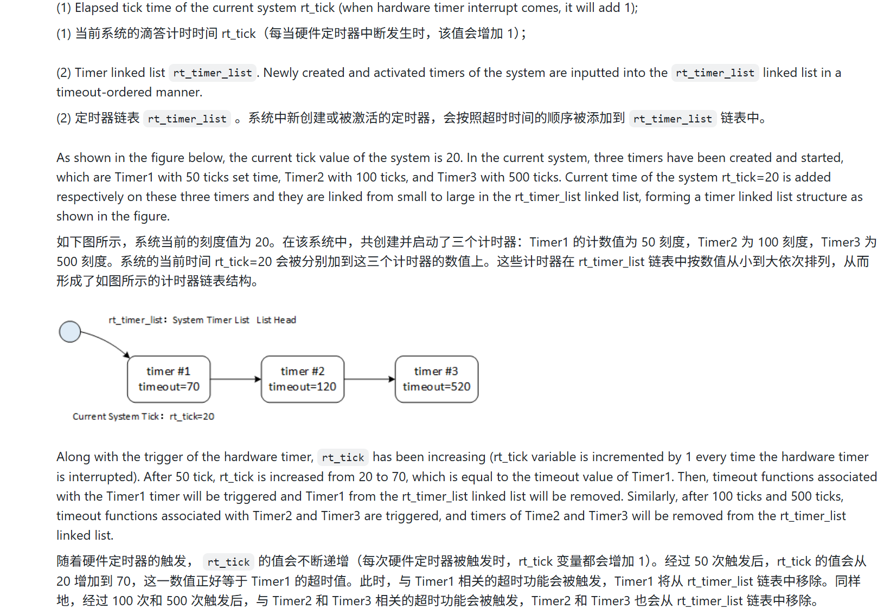

## 想法与日记
- 妈的，你直接看代码完全是很奇怪的，一定要结合设计文档来看，因为他的设计逻辑，一般是从产生原理，到调度原理
- 跳表算法不知道leetcode里面有没有可以去写一下
- 其实我现在大体上知道一个模块怎么写了，我认为奥，先写日志系统，然后定义的宏没然后声明结构体。明确回调函数，然后再是内部函数的书写，一般都是从静态的产生和删除到动态的产出和删除，然后是调度模块啊什么的，这些其实都是Time的TCB模块，独立于这个之外的还有系统的初始化
- “分配”与“初始化”分离的设计，是 C 语言实现面向对象编程的经典模式
- 感觉天天这样搞一个静态动态代码的创建和粘贴是真的慢而且费力不讨好，，下一个模块不准备这样搞了，没必要
- 还有就是我发现了它的子函数不是全部写在一起的，他是模块化写的，你懂吗，比如创造和删除单元，就先写子函数，然后再写调用API，然后start和stop模块同理
- 以后我决定都不搞初始化流程了，直接去看他的核心调度层，他妈的初始化就那些东西，一直看来看去的有啥意思


## 问题
- 所以说我这个TImer就是设置软件定时器处理单元吗
- 没看懂为什么在Time系统的初始化要：【第二步：初始化自旋锁】
     * 硬件定时器链表会被 SysTick 中断和普通线程并发访问。
     * 为了防止多核(SMP)或中断嵌套打断链表操作导致指针错乱，
     * 必须初始化一把极轻量级的自旋锁（Spinlock）来保护它。
     */
    rt_spin_lock_init(&_htimer_lock);
- 用thread_time_init来模拟硬件化的time是如何实现的，信号量在里面扮演什么角色
- 如果设定的延时超过了最大 Tick 的一半，底层的超时判断逻辑就会失效（出现时间倒流的错觉）不理解
- 自旋锁在Time模块里的作用，为什么需要并发
- 线程定时器特判没有懂
- 调表算法要单独花时间来理解
- 关中断与锁链表的操作
## 大体知识端


#### 时间的定义
在 RT-Thread 中，时钟滴答的间隔长度可以根据 RT_TICK_PER_SECOND 的值来调整。RT_TICK_PER_SECOND 的值等于 1/RT_TICK_PER_SECOND 秒。


#### 获取时钟滴答声数据
- 和硬件的中断逻辑相联系，系统时钟已经发生了跳动。不同的硬件驱动程序，其定时器中断的处理方式也有所不同
- 但一般来说都是中断和你要实现的逻辑，在stm32里面用的SysTick_Handler

```c
void rt_tick_increase(void)
{
    /* 定义一个线程指针，用于获取当前正在 CPU 上运行的那个线程 */
    struct rt_thread *thread;

    /* * 【第一步：推进系统时间】
     * 全局变量 rt_tick 自增。
     * rt_tick 记录了系统启动以来经历了多少次“滴答”。
     * 这个变量是所有延时（rt_thread_sleep）和定时器计算未来的基准时间。
     */
    ++ rt_tick;

    /* * 【第二步：时间片轮转调度检查】
     * 调用 rt_thread_self() 获取当前正在运行的线程控制块（TCB）。
     */
    thread = rt_thread_self();

    /* * 扣减当前线程的“剩余时间片”（remaining_tick）。
     * 每经过一个 SysTick 中断，线程的可用执行时间就少 1 个 Tick。
     */
    -- thread->remaining_tick;
    
    /* 检查当前线程的时间片是否已经用完（归零） */
    if (thread->remaining_tick == 0)
    {
        /* * 如果时间片耗尽：
         * 1. 重新给该线程分配初始时间片（init_tick），也就是“满血复活”，
         * 以便下次它再次获得 CPU 时，有完整的时间片可用。
         */
        thread->remaining_tick = thread->init_tick;

        /* * 2. 核心动作：强制当前线程让出 CPU 使用权（Yield）。
         * rt_thread_yield() 会把当前线程从它所在优先级就绪链表的“头部”
         * 挪到“尾部”，然后触发一次系统调度。
         * 这样一来，排在链表后面的同优先级线程就有机会运行了！
         */
        rt_thread_yield();
    }

    /* * 【第三步：检查硬件定时器】
     * 由于系统时间（rt_tick）刚刚加 1，可能正好有定时器在这一刻到期。
     * rt_timer_check() 会去扫描系统的定时器跳表（Skip List），
     * 把所有 timeout_tick <= 当前 rt_tick 的定时器全挑出来，
     * 并执行它们的回调函数（timeout_func）。
     */
    rt_timer_check();
}
```
这段代码是整个 RT-Thread 操作系统的“心脏跳动函数”（Heartbeat）。它的核心作用是推动系统时钟（Tick）向前走，并在此基础上完成两件操作系统级的大事：一是管理同优先级线程的时间片轮转（Round-Robin 调度），二是检查并唤醒所有到期的定时器。


###  计时器管理和 获取时钟滴答声数据

- 计时器分为软件计时器和硬件计时器：1. 硬件定时器是芯片本身所提供的计时功能。要使用硬件定时器，只需将定时器模块设置为定时器模式，并设定好时间即可。硬件定时器的精度高达纳秒级别，且采用中断触发模式。2. 软件计时器是操作系统提供的一种系统接口。它基于硬件计时器实现，从而使系统能够提供不受数量限制的计时服务。还分为第一种是一次性定时器，它在系统启动后仅触发一次定时事件，之后便会自动停止。第二种是周期性定时器，它会持续定期触发定时事件，直到用户手动停止它为止。否则，它会一直持续运行下去


- RT-Thread 定时器的默认模式为 HARD_TIMER 模式。这意味着，当定时器超时后，超时处理函数会在系统时钟中断的上下文中执行。由于中断处理是在特定上下文中进行的，因此定时器的超时处理函数不得调用任何可能导致当前上下文被挂起的系统函数

- OFT_TIMER 模式是可配置的。宏定义 RT_USING_TIMER_SOFT 用于决定是否启用该模式。当该模式被启用后，系统会在初始化时创建一个定时器线程，随后 SOFT_TIMER 模式的定时器超时处理功能将在该定时器线程的上下文中被执行

- RT-Thread 操作系统提供了以“时钟滴答”为单位的内置计时功能。也就是说，计时值必须是时钟滴答的整数倍。例如，如果一个时钟滴答相当于 10 毫秒，那么软件计时器只能设置为 10 毫秒、20 毫秒、100 毫秒等数值，而无法设置为 15 毫秒
- `rt_tick_t rt_tick_get(void)`;


- 定时器工作原理：

  

### 计时器跳过列表算法

- 跳表是一种基于并行链表的数据结构。它的实现相当简单，插入、删除和搜索的操作时间复杂度均为 O(log n)。跳表虽然属于链表的一种，但它为链表添加了“跳过”功能。正是这一功能使得跳表在查找元素时能够保持 O(log n)的时间复杂度。
- 本质上就是进行并且和分层处理，才可能从0(n)变成0(logN),本质是用空间换时间。


### 代码段

#### 模块启动
##### `rt_system_timer_init`和`rt_sysytem_timer_thread_init `启动定时器模块
- 关于timer_thread_init的通信层面我不太理解，因为涉及到了IPC通信

```c
/**
 * @ingroup group_system_init
 *
 * @brief This function will initialize system timer
 */
void rt_system_timer_init(void)
{
/* * 【条件编译裁剪】
 * 如果系统配置了“全软件定时器模式”(RT_USING_TIMER_ALL_SOFT)，
 * 那么硬件定时器链表就不需要了，整段代码被剔除以节省空间。
 */
#ifndef RT_USING_TIMER_ALL_SOFT
    rt_size_t i;

    /* * 【第一步：初始化硬件定时器跳表】
     * 注意：_timer_list 不是单链表，而是一个数组，用于实现“跳表(Skip List)”。
     * sizeof(_timer_list) / sizeof(_timer_list[0]) 是 C 语言中获取数组元素个数的标准且最安全的写法。
     * 这里遍历整个跳表层级数组，将每一层的表头都初始化为空链表。
     */
    for (i = 0; i < sizeof(_timer_list) / sizeof(_timer_list[0]); i++)
    {
        rt_list_init(_timer_list + i);
    }

    /* * 【第二步：初始化自旋锁】
     * 硬件定时器链表会被 SysTick 中断和普通线程并发访问。
     * 为了防止多核(SMP)或中断嵌套打断链表操作导致指针错乱，
     * 必须初始化一把极轻量级的自旋锁（Spinlock）来保护它。
     */
    rt_spin_lock_init(&_htimer_lock);
#endif
}

/**
 * @ingroup group_system_init
 *
 * @brief This function will initialize system timer thread
 */
void rt_system_timer_thread_init(void)
{
/* * 【条件编译裁剪】
 * 只有在 rtconfig.h 中开启了软件定时器宏，这段代码才会被编译。
 */
#ifdef RT_USING_TIMER_SOFT
    int i;

    /* * 【第一步：初始化软件定时器跳表】
     * 和硬件定时器类似，软件定时器也有自己独立的跳表结构。
     */
    for (i = 0;
         i < sizeof(_soft_timer_list) / sizeof(_soft_timer_list[0]);
         i++)
    {
        rt_list_init(_soft_timer_list + i);
    }
    
    /* 初始化保护软件定时器跳表的自旋锁 */
    rt_spin_lock_init(&_stimer_lock);
    
    /* * 【第二步：创建同步信号量（重点！）】
     * 创建一个名为 "stimer" 的信号量，初始值为 0。
     * 采用 RT_IPC_FLAG_PRIO 模式，意味着如果有多个线程等它，优先级高的先获得。
     */
    rt_sem_init(&_soft_timer_sem, "stimer", 0, RT_IPC_FLAG_PRIO);
    
    /* * 【神来之笔：限制信号量最大值为 1】
     * 利用 control 函数，把这个信号量变成“二值信号量”。
     * 为什么？防止中断风暴！如果 SysTick 中断疯狂触发软定时器，
     * 信号量不会累加到很高，最多就是 1。守护线程醒来一次，就会把所有超时的任务都处理完。
     */
    rt_sem_control(&_soft_timer_sem, RT_IPC_CMD_SET_VLIMIT, (void*)1);
    
    /* * 【第三步：静态创建软件定时器守护线程】
     * 这是 RT-Thread 内核非常核心的一个后台线程。
     * 入口函数是 _timer_thread_entry（它里面就是一个死循环，死等上面那个信号量）。
     * 优先级是 RT_TIMER_THREAD_PRIO（通常配置为 4，是非常高的优先级）。
     * 时间片为 10 个 tick。
     */
    rt_thread_init(&_timer_thread,
                   "timer",
                   _timer_thread_entry,
                   RT_NULL,
                   &_timer_thread_stack[0],
                   sizeof(_timer_thread_stack),
                   RT_TIMER_THREAD_PRIO,
                   10);

    /* * 【第四步：启动线程】
     * 将刚创建好的 "timer" 线程挂入就绪队列，等待调度器启动后给它分配 CPU。
     */
    rt_thread_startup(&_timer_thread);
#endif /* RT_USING_TIMER_SOFT */
}
```

- 这段初始化代码体现了 RTOS 处理时间的两种哲学。`_timer_list` 挂载的是要求**绝对实时**的短小任务，它们的时间一到，立刻在硬件中断里执行，绝不废话；而 `_soft_timer_list` 挂载的是那些可能需要**阻塞、睡眠或耗时计算**的任务。为了不卡死整个系统，系统在此处单独孵化了一个高优先级的打工人（`timer` 线程），专门负责在安全的线程环境里执行这些麻烦的回调。
    
- **中断推迟处理（Bottom Half）：** 在这套机制下，硬件中断（SysTick）只需要做极其简短的工作：检查软件跳表，如果发现时间到了，就 `rt_sem_release(&_soft_timer_sem)` 释放信号量，然后火速退出中断。真正耗时的工作由 `timer` 线程醒来后接手。这是典型的“顶半部（中断）+ 底半部（线程）”的现代 OS 中断处理模型。

#### TCB控制

#### Create and Delete Timer  创建和删除计时器(动态)

这两个函数共同完成了 RT-Thread 动态定时器的“实例化”**工作。`rt_timer_create` 负责在堆内存中申请控制块空间，而内部函数 `_timer_init` 负责对这个控制块的各项参数（回调函数、触发时间、工作模式等）进行彻底的初始化封装。创建后的定时器处于**未激活状态，直到调用 `rt_timer_start` 才会真正起作用。
flag  旗帜/标志


创建计时器时所使用的参数。支持的值包括：一次性计时、周期性计时、硬件计时器、软件计时器等。（可以使用“OR”来组合多个值）

```c
/**
 * @brief This function will create a timer
 * ... (注释省略)
 * @return the created timer object
 */
rt_timer_t rt_timer_create(const char *name,
                           void (*timeout)(void *parameter),
                           void       *parameter,
                           rt_tick_t   time,
                           rt_uint8_t  flag)
{
    struct rt_timer *timer;

    /* * 【第一步：防御性编程，参数校验】
     * 1. 回调函数绝对不能为空，否则定时器到期跳过去执行直接触发 HardFault。
     * 2. time < RT_TICK_MAX / 2 极其关键！RT-Thread 巧妙利用无符号数溢出来判断超时，
     * 如果设定的延时超过了最大 Tick 的一半，底层的超时判断逻辑就会失效（出现时间倒流的错觉）。
     */
    RT_ASSERT(timeout != RT_NULL);
    RT_ASSERT(time < RT_TICK_MAX / 2);

    /* * 【第二步：面向对象的动态内存分配】
     * 这里没有用普通的 malloc，而是调用了 RT-Thread 对象管理器的 API。
     * 它不仅在堆（Heap）上分配了 sizeof(struct rt_timer) 大小的内存，
     * 还会把这个新对象挂载到系统的“对象容器（Object Container）”中，
     * 并且赋予了它 RT_Object_Class_Timer 的类型标签和名字 name。
     */
    timer = (struct rt_timer *)rt_object_allocate(RT_Object_Class_Timer, name);
    if (timer == RT_NULL)
    {
        /* 内存不足（堆耗尽）时安全退出 */
        return RT_NULL;
    }

    /* * 【第三步：底层参数初始化】
     * 内存分配成功后，调用内部函数进行具体的变量赋初值。
     * 这种“分配”与“初始化”分离的设计，是 C 语言实现面向对象编程的经典模式。
     */
    _timer_init(timer, timeout, parameter, time, flag);

    return timer;
}
RTM_EXPORT(rt_timer_create); /* 导出到控制台，允许在 FinSH 命令行中调用和测试 */


/**
 * @brief [internal] The init funtion of timer
 * ...
 */
static void _timer_init(rt_timer_t timer,
                        void (*timeout)(void *parameter),
                        void      *parameter,
                        rt_tick_t  time,
                        rt_uint8_t flag)
{
    int i;

    /* * 【条件编译：全局软件定时器强制转换】
     * 如果系统配置了所有定时器都当软定时器用，
     * 这里会强行给你按位或（|）上 RT_TIMER_FLAG_SOFT_TIMER 标志。
     */
#ifdef RT_USING_TIMER_ALL_SOFT
    flag               |= RT_TIMER_FLAG_SOFT_TIMER;
#endif

    /* * 【状态与属性装载】
     * 将传入的 flag（单次/周期、软/硬）赋值给继承自父类（rt_object）的 flag 变量。
     */
    timer->parent.flag  = flag;

    /* * 【核心细节：强制清除激活标志】
     * ~ 符号是按位取反，&= 意为清除该位。
     * 这行代码确保新创建的定时器 绝对不可能 处于 ACTIVATED（运行中）状态。
     * 必须由用户显式调用 rt_timer_start() 才会加上这个标志位。
     */
    timer->parent.flag &= ~RT_TIMER_FLAG_ACTIVATED;

    /* 记录“闹钟响了要做什么”（回调函数）以及“带着什么数据去做”（入参） */
    timer->timeout_func = timeout;
    timer->parameter    = parameter;

    /* * timeout_tick 是绝对触发时间，由于还没 start，先清零。
     * init_tick 记录用户当初设定的周期时长（方便周期定时器重载时使用）。
     */
    timer->timeout_tick = 0;
    timer->init_tick    = time;

    /* * 【底层数据结构：多层跳表节点初始化】
     * 之前提到过，RT-Thread 的定时器是用跳表（Skip List）管理的。
     * row 是一个包含多个链表节点的数组（层数由 RT_TIMER_SKIP_LIST_LEVEL 决定）。
     * 这里循环遍历每一层，把这台定时器的链表节点全都初始化为空（前驱后继指针指向自己）。
     */
    for (i = 0; i < RT_TIMER_SKIP_LIST_LEVEL; i++)
    {
        rt_list_init(&(timer->row[i]));
    }
}
```

**C 语言侵入式链表的障眼法：** 传统的教科书链表，通常是定义一个 `List` 结构体管理整个链表，再定义一个 `Node` 结构体作为节点。 而在 RT-Thread 和 Linux 中，为了极致的抽象和效率，**无论是整个链表的“头（Head）”，还是每个对象里的“节点（Node）”，用的全都是同一个数据类型：`rt_list_t`**。

- 当你对全局的 `_timer_list` 执行 `rt_list_init` 时（在 `rt_system_timer_init` 中），你是清空了整个系统链表。
    
- 当你对某一个对象的 `timer->row` 执行 `rt_list_init` 时（在当前的 `_timer_init` 中），你只是格式化了这个对象自己的节点。

- **`timer` 是谁？** 这里的 `timer` 是通过 `rt_timer_create` 刚刚在内存中分配出来的一个**全新的、孤立的**对象。它现在就像一个刚出厂的零件，还没安装到机器（系统）上去。
    
- **`timer->row[i]` 是什么？** 它是这个新定时器自带的“挂钩”或者说“左右手”。因为是跳表，所以它有好几双手（`row` 数组）。定时器以后就是要靠这些手，抓着系统里的其他定时器，从而串在系统链表上的。
    
- **`rt_list_init` 做了什么？** 底层逻辑其实就是两行代码： `node->next = node;` `node->prev = node;` 也就是让这个新定时器的“左手”牵着自己的“右手”。**它只修改了 `timer` 这个结构体内部的内存**，根本没有去碰系统全局的那个定时器大链表（`_timer_list` 或 `_soft_timer_list`）。


这个函数的核心作用是“安全地销毁一个动态创建的定时器”**。它负责把定时器从系统运行链表中摘除（如果还在运行的话），注销它的运行状态，并最终**将它占用的堆内存释放回系统。

```c
/**
 * @brief This function will delete a timer and release timer memory
 *
 * @param timer the timer to be deleted
 *
 * @return the operation status, RT_EOK on OK; -RT_ERROR on error
 */
rt_err_t rt_timer_delete(rt_timer_t timer)
{
    rt_base_t level;
    struct rt_spinlock *spinlock;

    /* * 【第一步：极其严格的防御性校验】
     * 1. 检查指针不能为 NULL。
     * 2. 检查对象的“基因”：它必须真的是一个定时器（RT_Object_Class_Timer）。
     * 3. 核心校验：它绝不能是“系统对象”（即静态对象，RT_FALSE）。
     * 因为 rt_timer_delete 会调用底层 free 释放内存，如果你把一个全局静态变量
     * 传进来 delete，系统立刻就会崩溃（跑飞）。静态定时器只能用 rt_timer_detach！
     */
    RT_ASSERT(timer != RT_NULL);
    RT_ASSERT(rt_object_get_type(&timer->parent) == RT_Object_Class_Timer);
    RT_ASSERT(rt_object_is_systemobject(&timer->parent) == RT_FALSE);

    /* * 【第二步：获取对应的自旋锁】
     * 软定时器和硬定时器挂在不同的链表上，这行代码会自动判断该定时器的类型，
     * 并返回保护它所在链表的那把自旋锁（_htimer_lock 或 _stimer_lock）。
     */
    spinlock = _timerlock_idx(timer);

    /* * 【第三步：进入临界区（关中断 + 加锁）】
     * 这是一个组合拳：首先关闭当前 CPU 核心的全局中断（保存状态到 level），
     * 然后尝试获取 spinlock（防止其他 CPU 核心并发访问）。
     * 这是因为此时此刻，SysTick 中断可能正准备扫描并修改这个跳表。
     */
    level = rt_spin_lock_irqsave(spinlock);

    /* * 【第四步：核心物理剥离】
     * 把这个定时器的节点（无论在哪一层跳表里）从系统定时器大链表中彻底解开、摘除。
     */
    _timer_remove(timer);
    
    /* * 【第五步：清除运行状态】
     * 安全地把定时器的 ACTIVATED（已激活）标志位抹除。
     * 此时，这个定时器已经变成了一个与系统毫无瓜葛的“游离对象”。
     */
    timer->parent.flag &= ~RT_TIMER_FLAG_ACTIVATED;
    
    /* * 【第六步：退出临界区（解锁 + 恢复中断）】
     * 链表操作完毕，立刻释放自旋锁并恢复中断响应，把影响系统实时性的时间降到最低。
     */
    rt_spin_unlock_irqrestore(spinlock, level);
    
    /* * 【第七步：归还内存】
     * 调用对象管理器的 API。它会把这个对象从系统对象容器里除名，
     * 并调用 RT_Kernel_Free 把这块 sizeof(struct rt_timer) 大小的内存还给堆（Heap）。
     */
    rt_object_delete(&(timer->parent));

    return RT_EOK;
}
RTM_EXPORT(rt_timer_delete);
```


#### init 和detach静态创建和分离


这两个函数构成了 RT-Thread 定时器的“安全退役机制”**：`rt_timer_delete` 负责把**动态分配**的定时器从系统中拔除并**销毁尸体（释放内存）**；而 `rt_timer_detach` 负责把**静态分配**的定时器从系统中拔除，但**保留全尸（不释放内存）。

```c
/**
 * @brief This function will detach a static timer
 *
 * @param timer the static timer to be detached
 *
 * @return the operation status, RT_EOK on OK; -RT_ERROR on error
 */
rt_err_t rt_timer_detach(rt_timer_t timer)
{
    rt_base_t level;
    struct rt_spinlock *spinlock;

    /* * 【第一步：防御性校验（差异点在此！）】
     * 1. 指针不为空。
     * 2. 类型必须是定时器。
     * 3. 核心校验：它必须是“系统对象”（即静态对象，RT_TRUE）。
     * 如果你拿一个用 create 动态生成的定时器来 detach，这里会报错拦截。
     */
    RT_ASSERT(timer != RT_NULL);
    RT_ASSERT(rt_object_get_type(&timer->parent) == RT_Object_Class_Timer);
    RT_ASSERT(rt_object_is_systemobject(&timer->parent));

    /* 获取自旋锁 */
    spinlock = _timerlock_idx(timer);

    /* * 【第二步：进入临界区，剥离物理链表】
     * 关中断 + 拿自旋锁。然后调用 _timer_remove 将其从跳表中摘除。
     * 这一步和 delete 是一模一样的。
     */
    level = rt_spin_lock_irqsave(spinlock);

    _timer_remove(timer);
    
    /* 清除激活状态标志位 */
    timer->parent.flag &= ~RT_TIMER_FLAG_ACTIVATED;
    
    /* 退出临界区 */
    rt_spin_unlock_irqrestore(spinlock, level);

    /* * 【第三步：归还对象管理权（差异点在此！）】
     * 这里调用的是 rt_object_detach，而不是 rt_object_delete。
     * 它只会把这个定时器从 RT-Thread 的“对象信息容器”中除名，
     * 绝对不会调用底层的 free() 去释放内存！
     */
    rt_object_detach(&(timer->parent));

    return RT_EOK;
}
RTM_EXPORT(rt_timer_detach);


rt_inline void _timer_remove(rt_timer_t timer)

{

    int i;

  

    for (i = 0; i < RT_TIMER_SKIP_LIST_LEVEL; i++)

    {

        rt_list_remove(&timer->row[i]);

    }

}
```

`rt_timer_init` 的核心作用是“原地唤醒”一个静态定时器。它不向系统索要动态堆内存（Heap），而是直接把开发者预先准备好的一块物理内存（通常是全局变量），“点化”成一个合法的、随时可用的 RT-Thread 定时器对象。

```c
/**
 * @brief This function will initialize a timer
 * normally this function is used to initialize a static timer object.
 * ...
 */
void rt_timer_init(rt_timer_t  timer,
                   const char *name,
                   void (*timeout)(void *parameter),
                   void       *parameter,
                   rt_tick_t   time,
                   rt_uint8_t  flag)
{
    /* * 【第一步：防御性参数校验】
     * 1. timer 不能为空：因为是静态初始化，内存是你给的，如果你传个 NULL 进来，后面直接跑飞。
     * 2. timeout 不能为空：没有回调函数的定时器毫无意义。
     * 3. time 溢出保护：同样防止时间回绕导致的逻辑判断错误（Tick 的一半）。
     */
    RT_ASSERT(timer != RT_NULL);
    RT_ASSERT(timeout != RT_NULL);
    RT_ASSERT(time < RT_TICK_MAX / 2);

    /* * 【第二步：基类对象初始化（静态挂载，极其关键！）】
     * 注意这里调用的是 rt_object_init，而不是 rt_object_allocate！
     * 它干了两件事：
     * 1. 承认这个内存块是一个内核对象，打上 RT_Object_Class_Timer 的标签，并赋上名字。
     * 2. 自动给它打上 RT_Object_Class_Static（静态对象）的隐藏属性。
     * 3. 将它挂载到系统全局的“静态对象容器链表”中，方便 FinSH 命令行能查到它。
     */
    rt_object_init(&(timer->parent), RT_Object_Class_Timer, name);

    /* * 【第三步：装载定时器专有业务属性】
     * 调用内部半成品函数 _timer_init。
     * 把回调函数、触发时间、跳表节点等定时器相关的核心数据结构全部格式化。
     */
    _timer_init(timer, timeout, parameter, time, flag);
}
RTM_EXPORT(rt_timer_init);
```


### 定时器的start 和 stop 模块


这两个函数共同完成了“定时器点火与挂载”**的任务。对外接口 `rt_timer_start` 负责区分软/硬定时器并提供严格的并发保护；对内核心 `_timer_start` 则负责精准计算未来的超时时间，并将定时器以 $O(\log n)$ 的极快速度插入到有序的**多层跳表（Skip List）中。


```c
/**
 * @brief This function will start the timer
 * (对外暴露的 API 接口)
 */
rt_err_t rt_timer_start(rt_timer_t timer)
{
    rt_sched_lock_level_t slvl;
    int is_thread_timer = 0;
    struct rt_spinlock *spinlock;
    rt_list_t *timer_list;
    rt_base_t level;
    rt_err_t err;

    /* 1. 防御性校验：不能为空，且必须是定时器类型 */
    RT_ASSERT(timer != RT_NULL);
    RT_ASSERT(rt_object_get_type(&timer->parent) == RT_Object_Class_Timer);

    /* 2. 【路由分发】：判断是挂在硬定时器链表，还是软定时器链表 
     * 并且拿到对应链表的自旋锁，为后面的并发操作做准备。
     */
#ifdef RT_USING_TIMER_ALL_SOFT
    timer_list = _soft_timer_list;
    spinlock = &_stimer_lock;
#else
#ifdef RT_USING_TIMER_SOFT
    if (timer->parent.flag & RT_TIMER_FLAG_SOFT_TIMER)
    {
        timer_list = _soft_timer_list;
        spinlock = &_stimer_lock;
    }
    else
#endif /* RT_USING_TIMER_SOFT */
    {
        timer_list = _timer_list;
        spinlock = &_htimer_lock;
    }
#endif

    /* 3. 【线程定时器特判】：
     * RT-Thread 中每个线程其实自带了一个定时器（用于 rt_thread_sleep）。
     * 如果启动的是线程内置定时器，需要额外锁定调度器，并调用调度器专属的 API 更新状态。
     */
    if (timer->parent.flag & RT_TIMER_FLAG_THREAD_TIMER)
    {
        rt_thread_t thread;
        is_thread_timer = 1;
        rt_sched_lock(&slvl); /* 锁调度器 */

        /* 神仙宏 rt_container_of：通过结构体内部成员(timer)的地址，反推出外部宿主(thread)的地址 */
        thread = rt_container_of(timer, struct rt_thread, thread_timer);
        RT_ASSERT(rt_object_get_type(&thread->parent) == RT_Object_Class_Thread);
        rt_sched_thread_timer_start(thread);
    }

    /* 4. 【进入临界区】：关中断 + 获取自旋锁 */
    level = rt_spin_lock_irqsave(spinlock);

    /* 5. 调用核心业务逻辑（真正的跳表插入操作） */
    err = _timer_start(timer_list, timer);

    /* 6. 【退出临界区】：解锁 + 开中断 */
    rt_spin_unlock_irqrestore(spinlock, level);

    if (is_thread_timer)
    {
        rt_sched_unlock(slvl);
    }

    return err;
}
RTM_EXPORT(rt_timer_start);


/**
 * @brief This function will start the timer
 * (内核私有函数：跳表算法的精髓)
 */
static rt_err_t _timer_start(rt_list_t *timer_list, rt_timer_t timer)
{
    unsigned int row_lvl;
    /* 这个数组用来记录跳表中，每一层在插入点“前一个节点”的位置 */
    rt_list_t *row_head[RT_TIMER_SKIP_LIST_LEVEL]; 
    unsigned int tst_nr;
    static unsigned int random_nr;

    /* 1. 防御操作：如果在启动前它已经在运行了，先把它从链表里拔出来，防止链表结构被破坏 */
    _timer_remove(timer);
    /* 强行清除运行标志 */
    timer->parent.flag &= ~RT_TIMER_FLAG_ACTIVATED;

    RT_OBJECT_HOOK_CALL(rt_object_take_hook, (&(timer->parent)));

    /* 2. 【核心计算】：计算未来的爆炸时间 = 当前经历过的 Tick + 你设置的延时 Tick */
    timer->timeout_tick = rt_tick_get() + timer->init_tick;

    /* ============ 核心跳表算法：第一阶段（寻找插入位置） ============ */
    row_head[0]  = &timer_list[0];
    for (row_lvl = 0; row_lvl < RT_TIMER_SKIP_LIST_LEVEL; row_lvl++)
    {
        /* 沿着当前层级的链表向后找，直到找到一个比我的 timeout_tick 更晚的节点 */
        for (; row_head[row_lvl] != timer_list[row_lvl].prev;
             row_head[row_lvl]  = row_head[row_lvl]->next)
        {
            struct rt_timer *t;
            rt_list_t *p = row_head[row_lvl]->next;

            /* 通过链表节点拿到定时器实体 */
            t = rt_list_entry(p, struct rt_timer, row[row_lvl]);

            /* 如果有定时器和我在同一时刻到期，为了公平（先来后到），我排在它后面 */
            if ((t->timeout_tick - timer->timeout_tick) == 0)
            {
                continue;
            }
            /* 【精妙的溢出判断】：利用无符号数的特点。如果 t 的时间晚于我的时间，我就该插在这！ */
            else if ((t->timeout_tick - timer->timeout_tick) < RT_TICK_MAX / 2)
            {
                break;
            }
        }
        /* 记录完当前层的位置后，由于跳表是高层索引底层，所以下一层的起点可以直接从当前位置开始找 */
        if (row_lvl != RT_TIMER_SKIP_LIST_LEVEL - 1)
            row_head[row_lvl + 1] = row_head[row_lvl] + 1;
    }

    /* ============ 核心跳表算法：第二阶段（确定新节点的层高） ============ */
    /* 作者巧妙地用了一个自增变量配合位运算，产生一种伪随机效果。
     * 它决定了这个新定时器要建几层“索引”。
     * 层数越高，以后别人找它就越快，但占用内存越大。这就好像抛硬币决定层数。
     */
    random_nr++;
    tst_nr = random_nr;

    /* 先把定时器的最底层（数据层）老老实实插入到底层双向链表中 */
    rt_list_insert_after(row_head[RT_TIMER_SKIP_LIST_LEVEL - 1],
                         &(timer->row[RT_TIMER_SKIP_LIST_LEVEL - 1]));
                         
    /* 然后根据刚才摇出的“伪随机数 (tst_nr)”，决定往上建几层索引 */
    for (row_lvl = 2; row_lvl <= RT_TIMER_SKIP_LIST_LEVEL; row_lvl++)
    {
        if (!(tst_nr & RT_TIMER_SKIP_LIST_MASK)) /* 如果满足概率条件，就建一层索引 */
            rt_list_insert_after(row_head[RT_TIMER_SKIP_LIST_LEVEL - row_lvl],
                                 &(timer->row[RT_TIMER_SKIP_LIST_LEVEL - row_lvl]));
        else
            break; /* 运气用光了，不再往上建索引了 */
            
        /* 移位，为下一次“抛硬币”做准备 */
        tst_nr >>= (RT_TIMER_SKIP_LIST_MASK + 1) >> 1;
    }

    /* 3. 赋予灵魂：打上已激活标志，定时器正式生效！ */
    timer->parent.flag |= RT_TIMER_FLAG_ACTIVATED;

    return RT_EOK;
}
```

**3. RTOS 原理深度解析 (OS Principles)**

- **为什么要用跳表 (Skip List) 而不用普通链表？**
    
    如果系统中只有两三个定时器，普通链表完全足够。但在复杂的物联网系统中，可能有成百上千个网络超时、按键防抖、线程睡眠（`rt_thread_sleep` 底层全是定时器）。
    
    普通链表寻找插入点的时间复杂度是 $O(n)$，这意味着定时器越多，系统中断里的耗时就越长，这就打破了 RTOS 的**实时性**！
    
    跳表通过空间换时间，建立多级索引，让插入的时间复杂度降到了 $O(\log n)$。这使得 RT-Thread 哪怕挂载了一万个定时器，插入速度依然能够得到硬实时的保证。
    
- **神仙级的伪随机发生器 `random_nr`**
    
    标准的跳表理论要求使用 `rand()` 函数来抛硬币决定层高。但是在内核中断里，调用 `rand()` 太重了，且不可预测。
    
    RT-Thread 作者极具智慧地利用了一个全局的静态自增变量 `random_nr`，配合位与操作 `&` 来模拟硬币。因为 `random_nr` 每一位变成 1 的概率也是服从统计学规律的，这种“超级廉价的伪随机”完美平衡了内核运行极速与内存索引分布的均匀性。


这两个函数构成了 RT-Thread 定时器的“紧急刹车系统”。`rt_timer_stop` 负责在保证多核与中断安全的前提下，将一个正在运行的定时器紧急停下；而底层内联函数 `_timer_remove` 则执行具体的物理动作：把这个定时器从复杂的多层跳表（运行队列）中彻底“解开扣子”摘除下来。


```c
/**
 * @brief This function will stop the timer
 *
 * @param timer the timer to be stopped
 *
 * @return the operation status, RT_EOK on OK, -RT_ERROR on error
 */
rt_err_t rt_timer_stop(rt_timer_t timer)
{
    rt_base_t level;
    struct rt_spinlock *spinlock;

    /* * 【第一步：防御性校验】
     * 老规矩，查空指针，查对象类型“基因”，防止传入非定时器对象导致内存越界。
     */
    RT_ASSERT(timer != RT_NULL);
    RT_ASSERT(rt_object_get_type(&timer->parent) == RT_Object_Class_Timer);

    /* 获取保护这个定时器所在链表（软/硬）的专属自旋锁 */
    spinlock = _timerlock_idx(timer);

    /* * 【第二步：进入临界区】
     * 关中断 + 拿锁。接下来的操作属于“极其危险的手术”，绝不能被 SysTick 中断打断。
     */
    level = rt_spin_lock_irqsave(spinlock);

    /* * 【第三步：状态机校验（非常关键！）】
     * 检查这个定时器当前到底是不是“激活（运行）”状态？
     * 如果它本来就是停着的，或者刚刚好在上一微秒已经超时触发过了（标志位已被内核清除），
     * 那这里就直接开锁退出了。防止对一个不在链表上的节点执行 remove，导致链表指针飞掉。
     */
    if (!(timer->parent.flag & RT_TIMER_FLAG_ACTIVATED))
    {
        rt_spin_unlock_irqrestore(spinlock, level);
        return -RT_ERROR;
    }
    
    /* 调用钩子函数（供系统性能分析工具或开发者 Debug 使用，正常情况为空） */
    RT_OBJECT_HOOK_CALL(rt_object_put_hook, (&(timer->parent)));

    /* * 【第四步：物理摘除】
     * 调用底层的 _timer_remove，把定时器的多层节点从跳表中抽离。
     */
    _timer_remove(timer);
    
    /* * 【第五步：逻辑注销】
     * 清除 ACTIVATED 标志位，向全系统宣告：“本闹钟已失效”。
     */
    timer->parent.flag &= ~RT_TIMER_FLAG_ACTIVATED;

    /* * 【第六步：退出临界区】
     * 恢复中断，释放自旋锁。
     */
    rt_spin_unlock_irqrestore(spinlock, level);

    return RT_EOK;
}
RTM_EXPORT(rt_timer_stop);


/**
 * @brief Remove the timer
 *
 * @param timer the point of the timer
 */
/* * 【注意这里的 rt_inline 关键字】
 * 这告诉编译器：请把这段代码直接“平铺”到调用它的地方（比如上面的 rt_timer_stop 里），
 * 不要产生真实的函数跳转（保存现场、跳转、恢复现场）。
 */
rt_inline void _timer_remove(rt_timer_t timer)
{
    int i;

    /* * 【极其高效的 O(1) 物理摘除】
     * 定时器创建时，它的 row 数组有 RT_TIMER_SKIP_LIST_LEVEL 这么多个层级。
     * 由于底层使用的是“双向链表”，我们不需要像单链表那样从头遍历寻找它的前驱节点！
     * 直接利用 rt_list_remove，让它“左手牵的人”去牵“它右手牵的人”，瞬间完成摘除。
     * 循环 i 次，把跳表每一层的挂钩全部松开。
     */
    for (i = 0; i < RT_TIMER_SKIP_LIST_LEVEL; i++)
    {
        rt_list_remove(&timer->row[i]);
    }
}
```


- **为什么“检查状态”这一步必须放在关中断（临界区）之后？** 初学者常犯的错是：先 `if (激活状态) { 关中断; 执行删除; 开中断; }`。 这是**致命的并发漏洞（Race Condition）**！假设你在开中断时查到它确实是激活的，就在你准备关中断的瞬间，SysTick 硬件定时器中断爆发了。在中断里，系统发现这个定时器刚好到期了，于是系统帮你把它从链表上摘了下来，并清除了激活标志。中断结束后，你的代码继续往下跑，进入关中断，然后对一个**已经不在链表上**的节点再次执行 `_timer_remove`，系统的指针网瞬间崩溃。 **所以，状态检查与执行摘除，必须被包裹在一个不可打断的“原子操作”中！**
    
- **插入是 O(log n)，但删除是 O(1)：** 我们在看 `start` 函数时，发现跳表为了找到正确的插入位置，费了九牛二虎之力（多级遍历）。但在 `stop` 的时候，竟然一个简单的 `for` 循环就搞定了！这是因为双向链表（Doubly Linked List）赋予了节点“知晓前后邻居”的能力。当我们持有 `timer` 的指针时，删除操作的耗时是绝对固定的常数时间，这对实时操作系统的可确定性至关重要


#### 控制模块


#### `rt_timer_control`


`rt_timer_control` 是 RT-Thread 定时器模块的“瑞士军刀（多功能控制台）”。它允许开发者在不销毁定时器的情况下，**动态地**查询或修改定时器的各项属性（如修改延时时间、切换单次/周期模式、更换回调函数等）。

- 指令

define RT_TIMER_CTRL_SET_TIME      0x0     /* Set Timeout value      */
define RT_TIMER_CTRL_GET_TIME      0x1     /* Obtain Timer Timeout Time      */
define RT_TIMER_CTRL_SET_ONESHOT   0x2     /* Set the timer as a oneshot timer.   */
define RT_TIMER_CTRL_SET_PERIODIC  0x3     /* Set the timer as a periodic timer */


```c
/**
 * @brief This function will get or set some options of the timer
 *
 * @param timer the timer to be get or set
 * @param cmd the control command      (控制命令宏，决定要做什么)
 * @param arg the argument             (泛型指针，用来传出或传入数据)
 *
 * @return the statu of control
 */
rt_err_t rt_timer_control(rt_timer_t timer, int cmd, void *arg)
{
    struct rt_spinlock *spinlock;
    rt_base_t level;

    /* 防御性参数校验 */
    RT_ASSERT(timer != RT_NULL);
    RT_ASSERT(rt_object_get_type(&timer->parent) == RT_Object_Class_Timer);

    /* 获取这台定时器所在链表的专属自旋锁 */
    spinlock = _timerlock_idx(timer);

    /* * 【进入临界区】
     * 关中断并获取自旋锁。因为我们要修改定时器的核心参数（如超时时间、回调函数），
     * 如果修改到一半被 SysTick 中断打断并触发了该定时器，会导致致命的逻辑混乱。
     */
    level = rt_spin_lock_irqsave(spinlock);
    
    /* * 【核心多路复用器 (Multiplexer)】
     * 根据传入的 cmd 命令，执行不同的操作。
     */
    switch (cmd)
    {
    case RT_TIMER_CTRL_GET_TIME:
        /* 读操作：通过类型强转，把定时器的初始节拍数拷贝到 arg 指向的内存中 */
        *(rt_tick_t *)arg = timer->init_tick;
        break;

    case RT_TIMER_CTRL_SET_TIME:
        /* * 【高能预警：修改定时周期的安全逻辑】
         * 写操作：先校验用户传入的新时间是否合法（不能超过最大 Tick 的一半）。
         */
        RT_ASSERT((*(rt_tick_t *)arg) < RT_TICK_MAX / 2);
        
        /* 如果定时器正在运行（已激活），绝不能直接改时间！ */
        if (timer->parent.flag & RT_TIMER_FLAG_ACTIVATED)
        {
            /* 必须先踩一脚“紧急刹车”，把它从系统的跳表（运行队列）中摘除 */
            _timer_remove(timer);
            /* 清除激活标志位 */
            timer->parent.flag &= ~RT_TIMER_FLAG_ACTIVATED;
        }
        /* 安全地更新时间。注意：如果原先在运行，修改后它会处于停止状态，需要用户重新 start */
        timer->init_tick = *(rt_tick_t *)arg;
        break;

    case RT_TIMER_CTRL_SET_ONESHOT:
        /* 切换为单次触发模式：粗暴地抹掉 PERIODIC（周期）标志位即可 */
        timer->parent.flag &= ~RT_TIMER_FLAG_PERIODIC;
        break;

    case RT_TIMER_CTRL_SET_PERIODIC:
        /* 切换为周期触发模式：加上 PERIODIC 标志位 */
        timer->parent.flag |= RT_TIMER_FLAG_PERIODIC;
        break;

    case RT_TIMER_CTRL_GET_STATE:
        /* 获取运行状态：利用掩码判断，将结果写回 arg */
        if(timer->parent.flag & RT_TIMER_FLAG_ACTIVATED)
        {
            /* timer is start and run */
            *(rt_uint32_t *)arg = RT_TIMER_FLAG_ACTIVATED;
        }
        else
        {
            /* timer is stop */
            *(rt_uint32_t *)arg = RT_TIMER_FLAG_DEACTIVATED;
        }
        break;

    case RT_TIMER_CTRL_GET_REMAIN_TIME:
        /* 获取还能睡多久：直接返回底层记录的绝对爆炸时间（外部需要自己用当前时间减去它） */
        *(rt_tick_t *)arg =  timer->timeout_tick;
        break;
        
    case RT_TIMER_CTRL_GET_FUNC:
        /* 获取回调函数指针：注意这里的双重指针转换 (void **) */
        *(void **)arg = (void *)timer->timeout_func;
        break;

    case RT_TIMER_CTRL_SET_FUNC:
        /* 动态更换“闹钟响了要做的事” */
        timer->timeout_func = (void (*)(void*))arg;
        break;

    case RT_TIMER_CTRL_GET_PARM:
        /* 获取回调函数的入参 */
        *(void **)arg = timer->parameter;
        break;

    case RT_TIMER_CTRL_SET_PARM:
        /* 动态更换回调函数的入参 */
        timer->parameter = arg;
        break;

    default:
        /* 遇到不支持的命令，直接忽略 */
        break;
    }
    /* 【退出临界区】 */
    rt_spin_unlock_irqrestore(spinlock, level);

    return RT_EOK;
}
RTM_EXPORT(rt_timer_control);
```


- **神级设计模式：`ioctl` (Input/Output Control) 机制：** 你会发现，如果不写这个 `control` 函数，RT-Thread 就得提供 `rt_timer_set_time`, `rt_timer_get_time`, `rt_timer_set_mode`, `rt_timer_get_state` 等等一大堆散碎的 API 函数。 操作系统界为了避免 API 泛滥，发明了 `ioctl` 模式（Linux 中极多）。通过 `cmd`（我要干嘛）配合 `void *arg`（数据口袋），**将无数个小接口收敛成了一个超级接口**。这样做极大地保持了系统 API 层的清爽，并且未来如果想给定时器增加新功能（比如增加一个 `RT_TIMER_CTRL_RESTART` 命令），直接在 `switch` 里加个 `case` 就行了，不用修改头文件和破坏二进制兼容性（ABI）。
    
- **为什么修改时间（`SET_TIME`）会强制停下定时器？** 定时器的核心是一个**按到期时间排序的跳表**。如果一个定时器已经在跳表里排好队了（比如原本排在队伍中间），你突然把它改成了 1 秒后到期，那它在队伍里的位置就完全错了！如果不把它先摘下来（`_timer_remove`），整个跳表的顺序就会被彻底摧毁，SysTick 中断一扫描直接跑飞。 所以，**内核的铁律是：改变影响排队顺序的属性，必须先出列，修改完后再重新入列**


### 执行模块


#### `rt_time_check`

这是 RT-Thread 定时器模块的“收割机”（真正干活的地方）。它在每次 SysTick 中断（滴答）到来时被调用，负责遍历定时器跳表，**找出所有已经到期的定时器，将其摘除，并执行它们的回调函数（唤醒线程或执行动作）**。

```c
/**
 * @brief This function will check timer list, if a timeout event happens,
 * the corresponding timeout function will be invoked.
 * (内部核心函数：检查指定链表并执行超时回调)
 */
static void _timer_check(rt_list_t *timer_list, struct rt_spinlock *lock)
{
    struct rt_timer *t;
    rt_tick_t current_tick;
    rt_base_t level;
    rt_list_t list;

    /* 1. 进入临界区：关中断 + 锁跳表。因为马上要遍历和修改跳表了 */
    level = rt_spin_lock_irqsave(lock);

    /* 获取当前系统的绝对时间（滴答数） */
    current_tick = rt_tick_get();

    /* 初始化一个局部临时链表（游离链表），用来暂存马上要被执行的定时器 */
    rt_list_init(&list);

    /* 2. 【核心遍历】：因为跳表是按“超时时间从早到晚”排序的！
     * 所以最先超时的定时器，一定排在跳表最底层链表的第一个（头节点的 next）。
     * 我们只需要死磕最底层（RT_TIMER_SKIP_LIST_LEVEL - 1）的表头就行了。
     */
    while (!rt_list_isempty(&timer_list[RT_TIMER_SKIP_LIST_LEVEL - 1]))
    {
        /* 拿到当前跳表里最早即将爆炸的那颗“炸弹” */
        t = rt_list_entry(timer_list[RT_TIMER_SKIP_LIST_LEVEL - 1].next,
                          struct rt_timer, row[RT_TIMER_SKIP_LIST_LEVEL - 1]);

        /* re-get tick：有可能上面处理比较耗时，重新获取一下当前最精确的时间 */
        current_tick = rt_tick_get();

        /* 3. 【判断是否真的引爆了】：无符号数回绕保护的经典写法！
         * 如果当前时间减去设定的引爆时间，差值小于最大值的一半，说明时间已经“盖过”了引爆点。
         */
        if ((current_tick - t->timeout_tick) < RT_TICK_MAX / 2)
        {
            RT_OBJECT_HOOK_CALL(rt_timer_enter_hook, (t));

            /* 4. 剥离手术：既然引爆了，先把它从系统的排队跳表里彻底剔除 */
            _timer_remove(t);
            
            /* 如果它是个单次定时器（非周期），那就宣告它彻底退休（清除激活标志） */
            if (!(t->parent.flag & RT_TIMER_FLAG_PERIODIC))
            {
                t->parent.flag &= ~RT_TIMER_FLAG_ACTIVATED;
            }

            /* 5. 暂存：把它挂到我们刚才创建的局部游离链表 list 上 
             * 为什么不直接在这里执行回调？因为执行回调要开中断，如果不开，系统的实时性就毁了！
             */
            rt_list_insert_after(&list, &(t->row[RT_TIMER_SKIP_LIST_LEVEL - 1]));

            /* ====== 6. 危险解除：开中断，释放自旋锁！ ======
             * 此时这个定时器已经被我们安全转移到了局部变量（私人空间）里，
             * 不在全局跳表里了，可以放心地让其他 CPU 或中断去操作跳表了。
             */
            rt_spin_unlock_irqrestore(lock, level);

            /* ====== 7. 高光时刻：在开中断的（安全）环境下执行用户回调 ======
             * 此时如果是硬件定时器，它仍在 SysTick 中断上下文；
             * 如果是软定时器，它在 timer 守护线程上下文。
             */
            t->timeout_func(t->parameter);

            RT_OBJECT_HOOK_CALL(rt_timer_exit_hook, (t));

            /* ====== 8. 回调执行完毕：再次关中断、锁跳表，准备处理善后事宜 ====== */
            level = rt_spin_lock_irqsave(lock);

            /* 检查善后：用户是不是在刚才的回调函数里，已经把它 delete 或者 detach 了？
             * 如果游离链表空了，说明被干掉了，直接 continue 处理下一个。
             */
            if (rt_list_isempty(&list))
            {
                continue;
            }
            
            /* 把它从局部游离链表中摘下来 */
            rt_list_remove(&(t->row[RT_TIMER_SKIP_LIST_LEVEL - 1]));
            
            /* 9. 轮回重生：如果它是周期定时器，并且依然保持激活状态，那就让它复活！ */
            if ((t->parent.flag & RT_TIMER_FLAG_PERIODIC) &&
                (t->parent.flag & RT_TIMER_FLAG_ACTIVATED))
            {
                /* 稍微清一下状态，然后调用 _timer_start 重新计算时间并插入跳表 */
                t->parent.flag &= ~RT_TIMER_FLAG_ACTIVATED;
                _timer_start(timer_list, t);
            }
        }
        else break; /* 既然最早的那颗炸弹都没到期，后面的肯定更没到期，直接 break 退出循环！ */
    }
    
    /* 彻底结束，释放锁 */
    rt_spin_unlock_irqrestore(lock, level);
}

/**
 * @brief This function will check timer list...
 * (对外的包装函数，通常由 SysTick 中断直接调用)
 */
void rt_timer_check(void)
{
    /* 必须保证它是在中断上下文中被调用的 */
    RT_ASSERT(rt_interrupt_get_nest() > 0);

#ifdef RT_USING_SMP
    /* SMP（多核）架构下，为了防止多个核心同时打架，规定只有 Core 0 负责心跳和硬件定时器扫描 */
    if (rt_cpu_get_id() != 0)
    {
        return;
    }
#endif

#ifdef RT_USING_TIMER_SOFT
    rt_err_t ret = RT_ERROR;
    rt_tick_t next_timeout;

    /* 看看软件定时器跳表里最早的一个啥时候到期 */
    ret = _timer_list_next_timeout(_soft_timer_list, &next_timeout);
    /* 如果时间到了，我（硬件中断）不去执行它，我只发一个信号量！
     * 这就会唤醒那个名为 'timer' 的高优先级线程去执行回调。
     */
    if ((ret == RT_EOK) && (next_timeout <= rt_tick_get()))
    {
        rt_sem_release(&_soft_timer_sem);
    }
#endif

#ifndef RT_USING_TIMER_ALL_SOFT
    /* 至于硬件定时器，那就对不起了，直接在当前的中断上下文里，调用上面的 _timer_check 强行执行！ */
    _timer_check(_timer_list, &_htimer_lock);
#endif
}


 *
```


- **为什么跳表查询只看“第 0 个”？（`break` 的艺术）**
    
    这是跳表在定时器应用中最牛的地方。由于我们在 `start` 时已经保证了整个链表是严格按 `timeout_tick` 从小到大排序的。所以每次 SysTick 来临时，内核根本不需要遍历所有几百个定时器！它只需要像翻牌子一样，看看排在队伍最前面的那个人时间到了没。如果没到，后面的人肯定都没到，一个 `break` 直接闪退，耗时 $O(1)$！这就是 RTOS 能够承载海量定时器而不卡顿的终极秘密。
    
- **回调执行时的“裸奔”机制（极其凶险的临界区管控）：**
    
    仔细看步骤 5 到 8。**内核在执行用户的 `timeout_func` 之前，居然把全局中断打开了，把锁释放了！**
    
    这是为什么？因为用户的回调代码不知道要执行多久。如果关着全局中断去执行不可控的用户代码，整个系统就会瘫痪（别的中断进不来，调度器死锁）。
    
    为了实现这种“开中断执行回调”，作者极其聪明地用了一个局部变量 `list`，把待处理的定时器从全局大表里“偷”出来，放在自己的口袋里处理。处理完了，再重新关中断把它放回去。这种“将共享资源私有化以缩小临界区”的设计，是编写高并发系统代码的顶尖心法。
    
- **软/硬定时器的物理隔离：**
    
    `rt_timer_check` 清晰地展示了软硬隔离。硬定时器直接走 `_timer_check`（在当前的中断里硬抗）；软定时器仅仅是 `rt_sem_release` 发个信号量，把耗时任务甩锅给后台线程。
    

💡 **4. 思考与启发 (Takeaway)**

- **防御性断言（`rt_interrupt_get_nest`）：**
    
    内核开发必须防止用户乱调用。`rt_timer_check` 只能在硬件 SysTick 中断里调用，如果用户脑子一热在 `main` 线程里调了它，系统逻辑就乱了。`RT_ASSERT(rt_interrupt_get_nest() > 0)` 完美地堵死了这个漏洞。
    
- **周期定时器的闭环：**
    
    一个 PERIODIC 的定时器并不是什么魔法，它的本质只是：引爆 -> 摘除 -> 开中断执行回调 -> 关中断 -> `_timer_start` 重新插入跳表排队。在这个轮回中，跳表的排序算法一次次被触发，维持着整个时间系统的生生不息。


### 调试


#### `rt_timer_dump`


这段代码是 RT-Thread 定时器模块的“X 光透视仪（底层调试工具）”。它专门用于遍历系统定时器跳表，并打印出每个定时器节点的“层高”，从而帮助内核开发者验证跳表的伪随机层级算法是否分布均匀。

```c
#if (DBG_LVL == DBG_LOG)
/* * 【防御与裁剪机制】
 * 条件编译宏保证了这段代码只在系统开启了 Debug 日志模式下才会被编译。
 * 在实际出厂的 Release 固件中，它连同其占用的 ROM 空间会被完全剔除（零开销）。
 */

/**
 * @brief The number of timer
 *
 * @param timer the head of timer
 *
 * @return count of timer
 * (内部函数：计算特定定时器在跳表中的“层高”)
 */
static int _timer_count_height(struct rt_timer *timer)
{
    int i, cnt = 0;

    /* 遍历这个定时器所有的潜在跳表层级 (通常 RT_TIMER_SKIP_LIST_LEVEL 是 4) */
    for (i = 0; i < RT_TIMER_SKIP_LIST_LEVEL; i++)
    {
        /* * 【核心逻辑：节点挂载判定】
         * rt_list_isempty 会检查链表节点的 next 是否指向自己。
         * 如果定时器在第 i 层被插入了系统的跳表中，它的 row[i].next 就会指向别的节点，
         * 此时 isempty 返回 false，说明该层有效，计数器 cnt 加 1。
         */
        if (!rt_list_isempty(&timer->row[i]))
            cnt++;
    }
    return cnt; /* 返回这个定时器的实际楼层高度，比如 1, 2, 3 或 4 */
}

/**
 * @brief dump the all timer information
 *
 * @param timer_heads the head of timer
 * (对外导出的测试函数：打印整个跳表的结构轮廓)
 */
void rt_timer_dump(rt_list_t timer_heads[])
{
    rt_list_t *list;

    /* * 【底层全量遍历大法】
     * 数组索引 RT_TIMER_SKIP_LIST_LEVEL - 1 代表的是跳表的**最底层（数据层）**。
     * 跳表的本质：无论某个定时器建了几层高级索引，它必定存在于最底层的单步链表中！
     * 所以，只要沿着最底层的 next 一直遍历，就能不漏掉任何一个定时器。
     */
    for (list = timer_heads[RT_TIMER_SKIP_LIST_LEVEL - 1].next;
         list != &timer_heads[RT_TIMER_SKIP_LIST_LEVEL - 1];
         list = list->next)
    {
        /* 通过当前这底层的链表节点，反向推导出它所属的定时器宿主对象实体 */
        struct rt_timer *timer = rt_list_entry(list,
                                               struct rt_timer,
                                               row[RT_TIMER_SKIP_LIST_LEVEL - 1]);
        
        /* 打印出当前遍历到的这个定时器的“身高” */
        rt_kprintf("%d", _timer_count_height(timer));
    }
    /* 打印换行符。最终终端上的输出可能长这样： 11213112114112... */
    rt_kprintf("\n");
}
#endif /* (DBG_LVL == DBG_LOG) */
```