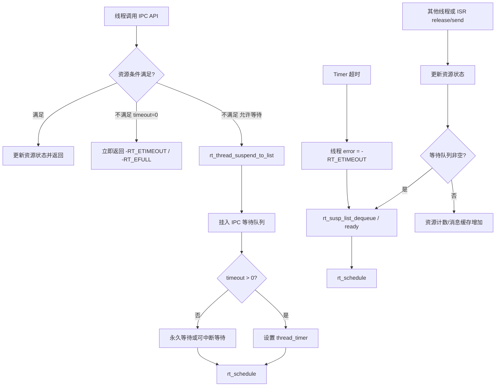
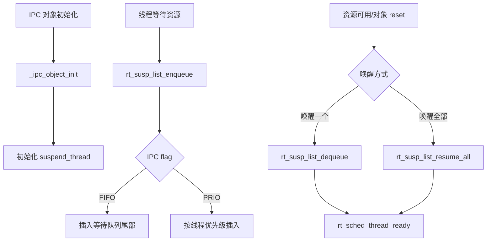
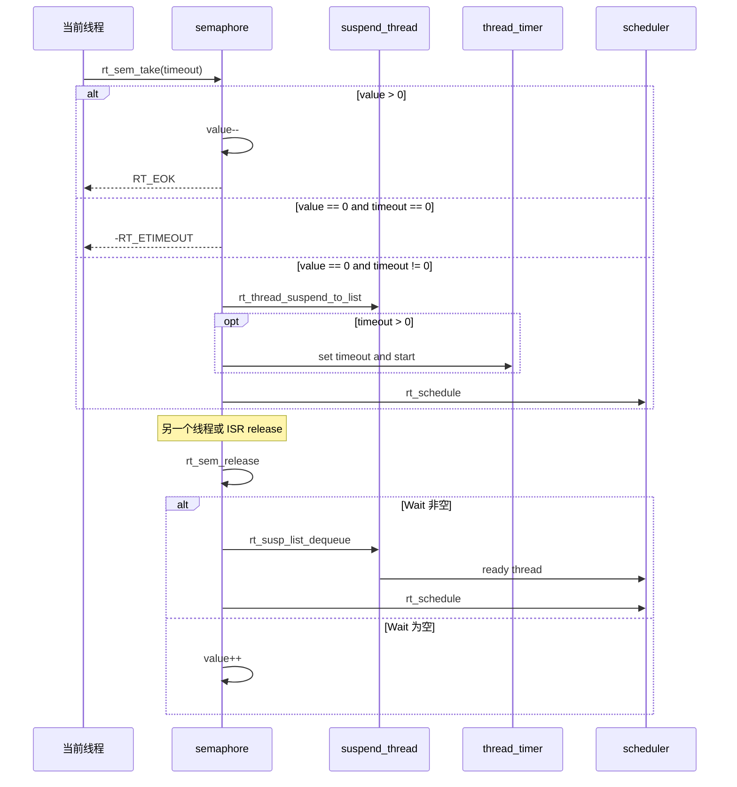
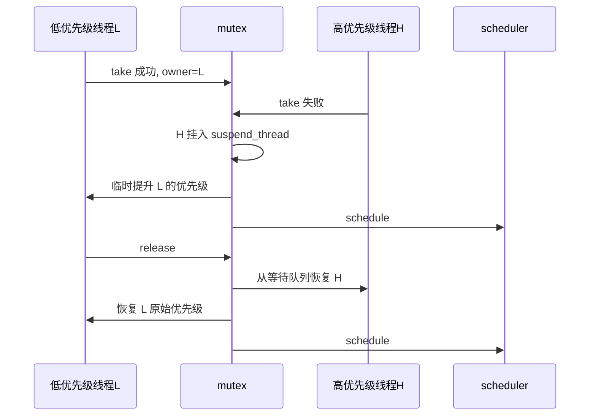
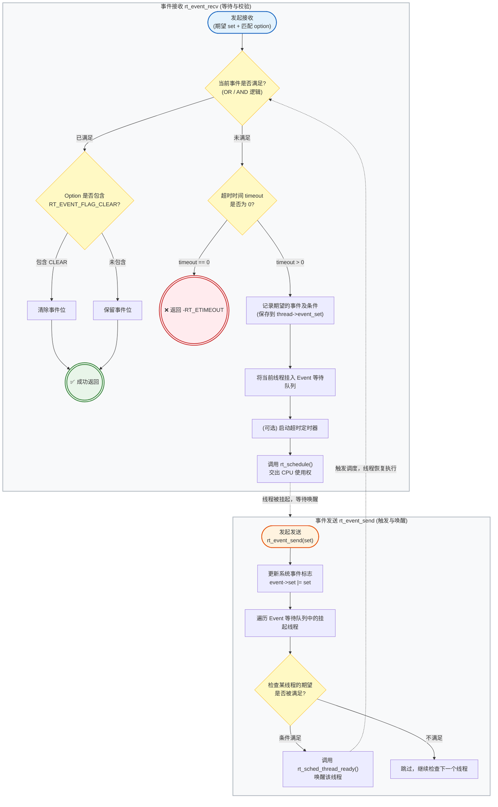
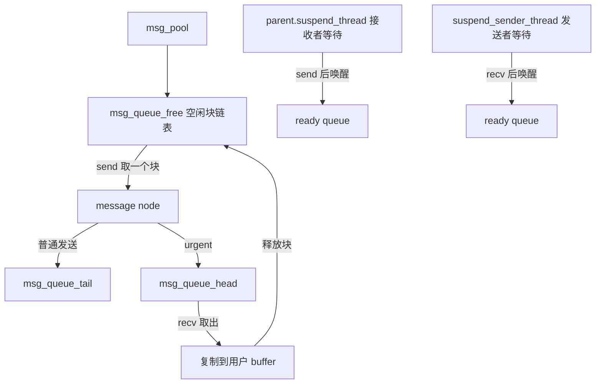

# 9. IPC-Sync：文档 + 源码融合阅读手册

## 一、这份笔记解决什么问题

你现在面对的不是“一个 4000 行的 `ipc.c` 文件”，而是一组围绕线程阻塞、唤醒、同步、通信、超时和调度的机制集合。

这一章不从第一行硬读，而是按模块读：

```text
公共等待队列骨架
-> Semaphore 信号量
-> Mutex 互斥锁
-> Event 事件集
-> Mailbox 邮箱
-> MessageQueue 消息队列
```

每个模块都采用同一套读法：

```text
先读官方设计文档，理解语义
-> 再看 rtdef.h 结构体，找资源状态和等待队列
-> 再看 ipc.c 生命周期函数
-> 再看核心 take/recv/send/release 行为
-> 最后做 Mermaid 图和自测题
```

IPC 的主轴一句话：

> IPC 对象 = 资源状态 + 等待队列 + 线程状态迁移 + 可选 timeout + 可能触发调度。

## 二、阅读入口总表

### 2.1 官方文档入口

| 模块 | 先读哪个设计文档 | 读文档时要抓什么 |
| --- | --- | --- |
| Semaphore | `documentation/3.kernel/thread-sync/thread-sync.md` 的 `# Semaphores` | 计数资源、等待队列、线程/中断同步 |
| Mutex | `documentation/3.kernel/thread-sync/thread-sync.md` 的 `# Mutex` | 独占访问、所有权、递归持有、优先级反转 |
| Event | `documentation/3.kernel/thread-sync/thread-sync.md` 的 `# Event` | 条件位、AND/OR/CLEAR、事件不累计 |
| Mailbox | `documentation/3.kernel/thread-comm/thread-comm.md` 的 `# Mailbox` | 4 字节消息、环形槽位、ISR 可发送 |
| MessageQueue | `documentation/3.kernel/thread-comm/thread-comm.md` 的 `# Message Queue` | 定长消息块、空闲链表、异步通信 |

### 2.2 源码入口

| 层次 | 文件与行号 | 用途 |
| --- | --- | --- |
| IPC 公共结构体 | `include/rtdef.h:985-1125` | `rt_ipc_object`、sem/mutex/event/mb/mq 的字段 |
| IPC 实现主体 | `src/ipc.c:82-4039` | 所有同步与通信对象的实现 |
| 线程挂起入口 | `src/thread.c:945` | `rt_thread_suspend_to_list`，线程如何进入等待队列 |
| 线程恢复入口 | `src/scheduler_comm.c:229` | `rt_sched_thread_ready`，线程如何回到就绪队列 |
| 优先级修改入口 | `src/scheduler_comm.c:401` | `rt_sched_thread_change_priority`，mutex 优先级继承最终落点 |
| 超时 Timer | `src/timer.c:562`、`src/timer.c:665` | `rt_timer_start`、`rt_timer_control` |
| 中断状态 | `src/irq.c:136` | `rt_interrupt_get_nest` |

### 2.3 `ipc.c` 模块分区

| 阅读站点         | 源码范围                  | 重点函数                                                                                       |
| ------------ | --------------------- | ------------------------------------------------------------------------------------------ |
| 公共等待队列骨架     | `src/ipc.c:82-309`    | `_ipc_object_init`、`rt_susp_list_enqueue`、`rt_susp_list_dequeue`、`rt_susp_list_resume_all` |
| Semaphore    | `src/ipc.c:321-824`   | `_sem_object_init`、`_rt_sem_take`、`rt_sem_release`、`rt_sem_control`                        |
| Mutex        | `src/ipc.c:826-1746`  | `_rt_mutex_take`、`rt_mutex_release`、`_thread_update_priority`、`_check_and_update_prio`     |
| Event        | `src/ipc.c:1748-2300` | `rt_event_send`、`_rt_event_recv`、`rt_event_control`                                        |
| Mailbox      | `src/ipc.c:2302-3047` | `_rt_mb_send_wait`、`rt_mb_urgent`、`_rt_mb_recv`                                            |
| MessageQueue | `src/ipc.c:3049-4039` | `_rt_mq_send_wait`、`rt_mq_urgent`、`_rt_mq_recv`                                            |

## 三、总图：IPC 和 Thread/Scheduler/Timer/IRQ 的关系



关键理解：

- IPC 阻塞的本质不是“函数卡住”，而是当前线程从就绪队列离开，挂到 IPC 对象的等待队列。
- IPC 唤醒的本质不是“直接运行目标线程”，而是把目标线程放回就绪队列，是否马上运行由调度器决定。
- timeout 不是 IPC 自己数时间，而是借助线程内置定时器。
- 中断上下文可以做某些非阻塞 release/send，但不能做会睡眠的 take/recv。

## 四、第 0 站：公共等待队列骨架

### 4.1 先读文档时要建立的模型

官方文档分开讲信号量、互斥量、事件、邮箱、消息队列，但源码里先抽出公共模型：

```text
每个 IPC 对象都有一个 suspend_thread 等待队列。
线程获取资源失败时，被挂到这个队列。
资源释放或消息到来时，从这个队列恢复线程。
等待队列排序方式由 RT_IPC_FLAG_FIFO / RT_IPC_FLAG_PRIO 决定。
```

### 4.2 结构体入口

```c
struct rt_ipc_object
{
    struct rt_object parent;
    rt_list_t suspend_thread;
};
```

字段解释：

| 字段 | 含义 |
| --- | --- |
| `parent` | 继承对象系统，具备 name/type/flag/list |
| `suspend_thread` | 等待这个 IPC 条件的线程队列 |

### 4.3 源码入口

| 函数 | 阅读重点 |
| --- | --- |
| `_ipc_object_init` | 初始化等待队列 |
| `rt_susp_list_enqueue` | 按 FIFO 或 PRIO 把线程插入等待队列 |
| `rt_susp_list_dequeue` | 取出一个等待线程并 ready |
| `rt_susp_list_resume_all` | reset/delete/detach 时唤醒所有等待线程 |
| `rt_susp_list_resume_all_irq` | 带自旋锁/中断保护的批量唤醒 |

### 4.4 Mermaid 行为图



### 4.5 自测

- `RT_IPC_FLAG_FIFO` 和 `RT_IPC_FLAG_PRIO` 改变的是什么？
- 等待队列里存的是 IPC 对象，还是线程对象？
- 为什么 reset/delete/detach 要唤醒所有等待线程？
- 为什么“唤醒线程”之后通常还要考虑 `rt_schedule`？

## 五、第 1 站：Semaphore 信号量

### 5.1 设计文档先抓什么

信号量是 IPC 的最小模型。官方文档说它有一个信号量值和一个线程等待队列。信号量值代表可用资源数量；值为 0 时，继续 take 的线程会被挂到等待队列。

使用场景：

| 场景 | 解释 |
| --- | --- |
| 资源计数 | value 表示剩余资源数量 |
| 线程同步 | 生产者 release，消费者 take |
| 中断通知线程 | ISR release，线程 take 等待 |
| 简单互斥 | 初值为 1 可模拟锁，但不等于 mutex |

### 5.2 结构体字段

```c
struct rt_semaphore
{
    struct rt_ipc_object parent;
    rt_uint16_t value;
    rt_uint16_t max_value;
    struct rt_spinlock spinlock;
};
```

| 字段 | 作用 |
| --- | --- |
| `value` | 当前可用资源数 |
| `max_value` | 最大资源数，防止 release 溢出 |
| `parent.suspend_thread` | 等待信号量的线程队列 |
| `spinlock` | 保护 value 和等待队列 |

### 5.3 源码阅读顺序

| 步骤 | 函数 | 读什么 |
| --- | --- | --- |
| 生命周期 | `_sem_object_init`、`rt_sem_init`、`rt_sem_create` | value/max_value/flag/spinlock 如何初始化 |
| 销毁 | `rt_sem_detach`、`rt_sem_delete` | 为什么先唤醒等待线程，再脱离对象系统 |
| 获取 | `_rt_sem_take`、`rt_sem_take`、`rt_sem_trytake` | value > 0 直接减；value = 0 根据 timeout 决定是否挂起 |
| 释放 | `rt_sem_release` | 有等待线程就唤醒，没有等待线程就 value++ |
| 控制 | `rt_sem_control` | reset / set value limit 时如何处理等待线程 |

### 5.4 核心链路



### 5.5 关键误区

- 信号量可以做同步，也可以做资源计数；不要只把它理解成锁。
- 初值为 1 的信号量能模拟互斥，但没有 owner，没有递归持有，也没有优先级继承。
- ISR 可以 release 信号量通知线程，但 ISR 不能阻塞式 take。

### 5.6 自测

| 问题 | 你应该答到 |
| --- | --- |
| 资源状态是什么？ | `value/max_value` |
| 等待队列是什么？ | `sem->parent.suspend_thread` |
| 哪个 API 会阻塞？ | `rt_sem_take` 且 value=0、timeout!=0 |
| 哪个 API 会唤醒？ | `rt_sem_release`、reset/delete/detach |
| timeout 怎么接入？ | 设置当前线程 `thread_timer` |
| 什么时候调度？ | take 挂起后；release 唤醒线程后 |

## 六、第 2 站：Mutex 互斥锁

### 6.1 设计文档先抓什么

互斥量表面像二值信号量，但本质不同：

```text
mutex 有所有权 owner。
只有持有者能 release。
同一线程可以递归 take，hold 计数增加。
高优先级线程等待低优先级持有者时，触发优先级继承。
```

所以 mutex 解决的是“临界资源独占访问 + 优先级反转风险”，不是简单的资源计数。

### 6.2 结构体字段

```c
struct rt_mutex
{
    struct rt_ipc_object parent;
    rt_uint8_t ceiling_priority;
    rt_uint8_t priority;
    rt_uint8_t hold;
    rt_uint8_t reserved;
    struct rt_thread *owner;
    rt_list_t taken_list;
    struct rt_spinlock spinlock;
};
```

| 字段 | 作用 |
| --- | --- |
| `owner` | 当前持有 mutex 的线程 |
| `hold` | 同一 owner 递归持有次数 |
| `priority` | 当前等待队列中最高优先级 |
| `ceiling_priority` | 优先级天花板机制 |
| `taken_list` | 挂到线程持有的 mutex 链表 |
| `parent.suspend_thread` | 等待该 mutex 的线程 |

### 6.3 源码阅读顺序

| 步骤 | 函数 | 读什么 |
| --- | --- | --- |
| 辅助函数 | `_mutex_update_priority`、`_thread_get_mutex_priority`、`_thread_update_priority` | 优先级继承与恢复 |
| 删除前清理 | `_mutex_before_delete_detach` | 唤醒等待线程、处理 owner 持有关系 |
| 生命周期 | `rt_mutex_init`、`rt_mutex_create`、`rt_mutex_detach`、`rt_mutex_delete` | mutex 为什么强制 PRIO |
| 获取 | `_rt_mutex_take` | 空闲、递归持有、阻塞等待、优先级继承 |
| 释放 | `rt_mutex_release` | hold--、转移 owner、恢复优先级、唤醒等待线程 |
| 控制 | `rt_mutex_control` | priority ceiling 控制 |

### 6.4 优先级继承链路



### 6.5 为什么 mutex 不是二值信号量

| 对比点 | Semaphore | Mutex |
| --- | --- | --- |
| 资源状态 | `value` | `owner + hold` |
| release 者 | 任意线程/ISR 可 release | 必须 owner release |
| 递归持有 | 不表达 | `hold` 计数支持 |
| 优先级继承 | 没有 | 有 |
| ISR 使用 | 可 release 通知线程 | 不适合 ISR |
| 典型用途 | 同步、计数、通知 | 保护临界资源 |

### 6.6 自测

| 问题 | 你应该答到 |
| --- | --- |
| 资源状态是什么？ | `owner/hold/priority/ceiling_priority` |
| 等待队列是什么？ | `mutex->parent.suspend_thread` |
| 哪个 API 会阻塞？ | `_rt_mutex_take` 在 owner 为其他线程且允许等待时 |
| 哪个 API 会唤醒？ | `rt_mutex_release`、delete/detach |
| timeout 怎么接入？ | take 失败挂起后启动当前线程 timer |
| 什么时候调度？ | take 挂起后；release 唤醒等待者后；优先级变化可能影响调度 |

## 七、第 3 站：Event 事件集

### 7.1 设计文档先抓什么

事件不是消息，也不是计数资源。事件是条件位集合。

官方文档中最重要的三句话：

```text
事件只用于同步，不传输数据。
事件不排队；同一事件多次发送，在未清除前效果等价于一次。
接收方可以选择 AND / OR / CLEAR。
```

### 7.2 结构体字段

```c
struct rt_event
{
    struct rt_ipc_object parent;
    rt_uint32_t set;
    struct rt_spinlock spinlock;
};
```

| 字段 | 作用 |
| --- | --- |
| `set` | 当前已发生事件位 |
| `thread->event_set` | 线程等待哪些事件 |
| `thread->event_info` | 线程用 AND/OR/CLEAR 哪种等待方式 |
| `parent.suspend_thread` | 等待该事件集的线程 |

### 7.3 源码阅读顺序

| 步骤 | 函数 | 读什么 |
| --- | --- | --- |
| 生命周期 | `rt_event_init`、`rt_event_create`、`rt_event_detach`、`rt_event_delete` | set 初始化和等待线程清理 |
| 发送 | `rt_event_send` | set |= 新事件，遍历等待队列，判断 AND/OR |
| 接收 | `_rt_event_recv`、`rt_event_recv` | 先尝试立即满足，不满足再挂起 |
| 控制 | `rt_event_control` | reset 时唤醒等待线程 |

### 7.4 Event 判断链路



### 7.5 自测

| 问题 | 你应该答到 |
| --- | --- |
| 资源状态是什么？ | `event->set` |
| 等待队列是什么？ | `event->parent.suspend_thread` |
| 哪个 API 会阻塞？ | `rt_event_recv` 条件不满足且 timeout!=0 |
| 哪个 API 会唤醒？ | `rt_event_send`、reset/delete/detach |
| timeout 怎么接入？ | recv 挂起后启动当前线程 timer |
| 什么时候调度？ | recv 挂起后；send 使等待线程 ready 后 |

## 八、第 4 站：Mailbox 邮箱

### 8.1 设计文档先抓什么

邮箱是低开销通信机制。每封 mail 是一个机器字，常见用法是传递小整数或指针。

文档中特别重要的点：

```text
非阻塞发送可在 ISR 中使用。
接收可能阻塞，只能在线程上下文中阻塞。
邮箱满时，send_wait 可以让发送线程等待空间。
邮箱空时，recv 可以让接收线程等待消息。
```

### 8.2 结构体字段

```c
struct rt_mailbox
{
    struct rt_ipc_object parent;
    rt_ubase_t *msg_pool;
    rt_uint16_t size;
    rt_uint16_t entry;
    rt_uint16_t in_offset;
    rt_uint16_t out_offset;
    rt_list_t suspend_sender_thread;
    struct rt_spinlock spinlock;
};
```

| 字段 | 作用 |
| --- | --- |
| `msg_pool` | 邮箱槽位数组 |
| `size` | 槽位总数 |
| `entry` | 当前已有 mail 数 |
| `in_offset/out_offset` | 环形缓冲区写/读位置 |
| `parent.suspend_thread` | 等待接收 mail 的线程 |
| `suspend_sender_thread` | 邮箱满时等待发送的线程 |

### 8.3 源码阅读顺序

| 步骤 | 函数 | 读什么 |
| --- | --- | --- |
| 生命周期 | `rt_mb_init`、`rt_mb_create`、`rt_mb_detach`、`rt_mb_delete` | msg_pool 和两个等待队列 |
| 发送等待 | `_rt_mb_send_wait`、`rt_mb_send_wait` | 满了是否挂发送者 |
| 普通发送 | `rt_mb_send` | 非阻塞发送，满了返回错误 |
| 紧急发送 | `rt_mb_urgent` | 插到接收端优先读到的位置 |
| 接收 | `_rt_mb_recv`、`rt_mb_recv` | 空了是否挂接收者；接收后是否唤醒发送者 |
| 控制 | `rt_mb_control` | reset 唤醒两类等待线程 |

### 8.4 Mailbox 双等待队列图

```mermaid
flowchart TD
    A[rt_mb_send / send_wait] --> B{邮箱满?}
    B -->|否| C[写入 msg_pool[in_offset]]
    C --> D[entry++ / in_offset 前进]
    D --> E{有接收者等待?}
    E -->|有| F[唤醒 parent.suspend_thread]

    B -->|是 timeout=0| G[-RT_EFULL]
    B -->|是 send_wait| H[挂入 suspend_sender_thread]
    H --> I[可选 timeout timer]
    I --> J[rt_schedule]

    K[rt_mb_recv] --> L{邮箱空?}
    L -->|否| M[读 msg_pool[out_offset]]
    M --> N[entry-- / out_offset 前进]
    N --> O{有发送者等待?}
    O -->|有| P[唤醒 suspend_sender_thread]
    L -->|是 允许等待| Q[挂入 parent.suspend_thread]
```

### 8.5 自测

| 问题 | 你应该答到 |
| --- | --- |
| 资源状态是什么？ | `entry/size/in_offset/out_offset/msg_pool` |
| 等待队列是什么？ | 接收者 `parent.suspend_thread`，发送者 `suspend_sender_thread` |
| 哪个 API 会阻塞？ | `rt_mb_recv` 空时；`rt_mb_send_wait` 满时 |
| 哪个 API 会唤醒？ | send 唤醒接收者；recv 唤醒发送者 |
| timeout 怎么接入？ | 发送等待或接收等待都可启动当前线程 timer |
| 什么时候调度？ | send/recv 唤醒对方等待队列后 |

## 九、第 5 站：MessageQueue 消息队列

### 9.1 设计文档先抓什么

消息队列是邮箱的扩展，但不要只说“消息更长”。它真正复杂在：

```text
每条消息有固定大小的消息块。
空闲消息块组成 msg_queue_free。
已发送消息组成 msg_queue_head/msg_queue_tail。
发送消息是从 free 取块并复制数据。
接收消息是从 head 取块，复制到用户 buffer，再放回 free。
```

### 9.2 结构体字段

```c
struct rt_messagequeue
{
    struct rt_ipc_object parent;
    void *msg_pool;
    rt_uint16_t msg_size;
    rt_uint16_t max_msgs;
    rt_uint16_t entry;
    void *msg_queue_head;
    void *msg_queue_tail;
    void *msg_queue_free;
    rt_list_t suspend_sender_thread;
    struct rt_spinlock spinlock;
};
```

| 字段 | 作用 |
| --- | --- |
| `msg_pool` | 所有消息块内存 |
| `msg_size` | 每条消息最大长度 |
| `max_msgs` | 最大消息数量 |
| `entry` | 当前队列中消息数量 |
| `msg_queue_head/tail` | 已发送消息链表 |
| `msg_queue_free` | 空闲消息块链表 |
| `parent.suspend_thread` | 等消息的接收者 |
| `suspend_sender_thread` | 队列满时等待空闲块的发送者 |

### 9.3 源码阅读顺序

| 步骤 | 函数 | 读什么 |
| --- | --- | --- |
| 生命周期 | `rt_mq_init`、`rt_mq_create`、`rt_mq_detach`、`rt_mq_delete` | 消息块池如何串成 free list |
| 发送等待 | `_rt_mq_send_wait`、`rt_mq_send_wait` | 没有 free block 时发送者如何等待 |
| 普通发送 | `rt_mq_send` | 非阻塞发送 |
| 紧急发送 | `rt_mq_urgent` | 插入消息链表头部 |
| 接收 | `_rt_mq_recv`、`rt_mq_recv` | 从 head 取消息，释放消息块 |
| 扩展 | `rt_mq_send_wait_prio`、`rt_mq_recv_prio` | 优先级消息支持 |
| 控制 | `rt_mq_control` | reset 唤醒发送者和接收者 |

### 9.4 MessageQueue 三链表图



### 9.5 自测

| 问题 | 你应该答到 |
| --- | --- |
| 资源状态是什么？ | `entry/max_msgs/msg_queue_free/msg_queue_head/msg_queue_tail` |
| 等待队列是什么？ | 接收者 `parent.suspend_thread`，发送者 `suspend_sender_thread` |
| 哪个 API 会阻塞？ | `rt_mq_recv` 空时；`rt_mq_send_wait` 满时 |
| 哪个 API 会唤醒？ | send 唤醒接收者；recv 唤醒发送者 |
| timeout 怎么接入？ | send_wait/recv 等待路径启动当前线程 timer |
| 什么时候调度？ | 唤醒对方等待队列后 |

## 十、跨模块检查清单

每读完一个 IPC 模块，都要回头检查它和其他内核模块的连接。

| 检查点 | 源码入口 | 你要确认什么 |
| --- | --- | --- |
| 线程如何挂起 | `src/thread.c:945` | `rt_thread_suspend_to_list` 如何把线程状态改为 suspended，并按 FIFO/PRIO 入队 |
| 线程如何恢复 | `src/scheduler_comm.c:229` | `rt_sched_thread_ready` 如何让线程回到 ready |
| 优先级如何改变 | `src/scheduler_comm.c:401` | `rt_sched_thread_change_priority`：mutex 优先级继承不是只改字段，而是改调度属性 |
| timeout 如何实现 | `src/timer.c:562`、`src/timer.c:665` | IPC 等待不是自己计时，而是设置线程 timer |
| 中断上下文如何判断 | `src/irq.c:136` | 哪些 API 可在 ISR 非阻塞调用，哪些不能睡眠 |

## 十一、中断上下文判断表

| API 类型 | 中断中能不能用 | 原因 |
| --- | --- | --- |
| `rt_sem_release` | 可以作为通知使用 | release 不需要阻塞，常用于 ISR 唤醒线程 |
| `rt_sem_take(timeout != 0)` | 不可以 | 获取失败会挂起当前线程，中断上下文不能睡眠 |
| `rt_mutex_take/release` | 不建议/通常不可以 | mutex 有 owner 语义和优先级继承，属于线程所有权模型 |
| `rt_event_send` | 可以作为事件通知使用 | send 可以唤醒等待线程 |
| `rt_event_recv(timeout != 0)` | 不可以 | recv 失败会阻塞 |
| `rt_mb_send` | 可以 | 官方文档说明非阻塞发送可在 ISR 中使用 |
| `rt_mb_recv(timeout != 0)` | 不可以 | 接收失败会阻塞 |
| `rt_mq_send` | 可以 | 非阻塞发送失败返回，不睡眠 |
| `rt_mq_recv(timeout != 0)` | 不可以 | 接收失败会阻塞 |
| `send_wait` 系列 | 线程上下文才安全 | 满队列时可能挂起发送者 |

判断口诀：

```text
中断里可以通知线程。
中断里不能等待资源。
会 timeout 等待的 API，默认先按线程上下文理解。
```

## 十二、最终验收题

### 12.1 固定六问

每读完一个模块，都必须回答：

1. 它的资源状态是什么？
2. 它有哪些等待队列？
3. 哪个 API 会阻塞线程？
4. 哪个 API 会唤醒线程？
5. timeout 怎么接入？
6. 什么情况下会触发 `rt_schedule`？

### 12.2 随机 API 口述题

随机抽一个 API，按下面顺序讲：

```text
设计文档语义
-> 结构体字段
-> 源码核心分支
-> 线程状态变化
-> timeout 是否接入
-> 是否触发调度
-> 中断上下文限制
```

候选 API：

| API | 考察重点 |
| --- | --- |
| `rt_sem_take` | 最小阻塞模型 |
| `rt_sem_release` | release 后是否唤醒等待线程 |
| `rt_mutex_take` | owner、hold、优先级继承 |
| `rt_mutex_release` | 恢复优先级、转移 owner |
| `rt_event_recv` | AND/OR/CLEAR |
| `rt_event_send` | 遍历等待队列匹配条件 |
| `rt_mb_send_wait` | 邮箱满时发送者等待 |
| `rt_mb_recv` | 邮箱空时接收者等待 |
| `rt_mq_send_wait` | free block 不足时等待 |
| `rt_mq_recv` | 消息块回收到 free list |

### 12.3 横向对比题

| 对比 | 必须说清 |
| --- | --- |
| Semaphore vs Mutex | 计数资源 vs 所有权锁；mutex 有 owner/hold/优先级继承 |
| Semaphore vs Event | 累计计数 vs 条件位；event 不传数据且同一事件不累计 |
| Mailbox vs MessageQueue | 机器字/指针消息 vs 定长数据拷贝 |
| `send` vs `send_wait` | 非阻塞失败返回 vs 可等待空间 |
| `recv timeout=0` vs `timeout>0` | 立即失败 vs 挂起并启动 timer |
| FIFO vs PRIO | 等待队列按进入顺序 vs 按线程优先级 |

## 十三、建议阅读节奏

### 第一天：公共骨架 + Semaphore

目标：

- 看完 `thread-sync.md` 的信号量章节。
- 看完 `rtdef.h` 的 `rt_ipc_object` 和 `rt_semaphore`。
- 看完 `ipc.c:82-824`。
- 画出 semaphore take/release 图。

验收：

> 不看源码，讲清 `rt_sem_take` 在 value=0、timeout=0、timeout>0 三种情况下怎么走。

### 第二天：Mutex

目标：

- 看完官方 Mutex 章节。
- 看完 `struct rt_mutex`。
- 看完 `ipc.c:826-1746`。
- 画出优先级继承图。

验收：

> 讲清为什么 mutex 不是二值信号量，以及优先级继承在哪里落到 scheduler。

### 第三天：Event

目标：

- 看完官方 Event 章节。
- 看完 `struct rt_event`。
- 看完 `ipc.c:1748-2300`。
- 画出 AND/OR/CLEAR 判断图。

验收：

> 讲清事件为什么不传数据，为什么同一事件重复发送不累计。

### 第四天：Mailbox

目标：

- 看完官方 Mailbox 章节。
- 看完 `struct rt_mailbox`。
- 看完 `ipc.c:2302-3047`。
- 画出接收者等待队列和发送者等待队列。

验收：

> 讲清为什么 mailbox 适合 ISR 给线程发一个指针。

### 第五天：MessageQueue

目标：

- 看完官方 Message Queue 章节。
- 看完 `struct rt_messagequeue`。
- 看完 `ipc.c:3049-4039`。
- 画出 `msg_queue_free/head/tail` 三条链。

验收：

> 讲清消息队列发送和接收时，消息块如何在 free list 和 message list 之间移动。

## 十四、和专题池的回链

| 本章内容 | 回链 |
| --- | --- |
| 阻塞/唤醒/调度闭环 | [[02-源码行为链路]] |
| 等待队列、链表、状态字段 | [[03-底层算法与数据结构]] |
| 中断上下文限制、spinlock | [[04-并发与上下文]] |
| 对象继承、init/create、control | [[05-C语言工程技巧]] |
| 调度中心化、延迟处理 | [[06-系统设计与架构模式]] |
| 面试复述 | [[90-面试复述卡片]] |

## 十五、原始记录

### 日记

- 我阅读代码的时候发生了一个非常严重的错误，就是我没有认真的看设计文档，就直接去看源码了，犯了非常大的错误啊，所有最近几日在补设计文档的阅读。

### 思考

- IPC 不能只从源码行号看，必须先从“同步/通信语义”看，再回到 `ipc.c` 验证。
- IPC 的核心不是某个 API，而是线程状态在“就绪队列”和“等待队列”之间移动。
- IPC 和中断关系很深，但中断通常只负责通知，不能做阻塞等待。

### 问题

- 信号量为什么可以用于 ISR 通知线程，而 mutex 不适合？
- mutex 的优先级继承到底在什么路径触发？
- Event 的 OR/AND/CLEAR 如何映射到 `thread->event_set` 和 `thread->event_info`？
- Mailbox 和 MessageQueue 都有发送者等待队列，它们分别在什么情况下使用？
- IPC timeout 和线程 timer 的关系，是否和 `rt_thread_delay` 是同一套底层思想？
