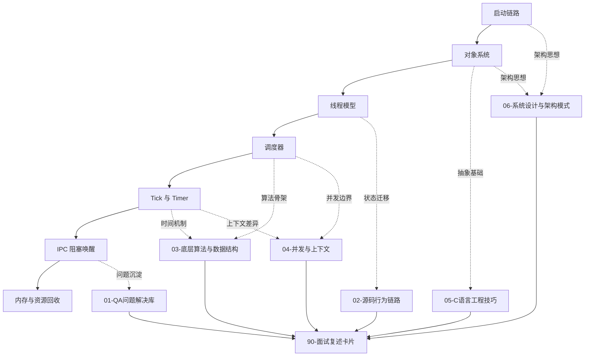
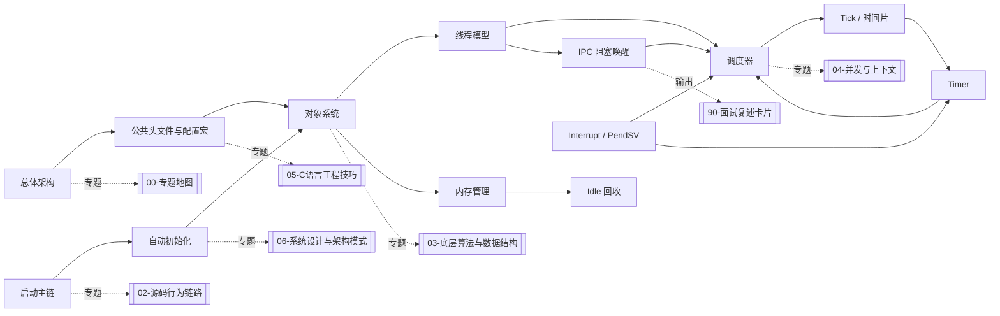

# RT-Thread 深度专题地图

> [!abstract] 核心本质
> 这套专题池不是 V2 那种快速总览，而是把你在 RT-Thread 源码阅读中反复遇到的疑问、算法、C 工程技巧和系统设计模式，沉淀成可以长期复读的“源码理解手册”。

## 一、为什么需要专题池

原始模块笔记有一个很自然的问题：你是按源码阅读顺序记录的，所以一个文件里会同时出现源码链路、个人疑问、算法原理、C 语言技巧、架构设计、面试表达。这样适合现场学习，但不适合长期复盘。

专题池的目标是把这些内容重新分层：

| 层级 | 解决的问题 | 典型内容 |
| --- | --- | --- |
| 模块笔记 | 某个模块代码怎么走 | Timer、Thread、Scheduler、Object |
| 专题笔记 | 跨模块机制为什么这么设计 | 自旋锁、位图、跳表、PendSV、对象系统 |
| 面试卡片 | 如何快速复述 | 30 秒版、2 分钟版、追问版 |

模块笔记以后继续保留“源码链路味道”，专题笔记负责承接跨模块知识。这样 Timer 文件就不用反复解释自旋锁、跳表、C 语言对象模型，而是通过双链连接到专题。

## 二、RT-Thread 阅读主线

RT-Thread 内核源码可以按照一条主链理解：

```text
启动 -> 对象 -> 线程 -> 调度 -> Tick/Timer -> IPC -> 内存
```

这条链不是目录顺序，而是运行顺序。

1. 启动阶段建立裸机到 RTOS 的边界。
2. 对象系统提供统一生命周期和统一容器。
3. 线程模型提供可调度执行单元。
4. 调度器决定谁获得 CPU。
5. Tick 和 Timer 把时间推进转成线程状态变化。
6. IPC 把资源条件转成阻塞和唤醒。
7. 内存管理支撑动态对象、线程栈、消息块等资源。

## 三、专题总图



## 四、文件分工

### [[01-QA问题解决库]]

这里收集你的真实疑问，尤其是笔记里出现的“不懂”“为什么”“没看懂”。它不只是问题列表，而是每个问题都要形成闭环：

```text
原始困惑 -> 一句话答案 -> 机制拆解 -> 源码入口 -> 后续深挖
```

适合放：

- Timer 为什么要自旋锁？
- 线程定时器为什么特殊？
- tick 为什么不能超过最大值一半？
- PendSV 到底是什么？
- 调度器锁和关中断有什么区别？
- 为什么不建议挂起别的线程？
- `init/create`、`detach/delete` 为什么要分两套？

### [[02-源码行为链路]]

这里不按模块，而按行为看源码。

模块笔记回答“Timer 文件里有什么”，行为链路回答“一个动作从 API 到底层发生了什么”。

适合放：

- `rt_thread_create -> _thread_init -> rt_thread_startup -> rt_schedule`
- `rt_thread_suspend -> rt_sched_remove_thread -> IPC suspend list`
- `rt_thread_resume -> rt_sched_thread_ready -> rt_sched_unlock_n_resched`
- `rt_timer_start -> _timer_start -> skip list insert`
- `SysTick -> rt_tick_increase -> rt_timer_check`

### [[03-底层算法与数据结构]]

这里放 RTOS 的算法骨架。

适合放：

- 位图 + 链表数组
- 侵入式双向链表
- 跳表
- 状态位掩码
- tick 回绕判断
- `__rt_ffs`
- 32/256 优先级映射

### [[04-并发与上下文]]

这里解决 RTOS 最容易混的几个概念。

适合放：

- 关中断
- 调度器锁
- 自旋锁
- SMP 多核竞态
- 线程上下文 vs 中断上下文
- PendSV 延迟切换
- 硬定时器 vs 软定时器

### [[05-C语言工程技巧]]

这里放你可以迁移到自己项目里的 C 语言写法。

适合放：

- 对象头继承
- `container_of`
- `void *arg`
- 函数指针表
- Hook 机制
- 宏裁剪
- 错误回滚
- 级联封装
- `control/ioctl` 风格接口

### [[06-系统设计与架构模式]]

这里提升到架构师视角。

适合放：

- 自动初始化
- 对象系统
- 软硬件解耦
- Bottom Half
- Idle 回收
- 资源分配层和核心逻辑层分离
- 调度请求延迟处理

### [[90-面试复述卡片]]

这是输出层，不代替深度专题。

每个专题最终要提炼成：

```text
30 秒版：快速回答
2 分钟版：追问展开
追问版：面试官继续问时怎么打
```

## 五、阅读路线

### 路线 A：继续读源码

```text
02-源码行为链路
-> 03-底层算法与数据结构
-> 04-并发与上下文
-> 回到原模块笔记
```

如果你正在读 Timer，就先看 `03` 里的跳表和 tick 回绕，再看 `04` 里的软硬定时器上下文，最后回到 [[7.Timer]]。

### 路线 B：整理旧笔记

```text
原模块笔记
-> 抽出疑问到 01
-> 抽出算法到 03
-> 抽出 C 技巧到 05
-> 抽出架构思想到 06
-> 模块正文瘦身
```

这个路线后续用于重构 [[7.Timer]]、[[4.(Thread)线程的创建和理解]]、[[5.Scheduler(调度器)-单核和底层驱动]]。

### 路线 C：准备面试

```text
90-面试复述卡片
-> 不熟的题回到对应专题
-> 再回原模块确认源码入口
```

## 六、维护规则

### 规则 1：一个概念只在一个主专题写全

例如“调度器锁 vs 关中断”主专题放在 [[04-并发与上下文]]。Timer、Thread、Scheduler 中如果遇到它，只双链引用，不重复展开。

### 规则 2：模块笔记保留源码路径，专题笔记负责解释机制

模块笔记应该保留：

- 函数链路
- 关键代码片段
- 你的源码注释
- 特定模块的状态变化

专题笔记应该承接：

- 通用算法
- 通用 C 技巧
- 通用并发原则
- 可迁移的设计模式

### 规则 3：每个结论都要能回到源码入口

专题不是凭空讲理论。每个专题至少要写清：

```text
这个机制在哪个模块出现？
哪个函数能验证？
它改变了哪个对象或状态？
它是否可能触发调度？
```

### 规则 4：Mermaid 服务理解，不当装饰

建议图形选择：

| 场景 | Mermaid 类型 |
| --- | --- |
| 行为流程 | `flowchart` |
| API 调用链 | `sequenceDiagram` |
| 线程/定时器状态 | `stateDiagram-v2` |
| 结构体关系 | `classDiagram` |

## 七、后续重构 Timer 的使用方式

重构 [[7.Timer]] 时，正文只保留 Timer 自己的生命周期：

```text
模块定位
核心对象
系统初始化
create/delete
init/detach
start/stop
control
check/timeout
debug
```

然后把跨模块解释移动或链接到专题：

| Timer 中的内容 | 后续去向 |
| --- | --- |
| 跳表 | [[03-底层算法与数据结构]] |
| tick 回绕 | [[03-底层算法与数据结构]] |
| 自旋锁 | [[04-并发与上下文]] |
| 软硬定时器上下文 | [[04-并发与上下文]] |
| Bottom Half | [[06-系统设计与架构模式]] |
| `control/ioctl` | [[05-C语言工程技巧]] |
| 线程定时器特判 | [[01-QA问题解决库]] + [[02-源码行为链路]] |

## 八、广度覆盖矩阵

这一节是为了回应“从头到尾的模块覆盖”而补的总索引。前面的专题已经能深入解释一些重点机制，但还不够像一张全图；以后读源码时，先看这里判断某个知识点应该放到哪个专题，再决定是否深挖。

### 8.1 模块到专题的归属

| 原始模块 | 必须覆盖的知识点 | 主专题归宿 | 辅助专题 |
| --- | --- | --- | --- |
| [[1.总体架构的理解]] | RT-Thread 定位、源码目录、运行形态、分层架构、学习路线 | [[00-专题地图]] | [[06-系统设计与架构模式]] |
| [[1.总体架构的理解]] | `rtthread.h`、`rtdef.h`、对象类型枚举、公共类型边界 | [[05-C语言工程技巧]] | [[03-底层算法与数据结构]] |
| [[1.总体架构的理解]] | `RT_USING_HEAP`、`RT_USING_HOOK`、`#error`、`RT_ASSERT` | [[05-C语言工程技巧]] | [[04-并发与上下文]] |
| [[2.启动主链分析]] | `rtthread_startup`、board init、components init、main thread | [[02-源码行为链路]] | [[06-系统设计与架构模式]] |
| [[2.启动主链分析]] | 自动初始化、`INIT_EXPORT`、链接段、`$Sub$$main`/`$Super$$main` | [[06-系统设计与架构模式]] | [[05-C语言工程技巧]] |
| [[3.深化启动的理解+理解对象系统]] | STM32/QEMU 初始化差异、heap/cache/console | [[06-系统设计与架构模式]] | [[04-并发与上下文]] |
| [[3.深化启动的理解+理解对象系统]] | 对象容器、对象查找、静态/动态对象、钩子、FinSH 调试 | [[03-底层算法与数据结构]] | [[05-C语言工程技巧]] |
| [[4.(Thread)线程的创建和理解]] | TCB、栈、优先级、时间片、线程定时器、IPC字段 | [[02-源码行为链路]] | [[03-底层算法与数据结构]] |
| [[4.(Thread)线程的创建和理解]] | create/init、startup、yield、sleep、delay_until、control、delete/detach | [[02-源码行为链路]] | [[01-QA问题解决库]] |
| [[5.Scheduler(调度器)-单核和底层驱动]] | 位图、就绪链表数组、`__rt_ffs`、调度器锁、上下文切换 | [[03-底层算法与数据结构]] | [[04-并发与上下文]] |
| [[5.Scheduler(调度器)-单核和底层驱动]] | `rt_schedule`、ready insert/remove、软硬件解耦、延迟调度 | [[02-源码行为链路]] | [[06-系统设计与架构模式]] |
| [[6.Scheduler-上层调度]] | `rt_sched_thread_init_ctx`、线程定时器启停、状态/优先级接口 | [[02-源码行为链路]] | [[03-底层算法与数据结构]] |
| [[6.Scheduler-上层调度]] | tick 驱动时间片、优先级更新、栈溢出检测 | [[04-并发与上下文]] | [[90-面试复述卡片]] |
| [[7.Timer]] | tick、硬/软定时器、跳表、start/stop/check/control/dump | [[02-源码行为链路]] | [[03-底层算法与数据结构]] |
| [[8.Interrupt]] | 中断上下文、嵌套计数、PendSV、关中断临界区 | [[04-并发与上下文]] | [[02-源码行为链路]] |
| [[../9.IPC-Sync-文档]] | 信号量、互斥量、事件、邮箱、消息队列、等待队列、超时唤醒 | [[02-源码行为链路]] | [[04-并发与上下文]] |
| [[RT-thread源码阅读-v2/07-内存管理]] | heap、memheap、mempool、slab、静态/动态分配、释放时机 | [[03-底层算法与数据结构]] | [[06-系统设计与架构模式]] |
| [[4.29阅读想法]] | 真实疑问、重复卡点、二刷路线、行为链路阅读法 | [[01-QA问题解决库]] | [[90-面试复述卡片]] |

### 8.2 从源码模块到专题池的总图



### 8.3 广度优先的最低覆盖标准

每个知识点先做到下面 6 件事，不急着写成长篇：

```text
核心问题：这个点到底在解决什么问题？
一句话本质：能不能用一句话抓住它？
源码入口：去哪个函数/文件验证？
关联模块：它会影响 Thread / Scheduler / Timer / IPC / Memory 哪些模块？
面试表达：如果被问到，30 秒怎么说？
后续深挖：下一轮要补哪段源码、哪张图、哪个边界条件？
```

### 8.4 后续深挖队列

| 优先级 | 深挖对象 | 为什么优先 |
| --- | --- | --- |
| P0 | Thread + Scheduler + Timer 互相调用 | 这是 RTOS 的主脉络，面试也最常问 |
| P0 | IPC 阻塞/唤醒/超时 | 你后面准备进入 IPC，必须提前把调度关联想清楚 |
| P1 | 自动初始化 + 对象系统 | 这是 RT-Thread 很有特色的架构设计 |
| P1 | 内存管理 + Idle 回收 | 关系到动态对象 delete、线程退出和资源生命周期 |
| P2 | Interrupt/PendSV/移植层 | 能把 RTOS 和芯片架构真正接起来 |
