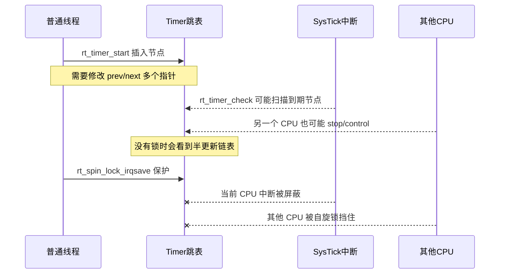
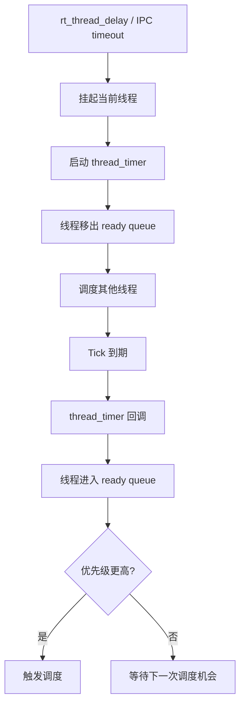
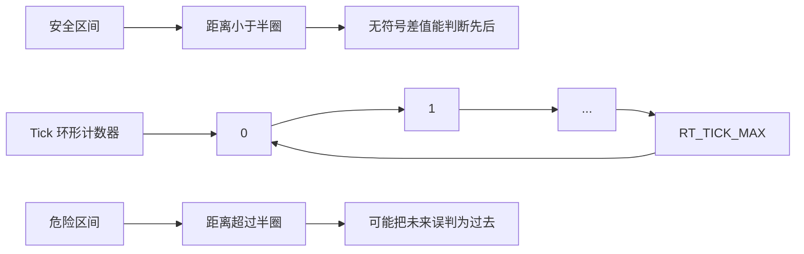
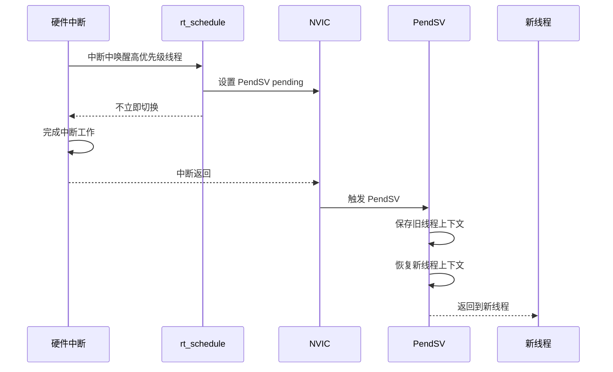
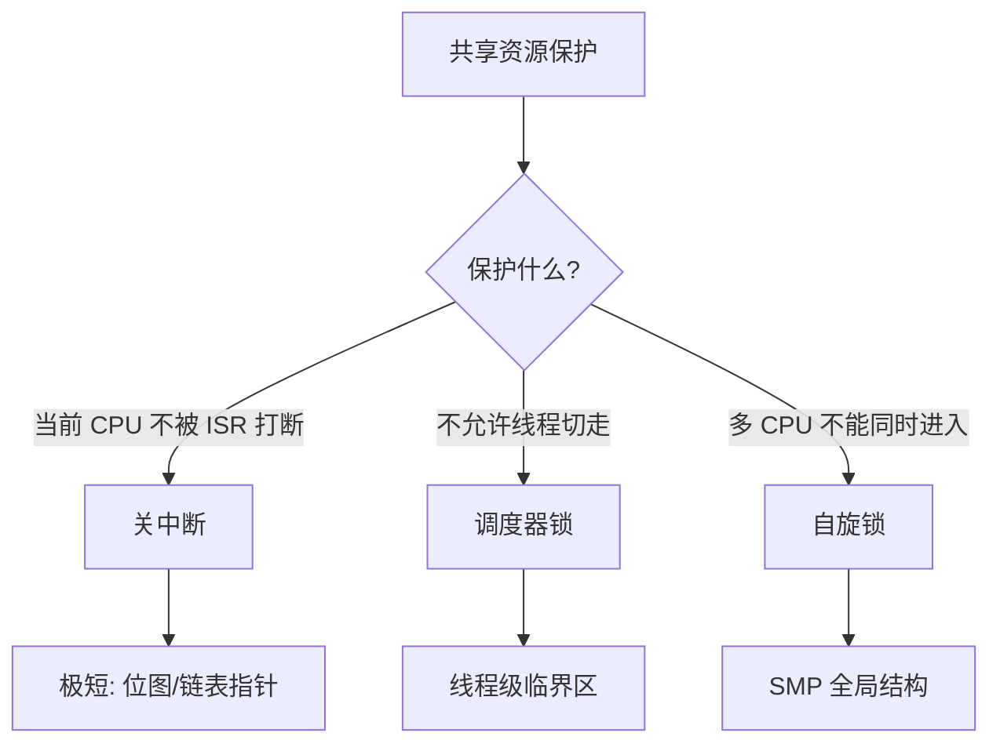
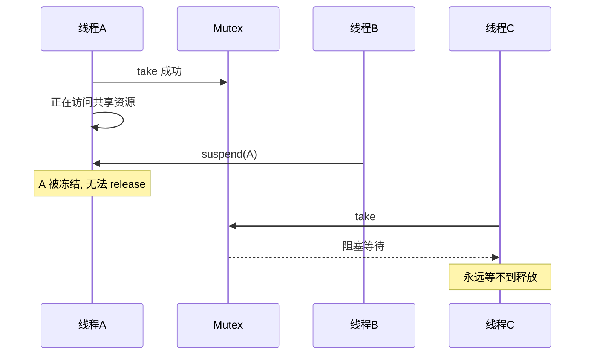
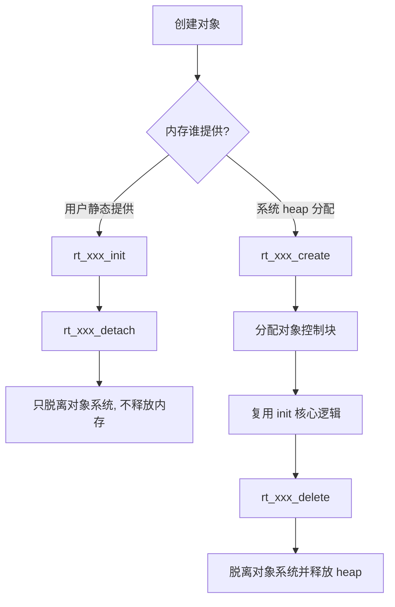

# Q&A 问题解决库

> [!abstract] 核心本质
> Q&A 库不是“问题备忘录”，而是把你源码阅读中卡住的地方转成可复述的知识闭环：为什么不懂、现在怎么理解、去哪个源码入口验证。

## 一、问题整理方法

每个问题按以下结构整理：

```text
原始困惑：你当时卡在哪里
一句话答案：先抓住本质
机制拆解：一步一步讲清楚
源码入口：回到哪个函数验证
专题归属：后续链接到哪个深度专题
面试追问：面试官可能怎么问
```

这套结构的价值是：你不会只停留在“好像懂了”，而是能把问题重新讲出来。

## 二、Timer 为什么需要自旋锁

### 原始困惑

在 [[7.Timer]] 里你问过：

> 没看懂为什么在 Time 系统的初始化要初始化自旋锁。自旋锁在 Time 模块里的作用是什么？为什么需要并发？

### 一句话答案

Timer 的全局跳表会被多个上下文访问：SysTick 中断会检查和摘除定时器，普通线程会 start/stop/control 定时器，SMP 下多个 CPU 也可能同时访问，所以必须用自旋锁保护链表结构。

### 机制拆解

Timer 模块里最危险的不是 `timeout_func` 本身，而是全局定时器链表：

```text
_timer_list       硬定时器跳表
_soft_timer_list  软定时器跳表
```

这些链表会被两类路径访问：

1. 中断路径：`SysTick -> rt_tick_increase -> rt_timer_check -> _timer_check`
2. 线程路径：`rt_timer_start`、`rt_timer_stop`、`rt_timer_control`

如果线程正在执行 `_timer_start` 插入节点，刚改完 `prev` 还没改 `next`，SysTick 中断突然进来扫描链表，就可能看到一个半更新状态，链表会断裂或形成环。

在单核系统里，关中断通常可以避免当前 CPU 被中断打断；但在 SMP 多核系统里，一个 CPU 关中断并不能阻止另一个 CPU 同时访问同一张链表。所以 Timer 同时需要：

```text
关中断：保护当前 CPU 不被中断抢走
自旋锁：保护多个 CPU 不同时进入共享链表
```

### Mermaid 图



### 源码入口

- [[7.Timer]]：`rt_system_timer_init`
- [[7.Timer]]：`rt_timer_start`
- [[7.Timer]]：`rt_timer_stop`
- [[7.Timer]]：`_timer_check`
- [[3.深化启动的理解+理解对象系统]]：自旋锁使用禁忌

### 面试追问

如果面试官问“关中断不就行了吗”，回答重点是：

> 单核关中断能防止当前 CPU 被 ISR 打断，但 SMP 下另一个 CPU 仍然能并发访问共享链表。自旋锁解决的是多 CPU 间互斥，关中断解决的是当前 CPU 的中断重入，两者保护对象不同。

## 三、线程定时器为什么特殊

### 原始困惑

在 [[7.Timer]] 中你问：

> 线程定时器特判没有懂。

### 一句话答案

线程定时器不是普通用户定时器，它是线程阻塞超时机制的一部分，启动或停止它时不仅要操作 Timer 跳表，还要同步修改线程调度状态。

### 机制拆解

每个线程内部有一个 `thread_timer`。它服务这些行为：

- `rt_thread_sleep`
- `rt_thread_delay`
- IPC 等待超时
- 线程挂起后的超时唤醒

普通定时器到期后只是执行回调；线程定时器到期后通常意味着：

```text
线程等待时间到了
-> 从 suspend list 移出
-> 进入 ready queue
-> 可能触发调度
```

所以 `rt_timer_start` 遇到 `RT_TIMER_FLAG_THREAD_TIMER` 时，需要额外进入调度器临界区，并通过调度器提供的接口更新线程 timer 状态。

### Mermaid 图



### 源码入口

- [[7.Timer]]：`rt_timer_start`
- [[4.(Thread)线程的创建和理解]]：`rt_thread_suspend_to_list`
- [[4.(Thread)线程的创建和理解]]：`rt_thread_resume`
- [[6.Scheduler-上层调度]]：线程 timer start/stop

### 面试追问

> 为什么线程 sleep 不是忙等？

因为 sleep 会让线程挂起并启动线程内置 timer，CPU 去运行其他 ready 线程。到期后 timer 再把线程唤醒，而不是线程自己一直循环看时间。

## 四、tick 为什么不能超过最大值一半

### 原始困惑

在 [[7.Timer]] 中你问：

> 如果设定的延时超过了最大 Tick 的一半，底层的超时判断逻辑就会失效，出现时间倒流的错觉，不理解。

### 一句话答案

RT-Thread 用无符号减法判断时间先后，为了区分“已经超时”和“还很久才超时”，必须假设两个 tick 的距离小于计数范围的一半。

### 机制拆解

定时器判断常见写法：

```c
if ((current_tick - timeout_tick) < RT_TICK_MAX / 2)
{
    /* timeout */
}
```

它利用无符号整数回绕特性。

假设 `rt_tick_t` 是 32 位：

```text
0 -> 1 -> 2 -> ... -> 0xFFFFFFFF -> 0 -> 1
```

当 `current_tick` 刚好回绕后，普通大小比较会失效：

```text
timeout_tick = 0xFFFFFFF0
current_tick = 0x00000010
```

直接看数值，`current_tick` 比 `timeout_tick` 小；但从时间流逝看，current 已经越过 timeout。

无符号减法可以解决这个问题，但前提是距离不能超过半圈。超过半圈后，一个差值到底代表“刚刚过期”还是“还差很久”，就无法区分。

### Mermaid 图



### 源码入口

- [[7.Timer]]：`rt_timer_create`
- [[7.Timer]]：`rt_timer_control`
- [[7.Timer]]：`_timer_start`
- [[7.Timer]]：`_timer_check`
- [[03-底层算法与数据结构]]：tick 回绕判断

### 面试追问

> 为什么不用普通 `current_tick >= timeout_tick`？

因为 tick 会回绕。普通大小比较只能在线性时间轴上成立，而 tick 是环形计数器。

## 五、PendSV 切换到底是什么

### 原始困惑

在 [[4.(Thread)线程的创建和理解]] 和 [[5.Scheduler(调度器)-单核和底层驱动]] 中你多次提到：

> PendSV 切换是什么东西？为什么中断环境不能直接切换？

### 一句话答案

PendSV 是 Cortex-M 上专门用来延后执行上下文切换的异常，RTOS 可以在中断里只设置切换请求，等所有高优先级中断退出后，再用 PendSV 安全切换线程栈。

### 机制拆解

线程切换本质是保存当前线程寄存器、切换栈指针、恢复下一个线程寄存器。

普通线程上下文可以直接触发切换；但中断上下文不适合直接切，因为：

- 中断可能嵌套。
- 当前正在使用硬件中断栈。
- 中断优先级高于普通线程。
- 如果在 ISR 中直接切线程，返回路径会混乱。

所以 RTOS 通常这样做：

```text
ISR 中发现需要调度
-> 设置 PendSV pending
-> ISR 继续执行并返回
-> 硬件发现 PendSV 挂起
-> PendSV 执行真正上下文切换
```

### Mermaid 图



### 源码入口

- [[5.Scheduler(调度器)-单核和底层驱动]]：`rt_schedule`
- [[5.Scheduler(调度器)-单核和底层驱动]]：`rt_hw_context_switch_interrupt`
- [[4.(Thread)线程的创建和理解]]：`rt_thread_resume`
- [[04-并发与上下文]]：上下文切换专题

### 面试追问

> 为什么 PendSV 通常设置为最低优先级？

因为上下文切换不应该打断真正紧急的硬件中断。它应该等高优先级 ISR 都处理完，再进行线程级调度。

## 六、调度器锁和关中断有什么区别

### 原始困惑

你在 [[5.Scheduler(调度器)-单核和底层驱动]] 里已经整理过这个问题，但它是跨模块高频概念，值得放进 Q&A。

### 一句话答案

关中断禁止当前 CPU 响应硬件中断；调度器锁禁止线程切换，但不阻止中断进入。

### 对比表

| 机制 | 禁止硬件中断 | 禁止线程切换 | 典型用途 | 代价 |
| --- | --- | --- | --- | --- |
| 关中断 | 是 | 间接禁止 | 极短原子操作、链表指针修改 | 中断延迟变大 |
| 调度器锁 | 否 | 是 | 较长一点的线程临界区 | 高优先级线程切换被推迟 |
| 自旋锁 | 否，常配合 irqsave | 是，多核互斥 | SMP 共享结构保护 | 其他 CPU 忙等 |

### Mermaid 图



### 源码入口

- [[5.Scheduler(调度器)-单核和底层驱动]]：`rt_enter_critical`
- [[5.Scheduler(调度器)-单核和底层驱动]]：`rt_sched_lock`
- [[7.Timer]]：`rt_spin_lock_irqsave`
- [[04-并发与上下文]]

### 面试追问

> 调度器锁期间来了高优先级线程怎么办？

调度请求不会丢，内核会记录切换标志，等锁释放到最后一层时补一次调度。

## 七、为什么不建议随意挂起别的线程

### 原始困惑

在 [[4.(Thread)线程的创建和理解]] 中，你整理过作者的警告：

> 不要随意 suspend other threads。

### 一句话答案

因为外部线程不知道目标线程当前是否持有锁、正在操作设备、正在分配内存，强行挂起可能让资源永远不释放，导致系统死锁。

### 机制拆解

线程阻塞最好是“自愿”的：

```text
我等信号量 -> 我知道自己要进入等待队列
我 sleep -> 我知道自己让出 CPU
我 wait event -> 我知道条件满足再回来
```

外部强挂起是“强制冻结”：

```text
线程 A 正持有 mutex
线程 B 强行 suspend A
线程 C 等 mutex
mutex 永远不释放
系统死锁
```

### Mermaid 图



### 源码入口

- [[4.(Thread)线程的创建和理解]]：`rt_thread_suspend_to_list`
- [[4.(Thread)线程的创建和理解]]：`rt_thread_suspend`
- [[4.(Thread)线程的创建和理解]]：`rt_thread_resume`
- [[06-系统设计与架构模式]]：资源生命周期设计

### 面试追问

> 如果真的想让线程退出，应该怎么做？

用事件、标志位、消息等方式通知线程自己退出。线程在自己的主循环里收到退出请求后，主动释放资源并 return。

## 八、`init/create` 和 `detach/delete` 为什么分两套

### 原始困惑

在 [[4.29阅读想法]] 和 [[7.Timer]] 中，你反复提到：

> 动态实现需要申请两块地址；分配与初始化分离是 C 语言实现面向对象的经典模式。

### 一句话答案

`init/detach` 管用户提供的静态对象，`create/delete` 管系统 heap 分配的动态对象。两套 API 的核心区别是内存所有权。

### 机制拆解

静态对象：

```text
用户提供 struct + stack/buffer
-> rt_xxx_init 初始化
-> rt_xxx_detach 脱离对象系统
-> 内存仍归用户
```

动态对象：

```text
rt_xxx_create 调用 object_allocate / heap
-> 内部复用 init 逻辑
-> rt_xxx_delete 脱离对象系统并释放 heap
```

误用后果：

| 误用 | 后果 |
| --- | --- |
| 静态对象用 delete | 可能非法释放用户内存 |
| 动态对象只 detach | heap 内存泄漏 |
| create 失败不回滚 | 半初始化对象残留 |

### Mermaid 图



### 源码入口

- [[3.深化启动的理解+理解对象系统]]：对象静态/动态生命周期
- [[4.(Thread)线程的创建和理解]]：`rt_thread_init` / `rt_thread_create`
- [[7.Timer]]：`rt_timer_init` / `rt_timer_create`
- [[05-C语言工程技巧]]：分配与初始化分离

### 面试追问

> 为什么动态 create 最终还要复用 init？

因为资源分配和核心初始化是两件事。复用 init 可以避免静态/动态两套逻辑漂移，符合 DRY 原则。

## 九、广度补全：从全部模块抽出的基础问题

下面这些不是要立刻写成长篇，而是先把你从 [[1.总体架构的理解]] 到 [[../9.IPC-Sync-文档]] 里真实出现过的困惑放进问题库。每个问题都保留“为什么不懂、现在怎么理解、去哪里验证”，以后深入时再升级为独立长文。

### 9.1 启动顺序为什么要分 board init、components init、main thread

| 项目 | 内容 |
| --- | --- |
| 我为什么不懂 | 看 [[2.启动主链分析]] 和 [[4.29阅读想法]] 时容易把 `rt_hw_board_init`、`rt_components_board_init`、`rt_components_init`、`main_thread_entry` 看成一串普通函数调用。 |
| 现在怎么理解 | 启动不是简单“依次调用”，而是在不同能力阶段开放不同资源：板级硬件先准备，早期组件在调度器前初始化，高级组件放进第一个系统线程后初始化。 |
| 源码入口 | `rtthread_startup`、`rt_hw_board_init`、`rt_components_board_init`、`rt_application_init`、`main_thread_entry`。 |
| 关联模块 | [[02-源码行为链路]]、[[06-系统设计与架构模式]]、[[05-C语言工程技巧]]。 |
| 面试表达 | RT-Thread 把启动拆成多个阶段，是为了匹配“硬件可用、内存可用、调度器可用、线程上下文可用”这些能力边界。 |
| 后续深挖 | 画出“启动阶段能力表”：每个阶段能不能 malloc、能不能调度、能不能阻塞、能不能访问设备。 |

### 9.2 自动初始化为什么依赖链接段，而不是手写初始化数组

| 项目 | 内容 |
| --- | --- |
| 我为什么不懂 | `INIT_EXPORT` 看起来只是宏，但它背后牵涉编译器属性、链接脚本、段遍历，跨度很大。 |
| 现在怎么理解 | 自动初始化把“模块注册”从中心启动文件里拆出去，让组件自己声明初始化等级；链接器把这些函数指针排到指定段，启动时统一遍历。 |
| 源码入口 | `INIT_EXPORT`、`INIT_BOARD_EXPORT`、`INIT_COMPONENT_EXPORT`、`rt_components_board_init`、`rt_components_init`。 |
| 关联模块 | [[2.启动主链分析]]、[[06-系统设计与架构模式]]、[[05-C语言工程技巧]]。 |
| 面试表达 | 这是 C 语言里的插件化初始化机制，解决“新增模块就要改启动主函数”的耦合问题。 |
| 后续深挖 | 对比 GCC section、ARMCC `$Sub$$main`/`$Super$$main`、链接脚本排序。 |

### 9.3 对象容器到底解决什么问题

| 项目 | 内容 |
| --- | --- |
| 我为什么不懂 | [[4.29阅读想法]] 里你提到“容器是大数组、里面有链表头、查找时先找 type 再遍历”，说明你已经抓到结构，但还缺少系统视角。 |
| 现在怎么理解 | 对象容器不是为了好看，而是为了让线程、定时器、信号量、设备等不同对象可以被统一命名、统一查找、统一遍历、统一调试。 |
| 源码入口 | `rt_object_information`、`rt_object_container`、`rt_object_get_information`、`rt_object_init`、`rt_object_allocate`、`rt_object_find`。 |
| 关联模块 | [[3.深化启动的理解+理解对象系统]]、[[03-底层算法与数据结构]]、[[05-C语言工程技巧]]。 |
| 面试表达 | RT-Thread 用对象头 + 对象容器在 C 里实现了一套轻量运行时对象系统。 |
| 后续深挖 | 把 `rt_thread`、`rt_timer`、IPC 对象的第一个成员都对齐到 `rt_object` 来看。 |

### 9.4 `Null` 对象类型有什么意义

| 项目 | 内容 |
| --- | --- |
| 我为什么不懂 | [[4.29阅读想法]] 里你问“Null对象有什么用吗”，这是读对象枚举时很自然的卡点。 |
| 现在怎么理解 | `Null` 常用于表示无效类型、占位类型或初始化前状态。它不一定对应真实业务对象，但能让类型判断和防御性检查有一个明确的“空状态”。 |
| 源码入口 | `enum rt_object_class_type`、对象类型检查、对象初始化前后的 `type` 设置。 |
| 关联模块 | [[1.总体架构的理解]]、[[3.深化启动的理解+理解对象系统]]、[[05-C语言工程技巧]]。 |
| 面试表达 | 枚举里的 Null 类型是防御性设计，避免未初始化对象被误认为某种合法内核对象。 |
| 后续深挖 | 找对象 detach/delete 后是否清类型，以及 `RT_Object_Class_Static` 标志如何叠加。 |

### 9.5 线程删除为什么会牵涉 IPC、调度器、Idle、内存

| 项目 | 内容 |
| --- | --- |
| 我为什么不懂 | 你在 [[4.29阅读想法]] 里已经观察到“删除流程从通信模块到调度器模块最后到硬件内存模块”，但还没完全归纳成链路。 |
| 现在怎么理解 | 线程不是孤立结构体，它可能挂在就绪队列、等待队列、定时器链表和对象容器里。删除必须先断开这些关系，再决定资源由谁释放。 |
| 源码入口 | `rt_thread_delete`、`rt_thread_detach`、`_thread_detach`、`rt_sched_thread_remove`、`rt_timer_detach`、idle 回收相关逻辑。 |
| 关联模块 | [[4.(Thread)线程的创建和理解]]、[[5.Scheduler(调度器)-单核和底层驱动]]、[[6.Scheduler-上层调度]]、[[7.Timer]]。 |
| 面试表达 | 线程生命周期管理的难点不在 free，而在先把它从所有内核关系网里安全摘掉。 |
| 后续深挖 | 单独画“线程 delete/detach 行为链路”，区分当前线程删除、其他线程删除、静态线程 detach。 |

### 9.6 `yield`、`sleep`、`delay`、`delay_until` 有什么不同

| 项目 | 内容 |
| --- | --- |
| 我为什么不懂 | [[4.(Thread)线程的创建和理解]] 里这些 API 靠得很近，看起来都像“让出 CPU”。 |
| 现在怎么理解 | `yield` 是主动让同优先级线程获得机会；`sleep/delay` 是把当前线程挂起到定时器超时；`delay_until` 面向周期任务，减少累积误差。 |
| 源码入口 | `rt_thread_yield`、`rt_thread_sleep`、`rt_thread_delay`、`rt_thread_mdelay`、`rt_thread_delay_until`。 |
| 关联模块 | [[4.(Thread)线程的创建和理解]]、[[6.Scheduler-上层调度]]、[[7.Timer]]。 |
| 面试表达 | 它们不是同一个语义：yield 不等时间，delay 等相对时间，delay_until 等绝对节拍。 |
| 后续深挖 | 结合时间片耗尽、同优先级轮转、线程定时器启动三个路径对比。 |

### 9.7 调度上层为什么要抽出 `schedule_common`

| 项目 | 内容 |
| --- | --- |
| 我为什么不懂 | [[4.29阅读想法]] 里你提到 thread、schedule_up、多核模块很多逻辑都封装在 common 层，直觉上像绕了一层。 |
| 现在怎么理解 | common 层承接线程状态、优先级、时间片、定时器等跨模块逻辑；底层调度器只负责就绪队列和切换决策，避免 Thread 直接揉进太多调度细节。 |
| 源码入口 | `rt_sched_thread_init_ctx`、`rt_sched_thread_timer_start`、`rt_sched_thread_timer_stop`、`rt_sched_tick_increase`、`_rt_sched_update_priority`。 |
| 关联模块 | [[6.Scheduler-上层调度]]、[[4.(Thread)线程的创建和理解]]、[[5.Scheduler(调度器)-单核和底层驱动]]。 |
| 面试表达 | 调度上层是模块融合层，把线程语义转换成调度器能理解的状态、队列和时间片操作。 |
| 后续深挖 | 对比 `thread.c` 负责什么，`scheduler.c` 负责什么，`scheduler_common.c` 负责什么。 |

### 9.8 栈溢出检测为什么属于调度路径的一部分

| 项目 | 内容 |
| --- | --- |
| 我为什么不懂 | 栈像线程自己的资源，但 [[6.Scheduler-上层调度]] 把栈溢出检查放在调度相关路径里。 |
| 现在怎么理解 | 栈风险最适合在线程切换或周期调度时检查，因为此时内核天然会触达当前线程上下文，检查成本可控，也能尽早暴露破坏现场。 |
| 源码入口 | `rt_scheduler_stack_check`、线程栈初始化填充、水位检测相关逻辑。 |
| 关联模块 | [[4.(Thread)线程的创建和理解]]、[[6.Scheduler-上层调度]]、[[04-并发与上下文]]。 |
| 面试表达 | 栈检查是 RTOS 的运行时防御机制，通常借调度路径做低成本巡检。 |
| 后续深挖 | 对比栈哨兵、栈填充水位、硬件 MPU 保护三种思路。 |

### 9.9 IPC 为什么会触发调度

| 项目 | 内容 |
| --- | --- |
| 我为什么不懂 | [[../9.IPC-Sync-文档]] 现在还很薄，但你已经意识到挂起/唤醒和 IPC 强相关。 |
| 现在怎么理解 | IPC 的本质不是“传一个值”，而是改变线程是否具备继续运行的条件。资源不可用时线程进入等待队列，资源可用时被唤醒并重新进入就绪队列，所以必然连接调度器。 |
| 源码入口 | `rt_sem_take/release`、`rt_mutex_take/release`、`rt_event_recv/send`、`rt_mb_recv/send`、`rt_mq_recv/send`、`rt_ipc_list_suspend`、`rt_ipc_list_resume`。 |
| 关联模块 | [[../9.IPC-Sync-文档]]、[[4.(Thread)线程的创建和理解]]、[[5.Scheduler(调度器)-单核和底层驱动]]。 |
| 面试表达 | IPC 是线程阻塞和唤醒的主要入口，它最终要把线程从等待队列和就绪队列之间移动。 |
| 后续深挖 | 进入 IPC 模块时优先画“take 失败 -> suspend -> timeout -> resume”的完整链路。 |

### 9.10 内存分配为什么要关心上下文

| 项目 | 内容 |
| --- | --- |
| 我为什么不懂 | 看对象 create/delete 时会自然关注 malloc/free，但 RTOS 里“在哪里分配”比“能不能分配”更重要。 |
| 现在怎么理解 | 动态内存分配可能需要锁、遍历空闲块、合并碎片，不能随便放在中断上下文或长时间关中断区域里；静态对象和 mempool 是为了确定性而存在。 |
| 源码入口 | `rt_malloc`、`rt_free`、`rt_mp_alloc`、`rt_mp_free`、`rt_memheap_alloc`、对象 create/delete。 |
| 关联模块 | [[RT-thread源码阅读-v2/07-内存管理]]、[[3.深化启动的理解+理解对象系统]]、[[04-并发与上下文]]。 |
| 面试表达 | RTOS 的内存管理要同时考虑碎片、确定性、上下文限制和资源所有权。 |
| 后续深挖 | 后续读内存模块时，把 heap、memheap、mempool、slab 的适用场景分表。 |
