# 源码行为链路

> [!abstract] 核心本质
> 行为链路专题按“一个动作如何从上层 API 走到底层机制”组织，而不是按源文件组织。这样可以看清 RT-Thread 的真正运行闭环。

## 一、为什么按行为看源码

按模块看源码容易遇到一个问题：你看到 `thread.c` 时会撞到 scheduler，看到 scheduler 时会撞到 timer，看到 timer 又会撞到 IPC。RTOS 的核心机制不是孤立模块，而是跨模块闭环。

所以读源码时要问：

```text
这个 API 改了哪个对象？
这个对象在哪个队列？
它是否改变线程状态？
它是否触发调度？
它是否依赖中断或硬件上下文？
```

## 二、启动初始化链路

### 核心问题

CPU 上电后，RT-Thread 如何从裸机环境进入多线程环境？

### 一句话本质

启动链路的本质是先建立内核基础设施，再创建系统线程，最后启动调度器，让系统进入线程世界。

### 行为链路

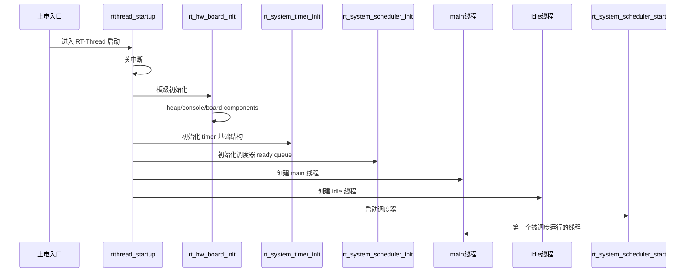

### 源码入口

- [[2.启动主链分析]]：`rtthread_startup`
- [[2.启动主链分析]]：`rt_hw_board_init`
- [[2.启动主链分析]]：`main_thread_entry`
- [[7.Timer]]：`rt_system_timer_init`
- [[5.Scheduler(调度器)-单核和底层驱动]]：`rt_system_scheduler_init`

### 关键理解

启动阶段最重要的是上下文边界：

| 阶段 | 调度器状态 | 能做什么 | 不能依赖什么 |
| --- | --- | --- | --- |
| `rt_hw_board_init` | 未启动 | 时钟、串口、heap、早期设备 | 阻塞、线程切换 |
| `main_thread_entry` | 已启动 | 组件初始化、应用 main | 仍要避免长时间卡死 |

## 三、线程创建链路

### 核心问题

为什么创建线程后不会立刻运行？

### 一句话本质

创建只是在内存中构造 TCB 和栈上下文；线程必须 startup 后进入 ready queue，调度器选中后才运行。

### 行为链路

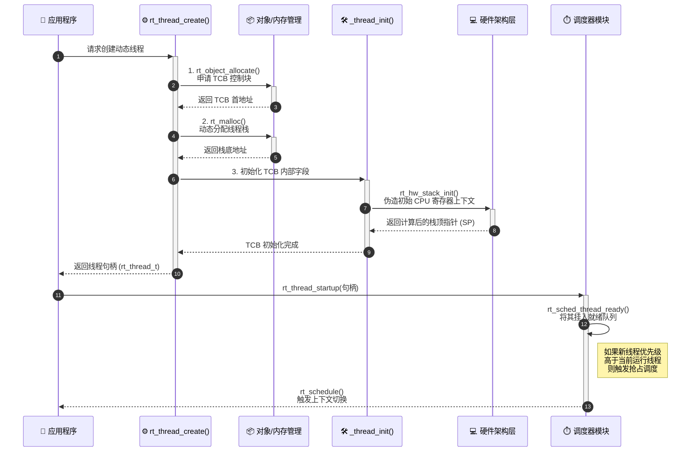

### 静态与动态差异

```text
rt_thread_init:
  用户提供 TCB 和栈
  -> 只初始化，不分配

rt_thread_create:
  系统分配 TCB 和栈
  -> 再复用 _thread_init
```

### 源码入口

- [[4.(Thread)线程的创建和理解]]：`rt_thread_init`
- [[4.(Thread)线程的创建和理解]]：`rt_thread_create`
- [[4.(Thread)线程的创建和理解]]：`_thread_init`
- [[5.Scheduler(调度器)-单核和底层驱动]]：`rt_sched_thread_startup`

### 常见误区

创建线程不等于运行线程。创建只是“有了档案和栈”，startup 才是“进入排队系统”，schedule 才是“获得 CPU”。

## 四、线程启动链路

### 核心问题

`rt_thread_startup` 到底做了什么？

### 一句话本质

`startup` 把线程从初始化状态推入调度体系，让它具备被调度器选中的资格。

### 行为链路

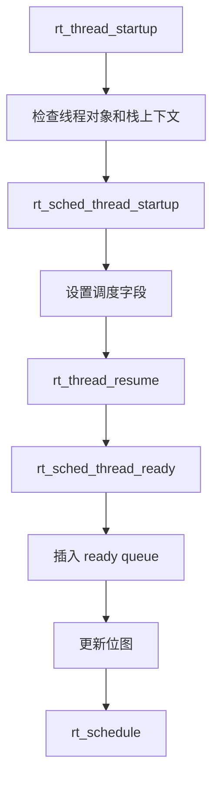

### 源码入口

- [[4.(Thread)线程的创建和理解]]：`rt_thread_startup`
- [[5.Scheduler(调度器)-单核和底层驱动]]：`rt_sched_insert_thread`
- [[03-底层算法与数据结构]]：位图 + 链表数组

### 关键理解

线程启动的关键不是“马上执行入口函数”，而是把线程挂到调度器能看见的数据结构中。

## 五、线程挂起链路

### 核心问题

线程是怎么从可运行状态进入阻塞状态的？

### 一句话本质

挂起就是把线程从 ready queue 移出，设置 suspend 状态，并可选地挂到 IPC 等待队列或 timer 等待路径上。

### 行为链路

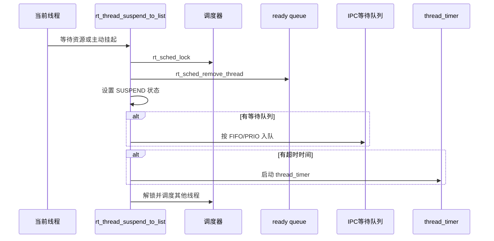

### 源码入口

- [[4.(Thread)线程的创建和理解]]：`rt_thread_suspend_to_list`
- [[4.(Thread)线程的创建和理解]]：`rt_thread_suspend`
- [[7.Timer]]：线程定时器特判
- [[04-并发与上下文]]：调度器锁

### 常见误区

挂起不一定是坏事。线程自己因为等待资源而阻塞，是 RTOS 的正常状态迁移；外部强行 suspend 别的线程，才容易导致死锁。

## 六、线程唤醒链路

### 核心问题

`resume` 是不是立刻运行线程？

### 一句话本质

`resume` 只是让线程重新进入 ready queue，是否立刻运行取决于优先级和调度器状态。

### 行为链路

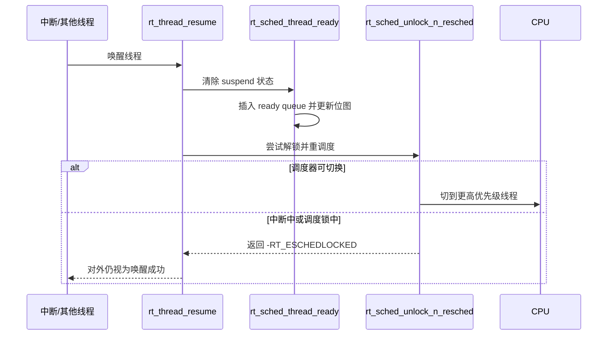

### 源码入口

- [[4.(Thread)线程的创建和理解]]：`rt_thread_resume`
- [[5.Scheduler(调度器)-单核和底层驱动]]：`rt_schedule`
- [[04-并发与上下文]]：延迟调度

### 关键理解

唤醒成功与立即运行不是一回事。实时系统里很多操作是“状态达成，切换延后”。

## 七、调度切换链路

### 核心问题

调度器如何决定切给谁？

### 一句话本质

调度器先用位图找到最高优先级 ready 线程，再与当前线程比较，必要时保存/恢复上下文。

### 行为链路

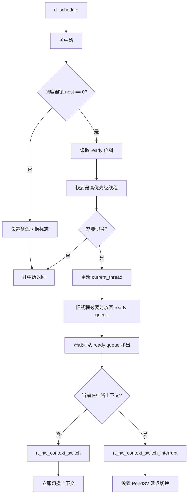

### 源码入口

- [[5.Scheduler(调度器)-单核和底层驱动]]：`rt_schedule`
- [[5.Scheduler(调度器)-单核和底层驱动]]：`_scheduler_get_highest_priority_thread`
- [[5.Scheduler(调度器)-单核和底层驱动]]：`rt_sched_insert_thread`
- [[5.Scheduler(调度器)-单核和底层驱动]]：`rt_sched_remove_thread`

### 常见误区

Tick 不是调度器，Tick 只是可能触发调度事件；真正决定切换的是 `rt_schedule`。

## 八、Timer start/stop 链路

### 核心问题

定时器启动和停止为什么不是简单改一个 flag？

### 一句话本质

定时器的运行状态由“标志位 + 跳表节点位置”共同决定，start/stop 必须维护全局有序跳表。

### start 链路

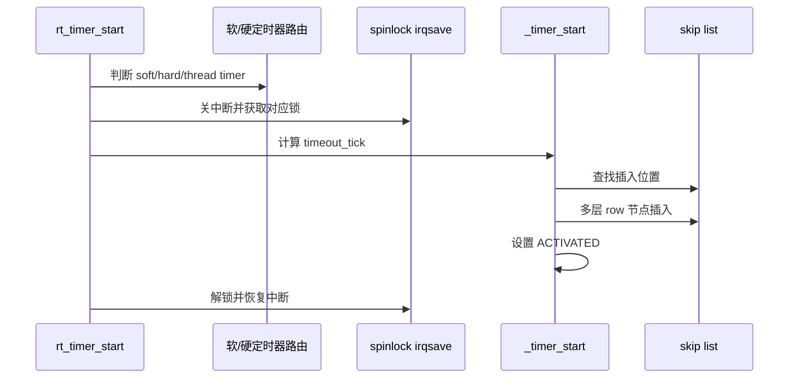

### stop 链路

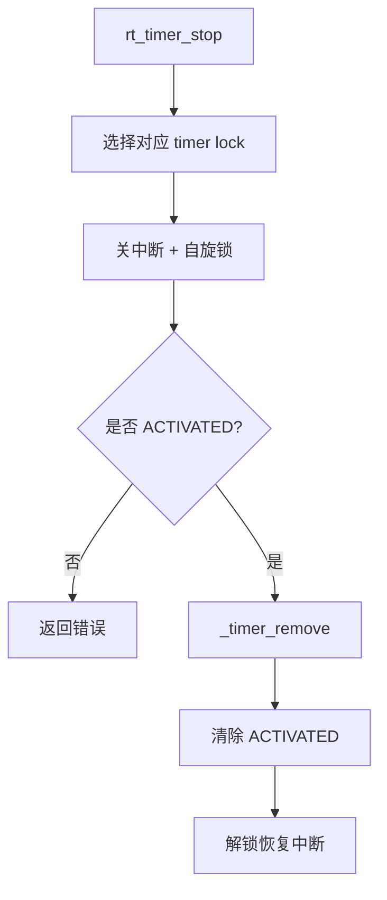

### 源码入口

- [[7.Timer]]：`rt_timer_start`
- [[7.Timer]]：`_timer_start`
- [[7.Timer]]：`rt_timer_stop`
- [[7.Timer]]：`_timer_remove`
- [[03-底层算法与数据结构]]：跳表

### 关键理解

定时器不是“一个倒计时变量”，而是一个挂在全局有序结构里的对象。改时间、停止、删除，都必须维护这张有序结构。

## 九、Timer check 链路

### 核心问题

SysTick 到来时，RT-Thread 如何处理到期定时器？

### 一句话本质

Timer check 只看最早到期节点；如果已到期，就摘出到局部链表，开中断执行回调，再按周期属性决定是否重新插入。

### 行为链路

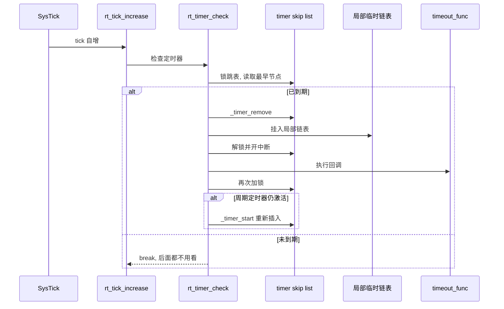

### 源码入口

- [[7.Timer]]：`rt_timer_check`
- [[7.Timer]]：`_timer_check`
- [[03-底层算法与数据结构]]：tick 回绕
- [[04-并发与上下文]]：软/硬定时器上下文

### 常见误区

执行回调前开中断不是随便写的，而是为了避免用户回调长时间关闭中断。内核先把到期节点从全局共享结构里摘出，临时私有化后再执行回调。

## 十、广度补全：后续必须补齐的行为链路骨架

前面已经写了启动、线程创建/启动/挂起/唤醒、调度切换和 Timer 核心链路。这里补“全模块阅读”必须覆盖的行为骨架。先建立索引，以后深入时再把每条链路展开成代码级解析。

### 10.1 组件自动初始化链路

**核心问题**：初始化函数为什么不用手工集中注册？

**一句话本质**：模块通过 `INIT_*_EXPORT` 把函数指针放进指定链接段，启动阶段按段边界遍历执行。

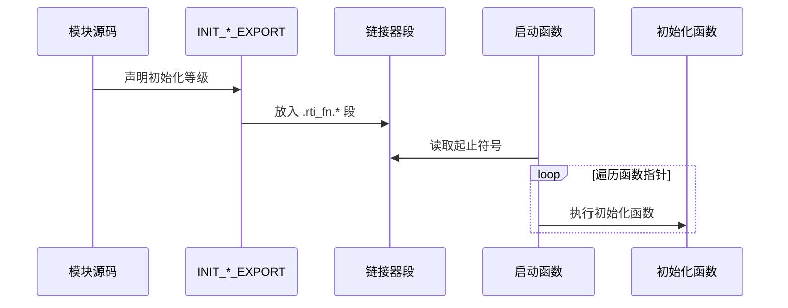

**源码入口**：`INIT_EXPORT`、`rt_components_board_init`、`rt_components_init`。  
**关联模块**：[[2.启动主链分析]]、[[06-系统设计与架构模式]]、[[05-C语言工程技巧]]。  
**面试表达**：自动初始化是 C 语言环境下的插件化启动机制，减少中心启动文件对各模块的依赖。

### 10.2 对象初始化/创建/删除链路

**核心问题**：为什么所有内核资源都先进入对象系统？

**一句话本质**：对象系统把“资源实体”统一纳入类型、名字、链表、钩子和调试视图。

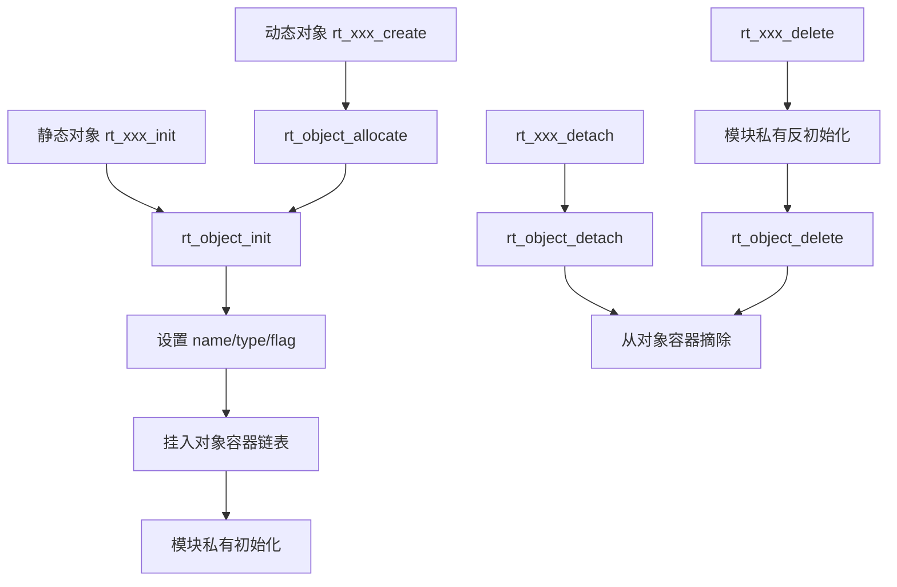

**源码入口**：`rt_object_init`、`rt_object_allocate`、`rt_object_detach`、`rt_object_delete`、`rt_object_find`。  
**关联模块**：[[3.深化启动的理解+理解对象系统]]、[[4.(Thread)线程的创建和理解]]、[[7.Timer]]。  
**面试表达**：对象系统是 RT-Thread 能统一管理线程、定时器、IPC、设备的基础。

### 10.3 线程 delay/sleep 链路

**核心问题**：线程 delay 为什么会连接 Timer 和 Scheduler？

**一句话本质**：delay 是“当前线程主动进入挂起状态，并给自己挂一个超时定时器”。

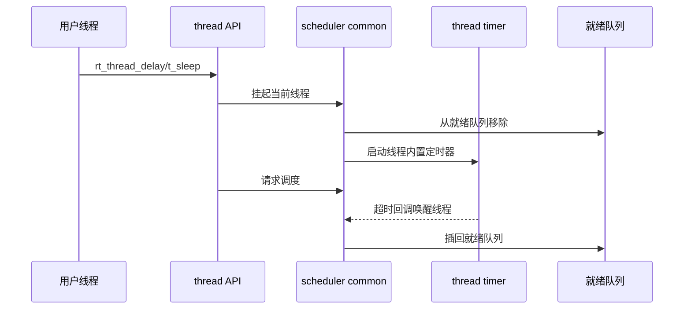

**源码入口**：`rt_thread_sleep`、`rt_thread_delay`、`rt_sched_thread_timer_start`、`_thread_timeout`。  
**关联模块**：[[4.(Thread)线程的创建和理解]]、[[6.Scheduler-上层调度]]、[[7.Timer]]。  
**面试表达**：delay 不是忙等，而是线程状态、定时器和调度器共同完成的阻塞等待。

### 10.4 线程 control 链路

**核心问题**：`rt_thread_control` 为什么适合做成 command 风格？

**一句话本质**：control 把少量不常用但必须开放的控制能力收敛到一个扩展接口。

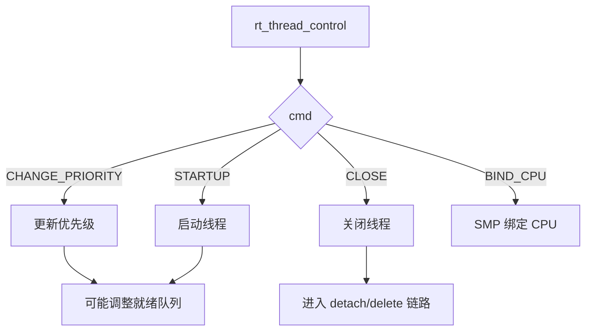

**源码入口**：`rt_thread_control`、`_rt_sched_update_priority`、`rt_thread_startup`、`rt_thread_close`。  
**关联模块**：[[4.(Thread)线程的创建和理解]]、[[6.Scheduler-上层调度]]、[[05-C语言工程技巧]]。  
**面试表达**：control 风格接口适合承载扩展命令，避免每个小能力都暴露一个新 API。

### 10.5 调度 tick 与时间片链路

**核心问题**：系统 tick 除了驱动 Timer，还做什么？

**一句话本质**：tick 既推进全局时间，也扣减当前线程时间片，并可能触发同优先级轮转。

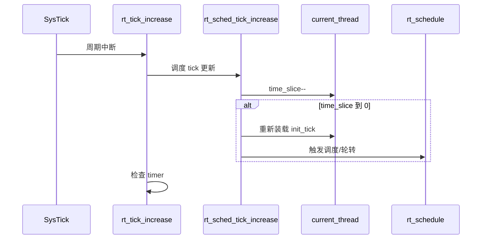

**源码入口**：`rt_tick_increase`、`rt_sched_tick_increase`、`rt_schedule`、时间片字段。  
**关联模块**：[[6.Scheduler-上层调度]]、[[5.Scheduler(调度器)-单核和底层驱动]]、[[7.Timer]]。  
**面试表达**：tick 是 RTOS 的时间驱动源，同时服务定时器和时间片调度。

### 10.6 优先级更新链路

**核心问题**：线程优先级变化为什么不能只改一个字段？

**一句话本质**：优先级决定线程所在的就绪链表和位图位置，更新时必须维护调度器数据结构一致性。

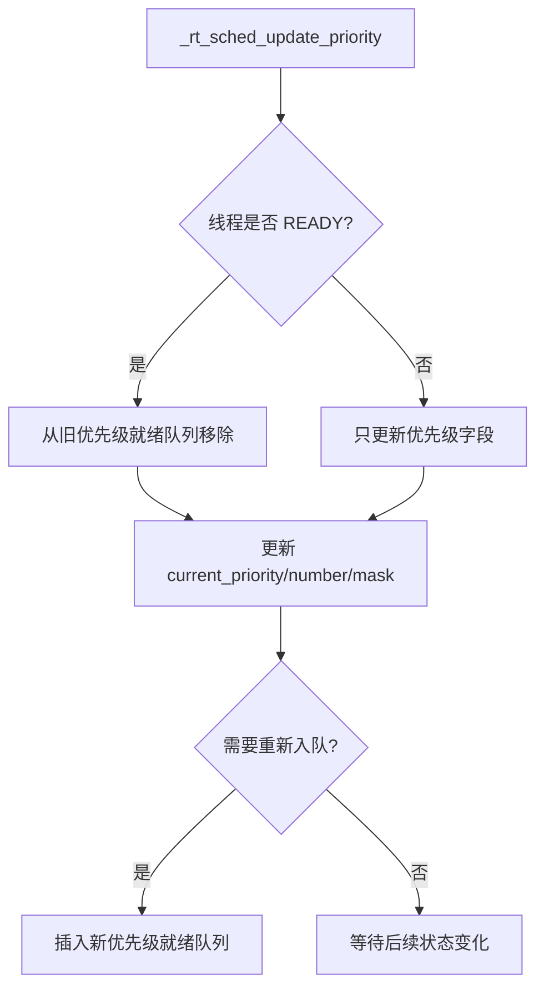

**源码入口**：`_rt_sched_update_priority`、`rt_sched_insert_thread`、`rt_sched_remove_thread`。  
**关联模块**：[[6.Scheduler-上层调度]]、[[03-底层算法与数据结构]]。  
**面试表达**：优先级是调度结构的一部分，不只是线程属性。

### 10.7 IPC 等待/超时/唤醒链路

**核心问题**：IPC 为什么天然牵动 Timer 和 Scheduler？

**一句话本质**：获取资源失败时线程进入 IPC 等待队列；如果设置超时，还要挂线程定时器；资源到来或超时都会重新唤醒线程。

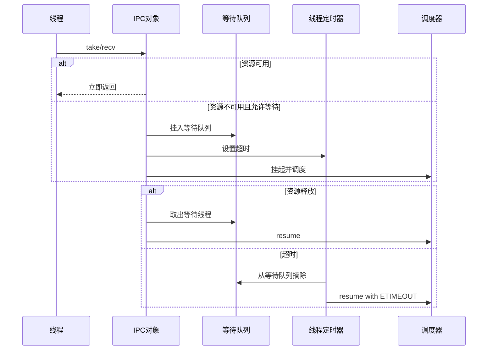

**源码入口**：`rt_ipc_list_suspend`、`rt_ipc_list_resume`、`rt_sem_take`、`rt_mutex_take`、`rt_event_recv`、`rt_mb_recv`、`rt_mq_recv`。  
**关联模块**：[[../9.IPC-Sync(同步)]]、[[4.(Thread)线程的创建和理解]]、[[6.Scheduler-上层调度]]、[[7.Timer]]。  
**面试表达**：IPC 是“资源条件 + 等待队列 + 调度状态”的组合。

### 10.8 内存分配/释放链路

**核心问题**：动态对象 create/delete 为什么要单独看内存管理？

**一句话本质**：create/delete 的外壳是对象生命周期，底层是 heap/mempool/memheap 的资源所有权转移。

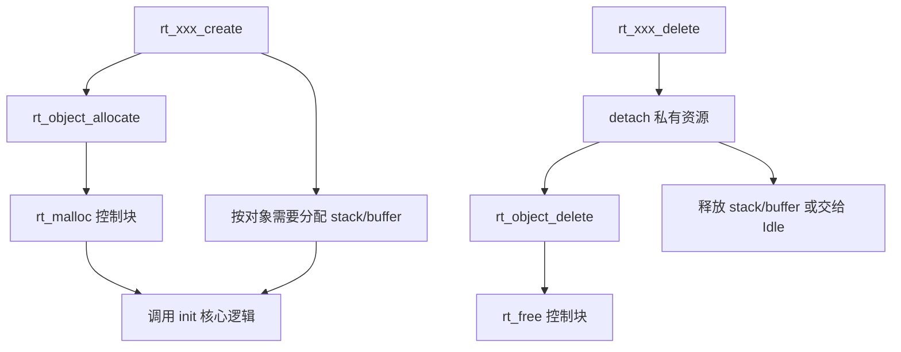

**源码入口**：`rt_object_allocate`、`rt_malloc`、`rt_free`、`rt_mp_alloc`、`rt_mp_free`、线程/定时器/IPC 的 create/delete。  
**关联模块**：[[RT-thread源码阅读-v2/07-内存管理]]、[[3.深化启动的理解+理解对象系统]]、[[06-系统设计与架构模式]]。  
**面试表达**：RTOS 的内存链路必须同时说明“谁分配、谁释放、在哪个上下文释放”。
