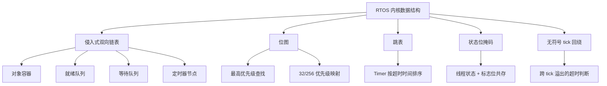
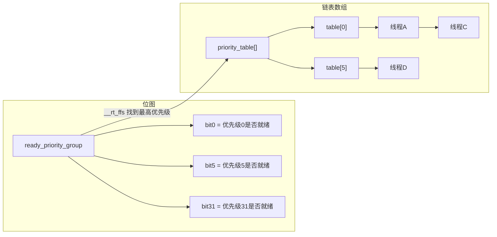
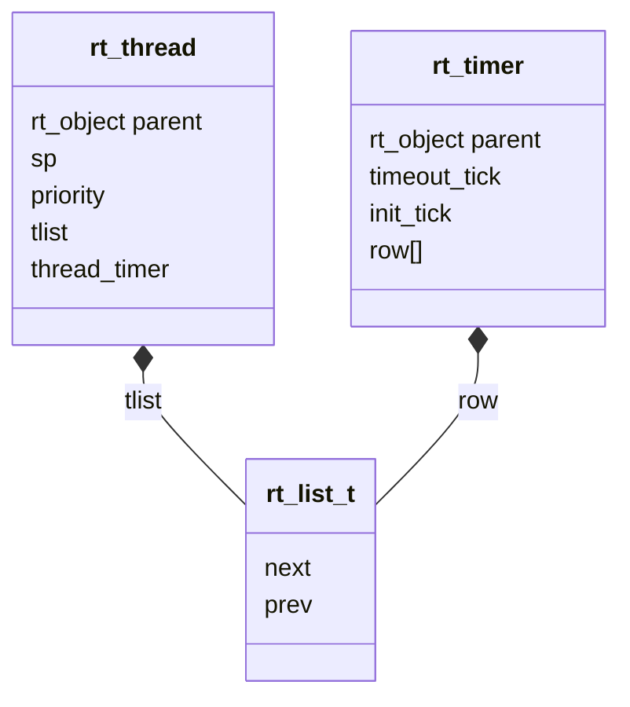
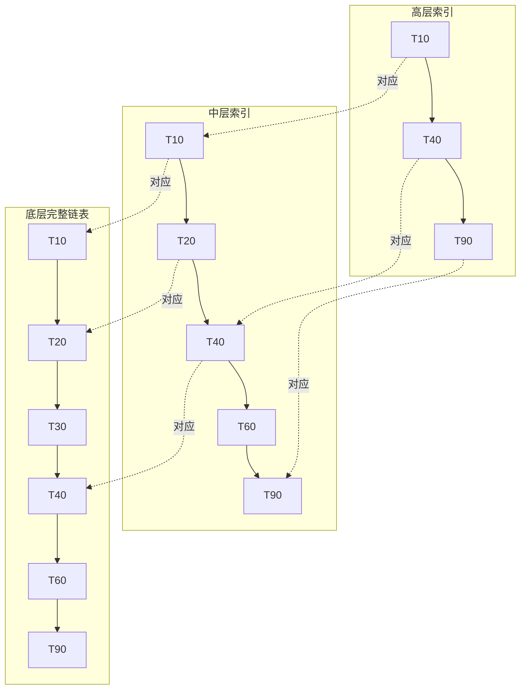
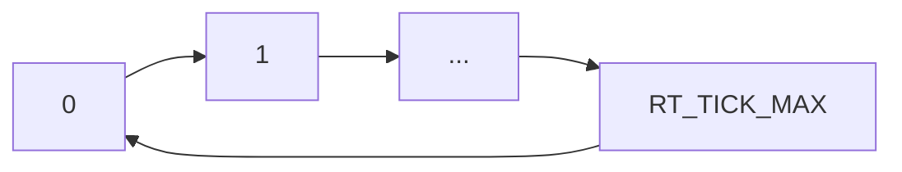
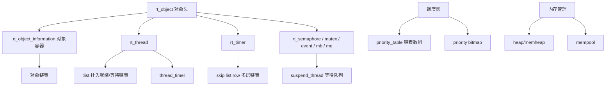

# 底层算法与数据结构

> [!abstract] 核心本质
> RT-Thread 的很多“高级机制”最终都落到几种朴素但极其硬核的数据结构：侵入式链表、位图、跳表、状态位掩码、无符号回绕判断。

## 一、总览



## 二、位图 + 链表数组

### 核心问题

调度器如何快速找到最高优先级线程，同时又保存同优先级的多个线程？

### 一句话本质

位图负责快速回答“哪些优先级有人”，链表数组负责保存“这个优先级有哪些线程”。

### 为什么需要它

如果只用链表保存所有 ready 线程，每次调度都要遍历所有线程找最高优先级，复杂度是 O(n)。RTOS 要求调度延迟确定，所以不能每次都全表扫描。

RT-Thread 的做法是：

```text
rt_thread_ready_priority_group：位图，快速定位优先级
rt_thread_priority_table[]：链表数组，保存具体线程
```

### RT-Thread 怎么用

插入线程：

```c
rt_list_insert_after(&rt_thread_priority_table[priority],
                     &RT_THREAD_LIST_NODE(thread));
rt_thread_ready_priority_group |= thread->number_mask;
```

移除线程：

```c
rt_list_remove(&RT_THREAD_LIST_NODE(thread));
if (rt_list_isempty(&rt_thread_priority_table[priority]))
{
    rt_thread_ready_priority_group &= ~thread->number_mask;
}
```

### Mermaid 图



### 如果不用会怎样

| 方案 | 问题 |
| --- | --- |
| 只用链表 | 每次调度都要遍历，实时性差 |
| 只用位图 | 只能知道某优先级有人，不知道具体线程是谁 |
| 位图 + 链表数组 | 查找快，存储具体线程也自然 |

### 源码入口

- [[5.Scheduler(调度器)-单核和底层驱动]]：`rt_sched_insert_thread`
- [[5.Scheduler(调度器)-单核和底层驱动]]：`rt_sched_remove_thread`
- [[5.Scheduler(调度器)-单核和底层驱动]]：`_scheduler_get_highest_priority_thread`

## 三、侵入式双向链表

### 核心问题

为什么 RT-Thread 的链表节点总是嵌在对象结构体里面？

### 一句话本质

侵入式链表把“节点”作为对象的一部分，链表只负责连接节点；通过 `container_of` 可以从节点反推出对象。

### 为什么需要它

普通链表常见写法是：

```c
struct node {
    void *data;
    struct node *next;
};
```

这种写法需要额外分配 node，且每种对象都可能要重复写链表逻辑。

RT-Thread 和 Linux 更常用侵入式链表：

```c
struct rt_thread {
    ...
    rt_list_t tlist;
};

struct rt_timer {
    ...
    rt_list_t row[RT_TIMER_SKIP_LIST_LEVEL];
};
```

链表节点属于对象本身，不需要额外包装。

### Mermaid 图



### 关键代码

```c
#define rt_list_entry(node, type, member) \
    rt_container_of(node, type, member)
```

核心思想：

```text
对象地址 = 成员地址 - 成员在结构体中的偏移量
```

### 如果不用会怎样

- 每种对象都要写一套链表包装。
- 频繁分配节点增加内存碎片。
- 内核对象在不同队列之间移动会更复杂。

### 源码入口

- [[3.深化启动的理解+理解对象系统]]：对象链表
- [[4.(Thread)线程的创建和理解]]：线程 `tlist`
- [[7.Timer]]：`timer->row[]`

## 四、跳表

### 核心问题

Timer 为什么不用普通链表，而要用跳表？

### 一句话本质

跳表用多层链表为底层有序链表建立索引，使定时器插入接近 O(log n)，同时保留链表删除 O(1) 的优势。

### 为什么 Timer 需要排序

定时器必须按到期时间排序：

```text
timeout_tick 小的在前
timeout_tick 大的在后
```

这样 `rt_timer_check` 每次只看最前面的定时器。如果最前面的都没到期，后面的必然也没到期。

### Mermaid 图



### RT-Thread 怎么用

`rt_timer_start` 最终调用 `_timer_start`：

```c
timer->timeout_tick = rt_tick_get() + timer->init_tick;
/* 查找每一层插入点 */
/* 插入底层链表 */
/* 根据伪随机层高插入更高层 */
timer->parent.flag |= RT_TIMER_FLAG_ACTIVATED;
```

`rt_timer_stop` 删除时不需要重新搜索：

```c
for (i = 0; i < RT_TIMER_SKIP_LIST_LEVEL; i++)
{
    rt_list_remove(&timer->row[i]);
}
```

因为双向链表节点知道自己的前后邻居。

### 如果不用会怎样

| 方案 | 插入 | 检查到期 | 删除 | 问题 |
| --- | --- | --- | --- | --- |
| 无序链表 | O(1) | O(n) | O(1) | 每个 tick 扫描成本高 |
| 有序单链表 | O(n) | O(1) | O(n) | 插入和删除不稳定 |
| 跳表 + 双向链表 | 近似 O(log n) | O(1) 看头部 | O(1) | 实时性更可控 |

### 源码入口

- [[7.Timer]]：`_timer_start`
- [[7.Timer]]：`_timer_remove`
- [[7.Timer]]：`_timer_check`

## 五、状态位掩码

### 核心问题

为什么线程状态不是简单赋值，而是经常出现 `stat & ~MASK`？

### 一句话本质

线程状态字节里同时保存“主状态”和“附加标志”，切换主状态时要保留附加标志。

### 典型代码

```c
RT_SCHED_CTX(thread).stat =
    RT_THREAD_RUNNING |
    (RT_SCHED_CTX(thread).stat & ~RT_THREAD_STAT_MASK);
```

含义：

```text
低位：线程主状态，如 READY/RUNNING/SUSPEND
高位：附加标志，如 YIELD/SIGNAL
```

切换到 RUNNING 时，只替换低位状态，不破坏高位标志。

### Mermaid 图


### 如果不用会怎样

如果每次直接赋值：

```c
thread->stat = RT_THREAD_RUNNING;
```

就可能把 `YIELD`、`SIGNAL` 等附加标志清掉，导致调度器误判线程行为。

### 源码入口

- [[5.Scheduler(调度器)-单核和底层驱动]]：状态掩码操作
- [[4.(Thread)线程的创建和理解]]：挂起/恢复状态切换

## 六、tick 回绕判断

### 核心问题

为什么判断超时要写成 `(current_tick - timeout_tick) < RT_TICK_MAX / 2`？

### 一句话本质

tick 是环形计数器，无符号减法可以跨回绕判断时间先后，但必须限制最大延时小于半个计数范围。

### 正确思路

不要把 tick 当成无限增长的直线，而要把它当成环：



普通比较：

```c
if (current_tick >= timeout_tick)
```

在回绕后会失败。

RT-Thread 用差值判断：

```c
if ((current_tick - timeout_tick) < RT_TICK_MAX / 2)
{
    /* timeout */
}
```

### 为什么必须小于一半

环形空间里，两个点之间有两个方向。距离超过半圈时，无法判断它到底是“已经过了很久”还是“还要等很久”。

### 源码入口

- [[7.Timer]]：`_timer_start`
- [[7.Timer]]：`_timer_check`
- [[01-QA问题解决库]]：tick 为什么不能超过最大值一半

## 七、`__rt_ffs` 与优先级查找

### 核心问题

调度器如何从位图里找到最高优先级？

### 一句话本质

优先级数字越小优先级越高，位图中最低位的 1 通常对应最高优先级 ready 线程，`__rt_ffs` 用来快速找到这个位置。

### 机制拆解

假设位图：

```text
0b0010_1000
```

表示优先级 3 和 5 有线程 ready。数字越小优先级越高，所以优先级 3 应该先运行。

`__rt_ffs` 返回第一个 1 的位置，再换算成优先级。

### 256 优先级情况

当优先级超过 32 时，RT-Thread 会分组：

```text
全局 group 位图：哪一组有 ready 线程
组内 ready_table[number]：组内哪个优先级 ready
```

### Mermaid 图

```mermaid
flowchart TD
    A[ready_priority_group] --> B[找到非空组 number]
    B --> C[ready_table[number]]
    C --> D[找到组内最高优先级]
    D --> E[priority = number * group_size + offset]
    E --> F[访问 priority_table[priority]]
```

### 源码入口

- [[5.Scheduler(调度器)-单核和底层驱动]]：位图与链表实现
- [[4.29阅读想法]]：256 个优先级实现方法

## 八、广度补全：全模块数据结构基础卡

这一节先把对象、线程、调度、Timer、IPC、内存都会反复遇到的数据结构放进同一张地图。以后你深挖某个模块时，先看它依赖哪几个结构，再回到原模块源码。

### 8.1 数据结构关系总图



### 8.2 对象容器

| 项目 | 内容 |
| --- | --- |
| 为什么需要它 | RT-Thread 有很多内核对象，如果每类对象都自己维护注册表，查找、调试、命名、遍历都会重复。 |
| RT-Thread 怎么用 | 用 `rt_object_information` 为每类对象维护一个链表头和对象大小；对象初始化/分配时挂进对应容器。 |
| 如果不用会怎样 | Thread、Timer、IPC、Device 都要各写一套对象注册和查找逻辑，FinSH/object dump 也难统一。 |
| 源码入口 | [[3.深化启动的理解+理解对象系统]]：`rt_object_container`、`rt_object_get_information`、`rt_object_init`、`rt_object_find`。 |
| 后续深挖 | 对比 `rt_thread`、`rt_timer`、IPC 对象的第一个成员是否都是对象头。 |

### 8.3 等待队列

| 项目 | 内容 |
| --- | --- |
| 为什么需要它 | IPC、delay、阻塞等待都要保存“哪些线程正在等这个条件”。 |
| RT-Thread 怎么用 | IPC 对象内部维护挂起链表；线程等待资源时从就绪队列摘除，挂入 IPC 等待队列，资源到来或超时时再移回就绪队列。 |
| 如果不用会怎样 | 线程只能轮询资源，实时性和功耗都会变差，也无法自然表达超时等待。 |
| 源码入口 | [[../9.IPC-Sync-文档]]：`rt_ipc_list_suspend`、`rt_ipc_list_resume`；[[4.(Thread)线程的创建和理解]]：线程挂起/唤醒。 |
| 后续深挖 | 比较 semaphore、mutex、event、mailbox、message queue 的等待条件差异。 |

### 8.4 线程控制块 TCB

| 项目 | 内容 |
| --- | --- |
| 为什么需要它 | 线程不是函数指针，而是一组运行现场、调度属性、栈、状态、IPC等待信息、定时器和对象身份。 |
| RT-Thread 怎么用 | `rt_thread` 继承对象头，内部保存 `sp`、`entry`、`parameter`、`stack_addr`、`current_priority`、`init_tick`、`remaining_tick`、`thread_timer` 等。 |
| 如果不用会怎样 | 调度器无法保存/恢复线程现场，也无法统一做超时、优先级、状态迁移和栈检查。 |
| 源码入口 | [[4.(Thread)线程的创建和理解]]、[[6.Scheduler-上层调度]]。 |
| 后续深挖 | 把 TCB 分成“对象层、调度层、栈现场层、IPC层、定时器层”五块画图。 |

### 8.5 栈水位与栈溢出检测

| 项目 | 内容 |
| --- | --- |
| 为什么需要它 | 嵌入式系统栈空间固定，溢出会破坏相邻内存，问题常常不是立刻暴露。 |
| RT-Thread 怎么用 | 初始化栈时填充特征值，运行时通过调度路径或调试工具检查栈使用深度和边界。 |
| 如果不用会怎样 | 栈溢出可能表现成随机 HardFault、对象链表损坏、调度异常，定位成本很高。 |
| 源码入口 | [[4.(Thread)线程的创建和理解]]：栈初始化；[[6.Scheduler-上层调度]]：栈溢出检测。 |
| 后续深挖 | 对比软件栈水位、栈哨兵、MPU 栈保护。 |

### 8.6 内存池与堆管理骨架

| 项目 | heap/memheap | mempool |
| --- | --- | --- |
| 核心用途 | 变长动态分配 | 固定大小块分配 |
| 优点 | 灵活，适合对象大小不固定 | 确定性更好，碎片风险低 |
| 风险 | 碎片、锁竞争、上下文限制 | 块大小固定，空间可能浪费 |
| 典型场景 | 动态线程栈、动态对象控制块、组件缓冲 | 消息块、固定连接对象、频繁小块申请 |
| 源码入口 | [[RT-thread源码阅读-v2/07-内存管理]] | [[RT-thread源码阅读-v2/07-内存管理]] |

**后续深挖方向**：读内存模块时，不要只看 `malloc/free`，而要问“这个分配是否可阻塞、是否可在中断中用、是否可能碎片化、失败后如何回滚”。

### 8.7 状态机 + 位掩码

| 项目 | 内容 |
| --- | --- |
| 为什么需要它 | 线程、Timer、对象都可能同时携带“主状态 + 标志位”，用枚举单值不够表达。 |
| RT-Thread 怎么用 | 用状态低位表达主状态，用高位或附加 flag 表示静态对象、激活状态、可中断挂起等附加语义。 |
| 如果不用会怎样 | 状态组合会爆炸，判断逻辑分散，也更容易漏处理某个边界。 |
| 源码入口 | [[4.(Thread)线程的创建和理解]]、[[5.Scheduler(调度器)-单核和底层驱动]]、[[7.Timer]]。 |
| 后续深挖 | 把 Thread 状态、Timer flag、Object type/flag 分别列成表，避免混用。 |
