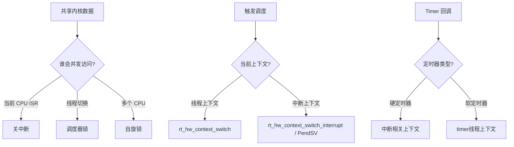
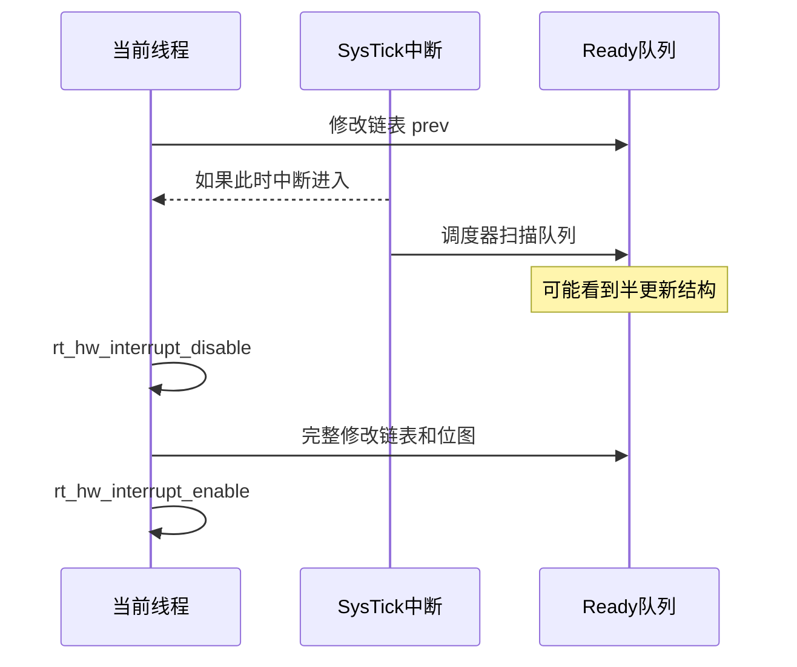
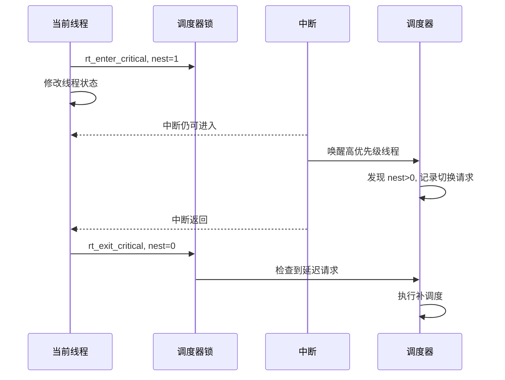
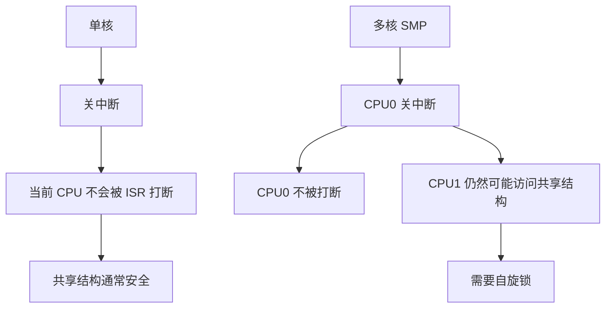
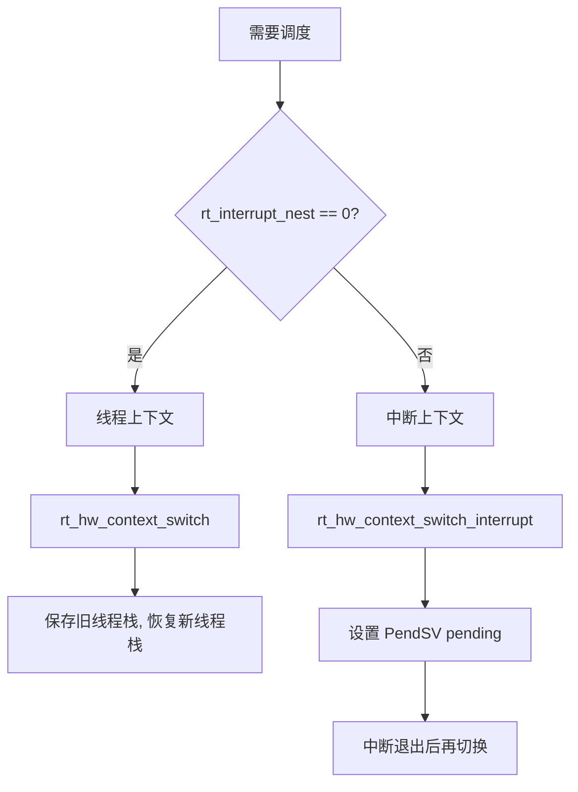
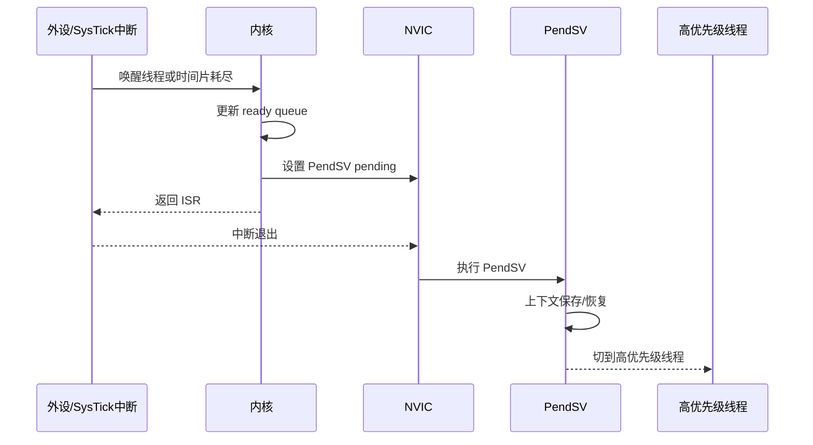
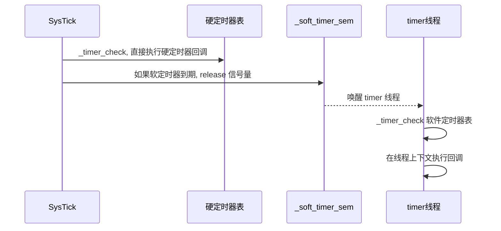
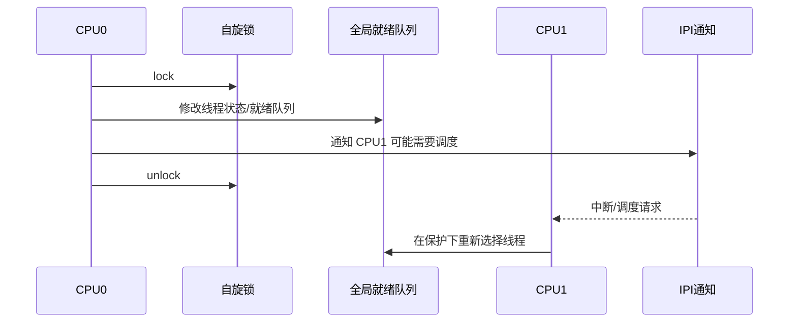
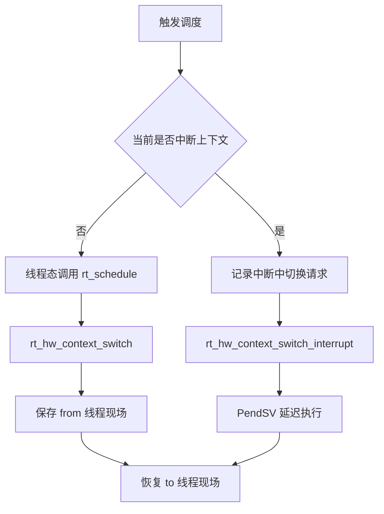

# 并发与上下文

> [!abstract] 核心本质
> RTOS 里最难的不是“某个 API 怎么调用”，而是判断代码运行在哪个上下文、谁可能并发访问同一份数据、该用关中断、调度器锁还是自旋锁。

## 一、总览



## 二、三种保护机制

### 对比表

| 机制 | 主要保护什么 | 是否禁止硬件中断 | 是否禁止线程切换 | 是否解决多核并发 | 典型源码 |
| --- | --- | --- | --- | --- | --- |
| 关中断 | 当前 CPU 的极短原子区 | 是 | 间接禁止 | 否 | ready 位图、链表指针更新 |
| 调度器锁 | 线程级状态迁移 | 否 | 是 | 部分场景配合底层锁 | suspend/resume/critical |
| 自旋锁 | SMP 共享数据结构 | 通常配合 irqsave | 不是主要目标 | 是 | Timer 跳表、CPU 全局结构 |

### 关键判断

```text
如果怕当前 CPU 被中断打断：关中断
如果怕当前线程切走导致状态不完整：调度器锁
如果怕另一个 CPU 同时进来：自旋锁
```

## 三、关中断

### 核心问题

为什么操作位图、链表时经常先关中断？

### 一句话本质

关中断让当前 CPU 在极短时间内不被 ISR 打断，保证一组指针或位操作原子完成。

### 典型场景

调度器插入 ready queue 时，要同时做两件事：

```text
1. 把线程链表节点插入 priority_table
2. 设置 ready_priority_group 位图
```

这两个动作必须一致。如果链表插了但位图没亮，调度器找不到线程；如果位图亮了但链表没插完，调度器可能拿到空链表或坏节点。

### Mermaid 图



### 源码入口

- [[5.Scheduler(调度器)-单核和底层驱动]]：`rt_sched_insert_thread`
- [[5.Scheduler(调度器)-单核和底层驱动]]：`rt_sched_remove_thread`

## 四、调度器锁

### 核心问题

调度器锁为什么不等于关中断？

### 一句话本质

调度器锁允许中断继续响应，但推迟线程切换，适合保护线程级状态迁移。

### 机制拆解

调度器锁通常维护一个嵌套计数：

```text
rt_enter_critical -> nest++
rt_exit_critical  -> nest--
nest == 0 时，如果有延迟调度请求，再补一次调度
```

它解决的是：

```text
我正在调整线程状态/队列
-> 中途不要切换到别的线程
-> 但硬件中断仍然可以进来
```

### Mermaid 图



### 源码入口

- [[5.Scheduler(调度器)-单核和底层驱动]]：`rt_enter_critical` / `rt_exit_critical`
- [[4.(Thread)线程的创建和理解]]：`rt_thread_close`
- [[4.(Thread)线程的创建和理解]]：`rt_thread_suspend_to_list`

## 五、自旋锁

### 核心问题

为什么 SMP 下关中断不够？

### 一句话本质

关中断只管当前 CPU，自旋锁才能阻止其他 CPU 同时进入共享临界区。

### 单核与多核差异



### Timer 场景

Timer 的 `_timer_list` 是全局共享结构，可能被这些路径访问：

- CPU0 上的 SysTick 扫描硬定时器。
- CPU1 上的线程 stop 一个定时器。
- 普通线程 control 修改定时器时间。

所以 `rt_timer_start/stop/check` 需要 `rt_spin_lock_irqsave` 这类组合保护。

### 源码入口

- [[7.Timer]]：`rt_system_timer_init`
- [[7.Timer]]：`rt_timer_start`
- [[7.Timer]]：`_timer_check`
- [[3.深化启动的理解+理解对象系统]]：自旋锁使用禁忌

## 六、线程上下文 vs 中断上下文

### 核心问题

为什么同一个“触发调度”，在线程中和中断中走不同路径？

### 一句话本质

线程上下文可以直接准备切换；中断上下文必须等 ISR 退出后再切换，避免破坏中断返回路径。

### 对比表

| 上下文 | 能否阻塞 | 能否直接执行耗时代码 | 调度方式 | 典型场景 |
| --- | --- | --- | --- | --- |
| 线程上下文 | 可以 | 可以但不应过久 | 可直接上下文切换 | `rt_thread_sleep` |
| 中断上下文 | 不可以 | 不可以 | 设置 PendSV 延迟切换 | SysTick、串口 ISR |
| timer 线程上下文 | 可以使用线程能力 | 不应长期占用 | 普通线程调度 | 软定时器回调 |

### Mermaid 图



### 源码入口

- [[5.Scheduler(调度器)-单核和底层驱动]]：`rt_schedule`
- [[4.(Thread)线程的创建和理解]]：`rt_thread_resume`

## 七、PendSV 延迟切换

### 核心问题

为什么中断中唤醒高优先级线程，不是马上切？

### 一句话本质

中断中只记录“需要切换”，真正切换放到 PendSV，让它在安全的异常优先级下执行。

### 时序图



### 源码入口

- [[5.Scheduler(调度器)-单核和底层驱动]]：`rt_hw_context_switch_interrupt`
- [[04-并发与上下文]]：线程上下文 vs 中断上下文

## 八、软定时器与硬定时器上下文

### 核心问题

为什么 RT-Thread 要分软定时器和硬定时器？

### 一句话本质

硬定时器回调更接近中断路径，实时但限制多；软定时器把回调推迟到 timer 线程，牺牲一点即时性换取更安全的执行上下文。

### 对比表

| 类型 | 到期检查 | 回调上下文 | 优点 | 限制 |
| --- | --- | --- | --- | --- |
| 硬定时器 | SysTick 路径 | 中断相关上下文 | 响应快 | 不能阻塞，回调必须极短 |
| 软定时器 | SysTick 只发信号量 | timer 线程 | 可做稍复杂处理 | 受 timer 线程调度影响 |

### Mermaid 图



### 源码入口

- [[7.Timer]]：`rt_system_timer_thread_init`
- [[7.Timer]]：`rt_timer_check`
- [[7.Timer]]：`_timer_thread_entry`
- [[06-系统设计与架构模式]]：Bottom Half

## 九、临界区设计铁律

1. 临界区越短越好。
2. 不要在自旋锁里打印、延时、阻塞。
3. 修改链表状态和检查状态要放在同一个不可打断区域。
4. 中断上下文不要做重活。
5. 如果必须执行用户回调，先把共享资源私有化，再释放锁执行。

Timer 的 `_timer_check` 是好例子：

```text
锁全局跳表
-> 摘出到期定时器
-> 放到局部 list
-> 解锁开中断
-> 执行回调
-> 再加锁处理周期定时器
```

## 十、广度补全：上下文边界基础卡

RTOS 里很多 bug 不是算法错，而是“在错误的上下文做了正确的事”。这一节把启动、线程、调度、Timer、IPC、内存里反复出现的上下文边界先列全。

### 10.1 启动阶段上下文

| 阶段 | 调度器状态 | 适合做什么 | 不适合做什么 | 关联模块 |
| --- | --- | --- | --- | --- |
| `rtthread_startup` 早期 | 未启动 | 板级硬件、时钟、heap 基础准备 | 阻塞等待、依赖线程调度 | [[2.启动主链分析]] |
| `rt_components_board_init` | 通常未进入线程态 | 板级组件、早期驱动 | 依赖完整设备栈的复杂逻辑 | [[2.启动主链分析]] |
| `rt_application_init` | 准备创建 main 线程 | 创建用户主线程 | 长时间阻塞 | [[2.启动主链分析]] |
| `main_thread_entry` | 已在线程上下文 | 高级组件初始化、应用入口 | 把中断级工作塞进线程初始化 | [[2.启动主链分析]] |

**一句话本质**：启动阶段要先问“调度器是否已经工作、heap 是否可用、设备框架是否可用”。

### 10.2 SMP/IPI 与自旋锁

| 项目 | 内容 |
| --- | --- |
| 核心问题 | 单核里关中断常常够用，为什么多核还需要自旋锁和 IPI？ |
| 一句话本质 | 关本核中断不能阻止其他 CPU 同时访问共享内核结构，自旋锁保护跨核共享数据，IPI 用于跨核发起调度或通知。 |
| 源码入口 | SMP 配置、调度器锁、自旋锁、`rt_hw_ipi_send` 一类移植层接口。 |
| 关联模块 | [[2.启动主链分析]]、[[3.深化启动的理解+理解对象系统]]、[[5.Scheduler(调度器)-单核和底层驱动]]。 |
| 面试表达 | 单核并发主要防中断抢占，多核并发还要防另一个 CPU 真正同时执行。 |



### 10.3 IPC 阻塞限制

| 场景 | 能不能阻塞 | 原因 |
| --- | --- | --- |
| 普通线程上下文 | 可以 | 调度器能把当前线程挂起并切走 |
| 中断上下文 | 不可以 | 中断没有可挂起的线程实体，不能睡眠等待 |
| 调度器锁内 | 不应该 | 调度被锁住，阻塞会破坏临界区语义 |
| 自旋锁内 | 不可以 | 自旋锁要求短临界区，阻塞会导致严重死锁 |

**源码入口**：IPC take/recv 系列、`rt_interrupt_get_nest`、调度器锁检查。  
**关联模块**：[[../9.IPC-Sync(同步)]]、[[04-并发与上下文]]、[[02-源码行为链路]]。

### 10.4 内存分配上下文限制

| 分配方式 | 典型上下文 | 风险点 | 面试表达 |
| --- | --- | --- | --- |
| 静态对象 | 编译期/启动期/用户持有 | 灵活性低，但确定性强 | RTOS 推荐关键资源静态化 |
| heap | 线程上下文 | 碎片、锁、失败回滚 | 动态灵活，但要控制上下文和失败路径 |
| mempool | 线程上下文，部分实现可更确定 | 块大小固定 | 适合频繁固定块申请，确定性优于通用 heap |
| 中断中分配 | 通常避免 | 不可阻塞、时延不可控 | 中断里尽量只发信号，不做复杂分配 |

**源码入口**：`rt_malloc`、`rt_free`、`rt_mp_alloc`、`rt_mp_free`、对象 create/delete。  
**关联模块**：[[RT-thread源码阅读-v2/07-内存管理]]、[[3.深化启动的理解+理解对象系统]]。

### 10.5 PendSV、普通线程切换、中断中切换的区别



**核心问题**：为什么中断里不直接做完整上下文切换？  
**一句话本质**：中断嵌套和硬件现场复杂，PendSV 用最低优先级把真正切换推迟到安全边界。  
**关联模块**：[[5.Scheduler(调度器)-单核和底层驱动]]、[[8.Interrupt]]、[[90-面试复述卡片]]。

### 10.6 软/硬定时器与 IPC 的上下文联动

| 机制 | 回调/恢复发生在哪里 | 能否做重活 | 典型风险 |
| --- | --- | --- | --- |
| 硬定时器 | tick/中断相关路径 | 不能 | 回调太长拖慢中断 |
| 软定时器 | timer 线程 | 可以比硬定时器稍重，但仍不建议重活 | 阻塞 timer 线程影响其他定时器 |
| IPC 超时 | 线程定时器回调触发 resume | 回调内只做状态恢复 | 等待队列与就绪队列不一致 |
| 普通 IPC release/send | 释放资源的线程上下文 | 可以触发调度 | 唤醒高优先级线程导致立即抢占 |

**后续深挖**：把 `rt_sem_release -> resume -> schedule` 与 `thread_timer timeout -> resume -> schedule` 并排画图。
