# C 语言工程技巧

> [!abstract] 核心本质
> RT-Thread 很适合学习“工业级 C 语言怎么写”：它不是堆砌语法，而是用结构体、函数指针、宏、链表、Hook 和 `void *` 做出可扩展的系统架构。

## 一、总览

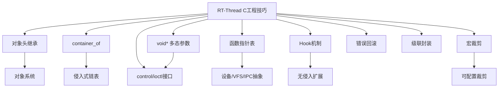

## 二、对象头继承

### 核心问题

C 语言没有 class，RT-Thread 如何统一管理线程、定时器、IPC、设备？

### 一句话本质

把公共对象头放在结构体第一个成员，利用结构体首地址等于第一个成员首地址，实现 C 语言里的轻量继承。

### 源码场景

线程、定时器、信号量等对象都有类似结构：

```c
struct rt_timer
{
    struct rt_object parent;
    rt_list_t row[RT_TIMER_SKIP_LIST_LEVEL];
    void (*timeout_func)(void *parameter);
    void *parameter;
    rt_tick_t init_tick;
    rt_tick_t timeout_tick;
};
```

当 `parent` 是第一个成员时：

```c
rt_object_t obj = (rt_object_t)timer;
```

这个强转是安全的，因为对象地址和 `parent` 地址相同。

### Mermaid 图

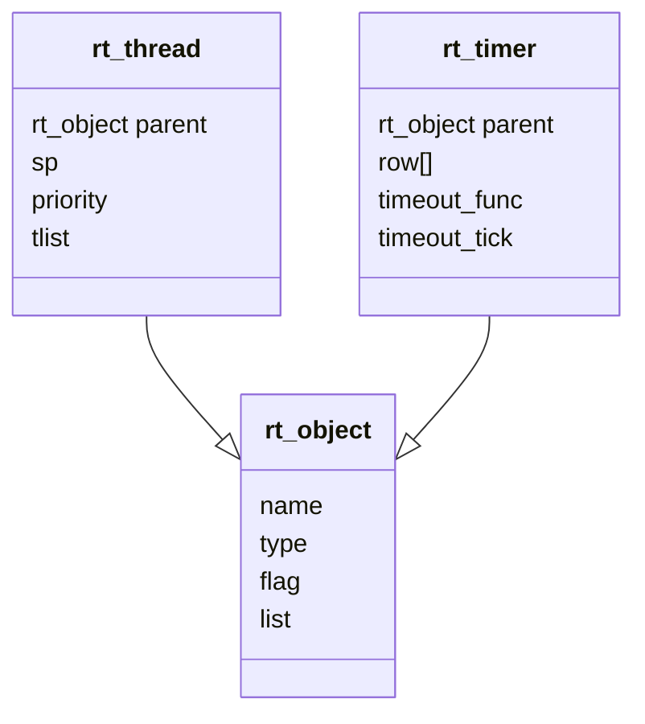

### 可迁移写法

如果你自己写一个驱动框架，可以这样设计：

```c
struct my_object
{
    char name[16];
    uint8_t type;
};

struct motor_device
{
    struct my_object parent;
    int speed;
    int (*set_speed)(int speed);
};
```

上层只管理 `my_object`，具体模块管理自己的私有字段。

### 源码入口

- [[3.深化启动的理解+理解对象系统]]：对象系统
- [[4.(Thread)线程的创建和理解]]：`struct rt_thread`
- [[7.Timer]]：`struct rt_timer`

## 三、`container_of`

### 核心问题

只有结构体内部成员地址，如何反推出外部结构体地址？

### 一句话本质

`container_of` 用“成员地址 - 成员偏移”反推出宿主对象地址，是侵入式链表和对象组合的关键。

### 源码场景

Timer 里有线程定时器特判：

```c
thread = rt_container_of(timer, struct rt_thread, thread_timer);
```

意思是：

```text
我拿到的是 thread_timer 的地址
但我想知道它属于哪个 struct rt_thread
```

### Mermaid 图

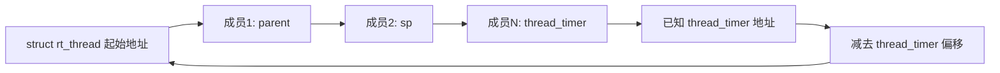

### 可迁移写法

适合这些场景：

- 通用链表节点嵌入业务结构。
- 定时器回调里从 timer 找回所属对象。
- 事件节点、消息节点、状态机节点属于更大对象。

### 注意事项

`container_of` 很强，但也很危险：

1. 成员名必须正确。
2. 指针必须真的指向该成员。
3. 结构体布局不能被错误假设。

### 源码入口

- [[7.Timer]]：`rt_timer_start`
- [[3.深化启动的理解+理解对象系统]]：对象遍历工具函数

## 四、`void *arg` 多态传参

### 核心问题

C 语言没有泛型，`control` 类接口如何传不同类型参数？

### 一句话本质

用 `void *` 承载不同类型的数据地址或值，再由 `cmd` 决定如何解释它。

### 源码场景

Timer control：

```c
rt_timer_control(timer, RT_TIMER_CTRL_SET_TIME, &tick);
rt_timer_control(timer, RT_TIMER_CTRL_SET_FUNC, timeout_func);
rt_timer_control(timer, RT_TIMER_CTRL_SET_PARM, parameter);
```

Thread control：

```c
rt_thread_control(thread, RT_THREAD_CTRL_CHANGE_PRIORITY, &priority);
```

### Mermaid 图

```mermaid
flowchart TD
    A[control(timer, cmd, arg)] --> B{cmd}
    B -->|GET_TIME| C["arg 解释为 rt_tick_t*"]
    B -->|SET_FUNC| D["arg 解释为 function pointer"]
    B -->|SET_PARM| E["arg 解释为 void* parameter"]
    B -->|GET_STATE| F["arg 解释为 uint32_t*"]
```

### 可迁移写法

```c
int motor_control(struct motor *m, int cmd, void *arg)
{
    switch (cmd)
    {
    case MOTOR_SET_SPEED:
        m->speed = *(int *)arg;
        break;
    case MOTOR_GET_SPEED:
        *(int *)arg = m->speed;
        break;
    default:
        return -1;
    }
    return 0;
}
```

### 注意事项

`void *` 灵活但不类型安全。写这类接口时必须：

- 明确每个 `cmd` 需要什么类型。
- 文档写清楚传入的是值还是地址。
- 对外 API 尽量少暴露晦涩强转。

## 五、函数指针表

### 核心问题

不同底层实现如何共用同一套上层接口？

### 一句话本质

函数指针表把“操作集合”作为对象字段，上层只调用统一接口，底层决定具体行为。

### 源码场景

你在 [[4.(Thread)线程的创建和理解]] 里记录过 VFS 的例子：

```c
struct dfs_fd
{
    const struct dfs_file_ops *fops;
    void *data;
};
```

调用：

```c
fd->fops->read(fd, buf, len);
```

如果是 FATFS，就指向 `fatfs_read`；如果是 RomFS，就指向 `romfs_read`。

### Mermaid 图

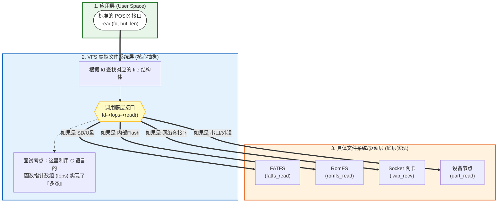

### 可迁移写法

适合驱动抽象：

```c
struct sensor_ops
{
    int (*init)(void *dev);
    int (*read)(void *dev, int *value);
};

struct sensor
{
    const struct sensor_ops *ops;
    void *priv;
};
```

## 六、Hook 机制

### 核心问题

如何在不改内核源码的情况下插入调试、统计、追踪逻辑？

### 一句话本质

Hook 是内核预留的回调点，用户注册函数后，内核在关键事件发生时主动回调。

### 源码场景

常见 Hook：

- 线程切换 Hook
- 线程 resume Hook
- Timer enter/exit Hook
- Object take/put Hook

典型形式：

```c
RT_OBJECT_HOOK_CALL(rt_thread_resume_hook, (thread));
```

### Mermaid 图

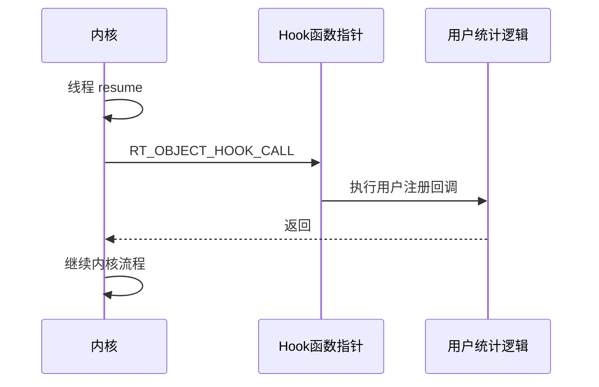

### 可迁移写法

你自己的模块可以预留：

```c
typedef void (*motor_hook_t)(int event);
static motor_hook_t motor_hook;

void motor_set_hook(motor_hook_t hook)
{
    motor_hook = hook;
}

static void motor_event(int event)
{
    if (motor_hook) motor_hook(event);
}
```

### 注意事项

Hook 不能破坏主流程。尤其在中断或锁内调用的 Hook，必须极短，不应阻塞。

## 七、宏裁剪与条件编译

### 核心问题

RT-Thread 为什么有大量 `RT_USING_XXX`？

### 一句话本质

宏裁剪让同一套源码适配不同芯片、不同功能组合和不同资源规模。

### 源码场景

Timer：

```c
#ifdef RT_USING_TIMER_SOFT
    /* 创建软件定时器线程 */
#endif
```

Heap：

```c
#ifdef RT_USING_HEAP
    /* 动态对象 create/delete */
#endif
```

### Mermaid 图

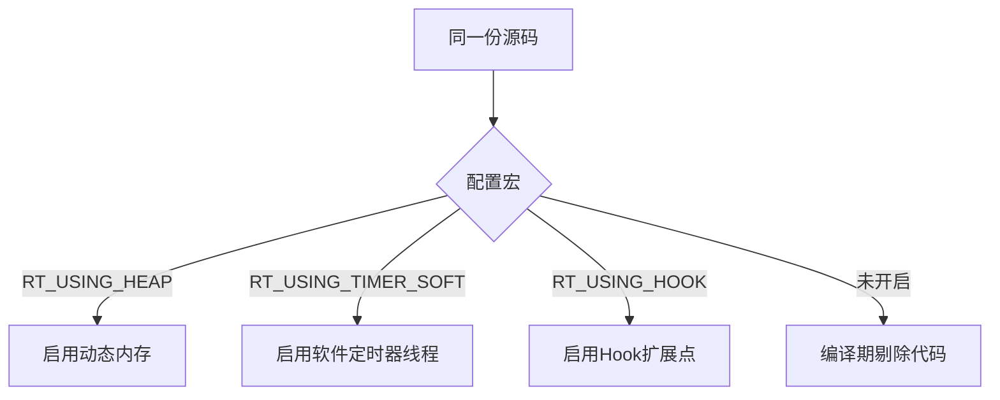

### 可迁移写法

适合资源受限项目：

```c
#ifdef USING_LOG
    log_debug("state=%d", state);
#endif
```

但不要滥用宏。宏太多会增加阅读成本，所以需要集中配置、清晰命名和文档说明。

## 八、错误回滚

### 核心问题

C 语言没有异常，资源申请一半失败怎么办？

### 一句话本质

谁后申请，谁先释放；失败路径必须把已获得资源回滚干净。

### 源码场景

动态线程创建通常涉及：

```text
分配 TCB
分配 stack
初始化线程
```

如果 stack 分配失败，必须释放 TCB，否则泄漏。

### Mermaid 图

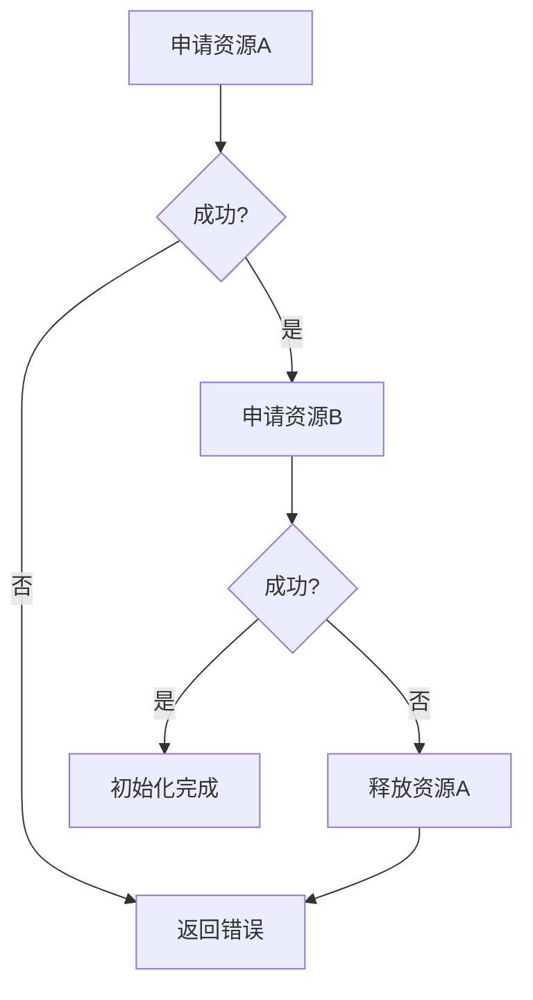

### 可迁移写法

```c
obj = alloc_obj();
if (!obj) return -ENOMEM;

buf = alloc_buf();
if (!buf)
{
    free_obj(obj);
    return -ENOMEM;
}
```

复杂函数可以用 `goto fail_xxx` 统一释放。

## 九、级联封装

### 核心问题

C 语言没有默认参数和函数重载，如何同时提供简单 API 和强大底层能力？

### 一句话本质

底层写一个参数完整的通用函数，上层用小函数填默认参数，形成级联封装。

### 源码场景

Thread suspend：

```text
rt_thread_suspend_to_list(thread, list, ipc_flags, suspend_flag)
-> rt_thread_suspend_with_flag(thread, suspend_flag)
-> rt_thread_suspend(thread)
```

### Mermaid 图

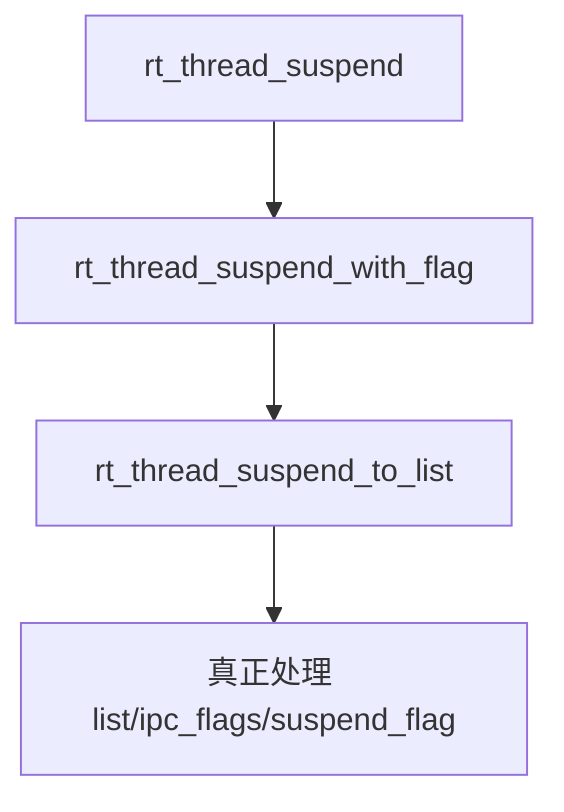

### 可迁移写法

```c
int queue_send_full(queue_t *q, void *data, int timeout, int flags);

int queue_send(queue_t *q, void *data)
{
    return queue_send_full(q, data, 0, QUEUE_FLAG_DEFAULT);
}
```

## 十、`control/ioctl` 风格接口

### 核心问题

为什么 Timer 不提供一堆 `set_time/get_time/set_func/get_state`，而是集中到 `rt_timer_control`？

### 一句话本质

`control` 用 `cmd + void *arg` 把多个小操作收敛成一个扩展点，避免 API 膨胀。

### 源码场景

[[7.Timer]] 中：

```c
rt_timer_control(timer, RT_TIMER_CTRL_SET_TIME, &tick);
rt_timer_control(timer, RT_TIMER_CTRL_GET_STATE, &state);
```

### Mermaid 图

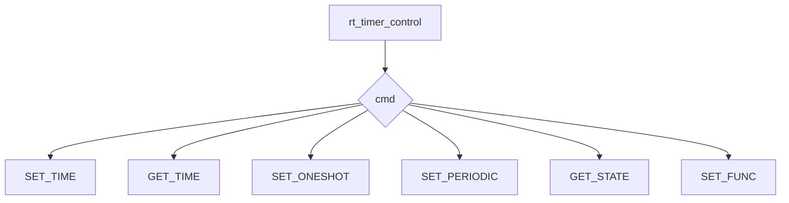

### 可迁移写法

适合设备驱动、协议栈、组件控制面：

```c
device_control(dev, DEV_SET_BAUDRATE, &baud);
device_control(dev, DEV_GET_STATUS, &status);
```

### 注意事项

`control` 接口适合“控制面”，不适合把主要业务动作都塞进去。高频、强类型、核心路径仍然应该提供清晰 API。

## 十一、广度补全：可迁移工程技巧基础卡

这里补齐你在 [[1.总体架构的理解]]、[[2.启动主链分析]]、[[3.深化启动的理解+理解对象系统]]、[[4.(Thread)线程的创建和理解]]、[[5.Scheduler(调度器)-单核和底层驱动]] 里反复提到的 C 工程写法。重点不是背 API，而是迁移到你自己的项目。

### 11.1 头文件分层：`rtthread.h` / `rtdef.h` / `rthw.h`

| 项目 | 内容 |
| --- | --- |
| 核心问题 | 为什么 RT-Thread 不把所有定义塞进一个大头文件？ |
| 一句话本质 | 公共 API、基础类型定义、硬件移植接口要分层，避免上层逻辑直接依赖底层硬件细节。 |
| 源码场景 | `rtthread.h` 更像用户/内核公共入口，`rtdef.h` 承载对象、类型、宏定义，`rthw.h` 承接硬件抽象。 |
| 可迁移写法 | 自己项目也可以拆成 `app_api.h`、`core_def.h`、`board_port.h`，让业务层只看稳定接口。 |
| 关联模块 | [[1.总体架构的理解]]、[[5.Scheduler(调度器)-单核和底层驱动]]。 |

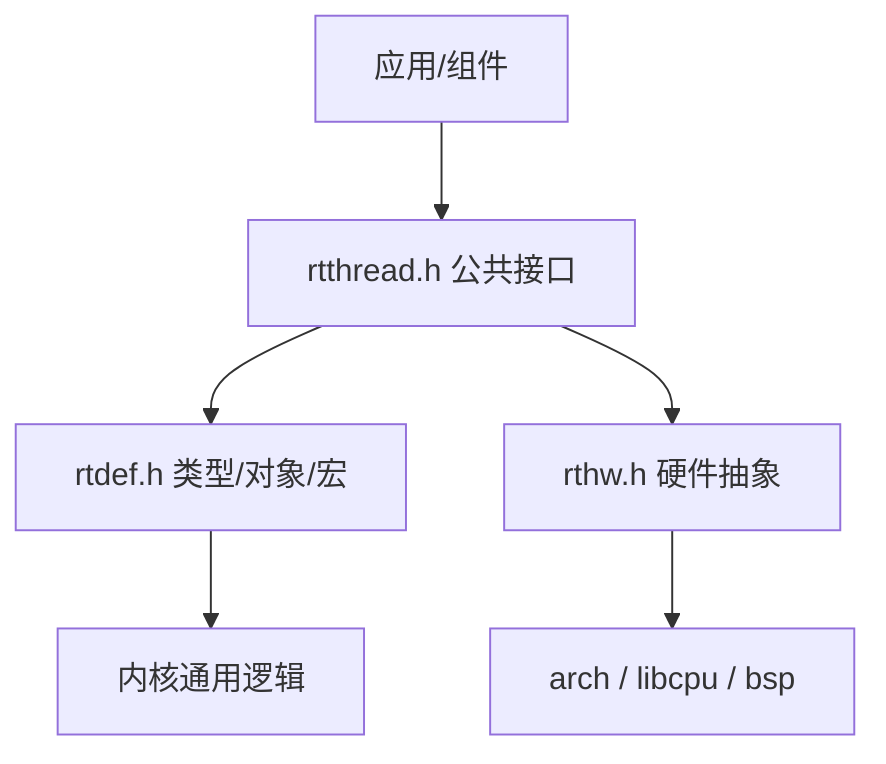

### 11.2 编译期防御：`#error`、范围校验、配置组合检查

| 项目 | 内容 |
| --- | --- |
| 核心问题 | 为什么有些错误要在编译期拦住？ |
| 一句话本质 | 嵌入式系统运行时排错成本高，能在编译期发现的配置错误不要留到板子上爆。 |
| 源码场景 | 优先级范围、宏组合、架构位宽、功能开关之间的依赖。 |
| 可迁移写法 | 用 `#if/#error` 检查配置合法性，用 `static_assert` 或数组长度技巧做编译期约束。 |
| 关联模块 | [[1.总体架构的理解]]、[[5.Scheduler(调度器)-单核和底层驱动]]。 |

### 11.3 公共 API + 私有 helper 的级联封装

| 项目 | 内容 |
| --- | --- |
| 核心问题 | 为什么很多函数外层只做参数校验，真正逻辑放到 `_xxx` 私有函数？ |
| 一句话本质 | 公共 API 负责契约和防御，私有 helper 负责可复用的核心动作。 |
| 源码场景 | `rt_thread_detach` 与 `_thread_detach`，Timer start/stop 的外层检查与内部插入/删除。 |
| 可迁移写法 | `module_delete()` 做用户输入检查，`_module_detach_locked()` 做内部状态迁移，避免多个入口复制核心逻辑。 |
| 关联模块 | [[4.(Thread)线程的创建和理解]]、[[7.Timer]]。 |

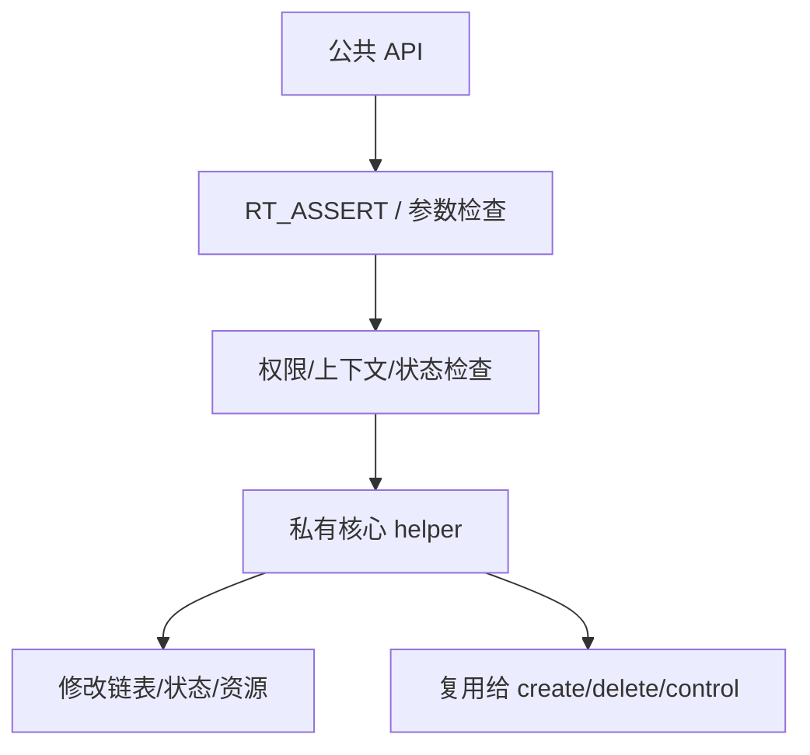

### 11.4 字符串名字作为系统级标识符

| 项目 | 内容 |
| --- | --- |
| 核心问题 | 为什么对象要带名字？嵌入式里字符串不是很浪费吗？ |
| 一句话本质 | 名字让对象可查找、可调试、可在 FinSH/日志里被人识别，是可观测性的一部分。 |
| 源码场景 | `rt_object_init` 设置 name，`rt_object_find` 按 type/name 查找对象。 |
| 可迁移写法 | 对长期存在的任务、设备、通信对象保留短名字；对高频临时对象避免滥用字符串。 |
| 关联模块 | [[2.启动主链分析]]、[[3.深化启动的理解+理解对象系统]]。 |

### 11.5 Hook 与日志：低侵入观测点

| 项目 | 内容 |
| --- | --- |
| 核心问题 | 为什么内核不建议到处加业务 printf？ |
| 一句话本质 | Hook 和日志宏把观测点留在框架层，既能调试又不破坏核心逻辑。 |
| 源码场景 | `RT_USING_HOOK`、线程切换钩子、对象钩子、idle hook、`LOG_D`。 |
| 可迁移写法 | 给关键状态机预留 `on_enter/on_leave/on_error` 钩子，日志用等级宏控制编译和运行开销。 |
| 关联模块 | [[1.总体架构的理解]]、[[3.深化启动的理解+理解对象系统]]、[[4.(Thread)线程的创建和理解]]。 |

### 11.6 `$Sub$$main` / `$Super$$main`：C 里的切面入口

| 项目 | 内容 |
| --- | --- |
| 核心问题 | 为什么可以在不改用户 `main` 的情况下插入 RT-Thread 启动？ |
| 一句话本质 | 编译器/链接器支持函数包裹，让系统启动逻辑像切面一样插入用户入口前后。 |
| 源码场景 | 启动适配层通过 `$Sub$$main` 接管入口，再在合适时机调用 `$Super$$main`。 |
| 可迁移写法 | 在受控工具链里可用这种方式做框架接管；普通项目更推荐显式入口函数，降低工具链绑定。 |
| 关联模块 | [[2.启动主链分析]]、[[06-系统设计与架构模式]]。 |

### 11.7 错误回滚模板

| 项目 | 内容 |
| --- | --- |
| 核心问题 | create 过程中任何一步失败怎么办？ |
| 一句话本质 | 资源按顺序申请，失败时按相反顺序释放，确保不会留下半初始化对象。 |
| 源码场景 | 动态线程需要控制块和栈两类资源；Timer/IPC 动态对象也要区分对象分配和私有资源初始化。 |
| 可迁移写法 | 用单出口 `goto fail_x` 或分层 cleanup，标签名字对应已经成功申请的资源边界。 |
| 关联模块 | [[4.(Thread)线程的创建和理解]]、[[3.深化启动的理解+理解对象系统]]、[[RT-thread源码阅读-v2/07-内存管理]]。 |

```c
obj = alloc_obj();
if (!obj) return -ENOMEM;

buf = alloc_buf();
if (!buf) goto fail_obj;

ret = init_core(obj, buf);
if (ret) goto fail_buf;

return 0;

fail_buf:
free_buf(buf);
fail_obj:
free_obj(obj);
return ret;
```

### 11.8 私有数据指针：`void *data` / `void *parameter`

| 项目 | 内容 |
| --- | --- |
| 核心问题 | C 没有泛型，为什么 RT-Thread 到处用 `void *`？ |
| 一句话本质 | `void *` 是 C 里最小成本的通用扩展点，但必须由调用方保证真实类型。 |
| 源码场景 | 线程入口参数、Timer 回调参数、device user data、IPC 扩展数据。 |
| 可迁移写法 | 公共接口用 `void *arg`，内部第一时间转成明确结构体指针，并用注释/断言约束生命周期。 |
| 关联模块 | [[4.(Thread)线程的创建和理解]]、[[7.Timer]]、[[05-C语言工程技巧]]。 |
