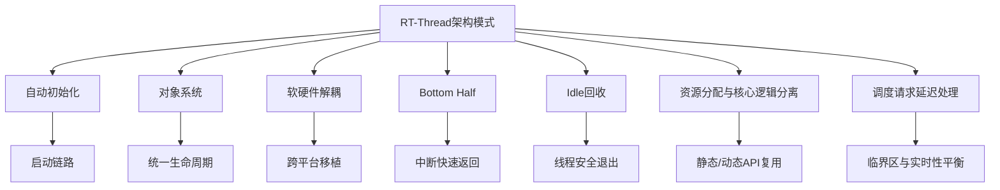
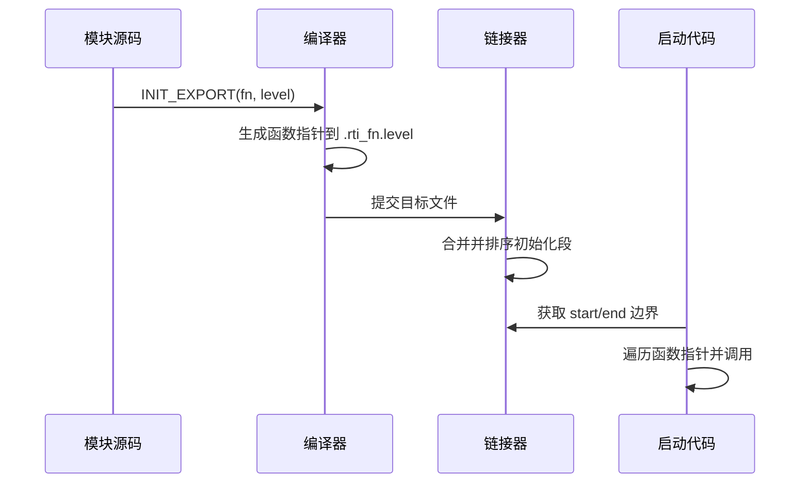
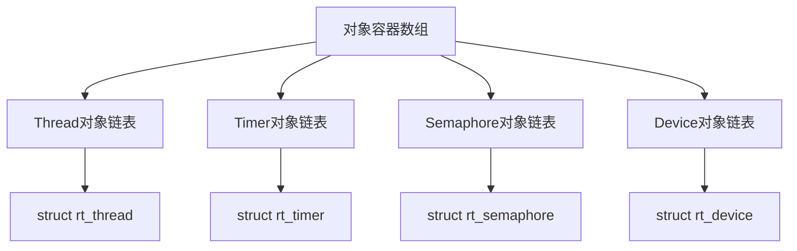
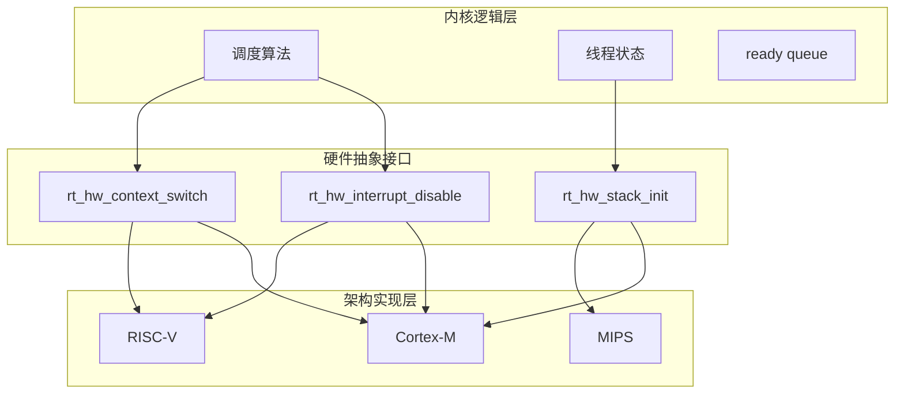
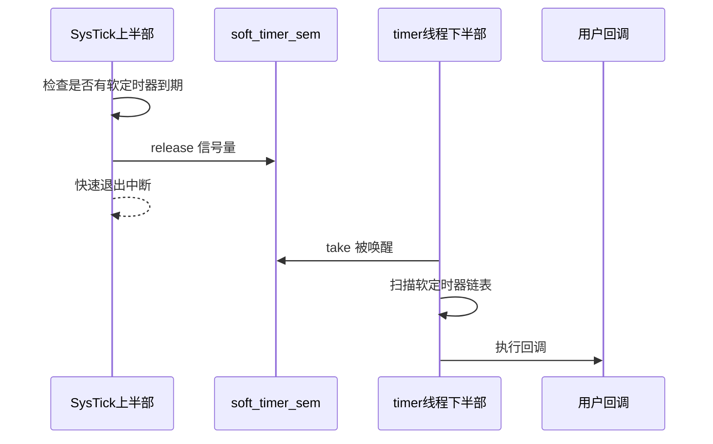
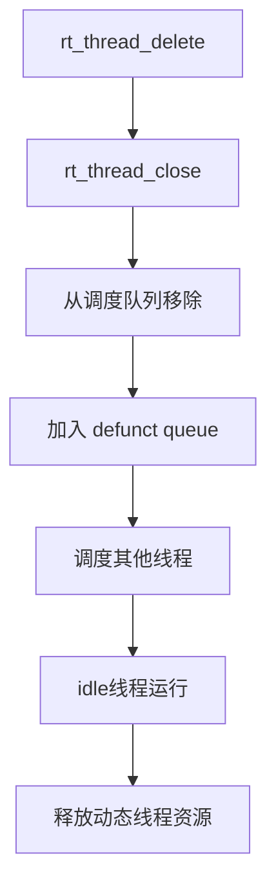
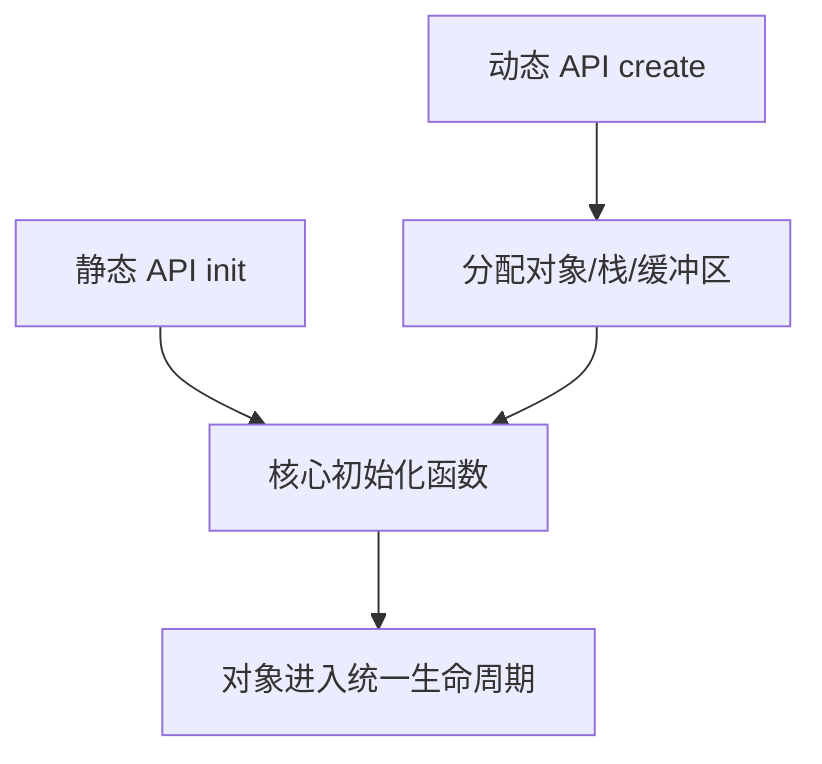
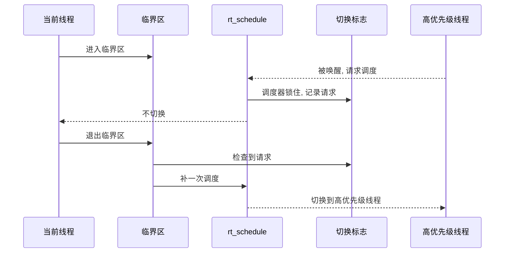
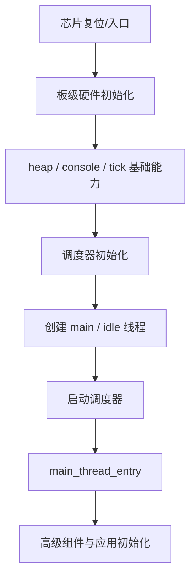
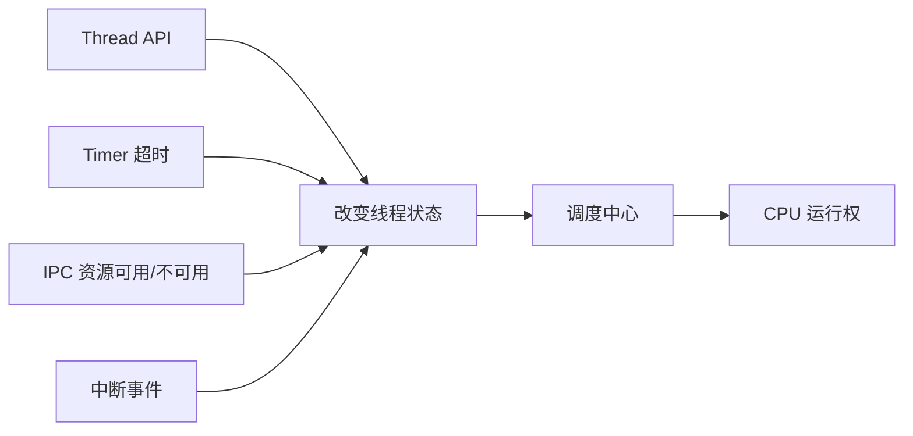

# 系统设计与架构模式

> [!abstract] 核心本质
> 读 RT-Thread 源码不能只看函数，还要看架构师如何划分边界：初始化边界、对象边界、上下文边界、软硬件边界、资源生命周期边界。

## 一、总览



## 二、自动初始化机制

### 核心问题

为什么 RT-Thread 不在 `main()` 里手动调用所有模块初始化函数？

### 一句话本质

自动初始化用“宏 + 特殊段 + 链接脚本 + 启动遍历”把分散模块的初始化函数收集起来，启动时按顺序统一调用。

### 机制拆解

传统方式：

```c
uart_init();
spi_init();
i2c_init();
```

问题是：

- 容易漏。
- 模块耦合到 main。
- 新增驱动要改中心入口。

RT-Thread 的方式：

```c
INIT_BOARD_EXPORT(uart_init);
INIT_DEVICE_EXPORT(spi_init);
INIT_COMPONENT_EXPORT(fs_init);
```

宏把函数指针放到特殊段，链接器把这些段排列好，启动代码遍历 `__rt_init_start` 到 `__rt_init_end`。

### Mermaid 图



### 架构价值

| 价值 | 说明 |
| --- | --- |
| 解耦 | 模块自己声明初始化，不改主流程 |
| 可扩展 | 新增驱动只需注册宏 |
| 可裁剪 | 宏关闭后代码不进入最终镜像 |
| 有顺序 | 不同 level 控制初始化阶段 |

### 源码入口

- [[2.启动主链分析]]：自动初始化机制详解
- [[05-C语言工程技巧]]：宏裁剪

## 三、对象系统

### 核心问题

为什么线程、定时器、IPC、设备都要抽象成对象？

### 一句话本质

对象系统把不同内核资源的公共部分抽出来，统一处理命名、类型、生命周期、查找和调试。

### 机制拆解

对象系统不是为了“像 C++ 一样好看”，而是为了解决规模管理：

```text
几十种对象
成百上千个实例
需要统一查找、遍历、调试、释放
```

公共字段：

```text
name
type
flag
list
```

具体对象：

- 线程有栈、入口函数、优先级。
- 定时器有超时时间、回调函数、跳表节点。
- IPC 有资源计数和等待队列。

### Mermaid 图



### 架构价值

对象系统让 RT-Thread 可以实现：

- `list_thread`
- 对象查找
- 静态/动态对象区分
- FinSH 调试
- 统一 Hook
- 统一生命周期检查

### 源码入口

- [[3.深化启动的理解+理解对象系统]]：对象系统源码剖析
- [[05-C语言工程技巧]]：对象头继承

## 四、软硬件解耦

### 核心问题

RT-Thread 如何支持不同芯片架构？

### 一句话本质

内核核心只表达调度、对象、队列等逻辑；真正和 CPU 相关的关中断、上下文切换、栈初始化放到硬件抽象层。

### 机制拆解

调度器知道：

```text
我要从 from_thread 切到 to_thread
```

但调度器不应该知道：

```text
ARM 的哪些寄存器要压栈
RISC-V 的上下文怎么保存
PendSV 怎么配置
```

这些交给：

- `rt_hw_interrupt_disable`
- `rt_hw_interrupt_enable`
- `rt_hw_context_switch`
- `rt_hw_stack_init`

### Mermaid 图



### 源码入口

- [[5.Scheduler(调度器)-单核和底层驱动]]：软硬件解耦设计
- [[4.29阅读想法]]：调度器与硬件层上下文切换疑问

## 五、Bottom Half 中断推迟处理

### 核心问题

为什么软定时器不直接在 SysTick 中断里执行回调？

### 一句话本质

中断上半部只做快速判断和唤醒，下半部在线程上下文处理耗时任务，避免中断被长时间占用。

### 机制拆解

Timer 中的软定时器就是典型 Bottom Half：

```text
SysTick 中断：
  检查软定时器最早到期时间
  如果到期，release _soft_timer_sem
  快速退出

timer 线程：
  take _soft_timer_sem
  扫描 _soft_timer_list
  执行软定时器回调
```

### Mermaid 图



### 架构价值

- 中断更短。
- 回调上下文更安全。
- 系统响应更稳定。
- 用户回调不容易拖垮硬中断路径。

### 源码入口

- [[7.Timer]]：`rt_system_timer_thread_init`
- [[7.Timer]]：`rt_timer_check`
- [[04-并发与上下文]]：软/硬定时器上下文

## 六、Idle 回收

### 核心问题

为什么删除线程时，不一定立即释放内存？

### 一句话本质

线程退出时可能还处在自己的执行上下文里，立即释放自己的栈很危险，所以 RTOS 把回收工作交给 idle 线程延后处理。

### 机制拆解

动态线程删除通常不是简单 free：

```text
停止线程运行
-> 从调度队列移除
-> 放入 defunct/zombie 队列
-> idle 线程在安全时机释放资源
```

### Mermaid 图



### 架构价值

- 避免线程释放自己正在使用的栈。
- 把危险的资源回收放到确定安全的上下文。
- idle 不只是“空转”，还是系统清道夫。

### 源码入口

- [[4.(Thread)线程的创建和理解]]：`rt_thread_close`
- [[4.(Thread)线程的创建和理解]]：`rt_thread_delete`
- [[3.深化启动的理解+理解对象系统]]：空闲线程陷阱

## 七、资源分配与核心逻辑分离

### 核心问题

为什么很多模块都有 `init/create` 两套 API，但最终汇聚到同一个内部初始化函数？

### 一句话本质

资源分配和核心初始化是两层职责：动态 API 负责申请内存，静态 API 负责初始化已有内存，内部核心逻辑尽量复用。

### 机制拆解

以线程为例：

```text
rt_thread_init:
  用户提供 TCB + stack
  -> _thread_init

rt_thread_create:
  系统分配 TCB + stack
  -> _thread_init
```

以 Timer 为例：

```text
rt_timer_init:
  用户提供 timer 控制块
  -> _timer_init

rt_timer_create:
  object_allocate 分配 timer 对象
  -> _timer_init
```

### Mermaid 图



### 架构价值

- 减少重复代码。
- 静态/动态行为一致。
- 分配失败可以在外层回滚。
- 内核对象生命周期更清楚。

### 源码入口

- [[4.(Thread)线程的创建和理解]]：`rt_thread_init` / `rt_thread_create`
- [[7.Timer]]：`rt_timer_init` / `rt_timer_create`
- [[05-C语言工程技巧]]：错误回滚、级联封装

## 八、调度请求延迟处理

### 核心问题

调度器上锁时，如果来了更高优先级线程，系统会不会错过？

### 一句话本质

不会。RT-Thread 不在锁内直接切换，而是记录切换请求，等临界区退出时补调度。

### 机制拆解

```text
rt_schedule:
  如果 scheduler_lock_nest > 0
    设置 critical switch flag
    返回

rt_exit_critical:
  nest--
  如果 nest == 0 且 switch flag 置位
    清 flag
    rt_schedule
```

### Mermaid 图



### 架构价值

- 临界区内状态不被破坏。
- 高优先级响应不丢失。
- 中断仍可快速进入。
- 调度时机更可控。

### 源码入口

- [[5.Scheduler(调度器)-单核和底层驱动]]：调度器锁详解
- [[04-并发与上下文]]：调度器锁

## 九、架构阅读口诀

读 RT-Thread 源码时，可以用这几个问题逼自己看懂设计：

1. 这个机制管理的对象是什么？
2. 对象在哪里排队？
3. 谁会并发访问这张队列？
4. 它运行在线程上下文还是中断上下文？
5. 它是否会改变线程状态？
6. 它是否可能触发调度？
7. 资源是谁分配，谁释放？
8. 如果这个模块被宏裁剪掉，系统行为如何变化？

## 十、广度补全：架构模式基础卡

这里不再只写某几个漂亮设计，而是把你现有模块里出现过的架构思想先拉成一张清单。以后你二刷源码时，可以用这些卡片去判断“这段代码为什么这么分层”。

### 10.1 分阶段启动

| 项目 | 内容 |
| --- | --- |
| 核心问题 | 为什么启动不直接从 `main` 开始跑应用？ |
| 一句话本质 | RTOS 需要先建立硬件、内存、对象、调度器、系统线程，再把应用放到合适上下文运行。 |
| 架构价值 | 明确阶段能力边界，避免高级模块过早依赖尚未准备好的资源。 |
| 源码入口 | [[2.启动主链分析]]：`rtthread_startup`、`rt_hw_board_init`、`rt_application_init`、`main_thread_entry`。 |
| 面试表达 | RT-Thread 启动设计体现的是“能力逐步开放”，不是简单函数顺序。 |



### 10.2 对象系统作为内核资源总线

| 项目 | 内容 |
| --- | --- |
| 核心问题 | 为什么线程、Timer、IPC、Device 都要纳入对象系统？ |
| 一句话本质 | 对象系统是内核资源的注册总线，让不同资源共享命名、生命周期、遍历和调试机制。 |
| 架构价值 | 降低模块重复代码，为 FinSH、调试、动态对象管理提供统一入口。 |
| 源码入口 | [[3.深化启动的理解+理解对象系统]]、[[1.总体架构的理解]]。 |
| 面试表达 | RT-Thread 的对象系统是 C 语言实现轻量内核运行时的核心。 |

### 10.3 行为分层：API 层、语义层、数据结构层、移植层

| 层次 | 负责什么 | 例子 |
| --- | --- | --- |
| API 层 | 参数校验、用户契约、错误码 | `rt_thread_startup`、`rt_timer_start` |
| 语义层 | 状态迁移、模块协作 | `_thread_detach`、`rt_sched_thread_init_ctx` |
| 数据结构层 | 链表、位图、跳表、等待队列 | `rt_sched_insert_thread`、`_timer_start` |
| 移植层 | 寄存器现场、关中断、上下文切换 | `rt_hw_context_switch`、PendSV |

**关联模块**：[[4.(Thread)线程的创建和理解]]、[[5.Scheduler(调度器)-单核和底层驱动]]、[[8.Interrupt]]。  
**后续深挖**：每读一个函数，标注它属于哪一层，避免把 API 包装函数和核心算法混在一起。

### 10.4 调度中心化

| 项目 | 内容 |
| --- | --- |
| 核心问题 | 为什么 Thread、Timer、IPC 最终都要回到 Scheduler？ |
| 一句话本质 | RTOS 的核心决策是“哪个线程现在能运行”，所有会改变线程可运行性的模块都必须向调度中心汇合。 |
| 架构价值 | Thread 负责线程语义，Timer 负责时间条件，IPC 负责资源条件，Scheduler 统一裁决 CPU 归属。 |
| 源码入口 | [[4.29阅读想法]]、[[5.Scheduler(调度器)-单核和底层驱动]]、[[6.Scheduler-上层调度]]。 |
| 面试表达 | RTOS 的模块不是孤立的，Timer 和 IPC 的终点经常都是一次调度决策。 |



### 10.5 延迟处理模式

| 场景 | 上半部做什么 | 下半部做什么 | 架构价值 |
| --- | --- | --- | --- |
| 中断 + PendSV | 记录需要切换 | PendSV 做真正上下文切换 | 缩短高优先级中断路径 |
| SysTick + 软定时器 | 释放信号/标记到期 | timer 线程执行回调 | 避免用户回调拖住中断 |
| 线程删除 + Idle | 标记退出/摘链 | idle 安全释放资源 | 避免当前线程释放自己的运行现场 |
| IPC 唤醒 | 修改等待条件 | 调度器选择线程 | 统一 CPU 归属决策 |

**关联模块**：[[7.Timer]]、[[8.Interrupt]]、[[3.深化启动的理解+理解对象系统]]、[[04-并发与上下文]]。

### 10.6 可配置内核

| 项目 | 内容 |
| --- | --- |
| 核心问题 | 为什么 RT-Thread 到处都是 `RT_USING_XXX`？ |
| 一句话本质 | 嵌入式资源差异巨大，内核必须能按产品场景裁剪功能、节省 ROM/RAM。 |
| 架构价值 | 同一套源码可以覆盖极小 MCU 到复杂 SoC，但代价是阅读时要带着配置条件看代码。 |
| 源码入口 | [[1.总体架构的理解]]：`RT_USING_HEAP`、`RT_USING_HOOK`；Timer/IPC/Memory 各模块配置宏。 |
| 面试表达 | 宏裁剪不是简单 ifdef，而是嵌入式产品化能力的一部分。 |

### 10.7 可移植抽象

| 项目 | 内容 |
| --- | --- |
| 核心问题 | RT-Thread 如何既支持 ARM Cortex-M，又支持 QEMU/其他架构？ |
| 一句话本质 | 内核公共逻辑不直接操作寄存器，把关中断、上下文切换、IPI、cache/MMU 等放到移植层。 |
| 架构价值 | 调度算法、对象系统、IPC 逻辑可以复用，硬件差异集中在 BSP/libcpu/arch。 |
| 源码入口 | [[1.总体架构的理解]]、[[2.启动主链分析]]、[[5.Scheduler(调度器)-单核和底层驱动]]、[[8.Interrupt]]。 |
| 面试表达 | RTOS 的可移植性来自“硬件相关能力接口化，内核策略平台无关化”。 |

### 10.8 可观测性设计

| 项目 | 内容 |
| --- | --- |
| 核心问题 | 内核问题为什么需要 Hook、日志、对象遍历、栈水位这些机制？ |
| 一句话本质 | RTOS bug 常发生在并发和生命周期边界，必须在框架层预留低侵入观测点。 |
| 架构价值 | 不改核心逻辑也能观察线程切换、对象状态、内存使用、栈风险。 |
| 源码入口 | [[1.总体架构的理解]]、[[3.深化启动的理解+理解对象系统]]、[[6.Scheduler-上层调度]]。 |
| 面试表达 | 好的内核不仅要能跑，还要能被诊断、被裁剪、被验证。 |
