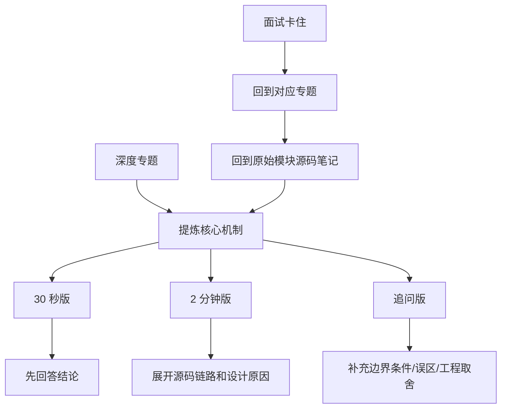

# 面试复述卡片

> [!abstract] 核心本质
> 这份文件是输出层。深度理解回到前面的专题，面试时用这里把知识压缩成 30 秒版、2 分钟版和追问版。

## 使用方法

这张图的意思是：面试复述不是重新背一套孤立答案，而是把专题里的“机制理解”压缩成不同长度的表达。答不上来时，先回专题，再回原始模块笔记确认源码入口。

## 一、RT-Thread 启动流程

### 30 秒版

RT-Thread 启动从 `rtthread_startup` 进入，先关中断，完成板级初始化、heap、console 和自动初始化，再初始化 timer、scheduler，创建 main、idle 等系统线程，最后启动调度器。调度器启动后，系统从裸机阶段进入多线程阶段。

### 2 分钟版

启动链路的关键是上下文边界。`rt_hw_board_init` 发生在调度器启动之前，适合做时钟、串口、heap、板级设备等早期初始化，不能依赖阻塞和线程切换。`main_thread_entry` 运行时调度器已经启动，可以继续做组件初始化和用户 main。自动初始化机制通过宏和链接段把分散模块的初始化函数收集起来，避免所有初始化都手写到 main。

### 追问版

如果问“为什么分 board init 和 components init”，答：因为调度器前后能使用的 OS 能力不同。调度器前是裸机环境，调度器后才有线程上下文。

来源：[[2.启动主链分析]]、[[06-系统设计与架构模式]]

## 二、对象系统

### 30 秒版

RT-Thread 对象系统把线程、定时器、IPC、设备等资源抽象成统一对象，公共字段包括 name、type、flag、list。这样内核可以统一管理生命周期、查找、调试和对象容器。

### 2 分钟版

具体对象通常把 `struct rt_object` 放在结构体开头，形成 C 语言里的轻量继承。对象系统只处理公共部分，具体模块继续管理私有字段。比如线程有栈和优先级，定时器有 timeout_tick 和回调，IPC 有资源状态和等待队列。这个设计让 FinSH、对象查找、动态/静态对象区分都能建立在同一套机制上。

### 追问版

如果问“C 语言怎么实现继承”，答：结构体第一个成员放公共对象头，结构体首地址等于第一个成员地址，所以可安全强转成基类指针。

来源：[[3.深化启动的理解+理解对象系统]]、[[05-C语言工程技巧]]

## 三、线程创建后为什么不立刻运行

### 30 秒版

线程创建只是初始化 TCB、栈和入口函数。只有调用 `rt_thread_startup` 后，线程才进入 ready queue。最终是否运行，还要看调度器是否选中它。

### 2 分钟版

动态创建线程时，系统先分配线程对象和栈，再复用 `_thread_init` 初始化线程字段和初始栈上下文。此时线程只是一个可用对象，不代表已经参与调度。`startup` 会把线程状态推进到 ready，并插入对应优先级链表，同时更新 ready 位图。调度器根据优先级决定是否切换过去。

### 追问版

如果问“resume 是不是立刻运行”，答：不是。resume 只是重新进入就绪队列，是否立刻运行取决于优先级和调度器当前是否可切换。

来源：[[4.(Thread)线程的创建和理解]]、[[02-源码行为链路]]

## 四、调度器如何快速找到最高优先级线程

### 30 秒版

RT-Thread 使用位图 + 链表数组。位图表示哪些优先级有 ready 线程，链表数组保存每个优先级下的具体线程。调度时先用位图快速找到最高优先级，再从对应链表取线程。

### 2 分钟版

只用链表需要遍历所有 ready 线程，实时性不稳定；只用位图又不知道具体线程是谁。因此 RTOS 常用二者组合。插入线程时，把线程节点放入 `rt_thread_priority_table[priority]`，同时点亮对应位图。移除线程时，如果该优先级链表空了，再清除位图。这样查找最高优先级可以做到 O(1) 或接近 O(1)。

### 追问版

如果问“同优先级怎么办”，答：同优先级线程挂在同一个链表里，通过时间片轮转和 yield 改变链表顺序。

来源：[[5.Scheduler(调度器)-单核和底层驱动]]、[[03-底层算法与数据结构]]

## 五、关中断、调度器锁、自旋锁的区别

### 30 秒版

关中断防止当前 CPU 被 ISR 打断；调度器锁防止线程切换但不禁止中断；自旋锁用于 SMP 多核共享数据互斥，常配合关中断使用。

### 2 分钟版

三者保护对象不同。关中断适合极短的当前 CPU 原子操作，比如位图和链表指针更新。调度器锁适合线程级临界区，允许中断进来，但推迟线程切换。自旋锁解决多核问题，因为 CPU0 关中断不能阻止 CPU1 访问同一张全局链表。Timer 跳表这种全局共享结构，在 SMP 下就需要自旋锁保护。

### 追问版

如果问“调度器锁期间来了高优先级线程怎么办”，答：内核记录调度请求，等最后一层锁释放时补一次调度，不会丢失响应。

来源：[[04-并发与上下文]]、[[5.Scheduler(调度器)-单核和底层驱动]]、[[7.Timer]]

## 六、PendSV 是什么

### 30 秒版

PendSV 是 Cortex-M 上常用于 RTOS 上下文切换的异常。中断里不直接切线程，而是挂起 PendSV，等中断退出后由 PendSV 执行真正的上下文保存和恢复。

### 2 分钟版

线程上下文和中断上下文的栈结构、返回路径和优先级都不同。如果在 ISR 中直接切线程，可能破坏中断返回现场。RTOS 的做法是在中断里只更新 ready queue 并设置 PendSV pending。等高优先级中断处理完，CPU 进入 PendSV，再保存旧线程上下文、切换 SP、恢复新线程上下文。

### 追问版

如果问“为什么 PendSV 优先级低”，答：上下文切换不应打断真正紧急的硬件中断，它应该在 ISR 都处理完后执行。

来源：[[04-并发与上下文]]、[[5.Scheduler(调度器)-单核和底层驱动]]

## 七、Timer 为什么用跳表

### 30 秒版

Timer 需要按超时时间排序。跳表能让插入接近 O(log n)，检查到期时只看最早节点，删除时依靠双向链表做到 O(1)，适合 RTOS 的确定性要求。

### 2 分钟版

如果定时器无序，每次 tick 都要扫描所有定时器；如果只用普通有序链表，插入大量定时器时成本较高。RT-Thread 用多层链表做索引，`_timer_start` 按 timeout_tick 找插入位置，`_timer_check` 只看最底层最早节点。如果最早节点没到期，后面必然没到期，直接 break。

### 追问版

如果问“为什么 stop 删除是 O(1)”，答：因为 timer 的每一层 row 都是双向链表节点，持有 timer 指针时可以直接摘除节点，不需要从头找前驱。

来源：[[7.Timer]]、[[03-底层算法与数据结构]]

## 八、tick 回绕怎么处理

### 30 秒版

tick 是无符号环形计数器，不能用普通大小比较判断超时。RT-Thread 用无符号减法判断时间先后，但要求超时时间小于最大 tick 的一半。

### 2 分钟版

tick 会从最大值回到 0。比如 timeout 在 `0xFFFFFFF0`，current 回绕到 `0x10`，普通比较会认为 current 更小，但实际上已经过期。无符号减法可以跨回绕判断，但环形空间里两个点超过半圈后方向不唯一，所以最大延时必须小于半个计数范围。

### 追问版

如果问“为什么限制小于一半”，答：为了避免无法区分“已经过期很久”和“还要等很久”这两种环形方向。

来源：[[7.Timer]]、[[03-底层算法与数据结构]]

## 九、软定时器和硬定时器区别

### 30 秒版

硬定时器回调在中断相关路径执行，实时性高但不能阻塞；软定时器由 SysTick 释放信号量，唤醒 timer 线程执行回调，安全性更好但有线程调度延迟。

### 2 分钟版

硬定时器适合极短、强实时的回调。软定时器是 Bottom Half 模式：上半部 SysTick 只判断到期并 release `_soft_timer_sem`，下半部 timer 线程醒来后扫描软定时器表并执行回调。这样中断路径更短，用户回调也不容易拖垮整个系统。

### 追问版

如果问“软定时器能不能做很重的任务”，答：不建议。虽然它在线程上下文，比硬定时器安全，但 timer 线程通常优先级较高，长时间占用会影响其他定时器处理。

来源：[[7.Timer]]、[[04-并发与上下文]]、[[06-系统设计与架构模式]]

## 十、为什么不建议强行挂起别的线程

### 30 秒版

因为你不知道目标线程是否持有锁或正在操作资源。强行挂起可能让锁永远不释放，导致系统死锁。

### 2 分钟版

线程阻塞应该通常是线程自己因为等待资源而发生，比如等信号量、delay、event。外部强行 suspend 别的线程，相当于冻结它的执行现场。如果它正持有 mutex、正在 malloc、正在写 Flash，其他线程会永远等不到资源。正确设计是发退出事件，让线程自己释放资源后退出。

### 追问版

如果问“那 `rt_thread_suspend` 有什么用”，答：它可以用于明确可控的场景，但公共组件和业务逻辑中应慎用，尤其不要随意挂起自己不了解状态的线程。

来源：[[4.(Thread)线程的创建和理解]]、[[01-QA问题解决库]]

## 十一、`init/create` 和 `detach/delete`

### 30 秒版

`init/detach` 用于静态对象，内存由用户提供；`create/delete` 用于动态对象，内存由系统 heap 分配和释放。区别本质是内存所有权。

### 2 分钟版

RT-Thread 把资源分配和核心初始化分开。静态 API 不分配内存，只初始化用户给的控制块；动态 API 先分配对象和栈，再复用内部 init 逻辑。销毁时也一样，detach 只脱离对象系统，不释放用户内存；delete 还要释放 heap 资源。误用会造成非法释放或内存泄漏。

### 追问版

如果问“为什么 create 还要复用 init”，答：为了减少重复逻辑，让静态/动态对象的初始化行为一致。

来源：[[3.深化启动的理解+理解对象系统]]、[[4.(Thread)线程的创建和理解]]、[[7.Timer]]

## 十二、RT-Thread 源码中值得学习的 C 技巧

### 30 秒版

RT-Thread 用 C 实现了很多高级设计：对象头继承、侵入式链表、`container_of`、函数指针表、Hook、宏裁剪、`void *arg` 多态传参、错误回滚和 control/ioctl 风格接口。

### 2 分钟版

这些技巧共同解决 C 语言缺少 class、泛型、异常和反射的问题。对象头继承让不同内核资源能被统一管理；`container_of` 让链表节点反推宿主对象；函数指针表实现多态；Hook 提供无侵入扩展；宏裁剪适配资源受限场景；错误回滚保证工业级稳定性；control 接口避免 API 膨胀。

### 追问版

如果问“你能把这些技巧迁移到自己的项目吗”，答：可以。比如驱动框架可以用对象头 + ops 函数表 + priv 私有指针，状态机模块可以用 Hook 和 control 接口扩展调试能力。

来源：[[05-C语言工程技巧]]

## 十三、RT-Thread 总体架构怎么理解

### 30 秒版

RT-Thread 可以按“内核公共接口、对象系统、线程模型、调度器、Tick/Timer、IPC、内存管理、设备/组件”来理解。它的核心不是单个 API，而是围绕线程运行权建立的一套资源管理和调度体系。

### 2 分钟版

我会先从分层讲：`rtthread.h` 提供公共接口，`rtdef.h` 定义核心类型，对象系统统一管理线程、Timer、IPC 等内核资源；线程模块描述执行实体，调度器决定谁获得 CPU；Tick 和 Timer 提供时间条件；IPC 提供资源等待条件；内存模块提供对象和缓冲区的生命周期基础。读源码时不能只按文件看，要按行为链路看，比如“线程 delay”会同时经过 Thread、Scheduler、Timer。

### 追问版

如果问“RT-Thread 最有特色的地方是什么”，答：对象系统、自动初始化、可裁剪配置、C 语言工程化封装，以及 Thread/Scheduler/Timer/IPC 之间清晰但紧密的协作。

来源：[[1.总体架构的理解]]、[[00-专题地图]]、[[06-系统设计与架构模式]]

## 十四、`rtthread.h`、`rtdef.h`、`rthw.h` 怎么分工

### 30 秒版

`rtthread.h` 偏公共 API，`rtdef.h` 偏核心类型和宏定义，`rthw.h` 偏硬件抽象接口。这样能让内核公共逻辑和硬件移植层保持边界。

### 2 分钟版

RTOS 不能让上层模块到处直接操作硬件寄存器，也不能把所有类型和 API 都揉到一起。`rtdef.h` 定义对象、基础类型、配置宏等底层公共概念；`rtthread.h` 面向用户和内核模块暴露线程、Timer、IPC 等接口；`rthw.h` 承接关中断、上下文切换、cache、IPI 等硬件相关能力。这个分层让 RT-Thread 能支持多架构移植。

### 追问版

如果问“你自己的项目能怎么借鉴”，答：我会把公共 API、核心类型定义、板级/硬件适配接口拆开，避免业务层直接依赖硬件细节。

来源：[[1.总体架构的理解]]、[[05-C语言工程技巧]]

## 十五、自动初始化机制怎么讲

### 30 秒版

自动初始化让模块自己声明初始化函数和等级，链接器把函数指针放进指定段，启动时按段遍历执行，避免所有模块都手工写进启动主函数。

### 2 分钟版

传统写法是中心启动文件显式调用每个模块初始化，这会导致新增模块就改启动代码。RT-Thread 用 `INIT_*_EXPORT` 宏把初始化函数放到特定链接段，不同宏代表不同初始化等级。启动时 `rt_components_board_init` 和 `rt_components_init` 根据段边界遍历函数指针。这样模块注册更松耦合，也方便组件裁剪。

### 追问版

如果问“board init 和 components init 有什么区别”，答：前者更偏板级早期组件，通常在调度器完全运行前；后者在 main 线程上下文中跑，更适合高级组件。

来源：[[2.启动主链分析]]、[[06-系统设计与架构模式]]

## 十六、对象容器为什么重要

### 30 秒版

对象容器让不同内核对象按类型统一挂链表、统一命名、统一查找和统一调试。它是 RT-Thread 对象系统的核心数据结构。

### 2 分钟版

RT-Thread 的线程、Timer、IPC、设备都可以看成对象。每个对象有公共对象头，记录名字、类型、flag、链表节点；系统再用 `rt_object_information` 为每种对象维护一个容器链表。对象创建或初始化时挂入容器，删除或 detach 时摘除。这样 FinSH、调试工具、对象查找和生命周期管理都能走统一框架。

### 追问版

如果问“这是 C 语言里的什么思想”，答：这是对象头继承 + 侵入式链表 + 类型枚举组合出来的轻量 OOP。

来源：[[3.深化启动的理解+理解对象系统]]、[[03-底层算法与数据结构]]

## 十七、线程删除为什么复杂

### 30 秒版

线程删除不是简单 free。线程可能在就绪队列、等待队列、定时器链表、对象容器里，删除前要先从这些关系中安全摘除，再处理栈和控制块释放。

### 2 分钟版

线程是 RTOS 里最核心的运行实体，它和调度器、Timer、IPC、内存管理都有关系。删除或 detach 时，要处理线程状态、调度队列、IPC 等待关系、线程内置定时器、对象系统注册关系。如果是动态线程，还要考虑控制块和栈内存；如果当前线程删除自己，资源释放通常不能直接在当前运行现场完成，而要延迟到 idle 等安全位置。

### 追问版

如果问“为什么不建议强行杀线程”，答：因为目标线程可能持有锁、正在分配内存或操作外设，外部强行终止容易造成资源永久不一致。

来源：[[4.(Thread)线程的创建和理解]]、[[02-源码行为链路]]、[[06-系统设计与架构模式]]

## 十八、`yield`、`delay`、`delay_until` 怎么区分

### 30 秒版

`yield` 是主动让出 CPU 给同优先级线程；`delay/sleep` 是挂起当前线程一段相对时间；`delay_until` 面向周期任务，按绝对 tick 等待，能减少周期漂移。

### 2 分钟版

这些 API 都可能触发调度，但语义不同。`yield` 不启动线程定时器，只是把当前线程让出，让同优先级线程有机会运行。`delay/sleep` 会让当前线程挂起，并启动线程内置定时器，到期后恢复就绪。`delay_until` 不是从当前时刻再等一段时间，而是等到下一个绝对时间点，更适合固定周期控制任务。

### 追问版

如果问“delay 是不是忙等”，答：不是。RTOS 里的 delay 通常是挂起线程，让 CPU 去跑别的就绪线程。

来源：[[4.(Thread)线程的创建和理解]]、[[6.Scheduler-上层调度]]、[[7.Timer]]

## 十九、调度器上层 `schedule_common` 的价值

### 30 秒版

调度器上层把线程状态、时间片、线程定时器、优先级更新这些跨模块逻辑收拢起来，让 Thread 模块和底层 Scheduler 不直接互相污染。

### 2 分钟版

线程模块关心用户语义，比如创建、启动、挂起、控制；底层调度器关心就绪队列、位图和上下文切换。但线程状态迁移、时间片扣减、线程定时器启动停止、优先级更新这些逻辑横跨两边，所以 RT-Thread 抽出 scheduler common 层做胶水。这样读源码时要注意：Thread API 很多只是入口，真正状态和调度数据结构维护会下沉到调度公共层。

### 追问版

如果问“为什么 Thread 模块不好单独理解”，答：因为 Thread 是资源入口，Scheduler/Timer/IPC 才解释了它很多行为的结果。

来源：[[6.Scheduler-上层调度]]、[[4.29阅读想法]]

## 二十、IPC 为什么会触发调度

### 30 秒版

IPC 的核心是资源条件。资源不可用时线程挂入等待队列并让出 CPU；资源可用或超时时线程被唤醒回到就绪队列，所以 IPC 必然和调度器联动。

### 2 分钟版

以信号量为例，take 时如果资源可用就直接返回；如果不可用且允许等待，当前线程会从就绪状态转入挂起状态，挂到该 IPC 对象的等待队列上。如果设置了 timeout，还要启动线程定时器。release 时，内核会从等待队列中唤醒线程，把它插回就绪队列，并可能触发调度。mutex、event、mailbox、message queue 的条件不同，但主线都是“条件不满足则等待，条件满足则恢复调度资格”。

### 追问版

如果问“IPC 能不能在中断里阻塞等待”，答：不能。中断上下文不能睡眠，通常只能做非阻塞操作或唤醒线程。

来源：[[../9.IPC-Sync-文档]]、[[02-源码行为链路]]、[[04-并发与上下文]]

## 二十一、内存管理面试怎么讲

### 30 秒版

RTOS 内存管理要同时考虑分配速度、碎片、确定性、上下文限制和资源所有权。静态对象确定性最好，heap 灵活但有碎片风险，mempool 适合固定大小块。

### 2 分钟版

在 RT-Thread 里，动态对象 create/delete 会牵涉 heap，静态对象 init/detach 则由用户持有内存。通用 heap 适合大小变化的对象，但可能碎片化；memheap 可以管理多段内存；mempool 用固定块换取更稳定的分配行为。面试时我不会只说 malloc/free，而会强调“这个资源谁申请、谁释放、失败如何回滚、能不能在中断或临界区里申请”。

### 追问版

如果问“为什么嵌入式还要静态分配”，答：为了确定性和可控性，关键线程、栈、IPC 对象常常更适合静态创建。

来源：[[RT-thread源码阅读-v2/07-内存管理]]、[[03-底层算法与数据结构]]

## 二十二、栈溢出检测为什么重要

### 30 秒版

线程栈是固定资源，溢出会破坏相邻内存。RTOS 通常通过栈填充、水位统计或调度路径检查来提前发现风险。

### 2 分钟版

嵌入式系统每个线程栈大小通常固定，给小了会溢出，给大了浪费 RAM。RT-Thread 在线程初始化时会设置栈空间，并可配合栈填充和调度时检查发现溢出。这个检查放在调度相关路径里很合理，因为切换线程时内核天然能接触当前线程控制块和栈信息。

### 追问版

如果问“栈溢出会表现成什么”，答：可能不是立刻报错，而是链表损坏、对象异常、随机 HardFault 或调度异常。

来源：[[6.Scheduler-上层调度]]、[[04-并发与上下文]]

## 二十三、可移植抽象怎么体现

### 30 秒版

RT-Thread 把调度策略、对象系统、IPC 等公共逻辑和关中断、上下文切换、cache、IPI 等硬件能力分开，硬件差异集中到移植层。

### 2 分钟版

RTOS 要支持不同芯片架构，就不能让内核公共逻辑到处写寄存器。RT-Thread 的调度器可以决定“从哪个线程切到哪个线程”，但真正保存/恢复寄存器现场要交给 `rt_hw_context_switch` 这类移植层接口；关中断、开中断、SMP IPI、cache/MMU 也类似。这样同一套内核策略可以跑在不同 BSP 和 CPU 架构上。

### 追问版

如果问“操作系统会不会受指令集影响”，答：策略层尽量不受影响，但上下文切换、异常入口、栈帧布局、中断控制一定和架构强相关。

来源：[[1.总体架构的理解]]、[[5.Scheduler(调度器)-单核和底层驱动]]、[[8.Interrupt]]
