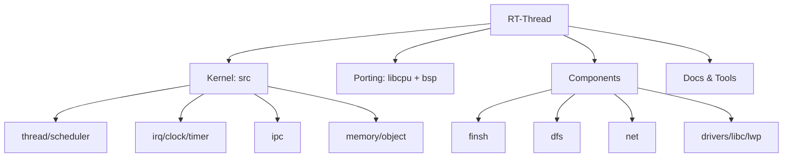

## 大体架构



```text
RT-Thread
├─ Kernel (src)
│  ├─ thread/scheduler
│  ├─ irq/clock/timer
│  ├─ ipc
│  └─ memory/object
├─ Porting
│  ├─ libcpu (架构相关)
│  └─ bsp (板级与驱动)
├─ Components
│  ├─ finsh / dfs / net / drivers / libc / lwp
│  └─ utilities
└─ Build & Docs
   ├─ tools
   └─ documentation
```


## 阅读计划

| Day   | 日期    | 阅读主题                             |
| ----- | ----- | -------------------------------- |
| Day1  | 04-11 | 项目全景：README、目录、架构分层              |
| Day2  | 04-12 | 启动入口：rtthread_startup 主流程        |
| Day3  | 04-13 | 板级初始化：rt_hw_board_init + 自动初始化机制 |
| Day4  | 04-14 | 对象系统：对象类型、生命周期、管理方式              |
| Day5  | 04-15 | 线程基础：创建、启动、挂起、恢复                 |
| Day6  | 04-16 | 周复盘 + 专题深挖：从启动到 main 的完整时序       |
| Day7  | 04-18 | 调度器框架：就绪队列与调度触发点                 |
| Day8  | 04-19 | 抢占细节：优先级、时间片、临界区                 |
| Day9  | 04-20 | 中断机制：中断进入/退出与嵌套                  |
| Day10 | 04-21 | Tick 机制：系统时基如何驱动调度               |
| Day11 | 04-22 | 定时器机制：软/硬定时器与超时处理                |
| Day12 | 04-23 | 周复盘 + 专题深挖：中断上下文与线程上下文切换         |
| Day13 | 04-25 | IPC 总览：信号量/互斥量/事件设计思路            |
| Day14 | 04-26 | 信号量与互斥量：阻塞队列与优先级继承               |
| Day15 | 04-27 | 邮箱与消息队列：通信语义与适用场景                |
| Day16 | 04-28 | 内存体系：小内存/堆/内存池全景                 |
| Day17 | 04-29 | 内存实现细读：分配释放路径与碎片策略               |
| Day18 | 04-30 | 周复盘 + 专题深挖：阻塞-唤醒-再调度闭环           |
| Day19 | 05-02 | 组件层总览：DFS/FinSH/网络/驱动框架          |
| Day20 | 05-03 | FinSH 与 DFS：组件初始化与系统接入           |
| Day21 | 05-04 | 驱动框架入口：设备模型与初始化阶段                |
| Day22 | 05-05 | 跨平台对比：QEMU A9 与 Cortex-M 启动差异    |
| Day23 | 05-06 | 全链路串联：启动→调度→IPC→内存→组件            |
| Day24 | 05-07 | 总复盘：输出最终阅读指南与面试高频题库              |

## IPC模块阅读计划


## 阅读计划


- 每个模块固定走 5 步：
    1. 设计文档：先回答“这个 IPC 机制解决什么问题、适合什么场景、用户 API 怎么用”。
    2. 结构体：看 include/rtdef.h 中对应对象字段，找出资源状态和等待队列。
    3. 生命周期：读 init/create/detach/delete/control，理解静态/动态对象和销毁时如何唤醒等待线程。
    4. 核心行为：读 take/recv/send/release，追踪资源状态、等待队列、线程状态、timeout、schedule。
    5. 考验输出：画 1 张 Mermaid 图，写 30 秒版、2 分钟版、追问版。

## Module Order

- 第 0 站：公共等待队列骨架  
    文档：先回顾 RT-thread源码阅读-v2/06-IPC.md 的“资源状态 + 等待队列”模型。  
    源码：src/ipc.c:82-309，重点看 _ipc_object_init、rt_susp_list_enqueue、rt_susp_list_dequeue、rt_susp_list_resume_all。  
    目标：理解 FIFO/PRIO 等待队列，后面所有 IPC 都复用这个地基。
    
- 第 1 站：Semaphore 信号量  
    文档：documentation/3.kernel/thread-sync 中信号量章节。  
    结构体：include/rtdef.h 的 struct rt_semaphore。  
    源码：src/ipc.c:321-824。  
    目标：建立最小 IPC 模型：计数资源、take 失败挂起、release 唤醒、timeout 返回。
    
- 第 2 站：Mutex 互斥锁  
    文档：documentation/3.kernel/thread-sync 中互斥量章节，重点看优先级反转/优先级继承。  
    结构体：struct rt_mutex。  
    源码：src/ipc.c:826-1746。  
    目标：理解 owner、hold、priority、ceiling priority，以及为什么 mutex 不是二值信号量。
    
- 第 3 站：Event 事件集  
    文档：documentation/3.kernel/thread-sync 中事件章节。  
    结构体：struct rt_event。  
    源码：src/ipc.c:1748-2300。  
    目标：理解事件不是传数据，而是条件位等待；核心是 AND/OR/CLEAR。
    
- 第 4 站：Mailbox 邮箱  
    文档：documentation/3.kernel/thread-comm/thread-comm.md 中邮箱章节。  
    结构体：struct rt_mailbox。  
    源码：src/ipc.c:2302-3047。  
    目标：理解机器字消息、环形槽位、接收等待队列、发送等待队列、urgent 消息。
    
- 第 5 站：MessageQueue 消息队列  
    文档：documentation/3.kernel/thread-comm/thread-comm.md 中消息队列章节。  
    结构体：struct rt_messagequeue。  
    源码：src/ipc.c:3049-4039。  
    目标：理解定长消息块、空闲消息块链表、消息链表、发送/接收等待队列。
    

## Cross-Module Checks

- 每读完一个模块，都回看这些跨模块入口：
    - src/thread.c:945：rt_thread_suspend_to_list，线程如何挂到 IPC 等待队列。
    - src/scheduler_comm.c:229：rt_sched_thread_ready，等待线程如何恢复就绪。
    - src/scheduler_comm.c:401：rt_sched_thread_change_priority，mutex 优先级继承如何落到调度器。
    - src/timer.c：IPC timeout 依赖线程定时器。
    - src/irq.c：判断哪些 IPC API 能在中断上下文使用，哪些不能阻塞。

## Assessment Plan

- 每个模块读完后回答 6 个固定问题：
    - 它的资源状态是什么？
    - 它有哪些等待队列？
    - 哪个 API 会阻塞线程？
    - 哪个 API 会唤醒线程？
    - timeout 怎么接入？
    - 什么情况下会触发 rt_schedule？