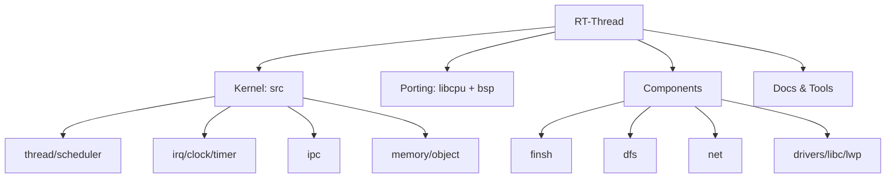

## 大体架构



```text
RT-Thread
├─ Kernel (src)
│  ├─ thread/scheduler
│  ├─ irq/clock/timer
│  ├─ ipc
│  └─ memory/object
├─ Porting
│  ├─ libcpu (架构相关)
│  └─ bsp (板级与驱动)
├─ Components
│  ├─ finsh / dfs / net / drivers / libc / lwp
│  └─ utilities
└─ Build & Docs
   ├─ tools
   └─ documentation
```


## 阅读计划

| Day   | 日期    | 阅读主题                             |
| ----- | ----- | -------------------------------- |
| Day1  | 04-11 | 项目全景：README、目录、架构分层              |
| Day2  | 04-12 | 启动入口：rtthread_startup 主流程        |
| Day3  | 04-13 | 板级初始化：rt_hw_board_init + 自动初始化机制 |
| Day4  | 04-14 | 对象系统：对象类型、生命周期、管理方式              |
| Day5  | 04-15 | 线程基础：创建、启动、挂起、恢复                 |
| Day6  | 04-16 | 周复盘 + 专题深挖：从启动到 main 的完整时序       |
| Day7  | 04-18 | 调度器框架：就绪队列与调度触发点                 |
| Day8  | 04-19 | 抢占细节：优先级、时间片、临界区                 |
| Day9  | 04-20 | 中断机制：中断进入/退出与嵌套                  |
| Day10 | 04-21 | Tick 机制：系统时基如何驱动调度               |
| Day11 | 04-22 | 定时器机制：软/硬定时器与超时处理                |
| Day12 | 04-23 | 周复盘 + 专题深挖：中断上下文与线程上下文切换         |
| Day13 | 04-25 | IPC 总览：信号量/互斥量/事件设计思路            |
| Day14 | 04-26 | 信号量与互斥量：阻塞队列与优先级继承               |
| Day15 | 04-27 | 邮箱与消息队列：通信语义与适用场景                |
| Day16 | 04-28 | 内存体系：小内存/堆/内存池全景                 |
| Day17 | 04-29 | 内存实现细读：分配释放路径与碎片策略               |
| Day18 | 04-30 | 周复盘 + 专题深挖：阻塞-唤醒-再调度闭环           |
| Day19 | 05-02 | 组件层总览：DFS/FinSH/网络/驱动框架          |
| Day20 | 05-03 | FinSH 与 DFS：组件初始化与系统接入           |
| Day21 | 05-04 | 驱动框架入口：设备模型与初始化阶段                |
| Day22 | 05-05 | 跨平台对比：QEMU A9 与 Cortex-M 启动差异    |
| Day23 | 05-06 | 全链路串联：启动→调度→IPC→内存→组件            |
| Day24 | 05-07 | 总复盘：输出最终阅读指南与面试高频题库              |

