---
aliases:
  - MQTT
  - Message Queuing Telemetry Transport
  - ESP-IDF MQTT
  - MQTT 工程化
tags:
  - 物联网
  - ESP32
  - ESP-IDF
  - MQTT
  - 事件循环
  - 状态机
  - 工程化
date: 2026-05-24
status: evergreen
related:
  - "[[WIFI]]"
  - "[[TLS加密协议]]"
  - "[[OTA升级]]"
  - "[[../嵌入式/内存/ESP32/ESP32的系统存储]]"
  - "[[../嵌入式/芯片/架构与指令集/Xtensa LX6 双核架构]]"
---

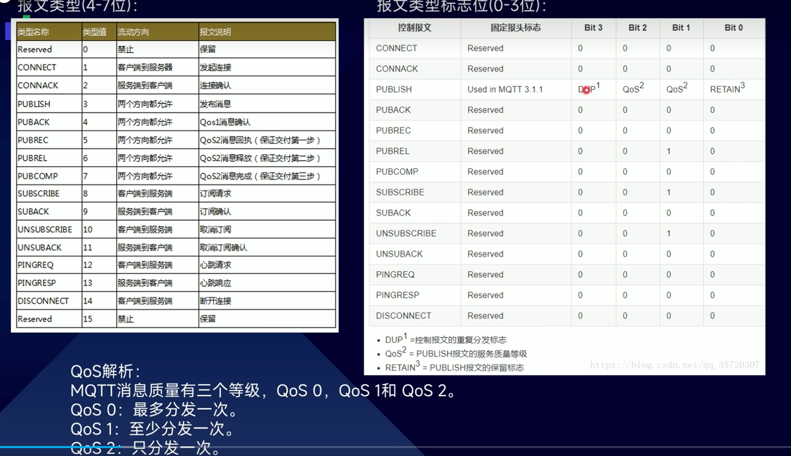

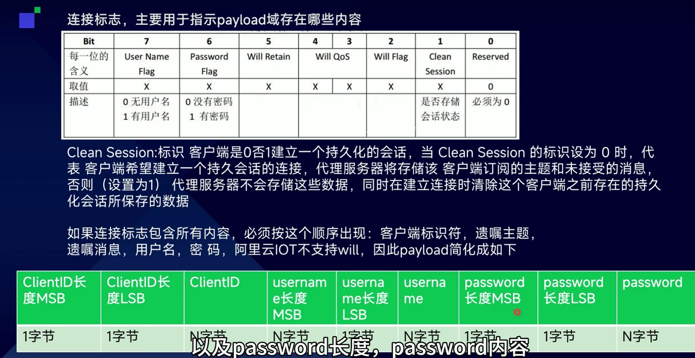

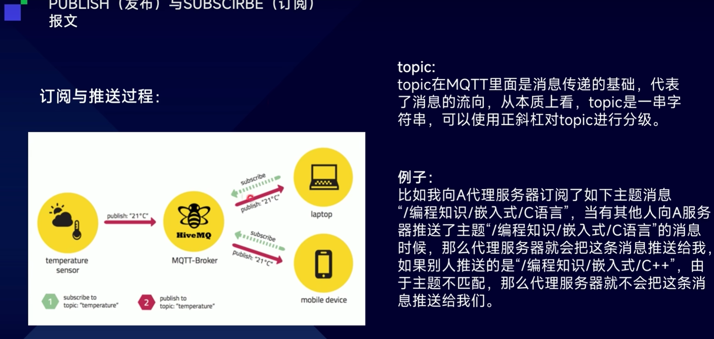

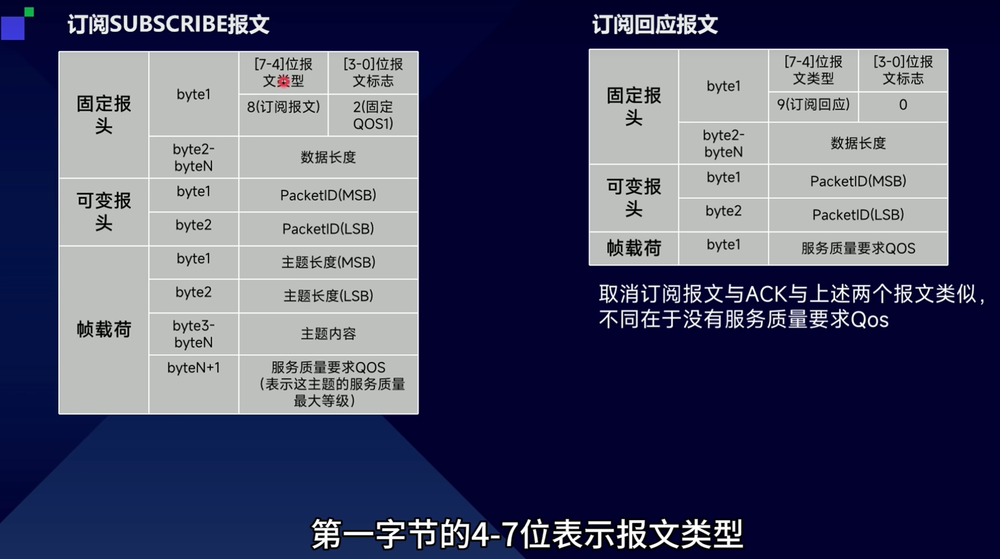

> [!abstract] 核心摘要
> MQTT 是一种**轻量、异步、发布/订阅模式**的消息协议，跑在 TCP 之上，专为资源受限设备和不可靠网络设计。在 ESP32 IoT 工程中，MQTT 不是"调两个 API 就完了"，而是由 **MQTT Client → 事件回调 → 消息分发 → 业务任务** 组成的异步事件驱动系统。理解它的系统位置、事件流、状态机、Topic 设计和工程化演进，是从"能收发消息"到"能做产品"的关键跃迁。本篇覆盖从协议角色到工业化实现的完整链路。

> [!tip] 学习主线
> MQTT 的核心问题是：**在不可靠的网络上，设备怎么和云端可靠地双向通信？**
> 答案链条：**长连接保活 → Broker 中转路由 → QoS 分级送达 → Topic 结构化寻址 → 事件驱动解耦 → 离线缓存兜底**

---

## 1. MQTT 在 IoT 工程中的角色

### 1.1 系统位置：四层依赖栈

```
第1层：Wi-Fi 连接（和路由器握手）     ← 物理链路通了
  ↓ 完成后
第2层：TCP/IP 网络（拿到 IP 地址）    ← 逻辑地址有了
  ↓ 完成后
第3层：MQTT 连接（和 Broker 握手）    ← 消息通道建立
  ↓ 完成后
第4层：应用层业务（上报/控制/OTA）    ← 可以收发数据了
```

> [!important] 严格层层依赖。Wi-Fi 断了 MQTT 必然断；MQTT 没连上，业务不能发消息。详见 [[WIFI]]。

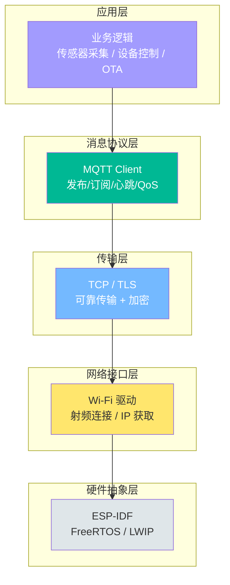

### 1.2 能力边界

MQTT 解决的核心问题：**在不可靠的网络之上，为大量资源受限的设备提供一种轻量、异步、可信赖的消息分发机制。**

注意这句话里每个词都有工程含义：
- **不可靠网络**：Wi-Fi 断连、信号弱、NAT 超时，MQTT 内建了心跳和重连机制来应对
- **资源受限**：ESP32 内存有限，MQTT 头部最小只有 2 字节，比 HTTP 动辄几百字节的头轻得多
- **异步**：你 `publish` 一条消息不需要等对方响应，对方也不需要主动轮询你
- **消息分发**：一个传感器数据可以被云平台、手机 App、数据库同时消费，靠的是 Broker 的路由能力

| MQTT 能做 | MQTT 不做 |
|-----------|----------|
| 设备上报状态/遥测数据 | 不负责数据存储 |
| 云端下发控制指令 | 不负责设备认证（依赖 TLS 证书或用户名密码） |
| 通过 Broker 路由实现设备间间接通信 | 不定义 payload 格式（JSON/Protobuf/二进制都行） |
| 通过 QoS 保证消息送达等级 | 不负责服务发现 |
| 通过遗嘱消息(LWT)通知设备离线 | 不做请求-响应的语义映射（发了不等回复） |

> [!tip] 思考
> 如果你的设备 Wi-Fi 断了 30 秒又恢复了，MQTT 连接会自动恢复吗？你订阅的 topic 还在吗？这 30 秒内设备产生的数据怎么办？——这三个问题分别对应了重连策略、订阅恢复、离线缓存三个工程化能力。

### 1.3 MQTT 与 HTTP 对比

| 维度 | MQTT | HTTP |
|------|------|------|
| 连接模型 | 长连接，一次握手持续通信 | 短连接，每次都要建链 |
| 数据方向 | 双向，Server 可以主动推 | Client 主动，Server 只能被动响应 |
| 头部开销 | 2 字节起 | 数百字节起 |
| 功耗 | 空闲时仅心跳包 | 每次通信完整开销 |
| 消息分发 | 一对多天然支持（Broker 路由） | 需要自己实现 |
| 适用模式 | 状态流、事件流、控制流 | 请求-响应、文件传输 |
| 引入代价 | Broker 中心节点、长连接状态维护 | 无额外基础设施 |

### 1.4 和周边模块的关系

```
┌─────────────────────────────────────────────────┐
│                   云平台                         │
│   AWS IoT Core / 阿里云 IoT / EMQX Cloud        │
│   本质上都是 MQTT Broker + 增值服务              │
└───────────────────────┬─────────────────────────┘
                        │ TCP/TLS
┌───────────────────────▼─────────────────────────┐
│               MQTT Client                        │
│   连接状态是设备整体状态机的一个子状态           │
└───────────────────────┬─────────────────────────┘
                        │ 依赖
┌───────────────────────▼─────────────────────────┐
│           TCP/IP (LWIP)                          │
│   MQTT 是 TCP 的应用层协议                       │
└───────────────────────┬─────────────────────────┘
                        │ 依赖
┌───────────────────────▼─────────────────────────┐
│              Wi-Fi 驱动                          │
│   Wi-Fi 断 → MQTT 必然断 → 业务进入降级模式     │
│   这是一条因果链，详见 [[WIFI]]                  │
└─────────────────────────────────────────────────┘
```

> [!important] 因果链：Wi-Fi 断开 → TCP 断开 → MQTT 断开 → 业务降级。上层无法修复下层的故障，只能等待下层恢复。

---

## 2. ESP-IDF MQTT 组件理解

### 2.1 核心 API 及职责

ESP-IDF 提供的是 `esp_mqtt` 组件，头文件在 `esp_mqtt_client.h`。

| API | 职责 | 调用时机 |
|-----|------|---------|
| `esp_mqtt_client_init(&config)` | 根据配置创建客户端实例，分配资源、注册回调 | **此时还没有网络连接** |
| `esp_mqtt_client_start(client)` | 创建后台 FreeRTOS 任务，发起 TCP→TLS→MQTT CONNECT | **异步**，调用后立即返回 |
| `esp_mqtt_client_stop(client)` | 停止后台任务，断开连接 | 设备休眠/维护时 |
| `esp_mqtt_client_subscribe(client, topic, qos)` | 向 Broker 发送 SUBSCRIBE 报文 | **在 CONNECTED 事件之后** |
| `esp_mqtt_client_publish(client, topic, data, ...)` | 向 Broker 发送 PUBLISH 报文 | 随时（未连接时排队或丢弃） |
| `esp_mqtt_client_register_event(...)` | 注册事件处理回调 | init 之后、start 之前 |
| `esp_mqtt_client_destroy(client)` | 销毁客户端，释放资源 | 设备关机/重配置时 |

### 2.2 esp_mqtt_client_config_t 配置项

这个结构体是一份"蓝图"，**不负责运行时逻辑**：

| 配置项 | 说明 | 典型值 |
|--------|------|--------|
| `broker.uri` | Broker 地址 | `mqtt://broker.emqx.io:1883` |
| `credentials.client_id` | 客户端标识 | `"esp32-device-001"` |
| `credentials.username` | 认证用户名 | 从 NVS 读取 |
| `credentials.authentication.password` | 认证密码 | 从 NVS 读取 |
| `session.last_will` | 遗嘱消息(LWT) | topic + msg + qos + retain |
| `session.disable_clean_session` | 是否持久会话 | `false`（默认清除） |
| `session.keepalive` | 心跳间隔 | 120 秒 |
| `broker.verification.certificate` | TLS CA 证书 | `mqtts://` 时必须提供 |

### 2.3 各 API 职责详解

**`esp_mqtt_client_init(&config)`**

```c
// 只做三件事，不涉及任何网络活动
esp_mqtt_client_config_t cfg = {
    .broker.uri = CONFIG_BROKER_URL,
    .credentials.client_id = "esp32-device-001",
};
esp_mqtt_client_handle_t client = esp_mqtt_client_init(&cfg);
// → 根据配置创建客户端实例
// → 分配内部消息队列、事件循环
// → 此时还没有网络连接
```

**`esp_mqtt_client_start(client)`**

```c
esp_mqtt_client_start(client);
// → 创建后台 FreeRTOS 任务
// → 后台任务发起 TCP 连接 → TLS 握手 → MQTT CONNECT
// → 调用后立即返回，连接在后台进行
// → 连接成功后触发 MQTT_EVENT_CONNECTED
```

**`esp_mqtt_client_subscribe(client, topic, qos)`**

```c
// 必须在收到 MQTT_EVENT_CONNECTED 之后调用
int msg_id = esp_mqtt_client_subscribe(client, "device/001/cmd", 1);
// → 向 Broker 发送 SUBSCRIBE 报文
// → 返回 message_id，用于匹配 MQTT_EVENT_SUBSCRIBED 确认
```

**`esp_mqtt_client_publish(client, topic, data, len, qos, retain)`**

```c
int msg_id = esp_mqtt_client_publish(client, "device/001/tel",
                                      json_data, len, 1, 0);
// → 向 Broker 发送 PUBLISH 报文
// → 未连接时消息会被排队或丢弃（取决于配置）
// → 返回 message_id（QoS > 0）或 -1（失败）
```

### 2.4 事件回调的正确定位

> [!important] 事件回调是薄薄的适配层(adapter)，只做三件事：接收通知、最小路由、转发数据。

```c
static void mqtt_event_handler(void *args, esp_event_base_t base,
                                int32_t event_id, void *event_data)
{
    esp_mqtt_event_handle_t event = event_data;

    switch (event->event_id) {
        case MQTT_EVENT_CONNECTED:
            xEventGroupSetBits(s_mqtt_event_group, MQTT_CONNECTED_BIT);
            break;
        case MQTT_EVENT_DATA:
            xQueueSend(s_inbox_queue, event, pdMS_TO_TICKS(100));
            break;
        case MQTT_EVENT_DISCONNECTED:
            xEventGroupClearBits(s_mqtt_event_group, MQTT_CONNECTED_BIT);
            break;
        default:
            break;
    }
}
```

> [!warning] 回调中绝对不能做的事
> 1. **设备控制逻辑**（如收到开关指令后操作 GPIO）→ 通过队列发给控制任务
> 2. **数据解析和校验**（如 JSON 解析）→ 在独立任务中做
> 3. **耗时操作**（如 OTA 下载、文件写入）→ 回调跑在 MQTT 后台任务里，阻塞会影响心跳
> 4. **重试和错误恢复**→ 由状态机或专门的管理模块处理
>
> 回调在 MQTT 后台任务中执行，如果阻塞超过 keepalive 间隔，Broker 会判定设备离线。

> [!tip] 思考
> 如果你在回调里执行了耗时 5 秒的 JSON 解析代码，MQTT 心跳包（默认 120 秒）会受影响吗？——在心跳周期内通常不会，但如果多个消息同时到达，队列积压 + 回调阻塞叠加，心跳可能超时。保持回调轻薄是工程铁律。

---

## 3. MQTT 连接与事件流

### 3.1 连接建立七阶段

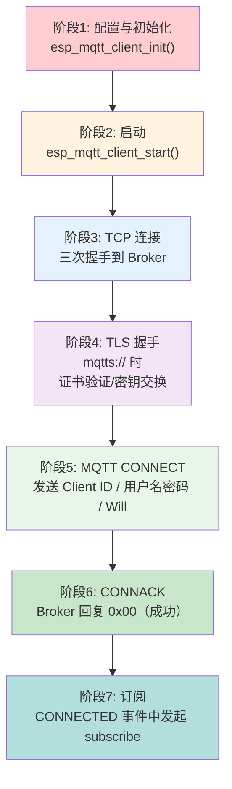

```
esp_mqtt_client_init()     →  分配资源，注册回调（无网络活动）
esp_mqtt_client_start()    →  创建后台任务
  后台任务: TCP 三次握手   →  连接 Broker
  后台任务: TLS 握手       →  证书验证、密钥交换（mqtts://）
  后台任务: MQTT CONNECT   →  发送 CONNECT 报文
  后台任务: 收到 CONNACK   →  触发 MQTT_EVENT_CONNECTED
  你的代码: subscribe      →  Broker 回复 SUBACK
  后台任务: 收到 SUBACK    →  触发 MQTT_EVENT_SUBSCRIBED
```

### 3.2 事件详解

| 事件 | 含义 | 你应该做什么 |
|------|------|-------------|
| `MQTT_EVENT_CONNECTED` | TCP + TLS + MQTT 握手全部成功 | 发起订阅、发布在线状态、恢复业务 |
| `MQTT_EVENT_DISCONNECTED` | 连接断了（网络断、Broker 关闭等） | 标记状态、暂停依赖 MQTT 的业务 |
| `MQTT_EVENT_SUBSCRIBED` | Broker 确认订阅成功 | 可以开始期望收到该 topic 的消息 |
| `MQTT_EVENT_UNSUBSCRIBED` | 取消订阅成功 | 清理相关状态 |
| `MQTT_EVENT_DATA` | 收到一条消息 | 解析 topic + payload，分发给业务 |
| `MQTT_EVENT_ERROR` | 连接过程中出错（TLS 失败等） | 记录错误，可能需要重试或告警 |

> [!important] 和 [[WIFI]] 的状态机类似，MQTT 事件也是层层递进的：CONNECTED 之前不会有 SUBSCRIBED，SUBSCRIBED 之前不会收到 DATA。

### 3.3 消息分发机制

收到下发消息后，工程中有三种常见方式交给业务任务：

**方式一：FreeRTOS Queue（最常用）**

```c
typedef struct {
    char topic[64];
    char payload[256];
    int payload_len;
} mqtt_msg_t;

// 在回调中
case MQTT_EVENT_DATA:
    mqtt_msg_t msg = {0};
    strncpy(msg.topic, event->topic, sizeof(msg.topic) - 1);
    strncpy(msg.payload, event->data, sizeof(msg.payload) - 1);
    msg.payload_len = event->data_len;
    xQueueSend(business_queue, &msg, pdMS_TO_TICKS(100));
    break;
```

**方式二：FreeRTOS Event Group（通知型）**

```c
case MQTT_EVENT_CONNECTED:
    xEventGroupSetBits(app_event_group, MQTT_CONNECTED_BIT);
    break;
```

**方式三：FreeRTOS Task Notification（最轻量）**

```c
// 直接通知特定任务
xTaskNotify(business_task_handle, NEW_DATA_FLAG, eSetBits);
```

| 方式 | 适用场景 | 优势 | 劣势 |
|------|---------|------|------|
| Queue | 需要传递完整数据（topic + payload） | 数据完整、支持多消息缓冲 | 有拷贝开销 |
| EventGroup | 只需要通知状态变化（连接/断开） | 多任务可同时等待 | 只传状态不传数据 |
| TaskNotification | 只需要通知"有新数据" | 开销最小、速度最快 | 只能通知一个任务 |

### 3.4 掉线重连职责归属

> [!important] ESP-IDF 的 MQTT 组件**已经内置了自动重连**，不需要在上层写定时器手动调 `client_start`。

| 职责 | 归属 | 说明 |
|------|------|------|
| TCP 重连 | MQTT 组件内部 | 自动处理 |
| 订阅恢复 | 你的代码 | 重连后在 CONNECTED 事件中重新订阅 |
| 断连期间数据缓存 | 业务层 | 环形缓冲区暂存，重连后回放 |
| 业务状态标记 | 业务层 | 暂停上报、标记设备离线 |

> [!warning] 重连成功后 `MQTT_EVENT_CONNECTED` 会再次触发。如果你不在此时重新订阅 topic，你的订阅就丢了（除非使用持久会话 `disable_clean_session = true` 且 Broker 支持）。

---

## 4. MQTT 状态机

### 4.1 完整状态转换图

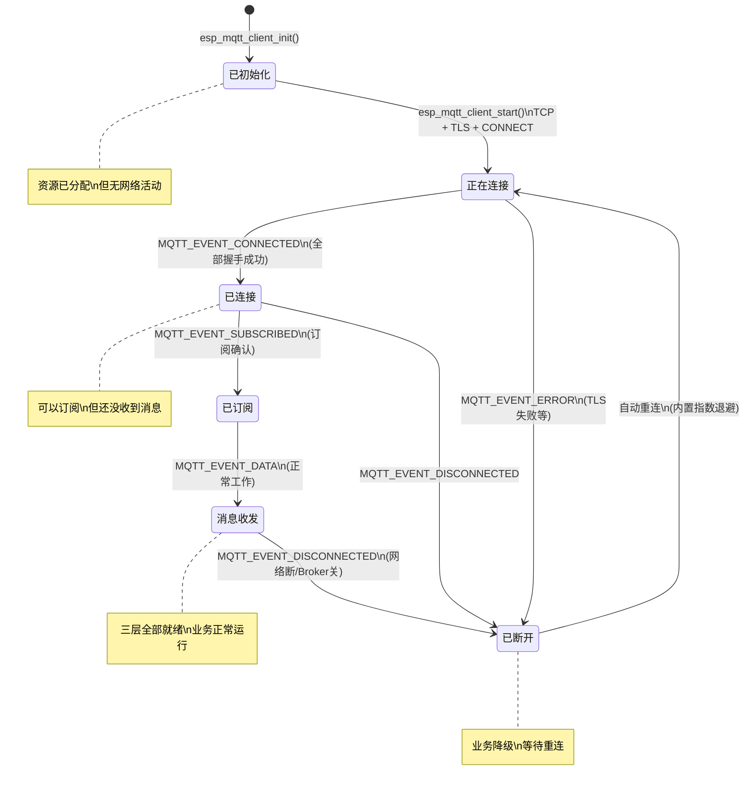

### 4.2 各状态详解

| 状态 | 含义 | 网络活动 | 可执行操作 |
|------|------|---------|-----------|
| **已初始化** | `init()` 完成，资源分配好 | 无 | 可以 `start()`、`register_event()` |
| **正在连接** | `start()` 后，TCP→TLS→CONNECT 进行中 | TCP 握手/TLS/MQTT CONNECT | 无，等待事件 |
| **已连接** | Broker 回复 CONNACK | 已建立长连接 | 可以 `subscribe()`、`publish()` |
| **已订阅** | Broker 确认订阅 | 长连接保活中 | 可以收到 DATA 事件 |
| **消息收发** | 正常工作状态 | 心跳保活 | 随时收发 |
| **已断开** | 连接丢失 | 无 | 等待自动重连、缓存数据 |

### 4.3 多业务模块消息分发架构

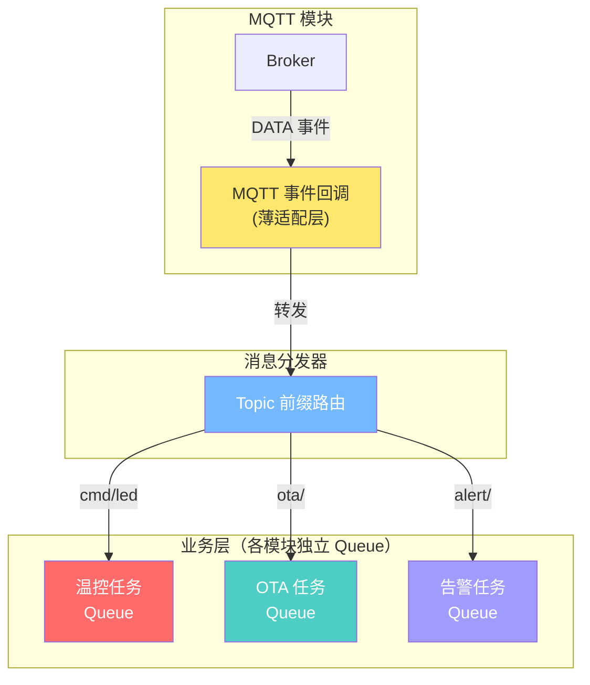

> [!tip] 思考
> 如果温度控制模块处理消息很慢（200ms），而告警模块需要快速响应（<10ms），它们共享同一个队列会有什么问题？——温控的慢消息会阻塞告警的紧急消息。这和 FreeRTOS 里"优先级反转"的概念一致。解决方案：每个业务独立队列，或者使用优先级队列。

---

## 5. Topic 设计

### 5.1 上报与下发的区分

```
上报（设备 → 云）:  通常用 telemetry、status、event 等
下发（云 → 设备）:  通常用 cmd、config、request 等
```

一种常见的约定：

```
上报:  {namespace}/{device_id}/telemetry      ← 设备主动上报传感器数据
上报:  {namespace}/{device_id}/status          ← 设备上报在线/运行状态
上报:  {namespace}/{device_id}/event           ← 设备上报告警/异常事件

下发:  {namespace}/{device_id}/cmd             ← 云端下发控制命令
下发:  {namespace}/{device_id}/config          ← 云端下发配置更新
下发:  {namespace}/{device_id}/ota/url         ← 云端下发 OTA 地址
```

### 5.2 按消息类型分类

| 消息类型 | Topic 示例 | QoS | Retain | 频率 | 说明 |
|---------|-----------|-----|--------|------|------|
| 遥测数据 | `dev/001/tel` | 0 或 1 | 否 | 高（秒级） | 温湿度、PM2.5 等，丢几条无所谓 |
| 设备状态 | `dev/001/status` | 1 | **是** | 低（变化时） | 在线/离线，Retain 让新订阅者立刻拿到 |
| 控制命令 | `dev/001/cmd` | 1 | 否 | 随机 | 开关、调速，必须送达 |
| 配置同步 | `dev/001/config` | 1 | **是** | 极低 | 采样间隔、告警阈值 |
| 告警消息 | `dev/001/alert` | 1 或 2 | 否 | 随机 | 温度超标，不能丢 |

> [!important] Retain 的含义：Broker 保存这条消息的最新值，新订阅者立刻收到一次。适合设备状态和配置——设备上线后立刻知道自己上次的配置是什么。

### 5.3 Demo 通常省略了什么

> [!warning] 教学 Demo 的 Topic 设计缺陷

| 省略项 | Demo 做法 | 工程后果 |
|--------|---------|---------|
| 无 namespace 前缀 | 直接用 `test/topic` | 和其他项目的 topic 冲突 |
| 无 device_id | 单设备不需要 | 多设备时消息混乱 |
| 无消息类型区分 | 所有东西往一个 topic 发 | 无法做权限控制、无法过滤 |
| 无通配符设计 | 不考虑 `#` `+` | 云平台无法批量订阅所有设备 |
| 无版本号 | payload 格式随意 | 格式变更后消费者不知道怎么解析 |

### 5.4 单设备 → 多设备 → 多租户演进

```mermaid
flowchart LR
    subgraph S1["单设备 Demo"]
        A1["test/temperature"]
        A2["test/led"]
    end

    subgraph S2["多设备"]
        B1["factory/{device_id}/telemetry"]
        B2["factory/{device_id}/status"]
        B3["factory/{device_id}/cmd"]
        B4["factory/{device_id}/config"]
    end

    subgraph S3["多租户"]
        C1["{tenant_id}/{device_type}/{device_id}/telemetry"]
        C2["{tenant_id}/{device_type}/{device_id}/status"]
        C3["{tenant_id}/{device_type}/{device_id}/cmd"]
    end

    S1 -->|"加 device_id"| S2
    S2 -->|"加 tenant_id + type"| S3

    style S1 fill:#ffebee
    style S2 fill:#e8f5e9
    style S3 fill:#e3f2fd
```

多租户下的通配符订阅能力：

```
factory/+/telemetry          → 订阅所有设备的遥测
factory/device001/#          → 订阅某设备的所有消息
tenantA/+/+/cmd              → 租户 A 所有设备的命令
```

### 5.5 典型 ESP32 设备 Topic 设计示例

```
home/envmonitor/{device_id}/tel          QoS0  温湿度、PM2.5 遥测上报
home/envmonitor/{device_id}/status       QoS1  Retain  设备在线状态
home/envmonitor/{device_id}/cmd          QoS1  云端下发控制（风扇开关等）
home/envmonitor/{device_id}/config       QoS1  Retain  采样间隔、告警阈值
home/envmonitor/{device_id}/alert        QoS1  温度超标等告警
home/envmonitor/{device_id}/ota          QoS1  OTA 更新通知
home/envmonitor/{device_id}/ack          QoS1  设备确认收到命令
```

> [!tip] 思考
> 如果把遥测数据和告警数据都发到同一个 topic，云端消费者怎么区分？如果告警需要 QoS 2 而遥测只要 QoS 0，同一个 topic 能设不同 QoS 吗？——答案是同一个 topic 只能有一个 QoS 级别，所以不同重要程度的消息必须分 topic。

---

## 6. 最小工程结构

### 6.1 文件职责划分

```
project/
├── main/
│   ├── app_main.c              ← 指挥官：初始化 + 启动任务
│   ├── wifi_manager.h/.c       ← Wi-Fi 管理：连接、重连、状态维护
│   ├── mqtt_manager.h/.c       ← MQTT 管理：连接、事件、消息分发
│   ├── business_task.h/.c      ← 业务逻辑：传感器、控制
│   └── topic_config.h          ← Topic 定义集中管理
└── sdkconfig
```

| 文件 | 职责 | 不应该做的事 |
|------|------|-------------|
| `app_main.c` | 初始化各模块 + 启动 FreeRTOS 任务 | 不包含业务逻辑，不超过 30 行 |
| `wifi_manager.c` | 连接、重连、状态维护、从 NVS 读配置 | 不知道 MQTT 的存在 |
| `mqtt_manager.c` | MQTT 连接、事件分发、封装 publish 接口 | 不直接操作 Wi-Fi，不做 JSON 解析 |
| `business_task.c` | 传感器采集、GPIO 控制、数据处理 | 不知道 MQTT client 的存在 |
| `topic_config.h` | 集中定义所有 topic 名称和前缀 | 不包含逻辑代码 |

### 6.2 模块接口设计

**最小工程只需要这几个接口：**

| 模块 | 接口 | 说明 |
|------|------|------|
| wifi_manager | `wifi_manager_init()` | `app_main()` 调一次，完成全部 9 步初始化 |
| wifi_manager | `wifi_manager_is_connected()` | 业务任务查询网络状态 |
| mqtt_manager | `mqtt_manager_init()` | 创建 client、注册回调（不连接） |
| mqtt_manager | `mqtt_manager_start()` | 等待 Wi-Fi 就绪后启动连接 |
| mqtt_manager | `mqtt_manager_publish(topic, data, len)` | 业务层发布消息的唯一入口 |

### 6.3 app_main() 示例

```c
void app_main(void)
{
    // 1. 初始化 NVS
    esp_err_t ret = nvs_flash_init();
    if (ret == ESP_ERR_NVS_NO_FREE_PAGES ||
        ret == ESP_ERR_NVS_NEW_VERSION_FOUND) {
        nvs_flash_erase();
        nvs_flash_init();
    }

    // 2. 创建同步对象
    app_event_group = xEventGroupCreate();
    msg_queue = xQueueCreate(10, sizeof(mqtt_msg_t));

    // 3. 启动 Wi-Fi
    wifi_manager_init();

    // 4. 启动 MQTT（内部等待 Wi-Fi 就绪）
    mqtt_manager_init();
    xTaskCreate(mqtt_manager_start_task, "mqtt_start", 4096, NULL, 3, NULL);

    // 5. 创建业务任务
    xTaskCreate(business_task, "business", 4096, NULL, 5, NULL);
}
```

### 6.4 mqtt_manager_init() 内部

```c
static esp_mqtt_client_handle_t s_client = NULL;
static const char *TAG = "mqtt_manager";

void mqtt_manager_init(void)
{
    // 1. 组装配置
    esp_mqtt_client_config_t cfg = {
        .broker.uri = CONFIG_BROKER_URL,
        .credentials.client_id = "esp32-device-001",
        .session.keepalive = 60,
        .session.last_will = {
            .topic = TOPIC_STATUS,
            .msg = "offline",
            .qos = 1,
            .retain = true,
        },
    };

    // 2. 创建客户端（不启动，不连接）
    s_client = esp_mqtt_client_init(&cfg);

    // 3. 注册事件回调
    esp_mqtt_client_register_event(s_client,
        ESP_EVENT_ANY_ID, mqtt_event_handler, NULL);
}
```

> [!important] `init` 和 `start` 是分开的。`init` 只创建对象，`start` 才发起连接。这让你可以灵活控制启动时机——必须等 [[WIFI]] 就绪。

### 6.5 Wi-Fi 与 MQTT 衔接

**关键问题：MQTT 不能在 Wi-Fi 未连接时启动。**

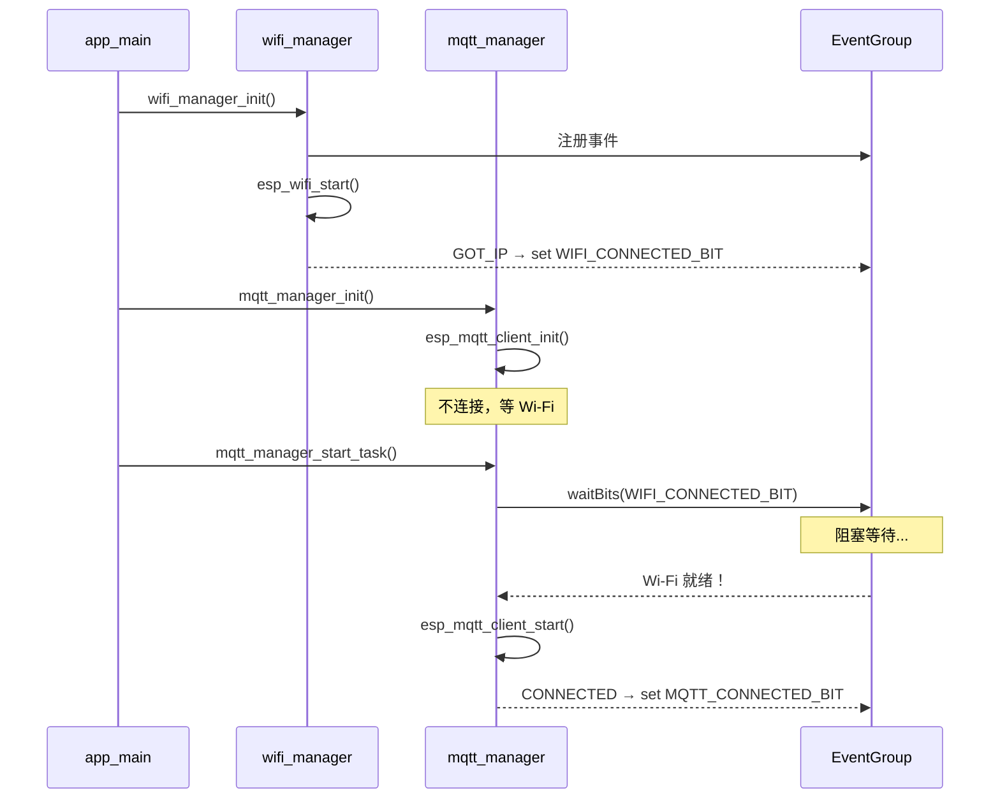

EventGroup 实现模块间零耦合：

```c
// 全局 EventGroup（在 app_main.c 中创建）
EventGroupHandle_t app_event_group;
#define WIFI_CONNECTED_BIT  BIT0
#define GOT_IP_BIT          BIT1
#define MQTT_CONNECTED_BIT  BIT2

// Wi-Fi 回调：连上设 Bit0 + Bit1
// MQTT 回调：连上设 Bit2，断开清 Bit2
// 业务任务：等待全部就绪
```

### 6.6 消息订阅/发布层次

```
┌───────────────────────────────────────────┐
│           business_task.c                  │
│                                           │
│  - 传感器采集 → mqtt_manager_publish()     │  ← 发布在业务层
│  - 收到控制指令 → 操作 GPIO               │  ← 处理在业务层
│                                           │
├───────────────────────────────────────────┤
│           mqtt_manager.c                  │
│                                           │
│  - 封装 publish 接口                       │  ← 对业务暴露简单 API
│  - 事件回调 → Queue → 通知业务层          │  ← 订阅消息向上传递
│  - 连接/断连状态管理                       │
│                                           │
├───────────────────────────────────────────┤
│           wifi_manager.c                  │
│                                           │
│  - Wi-Fi 连接/断连管理                    │
│  - 通知上层网络就绪状态                    │
│                                           │
├───────────────────────────────────────────┤
│           app_main.c                      │
│                                           │
│  - 初始化所有模块                          │
│  - 启动任务                                │
│                                           │
└───────────────────────────────────────────┘
```

### 6.7 多 Topic 设计与分发

在 `topic_config.h` 中集中管理：

```c
// topic_config.h — 集中管理，改设备 ID 只改一处
#define DEVICE_ID           "001"
#define NAMESPACE           "home/envmonitor"

#define TOPIC_TELEMETRY     NAMESPACE "/" DEVICE_ID "/tel"
#define TOPIC_STATUS        NAMESPACE "/" DEVICE_ID "/status"
#define TOPIC_CMD_PREFIX    NAMESPACE "/" DEVICE_ID "/cmd/"
#define TOPIC_CONFIG        NAMESPACE "/" DEVICE_ID "/config"
#define TOPIC_ALERT         NAMESPACE "/" DEVICE_ID "/alert"
#define TOPIC_OTA           NAMESPACE "/" DEVICE_ID "/ota"
```

在 CONNECTED 事件中统一订阅：

```c
static void subscribe_all_topics(esp_mqtt_client_handle_t client)
{
    esp_mqtt_client_subscribe(client, TOPIC_CMD_PREFIX "#", 1);
    esp_mqtt_client_subscribe(client, TOPIC_OTA, 1);
    esp_mqtt_client_subscribe(client, TOPIC_CONFIG, 1);
}
```

收到 DATA 事件时根据 topic 前缀分发：

```c
case MQTT_EVENT_DATA:
    if (strncmp(event->topic, TOPIC_CMD_PREFIX, strlen(TOPIC_CMD_PREFIX)) == 0) {
        // 路由到命令处理队列
    } else if (strcmp(event->topic, TOPIC_OTA) == 0) {
        // 路由到 OTA 任务
    } else if (strcmp(event->topic, TOPIC_CONFIG) == 0) {
        // 路由到配置更新逻辑
    }
    break;
```

> [!tip] 思考
> 如果 topic 名字硬编码散落在各个 `.c` 文件里，当你的设备 ID 从 `"001"` 变成从 NVS 读取时，你要改多少个文件？集中管理 topic 的成本只是一个头文件，收益是改一处全局生效。

---

## 7. 从 Demo 到工业化

### 7.1 教学 Demo 的典型特征

```c
// 典型教学 Demo：能收发消息，但距离产品很远
static void mqtt_event_handler(void *arg, esp_event_base_t base,
                                int32_t id, void *data) {
    if (id == MQTT_EVENT_CONNECTED) {
        esp_mqtt_client_subscribe(client, "test/topic", 0);  // 硬编码 topic
    } else if (id == MQTT_EVENT_DATA) {
        printf("Got: %.*s\n", event->data_len, event->data); // 直接 printf
        gpio_set_level(LED_GPIO, 1);                          // 回调里直接操作 GPIO
        cJSON *root = cJSON_Parse(event->data);               // 回调里做 JSON 解析
        // ... 200 行业务逻辑塞在回调里
    }
}

void app_main(void) {
    wifi_init();   // 所有代码一个文件
    esp_mqtt_client_config_t cfg = {
        .broker.uri = "mqtt://broker.emqx.io:1883",  // 硬编码 URI
    };
    client = esp_mqtt_client_init(&cfg);
    esp_mqtt_client_register_event(client, ESP_EVENT_ANY_ID, mqtt_event_handler, NULL);
    esp_mqtt_client_start(client);                    // 不管 Wi-Fi 是否连上
}
```

### 7.2 十个维度的差距分析

| 维度 | 教学 Demo | 工业化实现 |
|------|-----------|-----------|
| **重连与会话恢复** | 依赖默认行为，无控制 | `clean_session=0` + 重连后自动重新订阅 + 指数退避 |
| **心跳与在线状态** | 无遗嘱消息(LWT) | LWT 配置 + 主动发布 online 状态 + 心跳间隔调优 |
| **QoS 取舍** | 全部用 QoS 0 | 遥测 QoS0、命令 QoS1、告警 QoS1，几乎不用 QoS2 |
| **订阅恢复** | 重连后不重新订阅 | CONNECTED 事件中遍历订阅列表 |
| **离线缓存** | 断网直接丢弃数据 | 环形缓冲区暂存 + 重连后回放 + FIFO 满策略 |
| **消息去重** | 不处理 | QoS1 的 payload 加 msg_id/timestamp，60 秒窗口去重 |
| **异常日志** | 只有 `printf` | CONNACK 原因码 + TLS 错误详情 + 发送队列满告警 + 关键指标统计 |
| **配置与证书** | URI 硬编码 | NVS 读 URI + TLS 证书嵌入 + 证书过期检测 + 多环境配置 |
| **与业务解耦** | 回调里做所有事 | Queue + EventGroup 分发，MQTT 模块不知道业务逻辑 |
| **安全性** | `mqtt://` 明文 | `mqtts://` TLS1.2+ + mTLS 双向认证 + Topic ACL |

### 7.3 演进路线

```mermaid
flowchart LR
    subgraph Stage1["Stage 1：能收发"]
        S1["硬编码 URI/Topic"]
        S2["回调里做所有事"]
        S3["无重连/无日志"]
        S4["全部 QoS 0"]
    end

    subgraph Stage2["Stage 2：能重连"]
        S5["CONNECTED 后重新订阅"]
        S6["LWT 遗嘱消息"]
        S7["按消息类型选 QoS"]
        S8["Topic 结构化设计"]
    end

    subgraph Stage3["Stage 3：能容错"]
        S9["离线环形缓存"]
        S10["消息去重"]
        S11["CONNACK 原因码分析"]
        S12["TLS 证书管理"]
    end

    subgraph Stage4["Stage 4：能协作"]
        S13["mqtt_manager 模块化"]
        S14["Queue + EventGroup 解耦"]
        S15["NVS 配置持久化"]
        S16["关键指标上报服务器"]
    end

    Stage1 --> Stage2 --> Stage3 --> Stage4

    style Stage1 fill:#ffebee
    style Stage2 fill:#fff3e0
    style Stage3 fill:#e3f2fd
    style Stage4 fill:#e8f5e9
```

#### Stage 1：能收发（教学 Demo）

- 硬编码 Broker URI 和 Topic
- 所有代码在一个文件，回调里做所有事
- 无重连策略、无日志、无错误处理
- **能跑通，但完全不能用于产品**

#### Stage 2：能重连

- CONNECTED 事件中重新订阅所有 topic
- 配置 LWT 遗嘱消息
- 按消息类型选择 QoS 等级
- Topic 结构化设计（namespace + device_id + type）

#### Stage 3：能容错

- 离线环形缓冲区，重连后回放
- QoS 1 消息去重（payload 加 timestamp）
- CONNACK 原因码分析，分类处理连接失败
- TLS 证书管理、过期检测

#### Stage 4：能协作

- `mqtt_manager.c` 独立模块，对外暴露 `init()` + `publish()` + `is_connected()`
- Queue + EventGroup 实现模块间零耦合
- Broker URI 从 NVS 读取
- 关键指标（发送成功率、平均延迟、重连次数）上报服务器

### 7.4 工程化 mqtt_manager 代码框架

```c
// mqtt_manager.h
typedef enum {
    MQTT_STATE_IDLE,
    MQTT_STATE_CONNECTING,
    MQTT_STATE_CONNECTED,
    MQTT_STATE_SUBSCRIBED,
    MQTT_STATE_DISCONNECTED,
    MQTT_STATE_ERROR,
} mqtt_state_t;

typedef void (*mqtt_state_cb_t)(mqtt_state_t state);
typedef void (*mqtt_msg_cb_t)(const char *topic, const char *data, int len);

void mqtt_manager_init(void);
void mqtt_manager_start(void);
bool mqtt_manager_is_connected(void);
mqtt_state_t mqtt_manager_get_state(void);
int mqtt_manager_publish(const char *topic, const char *data, int len, int qos, bool retain);
void mqtt_manager_register_state_cb(mqtt_state_cb_t cb);
void mqtt_manager_register_msg_cb(const char *topic_prefix, mqtt_msg_cb_t cb);
```

```c
// mqtt_manager.c
static const char *TAG = "mqtt_manager";
static esp_mqtt_client_handle_t s_client = NULL;
static mqtt_state_t s_state = MQTT_STATE_IDLE;
static EventGroupHandle_t s_event_group;
static mqtt_state_cb_t s_state_cb = NULL;

#define MQTT_CONNECTED_BIT  BIT0

static void set_state(mqtt_state_t new_state) {
    if (s_state != new_state) {
        ESP_LOGI(TAG, "State: %d → %d", s_state, new_state);
        s_state = new_state;
        if (s_state_cb) s_state_cb(new_state);
    }
}

static void subscribe_all_topics(esp_mqtt_client_handle_t client) {
    esp_mqtt_client_subscribe(client, TOPIC_CMD_PREFIX "#", 1);
    esp_mqtt_client_subscribe(client, TOPIC_OTA, 1);
    esp_mqtt_client_subscribe(client, TOPIC_CONFIG, 1);
    ESP_LOGI(TAG, "All topics subscribed");
}

static void mqtt_event_handler(void *args, esp_event_base_t base,
                                int32_t event_id, void *event_data) {
    esp_mqtt_event_handle_t event = event_data;

    switch (event->event_id) {
    case MQTT_EVENT_CONNECTED:
        ESP_LOGI(TAG, "MQTT connected");
        xEventGroupSetBits(s_event_group, MQTT_CONNECTED_BIT);
        set_state(MQTT_STATE_CONNECTED);
        subscribe_all_topics(event->client);
        // 发布在线状态
        esp_mqtt_client_publish(event->client, TOPIC_STATUS, "online", 0, 1, 1);
        set_state(MQTT_STATE_SUBSCRIBED);
        break;

    case MQTT_EVENT_DISCONNECTED:
        ESP_LOGW(TAG, "MQTT disconnected");
        xEventGroupClearBits(s_event_group, MQTT_CONNECTED_BIT);
        set_state(MQTT_STATE_DISCONNECTED);
        break;

    case MQTT_EVENT_DATA:
        // 薄适配层：只做路由转发，不做业务逻辑
        ESP_LOGI(TAG, "Topic: %.*s, Data: %.*s",
                 event->topic_len, event->topic,
                 event->data_len, event->data);
        // TODO: 根据 topic 前缀分发到业务队列
        break;

    case MQTT_EVENT_ERROR:
        ESP_LOGE(TAG, "MQTT error");
        set_state(MQTT_STATE_ERROR);
        break;

    default:
        break;
    }
}

void mqtt_manager_init(void) {
    s_event_group = xEventGroupCreate();

    esp_mqtt_client_config_t cfg = {
        .broker.uri = CONFIG_BROKER_URL,
        .credentials.client_id = "esp32-" DEVICE_ID,
        .session.keepalive = 60,
        .session.last_will = {
            .topic = TOPIC_STATUS,
            .msg = "offline",
            .qos = 1,
            .retain = true,
        },
    };

    s_client = esp_mqtt_client_init(&cfg);
    esp_mqtt_client_register_event(s_client, ESP_EVENT_ANY_ID,
                                    mqtt_event_handler, NULL);
    ESP_LOGI(TAG, "MQTT client initialized");
}

void mqtt_manager_start(void) {
    // 等 Wi-Fi 就绪
    EventBits_t bits = xEventGroupWaitBits(
        s_event_group,
        WIFI_CONNECTED_BIT,
        pdFALSE, pdTRUE, portMAX_DELAY
    );

    ESP_LOGI(TAG, "Starting MQTT client...");
    esp_mqtt_client_start(s_client);
    set_state(MQTT_STATE_CONNECTING);
}

bool mqtt_manager_is_connected(void) {
    EventBits_t bits = xEventGroupGetBits(s_event_group);
    return (bits & MQTT_CONNECTED_BIT) != 0;
}

mqtt_state_t mqtt_manager_get_state(void) {
    return s_state;
}

int mqtt_manager_publish(const char *topic, const char *data,
                          int len, int qos, bool retain) {
    if (!mqtt_manager_is_connected()) {
        ESP_LOGW(TAG, "Not connected, publish dropped");
        return -1;
    }
    return esp_mqtt_client_publish(s_client, topic, data, len, qos, retain);
}

void mqtt_manager_register_state_cb(mqtt_state_cb_t cb) {
    s_state_cb = cb;
}
```

```c
// app_main.c
void app_main(void) {
    // NVS 初始化
    nvs_flash_init();

    // 创建同步对象
    app_event_group = xEventGroupCreate();

    // 启动 Wi-Fi（详见 WIFI.md）
    wifi_manager_init();

    // 启动 MQTT
    mqtt_manager_init();
    mqtt_manager_start();  // 内部阻塞等 Wi-Fi 就绪

    // 启动业务任务
    xTaskCreate(business_task, "business", 4096, NULL, 5, NULL);
}
```

---

## 8. MQTT 与 HTTP 的工程取舍

### 8.1 场景 → 协议选择 → 工程原因

| 场景 | 协议选择 | 工程原因 |
|------|---------|---------|
| 设备每 5 秒上报温度 | **MQTT** | 长连接免重复建链；头部 2B vs HTTP 数百 B；Broker 一对多分发 |
| 下载 500KB 固件文件 | **HTTP** | 大文件 HTTP 更成熟（分块/断点续传）；Broker 内存压力大；CDN 原生支持 HTTP |
| 手机 App 远程控制开关 | **MQTT** | 实时性 <1s；手机可订阅设备状态 topic；HTTP 轮询延迟高 |
| 设备首次配网注册 | **HTTP** | 典型请求-响应模式；需返回设备 ID/密钥；只执行一次 |
| 设备状态实时推送 | **MQTT** | Broker 主动推，不需要轮询；多客户端同时订阅 |
| 天气/时间服务查询 | **HTTP** | 第三方 RESTful API；不要求实时；低频调用 |

### 8.2 为什么很多设备两者并存

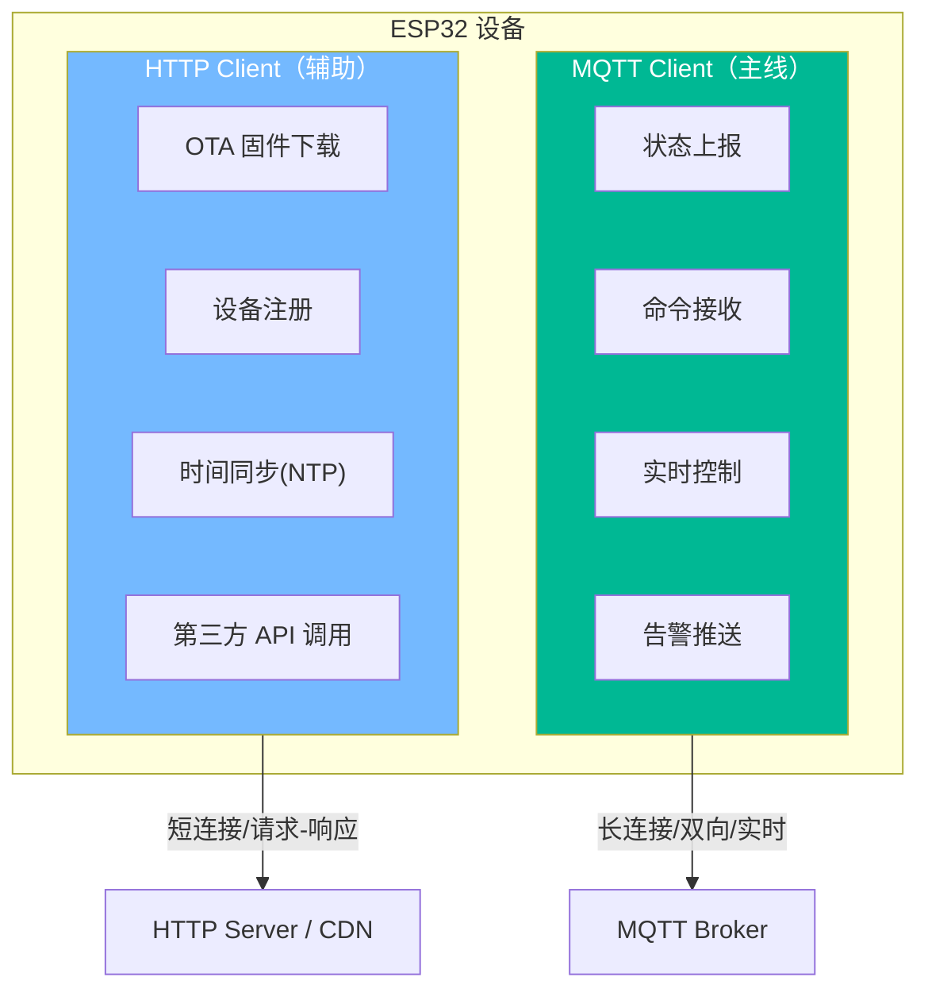

### 8.3 MQTT 是主线的原因

| 维度 | MQTT 主线 | HTTP 辅助 |
|------|----------|----------|
| 连接 | 始终保持 | 按需建立 |
| 数据方向 | 双向 | 客户端发起 |
| 消息大小 | 小（<1KB） | 可以很大 |
| 频率 | 高（秒级） | 低（按需） |
| 实时性 | 高 | 低 |

对于"设备联网、远程控制、状态上报"这个核心场景：

1. **联网**：MQTT 长连接本身就意味着"设备在线"，LWT 机制自动管理在线状态
2. **远程控制**：MQTT 的 pub/sub 天然支持云端主动推送命令，延迟低
3. **状态上报**：MQTT 轻量头部适合高频小数据，一对多分发让多个后端服务同时消费

---

## 9. 知识体系总图

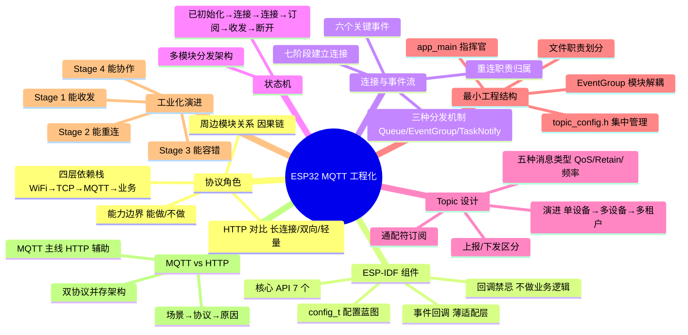

---

## 关键概念速查

| 概念 | 说明 |
|------|------|
| **MQTT** | 轻量级发布/订阅消息协议，跑在 TCP 之上，专为 IoT 设计 |
| **Broker** | MQTT 消息中间件，负责接收/路由/分发消息（如 EMQX、Mosquitto） |
| **Publish/Subscribe** | 发布者不直接发给接收者，通过 Broker 和 Topic 解耦 |
| **Topic** | 消息寻址路径，用 `/` 分层，支持 `#`（多级）和 `+`（单级）通配符 |
| **QoS 0** | 最多一次，发完不管，适合高频遥测 |
| **QoS 1** | 至少一次，可能重复，适合命令和告警 |
| **QoS 2** | 恰好一次，4 次握手，性能差，几乎不用 |
| **Retain** | Broker 保留最新消息，新订阅者立刻收到一次 |
| **LWT (Last Will)** | 遗嘱消息，设备异常断开时 Broker 自动发布 |
| **Clean Session** | 清除会话，重连后不恢复之前的订阅和消息 |
| **esp_mqtt_client_init()** | 创建客户端实例，分配资源，不发起连接 |
| **esp_mqtt_client_start()** | 启动后台任务，异步发起 TCP→TLS→MQTT CONNECT |
| **MQTT_EVENT_CONNECTED** | 连接成功事件，此时才能订阅和发布 |
| **MQTT_EVENT_DATA** | 收到消息事件，需通过 Queue 转发给业务任务 |
| **EventGroup** | FreeRTOS 事件组，模块间状态同步，零耦合 |
| **mqtt_manager** | 封装 MQTT 管理的独立模块，对外暴露 init/publish/is_connected |

---

## 面试高频问题

> [!example]- Q1：MQTT 相比 HTTP 为什么更适合 IoT 设备通信？
> 四个核心优势：(1) 长连接避免重复建链开销，适合高频小数据；(2) 双向通信，Broker 可主动推消息给设备，无需轮询；(3) 头部最小 2 字节 vs HTTP 数百字节，节省带宽和功耗；(4) 一对多分发天然支持，一个传感器数据可被多个消费者订阅。代价是需要引入 Broker 中心节点。

> [!example]- Q2：MQTT 事件回调里为什么不能做业务逻辑？
> 回调跑在 MQTT 后台任务中执行。如果阻塞超过 keepalive 间隔（默认 120s，但消息积压时会更早触发），Broker 会判定设备离线断开连接。即使不超时，阻塞也会影响后续消息的收发和心跳。正确做法：回调只做路由转发（Queue/EventGroup/TaskNotification），业务逻辑在独立任务中处理。

> [!example]- Q3：设备 Wi-Fi 断了又恢复，MQTT 需要做什么？
> Wi-Fi 断 → MQTT 必然断（因果链）。恢复后：(1) MQTT 组件内置自动重连，TCP→MQTT CONNECT 会自动执行；(2) 重连成功触发 `MQTT_EVENT_CONNECTED`，必须在这里重新订阅所有 topic（除非使用持久会话）；(3) 断连期间的数据如果做了离线缓存，需要按时间顺序回放；(4) 发布 online 状态通知云端设备恢复。

> [!example]- Q4：QoS 0/1/2 在工程中怎么选？
> 90% 的场景用 QoS 0 或 1。QoS 0 适合高频遥测（丢几条无所谓）；QoS 1 适合命令、告警、重要状态（至少送达一次，但需自行去重）；QoS 2 几乎不用（4 次握手性能差）。关键判断：这条消息丢了会不会影响设备控制或安全？不影响就用 0，影响就用 1。

> [!example]- Q5：Topic 设计不合理的后果是什么？
> (1) 无 device_id → 无法做多设备权限隔离；(2) 无 namespace → 多项目 topic 冲突；(3) 混用一个 topic → 无法按消息类型设不同 QoS；(4) 不支持通配符 → 云平台无法批量订阅 `+/telemetry`；(5) 无版本号 → payload 格式变更后消费者崩溃。Topic 设计是系统级的，后期改造成本极高。

> [!example]- Q6：教学 Demo 到工业化 MQTT 模块的核心差距是什么？
> 十个维度：(1) 无会话恢复；(2) 无 LWT 遗嘱消息；(3) QoS 全 0；(4) 重连后不重新订阅；(5) 断网直接丢数据；(6) 无消息去重；(7) 无异常日志；(8) URI 硬编码；(9) 回调里做所有事；(10) 明文传输。核心是从"能收发消息"到"能容错、能协作、能安全、能量产"。

---

## 踩坑记录

> [!bug] 实战经验填充区
> （项目开发中遇到的 MQTT 相关问题记录于此）

---

## 继续阅读

- [[WIFI]] — MQTT 的底层依赖，Wi-Fi 连接管理与事件循环
- [[../嵌入式/内存/ESP32/ESP32的系统存储]] — NVS 存储、Broker URI 持久化、证书管理
- [[../嵌入式/芯片/架构与指令集/Xtensa LX6 双核架构]] — 双核架构、CPU0 Protocol Core、事件循环所在核心
- [[../嵌入式/操作系统与内核/01_通用理论/Bootloader]] — ESP32 启动流程与 Bootloader
