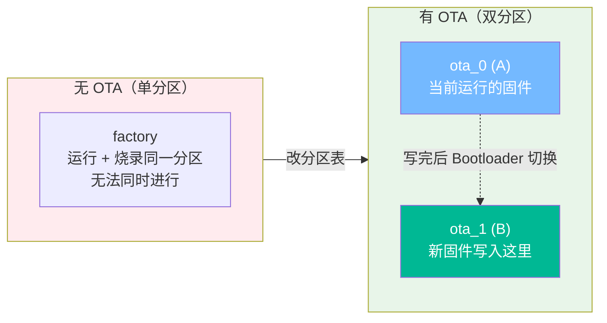
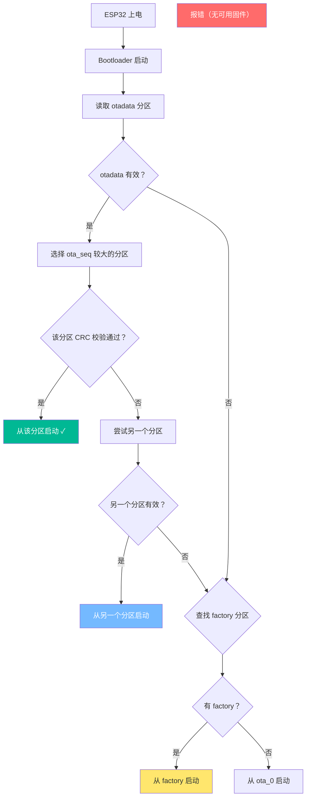
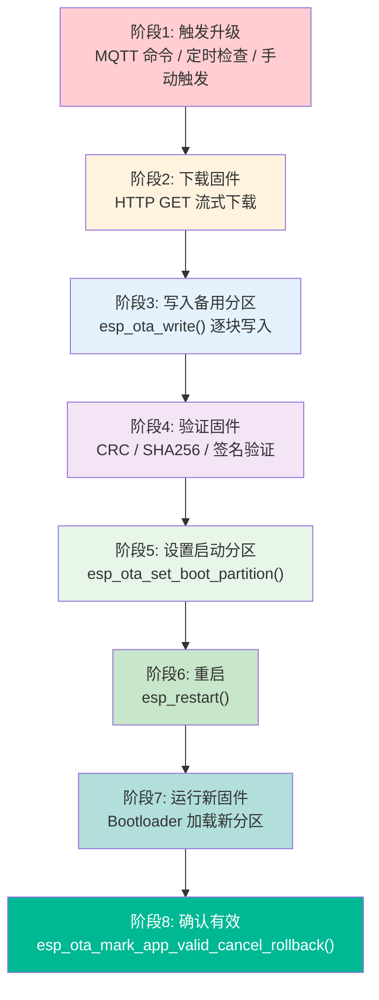
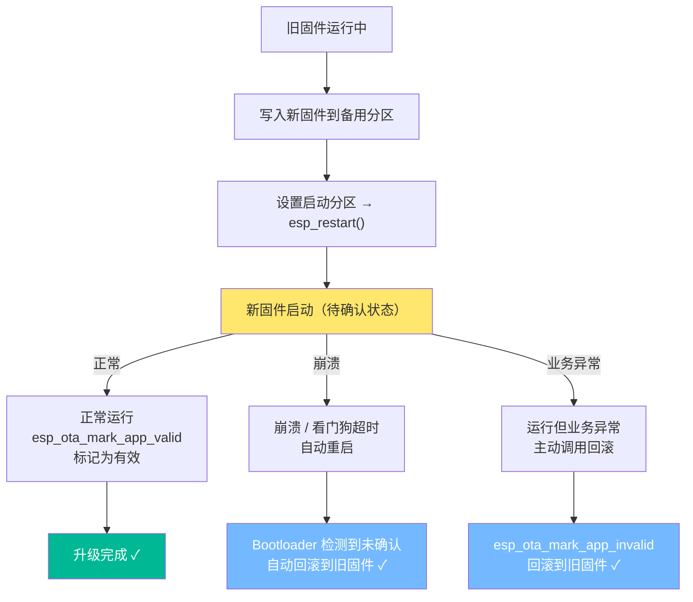
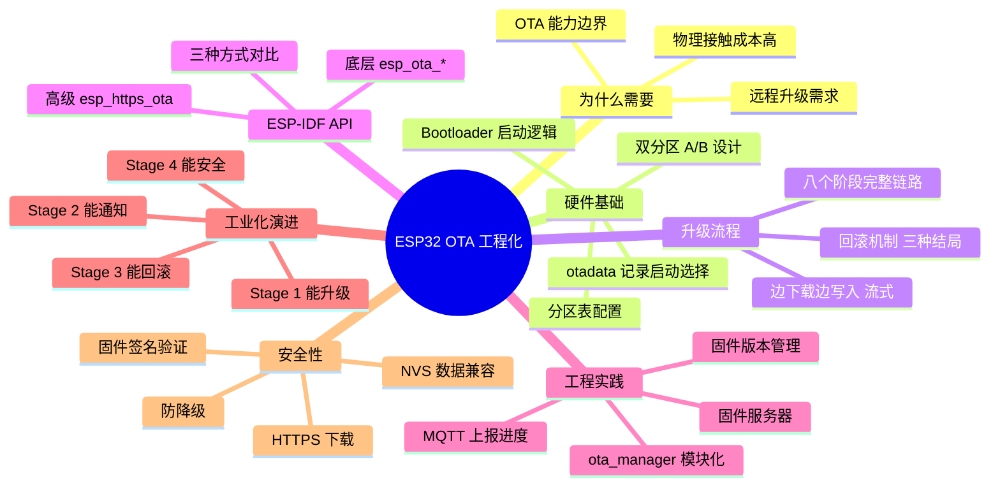

---
aliases:
  - OTA
  - Over-The-Air
  - 空中升级
  - ESP32 OTA
  - 固件升级
  - Firmware Update
tags:
  - 物联网
  - ESP32
  - ESP-IDF
  - OTA
  - 分区表
  - 固件升级
  - 工程化
date: 2026-05-25
status: evergreen
related:
  - "[[MQTT协议]]"
  - "[[WIFI]]"
  - "[[TLS加密协议]]"
  - "[[../嵌入式/内存/ESP32/ESP32的系统存储]]"
---

> [!abstract] 核心摘要
> OTA（Over-The-Air，空中升级）是在不物理接触设备的前提下，远程替换固件的能力。ESP32 的 OTA 基于**双分区（A/B）设计**——运行 A 分区时把新固件写入 B 分区，然后通过 Bootloader 切换启动。整个流程经历**触发 → 下载 → 写入 → 验证 → 设启动分区 → 重启 → 确认有效**八个阶段，配合**回滚机制**保证升级失败时自动恢复旧固件。理解分区表、otadata、Bootloader 启动选择逻辑和 ESP-IDF OTA API，是从"USB 烧录"到"远程量产升级"的关键跃迁。

> [!tip] 学习主线
> OTA 的核心问题是：**设备正在运行的固件占着分区，怎么在不中断的情况下替换自己？**
> 答案链条：**双分区设计（A/B 交替）→ otadata 记录启动选择 → Bootloader 按 otadata 启动 → 边下载边写入（流式）→ 验证固件完整性 → 切换启动分区 → 重启 → 确认有效或自动回滚**

---

## 1. 为什么需要 OTA

### 1.1 没有 OTA 的困境

ESP32 设备部署到客户家里后发现了 Bug，怎么修？

| 方案 | 操作 | 问题 |
|------|------|------|
| 寄回来修 | 客户寄回 → USB 烧录 → 寄回 | 物流成本 + 人工 + 客户投诉 |
| 上门服务 | 工程师带笔记本上门 | 1000 台设备不可扩展 |
| 用户自己刷 | 网页上传固件 | 需要用户有技术能力 |

> [!important] 共同问题：所有方案都需要**物理接触**设备。设备数量从 1 → 1000 → 10000 时，物理接触成本指数级增长。

### 1.2 OTA 解决的核心矛盾

**OTA（Over-The-Air，空中升级）** 解决的核心问题：**在不物理接触设备的前提下，远程替换设备上运行的固件。**

```
没有 OTA：
  你 → USB 线 → 设备 → 烧录新固件
  需要：物理接触 + 电脑 + 烧录器

有 OTA：
  你 → 上传固件到服务器 → 设备通过网络下载 → 自动替换并启动
  需要：网络连接 + OTA 机制
```

### 1.3 OTA 的能力边界

| OTA 能做 | OTA 不做 |
|---------|---------|
| 替换 app 分区的固件 | 不能修改 Bootloader |
| 恢复出厂固件（回滚到 factory） | 不能修改 Wi-Fi 驱动等底层固件 |
| 通过 HTTP/MQTT/BLE 下载固件 | 不定义用什么协议（你选） |
| 验证固件完整性（CRC/SHA256） | 不保证网络可靠性（你自己处理断线） |
| 回滚到旧固件 | 不能扩展分区大小（分区表设计时就确定了） |

> [!tip] 思考
> OTA 只能替换 app 分区。如果分区表设计时 app 分区太小，新固件装不下怎么办？——没法 OTA 扩分区，只能 USB 重新烧录分区表。所以分区表设计要预留足够空间。

---

## 2. ESP32 的 OTA 硬件基础

### 2.1 没有 OTA 的分区表

```
# 默认分区表（单 app，无 OTA）
# Name,   Type, SubType, Offset,  Size
nvs,      data, nvs,     0x9000,  0x4000
phy_init, data, phy,     0xd000,  0x1000
factory,  app,  factory, 0x10000, 1M
```

```
Flash 布局：
0x0000  ┌──────────────┐
        │ Bootloader   │  16KB（固定，不可 OTA）
0x9000  ├──────────────┤
        │ NVS          │  16KB（Wi-Fi/设备配置）
0xD000  ├──────────────┤
        │ PHY_INIT     │  4KB（射频校准）
0x10000 ├──────────────┤
        │              │
        │  factory app │  1MB（你的固件）
        │              │
        └──────────────┘
```

> [!warning] 只有一个 app 分区（factory），无法在运行旧固件的同时写入新固件——你正在运行的固件就占着这个分区。就像你不能坐在椅子上同时把椅子拆了。

### 2.2 双区（A/B）设计思想

**核心思路：留两个 app 分区，运行 A 的时候把新固件写到 B，然后切换启动到 B。**



OTA 分区表配置：

```
# partitions.csv（OTA 版）
# Name,   Type, SubType, Offset,  Size
nvs,      data, nvs,     0x9000,  0x4000
otadata,  data, ota,     0xd000,  0x2000
phy_init, data, phy,     0xf000,  0x1000
ota_0,    app,  ota_0,   0x10000, 1.5M
ota_1,    app,  ota_1,   0x190000,1.5M
```

```
Flash 布局（OTA 版）：
0x0000   ┌──────────────┐
         │ Bootloader   │  16KB
0x9000   ├──────────────┤
         │ NVS          │  16KB
0xD000   ├──────────────┤
         │ otadata      │  8KB ← 记录"下次从哪个分区启动"
0xF000   ├──────────────┤
         │ PHY_INIT     │  4KB
0x10000  ├──────────────┤
         │              │
         │  ota_0 (A)   │  1.5MB
         │              │
0x190000 ├──────────────┤
         │              │
         │  ota_1 (B)   │  1.5MB
         │              │
         └──────────────┘
```

关键变化：
- **两个 app 分区**：`ota_0` 和 `ota_1`，各 1.5MB，交替使用
- **新增 otadata 分区**：记录"下次从哪个分区启动"
- **factory 可选保留**：作为出厂备份，出问题时兜底

> [!important] 两个分区各 1.5MB + bootloader + nvs + otadata + phy ≈ 3.2MB。4MB Flash 刚好够但紧张，建议 8MB 或 16MB Flash 为 OTA 预留充足空间。

### 2.3 otadata 分区

```
otadata 结构：
  ┌──────────────────────────────────┐
  │ 序号 0：ota_seq = 1              │  ← 当前启动计数
  │          启动分区 = ota_0         │
  ├──────────────────────────────────┤
  │ 序号 1：ota_seq = 0              │  ← 未使用
  │          启动分区 = 无             │
  └──────────────────────────────────┘

Bootloader 选择逻辑：ota_seq 较大的条目 = 下次启动分区
```

### 2.4 Bootloader 启动选择逻辑



> [!tip] 思考
> 如果新固件写入到 ota_1 的过程中突然断电——写了一半，otadata 还是指向 ota_0——会发生什么？答案是：重启后 Bootloader 读 otadata，发现指向 ota_0，从 ota_0 启动旧固件。旧固件完全不受影响。这就是双分区设计的安全性。

---

## 3. OTA 升级的完整流程

### 3.1 八阶段全景图



### 3.2 各阶段详解

#### 阶段 1：触发升级

| 触发方式 | 原理 | 优势 | 劣势 |
|---------|------|------|------|
| **MQTT 命令** | 云端通过 MQTT 下发 `{"url":"...","version":"2.0.0"}` | 实时性好、云端可控 | 依赖 [[MQTT协议]] 连接 |
| **定时检查** | 设备定时 HTTP GET 版本号比对 | 简单、不依赖 MQTT | 有延迟（检查间隔） |
| **手动触发** | 用户通过按键/Web 页面触发 | 用户可控 | 需要用户交互 |

#### 阶段 2：下载固件

```
通过 HTTP GET 下载固件二进制文件
  → 不是一次性全部下载完再写入
  → 而是边下载边写入（流式写入）
  → 原因：ESP32 RAM 约 300KB，固件通常 1~1.5MB，不可能全部缓存
```

> [!important] 必须边下载边写入 Flash。ESP32 可用 RAM 远小于固件大小。

#### 阶段 3：写入备用分区

```
1. 确定当前分区和备用分区
   当前运行 ota_0 → 写入 ota_1
   当前运行 ota_1 → 写入 ota_0

2. 擦除备用分区（Flash 写入前必须先擦除）
   esp_ota_begin() 内部完成擦除

3. 边下载边写入：
   HTTP 收到一块数据 → esp_ota_write()
   HTTP 收到一块数据 → esp_ota_write()
   ...直到全部写完
```

#### 阶段 4：验证固件

```
下载完成后验证：
  - 固件头校验（ESP-IDF 自动检查 app image 头部）
  - 大小校验（下载大小 == 预期大小）
  - 可选：SHA256 校验和验证
  - 可选：RSA 数字签名验证（安全 OTA）
```

#### 阶段 5：设置启动分区

```c
esp_ota_set_boot_partition(update_partition);
// 更新 otadata → 标记"下次从新分区启动"
// 注意：此时还在运行旧固件
```

#### 阶段 6：重启

```c
esp_restart();
// 芯片复位 → Bootloader 读取 otadata → 从新分区启动
```

#### 阶段 7：运行新固件

```
Bootloader 加载新分区 → app_main() 开始执行
```

#### 阶段 8：确认有效

```c
esp_ota_mark_app_valid_cancel_rollback();
// 标记新固件为"有效"
// 如果不标记，下次重启会自动回滚到旧固件
```

> [!warning] 确认步骤不可省略！新固件必须主动确认自己运行正常，否则 Bootloader 会在重启次数达到上限后自动回滚。

### 3.3 回滚机制



三种结局：

| 情况 | 发生了什么 | 结果 |
|------|-----------|------|
| 升级成功 | 新固件启动正常 → 调用 `mark_app_valid` | 新固件生效 ✓ |
| 新固件崩溃 | 启动后崩溃/看门狗超时 → 重启 → 未确认 | 自动回滚到旧固件 ✓ |
| 业务异常 | 启动正常但功能不对 → 主动调用 `mark_app_invalid` | 主动回滚到旧固件 ✓ |

> [!tip] 思考
> 如果新固件启动后还没来得及调用"确认有效"就断电了，下次开机启动哪个？——Bootloader 会尝试启动新固件（otadata 已指向它），同时增加 boot count。如果连续多次未确认，达到上限后自动回滚。这给了新固件多次尝试的机会。

---

## 4. ESP-IDF OTA 组件与 API

### 4.1 核心 API

| API | 职责 | 调用时机 |
|-----|------|---------|
| `esp_ota_get_running_partition()` | 获取当前运行分区 | 升级开始时确认"我在哪" |
| `esp_ota_get_next_update_partition()` | 获取备用分区（写入目标） | 确定"往哪写" |
| `esp_ota_begin()` | 初始化 OTA 写入，擦除目标分区 | 下载开始前 |
| `esp_ota_write()` | 写入一块固件数据 | 每收到一块 HTTP 数据 |
| `esp_ota_end()` | 结束写入，验证固件头 | 下载完成后 |
| `esp_ota_set_boot_partition()` | 设置下次启动分区 | 验证通过后 |
| `esp_restart()` | 重启设备 | 设置启动分区后 |
| `esp_ota_mark_app_valid_cancel_rollback()` | 确认新固件有效 | 新固件启动后、业务正常时 |

### 4.2 底层 API 完整调用流程

```c
static void ota_task(void *pvParameters)
{
    char *url = (char *)pvParameters;

    // 1. 确定当前分区和目标分区
    const esp_partition_t *running = esp_ota_get_running_partition();
    const esp_partition_t *update  = esp_ota_get_next_update_partition(NULL);
    ESP_LOGI(TAG, "Running: %s, Update target: %s", running->label, update->label);

    // 2. 建立 HTTP 连接
    esp_http_client_config_t http_config = {
        .url = url,
        .timeout_ms = 10000,
    };
    esp_http_client_handle_t client = esp_http_client_init(&http_config);
    esp_http_client_open(client, 0);
    int content_length = esp_http_client_fetch_headers(client);

    // 3. 开始 OTA（擦除目标分区）
    esp_ota_handle_t handle;
    esp_ota_begin(update, OTA_SIZE_UNKNOWN, &handle);

    // 4. 边下载边写入
    char buf[4096];
    int total_read = 0;
    while (total_read < content_length) {
        int recv_len = esp_http_client_read(client, buf, sizeof(buf));
        if (recv_len <= 0) break;
        esp_ota_write(handle, buf, recv_len);
        total_read += recv_len;

        // 可选：上报进度
        int progress = (total_read * 100) / content_length;
        ESP_LOGI(TAG, "Progress: %d%%", progress);
    }

    // 5. 结束写入（自动验证固件头）
    esp_ota_end(handle);

    // 6. 设置启动分区
    esp_ota_set_boot_partition(update);

    // 7. 重启
    ESP_LOGI(TAG, "Restarting...");
    esp_restart();
}
```

### 4.3 esp_https_ota 高级封装

ESP-IDF 提供了更高级的封装，把下载 + 写入 + 验证合在一起：

```c
// 最简 OTA —— 一个函数搞定
esp_http_client_config_t config = {
    .url = "http://server.com/firmware/v2.bin",
};
esp_https_ota_config_t ota_config = {
    .http_config = &config,
};

esp_err_t ret = esp_https_ota(&ota_config);
// 内部完成：HTTP 连接 → 下载 → 写 Flash → 验证 → 设置启动分区
// 返回后只需要 esp_restart()
```

带进度上报的版本：

```c
esp_https_ota_handle_t handle;
esp_https_ota_start(&handle, &ota_config);

while (esp_https_ota_perform(handle) == ESP_OK) {
    int total      = esp_https_ota_get_image_size(handle);
    int downloaded = esp_https_ota_get_image_len_read(handle);
    int progress   = (downloaded * 100) / total;

    // 上报进度到 MQTT
    char buf[64];
    snprintf(buf, sizeof(buf), "{\"progress\":%d}", progress);
    mqtt_manager_publish(TOPIC_OTA, buf, strlen(buf), 1, 0);
}

esp_https_ota_finish(handle);
esp_restart();
```

### 4.4 三种 API 方式对比

| 方式 | 优势 | 劣势 | 适用场景 |
|------|------|------|---------|
| 底层 API（`esp_ota_*`） | 完全控制每一步 | 代码量大，需自己处理 HTTP | 需要精细控制（断点续传、自定义协议） |
| 高级封装（`esp_https_ota`） | 代码极简 | 灵活性差，不易定制 | 简单场景、快速原型 |
| 高级+事件（`esp_https_ota_start`） | 有进度回调，可上报 | 介于两者之间 | 生产环境（推荐） |

---

## 5. HTTP OTA 工程实践

### 5.1 固件版本管理

```c
// 在代码中定义版本号
#define FIRMWARE_VERSION "1.2.0"

// app_main() 启动时打印
ESP_LOGI(TAG, "Firmware version: %s", FIRMWARE_VERSION);

// 通过 MQTT 上报版本
char payload[64];
snprintf(payload, sizeof(payload), "{\"version\":\"%s\"}", FIRMWARE_VERSION);
mqtt_manager_publish(TOPIC_STATUS, payload, strlen(payload), 1, 0);
```

版本检查流程：

```
设备启动 → 上报当前版本到云端
  → 云端比对：云端最新版本 > 设备版本？
    → 是 → MQTT 下发升级命令 {"url": "...", "version": "1.3.0"}
    → 否 → 不需要升级
```

### 5.2 固件服务器

最简方案——静态 HTTP 服务器：

```
固件服务器目录结构：
  /firmware/
    ├── v1.0.0.bin
    ├── v1.1.0.bin
    ├── v1.2.0.bin
    └── latest.json
        ← {"version":"1.2.0","url":"http://server/firmware/v1.2.0.bin","sha256":"abc..."}
```

### 5.3 升级状态通知

通过 MQTT 上报 OTA 全过程状态：

```
上报 topic: device/001/ota/status

状态消息流：
  {"state":"idle"}              ← 空闲
  {"state":"downloading","progress":0}
  {"state":"downloading","progress":30}
  {"state":"downloading","progress":80}
  {"state":"verifying"}         ← 验证固件
  {"state":"restarting"}        ← 即将重启
  -- 重启 --
  {"state":"success","version":"1.3.0"}  ← 新固件确认成功
```

### 5.4 最小 OTA 工程结构

```
project/
├── main/
│   ├── app_main.c              ← 入口
│   ├── wifi_manager.h/.c       ← Wi-Fi 管理
│   ├── mqtt_manager.h/.c       ← MQTT 通信
│   ├── ota_manager.h/.c        ← OTA 管理（新增）
│   └── topic_config.h          ← Topic 定义
├── partitions.csv              ← 自定义分区表（双 OTA 分区）
└── sdkconfig
```

| 文件 | 职责 | 不应该做的事 |
|------|------|-------------|
| `ota_manager.h/.c` | OTA 触发、下载、写入、状态上报 | 不知道 MQTT client 的存在，通过回调通知 |
| `mqtt_manager.c` | 收到 OTA 命令后调用 `ota_manager_start(url)` | 不直接做 OTA 下载 |
| `app_main.c` | 初始化 + 确认新固件有效 | 调用 `esp_ota_mark_app_valid_cancel_rollback()` |

### 5.5 ota_manager 接口设计

```c
// ota_manager.h
typedef enum {
    OTA_STATE_IDLE,
    OTA_STATE_DOWNLOADING,
    OTA_STATE_VERIFYING,
    OTA_STATE_RESTARTING,
    OTA_STATE_ERROR,
} ota_state_t;

typedef void (*ota_progress_cb_t)(int progress);
typedef void (*ota_state_cb_t)(ota_state_t state);

void ota_manager_init(void);
void ota_manager_start(const char *url);
bool ota_manager_is_upgrading(void);
ota_state_t ota_manager_get_state(void);
void ota_manager_register_progress_cb(ota_progress_cb_t cb);
void ota_manager_register_state_cb(ota_state_cb_t cb);
```

### 5.6 Wi-Fi + MQTT + OTA 完整数据流

```
MQTT Broker
  │ 下发 OTA 命令 {"url": "http://server/firmware/v2.bin"}
  ▼
mqtt_event_handler()（MQTT 回调）
  │ 解析 topic == "device/001/ota"
  │ 提取 url
  ▼
ota_manager_start(url)
  │ 创建 ota_task
  ▼
ota_task（独立 FreeRTOS 任务）
  │ HTTP GET → esp_ota_write() → esp_ota_set_boot_partition()
  │ 通过回调上报进度 → MQTT 发布进度
  ▼
esp_restart()
  │
  ▼
Bootloader → 从新分区启动
  │
  ▼
app_main()
  │ esp_ota_mark_app_valid_cancel_rollback()
  │ MQTT 发布 "OTA success"
  ▼
新固件正常运行
```

---

## 6. 从 Demo 到工业化

### 6.1 教学 Demo 的典型特征

```c
// 典型教学 Demo：能升级，但距离产品很远
void ota_task(void *url) {
    esp_http_client_config_t config = {.url = url};
    esp_https_ota_config_t ota_config = {.http_config = &config};

    esp_https_ota(&ota_config);  // 没检查返回值
    esp_restart();                // 没有进度上报、没有状态通知
}

// app_main 中硬编码 URL 测试
void app_main(void) {
    wifi_init();
    xTaskCreate(ota_task, "ota", 8192, "http://server/v2.bin", 5, NULL);
}
```

### 6.2 八个维度的差距分析

| 维度 | 教学 Demo | 工业化实现 |
|------|-----------|-----------|
| **触发方式** | 硬编码 URL，手动触发 | MQTT 命令 + 版本比对 + 定时检查兜底 |
| **进度上报** | 无 | 通过 MQTT 实时上报下载进度和状态 |
| **回滚机制** | 无 | 新固件确认有效 + 自动回滚 + 主动回滚 |
| **安全性** | HTTP 明文下载 | HTTPS 下载 + 固件签名验证 + 防降级 |
| **断线处理** | 下载失败直接放弃 | 重试 + 断点续传 + 错误状态上报 |
| **NVS 兼容** | 不考虑 | 新固件代码兼容旧格式 NVS 数据 |
| **用户体验** | 无反馈 | LED 指示升级状态 + MQTT 状态通知 |
| **固件管理** | 无版本号 | 版本号定义 + 云端版本管理 + 灰度发布 |

### 6.3 演进路线


#### Stage 1：能升级（教学 Demo）

- 硬编码固件 URL
- `esp_https_ota()` 一个函数搞定
- 无进度上报、无回滚、无错误处理
- **能跑通，但完全不能用于产品**

#### Stage 2：能通知

- 通过 MQTT 触发升级，不再硬编码
- 实时上报下载进度（0% → 30% → 80% → 100%）
- 版本号定义 + 上报
- `ota_manager.c` 独立模块

#### Stage 3：能回滚

- 新固件启动后确认有效（`mark_app_valid`）
- 自动回滚（崩溃/看门狗触发）
- 主动回滚（业务异常时主动调用）
- OTA 状态机（idle → downloading → verifying → restarting）

#### Stage 4：能安全

- HTTPS 下载固件（防窃听/篡改）
- 固件签名验证（RSA 签名，防恶意固件）
- 防降级检查（版本号只升不降）
- NVS 数据兼容（新固件兼容旧格式）

### 6.4 安全 OTA 固件签名验证

```
签名流程（开发端）：
  1. 编译生成 firmware.bin
  2. 用 SHA256 计算固件摘要
  3. 用私钥对摘要签名 → firmware.sig
  4. 上传 firmware.bin + firmware.sig 到服务器

验证流程（ESP32 端）：
  1. 下载 firmware.bin + firmware.sig
  2. 用 SHA256 计算固件摘要 → digest A
  3. 用嵌入的公钥验证签名 → digest B
  4. A == B → 固件未被篡改 ✓
```

```c
// ESP-IDF 安全 OTA 配置
esp_http_client_config_t config = {
    .url = "https://server.com/firmware/v2.bin",
    .cert_pem = server_cert_pem,     // 服务器 CA 证书（HTTPS）
};

// 在 menuconfig 中启用签名验证：
// Component config → ESP HTTPS OTA → Enable firmware signature verification
// 需要在项目中放入签名公钥
```

### 6.5 NVS 数据兼容性

> [!warning] OTA 只替换 app 固件，NVS 分区不变。新固件必须兼容旧格式的 NVS 数据。

```
旧固件 v1.0.0 的 NVS：
  key: "config" → {"interval": 5}

新固件 v2.0.0 期望的 NVS：
  key: "config" → {"interval": 5, "threshold": 30}  ← 新增字段

正确做法：
  // 新固件代码兼容旧数据
  int threshold = 30;  // 默认值
  nvs_get_i32(handle, "threshold", &threshold);  // 如果不存在就用默认值
```

---

## 7. 常见报错与排查

### 7.1 错误码速查

| 报错 | 含义 | 原因 | 解决 |
|------|------|------|------|
| `ESP_ERR_OTA_VALIDATE_FAILED` | 固件验证失败 | 固件损坏或格式错误 | 重新生成固件 bin，确认完整下载 |
| `ESP_ERR_NOT_FOUND` | 找不到 OTA 分区 | 分区表没有 ota_0/ota_1 | 修改 partitions.csv 添加双 OTA 分区 |
| `ESP_ERR_NO_MEM` | 内存不足 | OTA 需要较大 RAM | 增大任务栈（≥8KB），减少并发任务 |
| `ESP_ERR_OTA_ROLLBACK_INVALID` | 回滚失败 | 旧固件也无效 | 检查两个分区是否都被破坏 |
| `ESP_ERR_HTTP_CONNECT` | HTTP 连接失败 | 服务器不可达 | 检查 URL、网络连接 |
| `ESP_ERR_HTTP_FETCH` | 下载中断 | 网络断开/超时 | 增大超时、加重试逻辑 |

### 7.2 OTA 故障排查 5 步清单

| 步骤 | 检查什么 | 怎么判断 |
|------|---------|---------|
| **1** | 分区表是否正确？ | `idf.py partition-table` 查看，确认有 ota_0 + ota_1 + otadata |
| **2** | 固件 URL 是否可访问？ | 电脑浏览器直接访问 URL，确认能下载 |
| **3** | Flash 空间是否够？ | 新固件大小 ≤ OTA 分区大小 |
| **4** | 当前运行在哪个分区？ | `esp_ota_get_running_partition()` 打印 |
| **5** | 固件是否完整？ | 比对下载字节数和 Content-Length |

### 7.3 分区表配置常见错误

```
错误1：忘记 otadata 分区
  → Bootloader 不知道从哪个分区启动
  → 必须有 otadata 分区（8KB）

错误2：ota_0 和 ota_1 大小不同
  → 交替写入时可能空间不够
  → 两个 OTA 分区大小必须一致

错误3：分区偏移地址重叠
  → 烧录后 Flash 数据错乱
  → 用 idf.py partition-table 验证

错误4：app 分区太小
  → 固件越来越大，放不下了
  → 设计时预留 1.5~2MB（考虑未来增长）
```

---

## 8. 知识体系总图



---

## 关键概念速查

| 概念 | 说明 |
|------|------|
| **OTA** | Over-The-Air，空中升级，远程替换固件 |
| **A/B 双分区** | 两个 app 分区交替使用，运行 A 时写 B |
| **otadata** | 8KB 分区，记录"下次从哪个分区启动" |
| **ota_0 / ota_1** | 两个 OTA 分区，各存放一个固件镜像 |
| **factory** | 出厂固件分区，OTA 失败时的兜底 |
| **Bootloader** | 引导加载器，根据 otadata 选择启动分区 |
| **esp_ota_begin()** | 初始化 OTA 写入，擦除目标分区 |
| **esp_ota_write()** | 逐块写入固件数据 |
| **esp_ota_end()** | 结束写入，自动验证固件头 |
| **esp_ota_set_boot_partition()** | 更新 otadata，设置下次启动分区 |
| **回滚** | 新固件异常时自动恢复到旧固件 |
| **mark_app_valid** | 确认新固件有效，取消回滚 |
| **esp_https_ota** | ESP-IDF 高级封装，一站式 OTA |
| **固件签名** | 用 RSA 私钥签名固件，ESP32 用公钥验证 |
| **partitions.csv** | 自定义分区表文件 |

---

## 面试高频问题

> [!example]- Q1：ESP32 OTA 为什么需要两个 app 分区？不能在运行中覆盖自己吗？
> 不能。正在运行的固件占着当前分区，Flash 同时被读取和写入会出错。双分区设计（A/B）让设备运行 A 分区时把新固件写入 B 分区，互不干扰。写完后通过更新 otadata 让 Bootloader 切换到 B 分区启动。类比：你不能坐在椅子上同时把椅子拆了，但可以坐在旧椅子上组装新椅子。

> [!example]- Q2：OTA 升级过程中断电了怎么办？
> 取决于断电时机：(1) 下载/写入阶段断电 → otadata 未更新，重启后从旧分区启动，旧固件不受影响；(2) 写完但还没重启 → 同上，旧固件不受影响；(3) 重启后新固件崩溃 → Bootloader 检测到未确认，自动回滚到旧固件。所以任何阶段断电，设备都能恢复。

> [!example]- Q3：回滚机制是怎么工作的？
> 新固件启动时处于"待确认"状态。如果新固件正常启动并调用了 `esp_ota_mark_app_valid_cancel_rollback()`，则标记为有效，后续正常使用。如果新固件崩溃导致看门狗复位，Bootloader 检测到未确认且 boot count 达到上限，自动回滚到旧分区。开发者也可以在新固件运行但业务异常时主动调用 `esp_ota_mark_app_invalid_rollback_and_restart()` 回滚。

> [!example]- Q4：分区表设计时 OTA 分区应该多大？
> 至少 1.5MB，建议 2MB。固件大小会随功能增加而增长，分区太小会导致新固件写不进去。两个 OTA 分区大小必须一致（交替使用）。4MB Flash 比较紧张（两个 1.5MB 分区 + 其他 ≈ 3.2MB），建议使用 8MB 或 16MB Flash。

> [!example]- Q5：OTA 下载过程中怎么上报进度？用哪种 API？
> 使用 `esp_https_ota_start()` + `esp_https_ota_perform()` 循环方式。在循环中调用 `esp_https_ota_get_image_size()` 和 `esp_https_ota_get_image_len_read()` 计算百分比，通过 MQTT 发布进度消息。不能用 `esp_https_ota()` 那个一站式函数，因为它没有进度回调。

> [!example]- Q6：OTA 升级后 NVS 数据会怎样？新固件读旧数据会出错吗？
> OTA 只替换 app 分区的固件，NVS 分区完全不变。新固件可能期望新的 NVS 数据格式（新增字段），但实际读到的是旧格式。正确做法：新固件代码要兼容旧格式——读取新字段时如果不存在就用默认值。这就是为什么 OTA 不仅仅是"替换固件"，还要考虑数据兼容性。

---

## 踩坑记录

> [!bug] 实战经验填充区
> （项目开发中遇到的 OTA 相关问题记录于此）

---

## 继续阅读

- [[MQTT协议]] — OTA 触发命令通常通过 MQTT 下发，升级进度通过 MQTT 上报
- [[WIFI]] — OTA 下载依赖稳定的 Wi-Fi 连接
- [[TLS加密协议]] — HTTPS 安全 OTA 下载、固件签名验证
- [[../嵌入式/内存/ESP32/ESP32的系统存储]] — Flash 分区、NVS 存储、分区表详解
