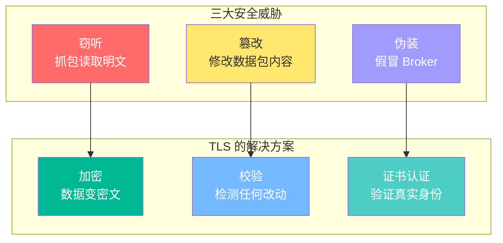
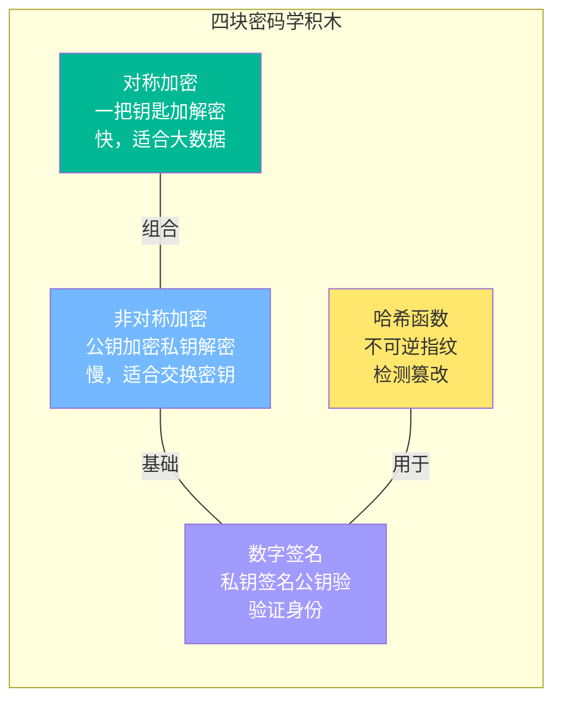
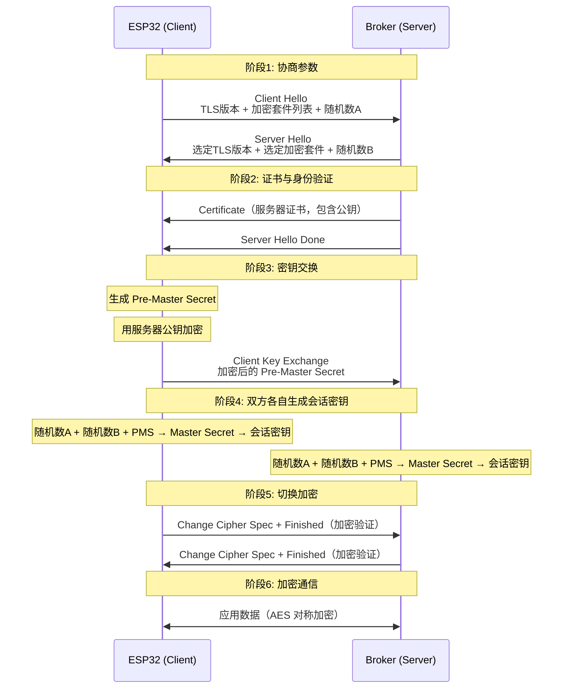
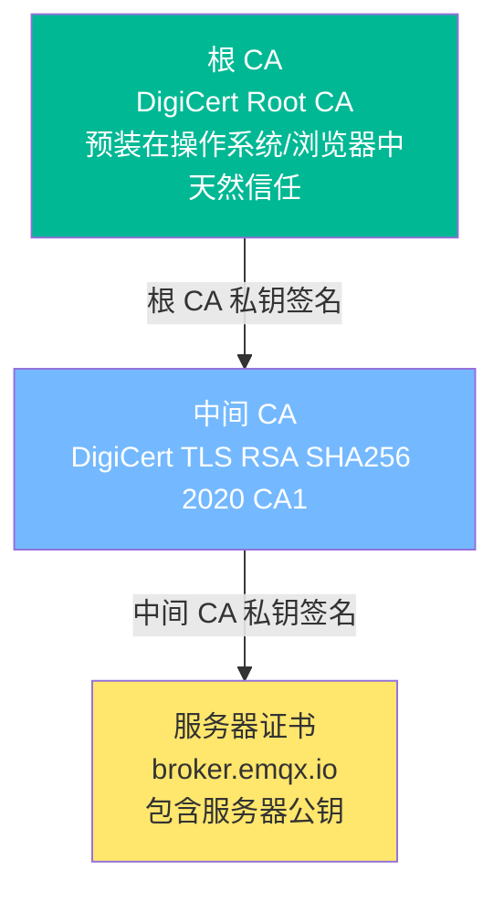
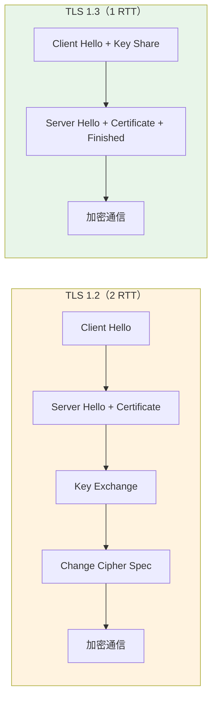
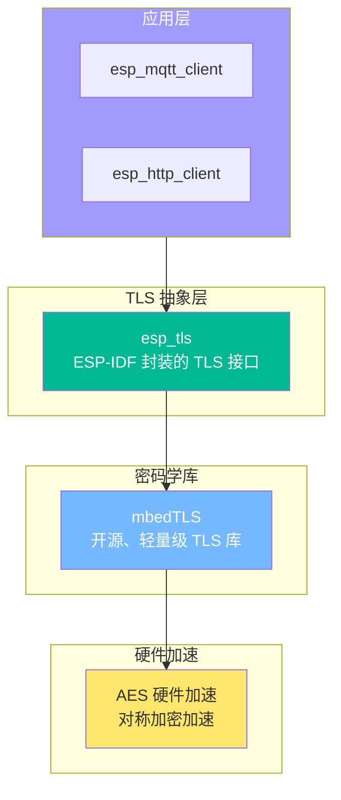
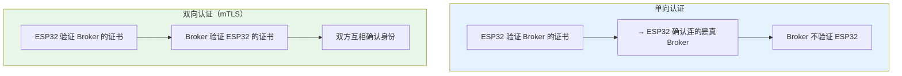
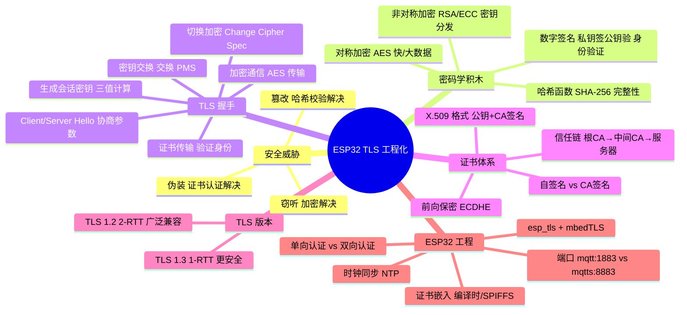

---
aliases:
  - TLS
  - SSL
  - Transport Layer Security
  - mbedTLS
  - mqtts
  - 证书
  - X.509
tags:
  - 物联网
  - ESP32
  - ESP-IDF
  - TLS
  - 安全
  - 加密
  - 证书
  - mbedTLS
date: 2026-05-24
status: evergreen
related:
  - "[[MQTT协议]]"
  - "[[WIFI]]"
  - "[[OTA升级]]"
  - "[[../嵌入式/内存/ESP32/ESP32的系统存储]]"
---

> [!abstract] 核心摘要
> TLS（Transport Layer Security）是跑在 TCP 之上的安全协议，通过**非对称加密交换密钥 + 对称加密传输数据 + 证书验证身份 + 哈希校验完整性**，解决窃听、篡改、伪装三大威胁。在 ESP32 工程中，`mqtts://` 连接就是 MQTT 跑在 TLS 之上——握手阶段用证书和公钥建立信任并协商出会话密钥，后续所有 MQTT 消息都在加密通道里传输。理解四块密码学积木的协作方式和 ESP-IDF 的 TLS 组件配置，是从"明文 MQTT"到"安全 MQTT"的关键跃迁。

> [!tip] 学习主线
> TLS 的核心问题是：**在不安全的网络上，怎么安全地建立一个加密通道？**
> 答案链条：**三大威胁定义安全需求 → 四块密码学积木各自解决一个问题 → TLS 握手把四块积木组合起来 → 证书体系解决公钥信任 → ESP32 工程中配置证书实现 mqtts://**

---

## 1. 为什么需要 TLS

### 1.1 明文 MQTT 的风险

ESP32 通过 `mqtt://broker.emqx.io:1883` 发送数据，消息在网络上经历了多个节点：

```
ESP32 → 路由器 → 宽带运营商 → 互联网 → Broker
         ↑           ↑            ↑
      每个节点都能看到明文数据
```

> [!warning] 咖啡厅场景
> 同一 Wi-Fi 下的黑客用 Wireshark 抓包，就能看到你的 MQTT 用户名、密码、Topic、消息内容——所有数据都是明文。

### 1.2 三种威胁



| 威胁 | 攻击方式 | 后果 | TLS 解决手段 |
|------|---------|------|-------------|
| **窃听** | 抓包读取明文数据 | 密码泄露、隐私暴露 | 加密——数据变成密文 |
| **篡改** | 中间人修改数据包 | 控制命令被改写（关灯→开灯） | 校验——改动一个字节都能检测到 |
| **伪装** | 假冒 Broker 让设备连接 | 设备连到假 Broker，数据全部泄露 | 证书验证——确认"连的是真 Broker" |

> [!important] 伪装是最危险的威胁。中间人攻击同时实现窃听和篡改，而且设备完全不知道——它以为自己连的是真 Broker。

### 1.3 核心矛盾

> [!tip] 思考
> 如果只解决加密——你和 Broker 约定一个密钥——怎么把密钥安全地给对方？通过明文传输密钥，密钥本身就被截获了。这就是**鸡生蛋问题**：需要安全通道来交换密钥，但建立安全通道又需要密钥。TLS 用一套精巧的机制打破了这个死循环。

---

## 2. 密码学四块积木

TLS 不是单一算法，而是四块"密码学积木"的组合：



### 2.1 对称加密

**类比**：一把锁，一把钥匙。加密和解密用同一把钥匙。

```
加密：明文 + 密钥 → 密文
解密：密文 + 密钥 → 明文

例子：AES-256
  明文：{"temp": 25.3}
  密钥：0x3A 0xF1 ... (256 bit)
  密文：8f2a9c...（无法解读的乱码）
```

| 特点 | 说明 |
|------|------|
| 速度快 | ESP32 有 AES 硬件加速模块，毫秒级完成 |
| 适合加密大数据 | 几 KB 的 MQTT 消息毫无压力 |
| 核心弱点 | **密钥怎么安全地给对方？** |

### 2.2 非对称加密

**类比**：透明信箱（公钥）和私有钥匙（私钥）。

```
任何人都能把信投进信箱（用公钥加密）
只有信箱主人能取信（用私钥解密）

公钥：公开给全世界，谁都能拿到
私钥：只有自己持有，绝对不泄露

加密：明文 + 公钥 → 密文（任何人都能加密）
解密：密文 + 私钥 → 明文（只有私钥持有者能解密）
```

| 算法 | 密钥长度 | 特点 |
|------|---------|------|
| RSA | 2048~4096 bit | 老牌算法，密钥长，通用性好 |
| ECC | 256 bit | 椭圆曲线，密钥短，IoT 设备更友好 |

| 特点 | 说明 |
|------|------|
| 解决密钥分发 | 公钥可以随便发，不怕被截获 |
| 速度慢 | 比 AES 慢 100~1000 倍 |
| 不适合大数据 | 只适合加密小块数据（比如一个密钥） |

### 2.3 哈希函数

**类比**：指纹。给任何数据算出一个固定长度的"指纹"，不可逆。

```
哈希：任意长度输入 → 固定长度摘要

SHA-256 示例：
  "Hello"           → 185f8db...
  "Hello!"          → 334d0a...（只多一个!，结果完全不同）
```

| 特性 | 说明 |
|------|------|
| 单向不可逆 | 无法从哈希值反推原文 |
| 雪崩效应 | 输入改一个 bit，输出天翻地覆 |
| 固定长度 | 无论输入多大，SHA-256 输出都是 256 bit |
| 抗碰撞 | 几乎不可能找到两个不同输入产生相同哈希 |

**用途：检测篡改。**

```
发送方：消息 + SHA-256(消息) = 摘要 → 一起发送
接收方：收到后自己算 SHA-256 → 对比摘要
  一致 → 数据没被篡改
  不一致 → 数据被动过手脚
```

### 2.4 数字签名

**类比**：盖章。用私钥对摘要"盖章"，别人用公钥验证。

```
签名过程：
  1. 对消息算哈希 → 得到摘要
  2. 用私钥加密摘要 → 得到签名

验证过程：
  1. 收到消息 + 签名
  2. 对消息算哈希 → 摘要 A
  3. 用公钥解密签名 → 摘要 B
  4. A == B → 确实来自私钥持有者且未篡改
```

### 2.5 四块积木的协作

> [!important] TLS 的核心思路：用非对称加密安全地交换一个临时对称密钥，后续所有通信用对称密钥加密。

| 积木 | 解决什么问题 | TLS 中的角色 |
|------|------------|-------------|
| 对称加密 | 效率——快速加密大量数据 | 数据传输阶段的加密算法（AES） |
| 非对称加密 | 密钥分发——安全交换密钥 | 握手阶段交换 Pre-Master Secret |
| 哈希函数 | 完整性——检测篡改 | 计算摘要、验证数据完整性 |
| 数字签名 | 身份验证——防伪造 | 证书上的 CA 签名、握手消息签名 |

> [!tip] 思考
> 四块积木组合后还有一个漏洞：你怎么知道你拿到的"公钥"真的是 Broker 的？黑客可以用自己的公钥冒充。这就引出了证书体系——用 CA 的签名来担保公钥的真实性。

---

## 3. TLS 握手流程

### 3.1 TLS 1.2 完整握手（sequenceDiagram）



### 3.2 六阶段详解

#### 阶段 1：Client Hello / Server Hello

双方协商参数——TLS 版本和加密套件：

```
Client Hello 内容：
  - 支持的 TLS 版本：1.2、1.3
  - 支持的加密套件列表：ECDHE-RSA-AES128-SHA256、AES-CBC-SHA256...
  - 客户端随机数 A（32 字节随机值）

Server Hello 回复：
  - 选定 TLS 版本：1.2
  - 选定加密套件：ECDHE-RSA-AES128-SHA256
  - 服务器随机数 B（32 字节随机值）
```

> [!tip] 思考
> 为什么双方都要生成随机数？如果用固定值，攻击者可以预先计算出密钥。两个随机数保证每次连接的会话密钥都不同，防止重放攻击。

#### 阶段 2：证书传输

服务器把 X.509 证书发给客户端。客户端用 CA 公钥验证证书上的签名，确认公钥确实属于服务器。

#### 阶段 3：密钥交换

客户端生成 Pre-Master Secret（48 字节随机数），用服务器公钥加密后发送。只有持有私钥的服务器能解密。

#### 阶段 4：生成会话密钥

```
双方用相同的三个输入 + 相同的算法 → 计算出相同的会话密钥

输入：
  客户端随机数 A（阶段1交换的）
  服务器随机数 B（阶段1交换的）
  Pre-Master Secret（阶段3安全交换的）

  ↓ PRF（伪随机函数）

输出：
  Master Secret → 派生出：
    - 客户端→服务器加密密钥
    - 服务器→客户端加密密钥
    - 客户端→服务器 MAC 密钥（完整性校验）
    - 服务器→客户端 MAC 密钥
```

> [!important] 为什么不直接传对称密钥？用三个值计算出来增加了随机性和不可预测性。即使某次连接的密钥泄露，其他连接不受影响。

#### 阶段 5：切换加密

双方都计算好会话密钥后，发送 Change Cipher Spec 表示"从现在开始加密"。Finished 消息用新密钥加密，验证密钥计算是否正确。

#### 阶段 6：加密通信

后续所有 MQTT 消息都在这个 AES 加密通道里传输。

### 3.3 握手过程的安全性分析

| 问题 | 答案 |
|------|------|
| 握手是明文还是密文？ | 阶段 1-3 是明文，阶段 5 之后是密文 |
| 黑客能抓到什么？ | 能看到双方支持的加密套件、两个随机数、证书、加密后的 PMS |
| 黑客能算出会话密钥吗？ | 不能。没有服务器私钥就无法解密 PMS，没有 PMS 就无法计算会话密钥 |
| 握手消息能被篡改吗？ | Finished 消息包含所有握手消息的哈希，任何篡改都会被检测到 |

---

## 4. 证书与信任链

### 4.1 X.509 证书结构

```
┌─────────────────────────────────────┐
│           X.509 v3 证书              │
│                                     │
│  版本：V3                           │
│  序列号：0x01A2B3                    │
│  签名算法：SHA256withRSA            │
│  颁发者（CA）：DigiCert Root CA     │
│  有效期：2024-01-01 ~ 2025-12-31   │
│  使用者：broker.emqx.io             │
│  公钥信息：RSA 2048 bit             │
│  ─────────────────────────────      │
│  CA 的数字签名：                    │
│  用 CA 私钥对以上内容的哈希签名     │
└─────────────────────────────────────┘
```

### 4.2 信任链



验证过程：

```
1. 收到 broker.emqx.io 的证书
2. 证书上写着"中间 CA 签发的"
3. 拿中间 CA 的公钥验证签名 → 通过 ✓
4. 中间 CA 的证书上写着"根 CA 签发的"
5. 拿根 CA 的公钥验证签名 → 通过 ✓
6. 根 CA 证书在设备内置信任列表中 → 信任链建立完毕 ✓
```

> [!important] 为什么需要中间 CA？根 CA 的私钥是最核心的资产，尽量少用它签名。中间 CA 可以被撤销而不影响根 CA，增加了安全性和灵活性。

### 4.3 自签名证书 vs CA 签名证书

| | CA 签名证书 | 自签名证书 |
|---|---|---|
| 信任基础 | CA 的声誉和内置根证书 | 你自己手动信任 |
| 适用场景 | 公开服务（emqx.io、AWS） | 私有 Broker（内网测试） |
| ESP32 使用 | 内置 CA 根证书即可验证 | 必须手动把证书烧录进设备 |
| 安全等级 | 高（CA 审核身份） | 中（信任你自己维护） |
| 证书成本 | 公网 CA 收费；Let's Encrypt 免费 | 免费（自己生成） |

> [!tip] 思考
> ESP32 内存有限，不可能内置所有根 CA 证书。解决方案：只存你需要的那一个 CA 根证书（或中间 CA 证书）。比如你连 EMQX Cloud，就只存 EMQX 用的那个 CA 证书。

---

## 5. TLS 1.2 vs TLS 1.3



| 维度 | TLS 1.2 | TLS 1.3 |
|------|---------|---------|
| 握手往返 | 2 RTT | **1 RTT**（快一倍） |
| 密钥交换 | RSA、ECDHE、DHE 等 | **仅 ECDHE**（更安全） |
| 前向保密 | 可选（取决于加密套件） | **强制**（所有连接都有） |
| 加密套件 | 37 个（很多已不安全） | **5 个**（只保留安全的） |
| 已知弱点 | BEAST、POODLE 等 | **修复所有已知弱点** |
| ESP-IDF 支持 | 完全支持 | ESP-IDF v4.0+ 支持 |

### 5.1 前向保密（Forward Secrecy）

> [!important] 前向保密意味着：即使将来服务器的私钥泄露了，以前截获的 TLS 通信记录也无法被解密。

原理：每次连接都生成**新的临时密钥对**（Ephemeral），用完即丢。

```
RSA 密钥交换（无前向保密）：
  会话密钥的机密性 = 服务器私钥的机密性
  私钥泄露 → 所有历史通信可解密 ✗

ECDHE 密钥交换（有前向保密）：
  会话密钥 = 临时密钥协商结果
  临时密钥用完即丢，无法恢复
  私钥泄露 → 只能冒充服务器，无法解密历史通信 ✓
```

### 5.2 对 ESP32 的工程影响

| 维度 | TLS 1.2 | TLS 1.3 |
|------|---------|---------|
| 内存占用 | 较高（支持多种套件） | 较低（只保留安全套件） |
| 握手延迟 | ~2 个 RTT | ~1 个 RTT |
| 代码体积 | 较大 | 较小（删掉不安全算法） |
| 兼容性 | 几乎所有服务器 | 部分旧服务器不支持 |
| 推荐选择 | 兼容性优先时选 | 性能和安全优先时选 |

---

## 6. ESP32 工程中的 TLS

### 6.1 ESP-IDF TLS 组件栈



| 层级 | 组件 | 说明 |
|------|------|------|
| 应用层 | `esp_mqtt_client` / `esp_http_client` | URI 用 `mqtts://` 或 `https://` 自动走 TLS |
| TLS 抽象层 | `esp_tls` | 统一的 TLS 接口，屏蔽底层细节 |
| 密码学库 | `mbedTLS` | 开源、轻量级，适合嵌入式 |
| 硬件加速 | ESP32 AES 模块 | 对称加密硬件加速，提升性能 |

### 6.2 MQTT over TLS 配置

```c
// 从 mqtt:// 切换到 mqtts://：只改 URI + 配置证书
esp_mqtt_client_config_t cfg = {
    .broker.uri = "mqtts://broker.emqx.io:8883",  // mqtt → mqtts, 1883 → 8883

    // 情况1：单向认证（最常见，只验证服务器）
    .broker.verification.certificate = ca_cert_pem_start,
};
```

```c
// 情况2：双向认证 / mTLS（AWS IoT Core、阿里云 IoT）
esp_mqtt_client_config_t cfg = {
    .broker.uri = "mqtts://a1xxx.iot.us-east-1.amazonaws.com:8883",

    .broker.verification.certificate = ca_cert_pem_start,    // CA 根证书
    .credentials.authentication.certificate = client_cert_start, // 客户端证书
    .credentials.authentication.key = client_key_start,          // 客户端私钥
};
```

### 6.3 单向认证 vs 双向认证



| | 单向认证 | 双向认证（mTLS） |
|---|---|---|
| 谁验证谁 | 客户端验证服务器 | 双方互相验证 |
| 需要什么 | CA 根证书 | CA 根证书 + 客户端证书 + 客户端私钥 |
| 类比 | 你去银行验证银行的营业执照 | 银行也要验证你的身份证 |
| 适用场景 | 大多数公开 Broker | AWS IoT、Azure IoT、阿里云 IoT |
| ESP32 存储 | 1 个证书文件 | 3 个证书/密钥文件 |

### 6.4 证书嵌入方式

**方式一：编译时嵌入（最简单，适合固定证书）**

```c
// 通过 CMakeLists.txt 把 PEM 文件嵌入固件
// CMakeLists.txt:
//   COMPONENT_EMBED_TXTFILES := certs/ca_cert.pem

// 代码中通过 extern 引用
extern const char ca_cert_pem_start[] asm("_binary_ca_cert_pem_start");
extern const char ca_cert_pem_end[]   asm("_binary_ca_cert_pem_end");

// 使用
.broker.verification.certificate = ca_cert_pem_start,
```

**方式二：SPIFFS 文件系统读取（适合需要远程更新证书）**

```c
// 证书存储在 SPIFFS 分区中
FILE *f = fopen("/spiffs/ca_cert.pem", "r");
fread(cert_buf, 1, cert_len, f);
fclose(f);

// 使用
.broker.verification.certificate = cert_buf,
```

| 方式 | 优势 | 劣势 | 适用场景 |
|------|------|------|---------|
| 编译时嵌入 | 简单、无需文件系统 | 更新证书需要重新烧录固件 | 证书长期不变的设备 |
| SPIFFS 读取 | 可通过 OTA 更新证书 | 需要额外分区、代码更复杂 | 证书可能变更的量产设备 |

### 6.5 完整数据流

```
你调 esp_mqtt_client_publish()
  → MQTT 协议封装消息
    → TLS 层用会话密钥加密（AES）
      → TLS 层计算 HMAC 校验码
        → TCP 层传输
          → Wi-Fi 层发送（详见 [[WIFI]]）
            → 互联网路由
          → Wi-Fi 接收
        → TCP 层接收
      → TLS 层校验 HMAC
    → TLS 层用会话密钥解密
  → MQTT 协议解析消息
→ Broker 收到明文消息
```

> [!important] MQTT 消息在整个互联网传输过程中都是密文。只有在 TLS 层解密后才变成明文——而 TLS 层在 ESP32 和 Broker 内部，黑客无法触及。

---

## 7. 常见报错与排查

### 7.1 错误码速查

| 报错 | 含义 | 原因 | 解决 |
|------|------|------|------|
| `MBEDTLS_ERR_NET_CONN_RESET` | 连接被重置 | 端口/协议不匹配 | 确认用 8883（不是 1883） |
| `MBEDTLS_ERR_X509_CERT_VERIFY_FAILED` | 证书验证失败 | CA 证书不匹配/过期 | 确认 CA 证书是正确的根证书 |
| `MBEDTLS_ERR_PK_KEY_INVALID_FORMAT` | 私钥格式错误 | PEM/DER 格式混用 | 确认是 PEM 格式 |
| `MBEDTLS_ERR_SSL_TIMEOUT` | TLS 握手超时 | 网络不稳定/服务器无响应 | 检查网络、增大超时时间 |
| `MBEDTLS_ERR_SSL_FATAL_ALERT_MESSAGE` | 服务器拒绝 | 证书/协议不匹配 | 查服务器日志确认原因 |
| `ESP_ERR_MBEDTLS_ALLOC_FAILED` | 内存不足 | TLS 需要较多 RAM | 增大任务栈、减少并发 |

### 7.2 TLS 故障排查 5 步清单

| 步骤 | 检查什么 | 怎么判断 |
|------|---------|---------|
| **1** | URI 是否正确？ | `mqtts://` + 端口 8883，不是 `mqtt://` + 1883 |
| **2** | CA 证书是否匹配？ | 用 openssl 验证：`openssl s_client -connect broker:8883 -CAfile ca.pem` |
| **3** | 证书是否过期？ | `openssl x509 -in cert.pem -noout -dates` |
| **4** | 时钟是否同步？ | TLS 验证证书有效期需要正确时间，ESP32 开机时间可能是 1970 年 → 需 NTP 同步 |
| **5** | 内存是否足够？ | TLS 握手需要 ~40KB RAM，确保 FreeRTOS 任务栈 >= 6KB |

> [!warning] 最容易忽略的问题：ESP32 开机后系统时间是 1970-01-01，而证书有效期通常是 2024~2025。TLS 验证证书时发现"证书还没生效"，直接失败。解决方案：在 TLS 握手前先通过 NTP 同步时间（SNTP）。

### 7.3 证书验证命令

```bash
# 查看证书内容
openssl x509 -in ca_cert.pem -text -noout

# 验证证书链
openssl verify -CAfile ca_cert.pem server_cert.pem

# 测试 TLS 连接
openssl s_client -connect broker.emqx.io:8883 -showcerts

# 检查证书有效期
openssl x509 -in cert.pem -noout -dates
```

---

## 8. 知识体系总图



---

## 关键概念速查

| 概念 | 说明 |
|------|------|
| **TLS** | Transport Layer Security，TCP 之上的安全协议，解决窃听/篡改/伪装 |
| **对称加密** | 加解密用同一把密钥，速度快，适合大数据（AES） |
| **非对称加密** | 公钥加密私钥解密，速度慢，适合交换密钥（RSA/ECC） |
| **哈希函数** | 不可逆摘要算法，检测数据完整性（SHA-256） |
| **数字签名** | 用私钥对哈希签名，用公钥验证，证明身份和完整性 |
| **CA** | Certificate Authority，证书颁发机构，担保公钥真实性 |
| **X.509** | 数字证书标准格式，包含公钥、持有者信息、CA 签名 |
| **证书链** | 根 CA → 中间 CA → 服务器证书，逐级验证信任 |
| **前向保密** | 私钥泄露不影响历史通信安全，需要 ECDHE 密钥交换 |
| **mTLS** | 双向 TLS 认证，客户端和服务器互相验证证书 |
| **mbedTLS** | 开源轻量级 TLS 库，ESP-IDF 内置 |
| **PEM** | 证书的文本编码格式（Base64），ESP-IDF 常用 |
| **DER** | 证书的二进制编码格式 |
| **8883** | MQTT over TLS 的标准端口（对应 HTTP 的 443） |

---

## 面试高频问题

> [!example]- Q1：TLS 握手过程中哪些是明文？哪些是密文？黑客能破解吗？
> 阶段 1-3（Hello + 证书 + 密钥交换）是明文，阶段 5 之后是密文。黑客能抓到双方随机数、证书、加密后的 PMS，但无法算出会话密钥——因为没有服务器私钥就无法解密 PMS，没有 PMS 就无法计算会话密钥。Finished 消息包含所有握手消息的哈希，任何篡改都会被检测到。

> [!example]- Q2：为什么 TLS 握手用非对称加密，数据传输用对称加密？
> 非对称加密解决了密钥分发问题（公钥可以公开传输），但速度比 AES 慢 100~1000 倍，不适合加密大数据。TLS 的核心思路：用非对称加密安全地交换一个临时对称密钥（PMS→Master Secret→会话密钥），后续所有数据用对称密钥加密。兼顾了安全性和性能。

> [!example]- Q3：什么是前向保密？为什么 TLS 1.3 强制要求？
> 前向保密意味着服务器私钥泄露不影响历史通信安全。TLS 1.2 用 RSA 密钥交换时，会话密钥的机密性完全依赖服务器私钥——私钥泄露 + 历史抓包 = 全部可解密。TLS 1.3 强制使用 ECDHE，每次连接生成临时密钥对，用完即丢，私钥泄露只能冒充服务器，无法解密历史数据。

> [!example]- Q4：ESP32 用 mqtts:// 连 Broker，需要配置什么？
> 单向认证（最常见）：只需要 CA 根证书（`.broker.verification.certificate`），用于验证服务器身份。双向认证/mTLS（AWS IoT 等）：需要 CA 根证书 + 客户端证书 + 客户端私钥，双方互相验证。注意端口从 1883 改为 8883，URI 从 `mqtt://` 改为 `mqtts://`。

> [!example]- Q5：ESP32 TLS 连接最容易踩的坑是什么？
> (1) 系统时间未同步——ESP32 开机时间是 1970 年，证书"还没生效"，验证直接失败。必须先 NTP 同步时间。(2) 端口写错——mqtts 用 8883 不是 1883。(3) CA 证书不匹配——需要的是签发服务器证书的 CA 的根证书，不是服务器证书本身。(4) 内存不足——TLS 握手需要 ~40KB RAM，任务栈至少 6KB。

> [!example]- Q6：自签名证书和 CA 签名证书在 ESP32 上有什么区别？
> CA 签名证书：内置对应 CA 的根证书即可验证，适合公开服务。自签名证书：没有 CA 信任链，ESP32 必须直接把服务器证书（或自签名 CA 证书）烧录进去。内网测试用自签名方便（openssl 生成即可），量产环境建议用正式 CA 或私有 CA 管理证书生命周期。

---

## 踩坑记录

> [!bug] 实战经验填充区
> （项目开发中遇到的 TLS 相关问题记录于此）

---

## 继续阅读

- [[MQTT协议]] — MQTT over TLS (`mqtts://`) 的完整工程实践
- [[WIFI]] — TLS 的底层传输依赖，Wi-Fi 连接管理
- [[../嵌入式/内存/ESP32/ESP32的系统存储]] — NVS 存储、SPIFFS 分区、证书持久化
- [[../嵌入式/芯片/架构与指令集/Xtensa LX6 双核架构]] — AES 硬件加速模块所在位置
