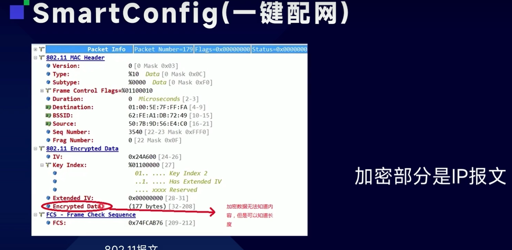
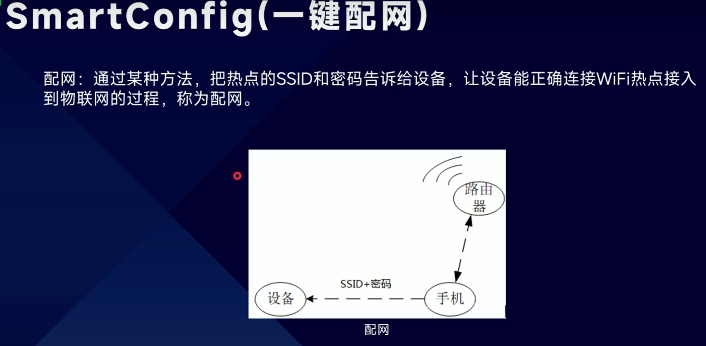
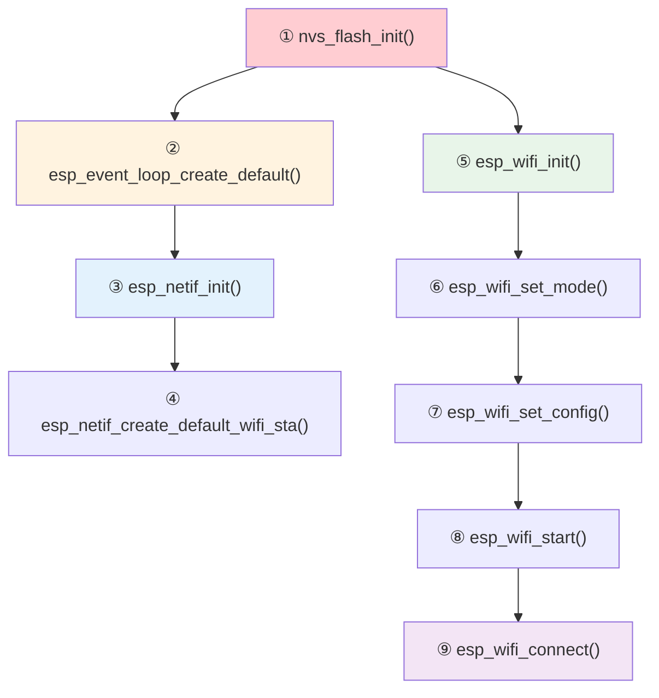
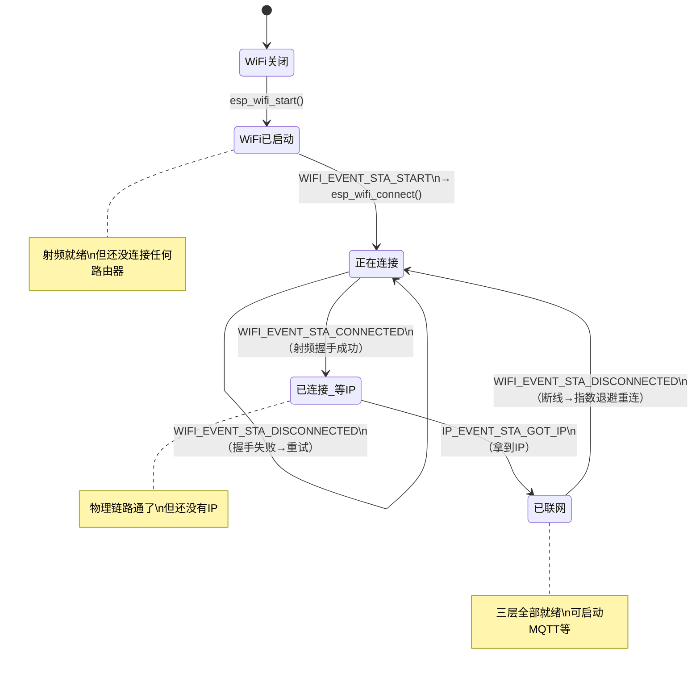
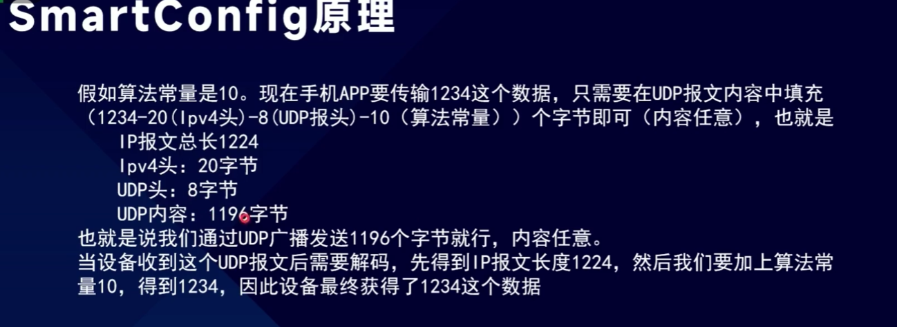
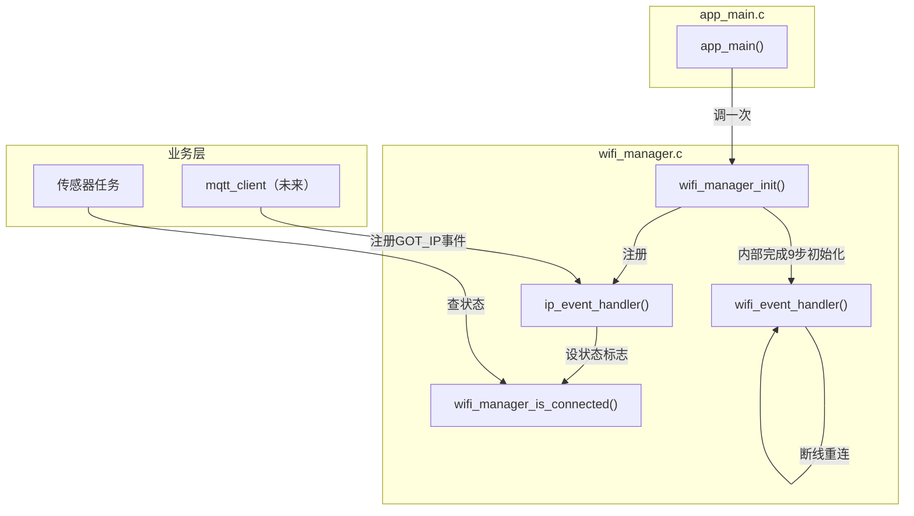
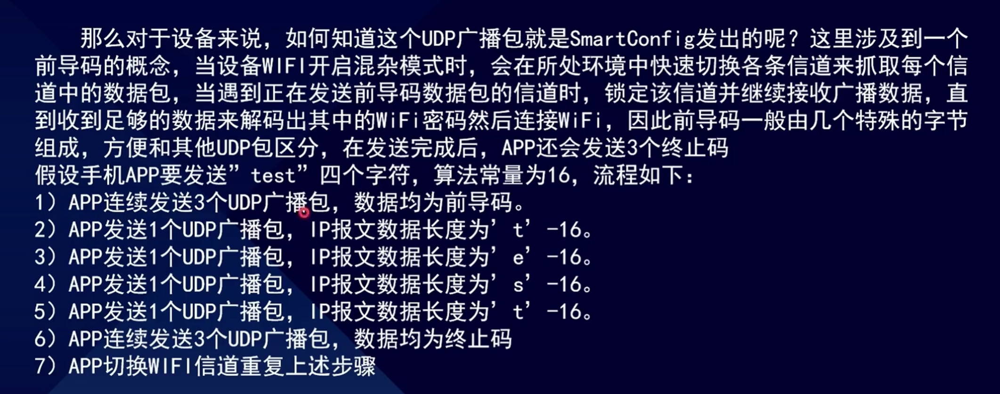
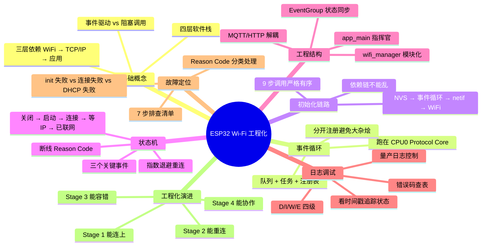

---
aliases:
  - ESP32 WiFi
  - ESP-IDF WiFi
  - WiFi STA
  - WiFi 工程化
tags:
  - 物联网
  - ESP32
  - ESP-IDF
  - WiFi
  - 事件循环
  - 状态机
  - 工程化
date: 2026-05-23
status: evergreen
related:
  - "[[MQTT协议]]"
  - "[[TLS加密协议]]"
  - "[[OTA升级]]"
  - "[[../嵌入式/内存/ESP32/ESP32的系统存储]]"
  - "[[../嵌入式/芯片/架构与指令集/Xtensa LX6 双核架构]]"
  - "[[../嵌入式/芯片/开发板/ESP32-D0WDQ6]]"
---

> [!abstract] 核心摘要
> ESP32 的 Wi-Fi 不是"调一个函数就连上了"，而是一个由 **Wi-Fi 驱动 → TCP/IP 协议栈（esp_netif）→ 事件循环 → 应用层** 组成的异步事件驱动系统。理解四层依赖关系、9 步初始化链路、5 状态状态机、模块职责边界，是从"能连上热点"到"能做产品"的关键跃迁。本篇覆盖从基础概念到工程化演进的完整链路。

---

## 1. Wi-Fi 在 IoT 工程里的角色

### 1.1 三层依赖

手机连 WiFi 访问网页，看起来是一步，实际经历了三层：

```
第1层：Wi-Fi 连接（和路由器握手）     ← 物理链路通了
  ↓ 完成后
第2层：TCP/IP 网络（拿到 IP 地址）    ← 逻辑地址有了
  ↓ 完成后
第3层：应用层（HTTP/MQTT/WebSocket） ← 可以收发数据了
```

> [!important] 严格层层依赖。不能在没连上 Wi-Fi 时访问网页，不能在没拿到 IP 时发 MQTT。

### 1.2 ESP-IDF 的四层软件栈

ESP32 芯片内部有 Wi-Fi 射频模块，不需要外挂任何东西。但射频只是硬件，需要软件来管理：

```
┌──────────────────────────────────────────┐
│  应用层：MQTT / HTTP / WebSocket          │  ← 你写的业务代码
├──────────────────────────────────────────┤
│  TCP/IP 协议栈：esp_netif + lwIP          │  ← 管理 IP、TCP/UDP
├──────────────────────────────────────────┤
│  事件循环：esp_event                      │  ← 贯穿所有层的通知机制
├──────────────────────────────────────────┤
│  Wi-Fi 驱动：esp_wifi                    │  ← 管理射频、扫描、连接
└──────────────────────────────────────────┘
```

| 层级 | 组件 | 解决什么问题 |
|------|------|-------------|
| 射频层 | `esp_wifi` | 搜索信号、握手、维持连接 |
| 通知层 | `esp_event` | 异步事件分发 |
| 网络层 | `esp_netif`（底层 lwIP） | DHCP、IP 地址、TCP/UDP socket |
| 应用层 | `esp_mqtt` / `esp_http` | MQTT 通信、HTTP 请求 |



### 1.3 事件驱动 vs 阻塞调用

> [!warning] STM32 裸机思维 vs ESP32 IoT 思维

```
STM32 裸机思维：
  调用函数 → 阻塞等结果 → 拿到返回值 → 继续
  例：HAL_UART_Transmit(&huart1, data, len, HAL_MAX_DELAY);
      ↑ 一直等到发完才返回

ESP32 IoT 思维：
  注册回调 → 发起请求 → 立刻返回 → 结果到了回调通知你
  例：esp_wifi_connect();
      ↑ 立刻返回，连上了事件循环会调用你的回调
```

**为什么不能阻塞？** ESP32 上同时跑着传感器采集、屏幕刷新、按键扫描等多个 FreeRTOS 任务。如果 `connect()` 阻塞 5 秒，所有任务都卡住，实时性全毁。

**事件循环是解决方案**：Wi-Fi 驱动连上后发一个事件通知，你的回调函数被自动调用。

---

## 2. 事件循环机制

### 2.1 内部原理

事件循环的工作方式像一个邮局：

```
┌─────────────────────────────────────────┐
│  事件循环内部                             │
│                                         │
│  事件队列（FIFO）：                       │
│  ┌─────┐ ┌─────┐ ┌─────┐ ┌─────┐      │
│  │事件A│ │事件B│ │事件C│ │ ... │      │
│  └─────┘ └─────┘ └─────┘ └─────┘      │
│                                         │
│  注册表：                                │
│  WIFI_EVENT_STA_START      → 回调函数X  │
│  WIFI_EVENT_STA_DISCONNECTED → 回调函数X │
│  IP_EVENT_STA_GOT_IP       → 回调函数Y  │
│                                         │
│  循环：取事件 → 查注册表 → 调用对应回调    │
└─────────────────────────────────────────┘
```

`esp_event_loop_create_default()` 做了三件事：

| 动作 | 说明 |
|------|------|
| 创建一个队列 | 存放事件 |
| 创建一个 FreeRTOS 任务 | 不停地从队列取事件并分发 |
| 创建一个注册表 | 记录"哪个事件 → 哪个回调函数" |

### 2.2 事件循环跑在哪个核心

ESP32 是双核的。`app_main()` 默认跑在 **CPU0（Protocol Core）** 上，事件循环也在 CPU0。

```
CPU0（Protocol Core）        CPU1（App Core）
┌─────────────────────┐     ┌─────────────────────┐
│ Wi-Fi 驱动           │     │ 你的业务任务          │
│ TCP/IP 协议栈        │     │ 传感器采集           │
│ 事件循环（默认的）    │     │ MQTT 收发            │
│ 蓝牙驱动             │     │ 显示屏刷新           │
│                      │     │                      │
│ 乐鑫把所有"通信协议"  │     │ 留给你的应用跑        │
│ 都绑在 CPU0 上       │     │                      │
└─────────────────────┘     └─────────────────────┘
```

> [!tip] Protocol Core 名字里就有 "Protocol"——它就是给协议栈准备的。详见 [[../嵌入式/芯片/架构与指令集/Xtensa LX6 双核架构]]。

### 2.3 注册与回调的工作流程

```c
// 注册：告诉系统"WIFI 事件发给 wifi_event_handler"
esp_event_handler_register(WIFI_EVENT, ESP_EVENT_ANY_ID, wifi_event_handler, NULL);

// 注册：告诉系统"IP 事件发给 ip_event_handler"
esp_event_handler_register(IP_EVENT, IP_EVENT_STA_GOT_IP, ip_event_handler, NULL);

// 事件来了，对应函数被自动调用
void wifi_event_handler(...) {
    if (event_id == WIFI_EVENT_STA_START) {
        printf("射频准备好了\n");
    }
}

void ip_event_handler(...) {
    if (event_id == IP_EVENT_STA_GOT_IP) {
        printf("拿到 IP 了！\n");
    }
}
```

---

## 3. 初始化链路详解

### 3.1 完整 9 步调用

```c
void app_main(void) {
    // ①
    nvs_flash_init();
    // ②
    esp_event_loop_create_default();
    // ③
    esp_netif_init();
    // ④
    esp_netif_create_default_wifi_sta();
    // ⑤
    wifi_init_config_t cfg = WIFI_INIT_CONFIG_DEFAULT();
    esp_wifi_init(&cfg);
    // ⑥
    esp_wifi_set_mode(WIFI_MODE_STA);
    // ⑦
    wifi_config_t wifi_config = {
        .sta = {
            .ssid = "MyWiFi",
            .password = "12345678",
        },
    };
    esp_wifi_set_config(WIFI_IF_STA, &wifi_config);
    // ⑧
    esp_wifi_start();
    // ⑨
    esp_wifi_connect();
}
```



### 3.2 每一步的职责与依赖

| 步骤 | API | 做了什么 | 为什么在这个位置 |
|------|-----|---------|----------------|
| ① | `nvs_flash_init()` | 初始化 NVS 分区 | Wi-Fi 驱动内部从 NVS 读射频 PHY 校准数据、信道信息，没有 NVS 就无法初始化硬件 |
| ② | `esp_event_loop_create_default()` | 创建事件队列 + FreeRTOS 任务 + 注册表 | 后面所有层（Wi-Fi、TCP/IP）都要往里注册事件，事件循环必须先存在 |
| ③ | `esp_netif_init()` | 初始化 TCP/IP 协议栈（lwIP） | 提供 DHCP 客户端、DNS、TCP/UDP socket 基础设施，需要事件循环来通知 IP 事件 |
| ④ | `esp_netif_create_default_wifi_sta()` | 创建网络接口对象，绑定 STA 模式 + DHCP 客户端 | 把"Wi-Fi 硬件连接"和"TCP/IP 软件协议栈"粘在一起，需要 esp_netif 已初始化 |
| ⑤ | `esp_wifi_init(&cfg)` | 为 Wi-Fi 驱动分配 RAM 缓冲区、初始化射频硬件、从 NVS 读校准数据、创建内部任务 | 需要 NVS 已初始化。`WIFI_INIT_CONFIG_DEFAULT()` 宏使用 menuconfig 默认参数 |
| ⑥ | `esp_wifi_set_mode(WIFI_MODE_STA)` | 告诉驱动"我要当客户端" | 需要驱动已初始化。必须在 `start()` 之前，就像先挂挡再踩油门 |
| ⑦ | `esp_wifi_set_config()` | 填入 SSID 和密码 | 需要模式已设置。实际产品中从 NVS 读取，不硬编码 |
| ⑧ | `esp_wifi_start()` | 真正启动射频硬件，开始监听信道 | 需要模式和配置都已设好。发出事件 `WIFI_EVENT_STA_START` |
| ⑨ | `esp_wifi_connect()` | 发起连接路由器（异步，立刻返回） | 需要射频已启动。结果通过事件通知 |

### 3.3 依赖链图



> [!important] 每一步都是下一步的前提条件，就像盖楼——地基→框架→管道→装修，不能跳步，不能乱序。

### 3.4 esp_netif_init() 与 DHCP

**DHCP 不是 Wi-Fi 驱动负责的，是 TCP/IP 协议栈（esp_netif）负责的。**

```
Wi-Fi 驱动：                 esp_netif（TCP/IP 协议栈）：
"我和路由器握手成功了"  →  "好，现在我去请求 IP 地址"
                           → 发 DHCP 请求
                           → 路由器回复 IP
                           → 发事件 IP_EVENT_STA_GOT_IP
```

### 3.5 esp_netif_create_default_wifi_sta() 的作用

Wi-Fi 有 STA（客户端）和 AP（热点）两种模式。TCP/IP 协议栈必须知道你是哪种——

- STA 模式：需要 DHCP **客户端**去请求 IP
- AP 模式：需要 DHCP **服务器**去给别人分配 IP

`esp_netif_create_default_wifi_sta()` 做的事：创建网络接口对象 → 绑定 STA 模式 → 自动配置 DHCP 客户端 → 把网络接口和 Wi-Fi 驱动粘在一起。

### 3.6 esp_wifi_init() 内部细节

Wi-Fi 驱动的资源是**运行时动态分配**的（不是编译时固定），因为 ESP32 内存紧张（520KB SRAM），不用 Wi-Fi 时不能浪费。

```
esp_wifi_init(&cfg) 做了什么：
1. 根据 cfg 参数，为 Wi-Fi 驱动分配 RAM 缓冲区
   - 发送/接收帧缓冲
   - DMA 描述符
   - 内部任务栈
2. 初始化 Wi-Fi 硬件（射频前端、基带）
3. 从 NVS 读取 PHY 校准数据
4. 创建 Wi-Fi 驱动内部的 FreeRTOS 任务
```

---

## 4. Wi-Fi 状态机

### 4.1 完整状态转换图





### 4.2 三个关键事件详解

| 事件 | 含义 | 状态转换 | 拿到 IP 了吗 |
|------|------|---------|-------------|
| `WIFI_EVENT_STA_START` | 射频硬件已启动，随时可以连接 | 关闭 → 已启动 | 否 |
| `WIFI_EVENT_STA_CONNECTED` | 射频握手成功，物理链路通了 | 连接中 → 已连接 | 否，DHCP 还在进行 |
| `IP_EVENT_STA_GOT_IP` | DHCP 完成，拿到 IP 地址 | 等IP → 已联网 | 是 |

> [!warning] 最常见的误解：以为 `WIFI_EVENT_STA_CONNECTED` 就"连上了"。实际上只代表射频握手成功，还没有 IP。必须等到 `IP_EVENT_STA_GOT_IP` 才算三层全部就绪。

### 4.3 断线事件

`WIFI_EVENT_STA_DISCONNECTED` 意味着 **Wi-Fi 层（最底层）断了**：

```
Wi-Fi 断线时：
  Wi-Fi 层：   ✗ 射频连接断了
  TCP/IP 层：  ✗ IP 地址失效
  应用层：     ✗ MQTT 必然断开

一个 DISCONNECTED 事件 = 三层全部失效
就像拔了网线——不管上面跑了多少应用，全部断了
```

### 4.4 断线 Reason Code

| Reason Code | 含义 | 重连策略 |
|-------------|------|---------|
| 2 | 认证过期（密码错误） | 重试 3 次后放弃，通知用户重新配网 |
| 4 | 握手超时（信号太弱） | 指数退避重连 |
| 8 | 路由器主动把你踢了 | 等久一点再重连 |
| 15 | 4-way handshake 失败（密码错误） | 重试 3 次后放弃 |
| 200 | Beacon 超时（路由器消失/信号断） | 指数退避，永不放弃 |

> [!tip] 不同的 reason code 应该有不同的重连策略。密码错了重连一万次也连不上，信号断了过一会可能就好。

### 4.5 重连逻辑放在哪一层

**重连是 Wi-Fi 层自身的职责——"我断了，我自己重连"。** 在事件回调里直接调 `esp_wifi_connect()`：

```c
if (event_id == WIFI_EVENT_STA_DISCONNECTED) {
    esp_wifi_connect();
}
```

但必须加**指数退避**防止无限循环：

```c
static int retry_count = 0;
static const int MAX_RETRY_INTERVAL = 30;

if (event_id == WIFI_EVENT_STA_DISCONNECTED) {
    wifi_event_sta_disconnected_t *event = (wifi_event_sta_disconnected_t *)data;
    
    switch (event->reason) {
        case WIFI_REASON_AUTH_EXPIRE:
        case WIFI_REASON_4WAY_HANDSHAKE_TIMEOUT:
            retry_count++;
            if (retry_count > 3) {
                ESP_LOGE(TAG, "Auth failed, need re-provision");
                xEventGroupClearBits(s_wifi_event_group, CONNECTED_BIT);
                break;
            }
            esp_wifi_connect();
            break;
            
        case WIFI_REASON_BEACON_TIMEOUT:
        case WIFI_REASON_ASSOC_LEAVE:
        default:
            retry_count++;
            int delay = (1 << retry_count);
            if (delay > MAX_RETRY_INTERVAL) delay = MAX_RETRY_INTERVAL;
            ESP_LOGW(TAG, "Disconnected, retry %d in %ds", retry_count, delay);
            vTaskDelay(pdMS_TO_TICKS(delay * 1000));
            esp_wifi_connect();
            break;
    }
}

if (event_id == IP_EVENT_STA_GOT_IP) {
    retry_count = 0;
}
```

---

## 5. 最小 STA 工程结构

### 5.1 文件职责划分

```
main/
├── app_main.c          ← 指挥官：初始化 + 启动任务
├── wifi_manager.c/h    ← Wi-Fi 管理：连接、重连、状态维护
└── mqtt_client.c/h     ← MQTT 通信（结构上先留好位置）
```

| 文件 | 职责 | 不应该做的事 |
|------|------|-------------|
| `app_main.c` | 初始化各模块 + 启动 FreeRTOS 任务 | 不包含业务逻辑，不超过 30 行 |
| `wifi_manager.c` | 连接、重连、状态维护、从 NVS 读配置 | 不知道 MQTT 的存在 |
| `mqtt_client.c` | MQTT 通信 | 不直接操作 Wi-Fi |

### 5.2 模块接口设计

**最小工程只需要两个接口：**

| 接口 | 为什么需要 |
|------|-----------|
| `wifi_manager_init()` | `app_main()` 调一次，内部完成全部 9 步初始化 |
| `wifi_manager_is_connected()` | 业务任务查询"网络通了没"，决定要不要上报数据 |

> [!tip] `connect` 和 `disconnect` 以后需要时再加。最小工程的思想：只做当前需要的。

### 5.3 app_main() 示例

```c
// app_main.c — 极简，只做调度
void app_main(void) {
    wifi_manager_init();
    // 未来：mqtt_client_init();
    // 未来：xTaskCreate(sensor_task, ...);
}
```

### 5.4 wifi_manager_init() 内部

```c
void wifi_manager_init(void) {
    // 1. NVS（Wi-Fi 驱动内部要用）
    nvs_flash_init();
    
    // 2. 事件循环
    esp_event_loop_create_default();
    
    // 3. TCP/IP
    esp_netif_init();
    esp_netif_create_default_wifi_sta();
    
    // 4. Wi-Fi 驱动
    wifi_init_config_t cfg = WIFI_INIT_CONFIG_DEFAULT();
    esp_wifi_init(&cfg);
    esp_wifi_set_mode(WIFI_MODE_STA);
    
    // 5. 从 NVS 读 SSID/密码
    wifi_config_t wifi_config = {0};
    load_wifi_config_from_nvs(&wifi_config);
    esp_wifi_set_config(WIFI_IF_STA, &wifi_config);
    
    // 6. 注册事件回调
    esp_event_handler_register(WIFI_EVENT, ESP_EVENT_ANY_ID, wifi_event_handler, NULL);
    esp_event_handler_register(IP_EVENT, IP_EVENT_STA_GOT_IP, ip_event_handler, NULL);
    
    // 7. 启动
    esp_wifi_start();
    // connect 在 WIFI_EVENT_STA_START 回调里自动调用
}
```

### 5.5 SSID/密码配置持久化

实际产品不硬编码，从 NVS 读取：

```
第一次使用（配网）：
  用户通过手机 App / Web 页面 / SmartConfig 输入 WiFi 密码
  → 写入 NVS：nvs_set_str(handle, "ssid", "MyWiFi");

之后每次开机：
  → 从 NVS 读出 SSID 和密码
  → 填进 wifi_config_t
  → esp_wifi_set_config()
  → esp_wifi_connect()
```

### 5.6 事件回调分开注册——避免大杂烩

```c
// Wi-Fi 事件 → 给 Wi-Fi 模块处理
esp_event_handler_register(WIFI_EVENT, ESP_EVENT_ANY_ID, wifi_event_handler, NULL);

// IP 事件 → 给网络管理器处理
esp_event_handler_register(IP_EVENT, IP_EVENT_STA_GOT_IP, ip_event_handler, NULL);

// MQTT 事件（未来） → 给 MQTT 模块处理
esp_event_handler_register(MQTT_EVENT, ESP_EVENT_ANY_ID, mqtt_event_handler, NULL);
```

```
wifi_event_handler()          ip_event_handler()         mqtt_event_handler()
┌─────────────────────┐     ┌──────────────────┐       ┌────────────────────┐
│ STA_START:          │     │ GOT_IP:          │       │ MQTT_CONNECTED:    │
│   esp_wifi_connect()│     │   启动 MQTT      │       │   订阅主题         │
│                     │     │   通知业务层      │       │                    │
│ STA_DISCONNECTED:   │     └──────────────────┘       │ MQTT_DISCONNECTED: │
│   指数退避重连       │                                │   标记离线         │
│   通知业务层        │                                │                    │
└─────────────────────┘                                └────────────────────┘
```

### 5.7 模块间解耦：EventGroup 通信

**Wi-Fi 模块不知道 MQTT，MQTT 不知道 Wi-Fi。它们通过"状态位"通信。**

```c
// 全局 EventGroup
static EventGroupHandle_t s_wifi_event_group;
#define WIFI_CONNECTED_BIT  BIT0
#define GOT_IP_BIT          BIT1
#define MQTT_CONNECTED_BIT  BIT2

// Wi-Fi 回调：连上设 Bit0，拿IP设 Bit1
// MQTT 回调：连上设 Bit2，断开清 Bit2

// 业务任务：等待全部就绪
EventBits_t bits = xEventGroupWaitBits(
    s_wifi_event_group,
    WIFI_CONNECTED_BIT | GOT_IP_BIT,
    pdFALSE, pdTRUE, portMAX_DELAY
);

// 任何一个 Bit 清除 → 暂停上报
```

### 5.8 完整调用关系



---

## 6. 日志阅读与故障定位

### 6.1 日志级别

```
D (3245) wifi: ...     ← Debug 调试细节，最详细
I (3245) wifi: ...     ← Info 正常运行信息
W (5000) wifi: ...     ← Warning 警告
E (8234) wifi: ...     ← Error 错误
```

| 级别 | 字母 | 含义 | 什么时候出现 |
|------|------|------|-------------|
| Debug | D | 调试细节 | 正常运行时大量输出 |
| Info | I | 正常信息 | 启动、连接、状态变化 |
| Warning | W | 警告 | 不正常但还没出错 |
| Error | E | 错误 | 操作失败了 |

> [!tip] 括号里的数字（3245）是从开机到这条日志经过的**毫秒数**。

### 6.2 成功连接的日志链路

```
第1阶段：启动（时间戳 320~340ms）
─────────────────────────────────────
I (320) wifi:init nim low priority task    ← esp_wifi_init()
I (330) wifi:mode : sta(30:ae:a4:xx:xx)   ← esp_wifi_set_mode()
I (340) wifi_station: WiFi started         ← esp_wifi_start()
                                             WIFI_EVENT_STA_START

第2阶段：连接中（时间戳 350~1210ms）
─────────────────────────────────────
I (350) wifi_station: Connecting...        ← esp_wifi_connect()
I (1200) wifi:new:<1,0>...                 ← 找到信道 1
I (1210) wifi:station: xx:xx join, AID=1   ← 握手成功
                                             WIFI_EVENT_STA_CONNECTED

第3阶段：拿IP（时间戳 1500~1700ms）
─────────────────────────────────────
I (1500) wifi_station: Waiting for IP...   ← 等DHCP
I (1700) example: Got IP: 192.168.1.100   ← DHCP 完成
                                             IP_EVENT_STA_GOT_IP
```

> [!important] 看日志的关键技巧：看时间戳。从 320ms 到 1700ms，整个连接约 1.4 秒。如果某一阶段时间戳突然跳到好几秒甚至几十秒，那一层就出了问题。

### 6.3 连接失败的日志分析

```
I (340) wifi_station: WiFi started
I (350) wifi_station: Connecting to SSID: MyWiFi...
W (5350) wifi_manager: retry count: 1       ← 5秒后超时，第1次重试
W (10350) wifi_manager: retry count: 2      ← 又5秒，第2次重试
E (15350) wifi: esp_wifi_connect failed: 0x3001
```

**缺失的日志是关键证据**：

```
成功的日志有，但失败的日志里从未出现的：
✗ wifi:new:<1,0>...           ← 从来没找到路由器
✗ wifi:station: xx:xx join    ← 从来没握手成功
✗ Got IP: 192.168.1.100       ← 从来没拿到 IP
```

**连接一直卡在"连接中"阶段，从来没进入过"已连接"。**



### 6.4 错误码速查

`esp_err_to_name()` 把错误码翻译成人话：

```c
ESP_LOGE(TAG, "connect failed: %s", esp_err_to_name(err));
// 输出：connect failed: ESP_ERR_WIFI_CONN
```

| 错误码 | 名称 | 含义 |
|--------|------|------|
| `0x3001` | `ESP_ERR_WIFI_CONN` | 连接失败（SSID 错误/密码错误/超时） |
| `0x3002` | `ESP_ERR_WIFI_NOT_INIT` | 没调 `esp_wifi_init()` 就调了其他函数 |
| `0x3003` | `ESP_ERR_WIFI_NOT_STARTED` | 没调 `esp_wifi_start()` 就 connect 了 |
| `0x3007` | `ESP_ERR_WIFI_PASSWORD` | 密码长度不对（WPA2 要求 8~63 字符） |
| `0x300A` | `ESP_ERR_WIFI_TIMEOUT` | 连接超时（路由器没回应） |

### 6.5 自己的日志加在哪

| 位置 | 打什么日志 | 为什么 |
|------|-----------|--------|
| `wifi_manager_init()` | 每步初始化成功/失败 | 初始化阶段没有事件回调，只能靠自己打印 |
| 事件回调 | 每个事件的状态变化 | 运行阶段追踪状态机 |

```c
void wifi_manager_init(void) {
    ESP_LOGI(TAG, "Initializing NVS...");
    esp_err_t err = nvs_flash_init();
    if (err != ESP_OK) {
        ESP_LOGE(TAG, "NVS init failed: %s", esp_err_to_name(err));
        return;
    }
    ESP_LOGI(TAG, "Creating event loop...");
    // ...
}
```

> [!warning] 如果 `esp_wifi_init()` 就失败了，事件回调根本不会触发。你看不到任何事件日志，看起来像"什么都没发生"——其实是最致命的错误。所以 init 里每一步都要打印。

### 6.6 量产环境日志控制

```c
// 开发时：wifi_manager 开 Debug
esp_log_level_set("wifi_manager", ESP_LOG_DEBUG);

// 量产时：只保留 Warning 以上
esp_log_level_set("wifi_manager", ESP_LOG_WARN);
esp_log_level_set("wifi", ESP_LOG_WARN);     // 关掉乐鑫 Wi-Fi 驱动的 Info 日志
```

或在 `menuconfig` 里全局设置：

```
Component config → Log output → Default log verbosity → Warning
```

> [!tip] 量产设备正常运行时串口是"安静"的，只有在出错时才输出 W 和 E 级别的日志。

### 6.7 断线 Reason Code 与重连策略匹配

```c
if (event_id == WIFI_EVENT_STA_DISCONNECTED) {
    wifi_event_sta_disconnected_t *event = (wifi_event_sta_disconnected_t *)data;
    
    switch (event->reason) {
        case WIFI_REASON_AUTH_EXPIRE:
        case WIFI_REASON_4WAY_HANDSHAKE_TIMEOUT:
            retry_count++;
            if (retry_count > 3) {
                ESP_LOGE(TAG, "Auth failed, need re-provision");
                break;
            }
            esp_wifi_connect();
            break;
            
        case WIFI_REASON_BEACON_TIMEOUT:
        case WIFI_REASON_ASSOC_LEAVE:
        default:
            retry_count++;
            int delay = (1 << retry_count);
            if (delay > 30) delay = 30;
            vTaskDelay(pdMS_TO_TICKS(delay * 1000));
            esp_wifi_connect();
            break;
    }
}
```

### 6.8 Wi-Fi 故障定位 7 步清单

| 步骤 | 看什么 | 怎么判断 |
|------|--------|---------|
| **1** | 有没有 `wifi:init` 日志？ | 没有 → `esp_wifi_init()` 失败，检查 NVS |
| **2** | 有没有 `WiFi started`？ | 没有 → `esp_wifi_start()` 失败，检查初始化顺序 |
| **3** | 有没有 `wifi:new:<信道号>`？ | 没有 → 找不到路由器，检查 SSID 拼写 |
| **4** | 有没有 `station: xx:xx join`？ | 没有 → 握手失败，检查密码 |
| **5** | 有没有 `Got IP`？ | 没有 → DHCP 失败，检查 `esp_netif` 初始化 |
| **6** | 有没有 E 级别错误码？ | 有 → 查 `esp_err_to_name()` |
| **7** | 连上后突然断了？ | 看 DISCONNECTED 日志里的 reason code |

---

## 7. 从教学 Demo 到工程化实现

### 7.1 教学 Demo 的典型特征

```c
// 典型教学 Demo：能连上，但距离产品很远
void event_handler(void *arg, esp_event_base_t base, int32_t id, void *data) {
    if (id == WIFI_EVENT_STA_START) {
        esp_wifi_connect();
    } else if (id == WIFI_EVENT_STA_DISCONNECTED) {
        esp_wifi_connect();                    // 无限重连，没有退避
    } else if (id == IP_EVENT_STA_GOT_IP) {
        mqtt_app_start();                      // 回调里直接启动 MQTT，耦合
    }
}

void app_main(void) {
    nvs_flash_init();
    esp_netif_init();
    esp_event_loop_create_default();
    esp_netif_create_default_wifi_sta();
    
    wifi_init_config_t cfg = WIFI_INIT_CONFIG_DEFAULT();
    esp_wifi_init(&cfg);
    
    esp_event_handler_register(WIFI_EVENT, ESP_EVENT_ANY_ID, event_handler, NULL);
    esp_event_handler_register(IP_EVENT, IP_EVENT_STA_GOT_IP, event_handler, NULL);
    
    wifi_config_t wifi_config = {
        .sta = { .ssid = "MyWiFi", .password = "hardcoded" }  // 硬编码
    };
    esp_wifi_set_mode(WIFI_MODE_STA);
    esp_wifi_set_config(WIFI_IF_STA, &wifi_config);
    esp_wifi_start();
}
```

### 7.2 八个维度的差距分析

| 维度 | 教学 Demo | 工程化实现 |
|------|-----------|-----------|
| **重连机制** | `esp_wifi_connect()` 无限循环调用 | 指数退避 + reason code 分类策略 + 最大重试次数 |
| **超时控制** | 无超时，一直等 | 连接超时检测、DHCP 超时检测、全局看门狗 |
| **日志与状态上报** | `printf` 或无日志 | ESP_LOG 分级 + 状态机日志 + 关键指标上报服务器 |
| **配置持久化** | SSID/密码硬编码在代码里 | NVS 存储 + 配网流程（SmartConfig/BLE/Web） |
| **异常处理** | 不检查返回值 | 每步检查 `esp_err_t`，NVS 损坏自动重建，init 失败有恢复路径 |
| **任务通信** | 全局变量或无 | FreeRTOS EventGroup / 队列，模块间零耦合 |
| **与 MQTT 解耦** | `IP_EVENT_STA_GOT_IP` 回调里直接启动 MQTT | 状态标志 + 事件通知，MQTT 自己注册 GOT_IP 事件 |
| **连接状态同步** | 无全局状态 | 连接状态枚举 + 回调通知机制，业务层可查询可订阅 |

### 7.3 演进路线

```mermaid
flowchart LR
    subgraph Stage1["Stage 1：能连上"]
        S1["硬编码 SSID/密码"]
        S2["单文件实现"]
        S3["无重连"]
        S4["无日志"]
    end

    subgraph Stage2["Stage 2：能重连"]
        S5["指数退避重连"]
        S6["reason code 分类"]
        S7["重试上限"]
    end

    subgraph Stage3["Stage 3：能容错"]
        S8["返回值全面检查"]
        S9["ESP_LOG 分级日志"]
        S10["超时检测"]
        S11["NVS 损坏恢复"]
    end

    subgraph Stage4["Stage 4：能协作"]
        S12["wifi_manager 模块化"]
        S13["EventGroup 状态同步"]
        S14["NVS 配置持久化 + 配网"]
        S15["MQTT/HTTP 解耦"]
        S16["量产日志控制"]
    end

    Stage1 --> Stage2 --> Stage3 --> Stage4
```



#### Stage 1：能连上（教学 Demo）

- 硬编码 SSID/密码
- 所有代码在一个文件
- 无重连、无日志、无错误处理
- **能跑通，但完全不能用于产品**

#### Stage 2：能重连

- 指数退避重连策略
- 按 reason code 分类处理（密码错误 vs 信号断了）
- 重试上限（认证失败 3 次放弃）
- 连上后重置退避计数器

#### Stage 3：能容错

- 每步初始化检查 `esp_err_t` 返回值
- NVS 损坏自动擦除重建
- 连接超时检测（单次 connect 超过 N 秒视为失败）
- DHCP 超时检测
- ESP_LOG 分级日志（init 每步 + 事件回调状态变化）

#### Stage 4：能协作

- `wifi_manager.c` 独立模块，对外暴露 `init()` + `is_connected()`
- EventGroup 实现模块间状态同步
- SSID/密码从 NVS 读取 + 配网流程
- MQTT 注册自己的 GOT_IP 事件，不依赖 Wi-Fi 回调
- 量产环境只保留 W + E 级别日志

### 7.4 工程化 wifi_manager 代码框架

```c
// wifi_manager.h
typedef enum {
    WIFI_STATE_IDLE,
    WIFI_STATE_CONNECTING,
    WIFI_STATE_CONNECTED_WAIT_IP,
    WIFI_STATE_CONNECTED,
    WIFI_STATE_DISCONNECTED,
    WIFI_STATE_FAILED,
} wifi_state_t;

typedef void (*wifi_state_cb_t)(wifi_state_t state);

void wifi_manager_init(void);
bool wifi_manager_is_connected(void);
wifi_state_t wifi_manager_get_state(void);
void wifi_manager_register_state_cb(wifi_state_cb_t cb);
```

```c
// wifi_manager.c
static wifi_state_t s_state = WIFI_STATE_IDLE; // 当前Wi-Fi状态
static int s_retry_count = 0;                  // 当前重连次数
static const int MAX_RETRY = 10;               // 最大重连尝试次数
static const int MAX_RETRY_INTERVAL = 30;      // 最大重连等待间隔（秒）
static EventGroupHandle_t s_event_group;       // 事件组句柄（用于同步）
static wifi_state_cb_t s_state_cb = NULL;      // 状态改变时的回调函数指针

#define WIFI_CONNECTED_BIT  BIT0
#define GOT_IP_BIT          BIT1

static void set_state(wifi_state_t new_state) {
    if (s_state != new_state) {
        ESP_LOGI(TAG, "State: %d → %d", s_state, new_state);
        s_state = new_state;
        if (s_state_cb) s_state_cb(new_state);
    }
}

static void wifi_event_handler(void *arg, esp_event_base_t base,
                                int32_t id, void *event_data) {
    switch (id) {
    case WIFI_EVENT_STA_START:
        ESP_LOGI(TAG, "WiFi started, connecting...");
        set_state(WIFI_STATE_CONNECTING);
        esp_wifi_connect();
        break;

    case WIFI_EVENT_STA_CONNECTED:
        ESP_LOGI(TAG, "Connected, waiting for IP...");
        set_state(WIFI_STATE_CONNECTED_WAIT_IP);
        xEventGroupSetBits(s_event_group, WIFI_CONNECTED_BIT);
        break;

    case WIFI_EVENT_STA_DISCONNECTED: {
        wifi_event_sta_disconnected_t *evt = (wifi_event_sta_disconnected_t *)event_data;
        ESP_LOGW(TAG, "Disconnected, reason=%d, retry=%d", evt->reason, s_retry_count);
        xEventGroupClearBits(s_event_group, WIFI_CONNECTED_BIT | GOT_IP_BIT);
        set_state(WIFI_STATE_DISCONNECTED);

        if (evt->reason == WIFI_REASON_AUTH_EXPIRE ||
            evt->reason == WIFI_REASON_4WAY_HANDSHAKE_TIMEOUT) {
            if (s_retry_count >= 3) {
                ESP_LOGE(TAG, "Auth failed, need re-provision");
                set_state(WIFI_STATE_FAILED);
                break;
            }
        }

        if (s_retry_count < MAX_RETRY) {
            int delay = (1 << s_retry_count);
            if (delay > MAX_RETRY_INTERVAL) delay = MAX_RETRY_INTERVAL;
            ESP_LOGI(TAG, "Retry in %ds...", delay);
            vTaskDelay(pdMS_TO_TICKS(delay * 1000));
            s_retry_count++;
            esp_wifi_connect();
        } else {
            ESP_LOGE(TAG, "Max retries reached");
            set_state(WIFI_STATE_FAILED);
        }
        break;
    }

    default:
        break;
    }
}

static void ip_event_handler(void *arg, esp_event_base_t base,
                              int32_t id, void *event_data) {
    if (id == IP_EVENT_STA_GOT_IP) {
        ip_event_got_ip_t *evt = (ip_event_got_ip_t *)event_data;
        ESP_LOGI(TAG, "Got IP: " IPSTR, IP2STR(&evt->ip_info.ip));
        s_retry_count = 0;
        xEventGroupSetBits(s_event_group, GOT_IP_BIT);
        set_state(WIFI_STATE_CONNECTED);
    }
}

static bool load_wifi_config(wifi_config_t *config) {
    nvs_handle_t handle;
    if (nvs_open("wifi", NVS_READONLY, &handle) != ESP_OK) {
        ESP_LOGW(TAG, "No WiFi config in NVS");
        return false;
    }
    size_t len = sizeof(config->sta.ssid);
    if (nvs_get_str(handle, "ssid", (char *)config->sta.ssid, &len) != ESP_OK) {
        nvs_close(handle);
        return false;
    }
    len = sizeof(config->sta.password);
    nvs_get_str(handle, "password", (char *)config->sta.password, &len);
    nvs_close(handle);
    ESP_LOGI(TAG, "Loaded config: SSID=%s", (char *)config->sta.ssid);
    return true;
}

void wifi_manager_init(void) {
    s_event_group = xEventGroupCreate();

    ESP_LOGI(TAG, "Initializing NVS...");
    esp_err_t err = nvs_flash_init();
    if (err == ESP_ERR_NVS_NO_FREE_PAGES ||
        err == ESP_ERR_NVS_NEW_VERSION_FOUND) {
        ESP_LOGW(TAG, "NVS corrupt, erasing...");
        nvs_flash_erase();
        nvs_flash_init();
    }

    ESP_LOGI(TAG, "Creating event loop...");
    esp_event_loop_create_default();

    ESP_LOGI(TAG, "Initializing netif...");
    esp_netif_init();
    esp_netif_create_default_wifi_sta();

    ESP_LOGI(TAG, "Initializing Wi-Fi driver...");
    wifi_init_config_t cfg = WIFI_INIT_CONFIG_DEFAULT();
    esp_wifi_init(&cfg);

    ESP_LOGI(TAG, "Registering event handlers...");
    esp_event_handler_register(WIFI_EVENT, ESP_EVENT_ANY_ID, wifi_event_handler, NULL);
    esp_event_handler_register(IP_EVENT, IP_EVENT_STA_GOT_IP, ip_event_handler, NULL);

    wifi_config_t wifi_config = {0};
    if (!load_wifi_config(&wifi_config)) {
        ESP_LOGW(TAG, "Using default config (should run provisioning)");
        strcpy((char *)wifi_config.sta.ssid, "MyWiFi");
        strcpy((char *)wifi_config.sta.password, "12345678");
    }

    esp_wifi_set_mode(WIFI_MODE_STA);
    esp_wifi_set_config(WIFI_IF_STA, &wifi_config);

    ESP_LOGI(TAG, "Starting Wi-Fi...");
    esp_wifi_start();
}

bool wifi_manager_is_connected(void) {
    EventBits_t bits = xEventGroupGetBits(s_event_group);
    return (bits & (WIFI_CONNECTED_BIT | GOT_IP_BIT)) == (WIFI_CONNECTED_BIT | GOT_IP_BIT);
}

wifi_state_t wifi_manager_get_state(void) {
    return s_state;
}

void wifi_manager_register_state_cb(wifi_state_cb_t cb) {
    s_state_cb = cb;
}
```

```c
// app_main.c
void app_main(void) {
    wifi_manager_init();
    // 未来：mqtt_client_init();
    // 未来：xTaskCreate(sensor_task, "sensor", 4096, NULL, 5, NULL);
}
```

---

## 8. 知识体系总图



---

## 关键概念速查

| 概念 | 说明 |
|------|------|
| **esp_wifi** | Wi-Fi 射频驱动，管理连接和射频硬件 |
| **esp_netif** | TCP/IP 协议栈抽象层（底层 lwIP），管理 IP/DHCP |
| **esp_event** | 事件循环，异步通知机制 |
| **WIFI_EVENT_STA_START** | 射频已启动，可以发起连接 |
| **WIFI_EVENT_STA_CONNECTED** | 射频握手成功，但还没有 IP |
| **IP_EVENT_STA_GOT_IP** | DHCP 完成，三层全部就绪 |
| **WIFI_EVENT_STA_DISCONNECTED** | 断线，三层全部失效，携带 reason code |
| **WIFI_INIT_CONFIG_DEFAULT()** | 使用 menuconfig 默认参数初始化 Wi-Fi 驱动 |
| **指数退避** | 重连间隔 1→2→4→8→16→30s，避免无限刷日志 |
| **EventGroup** | FreeRTOS 事件组，模块间状态同步，零耦合 |
| **wifi_manager** | 封装 Wi-Fi 管理的独立模块，对外暴露 init + is_connected |
| **Reason Code** | 断线原因码，决定重连策略 |
| **esp_err_to_name()** | 错误码翻译为人可读的字符串 |

---

## 面试高频问题

> [!example]- Q1：ESP32 Wi-Fi 初始化的 9 步为什么不能乱序？
> 每一步都是下一步的前提条件：NVS 是 Wi-Fi 驱动读校准数据的前提；事件循环是所有层注册事件的前提；esp_netif 是 DHCP 拿 IP 的前提；Wi-Fi 驱动初始化是设置模式的前提；模式设置是 start 的前提；start 是 connect 的前提。依赖链：NVS → 事件循环 → netif → WiFi init → mode → config → start → connect。

> [!example]- Q2：WIFI_EVENT_STA_CONNECTED 和 IP_EVENT_STA_GOT_IP 有什么区别？
> CONNECTED 只代表射频握手成功，物理链路通了，但还没有 IP 地址。GOT_IP 代表 DHCP 完成，拿到了 IP，三层全部就绪。必须等 GOT_IP 才能启动 MQTT/HTTP 等应用。

> [!example]- Q3：为什么重连要指数退避？不同断线原因的策略为什么不一样？
> 无限重连会导致日志刷屏、系统资源浪费。指数退避（1→2→4→8→30s）让系统逐渐冷静。不同 reason code 策略不同：密码错误（reason=2/15）重试几次后放弃，因为密码错了重连一万次也连不上；信号断了（reason=200）应该永不放弃重连，因为信号可能恢复。

> [!example]- Q4：Wi-Fi 模块和 MQTT 模块怎么解耦？
> Wi-Fi 模块不知道 MQTT 的存在。解耦方式：(1) Wi-Fi 通过 EventGroup 设置连接状态位；(2) MQTT 自己注册 IP_EVENT_STA_GOT_IP 事件，拿到 IP 后自己启动；(3) 业务任务通过 wifi_manager_is_connected() 查询状态。三方互不知道对方内部细节。

> [!example]- Q5：Wi-Fi 日志故障定位的基本思路是什么？
> 看时间戳追踪状态机每个阶段的耗时。对比成功和失败的日志，找出缺失的阶段。缺少 `wifi:init` → init 失败；缺少 `wifi:new` → 找不到路由器；缺少 `station join` → 握手失败（密码错）；缺少 `Got IP` → DHCP 失败。最后查 E 级别错误码和 reason code。

> [!example]- Q6：教学 Demo 和工程化实现的核心差距是什么？
> 教学 Demo：硬编码密码、无限重连、无错误处理、回调里直接启动 MQTT、所有代码一个文件。工程化：NVS 持久化配置、指数退避 + reason 分类重连、全面错误处理、模块化解耦、EventGroup 状态同步、分级日志、配网流程。核心是从"能跑通"到"能容错、能协作、能量产"。

---

## 踩坑记录

> [!bug] 实战经验填充区
> （项目开发中遇到的 Wi-Fi 相关问题记录于此）

---

## 继续阅读

- [[MQTT协议]] — Wi-Fi 连上后最常用的应用层协议
- [[../嵌入式/内存/ESP32/ESP32的系统存储]] — NVS 存储原理、分区表、SSID 密码持久化
- [[../嵌入式/芯片/架构与指令集/Xtensa LX6 双核架构]] — 双核架构、CPU0 Protocol Core、Cache 一致性
- [[../嵌入式/芯片/开发板/ESP32-D0WDQ6]] — ESP32 开发板详解、GPIO 映射、PSRAM
- [[../嵌入式/操作系统与内核/01_通用理论/Bootloader]] — ESP32 启动流程与 Bootloader
