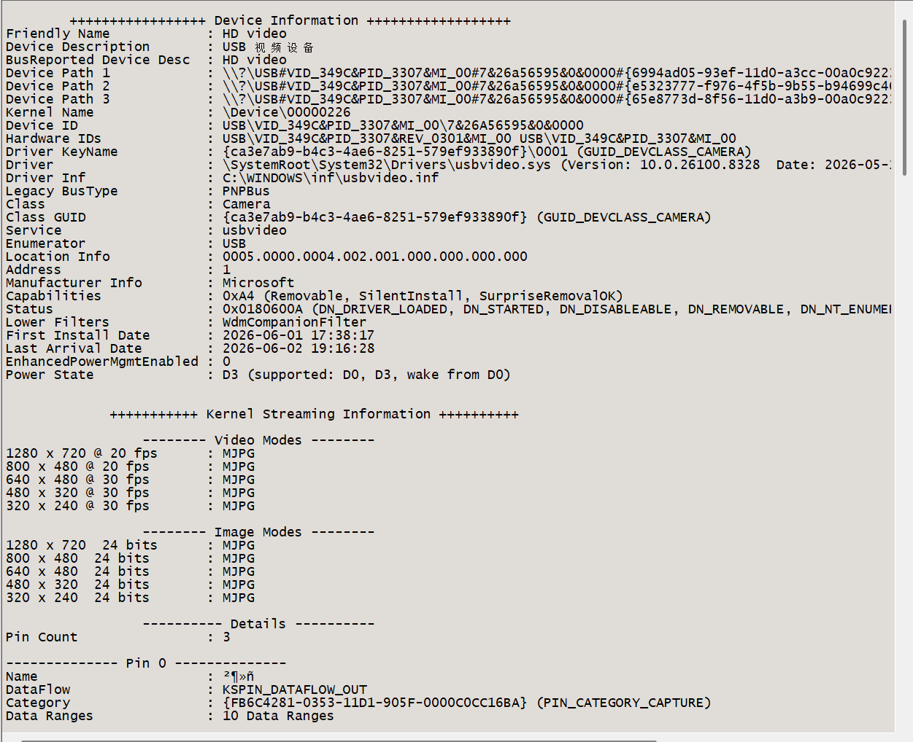

但 USB 摄像头不是这样。摄像头不是你发一条 "GET IMAGE"，它就回一张图。UVC 摄像头需要经历一套更复杂的流程：

`枚举设备 读取描述符 确认它是 UVC 摄像头 选择视频格式 选择分辨率 选择 FPS 打开视频流 持续接收图像帧`

所以摄像头需要专门的 UVC Host driver。

**3. 为什么要两层 driver**  
ESP32-S3 这边有两层：

`USB Host Driver UVC Host Driver`

USB Host Driver 负责最底层 USB 事情：

`设备插入 设备枚举 端点传输 USB 事件处理 设备断开`

它只知道“有个 USB 设备来了”，不一定知道这是摄像头、键盘还是 CH552G。

UVC Host Driver 负责摄像头协议：

`识别 UVC 接口 读取摄像头支持的格式 配置 MJPEG / YUY2 配置 320x240 / 640x480 启动 stream 接收 frame`

所以关系是：

`USB Host Driver：负责 USB 总线 UVC Host Driver：负责摄像头语义`

start stream
  -> callback 收到 frame
  -> queue 交给任务
  -> 打印 frame->data_len
  -> return frame
  -> stop stream

**3. camera_uvc_capture_one_frame()**  
这是第一阶段最关键的函数。

它负责：

`启动 stream 等待一帧 打印 frame->data_len 归还 frame 停止 stream`

也就是：

`camera_uvc_capture_one_frame() -> uvc_host_stream_start() -> xQueueReceive(frame) -> ESP_LOGI("frame len: ...") -> uvc_host_frame_return() -> uvc_host_stream_stop()`

CDC RX callback -> queue -> read_line()
UVC frame callback -> queue -> capture_one_frame()

摄像头产生一帧
    -> UVC driver 收到完整 frame
    -> frame_callback()
    -> xQueueSend()
    -> camera_uvc_capture_one_frame()
    -> xQueueReceive()
    -> 打印长度
    -> uvc_host_frame_return()

camera_uvc_open() 要做的是：

`设置摄像头参数 -> ANY VID/PID -> MJPEG -> 320x240 -> 15 FPS -> frame callback -> stream event callback 打开 stream 保存 stream handle`

### 好好研究

 // #3 配置视频流参数

    const uvc_host_stream_config_t stream_config = {

        // --- 回调函数 ---

        .event_cb = stream_callback,     // 设备事件回调（连接/断开/错误）

        .frame_cb = frame_callback,      // 帧接收回调（收到完整一帧时触发）

        .user_ctx = NULL,                // 用户上下文，透传给回调

        // --- USB 设备匹配 ---

        .usb = {

            .vid = UVC_HOST_ANY_VID,     // 接受任何厂家的摄像头

            .pid = UVC_HOST_ANY_PID,     // 不限制产品 ID

            .uvc_stream_index = 0,       // 使用摄像头的第 0 个 Video Streaming 接口

                                         // （大多数摄像头只有一个）

        },

        // --- 视频格式参数 ---

        .vs_format = {

            .h_res = 320,                // 水平分辨率

            .v_res = 240,                // 垂直分辨率

            .fps = 15,                   // 帧率

            .format = UVC_VS_FORMAT_MJPEG,  // MJPEG 压缩格式

        },

        // --- 底层传输参数 ---

        .advanced = {

            .frame_size = 0,             // 0 = 由驱动根据分辨率自动计算

            .number_of_frame_buffers = 2, // 双帧缓冲（采集+处理交替）

            .number_of_urbs = 2,         // 2 个 URB 轮流提交

            .urb_size = 2 * 1024,        // 每个 URB 2KB

        },

    };

    ESP

camera_uvc_capture_one_frame()
    -> 检查 stream 是否已经 open
    -> 清空旧 frame
    -> 启动 stream
    -> 等待 frame_callback 放入一帧
    -> 打印 frame->data_len
    -> 归还 frame
    -> 停止 stream

所以第一优先怀疑：**摄像头支持 320x240，但不是 15 FPS，而是 30 FPS。**

这一步的目的：让 monitor 打印摄像头描述符。你重点找：

`FORMAT_MJPEG FRAME_MJPEG wWidth wHeight dwFrameInterval`

VID = 349C
PID = 3307
Class = Camera
Driver = usbvideo.sys
Video Modes:
1280 x 720 @ 20 fps : MJPG
800 x 480 @ 20 fps  : MJPG
640 x 480 @ 30 fps  : MJPG
480 x 320 @ 30 fps  : MJPG
320 x 240 @ 30 fps  : MJPG

# 第二阶段

camera_uvc_open()
    -> uvc_host_stream_start()
    -> 循环接收 frame
    -> 统计帧数、字节数、最小/最大帧长
    -> 统计超时、队列满、overflow、underflow、transfer error、disconnect
    -> uvc_host_frame_return()
    -> 到时间后 stop stream
    -> 打印 FPS 和统计结果