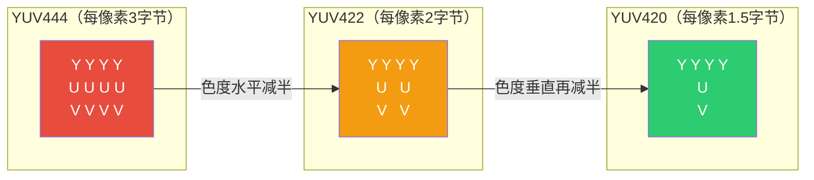
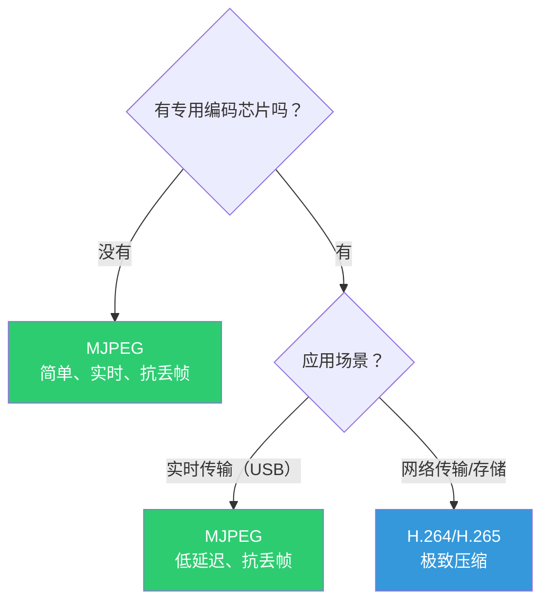
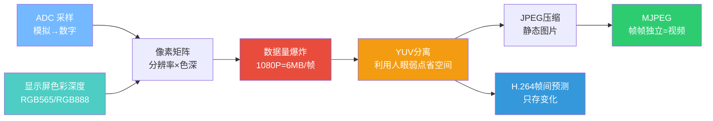

---
tags:
  - 嵌入式
  - 图像
  - 摄像头
  - 视频
aliases:
  - 图像基础
  - 像素格式
  - 视频压缩
related:
  - "[[摄像头硬件接口]]"
  - "[[视频流与压缩]]"
  - "[[摄像头配置与驱动]]"
  - "[[../嵌入式/外设/UVC]]"
  - "[[../嵌入式/外设/显示屏(大体)]]"
date: 2026-05-29
---

# 图像基础认知

> [!abstract] 核心思想
> 图像的本质是**像素矩阵**，每个像素记录颜色信息。视频是**连续的图像序列**。
> 从RGB到YUV到MJPEG/H.264，所有演进都围绕一个问题：**如何在人眼可接受的范围内减少数据量**。

---

## 一、从光到像素

### 基本链条

```
光线 → 镜头 → 感光元件（CMOS/CCD） → 模拟电信号 → ADC → 数字像素值

感光元件 = 几百万个微小的"光敏单元"（光电二极管）
每个单元采集一个像素点
它们的输出经过ADC变成数字值 → 组成像素矩阵 → 就是一张图片
```

### 核心公式（你已经在显示屏笔记里学过）

```
显存大小 = 水平分辨率 × 垂直分辨率 × (色彩深度 / 8)
```

**实际计算：**

| 分辨率 | 像素数 | RGB565（2B/像素） | RGB888（3B/像素） |
|--------|--------|------------------|------------------|
| 320×240（QVGA） | 76,800 | **150 KB** | 225 KB |
| 640×480（VGA） | 307,200 | **600 KB** | 900 KB |
| 1280×720（720P） | 921,600 | **1.76 MB** | 2.65 MB |
| 1920×1080（1080P） | 2,073,600 | **3.96 MB** | **5.93 MB** |

---

## 二、像素格式

### RGB系列：直接记录颜色

```
RGB565：R(5位) + G(6位) + B(5位) = 16位 = 2字节
  → 嵌入式LCD常用，省内存
  → 最多 2^16 = 65536 种颜色

RGB888：R(8位) + G(8位) + B(8位) = 24位 = 3字节
  → 真彩色
  → 最多 2^24 ≈ 1677 万种颜色

RAW：只有1字节亮度值，无颜色信息
  → 感光元件直接输出
  → 需要后续ISP处理才能变成彩色
```

### YUV系列：亮度 + 色度分离

```
Y = 亮度（Luma）   → 人眼极度敏感，必须全保留
U = 色度蓝（Cb）   → 人眼不太敏感，可以降低精度
V = 色度红（Cr）   → 人眼不太敏感，可以降低精度
```

**为什么用YUV而不是RGB？**

```
人眼的生理特性：
  对亮度变化：★★★★★ 极敏感（能分辨细微明暗）
  对色度变化：★★☆☆☆ 较迟钝（颜色细节丢了不太看得出来）

黑白电影 → 你能看懂情节、认出人脸
只有颜色没有亮度 → 你什么都看不清

YUV的思路：
  亮度（Y）→ 全精度保留
  色度（UV）→ "偷工减料"，人眼不觉得
→ 不是减少信息，而是减少"人眼不在乎"的信息
```

### YUV的三种格式

```
类比：给学生配老师

YUV444 = 每个像素配一个Y老师 + 一个U老师 + 一个V老师
         → 没有省，和RGB一样大

YUV422 = U老师和V老师两个人共享一个（水平方向减半）
         → 每像素 2字节（RGB888是3字节）

YUV420 = U老师和V老师四个人共享（水平+垂直都减半）
         → 每像素 1.5字节
```



| 格式 | 每像素 | 1080P一帧 | 节省 | 用途 |
|------|--------|----------|------|------|
| RGB888 | 3字节 | ~6 MB | 基准 | 显示屏、图像处理 |
| YUV444 | 3字节 | ~6 MB | 0% | 几乎不用 |
| YUV422 | 2字节 | ~4 MB | 33% | 嵌入式摄像头原始输出 |
| YUV420 | 1.5字节 | ~3 MB | 50% | **视频压缩的基础格式** |

---

## 三、视频的数据量问题

### 原始视频有多大？

```
1080P @ 30fps, RGB888：

一帧 = 1920 × 1080 × 3 = 6 MB
一秒 = 6 MB × 30 = 180 MB
一分钟 = 180 MB × 60 = 10.8 GB !!!
一小时 = 648 GB !!!

结论：不压缩，根本无法存储和传输
```

### 嵌入式USB摄像头的实际数据量

```
你的UVC配置：320×240 @ 15fps, MJPEG

原始YUV422：320 × 240 × 2 = 153,600 字节/帧
MJPEG压缩后：约 5~15 KB/帧（压缩约10~30倍）
15fps → 约 150~450 KB/秒

USB全速带宽：12 Mbps = 1.5 MB/秒 → 绰绰有余
这就是为什么320×240可以流畅传
```

---

## 四、MJPEG：Motion JPEG

### 原理

```
MJPEG = 把视频每一帧当作独立的JPEG图片压缩

帧1 → JPEG压缩 → 独立图片
帧2 → JPEG压缩 → 独立图片
帧3 → JPEG压缩 → 独立图片
...

每帧独立，帧和帧之间没有关联
```

**JPEG压缩内部流程：**

```
RGB → YUV420转换 → 色度降采样（省50%）
  → 分块（8×8像素）→ DCT变换 → 量化（丢弃高频细节）→ 熵编码
  → 压缩完成

核心：利用YUV原理 + 数学变换丢弃"人眼不敏感"的高频细节
```

### MJPEG的特点

| 维度 | 说明 |
|------|------|
| **压缩率** | 约10~30倍（相比原始YUV） |
| **帧间关联** | **无**，每帧完全独立 |
| **丢帧影响** | 丢一帧只丢一帧，不影响后续帧 |
| **编码复杂度** | 低，简单芯片都能做 |
| **延迟** | 极低（不需要等参考帧） |
| **解码难度** | 低，通用JPEG解码器即可 |

---

## 五、H.264/H.265：帧间预测压缩

### 核心思想：只存"变化"

```
一个人在墙前走路的视频（30帧）：

MJPEG 的存储：
  帧1：完整的墙 + 完整的人（位置A）
  帧2：完整的墙 + 完整的人（位置B）   ← 墙又存了一遍！
  ...
  帧30：完整的墙 + 完整的人（位置Z）  ← 墙存了30遍！

H.264 的存储：
  帧1（I帧）：完整画面
  帧2（P帧）：只存差异 → 人向右移了5像素
  帧3（P帧）：只存差异 → 人又向右移了5像素
  ...
  背景墙只在帧1存了一次！
```

**类比：**

```
MJPEG = 每天写完整日记（"今天天气晴，我在学校上课，中午吃了饭..."）
H.264 = 只写变化（"和昨天一样，除了下午去了图书馆"）
```

### 三种帧类型


| 帧类型 | 参考对象 | 数据量 | 占比 | 说明 |
|--------|---------|--------|------|------|
| **I帧** | 无（独立） | 大（完整画面） | 少（每隔几秒一个） | 关键帧，随机访问点 |
| **P帧** | 前面的帧 | 小（只存差异） | 多 | 前向预测 |
| **B帧** | 前后帧 | 最小 | 嵌入式通常不用 | 双向预测，计算量大 |

### 丢帧影响对比

```
MJPEG 丢帧3：
  帧1 ✓  帧2 ✓  帧3 ✗  帧4 ✓  帧5 ✓
  → 只少了帧3，后续完全不受影响

H.264 丢帧1（I帧）：
  帧1 ✗  → 帧2参考谁？→ 帧也错
                       → 帧3参考帧2 → 也错
                       → 直到下一个I帧才能恢复！
  → 雪崩式花屏

这就是为什么USB等时传输（不重传）+ MJPEG 是绝配：
  丢帧了？没关系，下一帧是独立的，立刻恢复
```

---

## 六、压缩方案对比

### 数据量对比

```
同一个1080P 30fps视频，一分钟：

未压缩YUV420：  ~5.4 GB
MJPEG压缩：     ~300 MB（压缩约18倍）
H.264压缩：     ~30 MB（压缩约180倍）
H.265压缩：     ~15 MB（压缩约360倍）
```

### 选型对比



| 维度 | MJPEG | H.264 | H.265 |
|------|-------|-------|-------|
| **压缩率** | ~18倍 | ~180倍 | ~360倍 |
| **编码复杂度** | 低 | 高 | 很高 |
| **帧间关联** | 无（每帧独立） | 有（I/P/B帧） | 有 |
| **丢帧影响** | 只丢一帧 | 雪崩式花屏 | 雪崩式花屏 |
| **延迟** | 极低 | 较高 | 较高 |
| **嵌入式适用** | ★★★★★ | ★★★ | ★★ |
| **典型应用** | USB摄像头 | IP摄像头、直播 | 4K视频 |

### UVC为什么选MJPEG？

```
✓ 编码简单 → 摄像头内芯片算力低也能做
✓ 每帧独立 → 丢帧不影响后续（和USB等时传输绝配）
✓ 延迟低 → 不需要缓存参考帧
✓ 解码简单 → ESP32/电脑都能轻松解码
✓ USB带宽够用 → 320×240@15fps 只需几百KB/秒
```

---

## 七、图像格式与视频格式总览

```
┌──────────────────────────────────────────────────────┐
│                    像素格式（未压缩）                    │
│                                                      │
│  RAW     → 感光元件原始输出，需ISP处理                  │
│  RGB565  → 嵌入式LCD，2字节/像素                       │
│  RGB888  → 真彩色，3字节/像素                          │
│  YUV422  → 摄像头常用，2字节/像素                       │
│  YUV420  → 视频压缩基础，1.5字节/像素                   │
├──────────────────────────────────────────────────────┤
│                    压缩格式（静态图片）                   │
│                                                      │
│  JPEG    → 有损压缩，基于YUV420+DCT，约10:1            │
│  PNG     → 无损压缩，文件较大                           │
├──────────────────────────────────────────────────────┤
│                    视频压缩格式                          │
│                                                      │
│  MJPEG   → 每帧独立JPEG，简单实时                      │
│  H.264   → 帧间预测，压缩率高                          │
│  H.265   → H.264升级，压缩率更高                       │
└──────────────────────────────────────────────────────┘
```

---

## 知识脉络



**从已知到未知的关联：**
- **ADC采样** → 感光元件就是百万通道的ADC
- **显示屏色彩深度** → 同一套公式算数据量
- **YUV的哲学** → 和USB位填充一样，都是"利用系统特性来优化"
- **MJPEG + USB等时传输** → 每帧独立 + 不重传 = 天然适配

---

## 相关链接

- [[摄像头硬件接口]] - 摄像头通过什么接口输出这些像素数据
- [[视频流与压缩]] - 压缩格式在视频流中的应用
- [[摄像头配置与驱动]] - 如何配置摄像头的分辨率、格式、帧率
- "[[../嵌入式/外设/UVC]]" - UVC USB摄像头的实际使用
- "[[../嵌入式/外设/显示屏(大体)]]" - 显示端的色彩深度和Frame Buffer
