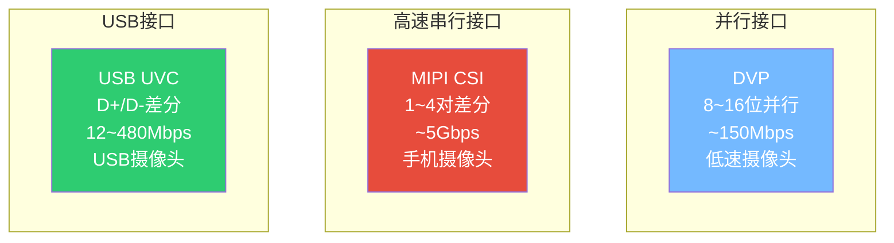
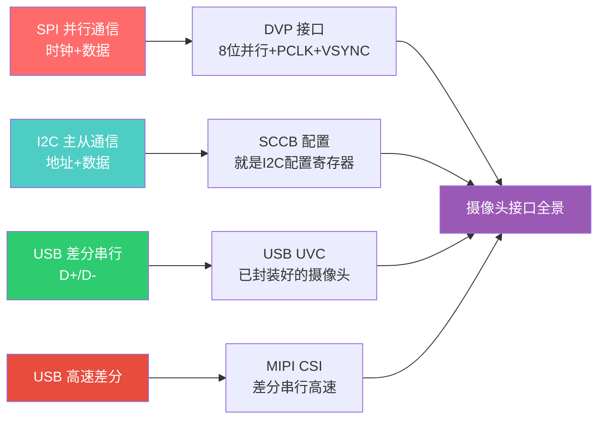

---
tags:
  - 嵌入式
  - 摄像头
  - 硬件接口
  - USB
aliases:
  - 摄像头接口
  - Camera Interface
  - DVP
  - MIPI CSI
related:
  - "[[图像基础认知]]"
  - "[[视频流与压缩]]"
  - "[[摄像头配置与驱动]]"
  - "[[../嵌入式/外设/UVC]]"
  - "[[../嵌入式/通信/USB/硬件层]]"
date: 2026-05-29
---

# 摄像头硬件接口

> [!abstract] 核心思想
> 摄像头的硬件接口分两类：**数据传输接口**（DVP/MIPI/USB）和**配置接口**（SCCB/UVC控制传输）。
> USB摄像头（UVC）把感光元件、ISP、USB控制器封装在一起，对外只暴露USB接口，大大简化了开发。

---

## 一、USB摄像头的内部结构

### 架构图

```
┌──────────────────────────────────────────────────────┐
│              USB摄像头内部                             │
│                                                      │
│  镜头                                                │
│   ↓                                                  │
│  感光元件（CMOS，如OV2640/OV5640）                     │
│   ↓ RAW数据（只有亮度，无颜色）                         │
│  ISP（图像信号处理器）                                 │
│   ↓ YUV/RGB → MJPEG压缩                              │
│  USB控制器                                            │
│   ↓                                                  │
│  USB接口（D+/D-/VBUS/GND）                            │
│                                                      │
└──────────────────────────────────────────────────────┘
         → USB线 → 主机（ESP32-S3 / 电脑）
```

### 你拿到的 vs 你需要做的

| 你的角色 | USB摄像头（UVC） | DVP摄像头（OV2640直连MCU） |
|---------|-----------------|--------------------------|
| **拿到的数据** | MJPEG（已压缩+有颜色） | YUV/RGB（原始数据） |
| **ISP** | 摄像头内部完成 | **MCU端处理** |
| **压缩** | 摄像头内部完成 | **自己做** |
| **配置** | USB控制传输（UVC协议） | SCCB写寄存器 |
| **开发难度** | 低 | **高** |

```
类比：
  USB摄像头 = 去餐厅吃饭（成品菜端上来直接吃）
  DVP摄像头 = 买食材回家自己做（从原料到成品全靠你）
```

---

## 二、ISP（图像信号处理器）

### ISP做了什么？

```
RAW（原始亮度数据）→ ISP → YUV/RGB/MJPEG（成品图像）

ISP的处理流水线：
  1. 坏点校正   → 修复感光元件的坏像素（用周围像素插值）
  2. 去马赛克   → RAW每个像素只有一种颜色，插值出完整RGB
  3. 白平衡     → 不同光源下（日光/灯泡/阴天）校正偏色
  4. 伽马校正   → 线性响应 → 非线性（匹配人眼感知）
  5. 降噪       → 去除传感器噪声
  6. 色彩转换   → RGB → YUV
  7. 缩放/裁剪  → 大分辨率缩到目标分辨率
  8. JPEG编码   → 压缩成MJPEG输出
```

### RAW到彩色的原理

```
感光元件（Bayer阵列）：

  R G R G R G        每个像素只记录一种颜色
  G B G B G B        R=红  G=绿  B=蓝
  R G R G R G        人眼对绿色最敏感，所以绿色占一半
  G B G B G B

去马赛克（Demosaic）：
  每个像素缺少的两种颜色 → 用周围像素插值估算
  结果：每个像素都有完整的R+G+B值
```

---

## 三、数据传输接口对比

### 全景对比



| 接口 | 线数 | 速度 | 距离 | 用途 | 类比 |
|------|------|------|------|------|------|
| **DVP** | ~11根（8位数据+时钟+同步） | ~150 Mbps | 板内（<10cm） | 低速摄像头 | **高速并行SPI** |
| **MIPI CSI** | 2~8根（差分对） | ~5 Gbps | 板内（<15cm） | 手机/高清摄像头 | **高速差分串行（类USB）** |
| **USB UVC** | 4根 | 12~480 Mbps | 线缆（~5m） | USB摄像头 | **你已经学过** |

### 与已知协议类比

```
DVP ≈ 高速版SPI：
  PCLK = SCK（像素时钟）
  D[7:0] = MOSI（但8位并行而非1位串行）
  VSYNC = 一帧的起始信号
  HREF = 一行的起始信号

MIPI CSI ≈ USB的哲学：
  差分信号对
  高速串行
  需要复杂的物理层协议

USB UVC = 你已经学完的：
  D+/D- 差分
  等时/批量传输
  UVC设备类协议
```

---

## 四、DVP接口详解

### 信号定义

```
┌──────────────────────────────────────────────┐
│            DVP接口信号                         │
│                                              │
│  D[7:0]    → 8位并行数据（每个PCLK传1字节）    │
│  PCLK      → 像素时钟（数据在上升沿/下降沿采样）│
│  VSYNC     → 垂直同步（帧同步信号）            │
│  HREF      → 行有效（一行像素数据的使能信号）    │
│                                              │
│  可选：                                      │
│  PWDN      → 电源控制（省电模式）              │
│  RESET     → 复位引脚                         │
└──────────────────────────────────────────────┘
```

### 时序图

```
VSYNC ──┐         ┌──────────────────────────────
        │ 一帧数据 │
        └─────────┘

HREF  ─────┐  ┐  ┐  ┐  ┐  ┐  ┐  ┐  ┐  ┐  ┐  ┐──
            └──┘  └──┘  └──┘  └──┘  └──┘
            行1    行2    行3    ...

PCLK  ──┐┌┐┌┐┌┐┌┐┌┐┌┐┌┐┌┐┌┐┌┐┌┐┌┐┌┐┌┐┌┐┌──
        ↑↑↑↑↑↑↑↑↑↑↑↑↑↑↑↑↑↑↑↑↑↑↑↑↑↑↑↑↑↑↑↑
        每个上升沿采样D[7:0] = 1个像素字节

D[7:0] ├──Y0──├──U0──├──Y1──├──V0──├──Y2──├──
        YUV422格式：Y0,U0,Y1,V0,Y2,U2,Y3,V2...
        （两个像素共享一对UV）
```

### DVP为什么用并行？

```
速度需求：640×480 @ 30fps, YUV422
= 640 × 480 × 2 × 30 = 18,432,000 字节/秒 ≈ 147 Mbps

SPI（1位串行）→ 需要至少147MHz时钟 → 太快，信号完整性差
DVP（8位并行）→ 只需约18MHz时钟 → 轻松实现

并行 = 用宽度换速度
8位同时传 → 时钟频率降为1/8
```

---

## 五、MIPI CSI接口

### 为什么需要MIPI？

```
DVP的限制：
  并行线多（11+根）→ PCB布线困难
  速度上限（~150Mbps）→ 无法支持高清视频
  距离短（<10cm）→ 只能板内

手机摄像头需求：
  1080P@60fps → ~373 Mbps → DVP不够
  线要少 → 手机内部空间紧张
  → 需要新的接口标准 → MIPI CSI
```

### MIPI CSI的特点

```
MIPI CSI（Camera Serial Interface）：
  差分信号对（类似USB的D+/D-）
  1~4条数据Lane（差分对）
  1条时钟Lane
  高速串行传输
  最高 ~5 Gbps（远超DVP）

类比：
  DVP = 并口打印机（宽线，慢速）
  MIPI = USB（窄线，高速差分）
```

| 对比 | DVP | MIPI CSI |
|------|-----|----------|
| 信号方式 | 单端并行 | **差分串行** |
| 数据线数 | 8~16根 | 2~8根（差分对） |
| 最大速度 | ~150 Mbps | **~5 Gbps** |
| PCB布线 | 困难（线多，需等长） | **简单（线少）** |
| 协议复杂度 | 简单 | **复杂（需要PHY层）** |
| 典型应用 | STM32+OV2640 | 手机、树莓派 |

---

## 六、配置接口：SCCB

### SCCB = 简化版I2C

```
摄像头需要配置（分辨率、格式、曝光等）
→ 配置接口 ≠ 数据传输接口
→ 配置数据量很小（几百个寄存器），不需要高速

SCCB（Serial Camera Control Bus）：
  SIO-C = I2C的SCL（时钟线）
  SIO-D = I2C的SDA（数据线）
  → 本质就是I2C
```

### SCCB vs I2C

| 对比 | I2C | SCCB |
|------|-----|------|
| 时钟线 | SCL | SIO-C |
| 数据线 | SDA | SIO-D |
| 地址 | 7位/10位 | 7位（OV摄像头通常0x21或0x3C） |
| ACK | 从机必须拉低SDA | **Don't care**（不响应也行） |
| 速度 | 标准100k/快速400k | ~400kHz |
| 多字节读写 | 支持 | **只支持3相写（地址+子地址+数据）** |

```
SCCB写一个寄存器（3相写）：

  起始 → 设备地址(7位)+W(1位) → 子地址(寄存器号) → 数据 → 停止
         "找谁"                  "哪个寄存器"        "写什么值"

和I2C几乎一模一样！
大多数情况下，你可以直接用I2C函数来操作SCCB
```

### UVC摄像头不需要手动SCCB

```
DVP摄像头：
  你需要用I2C/SCCB手动写几百个寄存器来配置摄像头
  → 复杂，需要查寄存器手册

USB摄像头（UVC）：
  摄像头内部已经有固件帮你管理这些寄存器
  你只需要通过USB控制传输发UVC命令
  → "设置分辨率为320×240" → 摄像头内部自动配置寄存器
  → 简单得多
```

---

## 七、USB摄像头完整架构

### 从光到USB数据的完整路径

```
┌───────────────────────────────────────────────────────┐
│                   USB摄像头内部                         │
│                                                       │
│  光线 → 镜头 → 感光元件（CMOS）                         │
│                    ↓ RAW数据                           │
│               ISP（图像信号处理器）                      │
│                    ↓ YUV/RGB                           │
│               JPEG编码器                               │
│                    ↓ MJPEG帧                           │
│               USB控制器                                │
│                    ↓ USB等时/批量传输                    │
│               USB接口 → USB线 → 主机                    │
│                                                       │
│  配置路径：                                             │
│  主机 → USB控制传输 → UVC协议 → 摄像头内部固件 → 寄存器   │
└───────────────────────────────────────────────────────┘
```

### 你在ESP32-S3上看到的层次

```
你的代码
  ↕
UVC Host Driver（摄像头语义层）
  "配置分辨率、格式、帧率"
  "接收MJPEG帧"
  ↕
USB Host Driver（USB总线层）
  "管理USB设备、端点传输"
  ↕
USB Hardware（D+/D-物理层）
  ↕
USB摄像头
```

---

## 八、总结：接口选型速查

| 场景 | 推荐接口 | 原因 |
|------|---------|------|
| 快速原型 / 不想管底层 | **USB UVC** | 即插即用，MJPEG已压缩 |
| STM32低成本方案 | **DVP + SCCB** | 直连，但需手动配置寄存器 |
| 高清视频（手机级） | **MIPI CSI** | 带宽大，但协议复杂 |
| ESP32-S3 USB Host | **USB UVC** | 你的方案，最佳选择 |

---

## 知识脉络



**从已知到未知的关联：**
- **SPI时钟+数据** → DVP就是"并行版SPI"，PCLK=SCK, D[7:0]=8位MOSI
- **I2C地址+数据** → SCCB就是I2C的简化版，配置摄像头寄存器
- **USB差分串行** → MIPI CSI也是差分串行，但速度更高
- **USB设备类（UVC）** → USB摄像头封装了ISP+JPEG+USB控制器，你只需处理MJPEG帧

---

## 相关链接

- [[图像基础认知]] - 像素格式、YUV、MJPEG等基础概念
- [[视频流与压缩]] - MJPEG/H.264在视频流中的应用
- [[摄像头配置与驱动]] - 如何通过UVC协议配置摄像头参数
- "[[../嵌入式/外设/UVC]]" - ESP32-S3 UVC实际项目代码
- "[[../嵌入式/通信/USB/硬件层]]" - USB物理层基础
- "[[../嵌入式/外设/显示屏(大体)]]" - 显示端对应的知识
