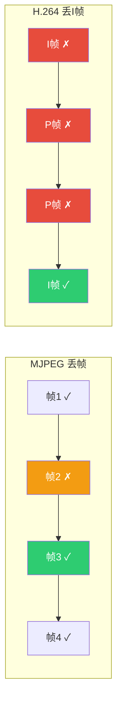
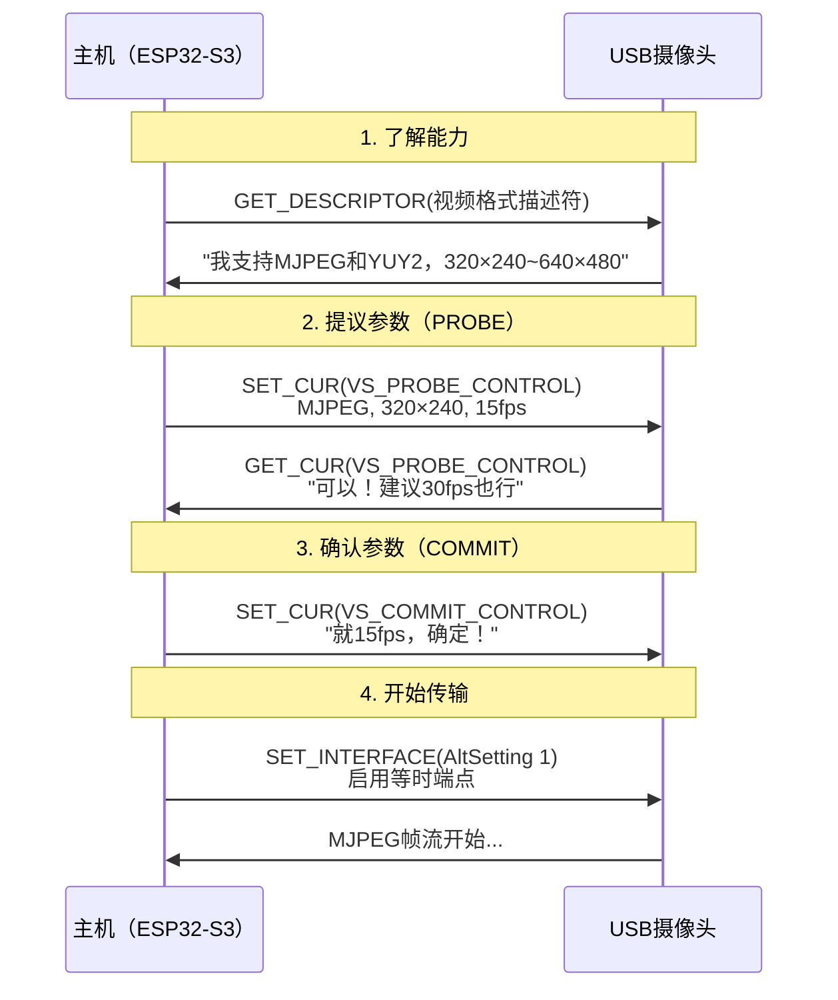
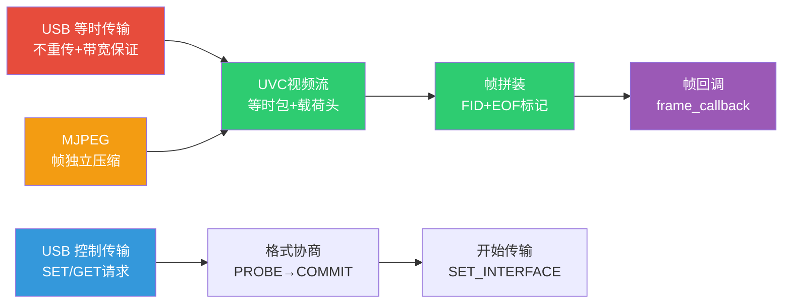

---
tags:
  - 嵌入式
  - 摄像头
  - 视频流
  - USB
  - UVC
aliases:
  - UVC视频流
  - 视频传输
related:
  - "[[图像基础认知]]"
  - "[[摄像头硬件接口]]"
  - "[[摄像头配置与驱动]]"
  - "[[../嵌入式/外设/UVC]]"
  - "[[../嵌入式/通信/USB/协议逻辑层]]"
date: 2026-05-29
---

# 视频流与压缩

> [!abstract] 核心思想
> USB摄像头（UVC）的视频流传输 = **等时传输 + MJPEG**，这是"不重传"和"帧独立"的天作之合。
> 一帧MJPEG被拆成多个等时包，用FID标记帧起始，EOF标记帧结束，接收方逐步拼装。

---

## 一、为什么等时传输 + MJPEG = 天生一对

### 两种特性的完美匹配

```
MJPEG的特性：
  每帧独立压缩 → 丢一帧只丢一帧，下一帧完全正常

等时传输的特性：
  不重传 → 带宽固定，延迟可控

合在一起：
  丢包了？→ 不重传 → 下一帧正常接收 → 秒恢复

如果用批量传输（有重传）+ MJPEG：
  帧丢了 → 重传 → 重传成功但已过期 → 画面卡顿 → 浪费带宽

如果用等时传输 + H.264：
  I帧丢了 → 后续所有P帧花屏 → 直到下一个I帧 → 雪崩！
```

| 组合 | 丢帧影响 | 结论 |
|------|---------|------|
| **等时 + MJPEG** | 只影响当前帧，秒恢复 | **最佳** |
| 批量 + MJPEG | 重传浪费带宽，延迟不可控 | 不推荐 |
| 等时 + H.264 | I帧丢失导致雪崩花屏 | 危险 |
| 批量 + H.264 | 可靠但延迟高 | 网络摄像头用 |

---

## 二、一帧的传输过程

### 分包传输

```
一帧MJPEG（约30KB）的传输：

USB全速等时传输：每1ms一帧（Frame），最多1023字节/帧

  1ms:  等时包1（1023字节）
  2ms:  等时包2（1023字节）
  3ms:  等时包3（1023字节）
  ...
  30ms: 等时包30（剩余字节）
  → 约30ms传完一帧
```

```
类比：
  一帧MJPEG = 一个大汉堡（一口吃不下）
  等时包 = 一口咬一块
  FID = "这是新汉堡"的标记
  EOF = "这个汉堡吃完了"的标记
```

### 带宽计算

```
你的UVC配置：320×240 @ 15fps, MJPEG

MJPEG一帧大小：约 5~15 KB（取决于画面复杂度）
15fps → 约 75~225 KB/秒

USB全速等时带宽：1023字节/ms × 1000ms = ~1 MB/秒
→ 远远够用，还有大量剩余带宽

如果换成 640×480 @ 30fps：
MJPEG一帧：约 20~50 KB
30fps → 约 600~1500 KB/秒
→ 接近USB全速上限 → 可能丢帧
→ 建议用USB高速（480Mbps）
```

---

## 三、UVC载荷头（Payload Header）

### 帧分界的标记

```
每个等时包前面有一个头部：

┌──────────────┬──────────────────────────┐
│ 载荷头(2~12B) │ MJPEG数据片段             │
└──────────────┴──────────────────────────┘

头部关键字段：
  Bit 0: FID（Frame ID）
         → 每新的一帧，FID翻转（0→1→0→1...）
         → 接收方检测到FID变化 → 新帧开始了！

  Bit 1: EOF（End of Frame）
         → 这个包是当前帧的最后一个包
         → 接收方收到EOF → 帧拼装完成！

  其他位：PTS（时间戳）、SCR（时钟参考）等可选字段
```

### FID + EOF 的工作方式

```
时间线示例：

  包1: FID=0, EOF=0  → 帧1的片段1
  包2: FID=0, EOF=0  → 帧1的片段2
  包3: FID=0, EOF=1  → 帧1的最后一个片段 → 帧完成！
  包4: FID=1, EOF=0  → 帧2的片段1（FID翻转 = 新帧）
  包5: FID=1, EOF=0  → 帧2的片段2
  包6: FID=1, EOF=1  → 帧2的最后一个片段 → 帧完成！
  包7: FID=0, EOF=0  → 帧3的片段1（FID又翻转）

接收方逻辑：
  1. 看到 FID 变化 → 把之前的缓冲区交给 frame_callback
  2. 开始往新缓冲区写数据
  3. 收到 EOF → 当前帧完成
```

---

## 四、丢帧场景分析

### MJPEG丢帧：秒恢复

```
帧1传输：FID=0
  包1 ✓ → 包2 ✓ → 包3 ✗（丢了）→ 包4 ✓ → 包5(EOF) ✓

结果：
  缓冲区有包1+包2+包4+包5 → JPEG不完整
  → JPEG解码可能花屏或失败
  → 下一帧 FID=1，完全独立，正常接收
  → 影响仅限一帧
```

### H.264丢帧：雪崩

```
H.264帧序列：
  I帧(0) → P帧(1) → P帧(2) → P帧(3) → I帧(4) → P帧(5) ...

如果 I帧(0) 丢了：
  P帧(1) 参考I帧(0) → I帧(0)没有 → P帧(1)也错
  P帧(2) 参考P帧(1) → P帧(1)是错的 → P帧(2)也错
  P帧(3) 参考P帧(2) → P帧(2)是错的 → P帧(3)也错
  ...
  直到下一个 I帧(4) 才能恢复！

  → 一帧I帧丢失 → 后续所有P帧全部花屏 → 雪崩
```



---

## 五、UVC视频格式协商

### 协商流程



### 类比理解

```
视频格式协商 = 餐厅点菜

1. "菜单给我看看"       → GET_DESCRIPTOR（看看有什么格式/分辨率）
2. "我要320×240 MJPEG"  → SET_CUR(PROBE)（下单）
3. "好的，厨房确认"     → GET_CUR(PROBE)（厨房确认能做）
4. "就这个，上菜！"     → SET_CUR(COMMIT)（最终确认）
5. 开始上菜             → SET_INTERFACE + 开始stream
```

### UVC控制请求

| 请求 | 说明 |
|------|------|
| **VS_PROBE_CONTROL** | 试探：主机提议参数，摄像头回应是否可行 |
| **VS_COMMIT_CONTROL** | 提交：双方确认，参数生效 |
| **VS_STILL_PROBE_CONTROL** | 静止图像：探索单帧抓拍能力 |
| **VS_STILL_COMMIT_CONTROL** | 静止图像：确认抓拍参数 |

```
PROBE 和 COMMIT 的区别：
  PROBE = "试试看行不行"（可以反复试探多次）
  COMMIT = "确定了，就这样"（最终确认，不可逆）
```

---

## 六、帧缓冲机制

### 双帧缓冲

```
你的UVC配置中：number_of_frame_buffers = 2

  缓冲区A：正在被驱动写入新帧
  缓冲区B：正在被你的代码读取处理

  一帧完成后 → 交换：
  缓冲区A → 交给你的代码读取
  缓冲区B → 交给驱动写入新帧

类比：
  流水线上的两个箱子
  一个在装货（驱动写入），一个在卸货（代码处理）
  装满了就交换 → 不需要等
```

### 帧的生命周期

```
你的UVC代码中的帧流转：

1. 摄像头产生一帧
   → UVC驱动收到完整frame
   → frame_callback() 被调用
   → xQueueSend() 把帧指针放入队列

2. 你的任务拿到帧
   → xQueueReceive() 取出帧指针
   → 处理帧数据（解码/显示/存储）
   → uvc_host_frame_return() 归还帧缓冲

3. 归还帧缓冲
   → 驱动可以复用这个缓冲区写下一帧
   → 如果不归还 → 缓冲区耗尽 → 丢帧！

重要：frame_return() 必须及时调用，否则缓冲区会耗尽
```

---

## 七、完整数据流路径

```
┌───────────────────────────────────────────────────────────┐
│                    USB摄像头端                              │
│                                                           │
│  光线 → 感光元件 → ISP → JPEG编码 → MJPEG帧就绪            │
│                                                           │
├───────────────────────────────────────────────────────────┤
│                    USB传输层                                │
│                                                           │
│  MJPEG帧 → 拆分成等时包（加FID/EOF头）→ D+/D-差分信号       │
│                                                           │
├───────────────────────────────────────────────────────────┤
│                    ESP32-S3 接收端                          │
│                                                           │
│  USB Host Driver → 等时包接收                               │
│  UVC Host Driver → FID/EOF拼装 → 完整MJPEG帧               │
│  frame_callback() → xQueueSend() → 你的处理任务             │
│  → 解码JPEG → 得到RGB/YUV像素数据 → 显示/存储/分析          │
│  → uvc_host_frame_return() → 归还缓冲区                    │
│                                                           │
└───────────────────────────────────────────────────────────┘
```

---

## 知识脉络



**从已知到未知的关联：**
- **USB等时传输** → 不重传、带宽保证 → 视频流的天然载体
- **MJPEG帧独立** → 丢帧秒恢复 → 和等时传输绝配
- **USB控制传输** → UVC格式协商 → PROBE/COMMIT协议
- **USB设备类** → UVC类定义了视频流的标准协议
- **DMA双缓冲** → 帧缓冲交换机制类似

---

## 相关链接

- [[图像基础认知]] - MJPEG/H.264压缩原理
- [[摄像头硬件接口]] - 摄像头内部ISP到USB控制器的路径
- [[摄像头配置与驱动]] - ESP32-S3上的UVC配置实战
- "[[../嵌入式/外设/UVC]]" - UVC项目代码
- "[[../嵌入式/通信/USB/协议逻辑层]]" - 等时传输的协议基础
