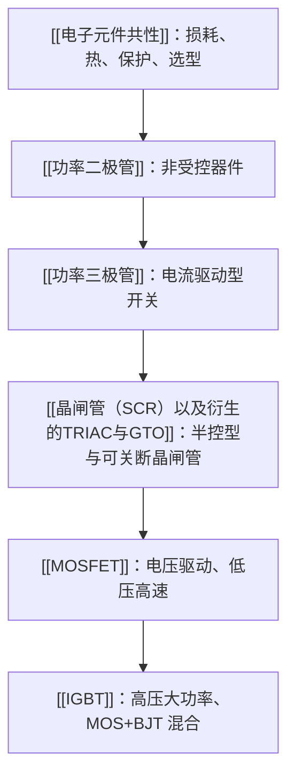

# 电力电子总览

> [!abstract] 核心本质
> 电力电子不是单纯研究“元件长什么样”，而是研究如何用半导体开关把电能高效率地变换、控制和保护。对嵌入式学习来说，重点是理解 MCU 发出的控制信号如何影响大电压、大电流回路。

## 一句话结论

电力电子的主线是：用 [[PWM]]、门极/栅极驱动、采样保护和散热设计，让功率器件在“尽快导通”和“尽快关断”之间可靠切换。

## 学习路径

## 器件族谱

| 器件 | 控制方式 | 主要优势 | 主要短板 | 嵌入式关注点 |
|---|---|---|---|---|
| [[功率二极管]] | 不可控 | 简单、可靠、适合整流和续流 | 有正向压降与反向恢复 | 续流路径、反向恢复、浪涌能力 |
| [[功率三极管]] / GTR | 电流驱动 | 早期大功率开关，导通知识直观 | 需要持续基极电流，关断慢，易二次击穿 | 基极限流、饱和深度、关断延迟 |
| [[晶闸管（SCR）以及衍生的TRIAC与GTO]] | 门极触发 | 高压大电流能力强，适合交流控制 | 普通 SCR 只能控开不能控关 | 触发角、过零、$I_L$、$I_H$、$du/dt$ |
| [[MOSFET]] | 电压驱动 | 低压高速，驱动功耗低 | 高压时 $R_{DS(on)}$ 上升明显 | 栅极电荷、死区、米勒平台、续流二极管 |
| [[IGBT]] | 电压驱动 | 适合中高压大电流，导通损耗较稳定 | 有拖尾电流，频率低于 MOSFET | 门极电阻、短路保护、退饱和检测 |

## 从嵌入式角度看功率开关

MCU 引脚本身只能输出毫安级信号，无法直接驱动电机、电磁阀、加热器或电源变换器。它通常通过下面链路控制功率回路：

这里最容易被初学者低估的是“驱动电路”和“保护电路”。代码只决定什么时候发脉冲，真正决定器件会不会烧的是门极/栅极电流、寄生参数、散热、吸收回路和故障响应时间。

## 核心矛盾

| 矛盾 | 说明 | 工程后果 |
|---|---|---|
| 耐压 vs 导通损耗 | 为了承受高压，需要更厚、更低掺杂的 [[漂移区]] | 导通电阻或压降变大 |
| 开关速度 vs 电磁干扰 | 边沿越快，开关损耗越低，但 $dv/dt$、$di/dt$ 越大 | EMI、误触发、振铃 |
| 驱动强度 vs 可靠性 | 驱动越强，开关越快 | 可能导致过冲、反向恢复冲击 |
| 效率 vs 安全裕量 | 器件用得越接近极限，成本越低 | 温升、浪涌、短路风险上升 |

## 常用参数速查

| 参数 | 主要对应器件 | 含义 |
|---|---|---|
| $V_F$ | 二极管 | 正向导通压降，决定 [[导通损耗]] |
| $Q_{rr}$、$t_{rr}$ | 二极管、SCR | 反向恢复电荷/时间，决定开关冲击和损耗 |
| $R_{DS(on)}$ | MOSFET | 导通电阻，越小越省电但栅极电荷常更大 |
| $Q_g$ | MOSFET、IGBT | 栅极总电荷，决定驱动电流需求和开关速度 |
| $V_{CE(sat)}$ | BJT、IGBT | 饱和压降，决定大电流下的导通损耗 |
| $I_L$、$I_H$ | SCR/TRIAC | 擎住电流和维持电流，决定能否可靠导通/关断 |
| SOA | 功率器件 | 安全工作区，限制电压、电流、时间和温度组合 |

## 嵌入式学习重点

1. 先理解“器件是不是可控、能不能主动关断”。
2. 再理解“导通损耗”和“[[开关损耗]]”分别来自哪里。
3. 接着看数据手册中的最大额定值、典型值、热阻和 SOA。
4. 最后把器件放回系统：驱动、续流、吸收、采样、保护、散热一起看。

> [!warning] 避坑指南
> 不要只看“电压够不够、电流够不够”。功率器件失效常常不是稳态电流造成的，而是开关瞬间的反向恢复、电压尖峰、热堆积、错误驱动或保护响应太慢造成的。

## 知识延伸

- ⬆️ 上位知识：[[电路基础]]、[[半导体物理]]、[[电机驱动]]
- ⬇️ 下位知识：[[功率二极管]]、[[MOSFET]]、[[IGBT]]、[[晶闸管（SCR）以及衍生的TRIAC与GTO]]
- ➡️ 平级关联：[[示波器]]、[[PWM]]、[[ADC模块初步理解]]、[[基础的电机驱动理解]]
