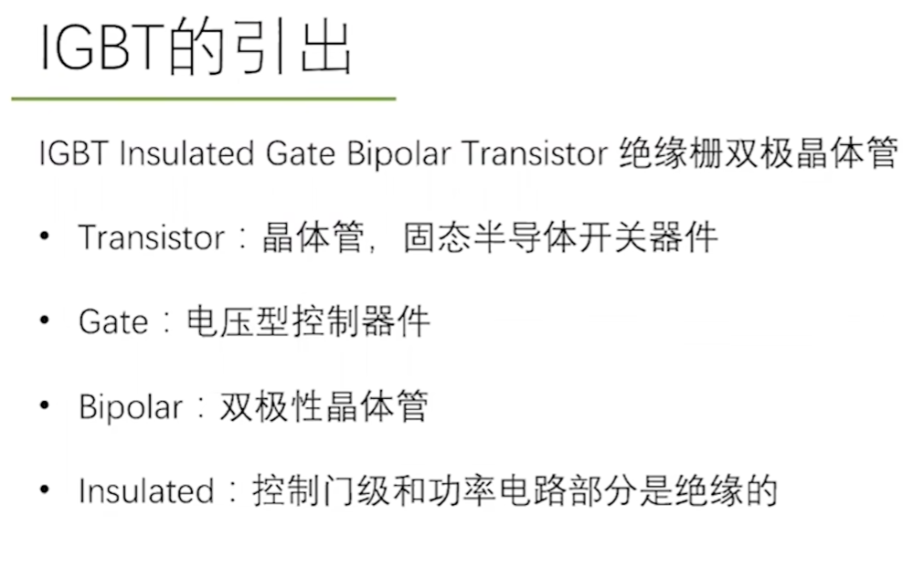
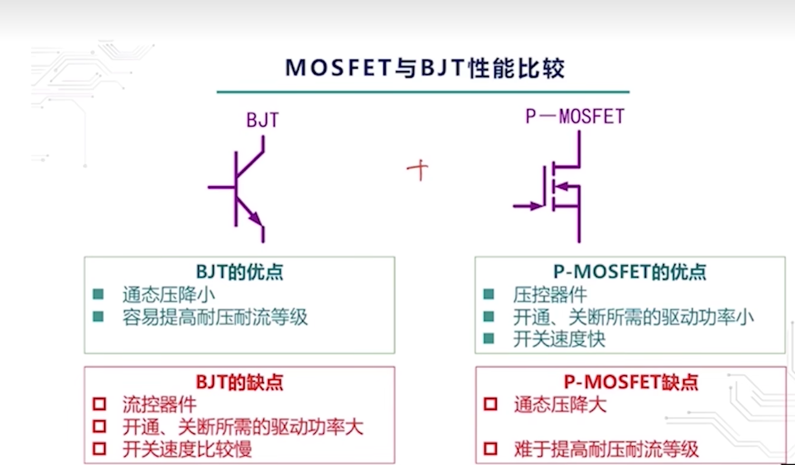
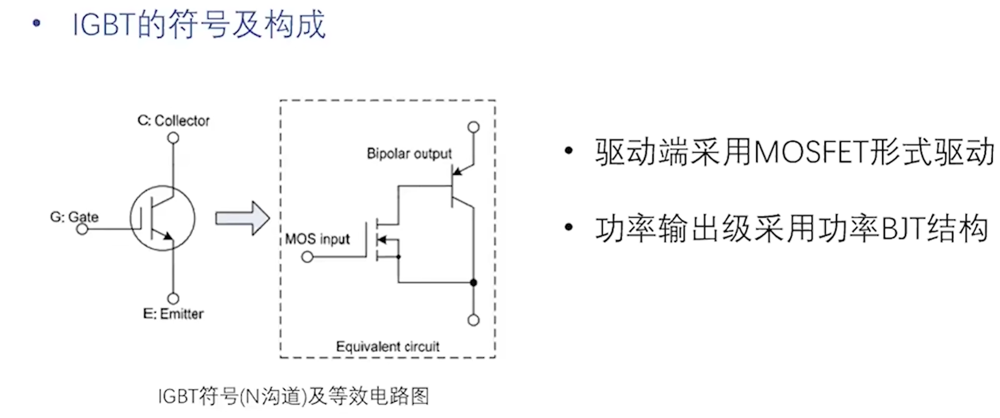
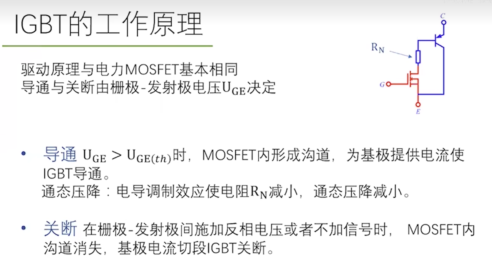
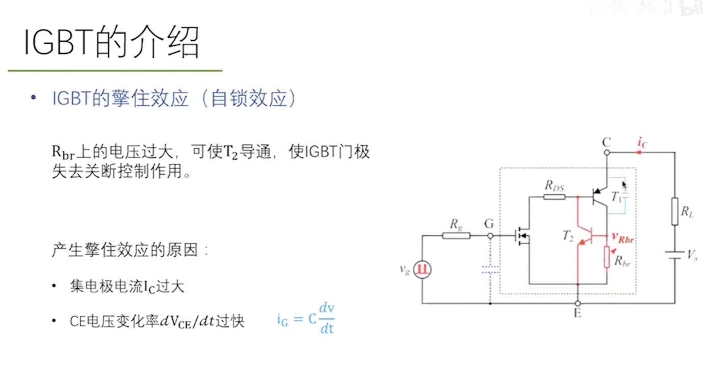
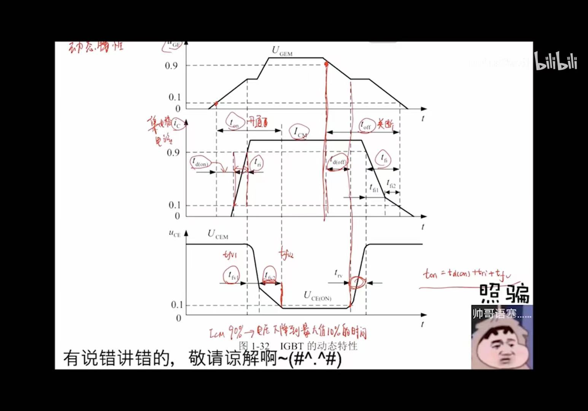
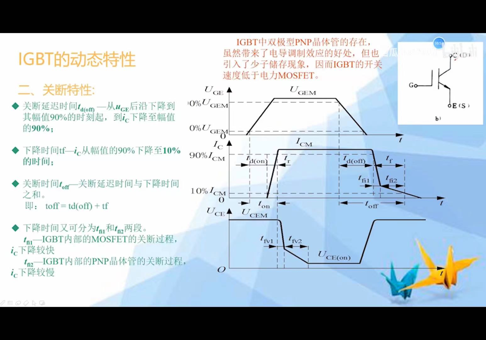

# IGBT

> [!abstract] 核心本质
> IGBT 可以理解为“MOS 栅极 + BJT 导电通道”的混合型功率器件。它用电压驱动，适合中高压、大电流场景，是电机驱动、逆变器和工业电源里的核心器件之一。

## 一句话结论

IGBT 比 [[MOSFET]] 更适合高压大功率，比功率 BJT 更容易驱动；代价是关断时有拖尾电流，开关频率通常不如 MOSFET。

## 原始图像笔记

## 擎住效应

## 特性

## 为什么需要 IGBT

MOSFET 在低压下很强，因为它的导通损耗是 $I^2R_{DS(on)}$。但电压等级升高时，MOSFET 的 [[漂移区]] 必须更厚，$R_{DS(on)}$ 会显著上升。

IGBT 引入双极型导电机制，导通时通过电导调制降低高压漂移区的等效电阻。因此在 600V、1200V、1700V 这类电压等级下，IGBT 往往比同等级 MOSFET 更适合大电流。

## 结构理解

| 视角 | MOSFET 部分 | BJT 部分 |
|---|---|---|
| 控制方式 | 栅极绝缘，电压驱动 | 主电流由少数载流子参与 |
| 优点 | 驱动功耗低，接口友好 | 高压大电流下导通损耗低 |
| 代价 | 有栅极电荷和米勒效应 | 关断时有存储电荷和拖尾电流 |

可以把 IGBT 看成：用 MOSFET 的栅极控制能力，去驱动一个适合高压大电流的双极型导电结构。

## 关键参数

| 参数 | 含义 | 嵌入式关注点 |
|---|---|---|
| $V_{CES}$ | 集电极-发射极耐压 | 覆盖母线电压和尖峰 |
| $I_C$ | 集电极电流 | 结合壳温、散热器和脉冲条件看 |
| $V_{CE(sat)}$ | 饱和压降 | 决定导通损耗 $P \approx V_{CE(sat)}I_C$ |
| $Q_g$ | 栅极电荷 | 决定驱动器峰值电流 |
| $E_{on}$、$E_{off}$ | 单次开通/关断能量 | 估算开关损耗 |
| $t_{sc}$ | 短路耐受时间 | 决定保护电路必须多快动作 |
| $R_{th}$ | 热阻 | 决定结温和散热器设计 |

## 静态特性

IGBT 的导通压降不像 MOSFET 那样简单等效成一个电阻，而更接近固定压降加少量斜率电阻。大电流高压场景下，这种特性通常更有优势。

导通损耗可粗略估算为：

$$
P_{cond} \approx V_{CE(sat)} \times I_C \times D
$$

其中 $D$ 是占空比。

## 动态特性：拖尾电流

IGBT 关断时，漂移区里存储的少数载流子需要复合或被抽走，所以电流不会瞬间归零，而是出现拖尾电流。

拖尾电流是 IGBT 开关频率不如 MOSFET 的重要原因。频率越高，开关损耗占比越大，IGBT 越容易发热。

## 擎住效应与安全问题

IGBT 内部存在寄生晶闸管结构。若异常电流、过高 $dv/dt$ 或局部热失控触发寄生结构，可能出现擎住效应，导致栅极失去控制能力。

> [!danger] 致命陷阱
> IGBT 短路时电流上升极快，而器件短路耐受时间通常只有微秒级。保护不能只靠 MCU 慢慢采样判断，常需要驱动芯片的 DESAT、软关断和硬件级关断链路。

## 栅极驱动

IGBT 常见驱动电压不是 MCU 的 3.3V/5V，而是由专用驱动器提供，例如：

- 开通：常见 +15V。
- 关断：可用 0V，也常用负压如 -5V 抑制误导通。
- 栅极串联电阻：调节开关速度、过冲和 EMI。
- 米勒钳位：防止高 $dv/dt$ 通过米勒电容误开通。

## 典型应用

| 场景 | 为什么用 IGBT |
|---|---|
| 变频器 | 高压母线、大电流、电机负载 |
| 光伏/储能逆变器 | 中高压 DC/AC 变换 |
| UPS | 大功率逆变和整流 |
| 感应加热 | 大功率开关，但频率需评估 |

## 与 MOSFET 的选择

| 维度 | MOSFET | IGBT |
|---|---|---|
| 低压场景 | 优势明显 | 通常不优 |
| 高压大电流 | $R_{DS(on)}$ 压力增大 | 常更合适 |
| 开关频率 | 更高 | 中低频更常见 |
| 导通损耗模型 | $I^2R$ | $V_{CE(sat)}I$ |
| 关断损耗 | 通常较小 | 拖尾电流明显 |

## 常见误区

- 用 MCU GPIO 直接驱动 IGBT 栅极。
- 只看 $I_C$，忽略短路耐受时间和保护速度。
- 把 IGBT 当成高压 MOSFET，忽略拖尾电流。
- 只调小栅极电阻追求快边沿，导致过冲和误导通。
- 没有验证母线尖峰和栅极波形就上大电流。

## 知识延伸

- ⬆️ 上位知识：[[电力电子总览]]、[[MOSFET]]、[[功率三极管]]
- ⬇️ 下位知识：IGBT 驱动、DESAT 保护、三相逆变桥、软关断
- ➡️ 平级关联：[[PWM]]、[[示波器]]、[[导通损耗]]、[[开关损耗]]
