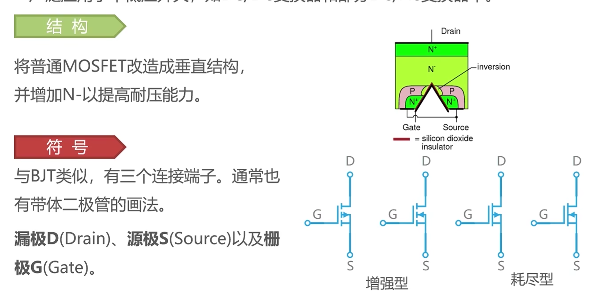
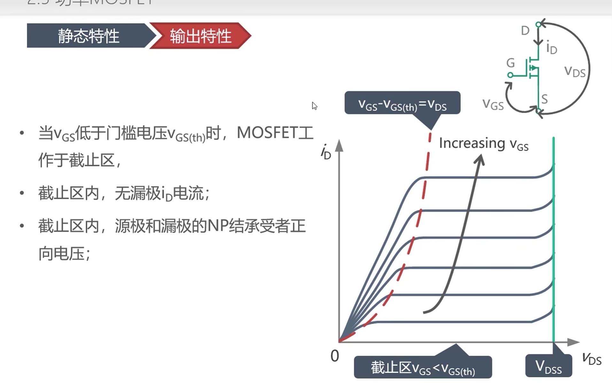
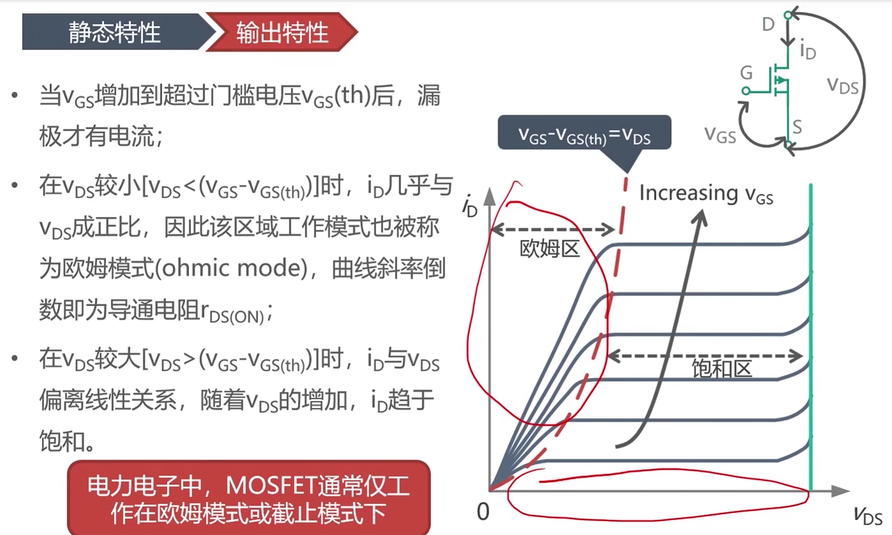
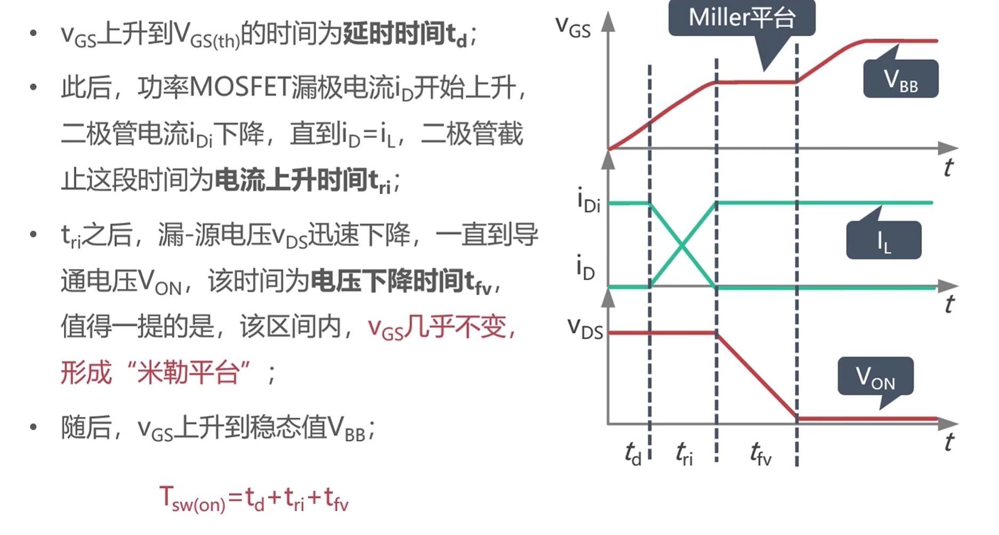
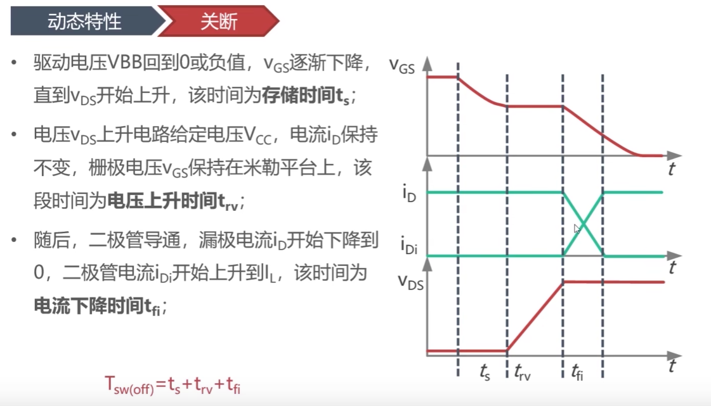

# MOSFET

> [!abstract] 核心本质
> MOSFET 是电压驱动型功率器件。MCU 或驱动芯片通过控制栅源电压 $V_{GS}$ 改变漏源之间的导通状态，特别适合低压、高速、高频开关场景。

## 核心结论

MOSFET 最适合嵌入式里常见的低压电机、LED、电磁阀、DC-DC 和 H 桥控制；真正的难点不是“能不能导通”，而是 [[栅极驱动]]、[[续流路径]]、[[死区时间]]、开关尖峰和散热。

## 什么时候用

- 低压到中低压 DC 负载，例如小车电机、LED、电磁阀、继电器、加热片。
- 需要高频 [[TIM定时器基础概念|PWM]] 的场景，例如 DC-DC、同步整流、无刷电机驱动。
- 希望 MCU 用逻辑信号控制大电流，但又能通过驱动器主动开通和关断。
- 低压大电流场景，$R_{DS(on)}$ 足够低时，导通效率通常很好。

## 什么时候不用

- 电压等级升到 600V、1200V 这类高压大功率时，高压 MOSFET 的 $R_{DS(on)}$ 可能变得很难接受，此时常比较 [[IGBT]]。
- 只靠 3.3V GPIO 直接驱动，而 MOSFET 只在 10V 下标称低导通电阻。
- 桥式电路没有可靠死区和驱动保护。
- 感性负载没有设计能量释放路径。

## 控制本质

功率 MOSFET 最常见的是垂直结构。电流从漏极到源极垂直流过芯片，栅极通过电场控制沟道是否形成。

| 引脚 | 英文 | 作用 |
|---|---|---|
| G | Gate | 栅极，控制端，近似电容输入 |
| D | Drain | 漏极，主电流端 |
| S | Source | 源极，主电流端和栅极参考点 |

MOSFET 的输入端近似电容，稳态几乎不耗直流电流。但开关瞬间必须给栅极电容充放电，所以高频时仍然需要足够的栅极驱动能力。

## 关键参数

| 参数 | 含义 | 嵌入式关注点 |
|---|---|---|
| $V_{DS}$ | 漏源耐压 | 要覆盖电源、尖峰和裕量 |
| $I_D$ | 连续漏极电流 | 必须结合温升和 PCB 散热看 |
| $R_{DS(on)}$ | 导通电阻 | 决定 [[导通损耗]]，要看实际 $V_{GS}$ 和温度 |
| $V_{GS(th)}$ | 栅源阈值电压 | 只是“刚开始导通”，不是完全导通电压 |
| $Q_g$ | 栅极总电荷 | 决定驱动电流和开关速度 |
| $C_{rss}$ | 反向传输电容 | 关联米勒平台和误导通 |
| $E_{AS}$ | 单脉冲雪崩能量 | 感性负载异常时的抗冲击能力 |

> [!warning] 避坑指南
> $V_{GS(th)}$ 不是 MCU 能否直接驱动 MOSFET 的判断标准。它通常只表示几百微安电流下刚刚形成沟道。要看指定 $V_{GS}$ 下的 $R_{DS(on)}$，例如 2.5V、4.5V 或 10V。

## 损耗与热

MOSFET 导通时近似一个电阻：

$$
P_{cond} = I_D^2 \times R_{DS(on)} \times D
$$

温度升高会让 $R_{DS(on)}$ 增大，所以 MOSFET 发热后会更热，散热设计必须留裕量。高频场景还要把 [[开关损耗]] 加进去，不能只看导通电阻。

米勒平台期间，驱动电流主要用来改变 $V_{DS}$，这段时间直接影响开关损耗。驱动太弱会让开关慢、发热大；驱动太强会让尖峰、振铃和 EMI 变严重。

## 驱动与保护

- 栅极串联小电阻，用来调节边沿速度并抑制振铃。
- 栅源并联下拉电阻，防止上电或复位时悬空误导通。
- 半桥/H 桥必须设置 [[死区时间]]，避免上下管直通。
- 高边 N 沟道 MOSFET 需要自举驱动、电荷泵或隔离驱动。
- 感性负载必须确认 [[续流路径]]，必要时加 TVS、RC/RCD 吸收。

功率 MOSFET 内部天然带有体二极管。它能提供续流路径，但体二极管通常不是理想二极管：正向压降可能高，反向恢复可能差，在同步整流或桥式驱动中会影响死区设计。

## 调试波形

用 [[1.1-示波器是什么|示波器]] 优先看：

- $V_{GS}$：是否达到完全导通电压，有没有米勒误导通或负压尖峰。
- $V_{DS}$：关断尖峰是否超过额定裕量。
- 开关节点：振铃、过冲、边沿速度是否可接受。
- 电流采样：启动、堵转、制动或负载突变时是否越过 [[SOA]]。
- 半桥/H 桥：确认死区内没有直通，体二极管导通时间不要过长。

## 常见误区

- 用 3.3V GPIO 驱动一个只在 10V 下标称低导通电阻的 MOSFET。
- 只看 $I_D$，不看温升曲线和 PCB 铜皮散热。
- 忽略栅极下拉，导致上电瞬间误导通。
- H 桥没有死区，造成上下管直通。
- 感性负载没有吸收回路，导致 $V_{DS}$ 尖峰击穿。

## 相关链接

- 上位入口：[[电力电子总览]]、[[电子元件共性]]
- 前置概念：[[导通损耗]]、[[开关损耗]]、[[栅极驱动]]、[[续流路径]]、[[死区时间]]、[[SOA]]
- 对比器件：[[功率二极管]]、[[IGBT]]、[[功率三极管]]
- 工程入口：[[TIM定时器基础概念|PWM]]、[[基础的电机驱动理解|电机驱动]]、[[1.1-示波器是什么|示波器]]

## 原始图像与课堂记录

### 大体构造

### 静态特性

### 动态特性

