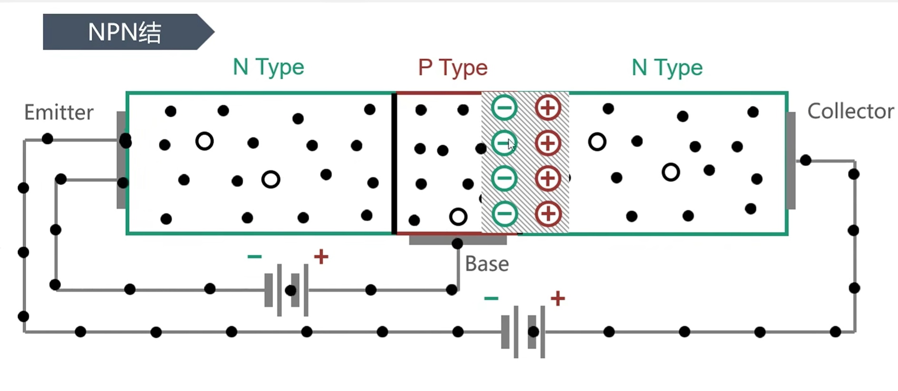
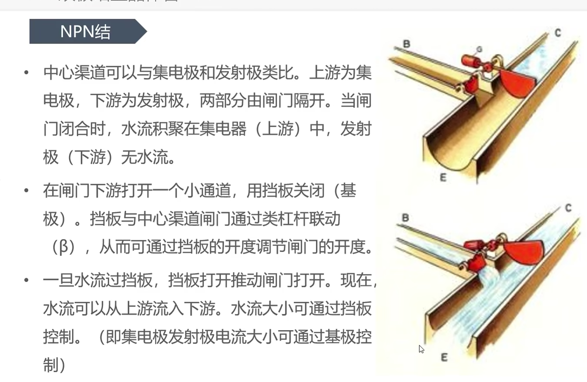
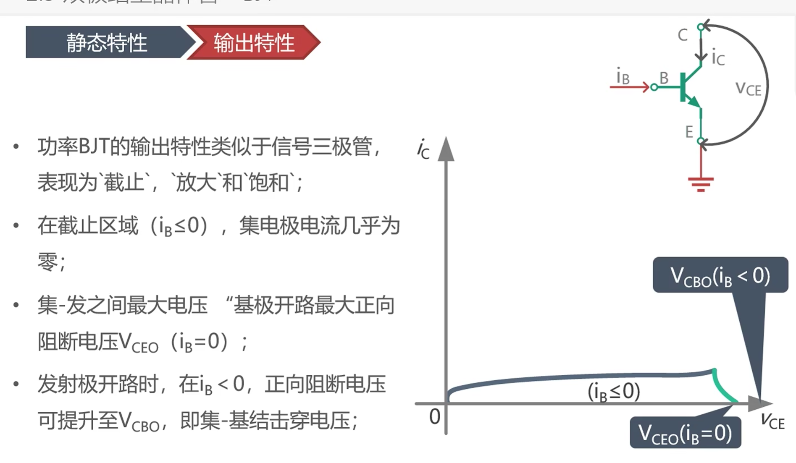
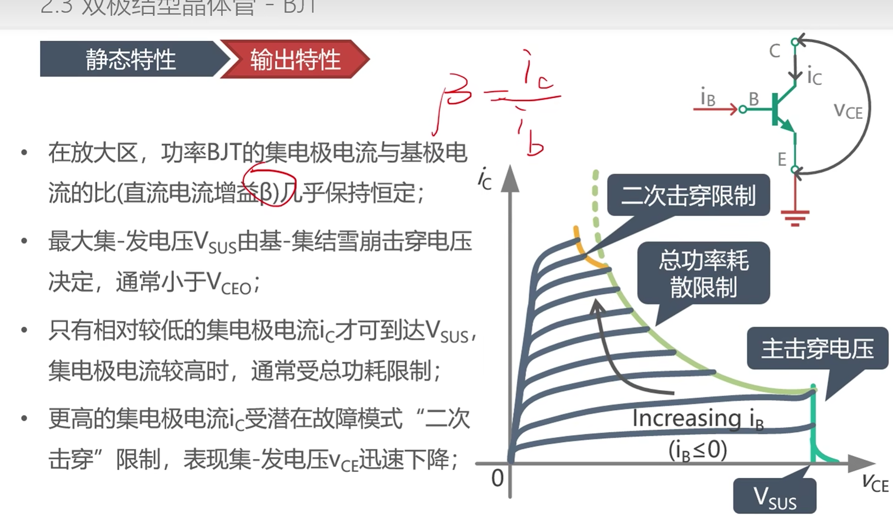
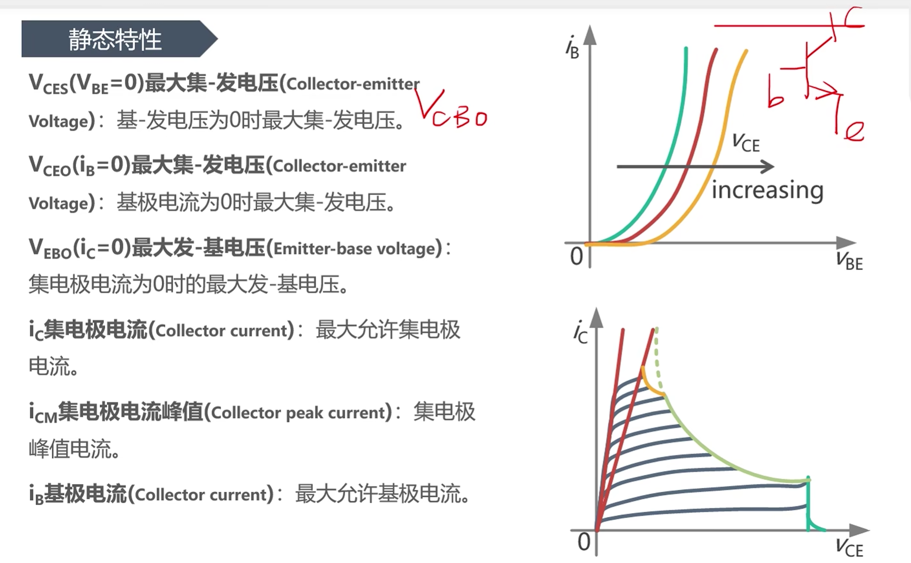
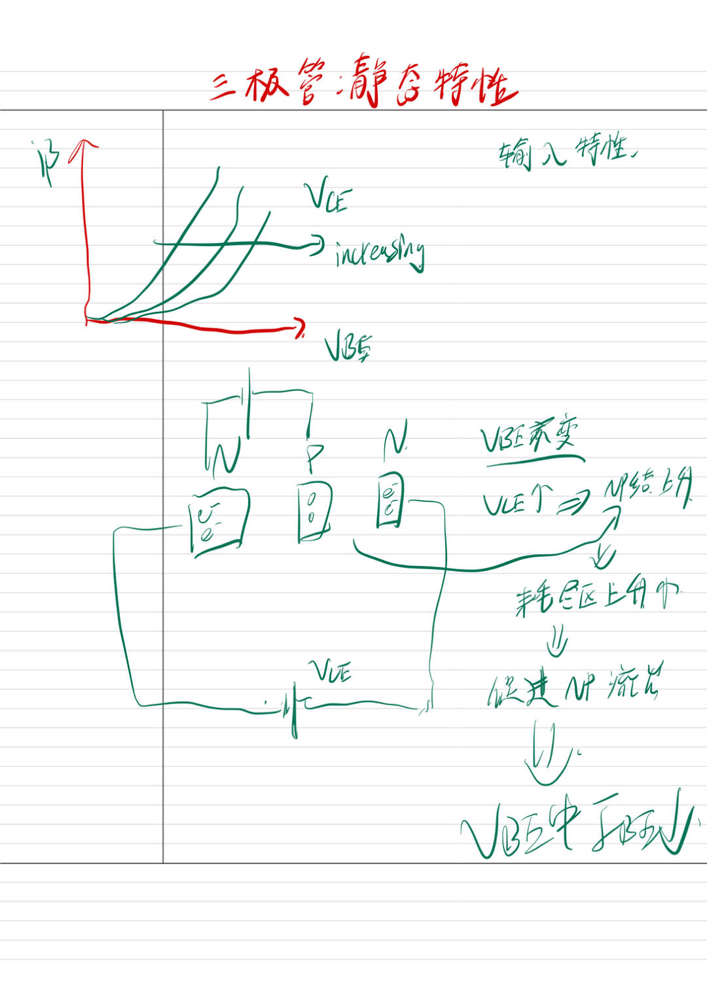
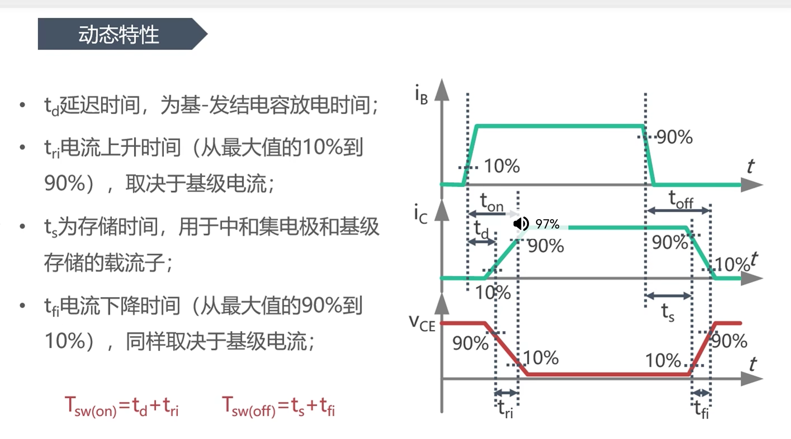

# 功率三极管

> [!abstract] 核心本质
> 功率三极管是电流驱动型功率开关。MCU 不能直接驱动它的大电流主回路，而是通过基极电流控制集电极到发射极之间的大电流。

## 一句话结论

功率三极管的关键是“用小基极电流控制大集电极电流”，但它需要持续驱动电流，关断时还要清除基区存储电荷，所以现代嵌入式功率控制中常被 [[MOSFET]] 和 [[IGBT]] 取代。

## 原始图像笔记

NPN 三极管可以理解为两块 N 型半导体夹着一块很薄的 P 型基区，形成发射结和集电结。基区越薄，载流子越容易穿过基区到达集电极。

### 截止区

### 放大区

[关于晶体管的视频](https://www.bilibili.com/video/BV1qx411S7cF/?spm_id_from=333.788.comment.all.click&vd_source=603f3c284e76fbe772654083937e3fac)

## 工作原理

以 NPN 管为例，基极-发射极正偏后，发射极向基区注入大量电子。由于基区很薄，大部分电子还没来得及和空穴复合，就被集电结的反向电场拉向集电极，形成主回路电流。

近似关系为：

$$
I_C \approx \beta I_B
$$

其中 $I_B$ 是基极电流，$I_C$ 是集电极电流，$\beta$ 是电流放大倍数。功率三极管为了耐压和大电流，会牺牲一部分放大倍数，所以实际功率 BJT 的 $\beta$ 往往不高。

## NPN 与 PNP

| 类型 | 主要载流子 | 功率场景中的地位 |
|---|---|---|
| NPN | 电子 | 更常见，电子迁移率高，速度和性能更好 |
| PNP | 空穴 | 大功率性能较弱，更多出现在互补电路或器件内部结构 |

在大功率电力电子中，NPN 更常见，因为电子迁移率高于空穴，开关速度和电流能力更有优势。

## 静态工作区

| 工作区 | 条件 | 开关等效 | 嵌入式使用建议 |
|---|---|---|---|
| 截止区 | $I_B \approx 0$ | 断开 | 作为关断状态 |
| 放大区 | $I_C$ 受 $I_B$ 线性控制 | 半开 | 功率开关中尽量快速穿越 |
| 饱和区 | 基极驱动充足，$V_{CE}$ 很低 | 闭合 | 作为导通状态 |

> [!danger] 致命陷阱
> 功率开关不能长时间停在放大区。此时器件同时承受较高 $V_{CE}$ 和较大 $I_C$，瞬时功耗 $P = V_{CE} \times I_C$ 很大，容易热失控。

## 动态特性

三极管的开通和关断都不是瞬间完成的：

| 阶段 | 参数 | 主要原因 |
|---|---|---|
| 延迟时间 | $t_d$ | 结电容充电、载流子建立 |
| 上升时间 | $t_r$ | 集电极电流上升到目标值 |
| 存储时间 | $t_s$ | 饱和导通时基区存储电荷需要清除 |
| 下降时间 | $t_f$ | 集电极电流下降 |

存储时间 $t_s$ 是功率 BJT 的主要短板。饱和越深，关断越慢；驱动越粗暴，导通越容易，但关断可能更拖泥带水。

## 驱动与保护

### 基极驱动

基极驱动必须提供足够电流：

$$
I_B \ge \frac{I_C}{\beta_{forced}}
$$

工程中常用“强迫 $\beta$”而不是数据手册里漂亮的典型 $\beta$，例如按 5 到 10 估算，保证器件在最差情况下仍能饱和。

### 达林顿管

达林顿结构把两个三极管级联，让总放大倍数约等于两级放大倍数相乘。它能减轻 MCU 驱动压力，但代价是：

- 饱和压降更高，[[导通损耗]] 更大。
- 存储电荷更多，关断更慢。
- 不适合高频 PWM 功率开关。

### 二次击穿

功率 BJT 存在二次击穿风险。局部热点会让电流进一步集中，形成不可逆热损坏。因此选型不能只看最大电流，还要看 SOA。

## 嵌入式应用

功率三极管今天更多用于学习和低速开关场景，例如继电器驱动、小电磁铁、低频负载控制。若要做高频 PWM、电机调速或开关电源，优先考虑 [[MOSFET]] 或 [[IGBT]]。

> [!note] 工程启示
> MCU GPIO 直接推功率 BJT 通常不可靠。需要基极电阻、合适的驱动级、续流二极管和热设计。感性负载必须给电流释放路径。

## 常见误区

- 把小信号三极管的 $\beta$ 直接套到功率开关计算。
- 只让 BJT “刚好导通”，导致它停在放大区发热。
- 忽略饱和越深关断越慢。
- 用 BJT 做高频 PWM，却不估算存储时间和开关损耗。

## 知识延伸

- ⬆️ 上位知识：[[电力电子总览]]、[[PN结]]、[[半导体物理]]
- ⬇️ 下位知识：达林顿管、GTR、基极驱动、SOA
- ➡️ 平级关联：[[MOSFET]]、[[IGBT]]、[[PWM]]、[[导通损耗]]
