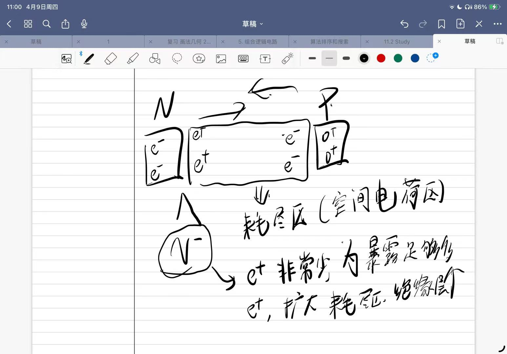
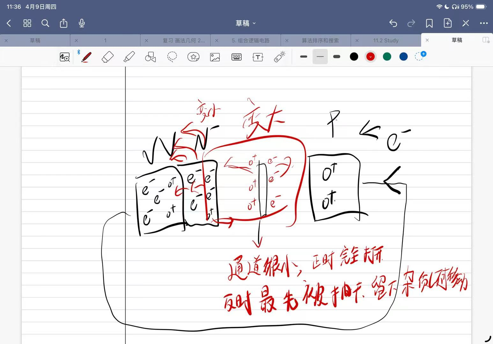

# 功率二极管

> [!abstract] 核心本质
> 功率二极管是最基础的非受控功率器件。它不需要 MCU 控制，只由外部电压电流决定导通或截止，常用于整流、续流、钳位和反接保护。

## 核心结论

功率二极管的工程价值在于“给电流一条正确的路”。它没有控制端，但它的 $V_F$ 会产生 [[导通损耗]]，$t_{rr}$ 和 $Q_{rr}$ 会带来 [[开关损耗]]、电压尖峰和对开关管的冲击。

## 什么时候用

- 给电感、电机、继电器、电磁阀提供 [[续流路径]]。
- AC/DC 整流、反接保护、简单钳位。
- 低成本、低复杂度、对开关速度要求不高的保护路径。
- 肖特基适合低压高速续流，快恢复二极管适合开关电源整流。

## 什么时候不用

- 高频硬开关中随手使用普通整流二极管，反向恢复可能非常糟糕。
- 低压大电流串联防反接时，二极管压降会造成明显发热和压降损失。
- 希望快速释放继电器或电磁阀能量时，普通续流二极管可能让释放变慢。
- 需要精确主动控制电流路径时，应考虑 MOSFET 同步整流或主动钳位。

## 控制本质

二极管没有控制端，只由阳极和阴极之间的电压决定工作状态。功率二极管为了耐压和大电流，典型结构更接近 PiN。

| 结构层 | 作用 | 工程意义 |
|---|---|---|
| $P^+$ 阳极 | 注入空穴，降低接触电阻 | 保证大电流导通能力 |
| $N^-$ [[漂移区]] | 承受反向电压 | 决定耐压，也增加导通电阻 |
| $N^+$ 阴极 | 注入电子，降低接触电阻 | 保证低接触损耗 |

核心矛盾是：漂移区越厚、掺杂越低，耐压越高；但导通阻力和存储电荷也会增加。

## 关键参数

| 参数 | 含义 | 嵌入式关注点 |
|---|---|---|
| $V_R$ / $V_{RRM}$ | 反向耐压 | 要覆盖电源、尖峰和裕量 |
| $I_F$ | 正向电流 | 必须结合封装散热看 |
| $V_F$ | 正向压降 | 决定 [[导通损耗]] 和温升 |
| $I_{FSM}$ | 浪涌电流 | 上电、短路、整流电容充电时很关键 |
| $t_{rr}$ | 反向恢复时间 | 限制开关频率 |
| $Q_{rr}$ | 反向恢复电荷 | 决定恢复损耗和尖峰严重程度 |

## 损耗与热

二极管导通损耗近似为：

$$
P_{cond} \approx V_F \times I \times D
$$

低压系统里，哪怕 0.5V 到 1V 的压降也可能很痛。比如 5A 电流经过 0.8V 二极管，就是 4W 热量，必须认真处理封装、铜皮和散热。

从正向导通切换到反向截止时，漂移区里存着大量载流子。外部电压反向后，这些电荷不会瞬间消失，而是先被抽走，形成短暂的反向恢复电流。

## 驱动与保护

二极管不需要驱动，但它经常是保护链路的一部分：

- 感性负载并联二极管，给断电后的电流释放路径。
- TVS 或齐纳钳位可以让电感能量更快释放，但电压应力更高。
- 整流桥要考虑浪涌电流和电容充电冲击。
- 防反接若压降不可接受，可以改用 P-MOS 理想二极管方案。

> [!note] 工程启示
> 续流二极管会让电流衰减变慢。继电器释放时间、电磁阀关断速度、电机刹车响应都可能因此变慢。

## 调试波形

用 [[1.1-示波器是什么|示波器]] 优先看：

- 二极管两端电压：正向压降、反向尖峰、钳位电压。
- 开关管 $V_{DS}$ 或 $V_{CE}$：确认二极管是否真的接住感性尖峰。
- 负载电流衰减：判断续流路径是否让释放太慢。
- 高频整流：反向恢复电流是否冲击开关节点。

## 常见误区

- 只看电流额定值，不看封装热阻和散热条件。
- 在高频开关里使用普通整流二极管，导致反向恢复尖峰严重。
- 认为二极管“自动保护一切”，忽略浪涌能量是否超过器件能力。
- 用万用表二极管档读数代替实际工作电流下的 $V_F$。

## 相关链接

- 上位入口：[[电力电子总览]]、[[电子元件共性]]
- 前置概念：[[PN结]]、[[漂移区]]、[[导通损耗]]、[[开关损耗]]、[[续流路径]]
- 对比器件：[[MOSFET]]、[[IGBT]]
- 工程入口：[[基础的电机驱动理解|电机驱动]]、[[1.1-示波器是什么|示波器]]

## 原始图像与课堂记录

### PN 结的电子移动过程

这张图可以用来理解 [[PN结]] 的正向导通：外加正向电压削弱内建电场，电子和空穴跨过结区扩散并复合，于是形成持续电流。

### PN 结的变化过程

反向偏置时，耗尽层变宽，器件表现为高阻态。功率二极管为了提高耐压，会把这个“能承受电压的区域”做得更厚，也就是引入低掺杂的 [[漂移区]]。
