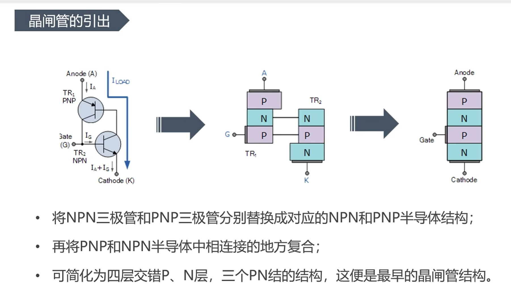
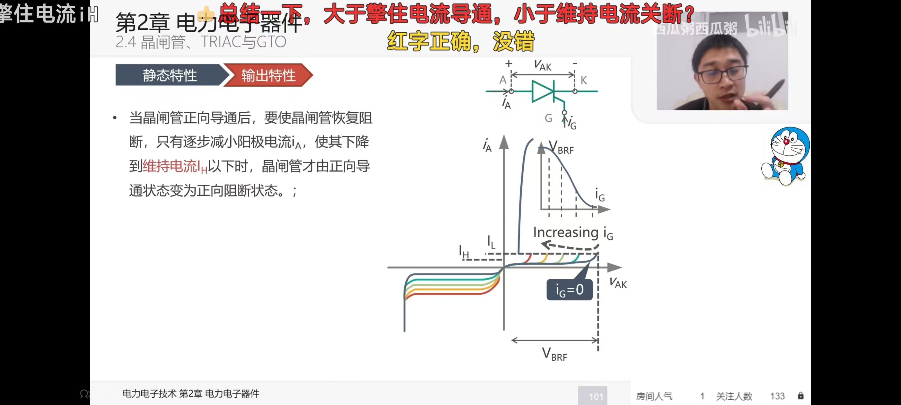
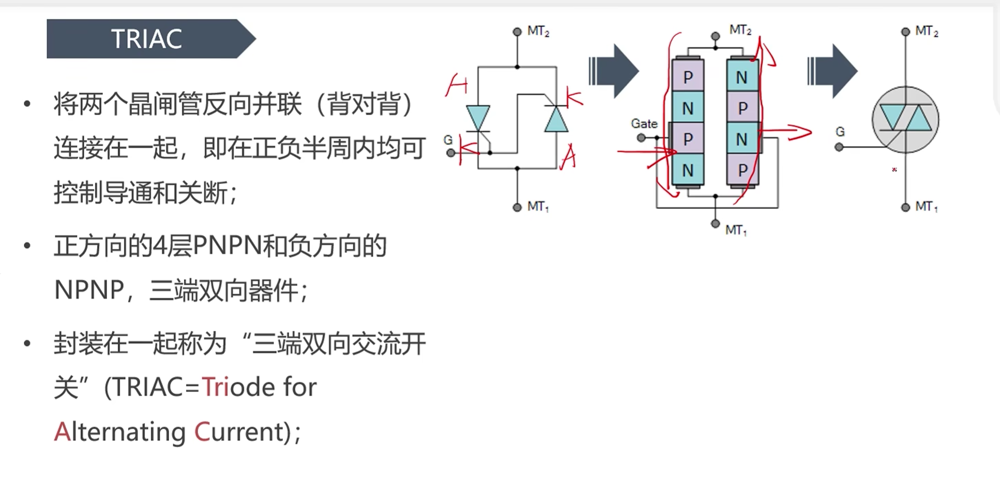
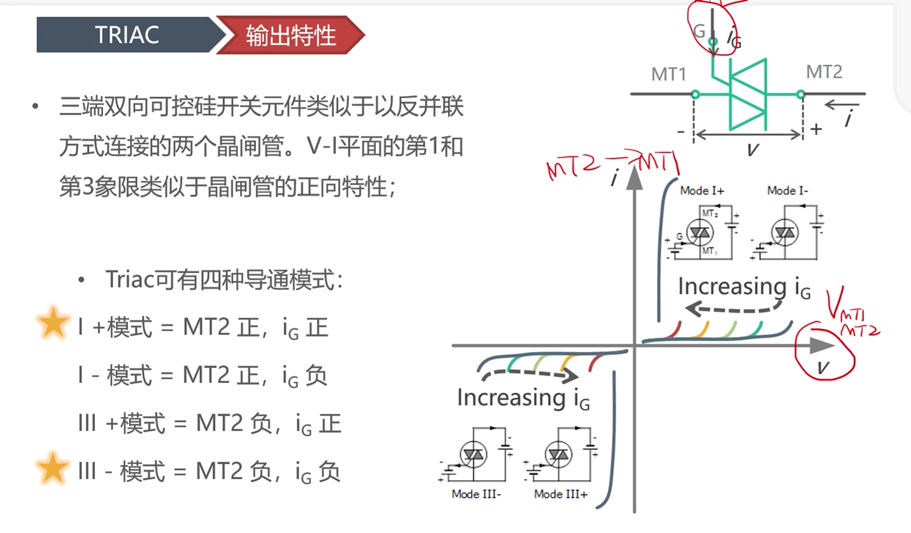
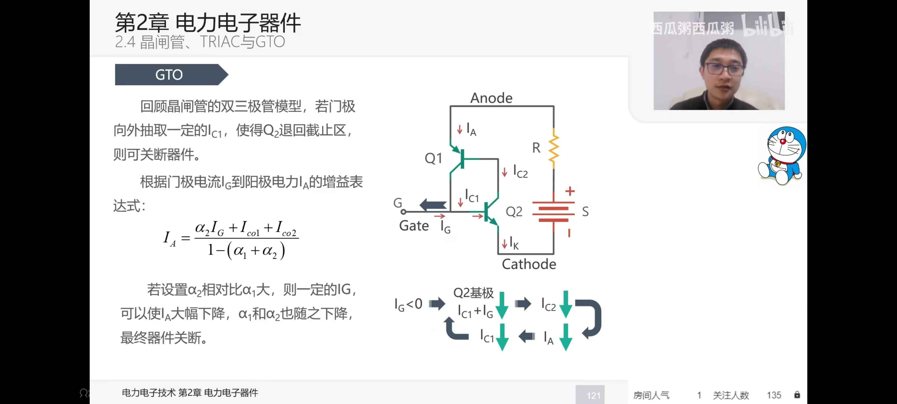
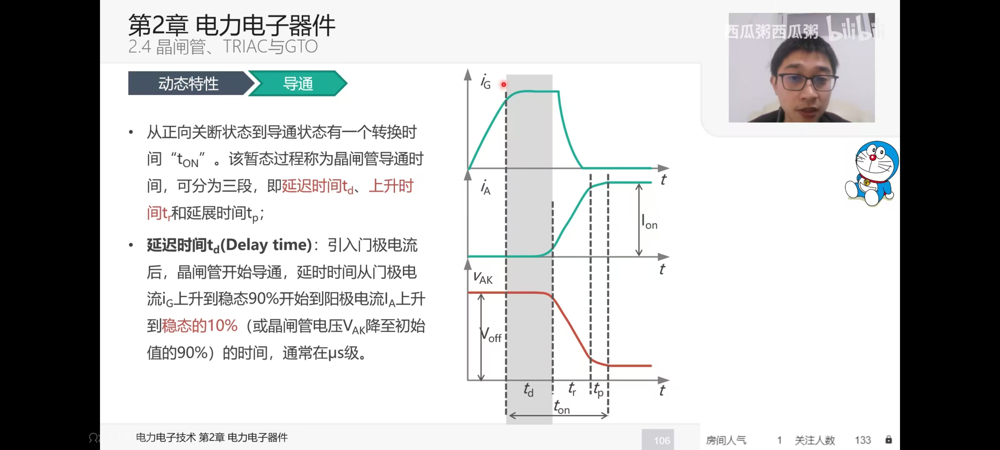
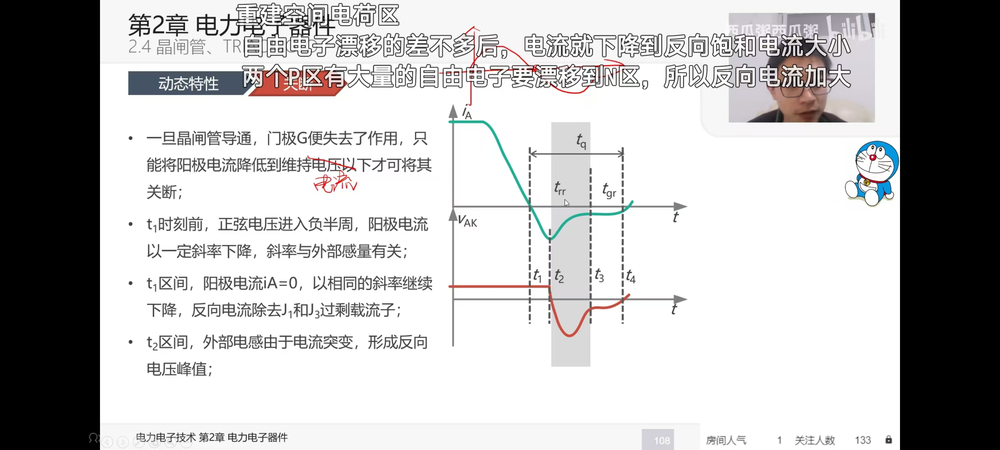

#### 物理构成

- 那个；老师讲反了关于cbe的关系，害的我还要去搜一下，就说怎么越听越不对劲

简单来说，SCR 相当于电力电子世界里的**“单向大功率水龙头”**。它的主要作用是**在极高电压和大电流环境下实现开关控制与电能变换**（如可控整流、交流调压、无触点开关等）。

从我们嵌入式底层的视角来看，你需要记住它的核心控制特征：

1. **半控型器件：** 你的 MCU 只能控制它“什么时候导通”（通过 GPIO 或定时器给门极发触发脉冲），但**无法**通过软件撤销脉冲来让它关断。
    
2. **电流维持特性：** 一旦触发导通，哪怕你软件把触发信号清零，它依然导通。只有当外部主回路的电流自然下降到维持电流（$I_H$）以下，或者两端电压反向时，它才会真正关断。

1. **半控属性（控得住开，控不住关）：** 你的 MCU 只能通过门极（Gate）发脉冲让它导通。一旦导通，MCU 就彻底失去控制权，无法通过拉低 GPIO 让它关断。
2. **开通看** IL​**（脉冲不能太短）：** MCU 给出的触发脉冲必须有足够的宽度。在脉冲结束前，主电路的阳极电流必须爬升并超过**擎住电流（**IL​**）**，否则脉冲一撤，管子立马熄火。
3. **关断看** IH​**（全靠外部造势）：** 要想关断它，唯一的办法是依靠外部电路（比如交流电自然过零，或 LC 强迫换流），硬生生把阳极电流降到**维持电流（IH​）**以下。
4. **动态双杀（**di/dt **与** du/dt**）：** 开通瞬间电流上升太快（di/dt 过大）会局部烧毁器件（需串联电感限制）；关断状态下电压上升太快（du/dt 过大）会通过内部结电容产生位移电流，导致器件“未经 MCU 允许”就意外误导通（需并联 RC 缓冲电路限制）。

#### 静态与动态特性

**静态输入和输出特性**：

#### 1. 正向特性（分为阻断与导通）

- **正向阻断状态（Forward Blocking）：** 当 $U_{AK} > 0$ 但门极没有触发电流（$I_G = 0$）时，器件内部中间的 PN 结反偏，只有极小的正向漏电流流过。此时晶闸管相当于断开的开关。
    
- **正向导通状态（Forward Conduction）：** * **电压击穿导通（非正常）：** 如果不断增加 $U_{AK}$，达到“正向转折电压（$U_{bo}$）”时，晶闸管会被强制导通（可能损坏器件）。
    
    - **门极触发导通（正常工作）：** 当我们注入门极电流 $I_G$ 时，正向转折电压 $U_{bo}$ 会急剧下降。$I_G$ 越大，转折电压越低。在实际嵌入式控制中，我们通常施加正常的电源电压，然后给一个 $I_G$ 脉冲，让器件迅速越过转折点进入导通区。导通后，管压降仅为 1.5V ~ 2V 左右。
        

#### 2. 反向特性（反向阻断与击穿）

- **反向阻断状态：** 当 $U_{AK} < 0$ 时，特性类似于普通二极管的反向状态。器件处于高阻态，只有微小的反向漏电流。
    
- **反向击穿状态：** 当反向电压超过“反向击穿电压（$U_{BR}$）”时，反向电流急剧增加，如果不加外部限流，器件会因热击穿而永久损坏。
    

#### 3. 两个极其重要的“临界电流”（代码逻辑的关注点）

这决定了你的触发脉冲要给多久，以及如何判断器件是否已经关断：

- **擎住电流 ($I_L$ - Latching Current)：** 在门极触发晶闸管导通后，如果**马上**撤除门极脉冲，为了维持晶闸管继续导通，阳极电流 $I_A$ 必须达到的**最小电流值**。
    
    - _嵌入式启示：_ 你的 MCU 给出的触发 PWM 脉冲宽度不能太窄。必须保证在脉冲持续期间，主电路的电流 $I_A$ 已经建立并超过了 $I_L$，否则脉冲一停，管子又关了。
        
- **维持电流 ($I_H$ - Holding Current)：** 晶闸管**已经完全导通后**，如果要让它恢复到阻断（关断）状态，必须把阳极电流 $I_A$ 降到的**最大临界值**。
    
    - _嵌入式启示：_ 这就是关断晶闸管的唯一方法！你必须通过外围电路（例如交流电的自然过零点，或者直流电路中的强迫换流电容），使流过晶闸管的电流 $I_A < I_H$（通常几毫安到几十毫安），晶闸管才会真正关断。注意：**$I_H$ 通常小于 $I_L$**。

**动态特性的输入和输出**：

### 一、 开通过程与 $di/dt$ 限制

当你的 MCU 发出一个高电平给门极（Gate）时，晶闸管并不是瞬间导通的。整个开通过程分为两个阶段：

1. **延迟时间 ($t_d$ - Delay Time)：** 门极注入电流后，内部 PN 结附近的载流子开始聚集，此时阳极电流 $I_A$ 几乎没变，阳极电压 $U_{AK}$ 依然维持在高位。这通常需要 $0.5 \sim 1.5 \mu s$。
    
2. **上升时间 ($t_r$ - Rise Time)：** 导通区域迅速扩展到整个硅片，阳极电流 $I_A$ 陡然上升，管压降 $U_{AK}$ 迅速跌落到导通压降（约 1.5V）。这通常需要 $0.5 \sim 3 \mu s$。
    
3. **开通时间 ($t_{gt}$) = $t_d + t_r$**
    

**🛠️ 嵌入式与硬件设计的启示：**

- **代码侧（脉冲宽度）：** 你的触发脉冲宽度绝对不能小于 $t_{gt}$！通常为了可靠触发，软件上给出的脉冲宽度会设计在 $20 \sim 50 \mu s$ 甚至更长。如果脉冲太窄，管子还没完全导通你就撤销了触发信号，它会立刻关断。
    
- **硬件侧（致命的 $di/dt$）：** 在上升时间 $t_r$ 内，如果外部电路允许的电流上升速度过快（即 **$di/dt$ 过大**），会导致电流集中在门极附近的一小块硅片区域，产生局部极端高温，**直接把晶闸管烧出一个洞（热击穿）**。
    
    - _解决方案：_ 通常在晶闸管阳极串联一个极小的**进线电抗器（电感 $L$）**，利用电感电流不能突变的特性，强行限制 $di/dt$。
        

---

### 二、 关断过程与 $du/dt$ 限制

这是晶闸管最脆弱、也最容易引发系统故障的阶段。当外部主电路电流下降到维持电流 $I_H$ 以下时，晶闸管开始关断，这也分为两步：

1. **反向恢复时间 ($t_{rr}$ - Reverse Recovery Time)：** 和普通二极管一样，晶闸管导通时内部充满了多余的电荷。当电流过零反向时，这些电荷需要被“抽走”，形成一个短暂的、甚至很大的反向电流。直到反向电流恢复到零，器件才具备**反向阻断能力**。
    
2. **正向阻断恢复时间 ($t_{gr}$ - Gate Recovery Time)：** 此时如果你立刻给它加上正向电压，它会**不听使唤地直接导通**！因为中间 PN 结的复合过程还没结束。必须再等一段时间，等内部残留载流子彻底消失，它才重新具备**正向阻断能力**。
    
3. **关断时间 ($t_q$) = $t_{rr} + t_{gr}$** （普通晶闸管通常在几十到几百微秒级别，非常慢！）

### TRIAC

**为了解决交变电流的处理**

## GTO

