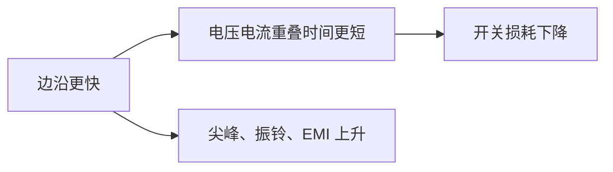

# 开关损耗

## 核心结论

开关损耗发生在器件从关到开、从开到关的过渡瞬间。只要电压和电流在时间上重叠，就会把能量变成热；频率越高，这部分越容易成为主导损耗。

## 工程直觉

边沿不是越快越好。驱动太弱会让器件慢慢穿过线性区而发热；驱动太强又可能让寄生电感、电容制造过冲、振铃和误触发。

## 主要来源

- [[MOSFET]]：栅极电荷、米勒平台、体二极管反向恢复。
- [[IGBT]]：开通/关断能量，尤其是关断拖尾电流。
- [[功率二极管]]：反向恢复电荷 $Q_{rr}$。
- [[晶闸管（SCR）以及衍生的TRIAC与GTO]]：恢复时间、换流过程和 $du/dt$ 误触发。

## 调试关注

- 用 [[1.1-示波器是什么|示波器]] 同时看开关节点电压和电流。
- 比较不同栅极电阻下的尖峰、振铃和温升。
- 高频 [[TIM定时器基础概念|PWM]] 下不要只算 [[导通损耗]]。
