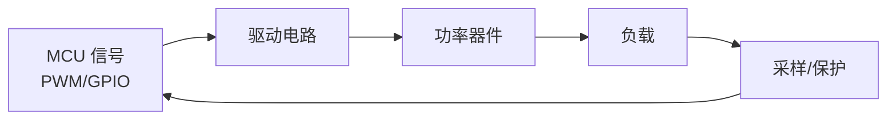
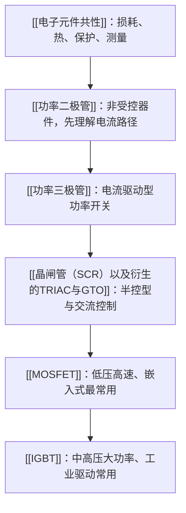

# 电力电子总览

> [!abstract] 核心本质
> 电力电子不是单纯研究“元件长什么样”，而是研究如何用功率半导体把电能高效率地变换、控制和保护。对软件工程师来说，重点是理解 MCU 输出的 [[TIM定时器基础概念|PWM]]、GPIO 和保护逻辑如何影响真实的大电压、大电流回路。

## 核心结论

功率器件的学习主线不是“背器件型号”，而是建立一条工程判断链：

软件能决定什么时候开关，但器件是否可靠，取决于 [[栅极驱动]]、[[续流路径]]、[[导通损耗]]、[[开关损耗]]、热设计、布局寄生和硬件级保护。

## 学习路径

## 器件速查

| 器件 | 控制方式 | 适合场景 | 主要风险 | 软件工程师要盯住 |
|---|---|---|---|---|
| [[功率二极管]] | 不可控 | 整流、续流、防反接、钳位 | $V_F$ 发热、反向恢复、浪涌 | 电流有没有正确释放路径 |
| [[功率三极管]] | 电流驱动 | 低速继电器、电磁铁、学习功率开关 | 基极电流不足、关断慢、二次击穿 | 不能只套小信号管的 $\beta$ |
| [[晶闸管（SCR）以及衍生的TRIAC与GTO]] | 门极触发 | 交流调压、可控整流、固态开关 | 只能控开难控关、误触发、换流失败 | 触发角、过零、$I_L$、$I_H$、$du/dt$ |
| [[MOSFET]] | 电压驱动 | 低压电机、LED、电磁阀、DC-DC、H 桥 | 栅极误导通、体二极管恢复、尖峰、发热 | $V_{GS}$、$R_{DS(on)}$、$Q_g$、[[死区时间]] |
| [[IGBT]] | 电压驱动 | 变频器、逆变器、UPS、中高压电机驱动 | 拖尾电流、短路耐受时间短、过压 | 驱动电压、DESAT、软关断、母线尖峰 |

## 工程判断顺序

1. 先判断器件是否可控、能不能主动关断。
2. 再判断主回路电压、电流和故障能量是否在 [[SOA]] 内。
3. 估算 [[导通损耗]] 和 [[开关损耗]]，确认散热路径成立。
4. 检查驱动是否能把器件快速、可靠、不过冲地开关。
5. 给感性负载、电缆寄生和桥臂切换设计 [[续流路径]]、吸收和保护。
6. 用 [[../../示波器/01-原理与认知/1.1-示波器是什么|示波器]] 低压限流验证，再逐步升压升流。

## 核心矛盾

| 矛盾 | 工程含义 | 常见后果 |
|---|---|---|
| 耐压 vs 导通损耗 | 高耐压通常需要更厚、更低掺杂的 [[漂移区]] | $R_{DS(on)}$ 或压降变大 |
| 开关速度 vs EMI | 边沿越快，损耗越低，但 $dv/dt$、$di/dt$ 越大 | 振铃、误触发、辐射干扰 |
| 驱动强度 vs 可靠性 | 驱动太弱发热，太强可能过冲 | 栅极尖峰、反向恢复冲击 |
| 软件保护 vs 硬件保护 | 软件判断有采样和执行延迟 | 短路、直通类故障来不及救 |

## 参数速查

| 参数 | 常见器件 | 含义 |
|---|---|---|
| $V_F$ | [[功率二极管]] | 正向压降，直接决定低压大电流下的 [[导通损耗]] |
| $Q_{rr}$、$t_{rr}$ | 二极管、SCR、MOSFET 体二极管 | 反向恢复电荷/时间，影响尖峰和 [[开关损耗]] |
| $R_{DS(on)}$ | [[MOSFET]] | 导通电阻，必须看实际 $V_{GS}$ 和温度 |
| $Q_g$ | [[MOSFET]]、[[IGBT]] | 栅极总电荷，决定 [[栅极驱动]] 电流需求 |
| $V_{CE(sat)}$ | [[功率三极管]]、[[IGBT]] | 饱和压降，决定大电流导通损耗 |
| $I_L$、$I_H$ | SCR/TRIAC | 擎住电流和维持电流，决定触发和关断条件 |
| SOA | 功率器件 | 安全工作区，限制电压、电流、时间和温度组合 |

## 相关入口

- 上位基础：电路基础、半导体基础、[[TIM定时器基础概念|PWM]]
- 工程应用：[[基础的电机驱动理解|电机驱动]]、H 桥、DC-DC、逆变器
- 调试工具：[[../../示波器/01-原理与认知/1.1-示波器是什么|示波器]]、电流探头、差分探头、低感采样电阻
- 概念卡片：[[PN结]]、[[漂移区]]、[[导通损耗]]、[[开关损耗]]、[[栅极驱动]]、[[续流路径]]、[[SOA]]、[[死区时间]]
