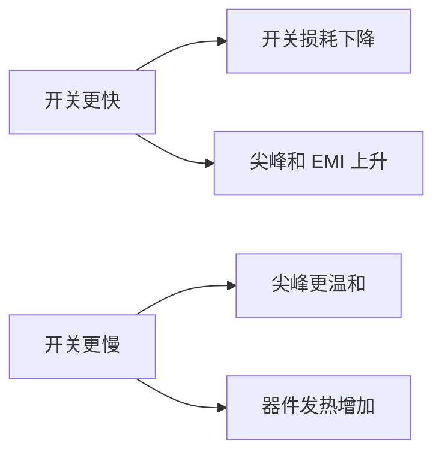
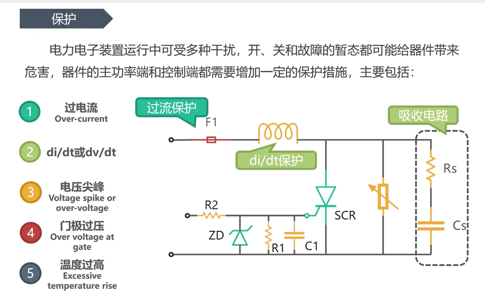
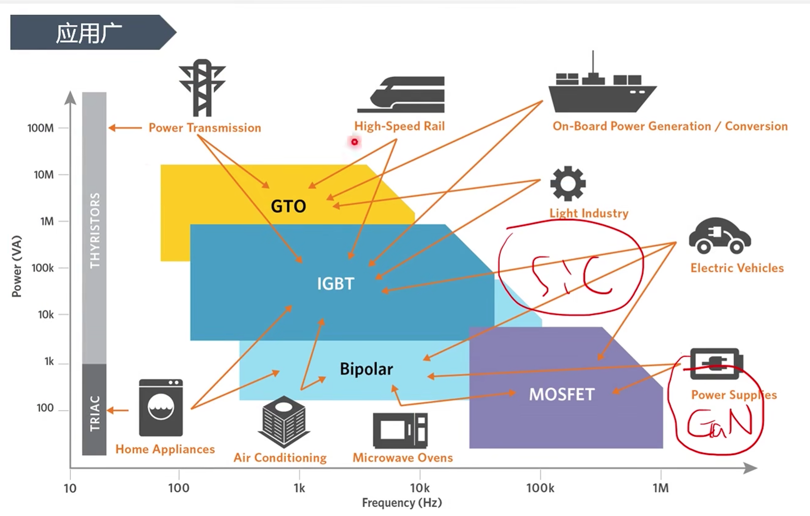
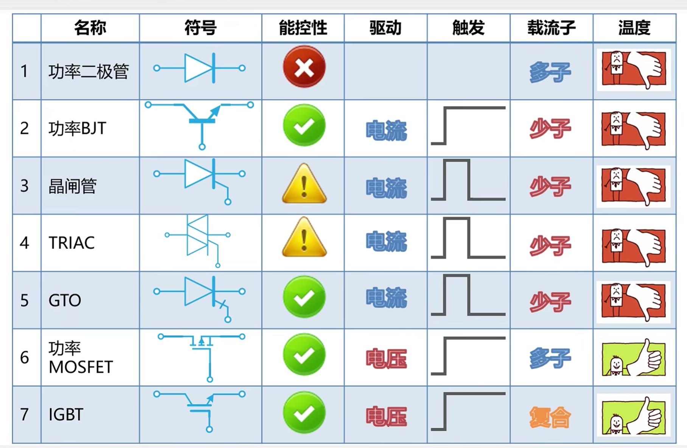

# 电子元件共性

> [!abstract] 核心本质
> 功率器件的共性不是“能不能导通”，而是能不能在真实电压、电流、温度、尖峰和故障条件下长期可靠工作。

## 核心结论

做嵌入式硬件控制时，功率器件必须同时看驱动、损耗、热、保护和测量。只看数据手册首页的最大电压、最大电流，基本一定会踩坑。

## 工程速查

| 问题 | 典型来源 | 后果 | 先看哪里 |
|---|---|---|---|
| [[导通损耗]] | $V_F$、$R_{DS(on)}$、$V_{CE(sat)}$ | 温升、效率下降 | 稳态电流、占空比、散热 |
| [[开关损耗]] | 电压电流重叠、反向恢复、拖尾电流 | 高频发热、尖峰 | 开关频率、边沿速度、驱动能力 |
| 过压 | 电感断流、线缆寄生、电源浪涌 | 击穿 | [[续流路径]]、TVS、RC/RCD 吸收 |
| 过流 | 堵转、短路、负载异常 | 热失控或键合线熔断 | 采样、比较器、驱动器保护 |
| 误导通 | 栅极悬空、$dv/dt$、米勒效应 | 直通、异常启动 | [[栅极驱动]]、下拉、米勒钳位 |
| 散热不足 | 封装、铜皮、散热器、风道不足 | 结温超限 | 热阻、PCB 铜皮、环境温度 |

## 损耗与热

不同器件的导通损耗模型不一样：

| 器件 | 近似模型 | 第一判断 |
|---|---|---|
| [[功率二极管]] | $P \approx V_F \times I$ | 低压大电流时压降很要命 |
| [[MOSFET]] | $P \approx I^2 \times R_{DS(on)}$ | 电流翻倍，损耗约四倍 |
| [[IGBT]] | $P \approx V_{CE(sat)} \times I$ | 中高压大电流下常比高压 MOSFET 合适 |
| [[功率三极管]] | $P \approx V_{CE(sat)} \times I_C$ | 饱和压降和存储时间都要看 |

开关瞬间，器件两端电压还没降完，电流已经上来；或者电流还没关完，电压已经升高。电压和电流重叠的面积就是开关能量损耗。

功率器件最终都要落到结温：

$$
T_J = T_A + P \times R_{\theta JA}
$$

更完整的热路径是“芯片结 -> 封装/焊盘 -> PCB 铜皮或散热器 -> 空气”。小 PCB、无风、封闭外壳、环境温度高时，实际可用电流会大幅下降。

## 驱动与保护

| 器件 | 驱动本质 | 常见问题 |
|---|---|---|
| [[功率二极管]] | 无控制端 | 反向恢复、浪涌、热 |
| [[功率三极管]] | 电流驱动 | 基极电流不足、饱和太深、关断慢 |
| [[晶闸管（SCR）以及衍生的TRIAC与GTO]] | 门极触发 | 只能控开、误触发、过零和换流问题 |
| [[MOSFET]] | 栅极电荷充放电 | 栅极悬空、驱动太弱、米勒误导通 |
| [[IGBT]] | 栅极电荷充放电 | 短路保护、拖尾电流、负压关断 |

MCU 的 GPIO 通常只适合逻辑控制，不适合直接驱动大栅极电荷或隔离高压侧。功率系统里经常需要门极/栅极驱动器、光耦隔离、数字隔离器或智能功率模块。

> [!danger] 致命陷阱
> 保护链路不能全靠软件。短路、桥臂直通、IGBT 退饱和这类故障通常在微秒级变坏，必须有硬件级快速关断。

## 调试波形

功率电路调试离不开 [[../../示波器/01-原理与认知/1.1-示波器是什么|示波器]]，但测量本身也会影响电路。

必看波形：

- 栅源电压 $V_{GS}$ 或门极电压。
- 漏源电压 $V_{DS}$ / 集射电压 $V_{CE}$。
- 电流采样波形。
- 开关节点振铃。
- 电源母线纹波和尖峰。

测量注意：

- 普通探头地夹很长，容易引入环路，看到假的振铃。
- 高边、市电侧或半桥开关节点要用差分探头或隔离方案。
- 电流波形最好用电流探头或低感采样电阻。
- 先低压限流验证，再逐步升压升流。

## 选型检查清单

- 电压额定值是否覆盖正常电压、浪涌和尖峰？
- 电流额定值是否在实际散热条件下成立？
- [[导通损耗]] 和 [[开关损耗]] 总和是否可散掉？
- 驱动电压和驱动电流是否足够？
- 感性负载的 [[续流路径]] 是否明确？
- 故障保护是否快于器件损坏时间？
- PCB 走线、回流路径和功率地是否合理？
- 是否用 [[../../示波器/01-原理与认知/1.1-示波器是什么|示波器]] 验证过真实波形？

## 常见误区

- 把最大额定值当作长期工作值。
- 只看典型值，不看最差值和温度曲线。
- 忽略封装热阻，以为同型号不同封装能力一样。
- 只在静态直流下测试，没看开关瞬间。
- 认为代码限流可以替代硬件短路保护。

## 相关链接

- 上位入口：[[电力电子总览]]
- 器件入口：[[功率二极管]]、[[功率三极管]]、[[晶闸管（SCR）以及衍生的TRIAC与GTO]]、[[MOSFET]]、[[IGBT]]
- 概念卡片：[[导通损耗]]、[[开关损耗]]、[[栅极驱动]]、[[续流路径]]、[[SOA]]、[[死区时间]]
- 工程入口：[[TIM定时器基础概念|PWM]]、[[基础的电机驱动理解|电机驱动]]、[[../../示波器/01-原理与认知/1.1-示波器是什么|示波器]]

## 原始图像与课堂记录

### 保护

### 应用

