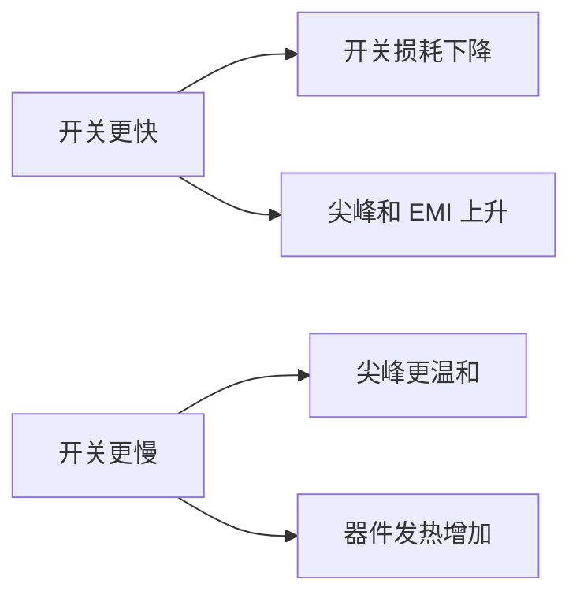

# 电子元件共性

> [!abstract] 核心本质
> 功率器件的共性不是“能不能导通”，而是能不能在真实电压、电流、温度、尖峰和故障条件下长期可靠工作。

## 一句话结论

做嵌入式硬件控制时，功率器件必须同时看驱动、损耗、热、保护和测量；只看数据手册首页的最大电压最大电流，基本一定会踩坑。

## 原始图像笔记

## 保护

## 应用

## 功率器件的共同问题

| 问题 | 典型来源 | 后果 |
|---|---|---|
| [[导通损耗]] | $V_F$、$R_{DS(on)}$、$V_{CE(sat)}$ | 温升、效率下降 |
| [[开关损耗]] | 电压电流重叠、反向恢复、拖尾电流 | 高频发热 |
| 过压 | 电感断流、线缆寄生、电源浪涌 | 击穿 |
| 过流 | 堵转、短路、负载异常 | 热失控或键合线熔断 |
| 误导通 | 栅极悬空、$dv/dt$、米勒效应 | 直通、异常启动 |
| 散热不足 | 封装、铜皮、散热器、风道不足 | 结温超限 |

## 损耗模型

### 导通损耗

不同器件的导通损耗模型不一样：

| 器件 | 近似模型 |
|---|---|
| [[功率二极管]] | $P \approx V_F \times I$ |
| [[MOSFET]] | $P \approx I^2 \times R_{DS(on)}$ |
| [[IGBT]] | $P \approx V_{CE(sat)} \times I$ |
| [[功率三极管]] | $P \approx V_{CE(sat)} \times I_C$ |

### 开关损耗

开关瞬间，器件两端电压还没降完，电流已经上来；或者电流还没关完，电压已经升高。电压和电流重叠的面积就是开关能量损耗。

## 热设计

功率器件最终都要落到结温：

$$
T_J = T_A + P \times R_{\theta JA}
$$

更完整的路径是：

| 参数 | 含义 |
|---|---|
| $T_J$ | 结温 |
| $T_A$ | 环境温度 |
| $R_{\theta JA}$ | 结到环境热阻 |
| $R_{\theta JC}$ | 结到壳热阻 |

> [!warning] 避坑指南
> 数据手册的最大电流往往建立在理想散热条件下。小 PCB、无风、封闭外壳、环境温度高时，实际可用电流会大幅下降。

## 驱动共性

| 器件 | 驱动本质 | 常见问题 |
|---|---|---|
| 二极管 | 无控制端 | 反向恢复和浪涌 |
| BJT | 电流驱动 | 基极电流不足、饱和太深 |
| SCR/TRIAC | 门极触发 | 只能控开、误触发、过零问题 |
| MOSFET | 栅极电荷充放电 | 栅极悬空、驱动太弱、米勒误导通 |
| IGBT | 栅极电荷充放电 | 短路保护、拖尾电流、负压关断 |

MCU 的 GPIO 通常只适合逻辑控制，不适合直接驱动大栅极电荷或隔离高压侧。功率系统里经常需要栅极驱动器、光耦隔离、数字隔离器或专用智能功率模块。

## 保护思路

| 风险 | 常见保护 |
|---|---|
| 感性尖峰 | 续流二极管、TVS、RC/RCD 吸收 |
| 过流/短路 | 采样电阻、比较器、驱动芯片关断 |
| 过温 | NTC、温度传感器、降额控制 |
| 反接 | 串联二极管、P-MOS 理想二极管 |
| 栅极误导通 | 下拉电阻、米勒钳位、负压关断 |
| 上下管直通 | 死区时间、互锁逻辑、驱动器保护 |

> [!danger] 致命陷阱
> 保护链路不能全靠软件。短路、直通、IGBT 退饱和这类故障通常在微秒级变坏，必须有硬件级快速关断。

## 测量与调试

功率电路调试离不开 [[示波器]]，但测量本身也会影响电路。

### 必看波形

- 栅源电压 $V_{GS}$ 或门极电压。
- 漏源电压 $V_{DS}$ / 集射电压 $V_{CE}$。
- 电流采样波形。
- 开关节点振铃。
- 电源母线纹波和尖峰。

### 测量注意

- 普通探头地夹很长，容易引入环路，看到假的振铃。
- 高边或市电侧测量要用差分探头或隔离方案。
- 电流波形最好用电流探头或低感采样电阻。
- 先低压限流验证，再逐步升压升流。

## 选型检查清单

- 电压额定值是否覆盖正常电压、浪涌和尖峰？
- 电流额定值是否在实际散热条件下成立？
- 导通损耗和开关损耗总和是否可散掉？
- 驱动电压和驱动电流是否足够？
- 感性负载的能量释放路径是否明确？
- 故障保护是否快于器件损坏时间？
- PCB 走线、回流路径和功率地是否合理？
- 是否用示波器验证过真实波形？

## 常见误区

- 把最大额定值当作长期工作值。
- 只看典型值，不看最差值和温度曲线。
- 忽略封装热阻，以为同型号不同封装能力一样。
- 只在静态直流下测试，没看开关瞬间。
- 认为代码限流可以替代硬件短路保护。

## 知识延伸

- ⬆️ 上位知识：[[电力电子总览]]、[[电路基础]]、[[半导体物理]]
- ⬇️ 下位知识：栅极驱动、热设计、RC 吸收、TVS、采样保护
- ➡️ 平级关联：[[功率二极管]]、[[MOSFET]]、[[IGBT]]、[[示波器]]
