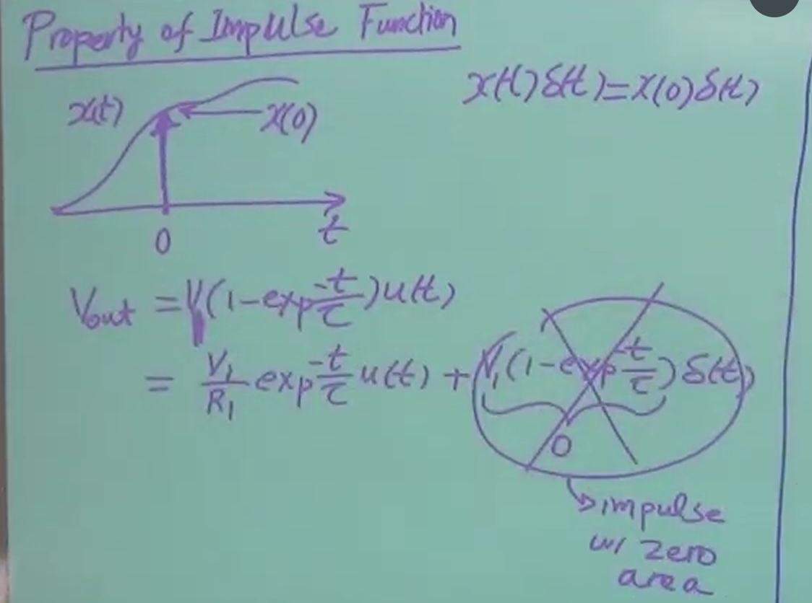
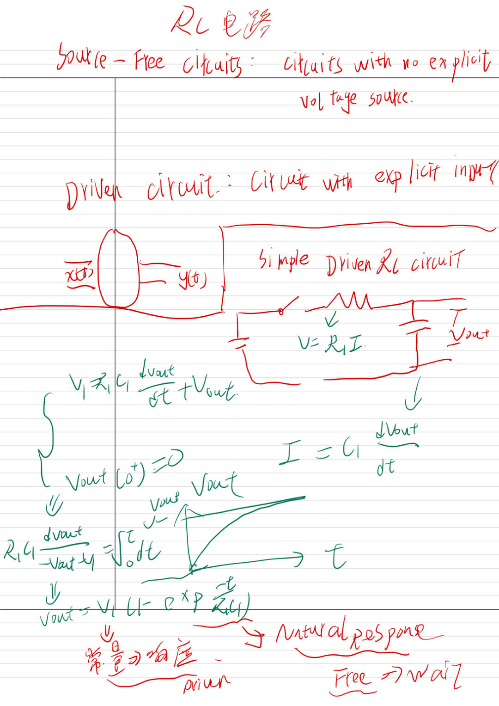
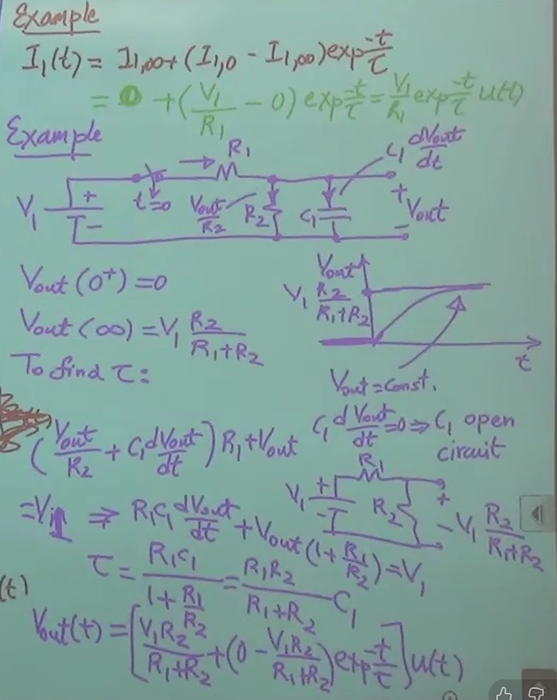
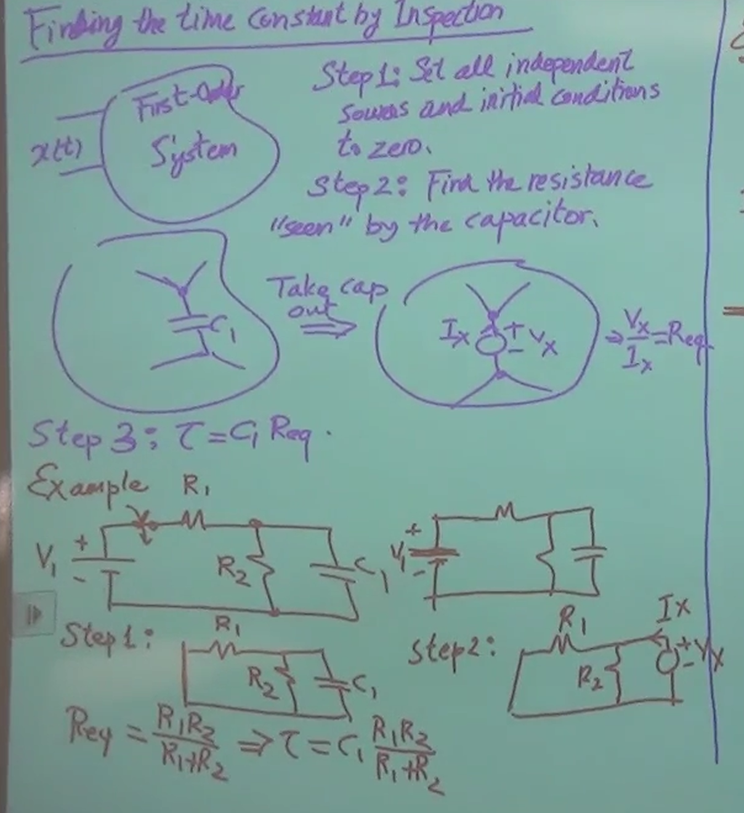

### 怎么说呢？反正有些地方是没看懂，而且现在看这个好容易睡觉啊

分析电路的动态行为，就像分析 RTOS 底层的任务状态机一样，系统的总体演进总是由两部分叠加而成：

- **自然响应 (Natural Response)**：对应 Source-Free 电路。这纯粹是系统硬件架构本身的固有属性。一个带有初始电荷的电容通过电阻放电，其状态必然按 $e^{-t/RC}$ 衰减，时间常数 $\tau = RC$ 只由物理组件决定，与外界输入无关。
    
- **强制响应 (Forced Response)**：对应 Driven 电路。这是外部输入（激励）强加给系统的最终稳态行为（当 $t \to \infty$ 时保留下来的部分）。
    
    在构建复杂的嵌入式系统时，这种思维模型非常通用——无论是分析电源链路的电压建立，还是通过闭环算法控制电机的稳态输出，其实都是在对抗或利用这个“自然响应”的衰减过程，以期精准、快速地达到“强制响应”的预期稳态。

明天我来解决他，一阶系统是啥啊

