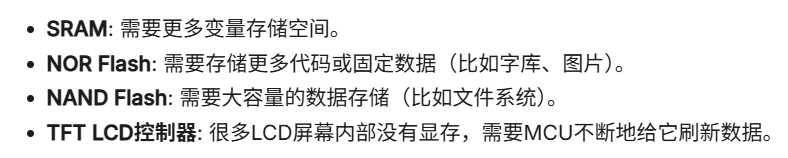
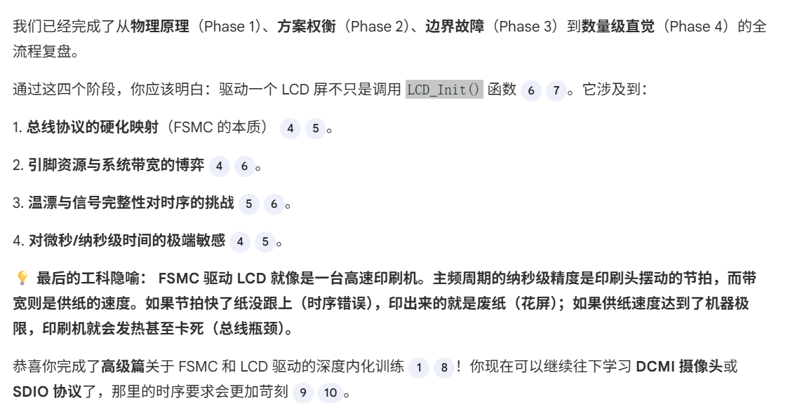

# 📑 FSMC（内存扩展）的实现

本质：硬化的有限状态机（FSM），固化时频来模拟“地址建立-写使能低电平-数据保持-写使能高电平”这一系列物理过程

主要用在这几个方向：sRAM,FLASH,LCD，DRAM（动态的FMC）

1. 用时钟信号去模拟储存器协议，类似于通讯协议，但比普通的通讯协议快很多，并且能随意调用内存，一个多线并行的原因，还有就是内存映射的原因
2. 线数非常多：数据线，地址线，片选线，写使能线，读使能线,其他控制线
3. 内存映射：就是MCU一开始就会分配好内存地址，这也是为什么可以当作第二sRAM的原因
4. 在STM32里面的一些配置：主要是调控时许来符合储存器所需要求，还有就是一些中断啊，使能信号

  
**一些提问**：
1. 用GPIO模拟引脚反转的不好的地方：一个抖动，还有就是CPU 的指令流水线。即使主频很高，CPU 翻转一个 GPIO 需要“读取指令 -> 解码 -> 写寄存器”多个周期
2. 总线冲突 ：用时初始化两个CS，导致数据传输冲突，毁坏MCU
3. 168MHz 的一个时钟周期（HCLK）大约是多少纳秒 (ns): 1/168,000,000≈5.95×10 −9秒，即 5.95 纳秒 (ns)
4. DataSetupTime 压得太死（比如只留了 1 个 HCLK 周期）：在高温下数据还没稳定（Settle）到逻辑高电平，LCD 就开始采样了。反映在屏幕上就是**“随机噪点（雪花）”、“颜色位移”或“初始化失败导致白屏”
