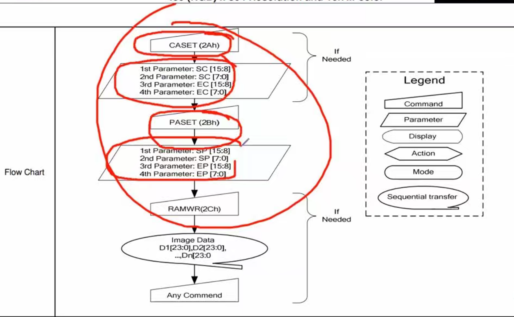

1. 无论是LED,LCD,OLED都要这三个基本参数：分辨率，尺寸大小，色彩深度。显存大小 (Frame Buffer Size) = 水平分辨率 × 垂直分辨率 × (色彩深度 / 8)。这也说明了显示一张图片的巨大信息量，这时一般都有一个显存（一般在显卡里面），在单片机里面一般的液晶显示器都会配备一个液晶控制器。
2. 在一个LCD里面存在着液晶控制器，触摸控制器
3. 液晶控制器： 主要是引脚配置，命令表，通讯方式，时序图的看懂吧 
4. 一些基本流程(ILI9806G芯片)
5. 刷新率的计算要会

来源于Genimi

---
（LCD）的核心技术。
为了让你在未来的开发中具备从底层向上层抽象的能力，我将今天所有的知识点按照底层物理、逻辑映射、库函数配置、系统权衡四个维度为你总结如下：
一、 底层物理：FSMC 模拟 8080 时序的本质
驱动 LCD 的核心在于 STM32 的 FSMC（灵活静态存储控制器） 外设。
1. 协议转换：LCD 通常采用 8080 并行接口，包含 16 位数据线、片选（CS）、读使能（RD）、写使能（WR）和命令/数据选择（RS）。
2. 硬化状态机：FSMC 本质上是一个硬件有限状态机。它将复杂的引脚翻转过程（如先拉低写使能、放数据、再拉高写使能）固化在电路中。
3. 效率对比：相比于软件模拟（Bit-Banging），FSMC 的硬件自动化能极大地提升传输速度，并消除因指令周期带来的时钟抖动。
二、 逻辑映射：“地址即控制”的神来之笔
这是你今天理解最深刻，也最需要掌握的工程技巧：
4. RS 引脚的映射：野火将 LCD 的 RS（命令/数据选择） 引脚连接到了 FSMC 的 A16 地址线上。
5. 地址偏移逻辑：
    ◦ 由于 F407 在 16 位模式下存在内部地址右移一位的物理特性，为了让外部 A16 产生电平变化，程序内部需要操作第 17 位。
    ◦ 命令地址：0x6C000000（A16 为低电平，LCD 视为命令）。
    ◦ 数据地址：0x6C000000 + (1 << 17) = 0x6C020000（A16 为高电平，LCD 视为数据）。
6. 软件抽象：通过定义两个结构体指针，你可以像读写内存 SRAM 一样操作 LCD，彻底告别了频繁操作 GPIO 的繁琐。
三、 标准库配置：微秒级的时序调优
在调用标准库初始化 FSMC 时，核心在于两个结构体：
7. FSMC_NORSRAMTimingInitTypeDef（时序参数）：
    ◦ AddressSetupTime（地址建立时间）：确保地址信号稳定。
    ◦ DataSetupTime（数据建立时间）：确保 LCD 采样时数据已在总线上稳定。
    ◦ 单位：这些参数均以 HCLK 周期为单位（F407 主频 168MHz 时，1 个周期约为 6ns）。
8. FSMC_NORSRAMInitTypeDef（模式配置）：
    ◦ 将内存类型设为 FSMC_MemoryType_SRAM。
    ◦ 选择对应的 Bank（野火使用 Bank1 Subbank4）。
四、 系统权衡与代价（工程师的进阶思维）
我们基于“没有免费的午餐”公理，分析了高性能显示背后的代价：
9. 显示瓶颈：对于 800x480 的 16 位色屏幕，维持 60Hz 刷新率需要约 44MB/s 的带宽，这已接近 FSMC 在模拟 8080 时序下的物理极限。
10. 总线竞争：
    ◦ 使用 DMA 可以释放 CPU 算力。
    ◦ 代价：DMA 持续占据 FSMC 总线会产生“总线竞争”，导致 CPU 访问挂在同一总线上的外部 SRAM 时被迫挂起，增加系统的实时抖动。
11. 边界故障：
    ◦ 信号完整性：时序压得太死会导致在极端温度下出现花屏（采样违例）。
    ◦ 状态 mismatch：LCD RESET 信号受干扰会导致其内部配置丢失，此时仅重启 FSMC 无效，必须重新执行完整的 LCD 初始化序列。
---

5. 与LCD的交互通讯协议： SPI,8080并行(野火就是用FMSC模拟了这个时序，因为他和Nor Flash类似，地址线转换成，命令和数据辨别线DX)，6800并行. 

6. RS与地址总线的转化： 这种“地址即控制”的转化是由硬件电路瞬间完成的，不存在软件开销