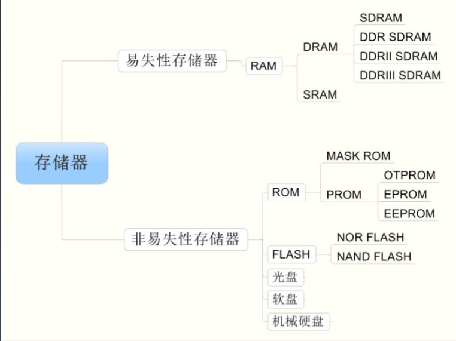

数据流动的方向：
CPU 
↔
↔
 缓存 
↔
↔
 内存 
↔
↔
 硬盘
(数据必须一级一级上下传，通常不能越级)
## 缓存，内存，硬盘的区别
1. 缓存是SRAM集成于CPU内部，速度非常快，使用的是锁存器，断电无效
2. 内存是DRAM就是俗称的内存条，速度较快用的是电容判断，断电无效，详细看[How does Computer Memory Work?](https://www.youtube.com/watch?v=7J7X7aZvMXQ)
3. 硬盘是现在基本上是SSD,由PCB,控制芯片，FLASH，可能还有DRAM，断电有效，详细看[How do SSDs Work?](https://www.youtube.com/watch?v=5Mh3o886qpg)
## 用户视角的内存

[[用户内存空间分配]]

## 多核下的的并发处理

[[多核并发的处理]]

