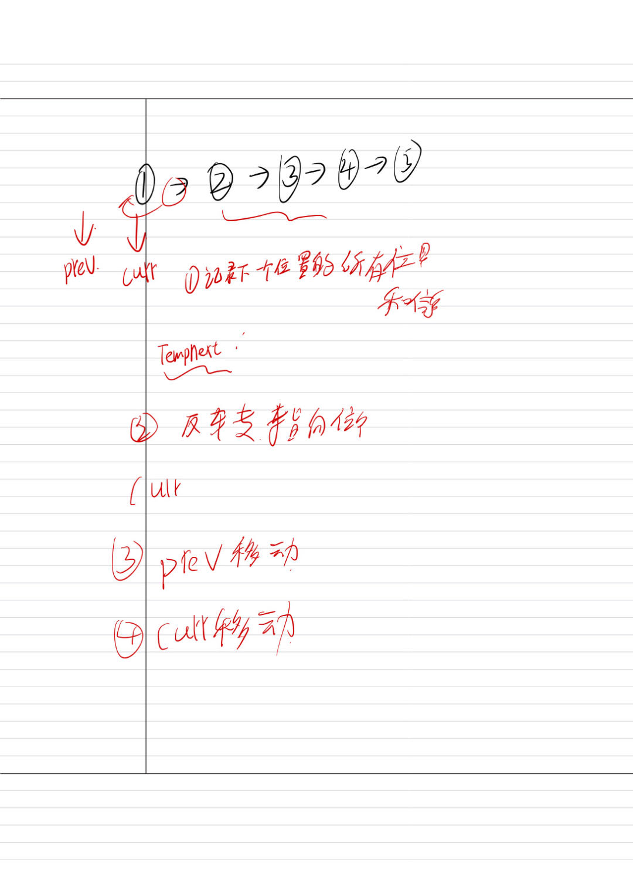

- **考察方向：** 多个指针的交替滑动与解引用。
    
- **嵌入式场景：** 假设你的单片机接收到了一串按时间顺序排列的传感器数据包（以链表形式存储），现在你需要按照“后进先出（LIFO）”的顺序将其发往云端，这就需要你原地将整条链表的指向反转。
    
- **挑战点：** 空间复杂度 $O(1)$，绝对不能去 `malloc` 新节点。你需要用三个指针（`prev`, `curr`, `next`）在不弄断链表的前提下，把指针箭头调个头。
- **问题**： 你确实把箭头指回去了，但是原来 `curr` 后面的那个节点（以及整条链表剩下的部分）的地址，你永远丢失了！这就叫“烧毁了过河的桥”，在单片机里直接导致严重的内存泄漏（Memory Leak）


- **想法**：确认链表位置，卧槽我死都想不通，链表的变化，但我后面的确清楚了，数值是不重要的，重要的是指针指向的地址。

- **思考**：这里链表用来进行快慢指针是真正的指针，数组是用的数字、


### 1. 数组：为什么用“数字（下标）”就够了？

数组在内存中是一块**绝对连续**的存储空间。 假设你有一个 `int` 数组，首地址在 `0x1000`。因为每个 `int` 占 4 个字节，CPU 闭着眼睛都能算出后续每一个元素的地址：

- 第 0 个元素地址：`0x1000 + (0 * 4) = 0x1000`
    
- 第 1 个元素地址：`0x1000 + (1 * 4) = 0x1004`
    
- 第 `i` 个元素地址：`首地址 + (i * 元素大小)`
    

**结论：** 对于数组，CPU 只需要知道**首地址**和**数字下标（索引）**，就能通过简单的数学乘法和加法，瞬间算出目标内存的物理地址。所以，数组的“快慢指针”只需要用普通的整数（`int i, j`）来充当偏移量即可。

### 2. 链表：为什么必须用“真正的物理指针”？

链表的节点是按需分配的（在堆区散乱分布，或在内存池中随机挑空位）。 节点 A 可能在 `0x1000`，节点 B 可能突然跑到了 `0x5088`，节点 C 又回到了 `0x2044`。它们在物理内存中**毫无规律，毫不挨着**。

如果你在一个链表里，身处节点 A，你问 CPU：“下一个节点在哪？” CPU 是算不出来的！无论用什么加减乘除都算不出来，因为它根本不知道下一个节点被分配到了哪个随机角落。

**结论：** 因为算不出来，所以必须**“硬记”**。节点 A 的肚子里，必须真真实实地存放着节点 B 的物理内存地址（比如存放着数值 `0x5088`）。这种专门用来存放物理内存地址的变量，就是 C 语言中真正的指针（`struct ListNode *`）。你在链表中移动游标（`curr = curr->next`），本质上是在读取上一个节点留下的“寻宝线索”，顺藤摸瓜跳到下一个内存块


- 你说我不知道这个知识点吗？那还是真知道，结果一做题就不会


```c
/**
 * Definition for singly-linked list.
 * struct ListNode {
 * int val;
 * struct ListNode *next;
 * };
 */

struct ListNode* reverseList(struct ListNode* head) {
    // 1. 初始化两个游标指针
    // prev 代表“前一个节点”，一开始由于我们在头节点，头节点反转后会变成尾节点，所以它应该指向 NULL
    struct ListNode* prev = NULL; 
    
    // curr 代表“当前正在处理的节点”，我们从传进来的头节点开始处理
    struct ListNode* curr = head; 
    
    // 2. 开启循环：只要当前节点不是空的，就一直往后处理
    while (curr != NULL) {
        // --- 下面这 4 句是整个链表反转的灵魂 ---
        
        // 动作 1：派侦察兵记住“下一个节点”的地址
        // （如果不做这一步，下一句修改指针后，后面的链表就彻底断开丢失了！）
        struct ListNode* nextTemp = curr->next; 
        
        // 动作 2：真正的反转！把当前节点原本向后的箭头，断开并指向前面（prev）
        curr->next = prev; 
        
        // 动作 3：prev 游标向前滑动一步，来到当前节点的位置
        prev = curr; 
        
        // 动作 4：curr 游标向前滑动一步，来到侦察兵记住的下一个节点的位置
        curr = nextTemp; 
    }
    
    // 3. 循环结束的条件是 curr == NULL。
    // 此时 curr 掉出了链表的末端，而 prev 恰好停在了原链表的最后一个节点上。
    // 原来的尾节点，就是反转后新链表的头节点！所以返回 prev。
    return prev; 
}
```


**反思**：本质上对指针理解的还是不到位