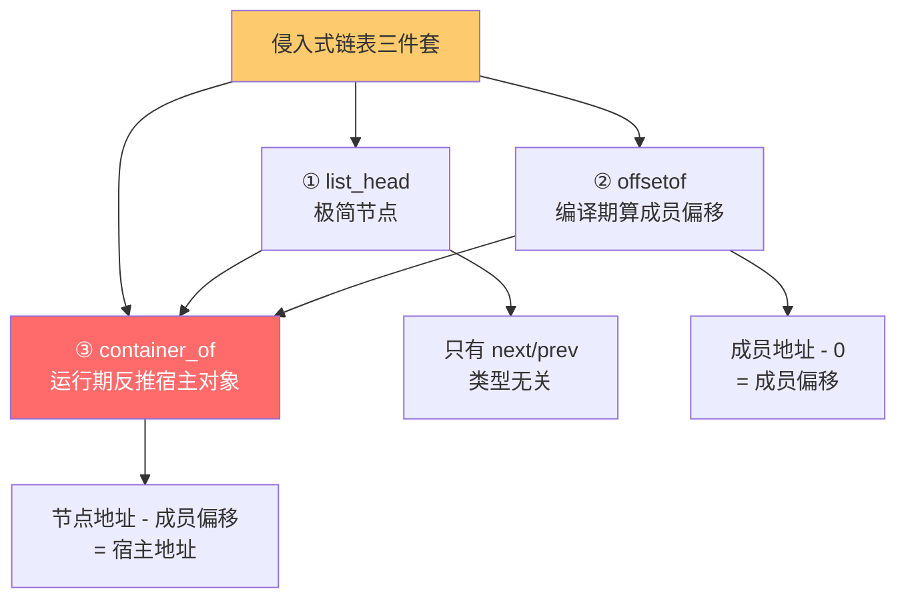
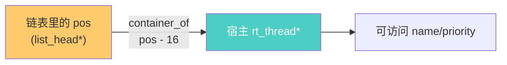
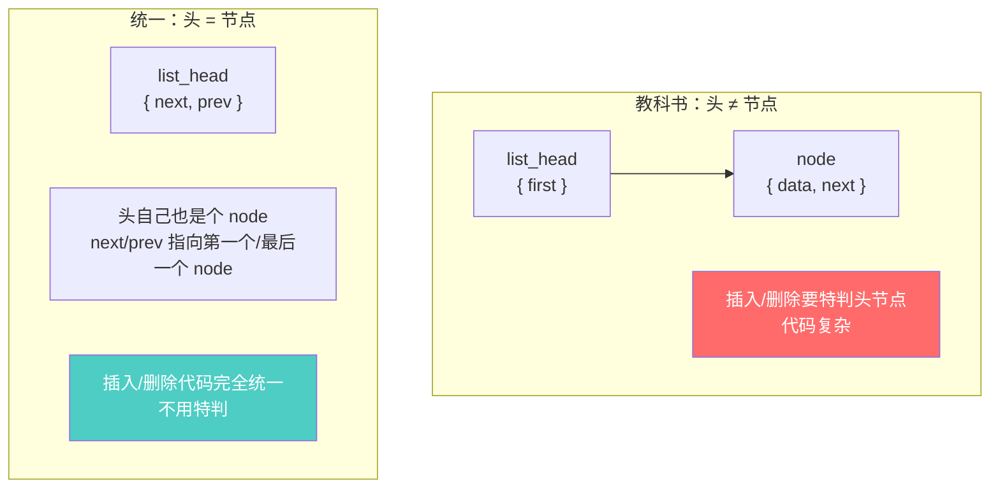
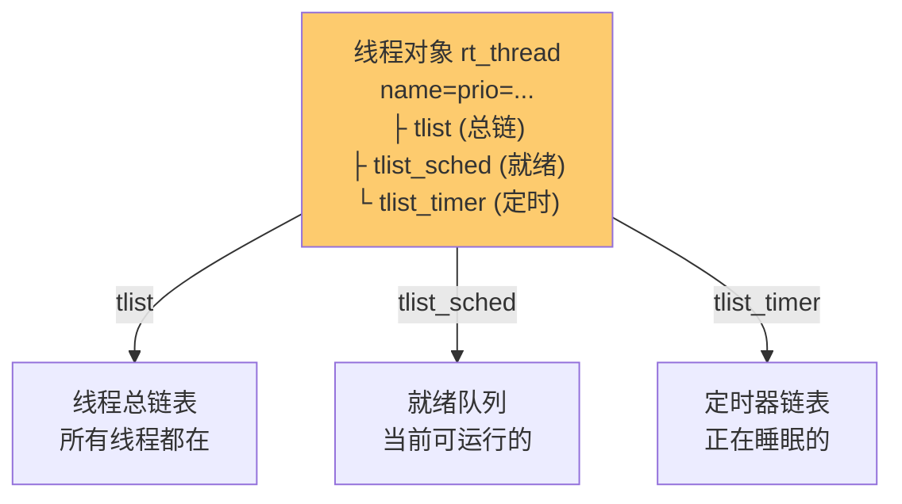
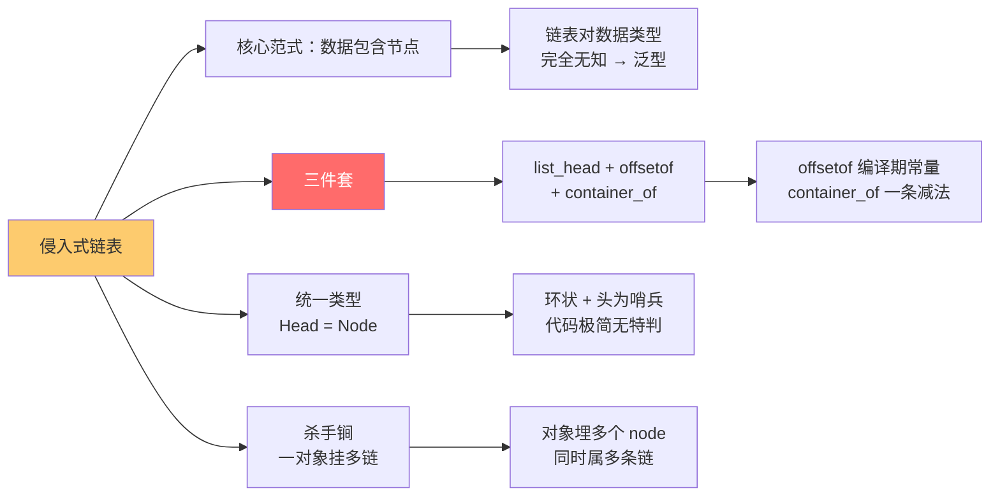

# 侵入式链表设计

> [!abstract] 核心本质
> 教科书链表是"节点包含数据"，侵入式链表反过来——**数据包含节点**：把一个极简的链表节点（只有前驱/后继两个指针）预埋进对象内部，链表本身对数据类型一无所知。这套"节点寄生在对象里 + `offsetof`/`container_of` 反推宿主"的设计，是 Linux 内核、RT-Thread 对象管理、FreeRTOS 队列的底层基石。它解决了 C 语言没有泛型的痛点——**用一份链表代码管理任意类型的对象**。

读 RT-Thread 源码时，会看到一个反直觉的现象：**不管整个链表的"头"，还是每个对象里的"节点"，用的全都是同一个数据类型 `rt_list_t`**。这不是偷懒，而是侵入式链表最精妙的一笔——靠它实现了"节点即头、头即节点"的环状统一。

本篇抽离出**通用的侵入式链表原理**（offsetof / container_of 的推导、Head=Node 的障眼法、一对象挂多链表），RT-Thread/Linux 的具体实战可在源码阅读笔记里对照。

---

## 1. 传统链表 vs 侵入式链表：一场数据结构的认知革命

### 1.1 教科书写法：节点包含数据

```c
/* 教科书链表：节点里塞数据 */
struct node {
    int data;            /* 数据 */
    struct node *next;   /* 后继 */
};

struct node list[3] = { {1, &list[1]}, {2, &list[2]}, {3, NULL} };
```

```text
教科书链表的内存形态：

  节点 list[0]          节点 list[1]          节点 list[2]
  ┌──────────┐          ┌──────────┐          ┌──────────┐
  │ data: 1  │          │ data: 2  │          │ data: 3  │
  │ next ────┼─────────▶│ next ────┼─────────▶│ next:NULL│
  └──────────┘          └──────────┘          └──────────┘

问题来了：想存字符串？想存结构体？想存线程对象？
  → 必须为每种类型重写一遍 node 结构
  → C 没有泛型，几十种数据类型 = 几十套链表代码
```

### 1.2 致命痛点：类型污染

```c
/* 想管理线程，得写一套 */
struct thread_node {
    struct rt_thread *data;
    struct thread_node *next;
};

/* 想管理定时器，又得写一套 */
struct timer_node {
    struct rt_timer *data;
    struct timer_node *next;
};

/* 想管理信号量... */
struct sem_node { ... };

/* 灾难：内核里有几十种对象，要写几十套链表 */
/* 而且这套链表的代码逻辑（插入/删除/遍历）完全一样！*/
```

### 1.3 侵入式链表：数据包含节点

```c
/* 侵入式链表：节点极简，只有两个指针 */
struct list_head {
    struct list_head *next, *prev;
};

/* 数据对象里"预埋"一个节点 */
struct rt_thread {
    char name[8];
    int  priority;
    struct list_head node;   /* ★ 节点寄生在对象里 */
};
```

```text
侵入式链表的内存形态：

  rt_thread 对象         rt_thread 对象         rt_thread 对象
  ┌────────────┐         ┌────────────┐         ┌────────────┐
  │ name       │         │ name       │         │ name       │
  │ priority   │         │ priority   │         │ priority   │
  │ ┌────────┐ │         │ ┌────────┐ │         │ ┌────────┐ │
  │ │ node   │ │◀───────▶│ │ node   │ │◀───────▶│ │ node   │ │
  │ │next/prev│ │         │ │next/prev│ │         │ │next/prev│ │
  │ └────────┘ │         │ └────────┘ │         │ └────────┘ │
  └────────────┘         └────────────┘         └────────────┘

链表只看到 node，看不到 rt_thread —— 类型无关
一份 list_head 代码，管所有对象！
```

### 1.4 两种范式的根本对照

| 维度 | 传统链表 | 侵入式链表 |
|------|---------|-----------|
| **谁包含谁** | 节点包含数据 | **数据包含节点** |
| **节点结构** | 每种数据一套 | 统一 `list_head`，永远一套 |
| **链表代码** | 每种类型重写 | **一份代码管所有类型** |
| **数据访问** | `node->data` 直接取 | 要用 `container_of` 反推宿主 |
| **类型耦合** | 链表与数据强耦合 | **链表对数据类型完全无知** |
| **内存布局** | 数据和节点一体 | 数据和节点在对象里共存 |
| **能否挂多链表** | 不能（数据被链表独占） | **能**（对象可埋多个 node） |
| **谁在用** | 教科书、简单业务 | **Linux 内核、RT-Thread、FreeRTOS 队列** |

```mermaid
flowchart LR
    subgraph 传统["传统：节点 ← 数据"]
        A1["node"] --> A2["data: int"]
        A1 --> A3["next"]
        A4["想换类型 → 重写 node"] -.-> A1
    end
    subgraph 侵入["侵入式：数据 ← 节点"]
        B1["object"] --> B2["业务字段"]
        B1 --> B3["list_head node<br/>寄生"]
        B4["换类型 → node 不变"] -.-> B3
    end
    style A1 fill:#fdcb6e,color:#333
    style B3 fill:#4ecdc4,color:#fff
```



> [!important] 一句话抓住本质
> **侵入式链表把"链表"和"数据"解耦了。** 链表只认 `list_head`，不认任何业务类型——所以一份链表代码能管理任意对象。代价是：从节点拿回数据对象，需要 `container_of` 这种"反推"魔法。

---

## 2. 核心三件套

侵入式链表的全部精妙，落在三件套上：极简的 `list_head` + 编译期算偏移的 `offsetof` + 运行期反推宿主的 `container_of`。



### 2.1 第一件：`list_head` 极简节点

```c
/* Linux / RT-Thread 通用的节点定义 */
struct list_head {
    struct list_head *next;
    struct list_head *prev;
};

/* RT-Thread 的等价封装 */
typedef struct rt_list_node {
    struct rt_list_node *next;
    struct rt_list_node *prev;
} rt_list_t;
```

注意两点：① **只有两个指针，没有任何数据**；② `next/prev` 指向的也是 `list_head`，**不是宿主对象**——这就是类型无关的根源。

### 2.2 第二件：`offsetof` 编译期偏移

```c
/* 标准库提供，但原理要看懂 */
#define offsetof(TYPE, MEMBER) ((size_t) &((TYPE *)0)->MEMBER)
```

作用：算出"成员 MEMBER 在 TYPE 结构体里的字节偏移量"。它能在**编译期**就计算出结果（编译器常量），运行期零开销。详细推导见第 3 节。

### 2.3 第三件：`container_of` 反推宿主

```c
/* Linux 内核经典宏 */
#define container_of(ptr, type, member) \
    ((type *)((char *)ptr - offsetof(type, member)))
```

作用：已知"成员的地址 `ptr`"和"成员在宿主里的偏移"，反推出**宿主对象的地址**。这是侵入式链表从节点拿回业务对象的核心魔法。详细推导见第 4 节。

### 2.4 三件套如何协同

```mermaid
sequenceDiagram
    participant App as 应用代码
    participant List as list_head 链表
    participant Node as 对象里的 node
    participant Off as offsetof
    participant CO as container_of
    participant Obj as 宿主对象

    Note over App: 想遍历所有 rt_thread
    App->>List: list_for_each(pos, head)
    List->>Node: 给出一个 node 指针
    Note over App: 我拿到的是 node，<br/>但我想要 rt_thread！
    App->>CO: container_of(node, rt_thread, node)
    CO->>Off: offsetof(rt_thread, node) = ?
    Off-->>CO: 编译期常量，比如 24
    CO->>Obj: node_addr - 24 = 宿主地址
    Obj-->>App: rt_thread* 拿到了
    Note over App: 可以访问 name/priority 了
```

> [!note] 内联让这套魔法零开销
> `offsetof` 是编译期常量，`container_of` 通常被写成 [[内联函数]] 或宏。内联后，整个"node 减偏移"会塌缩成**一条减法指令**——运行期开销几乎为零。这就是为什么侵入式链表能在内核里被无节制地高频使用。

---

## 3. `offsetof`：编译期算偏移的零指针技巧

`container_of` 的灵魂在 `offsetof`。这一行宏看似古怪，拆开后是 C 语言最优雅的编译期计算之一。

### 3.1 宏定义

```c
#define offsetof(TYPE, MEMBER) ((size_t) &((TYPE *)0)->MEMBER)
```

### 3.2 逐字拆解

把这一行从内到外剥洋葱：

```text
offsetof(rt_thread, node)
  = ((size_t) &((rt_thread *)0)->node)

从内往外读：
  ① (rt_thread *)0
     把整数 0 强制转换成 "rt_thread*"
     含义：假设有一个 rt_thread 对象，它的起始地址是 0（NULL）

  ② ((rt_thread *)0)->node
     访问这个"假想对象"的 node 成员
     含义：node 成员的"地址"是多少？

  ③ &((rt_thread *)0)->node
     取 node 成员的地址
     含义：node 的绝对地址 = 起始地址(0) + node 的偏移 = 偏移本身

  ④ (size_t)(...)
     转成无符号整数
     含义：得到一个纯数字的偏移量
```

### 3.3 内存图直观理解

```text
假设 rt_thread 布局：

地址（假想从 0 开始）
  0   ┌────────────┐
      │ name[8]    │  8 字节
  8   ├────────────┤
      │ priority   │  4 字节
  12  ├────────────┤
      │ padding    │  4 字节（对齐填充）
  16  ├────────────┤      ← offsetof(rt_thread, node) = 16
      │ node.next  │      （假设 node 在偏移 16 处）
  20  │            │
      │ node.prev  │
  24  ├────────────┤
      │ ...        │
      └────────────┘

&((rt_thread*)0)->node
  = 假想对象地址(0) + node 偏移(16)
  = 16
  = offsetof(rt_thread, node)  ✓
```

> [!tip] 为什么不会真的访问 0 地址崩溃？
> 因为 `&` 和 `->` 的组合，编译器**只计算地址，不解引用**。`(rt_thread*)0` 是一个编译期的"虚拟对象"，编译器算出 `node` 相对它起始地址的偏移就完事，**不产生任何访问 0 地址的代码**。这是 C 的"未求值表达式"特性，`sizeof` 也是同款原理。

### 3.4 关键特性：编译期常量

```c
struct rt_thread {
    char name[8];
    int  priority;
    struct list_head node;
};

size_t off = offsetof(rt_thread, node);   /* 编译期就确定，比如 16 */
```

```text
反汇编（ARM）：
    MOV    R0, #16          ; ← 偏移在编译期算好，直接塞成立即数
    ; 没有任何运行期计算！
```

> [!important] 编译期常量 = 零开销
> `offsetof` 的结果是编译期常量，编译后就是一条 `MOV #立即数`。这就是侵入式链表"反推宿主"能零开销的根基——偏移在编译期就算完了，运行期只剩一次减法。

---

## 4. `container_of`：从节点地址反推宿主

有了 offsetof，container_of 就是顺理成章的一次减法。

### 4.1 宏定义

```c
#define container_of(ptr, type, member) \
    ((type *)((char *)(ptr) - offsetof(type, member)))
```

### 4.2 数学推导

```text
已知：
  - 宿主对象的起始地址 = obj_addr
  - 成员 member 在宿主里的偏移 = off
  - 成员的地址 = ptr = obj_addr + off

求：obj_addr

解：
  obj_addr = ptr - off
         = ptr - offsetof(type, member)
```

```text
内存布局（与 offsetof 那节对应）：

宿主对象起始 obj_addr
  │
  ▼   ┌────────────┐
      │ name[8]    │
      ├────────────┤
      │ priority   │      ← offsetof(rt_thread, node) = 16
      ├────────────┤
      │ padding    │
  ┌── ├────────────┤  ◀── ptr（node 的地址）
  │   │ node.next  │      ptr = obj_addr + 16
  │   │ node.prev  │
  │   ├────────────┤
  │   │ ...        │
  │   └────────────┘
  │
  └── 反推：obj_addr = ptr - 16
           = container_of(ptr, rt_thread, node)
```

### 4.3 为什么要用 `(char *)` 做减法

```c
/* 宏里这一步的精妙 */
(char *)(ptr) - offsetof(...)
```

指针减法要按**指针指向的类型大小**缩放：`uint32_t*` 减 1 实际减 4 字节，`struct big*` 减 1 可能减 100 字节。

而 `char` 大小恒为 1 字节——`(char *)ptr` 减去 `offsetof` 字节数，就是**纯粹的按字节算术**，不会被指针类型缩放干扰。最后再 `(type *)` 强转回宿主类型。

> [!warning] 别忘了 `(char *)` 强转
> ```c
> /* ❌ 错误写法（看似等价，实则致命） */
> #define container_of_bad(ptr, type, member) \
>     ((type *)(ptr - offsetof(type, member)))
> /* ptr 是 list_head*，减 16 实际减 16×sizeof(list_head) 字节 */
> /* 结果完全错误，指针飞到野地址 */
>
> /* ✅ 正确：(char *) 把指针变成"按字节算" */
> #define container_of(ptr, type, member) \
>     ((type *)((char *)(ptr) - offsetof(type, member)))
> ```

### 4.4 一次完整调用

```c
struct rt_thread {
    char name[8];
    int  priority;
    struct list_head node;   /* 在偏移 16 处 */
};

void traverse(struct list_head *head) {
    struct list_head *pos;
    list_for_each(pos, head) {
        /* pos 是某个 rt_thread 内部 node 的地址 */
        struct rt_thread *t;
        t = container_of(pos, rt_thread, node);
        /* t = pos - 16 = 宿主对象起始地址 */
        printf("thread: %s, prio: %d\n", t->name, t->priority);
    }
}
```



> [!note] container_of 的本质
> 它是一个**纯算术运算**：节点地址减去编译期常量偏移，得到宿主地址。没有任何运行期类型识别、没有 RTTI、没有虚函数——一切在编译期就定好。这就是 C 语言在"没有泛型"的限制下，靠宏 + 编译期常量实现的**零开销泛型反推**。

---

## 5. Head 即 Node：`rt_list_t` 统一的障眼法

读 RT-Thread/Linux 源码时最反直觉的设计：**链表头和节点用的是同一个类型**。这不是偷懒，而是侵入式链表的精髓。

### 5.1 反直觉的现象

```c
/* 教科书写法：头和节点是两种类型 */
struct list_head_node {                       /* 头 */
    struct node *first;
};
struct node {                                 /* 节点 */
    int data;
    struct node *next;
};

/* RT-Thread/Linux：头和节点是同一种类型 */
struct rt_list_node {                         /* 头也是它，节点也是它 */
    struct rt_list_node *next;
    struct rt_list_node *prev;
};
typedef struct rt_list_node rt_list_t;

rt_list_t ready_list;     /* 就绪链表的"头" */
/* 线程对象里的 node 也是 rt_list_t —— 同一个类型！ */
```

### 5.2 为什么要这样设计



关键好处：**所有插入/删除操作完全统一，不用特判头节点**。头自己就是一个 node（只是它的 next/prev 指向链表的首尾），所以"在头后面插"和"在某节点后面插"用的是**同一段代码**。

### 5.3 环状结构：头尾相连的障眼法

```text
环状双向链表（RT-Thread/Linux 的经典布局）：

            ┌─────────────────────────────────────┐
            │                                     │
            ▼                                     │
   head ┌───┴────┐    ┌────────┐    ┌────────┐    │
        │ next   │───▶│ node A │───▶│ node B │────┘
        │        │◀───│        │◀───│        │
        │ prev   │    │ next/  │    │ next/  │
        └────────┘    │ prev   │    │ prev   │
                      └────────┘    └────────┘
                          ▲              ▲
                          │              │
                     head.prev 指向 B   head.next 指向 A

head 的 next 指向第一个节点，prev 指向最后一个节点
最后一个节点的 next 指回 head，第一个节点的 prev 指回 head
→ 形成闭环，遍历到 head 即表示"绕了一圈回到起点"
```

### 5.4 初始化：头指向自己

```c
/* RT-Thread 的初始化：头自己指自己 */
rt_inline void rt_list_init(rt_list_t *l) {
    l->next = l->prev = l;   /* 空链表 = 头指向自己 */
}

/* 判空：next 指向自己就是空 */
rt_inline int rt_list_isempty(const rt_list_t *l) {
    return l->next == l;
}
```

```text
空链表：                非空链表（插了 A）：

  head                    head ←→ A ←→ head
  next ─┐                 next ──→ A
  prev ─┘                 prev ←── A
  (指向自己)              A.next → head
                          A.prev → head
```

### 5.5 遍历：以头为哨兵

```c
/* 遍历到回到 head 就结束 —— 不需要 NULL 判断 */
#define rt_list_for_each(pos, head) \
    for (pos = (head)->next; pos != (head); pos = pos->next)
```

> [!tip] 环状 + 统一类型 = 代码极简
> 环状结构带来两个红利：① **遍历不用判 NULL**（用 head 当哨兵，回到 head 即结束）；② **头尾操作统一**（在 head 前插 = 在尾部插，因为 head.prev 就是最后一个节点）。这是 Linux/RT-Thread 把链表代码压到几十行的根本原因。

### 5.6 头 vs 节点的区别在哪

```text
虽然类型相同，但语义不同：

head（链表头）：
  - 通常不嵌在业务对象里，是独立的 rt_list_t 变量
  - 代表"整条链表"的入口
  - 不参与 container_of 反推（它没有宿主）

node（业务节点）：
  - 嵌在 rt_thread/timer 等业务对象里
  - 通过 container_of 反推回宿主
  - 真正承载业务数据
```

> [!warning] 别对 head 调 container_of
> `head` 是独立的 `rt_list_t` 变量，没有宿主对象。对它做 `container_of(head, rt_thread, node)` 会算出一个**野地址**——拿 0 减去偏移再强转。读源码时要分清哪个是 head（入口）、哪个是 pos（业务节点）。

---

## 6. 一对象挂多链表：侵入式的杀手锏

传统链表里，一个对象的数据被节点"独占"——它只能挂在一条链表上。侵入式链表打破了这个限制：**对象里可以埋多个 node，同时挂在不同链表上**。

### 6.1 实战场景：一个线程同时属于多条链

```c
struct rt_thread {
    char name[8];
    int  priority;

    rt_list_t tlist;         /* ★ 挂在"线程总链表"（系统所有线程） */
    rt_list_t tlist_sched;   /* ★ 挂在"就绪队列"（按优先级排） */
    rt_list_t tlist_timer;   /* ★ 挂在"定时器链表"（睡眠唤醒用） */
};
```



同一个线程对象，凭借三个不同名字的 node，同时被三条链表管理。每条链表只看到自己关心的那个 node，互不干扰。

### 6.2 为什么传统链表做不到

```text
传统链表：节点包含数据，数据和节点一体
  ┌─────────┐
  │ data ──→│（指向线程对象）
  │ next    │
  └─────────┘
  问题：data 是个指针，一个线程对象只能被一个节点指向
       → 想挂第二条链，得再 malloc 一个 node 副本指向它
       → 同一个对象在内存里有多份"代理"，状态难同步

侵入式链表：节点寄生在对象里，对象自带多个 node
  ┌──────────────┐
  │ rt_thread    │
  │ ├ tlist      │←─── 链表 1 的节点
  │ ├ tlist_sched│←─── 链表 2 的节点
  │ └ tlist_timer│←─── 链表 3 的节点
  └──────────────┘
  对象本身是单一实体，三条链各自管理各自的 node
```

### 6.3 反推时要指定正确的成员名

```c
/* 从不同链表拿到的 pos，要用不同的 member 反推 */
struct list_head *pos_total, *pos_ready, *pos_timer;

/* 遍历线程总链 */
list_for_each(pos_total, &thread_list_head) {
    struct rt_thread *t = container_of(pos_total, rt_thread, tlist);
    /*                            ↑ 用 tlist 反推 */
}

/* 遍历就绪队列 */
list_for_each(pos_ready, &ready_list_head) {
    struct rt_thread *t = container_of(pos_ready, rt_thread, tlist_sched);
    /*                            ↑ 用 tlist_sched 反推 */
}
```

> [!tip] 成员名是反推的"密码"
> 同一个线程对象，从"总链"拿到 pos 时用 `tlist` 反推，从"就绪队列"拿到 pos 时用 `tlist_sched` 反推。**反推用的成员名，必须和挂入时用的 node 一致**——因为不同 node 在对象里的偏移不同。用错成员名，container_of 会算出错误地址。

### 6.4 经典用法：RT-Thread 的对象管理

```c
/* RT-Thread 里，所有内核对象（线程/信号量/互斥量/事件/邮箱/队列/定时器/内存池/设备）
   都继承自 rt_object，而 rt_object 里就埋了一个 node */

struct rt_object {
    char name[RT_NAME_MAX];
    rt_uint8_t type;
    rt_uint8_t flag;
    rt_list_t list;        /* ★ 所有对象都靠这个 node 挂在"对象容器"链表 */
};

/* 内核用一个 rt_list_t 容器管理所有对象，无论什么类型 */
static rt_list_t rt_object_container[RT_Object_Class_Unknown];

/* 这就是 [[C语言的继承和多态]] 的实战：
   父类 rt_object 提供 list node，所有子类继承它
   内核只管 rt_object 的 list，对具体子类无感 */
```

> [!note] 侵入式链表 + 对象头继承 = 内核对象管理基石
> RT-Thread 用 `rt_object` 作为所有内核对象的父类（提供统一的 name/type/list），所有子类（线程、信号量、设备……）继承它。内核用一个 `rt_list_t` 容器数组管理所有对象——靠的就是"对象里预埋 list node + container_of 反推"。这是 [[C语言的继承和多态]] 与本篇的结合点。

---

## 7. 优缺点与避坑

### 7.1 优点

| 优点 | 说明 |
|------|------|
| **类型无关（泛型）** | 一份链表代码管所有类型，C 里实现"泛型容器" |
| **零数据拷贝** | 对象原地存在，链表只连节点，不复制数据 |
| **一对象挂多链** | 对象埋多个 node，同时属多条链 |
| **操作统一** | 头=节点，插入/删除代码完全统一，无特判 |
| **环状遍历** | 以 head 为哨兵，不用判 NULL |
| **零开销反推** | offsetof 编译期常量，container_of 内联后一条减法 |
| **缓存友好** | 同类型对象连续分布时，遍历命中 Cache |

### 7.2 缺点

| 缺点 | 说明 |
|------|------|
| **类型安全靠手动** | container_of 的 member 用错，编译器不报错，运行崩 |
| **不能存基本类型** | int/float 没法埋 node，必须包成结构体 |
| **删除要小心** | 从链表摘除 node 不等于释放对象，需手动管理生命周期 |
| **调试稍难** | 调用栈看到的是 list_head 操作，业务对象藏在内层 |
| **宏复杂** | container_of/offsetof/list_for_each 全是宏，初学难懂 |

### 7.3 避坑清单

| 陷阱 | 表现 | 对策 |
|------|------|------|
| member 名写错 | container_of 算出野地址 | 反推用的 member 必须和挂入时一致 |
| 对 head 调 container_of | 算出野地址（head 无宿主） | 分清 head（入口）和 pos（业务节点） |
| 忘记初始化 node | next/prev 野指针，链表崩溃 | 对象创建时立即 `rt_list_init(&obj->node)` |
| 摘除后不置空 | node 还残留旧链接，误用导致环 | 摘除后 `node->next = node->prev = node` |
| 跨链表混用 pos | 从 A 链拿 pos 用 B 链的 member 反推 | 每条链用独立变量名，避免混用 |
| 对已释放对象遍历 | use-after-free | 摘除节点和释放对象要原子化 |
| 遍历中删除当前节点 | 迭代器失效 | 用 `list_for_each_safe`（预存 next） |

> [!warning] 遍历中删除当前节点
> ```c
> /* ❌ 错误：删除 pos 后，pos->next 已失效 */
> list_for_each(pos, head) {
>     if (condition) list_del(pos);   /* pos 被摘除，next 指针没了 */
>     /* 下一次 pos = pos->next → 野指针崩溃 */
> }
>
> /* ✅ 正确：用 _safe 版本，提前缓存 next */
> list_for_each_safe(pos, n, head) {
>     if (condition) list_del(pos);   /* n 已存好下一个，不怕 */
> }
> ```

---

## 8. 一页总结



> [!abstract] 三句话记住全文
> **① 范式反转**：传统链表"节点包含数据"，侵入式链表"数据包含节点"——把极简的 `list_head` 预埋进对象，链表对业务类型完全无知，一份代码管所有类型。
>
> **② 反推魔法**：从节点拿回宿主对象，靠 `container_of = 节点地址 - offsetof`。offsetof 是编译期常量（零指针技巧），container_of 内联后塌缩成一条减法——零开销泛型反推。
>
> **③ 统一与多挂**：Head 和 Node 用同一类型（环状结构 + 头为哨兵，代码极简）；对象可埋多个 node，同时挂在不同链表（线程同时属总链/就绪/定时）。这两点是 Linux/RT-Thread 内核对象管理的基石。

### 速查口诀

```text
范式三句话：
  传统：节点装数据 → 一种类型一套链表
  侵入：数据装节点 → 一套链表管所有类型
  反推：container_of 用偏移把节点换算回宿主

三件套：
  list_head   只有 next/prev，类型无关
  offsetof    编译期算偏移（零指针技巧）
  container_of 节点地址减偏移 = 宿主地址

两条铁律：
  ① 反推用的 member 名，必须和挂入时一致
  ② 遍历中删除当前节点，必须用 _safe 版本
```

---

## 继续阅读

- [[显示调用和隐式调用]] —— list_for_each 宏在预处理期展开，是"宏调用"的近亲
- [[C语言的继承和多态]] —— rt_object 父类提供 list node，所有子类继承，是侵入式链表的天然搭档
- [[内联函数]] —— rt_list_init/rt_list_insert 等都标 rt_inline，零开销操作
- [[../函数/函数认知]] —— 函数指针 + 结构体内存布局，理解 container_of 的根基

---

## 9. 面试高频问题

> [!example]- Q1：什么是侵入式链表？和普通链表有什么区别？
> 核心区别是"谁包含谁"：**普通链表是节点包含数据**（`struct node { int data; node* next; }`），每种数据类型要重写一套链表；**侵入式链表是数据包含节点**（对象里预埋一个极简的 `list_head`），链表只认 list_head、对业务类型完全无知，一份代码管所有类型。优点是泛型、零拷贝、一对象挂多链；代价是要用 container_of 反推宿主、类型安全靠手动。

> [!example]- Q2：解释 offsetof 宏的原理，为什么不会崩溃？
> `#define offsetof(TYPE, MEMBER) ((size_t)&((TYPE *)0)->MEMBER)`。原理：把 0 强转成 `TYPE*`（假想一个起始地址为 0 的对象），访问它的 MEMBER 成员并取地址——由于起始地址是 0，成员地址就等于它在结构体里的偏移量。不崩溃的原因是：`&((TYPE*)0)->MEMBER` 是**未求值表达式**，编译器只计算地址、不解引用 0 地址，不产生任何访问 0 的代码（和 `sizeof` 同理）。结果在编译期就确定，运行期零开销。

> [!example]- Q3：container_of 是怎么工作的？为什么要用 `(char *)` 强转？
> `container_of(ptr, type, member) = (type *)((char *)ptr - offsetof(type, member))`。原理是纯算术：已知成员地址 ptr = 宿主地址 + 偏移，所以宿主地址 = ptr - 偏移。用 `(char *)` 强转是因为**指针减法按指向类型大小缩放**——`list_head*` 减 16 会减 `16*sizeof(list_head)` 字节（错误），而 `char*` 减 16 就是减 16 字节（正确）。最后 `(type *)` 转回宿主类型。

> [!example]- Q4：为什么 RT-Thread/Linux 的链表头和节点用同一个类型？
> 为了**操作统一**。教科书链表头和节点是两种类型，头节点要特判处理，代码复杂。统一成 `list_head` 后，头自己也是一个 node（next 指向首节点、prev 指向尾节点），"在头后插"和"在某节点后插"用同一段代码。配合环状结构（尾节点的 next 指回 head），遍历以 head 为哨兵、不用判 NULL，代码极简。代价是 head 没有宿主，不能对它调 container_of。

> [!example]- Q5：一个对象如何同时挂在多条链表上？传统链表为什么做不到？
> 侵入式链表的对象里可以**预埋多个 node**（不同名字），每个 node 挂在不同链表上。比如 rt_thread 里有 tlist（总链）、tlist_sched（就绪）、tlist_timer（定时），三条链各自管理各自的 node，互不干扰。反推时用对应的 member 名（从总链拿到的 pos 用 tlist 反推，从就绪队列拿到的用 tlist_sched 反推）。传统链表做不到，因为数据被节点"独占"——一个对象只能被一个节点的 data 指向，想挂第二条链就得 malloc 副本，状态难同步。

> [!example]- Q6：遍历链表时删除当前节点会有什么问题？怎么解决？
> 普通遍历（`for pos = head->next; pos != head; pos = pos->next`）删除 pos 后，`pos->next` 已被破坏，下一次迭代取 `pos->next` 会拿到野指针崩溃。解决：用 `_safe` 版本，提前缓存 next——`list_for_each_safe(pos, n, head)` 在每轮把 `pos->next` 存到 n，删除 pos 后从 n 继续，迭代器不会失效。

> [!example]- Q7：container_of 的 member 名写错了会怎样？编译器会报错吗？
> **编译器不会报错**，但运行期会算出野地址导致崩溃或数据错乱。因为 container_of 是纯宏算术（指针减偏移），编译器不检查 member 是否真的在 type 里——只要你写了一个合法的成员访问表达式，它就照算。如果 member 名和实际挂入的 node 不一致，offsetof 算出的偏移就是错的，减出来的"宿主地址"会落到内存的任意位置。所以**反推用的 member 必须严格和挂入时一致**，这是侵入式链表类型安全靠手动的体现。
