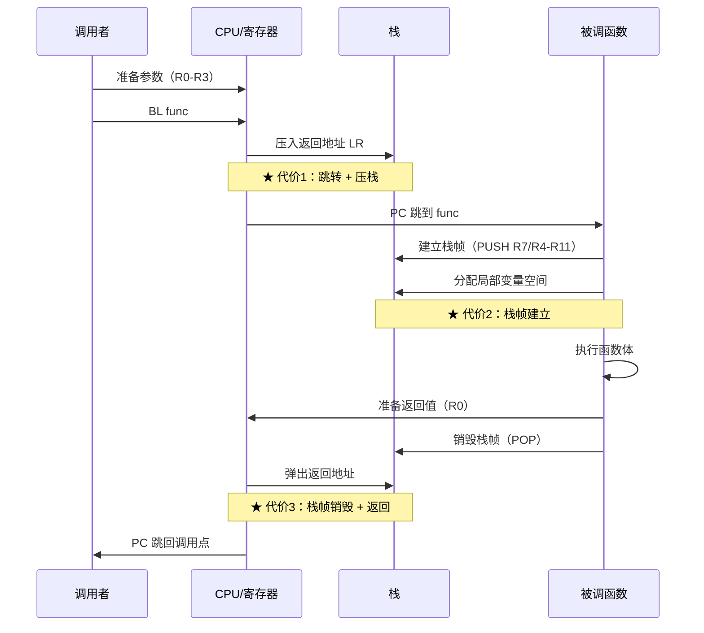
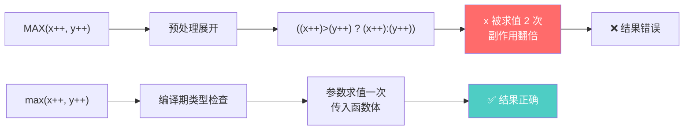
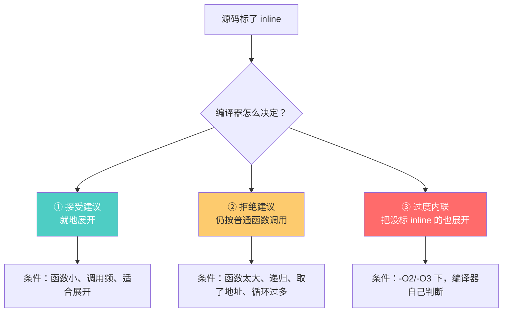
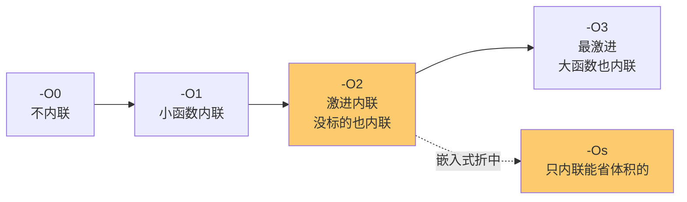
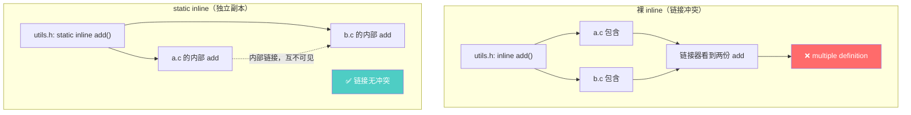
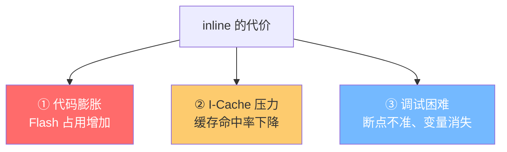
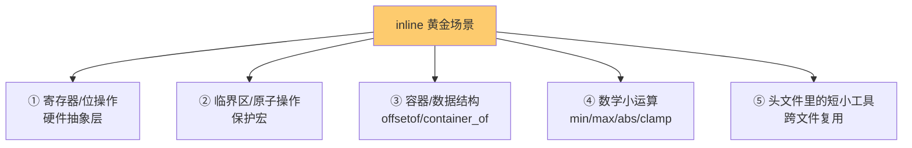
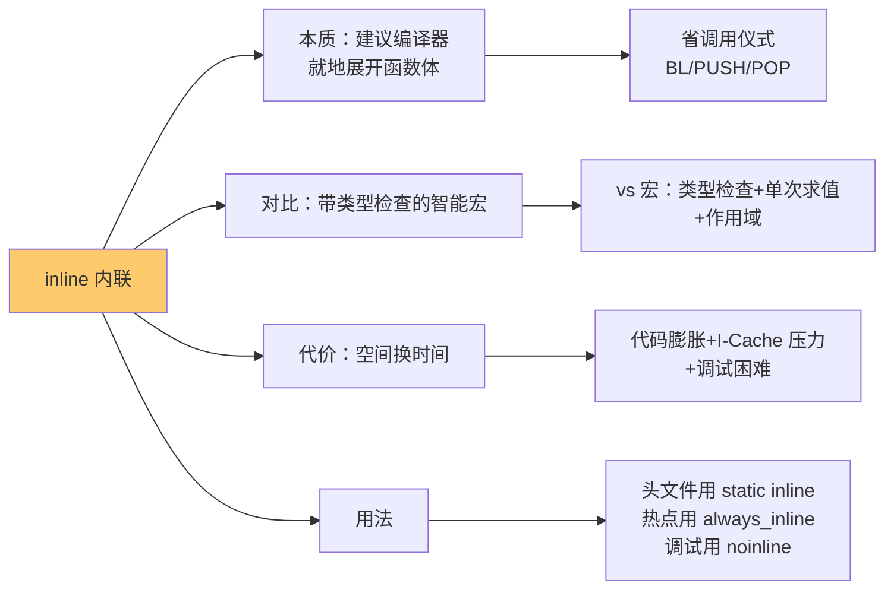

# 内联函数

> [!abstract] 核心本质
> 内联（inline）是**给编译器的一个建议**（不是命令）：把函数体在调用处**就地展开**，省去函数调用的压栈/跳转/返回开销。本质是**空间换时间**——用代码体积膨胀换取执行速度。它和宏是近亲（都在调用处展开），但内联保留了类型检查与作用域，是"带类型安全的智能宏"。

嵌入式工程里，`static inline` 是头文件里最常见的修饰组合，`rt_inline`、`__STATIC_INLINE`（CMSIS）、`ALWAYS_INLINE` 是各框架的等价封装。理解 inline，关键是抓住一句话：**inline 是建议，不是命令；展开与否，最终由编译器的优化器说了算**。它属于 [[显示调用和隐式调用]] 中"宏调用"的近亲——调用点可见，被调体在编译期融入调用处。

---

## 1. 函数调用有代价：inline 要消除什么

要理解 inline 为什么能提速，先得看清一次普通函数调用到底花了什么。

### 1.1 一次函数调用的全流程



### 1.2 调用代价的物理形态（ARM Thumb）

```text
普通调用 add(1, 2)，编译后：

    MOV    R0, #1          ; 参数 a
    MOV    R1, #2          ; 参数 b
    BL     add             ; ← 跳转 + LR = PC+4（代价1）
                           ;
add:                       ; 进入被调函数
    PUSH   {R7, LR}        ; ← 建立栈帧（代价2）
    SUB    SP, SP, #16
    ADD    R0, R0, R1      ; 函数体
    ADD    SP, SP, #16
    POP    {R7, PC}        ; ← 销毁栈帧 + 返回（代价3）

★ 真正干活的是 ADD R0, R0, R1 一条指令
★ 其余 BL/PUSH/SUB/POP 全是"调用仪式"
```

### 1.3 代价到底多大

| 代价项 | 指令数 | 周期（M4，无缓存） | 备注 |
|--------|--------|-------------------|------|
| 参数传递 | 0~2 | 0~2 | R0-R3 寄存器传参，多于此才压栈 |
| 跳转 + 压返回地址 | 1 (BL) | 3~4 | 流水线刷新 |
| 建立栈帧 | 2~4 (PUSH/SUB) | 4~8 | 保存寄存器 + 分配局部空间 |
| 函数体 | 视复杂度 | 视情况 | 真正的"活" |
| 销毁栈帧 + 返回 | 2~4 (ADD/POP) | 4~8 | 恢复寄存器 + PC 跳回 |

> [!tip] 关键直觉
> 如果一个函数的"函数体"只有 1~2 条指令（如 `return a + b;`），那它真正干活的指令数，可能**还不如调用仪式的指令多**。这时调用的"开销占比"高达 70~80%——inline 能把这部分几乎全砍掉。

### 1.4 inline 如何消除代价

```c
/* 普通函数 */
static int add(int a, int b) { return a + b; }

int result = add(1, 2);
```

```text
不开 inline：                   开 inline 后：
    MOV R0, #1                    MOV R0, #1
    MOV R1, #2                    MOV R1, #2
    BL  add                       ADD R0, R0, R1   ; ← 直接就地展开
    (一堆仪式)                     MOV result, R0   ;   没有跳转、没有栈帧
    ...
```

内联后，**调用点直接长出了函数体**——没有 `BL`、没有 `PUSH/POP`、没有栈帧建立销毁。调用仪式全部消失。

> [!note] inline 的物理本质
> 普通调用像"打电话叫人过来干活，干完再回来"；内联像"把人的本事复制到自己身上，原地就干了"。前者有往返交通开销，后者省交通但你自己变胖了（代码膨胀）。详见 [[../函数/函数认知]] 对函数调用与栈帧的剖析。

---

## 2. inline vs 宏：近亲的较量

宏（`#define`）在预处理阶段展开，inline 在编译阶段展开。两者都在"调用处融入代码"，但机制和安全性天差地别。

### 2.1 同一个需求，两种写法

```c
/* 需求：求两数最大值 */

/* ① 宏写法 */
#define MAX(a, b)  ((a) > (b) ? (a) : (b))

/* ② inline 写法 */
static inline int max(int a, int b) {
    return (a > b) ? a : b;
}
```

### 2.2 宏的致命陷阱：副作用双重求值

```c
int x = 5, y = 3;

/* 宏展开后的灾难 */
int m = MAX(x++, y++);
/* 展开成：((x++) > (y++) ? (x++) : (y++)) */
/* x 被自增了两次！m 的值和预期完全不同 */

/* inline 完全没这个问题 */
int m2 = max(x++, y++);   /* 参数只求值一次，行为确定 */
```



### 2.3 六维对比

| 维度 | 宏 `#define` | 内联 `inline` |
|------|-------------|--------------|
| **展开阶段** | 预处理（编译前） | 编译阶段 |
| **类型检查** | ❌ 无（纯文本替换） | ✅ 有（函数签名校验） |
| **参数求值** | 可能多次（副作用翻倍） | 仅一次 |
| **作用域** | 文件级（难隔离） | 遵守 C 作用域规则 |
| **调试** | ❌ 难（展开后看不到原始结构） | ✅ 可调试（部分优化下） |
| **参数类型** | 无类型（万能但也危险） | 强类型（可重载靠不同函数名） |

> [!important] 工程铁律
> **凡是能用 inline 的地方，绝不用宏。** 宏只在三种场景还有不可替代的价值：① 字符串化（`#x`）和拼接（`##`）；② 条件编译（`#ifdef`）；③ 编译时断言（`_Static_assert` 的变体）。算数运算、类型转换、简短逻辑，一律 inline。

### 2.4 宏的不可替代场景

```c
/* 这些宏 inline 做不到，是宏的合法保留地 */

/* ① 字符串化 */
#define STRINGIFY(x)   #x

/* ② 标记粘贴 */
#define CONCAT(a, b)   a##b

/* ③ 条件编译 */
#ifdef DEBUG
    #define LOG(...)  printf(__VA_ARGS__)
#else
    #define LOG(...)  ((void)0)
#endif

/* ④ 数组大小（编译期常量） */
#define ARRAY_SIZE(a)  (sizeof(a) / sizeof((a)[0]))
/* 注：这虽然是宏，但 GCC 提供了 __builtin_types_compatible_p
   可以写成更安全的 static inline 版本，但可移植性差 */
```

> [!note] inline 是"带类型检查的智能宏"
> 把 inline 理解成"升级版宏"是最快的心智模型：它继承了宏"在调用处展开、省调用开销"的优点，又补上了宏缺的类型检查、单次求值、作用域隔离。预处理阶段的细节见 [[C(编译性语言)的编译过程]]。

---

## 3. inline 是建议，不是命令

这是理解 inline 行为最关键的一句话。`inline` 关键字给编译器的是一个**优化建议**，最终展不展开由**编译器的优化器**综合判断决定。

### 3.1 编译器的三档决策



### 3.2 编译器拒绝内联的常见理由

| 拒绝原因 | 为什么 | 对策 |
|---------|--------|------|
| 函数太大 | 展开后代码膨胀失控 | 拆小，或接受不内联 |
| **递归** | 内联递归会无限展开 | 改迭代，或限定层数 |
| **函数被取地址** | 别处可能通过指针调用，必须保留实体 | 没办法，必然不内联 |
| 循环里调用过深 | 内联后代码爆炸 | 拆分热点 |
| `volatile` 参数多 | 副作用难以优化 | 减少副作用 |
| 可变参数 `...` | 展开困难 | 改用具体参数 |

```c
/* 例1：递归 → 编译器必然拒绝内联 */
inline int factorial(int n) {
    return (n <= 1) ? 1 : n * factorial(n - 1);   /* 不可能内联 */
}

/* 例2：取了地址 → 必须保留函数实体 */
inline int add(int a, int b) { return a + b; }

int (*op)(int, int) = add;   /* 这里取了 add 的地址 */
/* add 必须以普通函数形态存在于代码段，供指针调用 */
/* 哪怕其他调用点被内联了，这个 add 实体也跑不掉 */
```

> [!warning] inline 不是性能保证
> 写了 `inline` 不等于一定会展开。一个写了 `inline` 的函数，可能因为太大、递归、被取地址而被编译器忽略建议，最终和普通函数一模一样。**验证内联是否生效的唯一方法：看汇编**（`gcc -S` 或 objdump），别靠猜。

### 3.3 优化级别与内联的联动

`-O` 级别对内联行为影响极大，这是 [[C(编译性语言)的编译过程]] 里编译阶段的实战延伸：

```text
-O0（不优化）
  → 几乎不内联，即使标了 inline 也不展开
  → 适合调试（变量都在，断点准确）

-O1（基本优化）
  → 小函数、明显值得的才内联
  → 标了 inline 的小函数会被采纳

-O2（推荐发布）★
  → 激进内联：循环展开、跨文件内联
  → 没标 inline 的函数也可能被内联（编译器自己判断）
  → 这也是为什么 -O2 下"变量消失"——内联把变量融合了

-O3（最激进）
  → 更激进，连大函数都敢内联
  → 代码膨胀明显，I-Cache 压力大，有时反而变慢
  → 嵌入式一般不用

-Os（优化体积）★
  → 嵌入式常用：在性能和体积间找平衡
  → 只内联"内联后体积反而更小"的函数（省了调用仪式）
```



> [!tip] 验证内联是否生效
> 怀疑某函数没被内联？三步排查：① `arm-none-eabi-objdump -d main.elf | grep 函数名`——如果还能搜到独立的函数实体，说明没完全内联；② `arm-none-eabi-nm main.elf | grep 函数名`——看符号表里有没有它；③ `-O2` 下没标 inline 的小函数也可能被内联，反之标了也可能被忽略，**只信汇编**。

---

## 4. 四种关键字变体

C 标准的 `inline` 在不同编译器、不同框架里有不同封装，工程里常看到这些变体。

### 4.1 变体对照表

| 写法 | 含义 | 谁在用 | 备注 |
|------|------|--------|------|
| `inline` | 标准 C 建议（C99） | 通用 | 单独用有链接陷阱，见 4.2 |
| **`static inline`** | 静态内联（最常用） | ★ 头文件首选 | 内部链接，每个 .c 一份副本 |
| `extern inline` | 外部链接的内联定义 | 较少 | 配合某 .c 里的外部定义 |
| `__attribute__((always_inline))` | **强制**内联（GCC/Clang） | 热点函数 | 编译器必须展开，忽略大小限制 |
| `__attribute__((noinline))` | **禁止**内联 | 调试/防膨胀 | 强制保留函数实体 |
| `rt_inline` | RT-Thread 封装 = `static __inline` | RT-Thread | 跨编译器 |
| `__STATIC_INLINE` | CMSIS 封装 = `static __inline` | STM32 HAL/CMSIS | 寄存器操作常用 |
| `__INLINE` | Keil/ARM 编译器封装 | Keil | 等价 inline |

### 4.2 头文件里为什么必须 `static inline`

```c
/* ❌ 错误：头文件里用裸 inline */
/* utils.h */
inline int add(int a, int b) { return a + b; }
/* 被 a.c 和 b.c 同时包含 → 链接时"多重定义"错误 */
/* （C99 的 inline 语义复杂，还会引出"外部定义"问题） */

/* ✅ 正确：头文件里用 static inline */
/* utils.h */
static inline int add(int a, int b) { return a + b; }
/* static → 内部链接，每个包含它的 .c 各有一份独立副本 */
/* 不会冲突；未被用到时编译器会优化掉，零代价 */
```



> [!important] 头文件内联铁律
> **头文件里写内联函数，必须加 `static`**。否则要么多重定义链接错误，要么陷入 C99 inline 链接语义的迷宫（一个文件内联定义 + 另一个文件外部定义的组合）。`static inline` 是最简单、最安全、跨编译器一致的选择。

### 4.3 何时用 always_inline / noinline

```c
/* ① always_inline：热点函数，必须展开 */
static inline __attribute__((always_inline))
uint32_t read_reg(volatile uint32_t *reg) {
    return *reg;
}
/* 适用：寄存器读写、位操作、极短热点
   即使 -O0 也会展开（普通 inline 在 -O0 下不展开） */

/* ② noinline：调试时强制保留函数实体 */
__attribute__((noinline))
void critical_path(void) { /* ... */ }
/* 适用：① 断点要能停在这个函数（内联后断点不准）
         ② 防止这个函数被过度内联导致代码膨胀
         ③ 隔离 I-Cache 抖动的热点 */
```

> [!tip] 调试时的 noinline 技巧
> 调试时发现断点跳来跳去、变量"消失"、单步乱跳？多半是 `-O2` 把函数内联了。临时给被调函数加 `__attribute__((noinline))`，或整体降到 `-O0`，单步就准了。详见 [[C(编译性语言)的编译过程]] 的避坑指南。

---

## 5. 内联的代价：空间换时间的账要算清

inline 不是免费午餐。它用代码膨胀换执行速度，账算不清反而会变慢。

### 5.1 三大代价



### 5.2 代码膨胀的数学账

```text
假设 add 函数体 = 1 条指令，调用仪式 = 6 条指令

普通调用（被 100 处调用）：
  100 个调用点 × 6 条仪式 = 600 条
  + 1 个 add 函数实体 = 6 条（含仪式）
  总计 ≈ 606 条 Flash

完全内联（100 处都展开）：
  100 个调用点 × 1 条（就地展开）= 100 条
  add 实体被优化掉
  总计 ≈ 100 条 Flash  ← 反而更小！

反转：假设 add 函数体 = 50 条指令

普通调用：100 × 6 + 1 × 56 = 656 条
完全内联：100 × 50 = 5000 条  ← 暴涨 8 倍！
```

> [!note] 内联的盈亏平衡点
> 当函数体很小（比调用仪式还短）时，内联**反而省 Flash**——因为省下的仪式指令多于展开新增的。函数体一大，内联立刻变成体积炸弹。**经验阈值：函数体 < 5~10 条指令，内联大概率赚；超过 30 条，基本亏。**

### 5.3 I-Cache 压力：为什么会"内联后变慢"

```text
没有 I-Cache（低端 M0/M3）：内联几乎总是更快（少跳转）
有 I-Cache（M7/H7 等带缓存）：
  函数小且热点 → 内联后整个函数装进 Cache line，更快 ✅
  函数大且散落 → 内联后代码膨胀，I-Cache 装不下
    → 频繁 Cache miss → 从 Flash 取指慢 10 倍 → 反而变慢 ❌
```

> [!warning] 带缓存芯片上别盲目内联
> STM32H7（Cortex-M7）等带 I-Cache 的芯片上，过度内联会导致 I-Cache 命中率下降。原本一个小函数在 Cache 里被反复命中（接近 0 周期），内联后膨胀挤爆 Cache，反而每次都要从 Flash 重取。**性能优化必须实测，别靠拍脑袋。**

### 5.4 调试代价

| 现象 | 原因 | 对策 |
|------|------|------|
| 断点打不上/跳来跳去 | 函数被内联，调用点直接长出函数体 | 加 `noinline` 或降 `-O0` |
| 局部变量"消失" | 内联后变量被融合/优化掉 | `-O0` 或 `volatile` 临时修饰 |
| 单步执行乱跳 | 指令顺序被优化重排 | 调试用 `-O0 -g` |
| 调用栈少了层 | 内联函数不在调用栈里 | 这是正常的，内联后没有"调用" |

### 5.5 代价总结表

| 维度 | 普通函数 | 内联函数（成功展开） | 内联函数（拒绝展开） |
|------|---------|---------------------|---------------------|
| 执行速度 | 有调用开销 | **最快**（无开销） | 同普通函数 |
| Flash 体积 | 一份实体 | 可能膨胀 | 一份实体 |
| I-Cache | 函数可被缓存复用 | 膨胀可能压垮 Cache | 同普通函数 |
| 可调试性 | 好 | 差（断点/变量不准） | 同普通函数 |
| 代码可读性 | 好 | 好（调用点看着还是函数调用） | 同普通函数 |

---

## 6. 实战场景：嵌入式里何时该用 inline

### 6.1 五类黄金场景



### 6.2 场景一：寄存器与位操作（硬件抽象层）

```c
/* CMSIS 风格：所有寄存器读写都是 static inline */
__STATIC_INLINE uint32_t __get_CONTROL(void) {
    register uint32_t result;
    __ASM volatile ("MRS %0, control" : "=r" (result) );
    return result;
}

__STATIC_INLINE void __set_BIT(volatile uint32_t *reg, uint32_t bit) {
    *reg |= (1U << bit);
}

/* 为什么必须 inline：
   ① 这些函数极短（1~3 条指令），调用仪式比函数体还大
   ② 中断里高频调用，省调用开销意义重大
   ③ 内联后编译器能看到寄存器操作全貌，可进一步优化
      （比如把两次读合并、把位操作折叠） */
```

> [!tip] 寄存器操作内联后还能省 `volatile` 读
> 普通函数封装的寄存器读写，编译器看不到内部，每次都老老实实读硬件。内联后，编译器能看见"两次连续读同一寄存器"，有时能合并优化（但 `volatile` 会阻止合并，这是 `volatile` 的本职）。关于 volatile 详见 [[../函数/Voliate函数]]。

### 6.3 场景二：临界区保护

```c
/* 临界区进入/退出：极高频、必须极快 */
static inline __attribute__((always_inline))
uint32_t enter_critical(void) {
    uint32_t primask = __get_PRIMASK();
    __disable_irq();
    return primask;
}

static inline __attribute__((always_inline))
void exit_critical(uint32_t primask) {
    if (!(primask & 1)) __enable_irq();
}

/* 用 always_inline：保证 -O0 下也展开
   临界区延迟直接影响中断响应实时性，省几拍都重要 */
```

### 6.4 场景三：container_of（侵入式链表的灵魂）

```c
/* Linux 内核经典：通过成员地址反推宿主对象 */
static inline void *container_of(void *ptr, size_t offset) {
    return (void *)((char *)ptr - offset);
}

/* 这个函数会被链表遍历高频调用
   内联后，编译器能把 offsetof 在编译期算成常量
   整个调用塌缩成一条减法指令 */
```

> [!note] 关联：container_of 是侵入式链表的核心
> 侵入式链表通过预埋在对象里的节点，配合 container_of 反推宿主。这套机制的全部精髓见 [[侵入式链表设计]]。

### 6.5 场景四：数学小运算

```c
/* utils.h —— 这些是 static inline 的经典驻民 */
static inline int32_t clamp(int32_t v, int32_t lo, int32_t hi) {
    return (v < lo) ? lo : (v > hi) ? hi : v;
}

static inline int32_t max(int32_t a, int32_t b) {
    return (a > b) ? a : b;
}

/* 比 #define MAX(a,b) 安全：参数只求值一次，有类型检查 */
```

### 6.6 场景五：RT-Thread 的 rt_inline 实战

```c
/* RT-Thread 内核里，timer_remove 被标记 rt_inline */
rt_inline void _timer_remove(rt_timer_t timer) {
    rt_list_remove(&(timer->row));
    /* 把定时器从跳表运行队列摘下来 */
}

/* 为什么这个必须 inline：
   ① 极短（就一句链表摘除）
   ② 被 rt_timer_stop / rt_timer_detach 高频调用
   ③ 内联后链表操作可被进一步优化
   ④ rt_inline = static __inline，每个 .c 独立副本 */
```

### 6.7 反面场景：不该内联的函数

```c
/* ❌ 这些不该标 inline（标了也大概率被编译器忽略） */

/* 函数体太大 */
inline void complex_algorithm(data_t *d, int n) {
    /* 100+ 行处理逻辑 */
    /* 内联后代码爆炸，编译器会拒绝 */
}

/* 递归 */
inline int tree_depth(node_t *n) {
    if (!n) return 0;
    return 1 + max(tree_depth(n->l), tree_depth(n->r));
    /* 递归无法内联，必然保留函数实体 */
}

/* 被取了地址 */
inline void handler(void) { /* ... */ }
isr_register(handler);   /* 取地址 → 必须有函数实体 */
```

---

## 7. 避坑清单

| 陷阱 | 表现 | 对策 |
|------|------|------|
| 头文件里裸 `inline` | 链接报 multiple definition | 改 `static inline` |
| 以为标了就会展开 | 性能没提升 | 查汇编验证（`objdump -d`） |
| `-O2` 下变量消失 | 调试断点不准 | 调试用 `-O0`，或加 `noinline` |
| `always_inline` 配 `-O0` 仍内联 | 体积异常增大 | 调试期关掉 always_inline |
| 内联带 I-Cache 的芯片 | 性能反而下降 | 别盲目内联大函数，实测对比 |
| 内联后函数体太大 | Flash 占用暴涨 | 拆小或去掉 inline |
| 递归/取地址的函数标 inline | 编译器警告或忽略 | 接受不内联，或重构 |
| 内联函数里用 `static` 局部变量 | 每个副本各自一份，行为混乱 | 内联函数里别用 static 局部变量 |
| 跨编译器写裸 `inline` | GCC/Keil/IAR 语义不一 | 用框架封装（`rt_inline`/`__STATIC_INLINE`） |
| 调试时单步"跳进"内联函数 | 实际已被展开，跳不进去 | 正常现象，别以为是 bug |

> [!warning] 内联函数里的 static 局部变量陷阱
> ```c
> /* utils.h */
> static inline int counter(void) {
>     static int n = 0;       /* ← 每个 .c 都有一份独立 n */
>     return ++n;
> }
> ```
> 被 `a.c` 和 `b.c` 各包含一次 → 两个独立的 `n`，调用方拿到的是各自文件的计数器，**全局不共享**。这是 `static inline` 内部链接的副作用。需要全局共享计数就别用 inline。

---

## 8. 一页总结



> [!abstract] 三句话记住全文
> **① 本质**：inline 是给编译器的**建议**（非命令），让它把函数体在调用处就地展开，省去调用仪式（BL/PUSH/POP）。它是"带类型检查的智能宏"——继承宏的展开省开销，补上类型检查与单次求值。
>
> **② 关键事实**：标了 `inline` 不一定展开（编译器按函数大小/递归/取地址/-O 级别综合判断）。头文件里写内联必须加 `static`（防多重定义）。验证内联是否生效只信汇编。
>
> **③ 代价**：空间换时间——代码膨胀、I-Cache 压力（带缓存芯片上别盲目内联）、调试困难（断点/变量不准）。盈亏平衡点：函数体 < 5~10 条指令大概率赚，> 30 条基本亏。黄金场景：寄存器操作、临界区、container_of、min/max、头文件工具。

### 速查口诀

```text
inline 决策三问：
  ① 函数体够小吗？（< 10 条指令 → 值得）
  ② 调用够频繁吗？（热点 → 值得）
  ③ 在头文件吗？（必须 static inline）

头文件内联铁律：
  static inline 才安全
  裸 inline 会多重定义
  always_inline 强制展开
  noinline 保留函数体（调试用）

代价三件套：
  代码膨胀（Flash）
  I-Cache 压力（带缓存芯片）
  调试困难（断点变量不准）

验证唯一手段：
  objdump -d 看汇编，别靠猜
```

---

## 继续阅读

- [[显示调用和隐式调用]] —— 内联是显式调用"宏调用"的近亲：调用点可见，被调体编译期融入
- [[C(编译性语言)的编译过程]] —— 内联发生在编译阶段；-O 级别如何影响内联决策
- [[../函数/函数认知]] —— 函数调用的物理本质（BL/栈帧），理解 inline 要消除什么
- [[侵入式链表设计]] —— container_of 的 inline 实战，offsetof 编译期塌缩

---

## 9. 面试高频问题

> [!example]- Q1：inline 函数是什么？和宏有什么区别？
> inline 是给编译器的**建议**，让它把函数体在调用处就地展开，省去调用开销（BL/PUSH/POP），本质是空间换时间。和宏的区别：① 宏在预处理阶段纯文本替换，inline 在编译阶段展开；② 宏无类型检查，inline 有；③ 宏参数可能被多次求值（`MAX(x++, y++)` 副作用翻倍），inline 只求值一次；④ 宏无作用域，inline 遵守 C 作用域。一句话：inline 是"带类型检查的智能宏"。

> [!example]- Q2：写 inline 就一定会被内联吗？什么情况下不会被内联？
> 不一定。inline 是**建议**，最终由编译器优化器决定。常见拒绝原因：① 函数太大（展开后代码爆炸）；② **递归**（内联递归会无限展开）；③ **函数被取了地址**（必须保留实体供指针调用）；④ `-O0` 下几乎不内联。验证是否生效的唯一方法是看汇编（`objdump -d`），别靠猜。

> [!example]- Q3：头文件里的内联函数为什么要加 static？
> 防止**多重定义**链接错误。裸 `inline` 在头文件里被多个 `.c` 包含时，每个文件都会生成一份定义，链接器报 multiple definition。加 `static` 让它变成内部链接，每个 `.c` 各有一份独立副本、互不可见，链接器不报冲突。未被用到的副本会被编译器优化掉，零代价。所以**头文件内联铁律：必须 `static inline`**。

> [!example]- Q4：`-O2` 和 `-Os` 对内联的影响有什么不同？
> `-O2` 激进内联：连没标 inline 的小函数也展开（编译器自判），追求速度，但代码膨胀明显。`-Os` 优化体积：只内联"内联后 Flash 反而更小"的函数（省下的调用仪式指令多于展开新增的），在性能和体积间找平衡，是**嵌入式 Flash 受限场景的首选**。

> [!example]- Q5：内联的代价是什么？为什么会"内联后反而变慢"？
> 三大代价：① **代码膨胀**（Flash 占用增加，大函数内联后体积暴涨）；② **I-Cache 压力**（带缓存的芯片如 Cortex-M7/H7 上，过度内联挤爆 Cache，命中率下降，每次都要从 Flash 重取，反而变慢）；③ **调试困难**（断点打不准、变量被优化消失、单步乱跳）。盈亏平衡点：函数体 < 5~10 条指令大概率赚，> 30 条基本亏。性能优化必须实测，别拍脑袋。

> [!example]- Q6：`always_inline` 和 `noinline` 分别什么时候用？
> `always_inline`（`__attribute__((always_inline))`）：强制编译器内联，即使 `-O0` 或函数较大也展开。用于**绝对热点**：寄存器读写、临界区进入退出、极高频小函数。`noinline`：禁止编译器内联，强制保留函数实体。用于：① 调试时让断点能准确停在函数里；② 防止某个大函数被过度内联导致膨胀；③ 隔离 I-Cache 抖动的热点。两者都是从编译器手里夺回控制权。

> [!example]- Q7：内联函数里可以用 static 局部变量吗？有什么坑？
> 语法可以，但行为危险。`static inline` 函数里的 `static` 局部变量，会因为内部链接的特性，在每个包含它的 `.c` 文件里**各有一份独立副本**，全局不共享。比如一个 inline 计数器被 `a.c` 和 `b.c` 各包含一次，两个文件拿到的是各自的计数器，永远加不到一起。需要全局共享状态的函数，就别用 inline。
