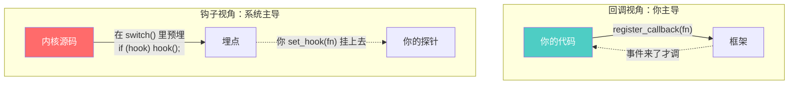
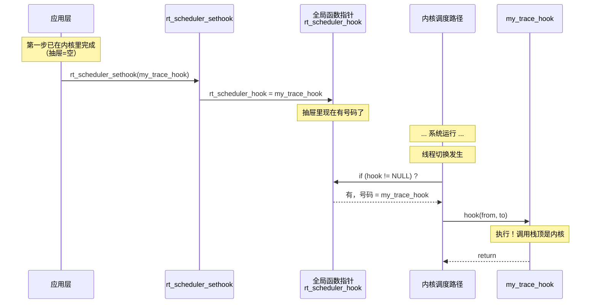
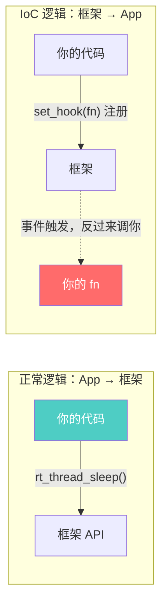
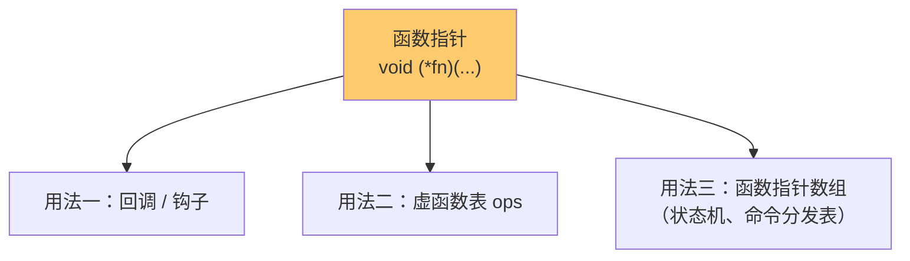
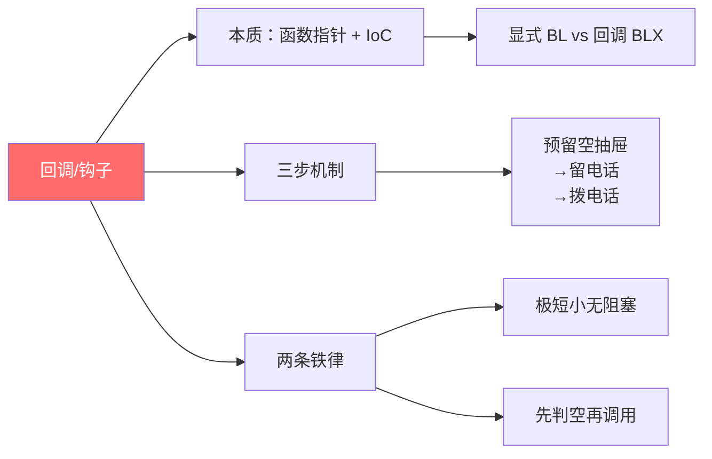

# 回调函数与钩子

> [!abstract] 核心本质
> 回调（Callback）和钩子（Hook）是**隐式调用**最经典的形态：你只写**定义**不写调用语句，把函数地址交给框架，由框架在事件发生时**替你按下回车键**。二者的根都是**控制反转（IoC）**——调用权从你手里转移到框架手里。区别只在"埋点方式"：回调像你**主动留给系统的电话号码**，钩子像系统**预设的安检监控点**。

普通人写代码是"我调你"（`uart_send()`），回调/钩子是"你把电话留给系统，系统在合适的时候**打给你**"。这就是好莱坞原则（Hollywood Principle）：**Don't call us, we'll call you.**

在阅读 RTOS、HAL、Linux 内核源码时，几乎处处都是这种"我没写调用语句，它却跑了"的代码。理解回调，就拿到了读懂所有框架内核的钥匙。它属于 [[显示调用和隐式调用]] 中「框架在事件点替你调」的那一支。

---

## 1. 回调 vs 钩子：同根而异的两个面孔

两者常常被混用，但工程上有一条清晰的分界线。

### 1.1 一句话区分

| | 回调 Callback | 钩子 Hook |
|---|--------------|-----------|
| **类比** | 你主动留给系统的**私人电话号码** | 系统在关键路口预设的**安检监控** |
| **埋点者** | 你（调用 register API 主动登记） | 系统（内核作者在源码里预埋调用点） |
| **触发权** | 系统拨号（事件发生时调你） | 系统拨号（走到埋点处调你） |
| **典型 API** | `register_callback(fn)` / `set_xxx_cb(fn)` | `set_xxx_hook(fn)` / `rt_scheduler_sethook()` |
| **常见场景** | 驱动数据接收、异步完成通知、事件订阅 | 线程切换监控、空闲低功耗、栈溢出兜底 |
| **本质** | 函数指针，由框架在事件里调用 | 函数指针，由内核在关键路径上调用 |

### 1.2 共同的本质


> [!note] 本质归一
> 回调和钩子**底层完全一样**——都是一个被框架持有的函数指针，在特定时机被框架调用。它们的区别只是"语义包装"：回调偏向"我订阅了某个事件"，钩子偏向"我在系统的关键路径上挂了一根探针"。所以本文后续不再严格区分，统称**回调/钩子机制**。

### 1.3 区别从何而来



- **回调**：是 API 设计的一部分，框架对外公开"你可以注册一个函数，我会在 X 事件时调它"。比如 HAL 的 `HAL_UART_RegisterCallback`。
- **钩子**：是内核作者**主动**在某些关键路径（线程切换、对象创建、空闲）预埋的扩展点，方便用户不改内核源码就能插入逻辑。比如 FreeRTOS 的 `vApplicationStackOverflowHook`、RT-Thread 的 `rt_scheduler_sethook`。

> [!tip] 名字之争，机制相同
> 不管叫 callback 还是 hook，C 语言层面都是同一个东西：**一个全局函数指针变量 + 一个 set/register 函数 + 框架里一处 `if (ptr) ptr(...)` 的调用点**。下文第 2 节就用这套三件套把它彻底拆开。

---

## 2. 三步机制：把回调彻底拆开

不管多复杂的回调系统，剥到底都是这三步。用 RT-Thread 调度器钩子做完整演示。

### 2.1 第一步：内核预留"空抽屉"（定义函数指针）

内核源码里，架构师提前声明一个全局函数指针变量，初始值为空——这就是"空抽屉"，等着你把电话号码放进去。

```c
/* ===== 内核 scheduler.c ===== */

/* 函数指针类型：约定"什么样的函数能挂进来" */
typedef void (*rt_scheduler_hook_t)(struct rt_thread *from, struct rt_thread *to);

/* 全局变量：那个空抽屉，初始为空 */
static rt_scheduler_hook_t rt_scheduler_hook = RT_NULL;
```

> [!note] 函数指针类型 = 调用契约
> 这个 `typedef` 就是契约：能挂进来的函数，签名必须长这样——两个 `rt_thread*` 参数、返回 `void`。签名不符强行挂，会栈破坏。函数指针的物理本质（`BLX R3`）见 [[../函数/函数认知]]。

### 2.2 第二步：你"留电话"（注册回调）

你写一个自己的函数，调用 set API 把地址塞进抽屉。

```c
/* ===== 你的应用层 app.c ===== */

/* ① 你写的函数：符合契约（两个 rt_thread*，返回 void） */
static void my_trace_hook(struct rt_thread *from, struct rt_thread *to)
{
    rt_kprintf("切换: %s -> %s\n", from->name, to->name);
}

/* ② 注册：把函数地址（电话号码）告诉内核 */
void app_init(void)
{
    rt_scheduler_sethook(my_trace_hook);
}
```

set API 在内核里的实现极其朴素：

```c
/* ===== 内核 scheduler.c ===== */
void rt_scheduler_sethook(rt_scheduler_hook_t hook)
{
    rt_scheduler_hook = hook;   /* 把你给的地址，塞进空抽屉 */
}
```

### 2.3 第三步：内核"拨电话"（触发回调）

内核在关键路径（这里是线程切换处）埋下调用点。只要抽屉里有号码，就拨号。

```c
/* ===== 内核 scheduler.c，上下文切换代码附近 ===== */
void rt_schedule(void)
{
    /* ... 即将发生线程切换 ... */
    struct rt_thread *from = current_thread;
    struct rt_thread *to   = next_thread;

    /* ★ 埋点：只要抽屉里有电话号码，就在这里拨打它 */
    if (rt_scheduler_hook != RT_NULL)
    {
        rt_scheduler_hook(from, to);   /* ← 你写的函数在此刻被执行 */
    }

    /* ... 继续完成汇编级的寄存器切换 ... */
}
```

### 2.4 三步全景



> [!tip] 三步口诀
> **预留空抽屉 → 留电话 → 拨电话**。所有框架的回调机制——HAL、RTOS、GUI、网络栈——剥开都是这三步。复杂只复杂在"抽屉有多少个、什么时候拨号"。

---

## 3. 控制反转 IoC：为什么必须用回调

### 3.1 正常逻辑 vs IoC 逻辑

| | 正常逻辑（你调框架） | IoC 逻辑（框架调你） |
|---|---------------------|---------------------|
| 控制权 | 在你（App）手里 | 在框架手里 |
| 典型调用 | `rt_thread_sleep(100)` | `rt_scheduler_sethook(my_fn)` 后被调 |
| 你写什么 | 写**调用语句** | 写**函数定义 + 注册** |
| 谁主动 | 你主动 | 框架主动 |
| 时机 | 你定 | 事件/路径决定 |



### 3.2 为什么非用 IoC 不可：解耦的艺术

假设你想统计每个线程的 CPU 占用率。**没有回调会怎样？**

```c
/* ❌ 没有 hook 的世界：必须改内核源码 */
void rt_schedule(void)
{
    /* ... 原本内核代码 ... */
    cpu_stat_record(from, to);   /* ← 你硬塞进来的统计代码 */

    /* 问题：
     *   1. 内核源码神圣不可侵犯，改了就脱离官方维护
     *   2. 官方升级版本，你的修改全部被覆盖
     *   3. 多个应用想插入不同逻辑，全挤在一处互相打架
     */
}
```

```c
/* ✅ 有 hook 的世界：内核和你的逻辑彻底解耦 */
/* 内核只管"切换时拨号"，不管拨号后干什么 */
/* 你想统计 CPU → 挂 cpu_stat_hook */
/* 你想翻转 LED → 挂 led_toggle_hook */
/* 内核一行都不用改 */
```

> [!important] 开闭原则的工程实现
> 软件工程说"对扩展开放、对修改封闭"。回调/钩子就是这条原则在 C 里的落地：**内核（封闭）不动，扩展（开放）通过挂函数实现**。内核和扩展点之间唯一的耦合，就是那个函数指针类型签名。

### 3.3 两种触发模式的对比

回调本质是隐式调用，但触发时机有两种截然不同的模式（详见 [[显示调用和隐式调用]]）：

| 触发模式 | 何时调 | 调几次 | 典型代表 |
|---------|--------|--------|---------|
| **事件驱动** | 某事件发生时 | 0 到无数次（取决于事件） | 数据接收回调、定时器回调 |
| **路径埋点** | 内核走到固定位置时 | 高频固定（如每次切换） | 调度器钩子、空闲钩子 |

[[自动初始化机制]] 是隐式调用的第三种模式——**启动触发**（必定调一次，仅 main 之前），与回调的"事件/路径触发"形成对照。

---

## 4. 回调 vs 虚函数表：函数指针的两种用法

回调和面向对象的虚函数表（vtable），底层都是函数指针，但**用法形态**完全不同。理解它们的异同，能打通 C 语言面向对象的任督二脉。

### 4.1 同：根都是函数指针



不管哪种用法，CPU 执行时都是 `BLX R3`——从寄存器取地址跳转。物理本质完全一样，见 [[../函数/函数认知]]。

### 4.2 异：固定多态 vs 动态注入

| 维度 | 虚函数表（[[C语言的继承和多态]]） | 回调 / 钩子 |
|------|--------------------------------|------------|
| **绑定时机** | 对象构造时（编译期/启动期固定） | 运行期随时 set/register |
| **数量** | 一个对象一张表，方法固定 | 一个埋点一个指针，可随时换 |
| **面向** | "同一接口、不同实现"的多态 | "某一时刻、插入任意逻辑"的扩展 |
| **持有者** | 对象自己持有 ops 指针 | 框架全局持有回调指针 |
| **谁调** | `obj->ops->write(obj,...)` | `if (cb) cb(...)` |
| **典型** | `rt_device` + `rt_device_ops` | `rt_scheduler_sethook` |

### 4.3 一个例子看懂差别

```c
/* ===== 虚函数表：对象自带一套"固定行为" ===== */
static const device_ops_t uart_ops = { .write = uart_write, .read = uart_read };
uart_dev.parent.ops = &uart_ops;          /* 构造时绑定 */

/* 调用：通过对象找 ops，再找方法 */
device_write(&uart_dev.parent, buf, n);   /* 永远调 uart_write */
/* uart_dev 这辈子就是用 uart_ops，除非你改它的 ops 字段 */


/* ===== 回调：埋点随时可换"任意逻辑" ===== */
static void hook_a(...) { /* 统计 CPU */ }
static void hook_b(...) { /* 翻转 LED */ }

rt_scheduler_sethook(hook_a);   /* 早上挂 A */
rt_scheduler_sethook(hook_b);   /* 下午换成 B */
/* 同一个埋点，可以动态换不同的函数 */
```

> [!tip] 一句话区分
> **虚函数表 = 一个对象的"固有行为集"**（描述"这个东西能干什么"）；**回调 = 一个埋点的"可插拔插槽"**（描述"这个时机可以塞什么进来"）。前者偏向多态建模，后者偏向扩展解耦。两者结合，就是 RT-Thread 设备框架 + 钩子体系的全部精髓。

---

## 5. RT-Thread 三大神钩子

读完前面四节，下面这些"神钩子"就不再神秘——它们都只是把空抽屉埋在了内核的不同路径上。

| 钩子 | set API | 埋点位置 | 何时触发 | 典型用途 |
|------|---------|---------|---------|---------|
| **空闲钩子** | `rt_thread_idle_sethook` | 空闲线程循环体 | 系统无事可做时 | 让 CPU 进低功耗（Sleep/Stop）、喂狗、后台清理 |
| **调度器钩子** | `rt_scheduler_sethook` | `rt_schedule()` 切换处 | 每次线程上下文切换 | 性能 Trace、CPU 占用统计、执行时间测量 |
| **对象钩子** | `rt_object_attach_sethook` 等 | 对象创建/销毁路径 | 线程/信号量等对象生死时 | 监控资源泄漏、排查内存问题 |

> [!note] 三大钩子的共性
> 它们都遵循第 2 节的三步机制：内核预留空抽屉（全局函数指针）→ 你 set 挂上 → 内核走到埋点时拨号。区别只在"埋点位置"和"函数签名"。

---

## 6. 汇编视角：BL 硬编码 vs BLX R3

显式调用和回调调用，在汇编层只有一条指令的差别——但这条差别，正是"控制权"的物质载体。

```text
【显式调用：BL add】—— 编译期地址写死
    MOV    R0, #1
    BL     add              ; add 的地址在链接期已写死进指令
    ; 控制流像铁轨，PC 顺序铺过去

【回调调用：BLX R3】—— 运行期地址可变
    LDR    R3, =rt_scheduler_hook   ; R3 = 抽屉的地址
    LDR    R3, [R3]                 ; R3 = 抽屉里存的函数地址
    CMP    R3, #0
    BEQ    skip                     ; if (hook == NULL) 跳过
    BLX    R3                       ; 跳到 R3 指向的地址
skip:
```

| 指令 | 地址来源 | 谁决定跳哪 | 归属 |
|------|---------|-----------|------|
| `BL <label>` | 编译期写死 | 编译器/链接器 | 显式调用 |
| `BLX R3` | 运行期寄存器 | 你 set 进去的函数 | 回调（隐式） |

> [!tip] 一条指令见本质
> **显式调用的物理形态是 `BL`，回调的物理形态是 `BLX Rn`。** 中间多一次内存读取（把抽屉里的号码加载进寄存器），代价几乎为零，却换来了运行期可插拔的灵活性。详见 [[../函数/函数认知]]。

---

## 7. ⚠️ 铁律与避坑

回调/钩子是威力巨大的机制，但用错就是系统级灾难。下面这条铁律，是无数嵌入式事故换来的。

### 7.1 钩子跑在什么上下文？

```text
不同代理人 × 不同上下文 × 不同禁忌：

调度器钩子   → 调度器已锁，禁止任何阻塞 API
空闲钩子     → 空闲任务上下文，禁止阻塞空闲线程
栈溢出钩子   → 调度上下文 + 内存已污染，只做 halt + 记录
中断回调     → 中断上下文，禁止 rt_thread_delay / take 占用的信号量
普通驱动回调 → 普通任务上下文，可阻塞（但仍要看具体驱动）
```

### 7.2 铁律：绝不在钩子里阻塞

```c
/* ❌ 致命错误：在调度器钩子里阻塞 */
static void my_hook(struct rt_thread *from, struct rt_thread *to)
{
    rt_thread_mdelay(10);          /* 死锁！调度器已锁 */
    rt_sem_take(busy_sem, ...);    /* 死锁！可能永不返回 */
}

/* ✅ 正确：钩子极短小，只做无阻塞操作 */
static void my_hook(struct rt_thread *from, struct rt_thread *to)
{
    g_switch_cnt++;                /* 只累加计数器 */
    /* 或翻转一个 GPIO，或往无锁环形缓冲写一条记录 */
}
```

> [!warning] 钩子铁律（千万牢记）
> 钩子函数在**内核上下文**甚至**中断上下文**里执行。此时调度器往往被锁死——你在钩子里调 `delay`、`take` 一个被占用的信号量，系统会**瞬间死锁崩溃**。
>
> **铁律：回调/钩子必须极其短小精悍，绝对不能包含任何会引起阻塞（Block）或睡眠（Sleep）的代码。** 只做：累加计数器、翻转 GPIO、写无锁缓冲、打一条极短日志。

### 7.3 避坑清单

| 陷阱 | 表现 | 对策 |
|------|------|------|
| 钩子里阻塞 | 系统死锁、卡死 | 只做无阻塞操作 |
| 钩子里 `printf` | 执行慢、可能阻塞、栈消耗大 | 改用极短日志或写环形缓冲 |
| 忘记判空 | `NULL()` 崩溃 | 内核埋点必须 `if (cb) cb()` |
| 签名不符强挂 | 栈破坏、参数错乱 | 严格匹配函数指针类型 |
| 重入竞态 | 钩子里改共享变量被撕裂 | 用原子操作或关中断保护 |
| 钩子执行过久 | 实时性丧失、丢中断 | 控制在几微秒内 |

---

## 8. 一页总结



> [!abstract] 三句话记住全文
> **① 本质**：回调/钩子是隐式调用最经典的形态——你只写定义不写调用，把函数地址交给框架，由框架在事件/埋点处替你调。根都是控制反转（IoC）。
>
> **② 机制**：剥到底就是三件套——内核一个全局函数指针（空抽屉）+ 一个 set API（留电话）+ 内核里一处 `if (ptr) ptr(...)`（拨电话）。
>
> **③ 铁律**：钩子跑在内核/中断上下文，调度器往往已锁，**绝不能阻塞或睡眠**，只做累加计数、翻转 GPIO、写无锁缓冲这类极短操作。

### 速查口诀

```text
回调三问（用之前问自己）：
  ① 这个钩子跑在什么上下文？（调度/中断/空闲/任务）
  ② 它对应什么函数指针签名？（参数类型、返回值）
  ③ 我要塞进去的逻辑，会不会阻塞或耗时？

实现三件套（自己写回调系统）：
  ① typedef 函数指针类型（定契约）
  ② static 全局函数指针变量 = NULL（空抽屉）
  ③ 埋点处 if (ptr != NULL) ptr(...)（拨电话）
```

---

## 继续阅读

- [[显示调用和隐式调用]] —— 回调是隐式调用家族的核心一支，本篇是其具体展开
- [[../函数/函数认知]] —— 函数指针的物理本质（`BLX R3`）、函数调用的栈帧机制
- [[自动初始化机制]] —— 隐式调用的另一种形态（启动触发 vs 回调的事件触发）
- [[C语言的继承和多态]] —— 函数指针的另一用法：虚函数表，与回调的对照

---

## 9. 面试高频问题

> [!example]- Q1：什么是回调函数？为什么要用回调？
> 回调是**只写定义、不写调用语句**，把函数地址交给框架、由框架在事件发生时调用的机制。它实现的是**控制反转（IoC）**——控制权从你（App）手里转移到框架手里。用回调的核心目的是**解耦**：内核/框架不需要修改源码就能被扩展，符合"对扩展开放、对修改封闭"的开闭原则。比如想统计线程 CPU 占用，不用改内核 `scheduler.c`，只需 `rt_scheduler_sethook(my_fn)` 挂个钩子。

> [!example]- Q2：回调函数和钩子函数有什么区别？
> 底层完全一样——都是"框架持有的函数指针 + 在事件/埋点处调用"。区别在语义偏向：**回调**是你主动 register 到某个 API（如 `HAL_UART_RegisterCallback`），偏向"我订阅了某事件"；**钩子**是内核在关键路径预埋的扩展点（如 `rt_scheduler_sethook`），偏向"我在系统必经之路上挂了探针"。一个偏事件驱动，一个偏路径埋点，本质都是隐式调用。

> [!example]- Q3：用 C 实现一个最简单的回调机制，需要哪几步？
> 三件套：① `typedef void (*hook_t)(args...)` 定义函数指针类型（契约）；② `static hook_t g_hook = NULL` 全局函数指针变量（空抽屉）；③ 提供 `set_hook(hook_t fn){ g_hook = fn; }` 注册函数（留电话）；④ 内核埋点处 `if (g_hook) g_hook(...)`（拨电话）。使用方写一个符合签名的函数，调 set_hook 注册，之后内核走到埋点就会调它。

> [!example]- Q4：为什么钩子函数里不能调用阻塞 API？
> 因为钩子跑在**内核上下文**（如调度器路径）或**中断上下文**，此时调度器往往已被锁死。你在钩子里调 `rt_thread_delay()` 或 `rt_sem_take()` 一个被占用的信号量，会立刻**死锁**——调度器锁着无法切换去释放信号量，而钩子又在等这个信号量，系统永久卡死。铁律：钩子必须极短小、无阻塞，只做累加计数、翻转 GPIO、写无锁缓冲等操作。

> [!example]- Q5：回调函数和虚函数表有什么异同？
> 同：底层都是函数指针，CPU 执行时都是 `BLX Rn` 从寄存器取地址跳转。异：① **虚函数表**是对象自带的固定行为集，构造时绑定，描述"这个对象能干什么"（多态）；**回调**是埋点的可插拔插槽，运行期随时 set/换，描述"这个时机能塞什么进来"（扩展）。② 虚表持有者是对象（`obj->ops`），回调持有者是框架全局变量。前者偏建模，后者偏解耦，两者结合就是 RT-Thread 设备框架 + 钩子体系。

> [!example]- Q6：回调机制和自动初始化机制（INIT_EXPORT）都属于隐式调用吗？区别在哪？
> 都属于隐式调用——都是"你只写定义，别人替你调"。区别在**触发时机和确定性**：回调由**运行时事件**触发（数据到达才调，条件触发，可能永不触发）；自动初始化由**启动流程**触发（main 之前必定调一次，确定触发）。底层都是"函数指针 + 外部代理遍历调用"，但代理人和时机不同——回调的代理是事件，自动初始化的代理是启动代码遍历段表。
