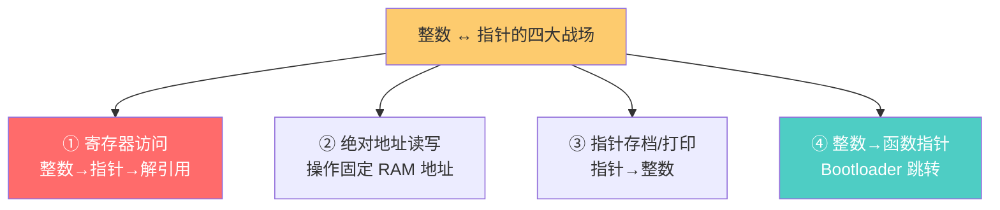
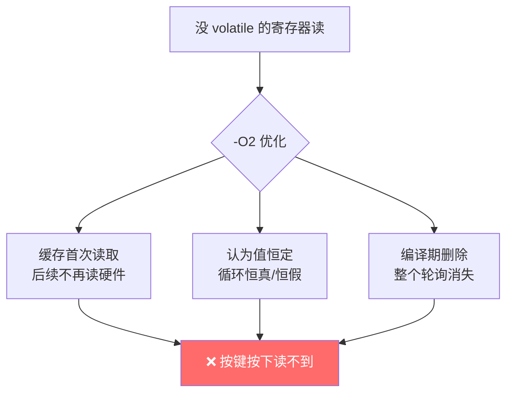
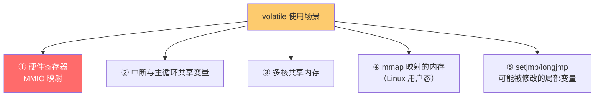
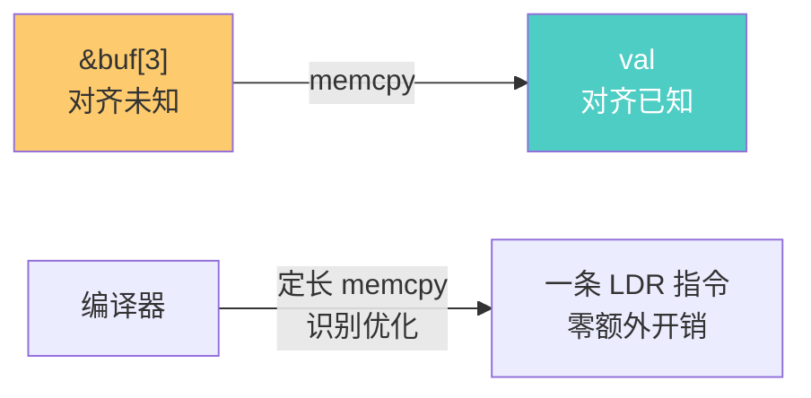
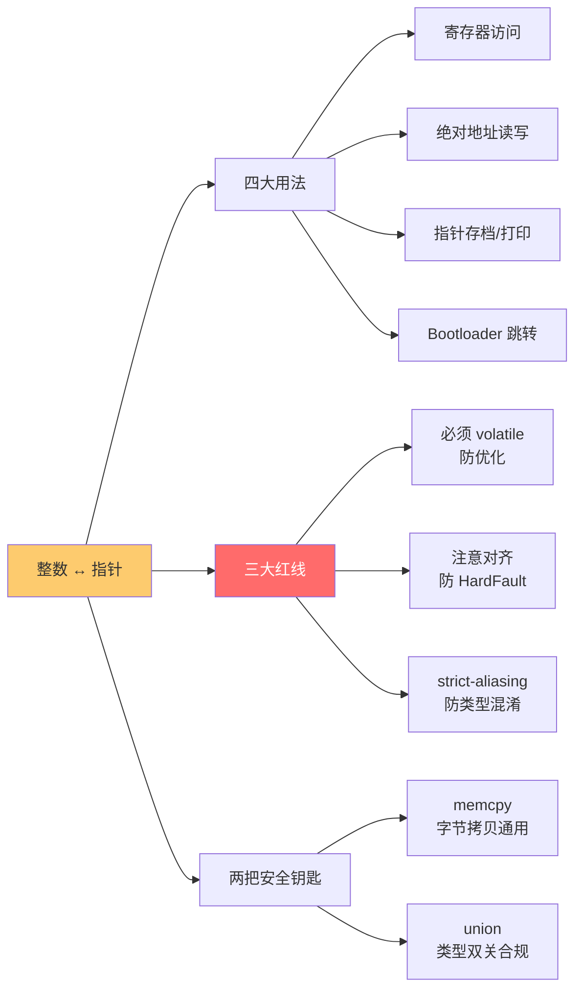

# 整形转指针

> [!abstract] 核心本质
> 整数与指针互转是嵌入式"直接操控硬件"的根基——地址本质就是一个无符号整数，把一个整数强转成指针就能读写那块内存，把指针转回整数就能存档/打印/传递它。寄存器访问、绝对地址跳转、Bootloader、对象 ID 全靠这套机制。但它也是 strict-aliasing 违规和对齐崩溃的重灾区：裸强转能跑，只是"刚好没出错"，要写得安全必须懂 `volatile`、`memcpy`、union 类型双关和对齐规则。

读 STM32 HAL 或 RT-Thread 源码时，最先撞上的"怪代码"就是这行：

```c
#define GPIOA_ODR    *(volatile uint32_t *)0x40020014   /* 直接访问 GPIOA 输出数据寄存器 */
```

把一个整数 `0x40020014` 强转成指针再解引用——这在 PC 应用程序里几乎见不到，但在嵌入式里是家常便饭。理解这行代码背后的"为什么能转、为什么必须 volatile、什么时候会崩"，就拿到了嵌入式内存操作的入场券。

---

## 1. 为什么嵌入式离不开它

### 1.1 地址的本质：就是一个整数

```text
MCU 的内存空间是一张线性地址表：

地址（无符号整数）     内容
0x00000000 ┌──────────┐
           │ Vector   │  ← 中断向量表
0x000001C0 ├──────────┤
           │ Flash    │  ← 程序代码
0x08000000 ├──────────┤
           │ ...代码   │
0x1FFFFFFF ├──────────┤
           │ SRAM     │  ← 运行内存
0x20000000 ├──────────┤
           │ 全局变量  │
           │ 栈        │
0x2000FFFF ├──────────┤
           │ 外设     │  ← 寄存器映射区
0x40000000 ├──────────┤
           │ GPIOA    │
           │ USART1   │
0x40020014 │ GPIOA_ODR│  ← 一个具体寄存器
           └──────────┘

每一个地址 = 一个无符号整数
"访问 0x40020014" = "把整数 0x40020014 当指针用"
```

### 1.2 PC vs 嵌入式的根本区别

| 维度 | PC 应用程序 | 嵌入式裸机/RTOS |
|------|------------|----------------|
| 地址可见性 | MMU 虚拟地址，应用碰不到物理地址 | 直接物理地址，程序员要记住布局 |
| 内存访问 | malloc 返回指针，**禁止**用整数造地址 | **必须**用整数造地址访问寄存器 |
| 安全保护 | 访问非法地址 → 段错误（OS 拦截） | 访问非法地址 → HardFault 或乱跑 |
| 寄存器操作 | 几乎没有 | 核心工作：配置/读写外设寄存器 |
| 谁在用整数转指针 | 几乎没人 | HAL/CMSIS/驱动每天都在用 |

### 1.3 嵌入式里整数转指针的四大战场



> [!note] 这一篇解决什么
> PC 程序员一辈子可能都不会写 `(uint32_t*)0x12345678`，但嵌入式工程师每天写。本篇要讲清：**① 为什么能这样转（地址即整数）；② 为什么转完必须加 volatile；③ 为什么有时候转完会崩（对齐/strict-aliasing）；④ 怎么转才合规（union/memcpy）**。

---

## 2. 四种典型用法

### 2.1 用法一：寄存器访问（最常见）

```c
/* STM32 GPIOA 输出数据寄存器地址 = 0x40020014 */

/* 写：把整数转指针 + 解引用赋值 */
*(volatile uint32_t *)0x40020014 = (1U << 5);   /* PA5 输出高 */

/* 读：转指针 + 解引用取值 */
uint32_t val = *(volatile uint32_t *)0x40020014;
```

完整链路拆解：

```text
0x40020014                          整数（寄存器地址）
        │
        ▼  (uint32_t *)
(uint32_t *)0x40020014              指向 uint32_t 的指针
        │
        ▼  *(解引用)
*(uint32_t *)0x40020014             那块内存里的值（寄存器当前值）
        │
        ▼  = 赋值 / 读
写入：把新值写进 0x40020014 这块内存（即写寄存器）
读出：把那块内存的值取出来（即读寄存器）

★ 关键：volatile 必须有，原因见第 3 节
```

工程上通常封装成宏，避免每次写一长串：

```c
#define REG32(addr)   (*(volatile uint32_t *)(addr))

#define GPIOA_ODR     REG32(0x40020014)
#define GPIOA_BSRR    REG32(0x40020018)

GPIOA_BSRR = (1U << 5);           /* 置位 PA5 */
GPIOA_BSRR = (1U << (5 + 16));    /* 复位 PA5 */
uint32_t out = GPIOA_ODR;         /* 读当前输出状态 */
```

### 2.2 用法二：绝对地址内存读写

```c
/* 需求：往 RAM 的固定地址 0x20000000 写一个标志位
   （比如多核共享内存、Bootloader 传参区、掉电保持区） */

#define BOOT_FLAG_ADDR   0x20000000

/* 写标志 */
*(volatile uint32_t *)BOOT_FLAG_ADDR = 0xDEADBEEF;

/* 后续检查 */
if (*(volatile uint32_t *)BOOT_FLAG_ADDR == 0xDEADBEEF) {
    enter_bootloader();
}

/* 这和"定义一个全局变量"本质不同：
   全局变量地址由链接器决定，程序员不一定知道在哪
   绝对地址访问是"我指定这块内存干什么"，地址固定不变
   常用于：与 Bootloader 约定的握手 RAM、跨核通信区、外设 DMA buffer */
```

### 2.3 用法三：指针转整数（存档/打印/传递）

```c
void *buf = malloc(1024);

/* 打印：调试时想看地址值 */
printf("buffer at: 0x%08X\n", (uint32_t)buf);   /* 指针 → 整数 */

/* 存档：把指针存进只有 32 位的结构体字段 */
struct msg {
    uint32_t sender_addr;   /* 用整数字段存指针 */
};
msg.sender_addr = (uint32_t)buf;                /* 指针 → 整数 */

/* 取回：整数 → 指针 */
void *p = (void *)msg.sender_addr;              /* 整数 → 指针 */
use_buffer(p);
```

> [!tip] 为什么不直接用 void* 字段
> 有些场景必须用整数存指针：① 协议帧格式固定为 32 位字段（跨设备/跨架构传输）；② 想把指针转成十六进制打印调试；③ 旧 ABI/二进制兼容字段。但要注意：**指针位数 ≠ int 位数**时（如 64 位系统上 `void*` 是 8 字节、`int` 是 4 字节），强转会被截断丢地址——必须用 `intptr_t`/`uintptr_t`（位数匹配指针的类型）。

### 2.4 用法四：整数→函数指针（Bootloader 跳转）

这是整数转指针最硬核的用法——直接跳到一个固定地址执行代码。

```c
/* STM32 Bootloader 跳转到用户 App（App 烧在 0x08010000） */

#define APP_ADDRESS  0x08010000

typedef void (*app_entry_t)(void);

void jump_to_app(void) {
    /* App 的入口地址存在 0x08010000 + 4 处（向量表第二项 reset_handler） */
    uint32_t app_entry_addr = *(volatile uint32_t *)(APP_ADDRESS + 4);

    /* 整数 → 函数指针 */
    app_entry_t app_entry = (app_entry_t)app_entry_addr;

    /* 设置 MSP（主栈指针，向量表第一项） */
    uint32_t app_sp = *(volatile uint32_t *)APP_ADDRESS;
    __set_MSP(app_sp);

    /* 跳转执行 */
    app_entry();    /* 永不返回，跳进 App */
}
```


> [!note] 这是显式调用还是隐式调用？
> `app_entry()` 这一行是你写的调用语句，时机由你定，所以属于**显式调用**（间接调用）——函数指针由你自己发起。但跳转后进入 App，控制流就交出去了。函数指针的物理本质（`BLX R3`）见 [[../函数/函数认知]]。它与 [[显示调用和隐式调用]] 里讲的中断/回调形成对比：那些是隐式的（别人替你调），这里是你自己显式跳。

---

## 3. 为什么必须加 `volatile`

把第 2 节所有示例里的 `volatile` 去掉，代码"看起来"也能跑——但那是**编译器放你一马**，不是真的安全。理解 volatile 是写寄存器代码的内功。

### 3.1 不加 volatile 的灾难

```c
/* 假设 GPIOA_IDR（输入数据寄存器）地址 = 0x40020010 */
#define GPIOA_IDR   (*(uint32_t *)0x40020010)   /* ❌ 忘了 volatile */

/* 轮询等待 PA0 拉高 */
while ((GPIOA_IDR & (1U << 0)) == 0) {
    /* 等按键按下 */
}
```

编译器看到这段代码会怎么想：

```text
编译器视角：
  "GPIOA_IDR 是 *(uint32_t*)0x40020010"
  "循环里没有任何代码修改这个值"
  "那它就一直不变！"
  "while 条件恒为真/恒为假，我可以优化掉"

优化结果（-O2 下）：
  方案 A：把第一次读的值缓存，后面循环不再读硬件
         → 按键按下也读不到，死循环
  方案 B：如果第一次读到 0，认为永远 0，直接死循环
         → 连硬件状态都不查了
  方案 C：编译期就算出结果，整个循环删除
         → 程序逻辑直接没了
```



### 3.2 volatile 的本职：阻止这种优化

```c
#define GPIOA_IDR   (*(volatile uint32_t *)0x40020010)   /* ✅ 有 volatile */

while ((GPIOA_IDR & (1U << 0)) == 0) { }
```

`volatile` 告诉编译器：**这块内存的值会"被看不见的力量"改变**（硬件、中断、其他核），**每次访问都必须老老实实读写真实地址，不许缓存、不许合并、不许删除**。

```text
有 volatile 后，编译器生成的汇编：

loop:
    LDR    R0, =0x40020010    ; 地址
    LDR    R1, [R0]           ; ★ 每次都真正读硬件
    TST    R1, #1
    BEQ    loop               ; 不为 1 就继续读

→ 每一轮循环都真实读寄存器，按键按下立刻能感知
```

### 3.3 volatile 的三个作用

| 作用 | 不加会怎样 | 加了保证 |
|------|-----------|---------|
| **禁止缓存** | 读到的值可能被编译器缓存到寄存器，看不到硬件变化 | 每次访问真实内存 |
| **禁止合并** | 两次连续读/写可能被合并成一次 | 每次访问独立执行 |
| **禁止删除** | "看似无用"的读写可能被删掉 | 所有访问都执行 |

```c
/* 经典案例：写寄存器触发硬件动作，不能合并/删除 */
#define TX_FIFO   (*(volatile uint8_t *)0x40004000)

TX_FIFO = 'H';   /* 必须真发出去 */
TX_FIFO = 'i';   /* 必须再发一次 */
/* 没 volatile：编译器可能合并成一次写，或认为无用删掉 */
```

### 3.4 什么时候必须用 volatile



> [!important] 嵌入式铁律
> **凡是整数转指针访问内存映射寄存器，必须 `volatile`**。HAL/CMSIS 的所有寄存器定义（`__IO`、`__I`、`__O`）本质都是 volatile。volatile 的更深入讨论（为什么它不能替代锁、Java volatile vs C volatile 的区别）见 [[../函数/Voliate函数]]。

---

## 4. volatile 解决不了的问题：strict-aliasing

很多人以为"加了 volatile 就万事大吉"，错。volatile 只解决"优化"问题，解决不了 C 标准层面的**别名规则**问题。

### 4.1 什么是 strict-aliasing

C 标准规定：**不同类型的指针不能指向同一块内存**（少数例外除外）。违反这条规则叫"strict-aliasing 违规"，编译器在 `-O2` 下会基于这条规则做激进优化，结果可能完全错误。

```c
/* 违规例子：用 uint32_t* 和 uint16_t* 指向同一块内存 */
uint32_t  data = 0x11223344;
uint32_t *p32 = &data;
uint16_t *p16 = (uint16_t *)&data;   /* ❌ 类型不符 */

*p16 = 0x5555;
/* 标准 C：这是未定义行为（UB）
   编译器可能：① 假装没看到 *p16 写，保留旧值
              ② 乱序、合并、删掉这次写
              ③ 实际"恰好"改了内存（-O0 下）*/
```

### 4.2 整数转指针的违规形态

```c
/* ❌ 整数转成"和目标内存类型不符"的指针 */
uint8_t buf[100];
uint32_t *p32 = (uint32_t *)&buf[1];   /* 对齐 + 类型双重违规 */

/* 寄存器场景（看似违规实则豁免）*/
#define GPIO_ODR   (*(uint32_t *)0x40020014)
/* 这里是把"无类型地址"转成 uint32_t* 访问
   没有别的指针同时指向这块内存，所以"别名"问题不存在
   + volatile + 寄存器本质就是 32 位 → 工程上安全 */
```

### 4.3 哪些类型转换是合法的

```text
C 标准的别名豁免：
  ✅ 任何类型 ↔ char*（char 是"字节视图"，永远合法）
  ✅ signed T ↔ unsigned T（signed/unsigned 互通）
  ✅ T* ↔ void*（无类型指针，中间状态）
  ✅ 结构体指针 ↔ 它的第一个成员的指针（开头布局相同）

  ❌ uint32_t* ↔ uint16_t*（不同大小）
  ❌ int* ↔ float*（不同类型）
  ❌ struct A* ↔ struct B*（不同结构体，即使布局相同）
```

> [!warning] volatile 和 strict-aliasing 是两件事
> volatile 防"优化掉"，strict-aliasing 防"类型混淆"。一个寄存器地址加 volatile 能让硬件读写正确，但**如果你同时还用别的类型指针访问它**，依然违规。安全做法见第 6 节（union/memcpy）。

---

## 5. 对齐陷阱：转完就崩

整数转指针最大的物理陷阱是**对齐**——指针指向的地址必须符合它类型的对齐要求，否则在某些架构上直接 HardFault。

### 5.1 对齐规则

```text
每种类型有"对齐要求"（alignment），通常是该类型大小的整数倍：

uint8_t*   对齐 1 字节   → 任何地址都行
uint16_t*  对齐 2 字节   → 地址必须是 2 的倍数（偶数）
uint32_t*  对齐 4 字节   → 地址必须是 4 的倍数
uint64_t*  对齐 8 字节   → 地址必须是 8 的倍数
struct X*  对齐 = 最大成员的对齐

例：0x20000004 对 uint32_t 合法
    0x20000005 对 uint32_t 违规（不是 4 的倍数）
```

### 5.2 不对齐会怎样

```c
/* ARM Cortex-M0/M0+（不允许非对齐访问）*/
uint8_t buf[10];
uint32_t *p = (uint32_t *)&buf[1];   /* buf[1] 地址可能不是 4 的倍数 */
*p = 0xDEADBEEF;                     /* 💥 HardFault！*/
```

```text
不同架构对非对齐访问的反应：

Cortex-M0/M0+      → 直接 HardFault（硬件不支持非对齐）
Cortex-M3/M4/M7    → 通常允许非对齐 word 访问，但有性能惩罚
                    （多字节访问拆成多次，慢）
Cortex-M3/M4 多字  → 部分指令（LDM/STM）非对齐直接 HardFault
x86                → 硬件支持但慢，几乎不崩（让人误以为没事）
某些 DSP           → 静默返回错误数据（最阴险）
```

> [!warning] 别用 x86 的经验套嵌入式
> x86 几乎不崩非对齐访问，让 PC 程序员养成"指针随便转"的坏习惯。移植到 Cortex-M0 上立刻 HardFault。**写嵌入式指针代码，永远假设"必须对齐"**，因为最坏情况是崩，最好情况也只是慢。

### 5.3 整数转指针的对齐陷阱

```c
/* 从某个协议帧里取出 4 字节，想当 uint32_t 用 */
uint8_t *frame = get_frame();
uint32_t *p = (uint32_t *)&frame[1];   /* ❌ frame[1] 不保证 4 字节对齐 */

/* 安全做法见第 6 节：用 memcpy */
uint32_t val;
memcpy(&val, &frame[1], sizeof(uint32_t));   /* ✅ 字节级拷贝，对齐无关 */
```

### 5.4 编译器提供的对齐检查工具

```c
/* 编译期检查对齐 */
_Static_assert((0x40020014 % 4) == 0, "GPIO ODR not aligned");   /* C11 */

/* GCC 启动运行期对齐检查（调试用）*/
/* -fsanitize=alignment  在违反对齐时立刻报错 */

/* RT-Thread 等内核用 __alignof__ 查对齐要求 */
size_t a = __alignof__(uint32_t);   /* 通常 = 4 */
```


> [!tip] 对齐检查三问
> 写指针强转前问自己：① 目标类型要求几字节对齐？② 这个整数地址是它的倍数吗？③ 不确定就用 memcpy。**寄存器地址是芯片厂商设计好的，永远对齐**，所以第 2 节那些寄存器访问没问题；问题出在协议帧、缓存区这类"任意地址"场景。

---

## 6. 安全写法：union 与 memcpy

第 4、5 节的 strict-aliasing 和对齐陷阱，C 标准提供了两把合规的"破局钥匙"：**union 类型双关**和 **memcpy 字节拷贝**。

### 6.1 不安全写法回顾

```c
/* ❌ 三重违规：类型别名 + 对齐 + 可能未定义 */
uint8_t buf[100];
uint32_t val = *(uint32_t *)&buf[3];   /* 强转 + 解引用 */
/* 风险：
   ① buf[3] 不一定 4 字节对齐 → Cortex-M0 崩
   ② uint8_t[] 与 uint32_t 别名违规 → -O2 下未定义
   ③ buf 未初始化时读到垃圾 */
```

### 6.2 安全写法一：memcpy（最通用）

memcpy 通过 `char*`（字节视图）操作，**豁免 strict-aliasing**，且对任何地址都安全（按字节拷贝，不要求对齐）。

```c
#include <string.h>

uint8_t buf[100];
uint32_t val;

/* ✅ 安全：字节级拷贝，对齐无关，类型合规 */
memcpy(&val, &buf[3], sizeof(uint32_t));

/* 反向：把 uint32_t 写进 buffer 的任意位置 */
uint32_t data = 0x12345678;
memcpy(&buf[5], &data, sizeof(uint32_t));

/* 现代编译器对"定长 memcpy"有特殊优化：
   sizeof(uint32_t) 在编译期已知 → 优化成一条 32 位 load/store
   运行期和指针强转一样快，但合规 */
```



> [!note] 定长 memcpy 不是"慢"
> 很多人以为 memcpy 比指针强转慢（觉得要逐字节拷）。错。当长度是编译期常量（如 `sizeof(uint32_t)`），现代编译器（GCC/Clang）会把它识别成"单次类型化访问"，生成**一条 load/store 指令**——和指针强转生成的代码完全一样，但合规。

### 6.3 安全写法二：union 类型双关

union 让多个成员**共享同一块内存**，C99 起明确允许通过 union 做类型双关（GCC 扩展更宽容）。

```c
/* ✅ 安全：union 允许同一块内存被多种类型"视图"访问 */
typedef union {
    uint8_t  b[4];
    uint32_t w;
} word_view_t;

word_view_t v;
v.w = 0x11223344;
printf("bytes: %02X %02X %02X %02X\n",
       v.b[0], v.b[1], v.b[2], v.b[3]);   /* 字节序细节见下 */
```

union 内部对齐由最大成员决定，所以 `v.w` 一定对齐，不会崩。这是写"既要按字节访问又要按字访问"的缓冲区时的标准做法。

### 6.4 两种安全写法的取舍

| 场景 | 推荐 | 理由 |
|------|------|------|
| 从协议帧/缓冲区任意位置取多字节 | **memcpy** | 不要求源地址对齐 |
| 同一块缓冲区既要字节又要整型视图 | **union** | 一次定义、长期复用 |
| 寄存器访问 | **裸强转 + volatile** | 地址芯片设计已对齐 |
| 跨字节序传输（网络/存储） | **memcpy + 手动字节序处理** | memcpy 不解决字节序，只解决对齐/别名 |
| 高频热路径 | **memcpy**（定长会被优化） | 性能等同强转，但合规 |

> [!important] memcpy 不解决字节序
> memcpy 只是把字节原样搬过去——大小端怎么排，它不管。如果你要从网络字节序（big-endian）解出 uint32_t，memcpy 后还要手动 `ntohl()` 转字节序。不要把"对齐/别名合规"和"字节序正确"混为一谈。

### 6.5 工程封装：万能读写宏

```c
/* 兼顾安全与性能的寄存器访问宏 */
#define REG8(addr)    (*(volatile uint8_t  *)(uintptr_t)(addr))
#define REG16(addr)   (*(volatile uint16_t *)(uintptr_t)(addr))
#define REG32(addr)   (*(volatile uint32_t *)(uintptr_t)(addr))

/* 万能内存读取（任意对齐）*/
static inline uint32_t read_le32(const void *p) {
    uint32_t v;
    memcpy(&v, p, sizeof(v));     /* 合规：char* 字节拷贝 */
    return v;
}

/* 使用 */
uint32_t reg = REG32(0x40020014);              /* 寄存器：直接强转 */
uint32_t val = read_le32(&buf[3]);             /* 任意地址：memcpy */
```

---

## 7. 避坑清单

| 陷阱 | 表现 | 对策 |
|------|------|------|
| 寄存器访问忘 volatile | 轮询死循环、读写丢失 | `*(volatile uint32_t*)` 必加 volatile |
| 转成大类型指针访问小缓冲 | 非对齐 HardFault | 用 memcpy 字节拷贝 |
| 用 `int` 存指针 | 64 位系统地址被截断 | 用 `intptr_t`/`uintptr_t` |
| 转成函数指针调错误地址 | BLX 跳野地址 → HardFault | 跳转前校验地址范围、对齐 |
| 误以为 volatile 等于原子 | 多字节读写仍可被打断 | volatile + 关中断/原子操作 |
| strict-aliasing 违规 | -O2 下未定义行为 | memcpy 或 union |
| 强转后解引用已释放内存 | use-after-free | 转换与解引用之间确保对象存活 |
| 把栈地址转整数返回 | 悬垂指针 | 永不返回栈地址给调用者 |
| 跨字节序传输直接转 | 数据错乱 | memcpy + ntohl/htonl |
| 静默错误（DSP/某些架构） | 数据错但不崩 | 严格对齐，加运行期检查 |

> [!warning] volatile 不保证原子性
> ```c
> volatile uint64_t counter;   /* 64 位变量 */
> /* 线程 A 中断里 counter++ */
> /* 线程 B 主循环读 counter */
> ```
> volatile 只保证"每次都真实访问内存"，**不保证"读写是原子的"**。64 位变量在 32 位 MCU 上要两次 32 位访问，仍可能被打断读到半新半旧的值。原子保护要靠关中断或 `__atomic` 内建函数。详见 [[../函数/Voliate函数]]。

> [!tip] 编译期对齐与类型校验
> ```c
> /* 编译期断言地址对齐 */
> #define ASSERT_ALIGNED(addr, type) \
>     _Static_assert(((uintptr_t)(addr) & (__alignof__(type) - 1)) == 0, \
>                    "address not aligned")
>
> ASSERT_ALIGNED(0x40020014, uint32_t);   /* 编译期通过 */
> ASSERT_ALIGNED(0x40020015, uint32_t);   /* 编译期报错 */
> ```

---

## 8. 一页总结



> [!abstract] 三句话记住全文
> **① 能转的根基**：地址本质是无符号整数，所以整数和指针可以互转——这是嵌入式"直接操控硬件"的根基。四大用法：寄存器访问、绝对地址读写、指针存档、Bootloader 跳转。
>
> **② 三条红线**：① 寄存器/MMIO 访问**必须 volatile**（防编译器缓存/合并/删除）；② 转成大类型指针要**确保对齐**（否则 Cortex-M0 等架构 HardFault）；③ 不同类型指针指向同一块内存违反 **strict-aliasing**（-O2 下未定义）。
>
> **③ 两把安全钥匙**：memcpy（字节拷贝，豁免别名 + 不要求对齐，定长会被编译器优化成一条 load/store）；union（类型双关，C99 允许）。寄存器访问用"裸强转 + volatile"即可，因为芯片厂商保证对齐；任意地址访问用 memcpy 最稳。

### 速查口诀

```text
整数 ↔ 指针决策树：
  ① 访问寄存器？     → 裸强转 + volatile（地址芯片保证对齐）
  ② 访问任意内存？   → memcpy（不要求对齐 + 类型合规）
  ③ 双视图缓冲？     → union（既字节又整型）
  ④ 跨字节序传输？   → memcpy + ntohl/htonl

三红线检查：
  □ volatile 加了吗？（防优化）
  □ 地址对齐了吗？（防 HardFault）
  □ 类型别名合规吗？（防 UB）

记忆：
  地址即整数，转换是常态
  寄存器必 volatile，访问要对齐
  类型不匹配，memcpy 来救场
```

---

## 继续阅读

- [[显示调用和隐式调用]] —— Bootloader 跳转的 `app_entry()` 是显式间接调用（vs 中断/回调的隐式）
- [[../函数/函数认知]] —— 函数指针的物理本质（`BLX R3`），Bootloader 跳转的底层
- [[../函数/Voliate函数]] —— volatile 的深度（为什么不能替代锁、Java vs C volatile 的区别）
- [[C(编译性语言)的编译过程]] —— -O2 优化如何触发 strict-aliasing 问题、链接脚本里的内存布局

---

## 9. 面试高频问题

> [!example]- Q1：为什么嵌入式里要写 `*(volatile uint32_t*)0x40020014` 这种代码？
> 因为嵌入式要直接访问硬件寄存器，而寄存器被映射到固定的内存地址（MMIO）。0x40020014 是 STM32 GPIOA 输出数据寄存器的地址，把整数转成 `uint32_t*` 指针再解引用，就能读写这个寄存器。必须加 volatile 是因为：寄存器的值会被硬件改变（不是程序改的），不加 volatile 编译器会缓存首次读取的值、合并/删除"看似无用"的访问，导致轮询死循环、写寄存器被合并。volatile 强制每次都真实访问内存。

> [!example]- Q2：volatile 在这里起什么作用？不加会怎样？
> volatile 三个作用：① **禁止缓存**（每次访问真实内存，不缓存到寄存器）；② **禁止合并**（两次连续读/写不合并成一次）；③ **禁止删除**（"看似无用"的读写保留）。不加的后果：轮询 `while((REG & 1)==0)` 可能被优化成"读一次缓存，后面不再读硬件"，按键按下也感知不到；连续写 TX_FIFO 发送两次字符可能被合并成一次；调试用的 dummy 读可能被删除。三种情况都会让硬件行为错误。

> [!example]- Q3：把 `uint8_t[]` 强转成 `uint32_t*` 访问有什么风险？
> 两个风险：① **对齐**——uint8_t 数组的任意元素地址不保证 4 字节对齐，而 uint32_t 要求 4 字节对齐，Cortex-M0/M0+ 不支持非对齐访问会直接 HardFault，M3/M4 多字指令（LDM/STM）也会崩，x86 虽然不崩但慢；② **strict-aliasing**——uint8_t[] 和 uint32_t 是不同类型，用 uint32_t* 指向 uint8_t 数组违反 C 标准别名规则，-O2 下是未定义行为。安全做法是用 memcpy：`memcpy(&val, &buf[i], sizeof(uint32_t))`，字节拷贝豁免别名 + 不要求对齐 + 编译器会把定长 memcpy 优化成一条 load。

> [!example]- Q4：Bootloader 跳转到 App 是怎么用整数转指针实现的？
> STM32 的向量表第一项是初始 SP，第二项是 reset_handler 地址。Bootloader 从 `APP_ADDRESS+4` 读出 reset_handler 的地址（整数），强转成函数指针 `app_entry_t`，然后调用它跳转。代码：`uint32_t entry = *(volatile uint32_t*)(APP+4); app_entry_t fn = (app_entry_t)entry; __set_MSP(*(volatile uint32_t*)APP); fn();`。跳转前要设置 MSP（从向量表第一项读）、关闭中断、复位外设。这是显式间接调用——你写了 fn() 这一句，时机你定。

> [!example]- Q5：strict-aliasing 是什么？为什么 -O2 下出问题？
> C 标准规定不同类型的指针不能指向同一块内存（少数豁免：char*、signed/unsigned 同型、void*）。违反叫 strict-aliasing 违规，是未定义行为。-O0 下"恰好"能跑，因为编译器老实翻译；-O2 下编译器基于"类型不混淆"的假设做激进优化（比如认为 uint32_t* 写不会影响 uint16_t* 读），结果可能保留旧值、乱序或删代码。豁免：任何类型都可通过 char* 访问（字节视图合法），所以 memcpy 用 char* 拷贝永远合规。

> [!example]- Q6：memcpy 拷贝 4 字节，不会比指针强转慢吗？
> 不会，当长度是编译期常量时（如 `sizeof(uint32_t)`）。现代编译器（GCC/Clang）对定长 memcpy 有特殊识别：知道是定长、对齐信息已知，会把它优化成**一条 LDR/STR 指令**——和指针强转生成的代码完全一样。但 memcpy 合规：豁免 strict-aliasing（char* 字节视图）、不要求源地址对齐。所以"定长 memcpy"是兼顾安全与性能的最佳实践，只有变长 memcpy 才可能慢（要循环）。

> [!example]- Q7：怎么把指针安全地存进整数再取回？
> 不要用 `int`/`uint32_t`，因为 64 位系统上指针是 8 字节、int 是 4 字节，强转会截断丢地址。C 标准提供了 `intptr_t` 和 `uintptr_t`（`<stdint.h>`），它们的位数保证和指针一致：`uintptr_t addr = (uintptr_t)ptr;` 存，`void *p = (void *)addr;` 取回。这样在任何架构（32 位/64 位）都不会丢地址。用途：协议帧里传指针、调试打印地址、二进制兼容的 ABI 字段。

