# 显示调用和隐式调用

> [!abstract] 核心本质
> 显式调用（Explicit Call）是**你在代码里亲手写下的 `func()`**，调用者全权掌控"调谁、何时调、传什么"；隐式调用（Implicit Call）是**框架、硬件或编译器在某个时机替你调用**一段你写过却没直接点名的代码。两者的分水岭只有一个字——**谁**：谁握着调用权。

> [!note] 这篇是「工程」目录的纲领
> 本目录里看似零散的主题——[[回调函数]]、[[自动初始化机制]]、[[栈溢出检测]]——其实都长在「隐式调用」这棵树上。读懂这一条分界线，就能把它们串成一张网：凡是"我没写调用语句，它却跑了"的代码，背后都站着一个替你按下回车键的代理人。

阅读嵌入式和 RTOS 源码时，最大的认知障碍不是某个语法点，而是**控制流总在你不注意的地方拐弯**：

- 明明 `main` 里没写 `uart_init()`，初始化却跑起来了；
- 明明没人调用 `HardFault_Handler`，它偏偏响了；
- 明明 `my_callback` 只是被赋值给一个指针，系统崩溃前却执行了它；
- 明明没写过 `__rt_init_uart_init()`，启动时它却被调用了。

这些"幽灵调用"统一的名字叫**隐式调用**。把它和显式调用对照清楚，整个 C 工程世界就只剩两种调用——**你亲手调的**，和**别人替你调的**。

---

## 1. 核心对比：一张表分清两个世界

| 维度 | 显式调用 Explicit | 隐式调用 Implicit |
|------|------------------|------------------|
| **触发者** | 程序员 / 当前代码 | 框架 / 硬件 / 编译器 |
| **调用时机** | 代码行执行到的那一刻 | 某个**事件**发生时（中断、切换、启动、析构） |
| **代码里能看到调用语句吗** | 能，白纸黑字 `func();` | 看不到，只有"定义"没有"调用语句" |
| **谁掌控控制流** | 调用者 | 框架（调用者交出了权力） |
| **可追溯性** | 一眼追到调用点 | 必须懂框架才能找到触发时机 |
| **调试断点** | 在调用处打断点即可 | 要打在被调函数里，调用栈顶部是框架 |
| **本质** | 我调你 | 我把函数交出去，**别人**调它 |

> [!tip] 一句话区分
> 代码里有 `xxx()` 这一句 → 显式；只有 `xxx` 的**定义**、全文搜不到 `xxx()` 却执行了 → 隐式。

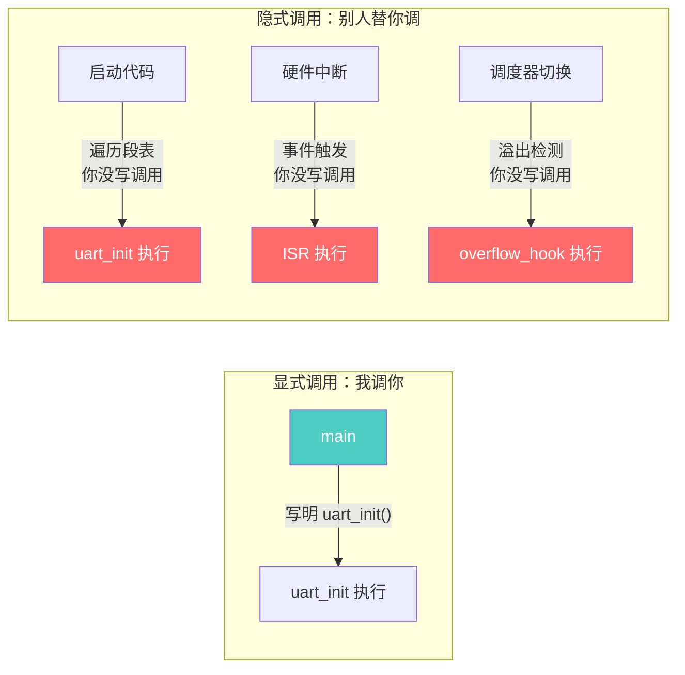

定义层面再收紧一次：

- **显式调用**：源代码中存在一条**明确的调用语句**，且这条语句由**当前执行流**主动发起。
- **隐式调用**：源代码中**找不到对应的调用语句**，函数的执行由一个**外部代理人**（runtime / 框架 / 硬件 / 编译器插入的代码）在特定条件下触发。

---

## 2. 显式调用家族

显式调用是 C 程序员的舒适区——所见即所执行。

### 2.1 最朴素：直接函数调用

```c
int main(void) {
    uart_init(115200);   /* 显式：这一行就是调用点 */
    spi_write(buf, 16);
    return 0;
}
```

编译后的汇编（详见 [[C(编译性语言)的编译过程]]）：

```text
main:
    MOV    R0, #115200      ; 参数
    BL     uart_init        ; ← 这就是显式调用的物理形态：一条 BL 跳转指令
    ...
    BL     spi_write
```

> [!note] 显式调用的物理本质
> 在汇编层，显式调用就是一条 **`BL <地址>`**——地址在编译/链接时已被**写死**。控制流像铁轨一样铺设在 .text 段里，按 PC 顺序一节一节铺过去。详见 [[../函数/函数认知]]。

### 2.2 函数指针的「显式」用法：间接 ≠ 隐式

这是最容易踩的认知雷区。函数指针让跳转地址变成了**变量**，于是很多人把它一股脑归为"隐式"。错了。

```c
/* 用法 A：函数指针，但由「我」亲手调用 —— 仍然是显式 */
int (*op)(int,int) = select_operation();
int result = op(1, 2);          /* ← 我写了 op() 这一句，时机我定 */
```

```text
用法 A 的汇编：
    LDR    R3, =op          ; R3 存的是函数地址（运行时才知）
    LDR    R3, [R3]
    BLX    R3               ; ← 仍然是「我」主动发起的跳转，只是目标在寄存器里
```

区分原则不是"地址写死还是变量"，而是**谁决定执行时机**：

| 形态 | 地址来源 | 时机由谁定 | 归类 |
|------|---------|-----------|------|
| `add()` | 编译期写死 | 我（写了这一句） | 显式 |
| `ptr()` 我自己调 | 运行时变量 | 我（写了这一句） | **显式**（间接调用） |
| 把 `ptr` 注册给框架，框架在事件里调 | 运行时变量 | 框架（事件触发） | **隐式** |

> [!warning] 别把「间接」当「隐式」
> 函数指针是**机制**（地址可变），隐式是**控制权归属**（时机由谁掌控）。同一个函数指针，你 `ptr()` 自己调就是显式，交给 `register_callback(ptr)` 让框架调就变成隐式。**指针没变，权力变了。**

### 2.3 宏调用：编译期展开的「伪显式」

```c
#define LED_ON()   (GPIOA->BSRR = (1U << 5))

int main(void) {
    LED_ON();              /* 看着像函数调用 */
}
```

宏在预处理阶段被**原地展开**，根本不产生 `BL` 指令。它属于显式家族的远亲——调用点是可见的，时机由你掌控，只是"被调体"在编译期就消失、内联进了调用处。这与 [[内联函数]] 同源。

### 2.4 显式调用的调用栈

显式调用的最大红利：**调用栈清晰可读**，调试器一眼看到完整来路。

```text
main()               ← 栈顶往下
  └─ uart_init()     
       └─ gpio_config()
            └─ RCC_CLK_ENABLE()
```

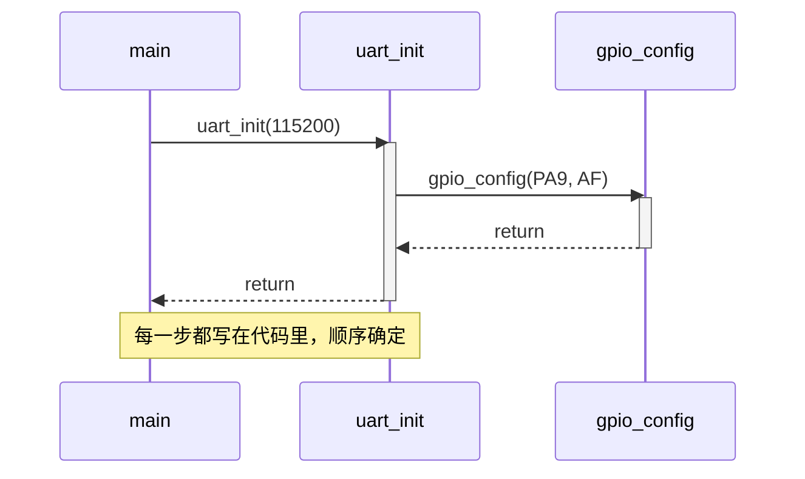

### 2.5 显式调用的特征小结

| 优点 | 代价 |
|------|------|
| 所见即所执行，读 main 就能画出完整调用图 | 新增模块必须改调用处 |
| 顺序确定，没有"突然插进来"的代码 | 调用者必须知道被调者的名字和接口 |
| 调试友好，F10 单步、调用栈清晰 | 初始化顺序要人工编排，易遗漏 |
| 控制流可静态分析 | 几十个模块的 main 会变成一长串清单 |

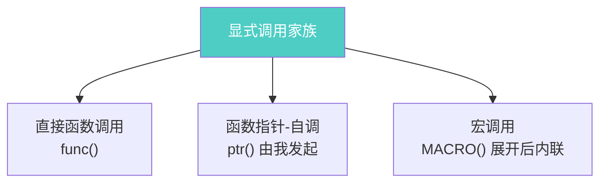

显式调用的代价是**机械**：每加一个模块，`main` 就要长一行；当模块多到几十个、初始化顺序还要精心编排时，这种"全显式"会变成负担——这正是隐式调用登场的契机。

> [!example] 引子：全显式的痛点
> ```c
> /* 一个膨胀的 main —— 每加一个外设就要改这里 */
> int main(void) {
>     clk_init(); gpio_init(); uart_init(); spi_init();
>     i2c_init(); adc_init(); tim_init(); wdt_init();
>     /* ... 30 行后 ... */
>     app_init();
> }
> ```
> 漏掉一行、顺序写错、和别人冲突——这些问题催生了 [[自动初始化机制]]：让模块**自己**注册，启动代码**替你**调用。那一刻，调用权就从你手里转移给了框架。

---

## 3. 隐式调用家族：本目录所有零散主题的统一根

这一节是整篇的脊梁。你会看到，工程目录里那些看似无关的笔记——[[回调函数]]、[[自动初始化机制]]、[[栈溢出检测]]——其实都长在这同一棵树上。区别只在于**"替你调用的那个代理人是谁"**。

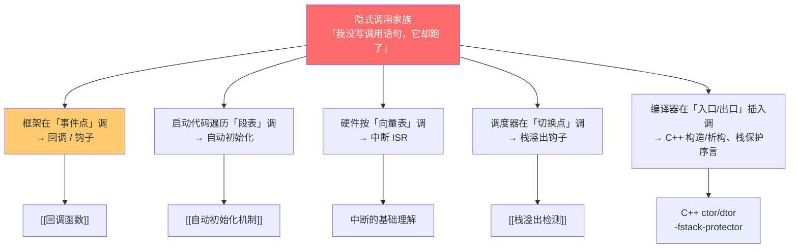

### 3.1 回调 / 钩子：框架在「事件点」替你调

**代理人**：运行时框架（HAL、RTOS、中间件）
**触发条件**：某个事件发生（数据到达、周期到、状态切换）

```c
/* ① 我只写定义，没写调用语句 */
void my_rx_callback(uint8_t *buf, uint16_t len) { /* ... */ }

/* ② 我把函数地址交给框架 */
HAL_UART_RegisterCallback(&huart1, HAL_UART_RX_CB, my_rx_callback);

/* ③ 全文搜不到 my_rx_callback() —— 可它会在串口收到数据时被执行 */
```

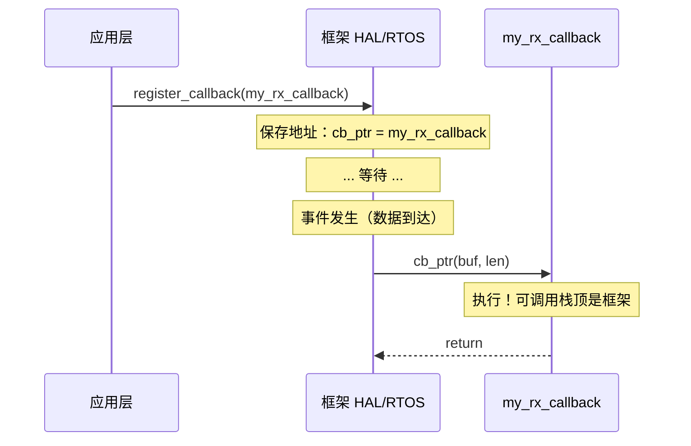

> [!note] 控制反转 IoC（Inversion of Control）
> 平时是你（App）调框架（`rt_thread_sleep()`），控制权在你手里；回调是框架反过来调你，控制权交给了框架。这就是"控制反转"。**回调的本质 = 把函数地址当成"电话号码"留给框架，框架在事件点拨号。**

详细机制（电话号码 / 安检监控类比、三大神钩子、BLX 跳转、铁律避坑）见 [[回调函数]]。

### 3.2 自动初始化：启动代码遍历「段表」替你调

**代理人**：启动代码（startup）+ 链接器
**触发条件**：系统启动，进入 `main` 之前

```c
/* uart.c 里：我只写注册宏，没写调用 */
INIT_BOARD_EXPORT(uart_init);

/* main.c 里：main 是空的！ */
int main(void) {
    /* uart_init 已经在 main 之前被调用了 */
}
```

调用权转移的三个阶段：

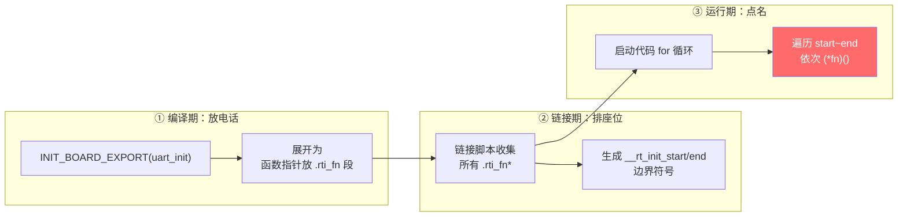

> [!tip] 与回调的微妙区别
> 回调的"调"由**运行时事件**触发（数据到达才调）；自动初始化的"调"由**启动流程**触发（必定调一次，且只在 main 之前）。前者是"条件触发"，后者是"确定触发"——但二者都是**你写的代码里没有调用语句**，所以同属隐式家族。详见 [[自动初始化机制]]。

### 3.3 中断：硬件按「向量表」替你调

**代理人**：MCU 硬件 + NVIC
**触发条件**：外部/内部硬件事件（电平跳变、定时器溢出、DMA 完成）

```c
/* stm32f4xx_it.c：我只写了函数定义，没写调用语句 */
void EXTI0_IRQHandler(void) {
    HAL_GPIO_EXTI_IRQHandler(GPIO_PIN_0);
}

/* 这个函数会在 PA0 出现下降沿的瞬间，被硬件强行调用 */
```

中断是隐式调用中**最硬核**的形态——连软件代理人都省了，直接由 CPU 硬件在事件发生时：

1. **暂停当前 PC**（不管它正在执行什么）；
2. 查**向量表**（一张函数指针数组，链接时填好）；
3. **强制跳转**到对应 ISR 地址。

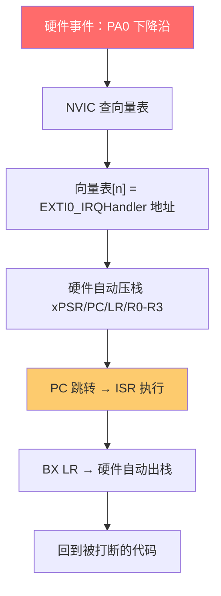

> [!warning] 中断 vs 回调：代理人不同
> 中断的代理人是**硬件**（不可软件禁阻、可打断任何代码、有独立优先级）；回调的代理人是**软件框架**（在普通代码流里跑）。所以中断里能用回调，但回调里千万别乱触发中断式行为。详见 [[../中断/中断的基础理解|中断的基础理解]]、[[../中断/向量表的基础理解|向量表的基础理解]]。

### 3.4 栈溢出钩子：调度器在「切换点」替你调

**代理人**：RTOS 调度器
**触发条件**：每次任务上下文切换时的安全检查

```c
/* FreeRTOS 配置：我只写钩子定义，没写调用语句 */
void vApplicationStackOverflowHook(TaskHandle_t xTask, char *pcTaskName) {
    log_fault("stack overflow in %s", pcTaskName);
    while (1);   /* Fail-Fast */
}

/* 它会在每次任务切换、检测到栈越界时被调度器调用 */
```

这是隐式调用的"安全网"形态：你写好兜底代码，挂在调度器的切换路径上，平时从不执行，一旦栈被踩踏就由调度器替你触发。详见 [[栈溢出检测]] 和 [[../../../嵌入式/操作系统与内核/04_FreeRTOS/任务管理/任务栈与溢出防护|FreeRTOS 任务栈与溢出防护]]。

### 3.5 C++ 构造 / 析构：编译器在「入口出口」插入调

**代理人**：编译器
**触发条件**：对象进入/离开作用域（编译器偷偷插代码）

```cpp
{
    Logger log("scope1");   // ← 进入作用域：编译器在此插入 log.Logger() 调用
    do_work();
}                          // ← 离开作用域：编译器在此插入 log.~Logger() 调用
```

C 程序员最容易被这种"代码里明明只有一句声明，却跑了两段代码"的现象骗到。编译器在对象声明处**插入构造调用**，在作用域结束处**插入析构调用**——源码里看不到调用语句，但 ELF 里白纸黑字。RAII、智能指针、锁守卫全靠这套隐式机制。

> [!note] C 语言里也有类似的"编译器插入调用"
> 开启 `-fstack-protector` 后，编译器会在每个函数**序言**插入 canary 写入调用、在**尾声**插入 canary 检查调用——你没写，但它被编译进去了。这是 C 里少数由编译器代理的隐式调用。详见 [[栈溢出检测]]。

### 3.6 五种隐式调用一字排开

| 形态 | 代理人 | 触发时机 | 谁能打断它 |
|------|--------|---------|-----------|
| 回调 / 钩子 | 软件框架 | 运行时事件 | 普通代码流 |
| 自动初始化 | 启动代码 + 链接器 | main 之前，仅一次 | 不能（启动期） |
| 中断 ISR | 硬件 NVIC | 硬件事件 | **任意**代码流 |
| 栈溢出钩子 | RTOS 调度器 | 每次任务切换 | 调度上下文 |
| 构造/析构、canary | 编译器 | 作用域边界 / 函数出入口 | 编译期固化 |

> [!abstract] 一句话归一
> **隐式调用 = 我提供定义，别人提供调用。** 五种形态的区别只是"别人"的身份不同——框架、启动器、硬件、调度器、编译器。本质都是控制权的让渡。

---

## 4. 控制流视角：谁在调用谁

把显式和隐式放回同一个调用图里看，整张图的"粗细"立刻分明：**显式调用画出确定的主干，隐式调用是四面八方插入的旁支**。

### 4.1 一张完整调用图

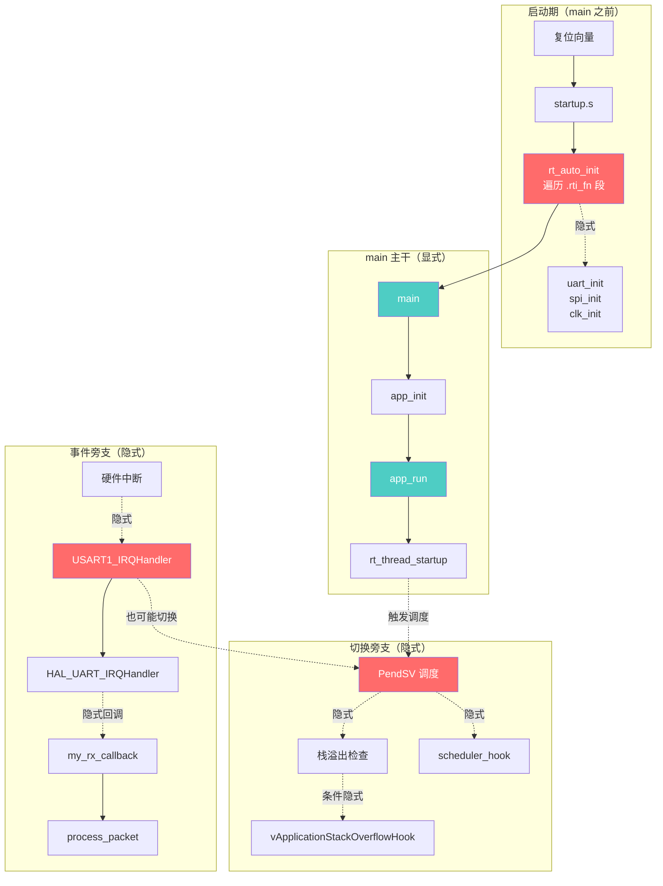

**实线 = 显式**（你写的 `func()`，主干确定）；**虚线 = 隐式**（事件触发，随时插进来）。

### 4.2 三层控制流叠加

嵌入式系统其实同时跑着三层控制流，它们交错但层次分明：

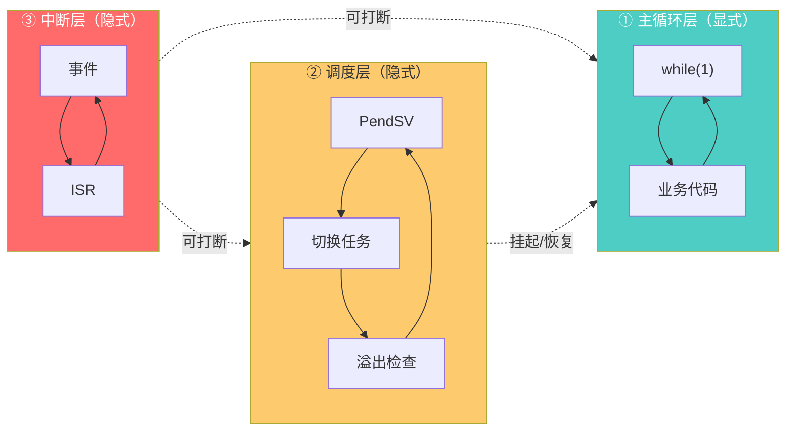

| 层 | 归属 | 谁来调 | 典型代码 |
|----|------|--------|---------|
| ① 主循环层 | 显式 | 你 `while(1)` 里写的 | `process_data()`、`led_toggle()` |
| ② 调度层 | 隐式 | RTOS 调度器 | 任务切换、栈溢出钩子、空闲钩子 |
| ③ 中断层 | 隐式 | 硬件 NVIC | `USART1_IRQHandler`、DMA 完成 ISR |

### 4.3 调用栈里的指纹：识别你身处哪一层

调试时，调用栈顶部的那个函数就是"代理人身份"：

```text
【显式调用栈】
#0  gpio_config()
#1  uart_init()
#2  main()              ← 栈顶就是 main，纯显式主干

【回调隐式调用栈】
#0  my_rx_callback()
#1  HAL_UART_IRQHandler()
#2  USART1_IRQHandler() ← 栈顶是框架/ISR，事件触发

【调度层隐式调用栈】
#0  vApplicationStackOverflowHook()
#1  task_switch_check()
#2  PendSV_Handler()    ← 栈顶是调度器，切换时触发

【自动初始化隐式调用栈】
#0  uart_init()
#1  rt_auto_init()      ← 栈顶是启动器，main 之前触发
#2  reset_handler()
```

> [!tip] 调试直觉
> 看到 `main` 在栈里 → 显式主干；栈顶是 `xxx_IRQHandler` → 中断隐式；栈顶是 `PendSV` 或 `xxx_Switch` → 调度隐式；栈顶是 `auto_init` / `reset_handler` → 启动隐式。**调用栈会告诉你"是谁替你按了回车键"。**

---

## 5. 隐式调用的代价与陷阱

隐式调用换来了**解耦**和**扩展性**，代价是把"看得见的控制流"换成了"看不见的契约"。下面这些坑，每一个都是真实工程里反复踩出的血印。

### 5.1 陷阱清单

| 陷阱 | 表现 | 根因 | 缓解 |
|------|------|------|------|
| **控制流难追** | 读代码看不到谁调它，以为是死代码 | 调用语句不在源码里 | 在被调函数打日志/断点，看调用栈找代理人 |
| **执行顺序隐含依赖** | A 必须在 B 之前注册，否则 B 找不到 A | 注册顺序 ≠ 源码顺序 | 用优先级宏（`INIT_BOARD_EXPORT`）显式编排 |
| **重入与竞态** | 回调被事件反复触发，访问共享数据撕裂 | 隐式调用时机不可控 | 加锁 / 关中断 / 状态机化 |
| **中断上下文误用** | 在钩子里调用 `rt_thread_delay()` → 死锁 | 钩子跑在调度锁/中断上下文 | 钩子里只做无阻塞操作 |
| **调试器"变量消失"** | 编译器插入的调用把变量优化掉 | `-O2` + 内联 + canary 插桩 | 调试用 `-O0`，关闭 stack-protector |
| **构造/析构静默执行** | 对象创建就跑了重逻辑，以为是声明 | C++ ctor 隐式调用 | 用 `explicit`、避免重 ctor |
| **空指针/未注册崩溃** | 框架调 `cb_ptr()` 但 `cb_ptr==NULL` | 忘记注册或注册失败 | 框架侧判空；启动时 sanity check |
| **死代码误删** | "没人调用"被 `-ffunction-sections --gc-sections` 删掉 | 隐式调用源码看不到 | `__attribute__((used))`、链接脚本 `KEEP()` |

### 5.2 重入陷阱：隐式调用最隐蔽的杀手

显式调用的时机**你定**，所以你心里有数；隐式调用的时机**事件定**，事件可以**在你执行到一半时插进来**。

```c
/* 共享变量，主循环在用，中断也在改 */
volatile uint32_t g_counter;

void main_loop(void) {
    while (1) {
        uint32_t a = g_counter;        /* 读高 16 位时被打断 */
        uint32_t b = g_counter;        /* 读低 16 位时已经变了 */
        use(a, b);                      /* 拼出来的是错值 */
    }
}

/* 中断隐式调用：随时可能插进来 */
void TIM2_IRQHandler(void) {
    g_counter++;                        /* 32 位自增在 M0 上不是原子操作 */
}
```

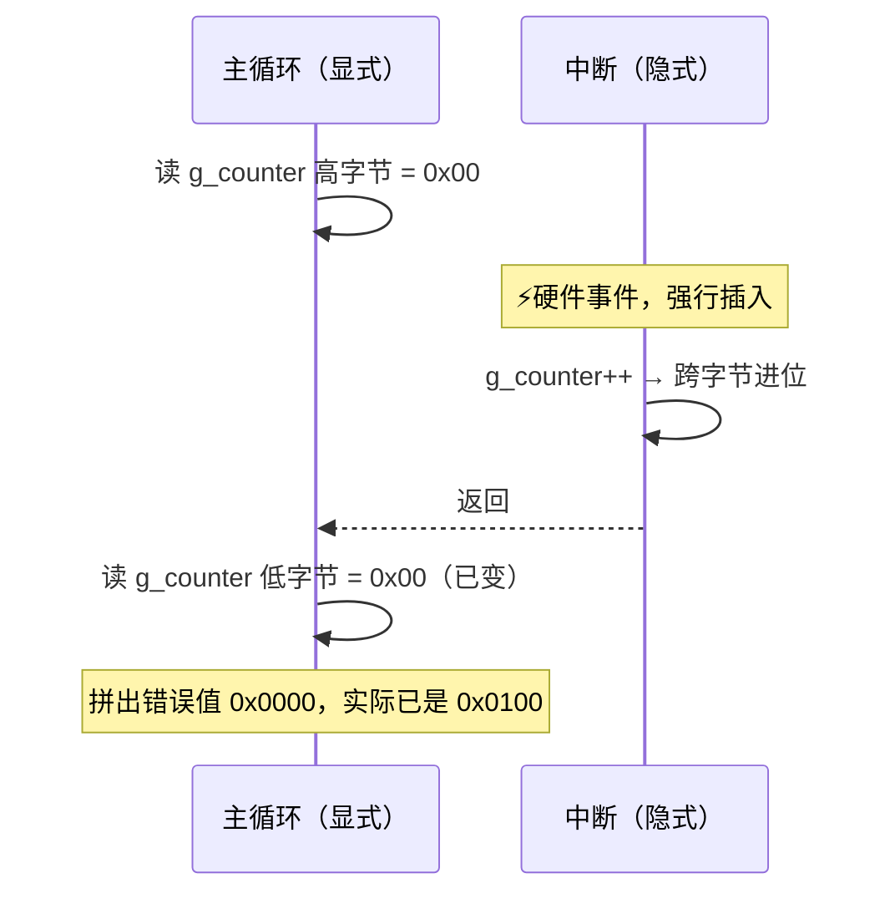

> [!warning] 隐式调用 = 时机不可控
> 任何被事件触发的隐式调用都可能打断显式主干。共享变量的读写必须当作临界区保护（关中断 / `__atomic` / 双缓冲）。这条铁律详见 [[../../../嵌入式/中断/中断实战与踩坑|中断实战与踩坑]]。

### 5.3 顺序依赖陷阱：注册时机的暗坑

```c
/* 场景：app 模块想在初始化时用串口打印 */
INIT_APP_EXPORT(app_init);     /* 级别 6 */

void app_init(void) {
    rt_kprintf("app start\n"); /* 崩溃！uart 还没初始化 */
}

INIT_BOARD_EXPORT(uart_init);  /* 级别 1，本应先跑 */
```

显式世界里，`uart_init()` 写在 `app_init()` 前面就行；隐式世界里，**执行顺序由"级别"决定**，级别写错就踩雷。这是 [[自动初始化机制]] 必须搞清楚优先级宏的根本原因。

### 5.4 上下文陷阱：钩子跑在什么上下文？

```text
不同代理人，钩子跑在不同上下文：

回调（数据到达）      → 普通任务上下文，可阻塞
调度器钩子（切换）    → 调度器已锁，禁止阻塞、禁止 take 信号量
栈溢出钩子（切换）    → 调度上下文，且内存已污染，最好只做 halt + 记录
中断回调（ISR 内）    → 中断上下文，禁止任何阻塞 API
空闲钩子（idle）      → 空闲任务上下文，可调 vTaskDelete 但不能阻塞空闲
```

> [!important] 铁律
> **隐式调用的第一问永远是："我现在跑在什么上下文？"** 答案决定了你能调什么 API。这条问错了，系统死锁/崩溃只是时间问题。

---

## 6. 工程直觉：何时用隐式，何时回归显式

隐式不是"高级"，显式也不是"原始"——它们各有适用场域。成熟的工程师知道何时**让渡控制权**，何时**夺回控制权**。

### 6.1 选择决策树

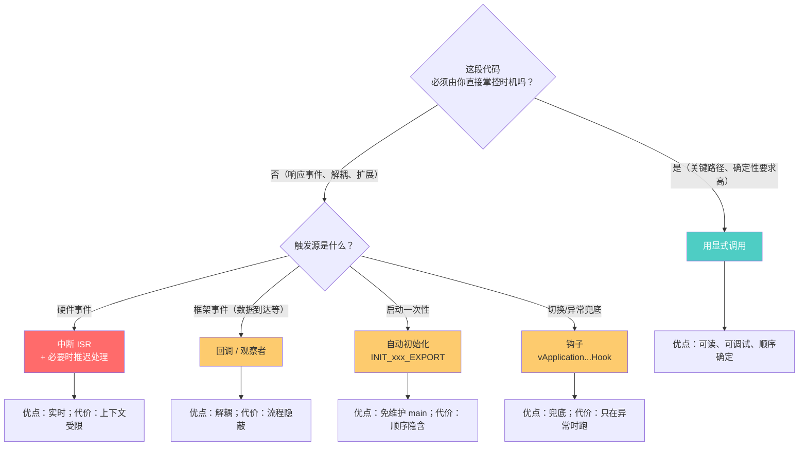

### 6.2 适用场域对照

| 场景 | 推荐 | 理由 |
|------|------|------|
| 业务主循环、算法流程 | 显式 | 顺序确定，性能/逻辑可追踪 |
| 关键实时控制（电机 PID） | 显式 + 中断触发 | 周期严格，不能由事件随意插 |
| 驱动数据接收处理 | 回调 | 解耦：驱动不知道上层要怎么处理 |
| 外设初始化 | 自动初始化 | 避免 main 膨胀，模块自治 |
| 异常兜底（栈溢出、OOM、HardFault） | 钩子 | 唯一能在系统崩盘前留遗言的地方 |
| 跨模块通信 | 回调 / 消息队列 | 解耦，避免循环依赖 |
| 启动顺序强依赖（A 必须先于 B） | 显式 或 优先级宏 | 不能让隐式随机排序 |
| 性能敏感小函数 | 内联显式 | 消除调用开销，详见 [[内联函数]] |
| 内存/资源生命周期管理 | RAII（C++）或显式 init/deinit | 隐式构造析构在 C 里没有，C 必须显式 |

### 6.3 让渡 vs 夺回：两条原则

```text
让渡控制权的三个信号：
  ① 多个模块都要插入同一种行为 → 用回调/钩子统一接入
  ② main 被初始化代码淹没 → 用自动初始化
  ③ 时机不由你定（外部事件驱动） → 用中断/回调

夺回控制权的三个信号：
  ① 调试时调用栈全是框架、找不到业务逻辑 → 把关键路径改回显式
  ② 隐式触发的顺序导致偶发 bug → 用显式顺序或优先级宏固化
  ③ 性能/确定性要求高 → 中断只做"标记"，主循环显式处理
```

> [!tip] 经典平衡：中断 + 主循环
> 这是嵌入式最常见的解法——**中断（隐式）只把"事件发生了"记到一个 flag/队列里，真正的处理放回主循环（显式）**。这样既拿到硬件的实时性，又保留主循环的可读与可控。
>
> ```c
> volatile uint8_t flag_rx = 0;     /* 中断置位 */
> void USART1_IRQHandler(void) { flag_rx = 1; }   /* 隐式，只标记 */
> int main(void) {
>     while (1) {
>         if (flag_rx) { flag_rx = 0; handle_rx(); }  /* 显式，可控处理 */
>     }
> }
> ```

### 6.4 一个反面教材：过度隐式

```c
/* ❌ 反例：把所有东西都塞进钩子，主循环空空如也 */
void vApplicationIdleHook(void) {        /* 空闲钩子 */
    sensor_read();                        /* ← 采样塞这里？ */
    pid_compute();                        /* ← 控制塞这里？ */
    lcd_refresh();                        /* ← 显示塞这里？ */
}

int main(void) { while (1); }            /* 主循环啥也不干 */
```

问题：① 三个任务的时序耦合在"空闲"这个不确定事件上；② 一旦某个任务卡住，idle 被饿死，全部停摆；③ 调试时根本看不出谁先跑。**正确做法是显式状态机或 RTOS 任务划分**，把控制权夺回来。

---

## 7. 一页总结

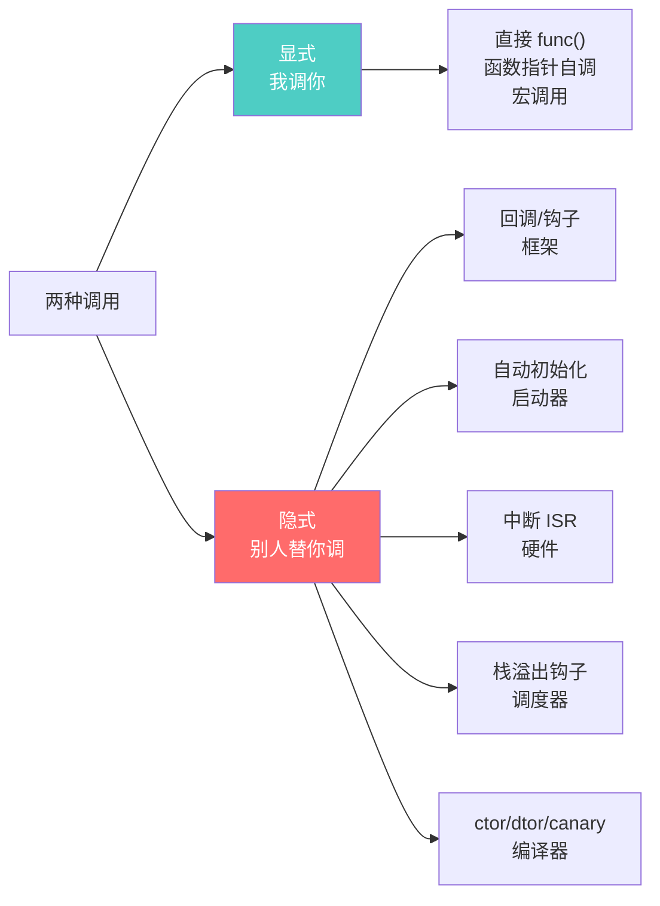

> [!abstract] 三句话记住全文
> **① 分水岭只有一个字——谁：** 你写的 `func()` 是显式，源码里找不到调用语句却跑了的是隐式。
>
> **② 隐式的本质是控制权让渡：** 我提供定义，别人（框架/启动器/硬件/调度器/编译器）提供调用。本目录的回调、自动初始化、栈溢出钩子，全是这棵树上的分支。
>
> **③ 隐式换解耦，显式换可控：** 看到调试栈里全是框架、顺序出现偶发 bug，就是把控制权夺回显式的信号。经典平衡是"中断只标记，主循环显式处理"。

### 速查口诀

```text
两问定位法：
  ① 这段代码，源码里有调用语句吗？
       有   → 显式
       没有 → 隐式
  ② 隐式的话，谁是代理人？
       框架   → 回调 / 钩子
       启动器 → 自动初始化
       硬件   → 中断 ISR
       调度器 → 栈溢出 / 切换钩子
       编译器 → ctor/dtor / canary

隐式铁律三问：
  ① 我跑在什么上下文？（任务/调度/中断/启动）
  ② 我能调哪些 API？（阻塞？锁？）
  ③ 我执行的时机，会和我读写的共享数据冲突吗？
```

### 调用栈指纹速查

| 栈顶函数特征 | 归属 | 代理人 |
|-------------|------|--------|
| `main` / 业务函数 | 显式 | 你自己 |
| `xxx_IRQHandler` | 隐式 | 硬件 NVIC |
| `PendSV_Handler` / `xxx_Switch` | 隐式 | 调度器 |
| `rt_auto_init` / `reset_handler` | 隐式 | 启动代码 |
| `HAL_xxx_IRQHandler` / `xxx_cb` | 隐式 | 框架 |

---

## 继续阅读

本篇是「工程」目录的纲领，下面这些笔记都是隐式调用家族的具体形态，可以顺着读：

- [[回调函数]] —— 隐式调用最经典的形态：框架在事件点替你拨电话
- [[自动初始化机制]] —— 启动代码遍历段表，让模块自注册、main 免维护
- [[栈溢出检测]] —— 调度器在切换点替你检查边界、必要时触发钩子
- [[内联函数]] —— 显式调用的"消失版"：调用语句在，被调体编译期融入
- [[../函数/函数认知]] —— 函数调用的物理本质：`BL` 跳转 + 栈帧，理解显式调用的根基
- [[C(编译性语言)的编译过程]] —— 看懂编译器如何"插代码"（canary、内联、段收集）
- [[C语言的继承和多态]] —— 函数指针表（虚表）如何让"同一个接口、不同实现"成为可能

跨目录关联：

- [[../../../嵌入式/中断/中断的基础理解|中断的基础理解]] —— 硬件代理的隐式调用机制
- [[../../../嵌入式/中断/向量表的基础理解|向量表的基础理解]] —— 中断的"函数指针数组"
- [[../../../嵌入式/中断/中断实战与踩坑|中断实战与踩坑]] —— 隐式调用的重入与竞态陷阱
- [[../../../嵌入式/操作系统与内核/04_FreeRTOS/任务管理/任务栈与溢出防护|FreeRTOS 任务栈与溢出防护]] —— 栈溢出钩子的 RTOS 实战
- [[../函数/Voliate函数]] —— 共享变量与隐式打断的对抗工具

---

## 8. 面试高频问题

> [!example]- Q1：什么是显式调用和隐式调用？怎么区分？
> **显式调用**：源码里有明确的调用语句（如 `func()`），由当前执行流主动发起，时机由调用者掌控。**隐式调用**：源码里找不到调用语句，函数由框架/硬件/编译器等"代理人"在特定事件下触发执行。区分原则不是"地址是否写死"，而是**谁掌控调用时机**：你掌控 = 显式，代理人掌控 = 隐式。注意函数指针自己调（`ptr()`）仍然是显式——只是间接；把指针注册给框架让框架调才变成隐式。

> [!example]- Q2：举出嵌入式里五种隐式调用的例子，并说明各自的"代理人"。
> ① **回调/钩子**——代理人：软件框架（如 HAL 的 `HAL_UART_RxCb`）；② **自动初始化**——代理人：启动代码 + 链接器（如 `INIT_BOARD_EXPORT`，main 之前跑）；③ **中断 ISR**——代理人：硬件 NVIC（按向量表跳转）；④ **栈溢出钩子**——代理人：RTOS 调度器（每次切换时检查）；⑤ **C++ 构造/析构 + `-fstack-protector` canary**——代理人：编译器（在作用域边界/函数出入口插桩）。

> [!example]- Q3：函数指针到底是显式还是隐式？
> 看调用权归属，不看地址是否写死。**你自己写 `ptr()` 调它 → 显式**（间接调用，汇编是 `BLX R3`，时机你定）。**你把指针 `register_callback(ptr)` 交给框架，框架在事件里调它 → 隐式**（控制权让渡给框架）。同一个函数指针，使用方式不同，归属不同。

> [!example]- Q4：为什么说回调体现了"控制反转 IoC"？
> 正常逻辑是你（App）主动调框架 API（如 `rt_thread_sleep()`），控制权在你手里。回调是框架在事件发生时**反过来调你**写的函数，控制权转移给了框架。本质是你把"电话号码"（函数地址）留给框架，框架在合适的时机"拨号"。这种"好莱坞原则——别打电话给我们，我们会打给你"就是 IoC。

> [!example]- Q5：自动初始化机制和回调有什么区别？都属于隐式调用吗？
> 都属于。区别在触发时机和确定性：**回调由运行时事件触发**（数据到达才调，条件触发，可能永不触发）；**自动初始化由启动流程触发**（main 之前必定调一次，确定触发）。底层都靠"函数指针 + 外部代理遍历调用"，但代理人和时机不同。

> [!example]- Q6：隐式调用的最大陷阱是什么？怎么避免？
> **时机不可控导致重入与竞态**。隐式调用随时可能打断显式主干，如果共享变量的读写不是原子的，就会出现数据撕裂。避免方法：① 共享变量加 `volatile`；② 读写当临界区，关中断保护；③ 用双缓冲/无锁队列；④ 中断里只置 flag、主循环显式处理（经典平衡）。第二个陷阱是**上下文误用**——在钩子里调阻塞 API 会死锁，所以隐式调用的第一问永远是"我现在跑在什么上下文"。

> [!example]- Q7：什么时候该用隐式，什么时候该回归显式？
> **让渡控制权（用隐式）的信号**：① 多个模块都要插入同一种行为（用回调统一接入）；② main 被初始化代码淹没（用自动初始化）；③ 时机由外部事件决定（用中断/回调）。**夺回控制权（回归显式）的信号**：① 调试时调用栈全是框架、业务逻辑看不清；② 隐式触发的顺序导致偶发 bug；③ 性能/确定性要求高。经典平衡是"中断只标记，主循环显式处理"——既拿硬件实时性，又保留主循环的可读可控。

> [!example]- Q8：调试时怎么快速判断一段代码是被显式还是隐式调用的？
> 看调用栈顶部的"代理人身份"：① 栈顶是 `main` / 业务函数 → 显式主干；② 栈顶是 `xxx_IRQHandler` → 中断隐式（硬件代理）；③ 栈顶是 `PendSV_Handler` / `xxx_Switch` → 调度器隐式；④ 栈顶是 `rt_auto_init` / `reset_handler` → 启动隐式；⑤ 栈顶是 `HAL_xxx_IRQHandler` / 框架回调分发器 → 框架隐式。调用栈会告诉你"是谁替你按了回车键"。另外可以在被怀疑的函数里打日志或下断点，看它何时被触发。
