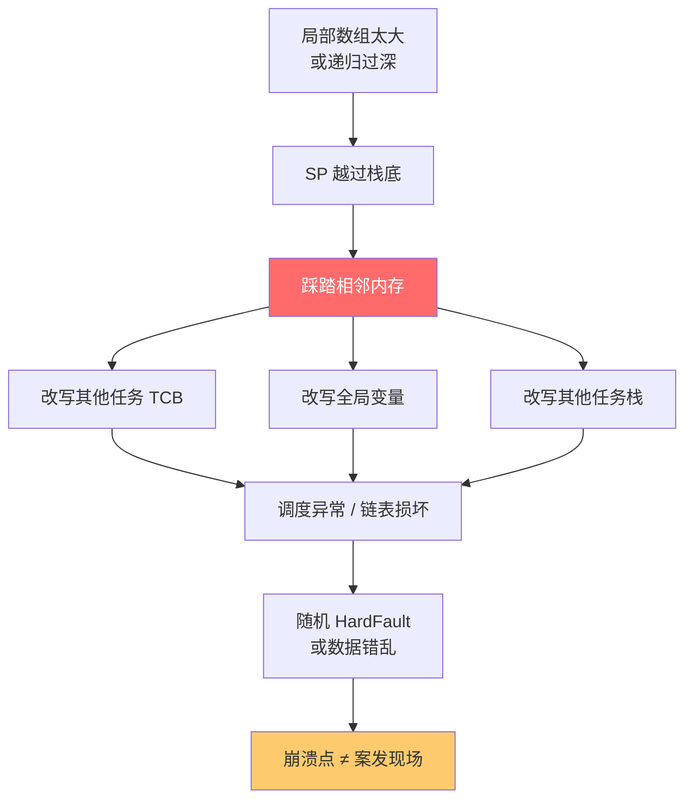
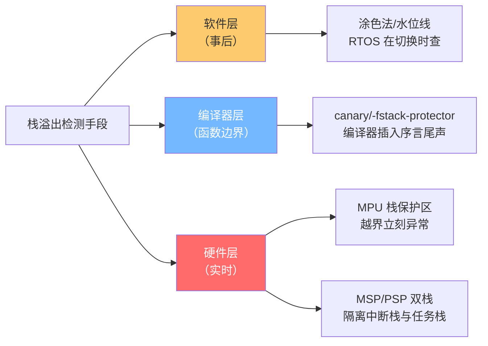
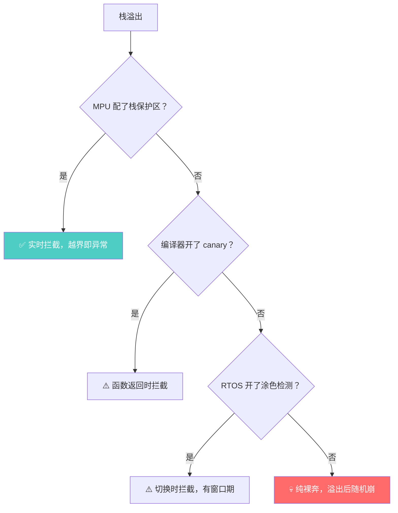
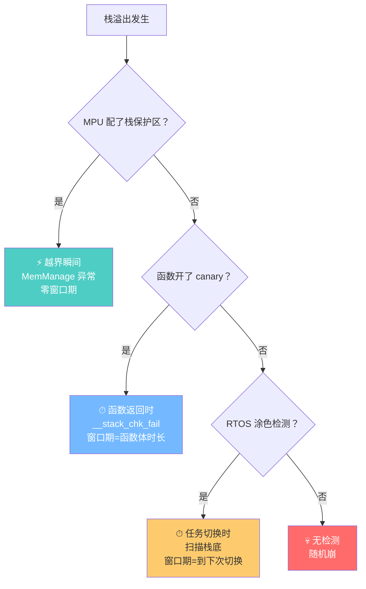
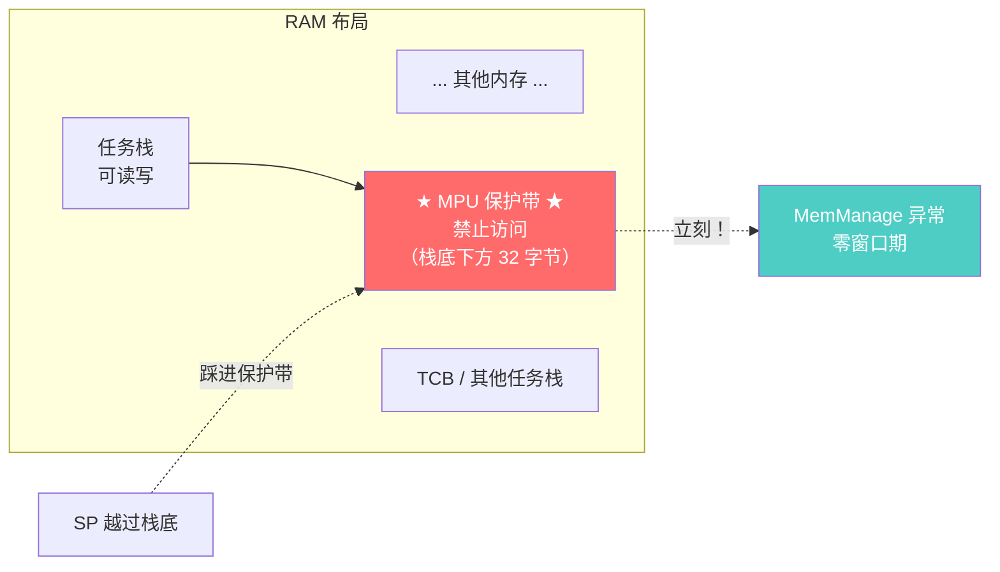
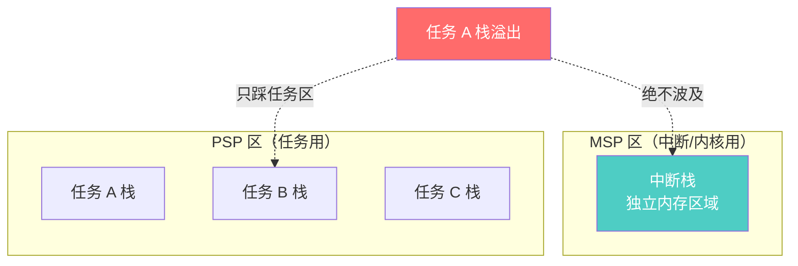
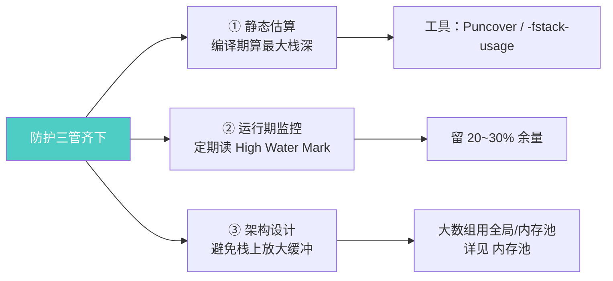
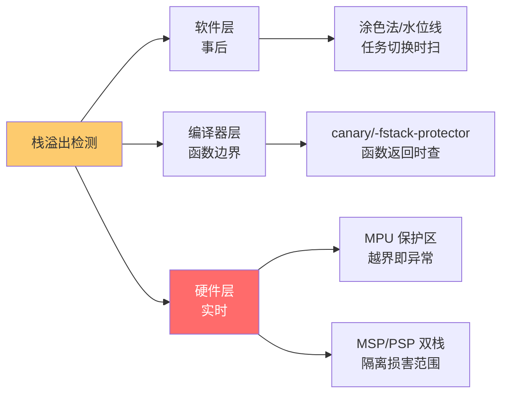

# 栈溢出检测

> [!abstract] 核心本质
> 栈溢出是嵌入式系统最隐蔽的崩溃源——**案发现场不等于崩溃点**：栈指针越界的瞬间往往不报错，等相邻内存被踩踏后才在毫不相干的地方爆发 HardFault。检测的本质只有一句话：**在栈边界埋下标记，定期（任务切换时）或实时（硬件）检查标记是否被破坏**。工业界三大手段——软件涂色法、canary 金丝雀、硬件 MPU 保护——再加编译器 `-fstack-protector`，分别从不同时机、不同层级拦截。

阅读 RTOS 源码时，那段把栈填满 `#` 的代码就是栈溢出检测的"涂色法"原型：

```c
// 用字符 '#' (ASCII 码 0x23) 填满整个栈空间。
// 这是嵌入式里经典的"水位线"检查法，用于后续测算栈的最高使用率和溢出检测。
rt_memset(thread->stack_addr, '#', thread->stack_size);
```

这一行朴素到不像"机制"，但它和它背后的整条检测链，是 RTOS 区分"业余 demo"和"工业级内核"的分水岭。本篇抽离出**跨 RTOS、跨裸机通用的检测原理**；FreeRTOS 的具体两种 Method 实战，见 [[../../../嵌入式/操作系统与内核/04_FreeRTOS/任务管理/任务栈与溢出防护|FreeRTOS 任务栈与溢出防护]]。

---

## 1. 为什么栈溢出是"隐形杀手"

### 1.1 栈的生长与边界

每个任务在 RAM 里圈一块私有领地（比如 1024 字节）作 Stack。函数调用、局部变量、中断压栈都会让 SP 往低地址走。**栈是向下生长的**——一旦超过栈底边界，就会踩踏相邻内存。

```text
RAM 高地址 ──────────────────────────────── 0x20001000
                ┌────────────────────┐
                │  其他全局变量 A     │
                └────────────────────┘
                ┌────────────────────┐ ← 栈底边界（合法最低地址）
                │                    │
                │   任务 1 的栈       │ ← SP 向下走
                │   1024 字节         │
                │                    │
                ┌────────────────────┐ ← 栈顶（初始 SP）
                │   任务 2 的栈       │
                └────────────────────┘
RAM 低地址 ──────────────────────────────── 0x20000000

正常：SP 在栈底~栈顶之间移动
溢出：SP 越过栈底 → 踩到全局变量 A！
```

### 1.2 踩踏的连锁反应



### 1.3 为什么崩溃点不是案发现场

```text
时间线：
  t0: 函数 A 调用，定义 int buf[600];  → SP 向下走，越过栈底
  t1: buf 写入，悄悄改写了邻居 TCB 的 next 指针   ← 真正的"案发"
  t2: 函数 A 返回，SP 回正，看似没事
  t3: ... 系统继续跑 ...
  t4: 调度器遍历任务链表，读到被改坏的 next → 指向野地址
  t5: HardFault！栈帧显示崩溃在 rt_schedule   ← 你看到的"崩溃点"

定位成本：t5 崩溃，案发在 t1，中间隔了无数步 → 极难排查
```

> [!warning] 栈溢出的隐蔽性
> 栈溢出**不会立刻报错**——CPU 不知道 SP 越界了，照常写内存。等到被踩踏的内存被读出来用时，才在毫不相干的地方爆发。这就是为什么老兵看到"随机 HardFault"、"全局变量莫名其妙被改"、"调度异常"，**第一怀疑就是栈溢出**：把 Stack Size 加大一倍试试。栈帧与上下文的底层机制见 [[../../../嵌入式/中断/栈与上下文|栈与上下文]]。

---

## 2. 四类检测法：一张表看全局

业界拦截栈溢出，从"什么时候查"和"谁来查"两个维度，演化出四类手段：

| 方法 | 检测时机 | 实现者 | 开销 | 能否精确定位 | 实时性 |
|------|---------|--------|------|-------------|--------|
| **软件涂色法**（水位线） | 任务切换时 | RTOS 调度器 | 低（仅启动填一次 + 切换时扫几个字节） | 算历史最深处 | 事后（切换时才发现） |
| **Canary 金丝雀** | 函数序言/尾声 | 编译器（`-fstack-protector`） | 中（每函数加几条指令） | 哪个函数溢出 | 函数返回时才发现 |
| **硬件 MPU 保护** | 越界瞬间 | CPU 硬件 + MPU | 中（配 MPU region） | 精确（立刻触发异常） | **实时** |
| **MSP/PSP 双栈隔离** | 始终 | CPU 硬件 + 启动代码 | 低 | 限定损害范围 | 实时隔离 |



### 2.1 事后检测 vs 实时检测

```text
事后检测（涂色法、canary）：
  溢出已经发生 → 内存已污染 → 在下一个检查点才发现
  优点：实现简单、开销小
  缺点：有"窗口期"——溢出到发现之间可能继续作恶

实时检测（MPU）：
  SP 越界瞬间 → 硬件立刻触发 MemManage 异常
  优点：零窗口期、精确定位
  缺点：需要 MPU 硬件、配置复杂、每个任务都要配 region
```

> [!tip] 工业级组合
> 实际工程不是二选一，而是**组合**：调试期用涂色法量水位（决定栈该开多大）+ canary 抓函数级溢出；量产期用 MPU 实时保护 + MSP/PSP 双栈隔离损害范围。四者各管一段，才是完整防御。

### 2.2 为什么需要这么多层



> [!note] 这四类只是"检测"，不是"防护"
> 检测到溢出时，内存**已经**被踩了。真正的防护是**预留够大的栈 + 静态分析估算 + 运行期水位监控**三管齐下。检测是最后一道警报，不能替代正确估算。详见 [[../../../嵌入式/操作系统与内核/04_FreeRTOS/任务管理/任务栈与溢出防护|FreeRTOS 任务栈与溢出防护]]。

---

## 3. 软件涂色法（水位线）

最朴素也最经典的方法。RT-Thread、FreeRTOS 都用它做基础检测。

### 3.1 三步原理


### 3.2 启动填色

```c
/* 任务创建时，把整个栈空间填满约定字节 */
#define STACK_MAGIC  '#'      /* RT-Thread 用 '#' */
#define STACK_MAGIC2 0xA5     /* FreeRTOS 用 0xA5 */

/* 这就是开篇那行朴素代码的真身 */
rt_memset(thread->stack_addr, STACK_MAGIC, thread->stack_size);
```

填完后的内存形态：

```text
任务栈（1024 字节），栈向下生长：

高地址（栈顶） ┌────────────────────┐
               │  初始 SP 在这里      │
               ├────────────────────┤
               │  ################   │
               │  ################   │  ← 全部填成 '#'
               │  ################   │
               │  ################   │
低地址（栈底） ├────────────────────┤
               │  TCB / 全局变量     │  ← 邻居
               └────────────────────┘
```

### 3.3 运行后扫描：High Water Mark

系统跑一段时间，SP 向下走过又回。被 SP 走过的字节被局部变量/返回地址覆盖，**没被覆盖的还是 '#'**。

```text
运行后扫描（从栈底往上数，找到第一个不是 '#' 的位置）：

高地址 ┌────────────────────┐
       │  返回地址 0x08..    │  ← 不是 '#'，历史最深处
       ├────────────────────┤  ← High Water Mark（历史水位线）
       │  AB CD EF 12 ...   │  ← 被覆盖区（SP 走到过这里）
       │  34 56 78 9A ...   │
       ├────────────────────┤
       │  ################  │  ← SP 没走到，仍是 '#'
       │  ################  │
低地址 ├────────────────────┤
       │  TCB / 全局变量     │
       └────────────────────┘

历史最深处 = 栈底 + N 字节没被动过
已用 = 总大小 - N
剩余 = N（这就是 uxTaskGetStackHighWaterMark() 的返回值）
```

### 3.4 涂色法的两种用法

```text
用法 A：纯溢出检测（查边界几个字节）
  ─ 启动填色
  ─ 切换时只检查栈底 16 字节是否还是 '#'
  ─ 不是 → 溢出了！调 overflow_hook
  优点：扫描极快（只看 16 字节）
  缺点：只知道"溢出了"，不知道"用了多少"

用法 B：水位监控（全栈扫描）
  ─ 启动填色
  ─ 需要时从栈底往上扫，找到第一个非 '#'
  ─ 得到历史最大用量
  优点：指导栈该开多大
  缺点：扫描较慢（要遍历全栈）
```

> [!tip] 涂色法的窗口期
> 涂色法只在**任务切换时**检查。如果任务 A 溢出后立刻触发 HardFault（栈帧已坏），切换检查根本来不及执行。所以涂色法是"**事后兜底**"，捕获的是"溢出了但没立刻崩"的慢性问题。

> [!warning] 涂色法的盲区
> 涂色法只看**历史最深处**，不能捕获"瞬时刺穿"——某次调用瞬间 SP 远超栈底，但函数立刻返回 SP 回正，栈底附近依然全是 '#'。这种一闪而过的刺穿涂色法抓不到，要靠 canary 或 MPU。FreeRTOS Method 1 vs Method 2 的具体取舍见 [[../../../嵌入式/操作系统与内核/04_FreeRTOS/任务管理/任务栈与溢出防护|FreeRTOS 任务栈与溢出防护]]。

---

## 4. Canary 金丝雀机制

canary（金丝雀）取自矿工带金丝雀下井测毒气的典故——在危险区放一个"哨兵"，它先死说明有毒。

### 4.1 核心思想：在栈帧里埋哨兵

```text
函数 my_func 的栈帧：

高地址 ┌────────────────────┐
       │  返回地址 LR        │  ← 被踩就劫持控制流
       ├────────────────────┤
       │  ★ canary 值 ★     │  ← 哨兵！序言写入、尾声检查
       ├────────────────────┤
       │  局部变量 buf[100]  │  ← 如果 buf 写越界
       ├────────────────────┤
       │  其他局部变量       │
低地址 └────────────────────┘

越界路径：buf[100] 写过界 → 先踩 canary → 才能踩到 LR
所以检查 canary 是否被改 = 检测栈帧是否被溢出
```

### 4.2 编译器自动插入的序言与尾声

开启 `-fstack-protector` 后，编译器在每个函数的入口/出口**偷偷插入代码**（这正是 [[显示调用和隐式调用]] 里"编译器代理的隐式调用"）：

```c
/* 你写的源码 */
void my_func(void) {
    char buf[100];
    gets(buf);              /* 危险：可能写越界 */
}
```

```text
编译器实际生成的逻辑（伪代码）：

my_func:
    序言：
        读取全局 canary 值 __stack_chk_guard
        把它压入栈帧（埋哨兵）
    
    函数体：
        gets(buf)           ← 如果越界，先踩哨兵
    
    尾声：
        读取栈帧里的哨兵值
        与全局 __stack_chk_guard 比较
        不一致 → 调 __stack_chk_fail()  ← 触发崩溃/日志
        一致   → 正常返回
```

### 4.3 三种 canary 变体

| 选项 | 保护范围 | 性能开销 | 适用 |
|------|---------|---------|------|
| `-fstack-protector` | 仅含字符数组 `>=8` 字节的函数 | 低 | 经典，Linux 默认 |
| `-fstack-protector-strong` | 扩大到更多带数组的函数 | 中 | 现代 Linux 默认 |
| `-fstack-protector-all` | **所有**函数 | 高 | 高安全要求 |
| `-fstack-protector-explicit` | 仅标了 `__attribute__((stack_protect))` 的 | 极低 | 精准点选 |

### 4.4 canary vs 涂色法

| 维度 | 涂色法 | Canary |
|------|--------|--------|
| 实现者 | RTOS（运行时） | 编译器（编译期插桩） |
| 检查时机 | 任务切换 | 函数返回 |
| 粒度 | 任务级（整个栈） | 函数级（每个栈帧） |
| 能否定位溢出函数 | 不能 | **能**（`__stack_chk_fail` 调用栈） |
| 捕获瞬时刺穿 | 不能 | **能**（栈帧内哨兵被踩） |
| 需要运行时支持 | 需要（调度器配合） | 不需要（编译器自洽） |
| 代价 | 切换时扫描开销 | 每函数多几条指令 + 一个字栈 |

> [!note] 二者互补
> 涂色法管"任务栈整体用量"，canary 管"单个函数的栈帧越界"。成熟项目两者都开：canary 抓函数级溢出（尤其 `gets`/`memcpy` 越界），涂色法监控任务级水位。

---

## 5. 何时检测：时机决定一切

把前四节的"手段"和"时机"对齐，就看清整张防御网。



### 5.1 四种时机的对照

| 时机 | 代理人 | 检测手段 | 窗口期 | 精度 |
|------|--------|---------|--------|------|
| 越界瞬间 | CPU 硬件 | MPU region | 零 | 精确到字节 |
| 函数返回 | 编译器插桩 | canary | 一个函数体 | 精确到函数 |
| 任务切换 | RTOS 调度器 | 涂色法 | 到下次切换 | 精确到任务 |
| 无检测 | — | — | 永久（直到崩） | 无 |

> [!important] 窗口期 = 危险期
> 窗口期内，被踩踏的内存可能已经被读用，污染已扩散。**实时性要求高的系统（电机、医疗、车规）必须用 MPU 把窗口期压到零**；普通消费电子用涂色法 + canary 已足够。

### 5.2 Fail-Fast 哲学：检测到了怎么办

```text
检测到溢出后，两种哲学：

哲学 A：Fail-Fast（立刻停机）
  → while(1); 死循环 halt
  → 或触发软复位
  理由：内存已污染，继续跑可能让电机失控、写错 Flash
  RT-Thread / FreeRTOS 默认走这条

哲学 B：记录 + 继续
  → 打日志、翻转 LED
  → 不停机
  风险：污染数据可能让"记录"本身也出错
  仅用于调试期观察
```

> [!tip] RT-Thread 的冷酷死循环
> 读 RT-Thread 源码，栈溢出检测后是 `while (dummy) ;` 死循环——冷酷无情。理由是：一旦栈溢出，内存就被污染了，让系统继续运行可能导致电机失控、数据写入错误的 Flash 扇区。**系统级软件的铁律：一旦发现不可挽回的内存破坏，立即拔掉呼吸机（Halt 系统）。** 这也是它属于 [[显示调用和隐式调用]] 中"调度器替你调钩子"的隐式家族。

---

## 6. 硬件层保护：MPU 与双栈隔离

软件层再精巧，也逃不出"事后检测"的窠臼。真正零窗口期的拦截，必须靠硬件。

### 6.1 MPU 栈保护区：越界即异常

MPU（Memory Protection Unit）给一块内存区域设访问权限。把任务栈底下方一小段配成"禁止访问"，SP 一旦越过栈底，CPU **立刻**触发 MemManage 异常——零窗口期、精确到字节。



配置要点（伪代码）：

```c
/* 每个任务创建时，在其栈底下方配一个 MPU region */
MPU_Region_Config region = {
    .base   = task_stack_bottom - 32,   /* 栈底往下留 32 字节 */
    .size   = 32,
    .perm   = NO_ACCESS,                /* 任何访问都触发异常 */
    .enable = 1,
};
MPU_Configure(region);

/* MemManage_Handler：实时捕获栈溢出 */
void MemManage_Handler(void) {
    log_fault("Stack overflow in task %s", current_task->name);
    fail_fast();   /* halt 或复位 */
}
```

### 6.2 MPU 保护的代价

| 优点 | 代价 |
|------|------|
| 零窗口期、实时 | 需要芯片有 MPU（M0/M0+ 没有，M3/M4/M7 有） |
| 精确到字节 | 每个任务都要配一个 region（region 数量有限，通常 8/16 个） |
| 越界即异常，无需轮询 | region 配置与对齐有讲究（大小必须是 2 的幂、对齐到边界） |
| 抓瞬时刺穿 | 32 字节保护带要按栈对齐预留 |

> [!warning] MPU region 的对齐陷阱
> MPU region 的 base 和 size 通常要求 2 的幂且对齐。如果任务栈大小是 1024 字节，保护带不能随便配成 30 字节——必须凑成 32 字节，且栈底地址要 32 字节对齐。所以用 MPU 时，**链接脚本里任务栈分配要按 MPU 粒度对齐**，否则保护带会"漏抓"或"误抓"。

### 6.3 MSP/PSP 双栈隔离：损害范围控制

Cortex-M 有两个栈指针：**MSP**（主栈，中断用）和 **PSP**（进程栈，任务用）。严格区分它们，能让任务栈溢出**不波及中断系统**——这是"损害范围控制"，不是"检测"。



> [!note] 双栈是"隔离"，不是"检测"
> MSP/PSP 双栈**不检测溢出**，它保证的是：即使某个任务栈溢出，**中断系统依然能正常响应**——因为中断用 MSP，在独立的内存区域。这样系统崩盘前还能用 MSP 跑中断、做"临终遗言"记录、触发复位。详见 [[../../../嵌入式/中断/栈与上下文|栈与上下文]]。

---

## 7. 避坑清单与工程实践

### 7.1 检测本身的坑

| 陷阱 | 表现 | 对策 |
|------|------|------|
| 涂色法漏检瞬时刺穿 | 水位线显示正常，实际溢出过 | 配合 canary 或 MPU |
| canary 全开性能差 | 每函数多指令，Flash/RAM 膨胀 | 用 `-fstack-protector-strong` 折中 |
| MPU region 不够用 | 任务多，8 个 region 配不过来 | 共用 region / 分组轮换 / 只保护关键任务 |
| 钩子里打长日志 | 钩子上下文受限，可能二次崩 | 钩子里只翻转 GPIO + 存一个标记 |
| 检测本身溢出 | 扫描全栈时栈不够用 | 扫描函数自己别用大局部数组 |
| 忘记开检测 | 以为 RTOS 默认开，其实没开 | 启动时打印配置确认 |

### 7.2 真正的防护：估算 + 监控 + 设计

检测是最后警报，第一道防线永远是**别让栈溢出**：



| 实践 | 做什么 |
|------|--------|
| 静态估算 | 用 `-fstack-usage` 看每函数栈消耗，累加调用链最深处 |
| 运行监控 | 调试期跑满工况，读 `uxTaskGetStackHighWaterMark()`，留 20~30% 余量 |
| 避免栈大数组 | `int buf[4096]` 直接占 16KB → 改用全局数组或 [[../../../嵌入式/操作系统与内核/03_裸机架构模式/内存池|内存池]] |
| 中断里小心 | ISR 栈有限，别在 ISR 里调深递归或大数组函数 |
| 递归慎用 | 递归深度未知 → 栈消耗不可估，嵌入式尽量改迭代 |
| 检查链接脚本 | Stack Size（MSP）和任务栈分别配，别混淆 |

> [!tip] 调试期 → 量产期的策略切换
> 调试期：涂色法 + canary + `-O0` 全开，把潜在溢出逼出来。
> 量产期：MPU 实时保护 + 双栈隔离 + canary（strong 级），涂色法可降级为低频监控。性能与安全的平衡。

---

## 8. 一页总结



> [!abstract] 三句话记住全文
> **① 隐形杀手**：栈溢出案发现场≠崩溃点，SP 越界瞬间不报错，等相邻内存被踩后才在别处爆发 HardFault。老兵看到"随机崩/全局变量被改"第一怀疑就是它。
>
> **② 检测四层**：涂色法（任务切换时，RTOS 做）→ canary（函数返回时，编译器插桩）→ MPU（越界瞬间，硬件实时）→ MSP/PSP（隔离损害范围）。从"事后"到"实时"，窗口期越来越短。
>
> **③ 检测不是防护**：检测到时内存已污染，遵循 Fail-Fast 立刻 halt。真正的防护是静态估算 + 运行监控 + 架构设计三管齐下，别在栈上放大数组。

### 速查口诀

```text
检测选型三问：
  ① 芯片有 MPU 吗？   → 有：配保护区（实时）
  ② 编译器能开 canary？→ 能：-fstack-protector-strong（函数级）
  ③ RTOS 支持涂色法？ → 支持：开 High Water Mark（任务级）

四层防御时间线：
  越界瞬间  → MPU 异常（零窗口）
  函数返回  → canary 检查（函数级）
  任务切换  → 涂色扫描（任务级）
  始终      → MSP/PSP 隔离（损害控制）

Fail-Fast 铁律：
  检测到溢出 = 内存已污染 = 立刻 halt，绝不继续跑
```

---

## 继续阅读

- [[显示调用和隐式调用]] —— 栈溢出钩子是"调度器替你调"的隐式家族，canary 是"编译器替你调"
- [[../../../嵌入式/操作系统与内核/04_FreeRTOS/任务管理/任务栈与溢出防护|FreeRTOS 任务栈与溢出防护]] —— FreeRTOS Method 1/Method 2 的实战细节
- [[../../../嵌入式/中断/栈与上下文|栈与上下文]] —— MSP/PSP 双栈、中断压栈、栈帧结构的底层
- [[../函数/函数认知]] —— 函数调用的栈帧机制，理解"栈为什么会被撑爆"

---

## 9. 面试高频问题

> [!example]- Q1：栈溢出为什么难排查？
> 因为**案发现场不等于崩溃点**。SP 越界的瞬间 CPU 不知道出错，照常写内存；等相邻内存（TCB、全局变量、其他任务栈）被读出来用时，才在毫不相干的地方爆发 HardFault。中间可能隔了无数步调用，所以定位成本极高。老兵看到"随机 HardFault、全局变量莫名被改、调度异常"，第一怀疑就是栈溢出，常把 Stack Size 加倍试。

> [!example]- Q2：嵌入式里检测栈溢出有哪些方法？
> 四层：① **软件涂色法（水位线）**——启动时把栈填成固定字节（如 `0xA5`），任务切换时扫描栈底看是否被覆盖，算 High Water Mark；② **Canary 金丝雀**——编译器 `-fstack-protector` 在函数栈帧里埋哨兵值，序言写、尾声查；③ **MPU 硬件保护**——栈底下方配禁止访问 region，越界瞬间触发 MemManage 异常，零窗口期；④ **MSP/PSP 双栈隔离**——中断栈与任务栈分开，限制损害范围。前三者是"检测"，第四者是"隔离"。

> [!example]- Q3：涂色法（水位线）的原理和盲区？
> 原理：启动时 `memset(stack, MAGIC, size)` 填满，运行后 SP 走过的字节被覆盖、没走到的还是 MAGIC，从栈底往上扫找到第一个非 MAGIC 字节即历史最深处。盲区：① 只在任务切换时检查，有窗口期；② **抓不到瞬时刺穿**——某次调用瞬间 SP 远超栈底但立刻返回，栈底附近仍全是 MAGIC，扫描看不出来；③ 只知道任务级用量，不能定位是哪个函数溢出。

> [!example]- Q4：canary 机制是怎么工作的？和涂色法比有什么优势？
> 开 `-fstack-protector` 后，编译器在每个函数序言插入"从全局读 canary 压栈"，尾声插入"栈帧 canary 与全局对比，不一致调 `__stack_chk_fail`"。canary 放在局部缓冲区和返回地址之间，缓冲区越界先踩 canary 才能踩 LR。优势：① **函数级精度**，`__stack_chk_fail` 的调用栈直接定位溢出函数；② **能抓瞬时刺穿**，栈帧内哨兵被踩即可发现；③ 不依赖 RTOS，纯编译器机制。代价是每函数多几条指令 + 一个字栈。

> [!example]- Q5：检测到栈溢出后为什么直接死循环 halt，而不是尝试恢复？
> 因为内存**已经被污染**——TCB 链表可能断了、全局变量可能错、其他任务栈可能被踩。此时让系统继续跑，可能导致电机失控、数据写错 Flash 扇区，后果比停机严重得多。这就是 Fail-Fast 哲学：一旦发现不可挽回的内存破坏，立即 halt。RT-Thread 的 `while(dummy);` 死循环就是这个原则的体现。恢复尝试只在"污染可控且有冗余"的高安全系统里才考虑。

> [!example]- Q6：MPU 怎么实现栈溢出的实时检测？
> 在任务栈底下方配一个 MPU region，设为"禁止任何访问"（通常 32 字节，按 MPU 粒度对齐）。任务运行时 SP 一旦越过栈底，立刻踩进这个禁止区，CPU 在访问的**那一拍**就触发 MemManage 异常——零窗口期、精确到字节。异常 handler 里记日志 + halt。代价：需要芯片有 MPU（M0 没有，M3/M4/M7 有），region 数量有限（8/16 个），每个任务都要占用一个 region，且栈大小和地址要按 MPU 粒度对齐。

> [!example]- Q7：MSP 和 PSP 双栈是怎么"控制损害范围"的？
> Cortex-M 有两个栈指针：MSP 给中断和内核启动用，PSP 给任务用。RTOS 让任务跑在 PSP、中断跑在 MSP，两者用独立的内存区域。这样即使某个任务栈溢出，**踩到的只是任务区的内存**，中断栈（MSP 区）毫发无损——中断依然能正常响应，系统在崩盘前还能用中断做"临终遗言"记录、触发看门狗复位。注意这不是"检测溢出"，是"让溢出的爆炸半径可控"。
