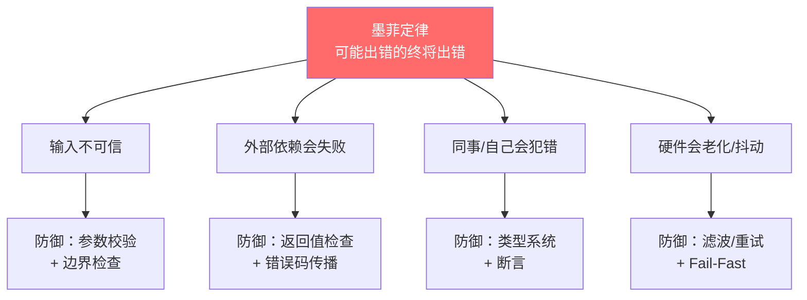
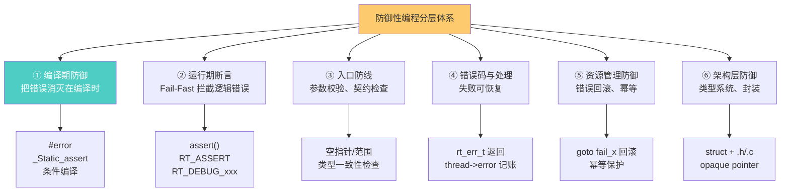
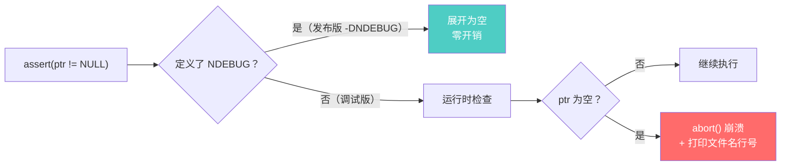
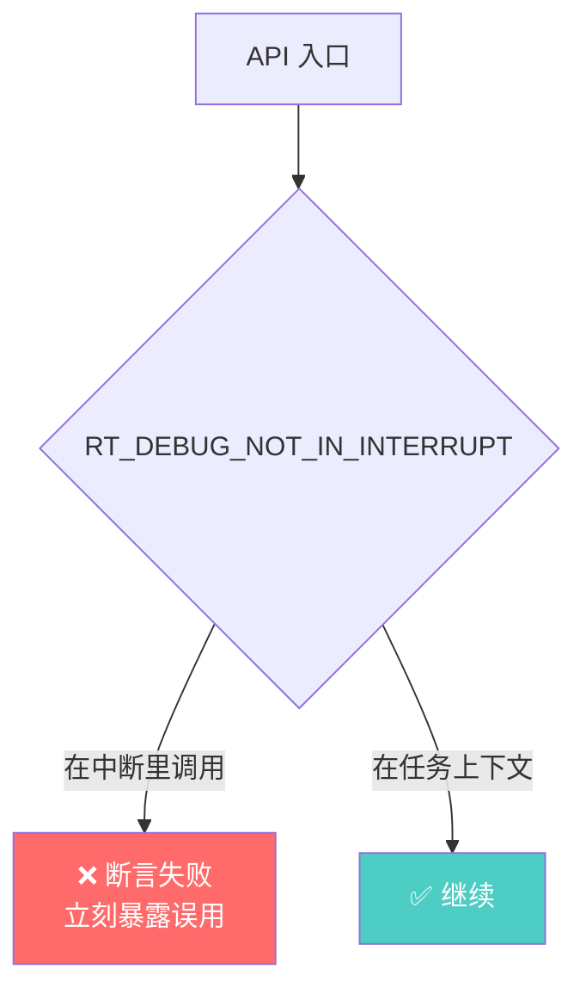
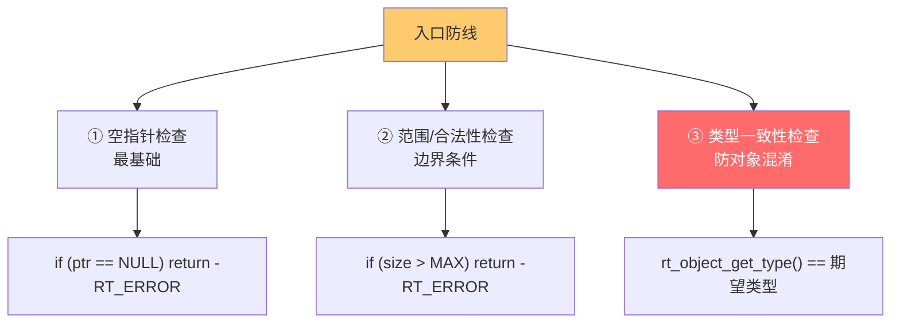
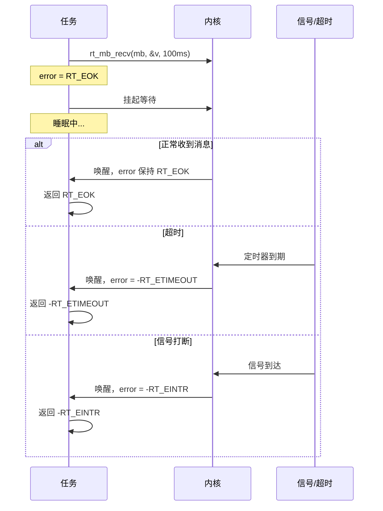
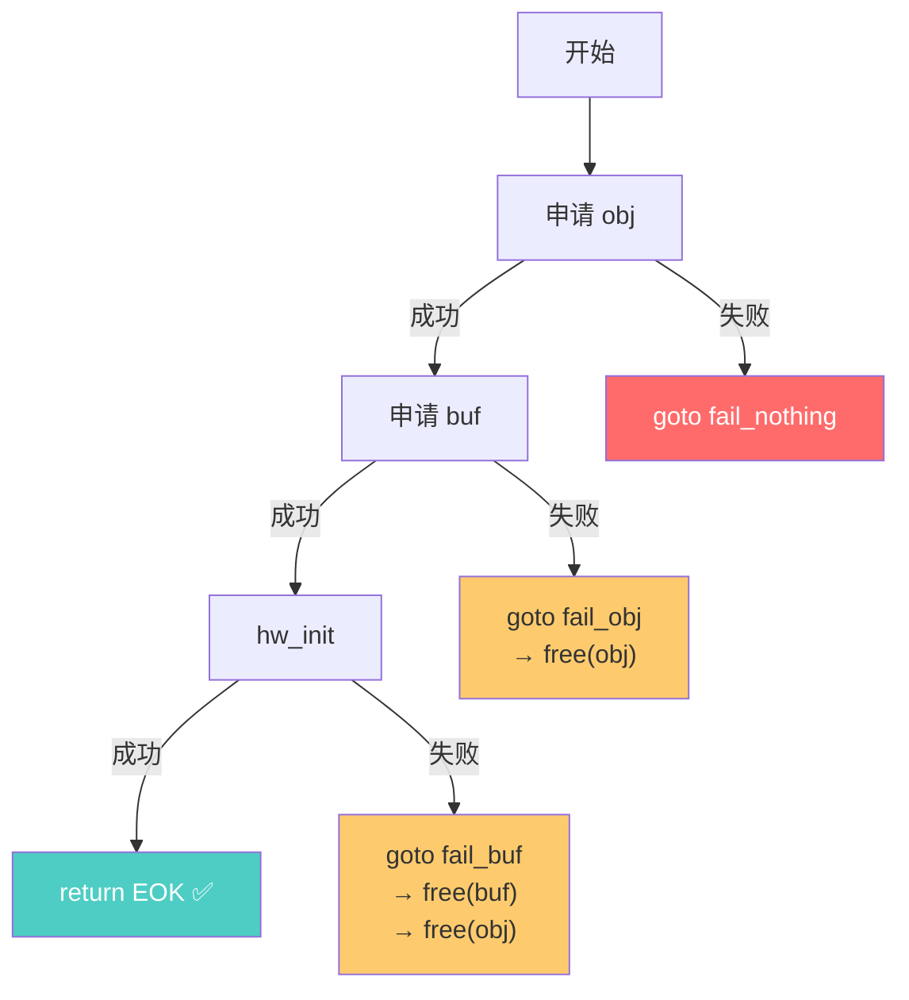
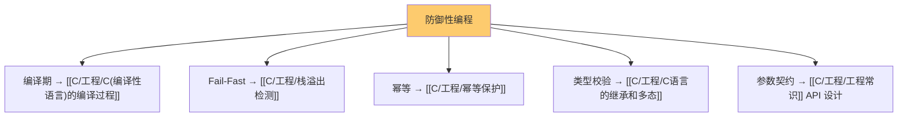
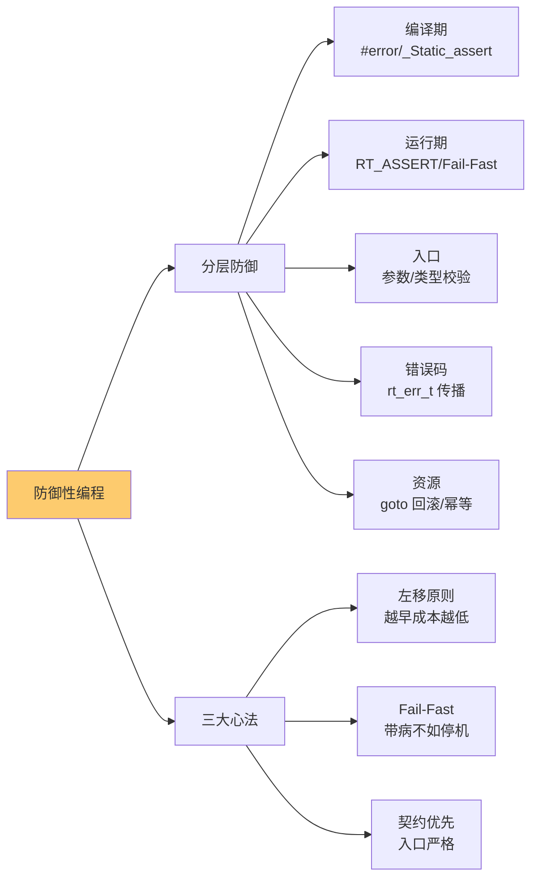

# 防御性编程

> [!abstract] 核心本质
> 防御性编程的核心信条是**墨菲定律**——凡是可能出错的事，终究会出错。它假定一切输入都不可信、一切外部依赖都会失败、一切程序员（包括自己）都会犯错，于是**在代码里层层设防**：能在编译期拦住的别留到运行期，能在入口拦住的别让它污染核心逻辑，能在失败时回滚的别留下半初始化对象。本质是用**少量、自动化的检查代码**，换掉**极高、不可控的排错成本**。

```text
错误发现越晚，修复成本呈指数级上升：

  需求设计 ←→ 编译期 ←→ 单元测试 ←→ 集成测试 ←→ 现场运行
   ×1          ×5         ×10         ×50        ×500+

防御性编程的核心策略：
  把错误尽量往「左边」推 —— 在编译期就发现的错误，成本最低
```

---

## 1. 为什么需要防御性编程

### 1.1 嵌入式排错的特殊性

PC 应用程序出错 → 蓝屏/崩溃 → 重启 → 损失几分钟。
嵌入式系统出错 → 电机失控、医疗设备误动作、车规失效 → **人命与巨额损失**。

| 维度 | PC 应用 | 嵌入式系统 |
|------|---------|-----------|
| 出错后果 | 程序崩溃，重启即可 | 物理设备失控，可能伤人 |
| 排错环境 | GDB + 完整 OS + 日志 | 串口 + LED + 偶发 HardFault |
| 复现难度 | 容易（确定性输入） | 极难（时序/中断/硬件状态） |
| 修复成本 | 发个补丁，秒级部署 | 召回硬件、重新烧录、停产 |
| 观测手段 | printf / 调试器齐全 | 资源受限，连 printf 都奢侈 |

> [!important] 嵌入式排错成本极高
> 一个在实验室"偶尔"出现的 HardFault，可能在客户现场变成"每天必现"。一旦产品交付，排错成本可能放大几百倍。所以**嵌入式工程师比任何人都更需要防御性编程**——把错误扼杀在编译期和入口处，而不是等它跑到客户现场。

### 1.2 墨菲定律的工程化



### 1.3 防御性编程不是"什么都检查"

```c
/* ❌ 过度防御：检查已知为真的事物，徒增噪音 */
int add(int a, int b) {
    RT_ASSERT(a >= INT_MIN);    /* 废话 */
    RT_ASSERT(b >= INT_MIN);    /* 废话 */
    RT_ASSERT(a + b >= INT_MIN);/* 可能溢出，但这里 ASSERT 救不了 */
    return a + b;
}

/* ✅ 适度防御：只检查"契约"——调用者可能违反的前提 */
rt_err_t uart_send(rt_device_t dev, const uint8_t *buf, rt_size_t len) {
    RT_ASSERT(dev != RT_NULL);          /* 契约：dev 不能为空 */
    RT_ASSERT(buf != RT_NULL || len == 0); /* 契约：有数据必有缓冲 */
    if (len == 0) return RT_EOK;        /* 边界：空操作合法 */
    /* ... */
}
```

> [!tip] 防御的边界
> 防御性编程检查的是**契约**（调用方应该保证什么），不是**真理**（语言已经保证的东西）。检查"参数非空"是契约检查，检查"int 不会小于 INT_MIN"是无意义。过度防御反而淹没真正的错误信号。

---

## 2. 分层防御体系：一张图看全局

防御性编程不是单一技术，而是一套**层层设防**的体系。每一层针对不同时机、不同类型的错误。



### 2.1 分层速查表（保留并扩充原表）

| 层级 | 手段 | 宏/关键字 | 典型用途 | 发现时机 |
|------|------|----------|---------|---------|
| **编译时** | 编译时断言 | `#error` | 配置参数检查 | 编译失败 |
| **编译时** | 静态断言 | `_Static_assert` (C11) | 编译时类型/常量检查 | 编译失败 |
| **编译时** | 条件编译 | `#ifdef` / `#if` | 功能裁剪、平台适配 | 编译期 |
| **编译时** | 编译期范围校验 | `_Static_assert` + 表达式 | 数组大小、对齐 | 编译失败 |
| **运行时** | 运行时断言 | `assert()` / `RT_ASSERT` | 参数有效性、不变式 | 运行时（调试） |
| **运行时** | 上下文断言 | `RT_DEBUG_IN_THREAD_CONTEXT` | "必须在任务上下文" | 运行时（调试） |
| **入口** | 参数校验 | `if (ptr == NULL) return -RT_ERROR` | 公开 API 入口 | 运行时（恒久） |
| **入口** | 类型一致性 | `rt_object_get_type()` | 防止对象类型混淆 | 运行时（恒久） |
| **错误处理** | 错误码返回 | `rt_err_t`、`-RT_ETIMEOUT` | 失败可恢复传播 | 运行时 |
| **资源** | 错误回滚 | `goto fail_x` | 半初始化对象清理 | 运行时 |
| **资源** | 幂等保护 | 标志位/计数器 | 重复调用安全 | 运行时 |
| **警告** | 未使用消除 | `RT_UNUSED` / `RT_USED` | 消除编译器警告 | 编译期 |
| **架构** | 封装隔离 | opaque pointer | 防止外部乱动内部 | 设计期 |

> [!note] 这张表是本篇的导航
> 后面每一节展开一层。核心心法：**越靠前的层，成本越低、效果越好**——能在编译期发现的错误，绝不留到运行期；能在入口拦住的，绝不放进核心逻辑。

### 2.2 三大心法

```text
心法一：左移原则
  错误发现越早成本越低 → 尽量用编译期手段（#error / _Static_assert）

心法二：Fail-Fast
  一旦发现不可挽回的错误，立即 halt，绝不带病运行（详见第 4 节）

心法三：契约优先
  在公开 API 入口检查契约（参数合法性），内部函数可适当放松
```

---

## 3. 编译期防御：把错误消灭在编译时

编译期防御是性价比最高的一层——错误在 `make` 时就暴露，**不会进到设备里**。它的核心工具是预处理器和 C11 静态断言。

### 3.1 `#error`：配置参数硬检查

```c
/* RT-Thread 的 Kconfig 配置互相依赖，错了就编译失败 */
#if RT_THREAD_PRIORITY_MAX > 256
#error "RT_THREAD_PRIORITY_MAX cannot be greater than 256!"
#endif

#if defined(RT_USING_HEAP) && (RT_HEAP_SIZE < 128)
#error "RT_HEAP_SIZE too small, must be at least 128 bytes"
#endif

/* 平台互斥检查 */
#if defined(RT_USING_SMART) && !defined(RT_USING_USERSPACE)
#error "RT_USING_SMART requires RT_USING_USERSPACE"
#endif
```

`#error` 让错误的配置在**预处理阶段**就编译失败，附带清晰的错误信息。比"编译过、运行崩"好一万倍。


### 3.2 `_Static_assert`：编译期类型/常量断言

C11 引入的静态断言，能在**编译期**检查常量表达式，常用于结构体布局、数组大小、对齐约束。

```c
#include <assert.h>

/* 检查结构体大小（防止意外膨胀） */
_Static_assert(sizeof(struct rt_thread) == 128,
               "rt_thread size changed, check memory layout");

/* 检查对齐 */
_Static_assert(__alignof__(struct msg) == 8,
               "msg must be 8-byte aligned for DMA");

/* 检查常量配置 */
_Static_assert(RT_THREAD_PRIORITY_MAX <= 256,
               "priority max too large");

/* 检查数组大小是 2 的幂（DMA buffer 常用） */
_Static_assert((BUF_SIZE & (BUF_SIZE - 1)) == 0,
               "BUF_SIZE must be power of 2");
```

```text
_Static_assert(constant_expr, message);
  ↑                ↑                ↑
  关键字        编译期常量表达式    失败时打印的消息
                （不能是变量！）
```

> [!tip] _Static_assert vs assert
> `assert()` 是**运行期**断言（程序运行时检查，失败时调用 abort）；`_Static_assert` 是**编译期**断言（编译时检查，失败时编译报错）。能用 `_Static_assert` 就别用 `assert`——前者零运行开销、错误立即暴露。

### 3.3 古老的编译期断言技巧（C11 之前）

C11 之前没有 `_Static_assert`，前辈们用"数组长度为负"的技巧模拟：

```c
/* 经典宏：利用"位域宽度不能为负"做编译期断言 */
#define STATIC_ASSERT(cond, name) \
    typedef char static_assert_##name[(cond) ? 1 : -1]

/* 用法 */
STATIC_ASSERT(sizeof(int) == 4, int_size);   /* 编译通过 */
STATIC_ASSERT(sizeof(int) == 8, int_size2);  /* 编译失败：数组大小 -1 */
```

原理：条件为真时定义长度 1 的数组（合法），为假时定义长度 -1 的数组（**非法，编译报错**）。现在有了 C11 的 `_Static_assert`，这套技巧主要在老旧代码库里能看到。

### 3.4 条件编译：功能裁剪与平台适配

```c
/* 功能裁剪：根据宏决定编译哪些代码 */
#ifdef RT_USING_HEAP
    /* 只有用堆时才编译 rt_malloc/rt_free */
    void *rt_malloc(rt_size_t size) { /* ... */ }
#else
    /* 不用堆时，提供空实现或直接不声明 */
#endif

/* 平台适配 */
#if defined(__CC_ARM)          /* Keil ARMCC */
    #define rt_inline static __inline
#elif defined(__GNUC__)        /* GCC */
    #define rt_inline static inline
#elif defined(__IAR_SYSTEMS_ICC__) /* IAR */
    #define rt_inline static inline
#else
    #error "Unsupported compiler"
#endif
```

> [!warning] 条件编译别滥用
> `#ifdef` 滥用会让代码变成"意大利面"，可读性骤降。原则：① 条件编译只用于**真正需要裁剪**的功能；② 条件块内的代码要成块（整段函数/整段声明），别切碎成零散几行；③ 配置错误用 `#error` 兜底，别让错误配置悄悄编译过去。详见 [[C/工程/C(编译性语言)的编译过程|编译过程]] 的预处理章节。

### 3.5 编译期防御小结

| 手段 | 时机 | 开销 | 典型场景 |
|------|------|------|---------|
| `#error` | 预处理 | 零 | 配置参数硬检查 |
| `_Static_assert` | 编译 | 零 | 类型/常量/布局约束 |
| 条件编译 `#ifdef` | 预处理 | 零 | 功能裁剪、平台适配 |
| `__attribute__((warning))` | 编译 | 零 | 编译期警告（GCC 扩展） |

> [!important] 编译期防御优先
> **凡是能在编译期发现的错误，绝不留到运行期。** 编译期错误零运行开销、立即暴露、附带源码位置，是性价比最高的防御层。每次写配置宏、结构体布局、平台适配代码时，先想"能不能用 `_Static_assert` 或 `#error` 锁死它"。

---

## 4. 运行期断言：Fail-Fast 拦截逻辑错误

编译期防御抓"配置/布局"错误，但**逻辑错误**（参数在运行时变空、状态机走错路、不变式被破坏）只能靠运行期断言。

### 4.1 标准库 `assert()`

```c
#include <assert.h>

void *memcpy_safe(void *dst, const void *src, size_t n) {
    assert(dst != NULL);       /* 运行期检查 */
    assert(src != NULL);
    assert(dst != src);        /* 不允许重叠拷贝 */
    /* ... */
}
```

```text
assert(expr) 的行为：
  定义了 NDEBUG → 展开为空（发布版彻底消失）
  未定义 NDEBUG → if (!(expr)) abort();  （调试版触发崩溃）
```



> [!warning] assert 的两面性
> 调试版（无 NDEBUG）：触发崩溃，帮你抓 bug。发布版（-DNDEBUG）：**彻底消失**，零开销但也零保护。所以 `assert()` 只能用于"调试期抓编程错误"，**不能用于"发布版的错误处理"**——发布版需要 `if (ptr == NULL) return -RT_ERROR;` 这种恒久检查。

### 4.2 RT-Thread 的 `RT_ASSERT`

RT-Thread 没用标准 `assert()`，而是自己封装了 `RT_ASSERT`，行为可配置：

```c
/* RT-Thread 的断言宏（简化版） */
#ifdef RT_DEBUG
    #define RT_ASSERT(EX)                                             \
        if (!(EX)) {                                                  \
            rt_kprintf("(%s) assert failed at %s:%d\n",               \
                       #EX, __FILE__, __LINE__);                      \
            rt_assert_handler(#EX, __FILE__, __LINE__);               \
        }
#else
    #define RT_ASSERT(EX)
#endif
```

```c
/* 实战用法（RT-Thread 源码随处可见） */
rt_err_t rt_sem_take(rt_sem_t sem, rt_int32_t timeout) {
    RT_ASSERT(sem != RT_NULL);                                  /* 参数非空 */
    RT_ASSERT(rt_object_get_type(&sem->parent.parent)           /* 类型正确 */
              == RT_Object_Class_Semaphore);
    RT_ASSERT((flag == RT_IPC_FLAG_FIFO) ||                     /* 枚举合法 */
              (flag == RT_IPC_FLAG_PRIO));
    /* ... */
}
```

`RT_ASSERT` 相比标准 `assert` 的优势：① 不依赖 `NDEBUG`，用 RT-Thread 自己的 `RT_DEBUG` 开关；② 失败时调 `rt_assert_handler`（可定制为打印/记录/halt/复位）；③ 与 `rt_kprintf` 集成，带完整上下文。

### 4.3 上下文断言：RT-Thread 的精华

RT-Thread 把断言从"参数检查"扩展到了"上下文检查"——这是非常高级的防御：

```c
/* 这些宏检查"我现在跑在什么上下文" */
RT_DEBUG_IN_THREAD_CONTEXT;          /* 必须在任务上下文 */
RT_DEBUG_NOT_IN_INTERRUPT;           /* 不能在中断里调用 */
RT_DEBUG_SCHEDULER_AVAILABLE(timeout != 0);  /* 调度器必须可用 */

/* 例：阻塞 API 绝不能在中断里调 */
rt_err_t rt_sem_take(rt_sem_t sem, rt_int32_t timeout) {
    RT_ASSERT(sem != RT_NULL);
    RT_DEBUG_SCHEDULER_AVAILABLE(timeout != 0);  /* 带超时 → 必须能调度 */
    /* 如果在中断里带超时调这个 → 断言失败 → 立刻暴露 */
}
```



> [!tip] 上下文断言的价值
> 嵌入式最隐蔽的 bug 之一：在 ISR 里调了阻塞 API（`rt_sem_take` 带超时）。这不会立刻崩，但会让调度器死锁或时序错乱。`RT_DEBUG_NOT_IN_INTERRUPT` 把这种误用在**调试期**就抓出来，而不是等量产现场出怪现象。

### 4.4 Fail-Fast 哲学

```text
两种错误处理哲学：

Fail-Fast（快速失败）：
  发现错误 → 立刻 halt / abort / 死循环
  理由：状态已污染，继续跑可能引发更大灾难
  适用：断言失败、内存破坏、栈溢出
  代表：RT_ASSERT、栈溢出钩子、HardFault_Handler

Graceful Degradation（优雅降级）：
  发现错误 → 返回错误码、重试、回滚
  理由：错误可控，系统应尽量继续服务
  适用：网络超时、外设忙、参数非法
  代表：rt_err_t 返回值、重试机制
```

```c
/* Fail-Fast：状态已不可信，立刻停 */
RT_ASSERT(list_integrity_check());   /* 失败 → abort */
void MemManage_Handler(void) {       /* MPU 栈溢出 → 死循环 */
    rt_kprintf("Stack overflow!\n");
    while (1);
}

/* Graceful：错误可控，告诉调用方 */
rt_err_t rt_uart_send(...) {
    if (dev == NULL) return -RT_ERROR;   /* 返回错误，让上层决定 */
    if (busy) return -RT_EBUSY;          /* 可重试 */
}
```

> [!important] Fail-Fast 的判据
> Fail-Fast 用于"**状态已不可信**"的错误：内存被破坏、不变式被违反、栈溢出、链表环。这类错误下继续运行可能导致电机失控、Flash 写错扇区，比停机严重得多。Graceful 用于"**局部可恢复**"的错误：超时、忙、参数非法。判断口诀：**"带病运行比停机更危险吗？"是 → Fail-Fast；否 → Graceful。** 详见 [[C/工程/栈溢出检测|栈溢出检测]] 的 Fail-Fast 章节。

---

## 5. 入口防线：参数校验与契约检查

运行期断言是调试期手段（发布版会消失），**公开 API 的入口必须有恒久检查**——这是错误挡在核心逻辑之外的最后一道关卡。

### 5.1 三类入口校验



### 5.2 空指针与范围检查

```c
/* RT-Thread 的标准入口校验模式 */
rt_err_t rt_mb_send_wait(rt_mailbox_t mb, rt_ubase_t value, rt_int32_t timeout) {
    /* 1. 基础参数校验：确保是个合法的邮箱对象 */
    RT_ASSERT(mb != RT_NULL);                       /* 断言（调试期） */

    /* 下面是发布版也保留的恒久检查（有些 API 会用 if 代替断言） */
    if (mb == RT_NULL) return -RT_ERROR;            /* 恒久检查 */

    /* ... */
}

rt_err_t rt_mq_send(rt_mq_t mq, const void *buffer, rt_size_t size) {
    RT_ASSERT(mq != RT_NULL);
    RT_ASSERT(buffer != RT_NULL);
    RT_ASSERT(size > 0);

    /* 消息大小不能超过队列单条容量 */
    if (size > mq->msg_size) return -RT_ERROR;       /* 范围检查 */
    /* ... */
}
```

### 5.3 类型一致性检查：RT-Thread 的精华

RT-Thread 的所有内核对象都继承自 `rt_object`（详见 [[C/工程/C语言的继承和多态|继承和多态]]），每个对象都记录自己的类型。`rt_object_get_type` 用来防止"把信号量当邮箱用"这类错误：

```c
/* 每个 rt_object 都带类型标记 */
struct rt_object {
    char name[RT_NAME_MAX];
    rt_uint8_t type;        /* ★ 记录"我是什么"：Semaphore/Mutex/Mailbox... */
    rt_uint8_t flag;
    rt_list_t list;
};

/* 类型枚举 */
enum rt_object_class_type {
    RT_Object_Class_Null = 0,
    RT_Object_Class_Thread,
    RT_Object_Class_Semaphore,
    RT_Object_Class_Mutex,
    RT_Object_Class_Event,
    RT_Object_Class_MailBox,
    RT_Object_Class_MessageQueue,
    /* ... */
};

/* 入口校验：你传给我的句柄，类型对吗？ */
rt_err_t rt_sem_take(rt_sem_t sem, rt_int32_t timeout) {
    RT_ASSERT(sem != RT_NULL);
    RT_ASSERT(rt_object_get_type(&sem->parent.parent)     /* ★ 类型校验 */
              == RT_Object_Class_Semaphore);
    /* 如果有人把 mailbox 句柄强转成 sem 传进来 → 这里抓出来 */
}
```


> [!tip] 类型一致性是 C 语言 OO 的保护网
> C 没有运行时类型识别（RTTI），句柄都是指针，编译器不阻止你把 `rt_mailbox_t` 当 `rt_sem_t` 传。`rt_object_get_type` 用"对象自带类型标记"模拟 RTTI，在入口拦住类型混淆。这是 [[C/工程/C语言的继承和多态|继承和多态]] 能安全运行的底层保障。

### 5.4 静态对象 vs 动态对象的校验

```c
/* RT-Thread 区分静态初始化（init）和动态创建（create）的对象 */
RT_ASSERT(rt_object_is_systemobject(&sem->parent.parent) == RT_FALSE);
/* 静态对象（init 出来的）不能被 delete（只能 detach）
   动态对象（create 出来的）不能被 detach（只能 delete）
   搞混 → 内存泄漏或野指针 */
```

### 5.5 入口防线的"三档严厉度"

| 严厉度 | 手段 | 发布版保留 | 失败行为 | 适用 |
|--------|------|-----------|---------|------|
| 最严（调试） | `RT_ASSERT` | ❌（可关） | abort/halt | 内部不变式、编程错误 |
| 中（恒久） | `if (..) return -RT_ERROR` | ✅ | 返回错误码 | 公开 API 契约 |
| 最宽（容错） | `if (..) { 修正; }` | ✅ | 静默修正 | 输入清洗、协议解析 |

> [!note] 公开 API vs 内部函数
> **公开 API**（外部能调的）必须有恒久入口检查（`if` + 错误码），因为不能信任调用者。**内部 static 函数**可以只靠 `RT_ASSERT`（假设上层已校验），减少重复检查。这是"契约边界"思维：在边界严格检查，边界内信任契约。

---

## 6. 错误码与错误处理

入口防线拦住"非法调用"，但"合法调用下仍可能失败"（超时、忙、资源不足）——这类预期错误要靠**错误码**传播，让上层决策。

### 6.1 RT-Thread 的错误码体系

```c
/* rt_err_t 是 RT-Thread 的统一返回类型 */
typedef long rt_err_t;

/* 错误码定义（非负=成功，负数=失败） */
#define RT_EOK          0               /* 无错误 */
#define RT_ERROR        1               /* 一般性错误 */
#define RT_ETIMEOUT     2               /* 超时 */
#define RT_EFULL        3               /* 资源满 */
#define RT_EEMPTY       4               /* 资源空 */
#define RT_ENOMEM       5               /* 内存不足 */
#define RT_ENOSYS       8               /* 系统未实现 */
#define RT_EBUSY        10              /* 资源忙 */
#define RT_EINTR        12              /* 被信号中断 */

/* 返回时取负值，表示失败 */
rt_err_t rt_sem_take(rt_sem_t sem, rt_int32_t timeout) {
    if (timeout_expired) return -RT_ETIMEOUT;   /* 返回 -2 */
    return RT_EOK;                              /* 返回 0 */
}
```

```text
错误码判读约定：
  返回值 == RT_EOK (0)        → 成功
  返回值 < 0                  → 失败（具体错误 = -返回值）
  返回值 > 0                  → 特殊成功状态（少用）

调用方检查：
  rt_err_t err = rt_sem_take(sem, 100);
  if (err != RT_EOK) {
      if (err == -RT_ETIMEOUT) handle_timeout();
      else handle_other_error(err);
  }
```

### 6.2 线程错误记账：`thread->error`

RT-Thread 有一个精妙的设计：每个线程带一个 `error` 字段，记录"我为什么被唤醒"。这让阻塞 API 能区分"正常拿到资源"还是"异常被唤醒"：

```c
struct rt_thread {
    /* ... */
    rt_err_t error;     /* ★ 唤醒原因记账 */
};

/* 阻塞接收消息 */
rt_err_t rt_mb_recv(rt_mailbox_t mb, rt_ubase_t *value, rt_int32_t timeout) {
    /* 挂起前清零 */
    current_thread->error = RT_EOK;

    /* 挂起等待 */
    rt_thread_suspend(current_thread);
    rt_schedule();

    /* 醒来后检查记账 */
    if (current_thread->error != RT_EOK) {
        return current_thread->error;   /* 比如 -RT_ETIMEOUT 或 -RT_EINTR */
    }
    *value = received_value;
    return RT_EOK;
}
```



> [!note] error 记账的价值
> 没有这个机制，任务醒来后无法区分"拿到资源了"还是"被异常唤醒了"。比如 `rt_sem_take` 睡着后信号打断它，如果内核不设 `error = -RT_EINTR`，任务醒来会误以为拿到信号量继续往下走——但其实根本没拿到，导致逻辑错误。这是类 Unix 系统"被中断的系统调用"原理的嵌入式实现。

### 6.3 错误传播链

```c
/* 错误应该逐层向上传播，而不是被吞掉 */

/* ❌ 错误吞掉：调用方永远不知道失败 */
void app_init(void) {
    rt_sem_take(sem, 100);   /* 返回值被丢弃！超时了也不知道 */
    init_hardware();         /* 继续跑，埋下隐患 */
}

/* ✅ 错误检查 + 传播 */
rt_err_t app_init(void) {
    rt_err_t err = rt_sem_take(sem, 100);
    if (err != RT_EOK) {
        rt_kprintf("sem take failed: %d\n", err);
        return err;          /* 把错误往上传 */
    }
    err = init_hardware();
    if (err != RT_EOK) return err;
    return RT_EOK;
}

/* 最顶层决策：重试 / 降级 / 报警 */
void main(void) {
    rt_err_t err = app_init();
    if (err != RT_EOK) {
        log_fault("init failed");
        enter_safe_mode();   /* 降级运行或停机 */
    }
}
```

### 6.4 三种错误处理策略

| 策略 | 做法 | 适用场景 |
|------|------|---------|
| **传播** | 返回错误码给上层 | 大部分情况（让有上下文的上层决策） |
| **重试** | 检测到瞬时错误，重试几次 | 网络、Flash 读写、外设忙 |
| **降级** | 失败后切换到安全模式 | 关键系统（电机停转、医疗设备进入安全态） |
| **Fail-Fast** | halt/复位 | 状态不可信（内存破坏） |

> [!important] 永远别吞掉错误
> 嵌入式最常见的 bug 源：调用 API 不检查返回值，错误被悄悄忽略，系统带着半初始化状态继续跑，过几小时后莫名其妙崩溃。**铁律：凡是返回 rt_err_t 的函数，必须检查返回值。** 不检查 = 把定时炸弹埋进系统。

---

## 7. 资源管理防御：错误回滚

当一个操作要申请多个资源（内存、句柄、外设），中途某一步失败时，**必须把前面已申请的资源按相反顺序释放**——否则就是内存泄漏/句柄泄漏/半初始化对象。

### 7.1 半初始化对象的灾难

```c
/* ❌ 没有回滚：中途失败留下半初始化对象 */
rt_thread_t thread_create(void) {
    rt_thread_t thread = rt_malloc(sizeof(struct rt_thread));
    if (thread == RT_NULL) return RT_NULL;

    thread->stack = rt_malloc(STACK_SIZE);
    if (thread->stack == RT_NULL) {
        /* 💀 忘了释放 thread！内存泄漏 */
        return RT_NULL;
    }

    thread->timer = rt_timer_create(...);
    if (thread->timer == RT_NULL) {
        /* 💀 忘了释放 thread 和 stack！泄漏更多 */
        return RT_NULL;
    }

    return thread;
}
```

后果：第一次失败泄漏 1 块内存，第二次失败泄漏 2 块……长期运行后内存耗尽，系统崩溃。这是嵌入式系统"跑几天必死"的经典原因。

### 7.2 错误回滚模板：`goto fail_x`

RT-Thread、Linux 内核的标准模式——用 `goto` 跳到清理标签，标签名对应"已成功申请的资源边界"：

```c
/* ✅ 标准错误回滚模板 */
rt_err_t init_resource(void) {
    rt_err_t ret;

    obj = rt_malloc(sizeof(*obj));
    if (obj == RT_NULL) {
        ret = -RT_ENOMEM;
        goto fail_nothing;          /* 啥都没申请 */
    }

    buf = rt_malloc(BUF_SIZE);
    if (buf == RT_NULL) {
        ret = -RT_ENOMEM;
        goto fail_obj;              /* 已申请 obj */
    }

    ret = hw_init(dev);
    if (ret != RT_EOK) {
        goto fail_buf;              /* 已申请 obj + buf */
    }

    /* 全部成功 */
    return RT_EOK;

    /* ★ 清理区：按相反顺序释放，标签名标明"到哪一步了" */
fail_buf:
    rt_free(buf);
fail_obj:
    rt_free(obj);
fail_nothing:
    return ret;
}
```



### 7.3 为什么用 goto 而不是层层嵌套

```c
/* ❌ 层层嵌套 if：金字塔，可读性差 */
rt_err_t bad_init(void) {
    obj = rt_malloc(...);
    if (obj) {
        buf = rt_malloc(...);
        if (buf) {
            timer = rt_create_timer(...);
            if (timer) {
                dev = hw_init(...);
                if (dev) {
                    /* 成功 */
                    return RT_EOK;
                } else {
                    rt_timer_delete(timer);
                    rt_free(buf);
                    rt_free(obj);
                    return -RT_ERROR;
                }
            } else {
                rt_free(buf);
                rt_free(obj);
                return -RT_ERROR;
            }
        } else {
            rt_free(obj);
            return -RT_ERROR;
        }
    }
    return -RT_ENOMEM;
}

/* ✅ goto 扁平化：线性流程 + 单一清理区 */
/* 见 7.2，清晰得多 */
```

> [!tip] goto 在错误处理里是"合法的好 goto"
> 教科书说"别用 goto"，但 Linux 内核、RT-Thread 大量用 `goto` 做错误回滚。规则：① goto 只能**往前跳**（跳到函数末尾的清理区），不能往后跳（那是 spaghetti）；② 清理标签按"已申请顺序的逆序"排列；③ 这不是滥用，是把"成功路径"保持线性可读的最佳实践。

### 7.4 幂等保护：让操作可重复调用

错误回滚解决"失败时"的清理，幂等保护解决"重复调用"时的安全。两者配合才是完整的资源管理防御。

```c
/* 幂等的 init/deinit 对（RT-Thread 的标准模式） */
static rt_bool_t s_inited = RT_FALSE;

rt_err_t uart_init(void) {
    if (s_inited) return RT_EOK;     /* 已初始化 → 直接返回成功 */
    /* ... 真正初始化 ... */
    s_inited = RT_TRUE;
    return RT_EOK;
}

rt_err_t uart_deinit(void) {
    if (!s_inited) return RT_EOK;    /* 未初始化 → 直接返回 */
    /* ... 真正去初始化 ... */
    s_inited = RT_FALSE;
}
```

> [!note] 回滚 + 幂等的完整防御
> 错误回滚保证"失败时干净"，幂等保护保证"重复调用安全"。两者结合，系统在任何异常路径下都不会留下泄漏或重复初始化的半成品。详见 [[C/工程/幂等保护|幂等保护]] 的三种模式（标志位/计数器/状态比对）。

---

## 8. 警告消除：`RT_UNUSED` 与 `RT_USED`

编译器警告不是噪音——**每一条警告都可能是潜在 bug**。防御性编程要求：**零警告编译**。

### 8.1 未使用参数的处理

```c
/* RT-Thread 大量这种场景：某些配置下参数用不到 */
rt_err_t rt_sem_control(rt_sem_t sem, int cmd, void *arg) {
    RT_UNUSED(sem);    /* 防止"未使用参数"警告 */
    RT_UNUSED(cmd);
    RT_UNUSED(arg);
    return -RT_ENOSYS; /* 信号量不支持 control */
}

/* RT_UNUSED 的定义 */
#define RT_UNUSED(x)   ((void)(x))
/* 展开成 (void)(x) —— 表达式求值后丢弃，编译器认为"用过了" */
```

```c
/* 为什么会有未使用参数？ */
/* 条件编译导致：开了某特性时参数有用，关了就没用 */
rt_err_t rt_mq_send(rt_mq_t mq, const void *buf, rt_size_t size) {
#ifdef RT_USING_MESSAGEQUEUE_PRIORITY
    /* 开了优先级特性，prio 参数有用 */
    rt_uint8_t prio = ...;
#else
    RT_UNUSED(prio);   /* 没开，参数没用，消除警告 */
#endif
}
```

### 8.2 `RT_USED`：强制保留

```c
/* RT_USED 防止编译器优化掉"看似没人调用"的函数/变量 */
#define RT_USED   __attribute__((used))

/* 用在自动初始化段：函数只在段里被引用，没人直接调用 */
RT_USED static const init_fn_t __rt_init_uart = uart_init;
/* 没 RT_USED → 编译器觉得"没人用" → 优化掉 → uart_init 永不执行 */
/* 有 RT_USED → 强制保留 → 启动代码能遍历到它 */
```

> [!note] 这与自动初始化机制直接相关
> [[C/工程/自动初始化机制|自动初始化机制]] 的 `INIT_EXPORT` 宏展开后，函数指针被放进 `.rti_fn` 段。如果不加 `RT_USED`（即 `__attribute__((used))`），编译器会认为这些函数指针"没被引用"而删掉它们，导致自动初始化失效。链接脚本的 `KEEP()` 是链接器侧的同类保护。

### 8.3 零警告编译的目标

```text
为什么追求零警告：
  ① 警告里藏着真 bug（未使用 = 可能漏了逻辑；类型不匹配 = 可能溢出）
  ② 警告多了会"狼来了"——真正严重的警告被淹没
  ③ CI 里开启 -Werror，把警告升级为错误，强制零警告
```

| 常见警告 | 原因 | 防御手段 |
|---------|------|---------|
| unused parameter | 条件编译下参数没用 | `RT_UNUSED(x)` |
| unused variable | 临时调试变量没删 | 删除，或 `RT_USED` |
| unused function | 隐式调用（段引用） | `RT_USED` / `__attribute__((used))` |
| type mismatch | 整形/指针转换 | 显式强转（见 [[C/工程/整形转指针\|整形转指针]]） |
| comparison signed/unsigned | 有符号无符号比较 | 统一类型，或显式强转 |
| may be used uninitialized | 未初始化 | 初始化 = 0 |

---

## 9. 与其他主题的呼应

防御性编程不是孤岛，它和知识库里的很多主题深度交织。



| 防御手段 | 关联主题 | 关系 |
|---------|---------|------|
| Fail-Fast | [[C/工程/栈溢出检测\|栈溢出检测]] | 栈溢出钩子检测到后死循环 halt，正是 Fail-Fast |
| 幂等保护 | [[C/工程/幂等保护\|幂等保护]] | 重复调用安全，防止半初始化 |
| 类型校验 | [[C/工程/C语言的继承和多态\|继承和多态]] | rt_object_get_type 是 OO 的运行时保护网 |
| 错误码 | RTOS 所有 API | rt_err_t 贯穿整个内核 |
| 零警告 | [[C/工程/C(编译性语言)的编译过程\|编译过程]] | -Wall -Werror 在编译期防御 |
| volatile | [[C/函数/Voliate函数\|Voliate函数]] | 防编译器优化掉寄存器访问 |

---

## 10. 一页总结



> [!abstract] 三句话记住全文
> **① 分层设防**：编译期（`#error`/`_Static_assert`，零开销）→ 运行期断言（`RT_ASSERT`/上下文检查，调试期）→ 入口校验（`if`+错误码，恒久）→ 错误处理（`rt_err_t` 传播）→ 资源管理（`goto fail_x` 回滚 + 幂等）。越靠前成本越低。
>
> **② Fail-Fast 判据**：状态不可信的错误（内存破坏/栈溢出/不变式违反）→ 立刻 halt；局部可恢复的错误（超时/忙/参数非法）→ 返回错误码让上层决策。口诀：带病运行比停机更危险吗？
>
> **③ 两条铁律**：公开 API 必须恒久检查契约（`if` + 错误码），不能只靠发布版会消失的 `assert`；凡是返回 `rt_err_t` 的函数，调用方**必须检查返回值**——吞掉错误就是埋定时炸弹。

### 速查口诀

```text
分层防御决策树：
  能编译期拦？     → #error / _Static_assert（最佳）
  是不变式？       → RT_ASSERT（调试期 Fail-Fast）
  是公开 API 契约？→ if + return -RT_ERROR（恒久）
  可恢复失败？     → rt_err_t 传播给上层
  多资源申请？     → goto fail_x 逆序回滚
  重复调用可能？   → 幂等保护

Fail-Fast 三问：
  ① 状态已不可信？（内存破坏）→ halt
  ② 局部可恢复？（超时/忙）→ 错误码
  ③ 公开 API？→ 恒久 if 检查，别靠 assert

零警告编译：
  -Wall -Werror，警告即错误
  RT_UNUSED 消除未使用参数
  RT_USED 保留隐式引用
```

---

## 继续阅读

- [[C/工程/幂等保护]] —— 资源管理防御的搭档：重复调用安全
- [[C/工程/栈溢出检测]] —— Fail-Fast 哲学的典型应用（检测到溢出立刻 halt）
- [[C/工程/工程常识]] —— Doxygen、命名规范、API 设计的契约表达
- [[C/工程/C语言的继承和多态]] —— `rt_object_get_type` 类型一致性检查的根基
- [[C/工程/C(编译性语言)的编译过程]] —— 编译期防御的底层（预处理/编译/链接）

---

## 11. 面试高频问题

> [!example]- Q1：什么是防御性编程？为什么嵌入式特别需要它？
> 防御性编程是假定一切会出错（输入不可信、依赖会失败、人会犯错），在代码里层层设防的编程哲学。它把错误尽量往"左边"推——能在编译期发现的别留到运行期，能在入口拦住的别放进核心逻辑。嵌入式特别需要它因为：① 排错成本极高（现场设备、物理后果、难复现）；② 错误发现越晚修复成本指数级上升（编译期 ×1，现场 ×500+）；③ 嵌入式错误可能伤人（电机失控、医疗设备误动作）。核心心法：左移原则（尽早发现）、Fail-Fast（带病不如停机）、契约优先（入口严格检查）。

> [!example]- Q2：`assert()` 和 `RT_ASSERT` 有什么区别？发布版怎么办？
> 标准 `assert()` 受 `NDEBUG` 控制：调试版（无 NDEBUG）触发 abort，发布版（-DNDEBUG）**彻底消失**，零开销但零保护——所以只能用于调试期抓编程错误。`RT_ASSERT` 是 RT-Thread 自己的封装：用 `RT_DEBUG` 开关（不依赖 NDEBUG），失败时调 `rt_assert_handler`（可定制为打印/记录/halt/复位），带 `rt_kprintf` 完整上下文。**发布版的错误防护不能靠 assert，要用恒久的 `if (ptr == NULL) return -RT_ERROR;`**。

> [!example]- Q3：Fail-Fast 和 Graceful 两种错误处理哲学怎么选？
> 判据是"状态是否还可信"。**Fail-Fast**（立刻 halt/abort）用于状态不可信的错误：内存被破坏、不变式违反、栈溢出——这类错误继续跑可能让电机失控、写错 Flash，比停机更危险。**Graceful**（返回错误码/重试/降级）用于局部可恢复的错误：超时、外设忙、参数非法。口诀：**"带病运行比停机更危险吗？"是 → Fail-Fast；否 → Graceful。** 栈溢出钩子的死循环、MPU 异常后的 halt 都是 Fail-Fast；`rt_sem_take` 超时返回 `-RT_ETIMEOUT` 是 Graceful。

> [!example]- Q4：RT-Thread 的 `rt_object_get_type` 是怎么防止类型混淆的？
> RT-Thread 所有内核对象继承自 `rt_object`，里面有个 `type` 字段记录"我是什么"（Thread/Semaphore/Mutex/Mailbox...）。`rt_object_get_type` 在 API 入口检查传入句柄的 type 是否匹配预期。比如 `rt_sem_take` 入口检查 `rt_object_get_type(sem) == RT_Object_Class_Semaphore`，如果有人把 mailbox 句柄强转成 sem 传进来，这里会断言失败。C 没有运行时类型识别（RTTI），句柄都是指针编译器不拦，这套"对象自带类型标记"模拟 RTTI，是 C 语言面向对象的安全网。

> [!example]- Q5：为什么嵌入式要追求零警告编译？
> 三点：① **警告里藏着真 bug**——未使用参数可能漏了逻辑，类型不匹配可能溢出，未初始化可能读到垃圾；② **警告多了"狼来了"**——严重的警告被淹没在几百条小警告里；③ CI 开 `-Werror` 把警告升级为错误，强制零警告才能合并代码。处理手段：未使用参数用 `RT_UNUSED(x)`（展开成 `(void)(x)`）；隐式引用的函数用 `RT_USED`（`__attribute__((used))`）防优化删掉；类型转换显式强转。

> [!example]- Q6：错误回滚用 `goto fail_x` 模式，为什么不用层层嵌套 if？
> 层层嵌套 if 会形成"金字塔"，成功路径被埋在深层缩进里，可读性差；而且每个失败分支都要重复写清理代码，容易漏。`goto fail_x` 模式把成功路径保持线性（主流程一路向下），失败时跳到函数末尾的清理区，清理标签按"已申请顺序的逆序"排列（fail_buf → free(buf)，fail_obj → free(obj)）。Linux 内核、RT-Thread 都这么做。规则：goto 只往前跳（到清理区），不往后跳；标签名标明"到哪一步了"。这不是滥用 goto，是让错误处理清晰的最佳实践。

> [!example]- Q7：`thread->error` 这个设计解决了什么问题？
> 解决"任务被唤醒后不知道为什么被唤醒"的问题。RT-Thread 每个线程带 `error` 字段，阻塞 API 挂起前清零，唤醒时由内核设置原因：正常拿到资源 = `RT_EOK`，超时 = `-RT_ETIMEOUT`，被信号打断 = `-RT_EINTR`，对象被删除 = `-RT_ERROR`。任务醒来后检查这个字段，决定怎么处理。没有这个机制，任务被信号打断醒来后会误以为"拿到信号量了"继续往下跑，但其实根本没拿到，导致逻辑错误。这是类 Unix 系统"被中断的系统调用（EINTR）"原理的嵌入式实现。
