# 面向切面编程（AOP）

> [!abstract] 核心本质
> 面向切面编程（AOP，Aspect-Oriented Programming）解决的是**横切关注点**问题——日志、安全、监控、错误处理这类逻辑，**散布在每个业务函数里**，既不属于任何单一模块，又无法集中。AOP 的核心思想是把这些散落的代码抽成**切面**，在特定的**切入点**上**织入**到主流程中，让业务代码保持纯粹。C 语言没有 AOP 关键字，但 Linux 内核、RT-Thread 用**五种织入时机**（链接期/启动期/运行期/编译期/硬件）实现了 AOP 的 C 语言变体——这套机制你早已用过，只是没意识到它们同根同源。

读 RT-Thread 源码时，你会发现这些看似无关的机制"感觉很像"：

- `$Super$$main` / `$Sub$$main`：在用户 `main` 前后插入 RTOS 启动；
- `INIT_BOARD_EXPORT(uart_init)`：模块自注册，main 之前被调；
- `rt_scheduler_sethook(my_fn)`：线程切换时调你的函数；
- `vApplicationStackOverflowHook`：栈溢出时调你的兜底；
- `USART1_IRQHandler`：串口事件时硬件跳过来调你。

它们的共同点是：**你只写了函数定义，没写调用语句，是"别人"在某个时机替你调**。这正是 [[C/工程/显示调用和隐式调用|显示调用和隐式调用]] 里讲的隐式调用家族。而 AOP 给了这套机制一个统一的名字——**织入**。读懂 AOP，你就拿到了把整个工程目录"串成一张网"的最高层抽象。

---

## 1. 横切关注点问题：AOP 要解决什么

### 1.1 一个场景：日志散布在每个函数里

假设你想给每个 API 调用加日志（记录进入/退出、耗时），不用 AOP 的世界是这样：

```c
/* ❌ 没有 AOP：日志代码散布在每个业务函数里 */
rt_err_t rt_sem_take(rt_sem_t sem, rt_int32_t timeout) {
    LOG_D("enter rt_sem_take, sem=%p, timeout=%d", sem, timeout);   /* ← 日志 */
    rt_tick_t start = rt_tick_get();                                  /* ← 耗时记录 */
    RT_ASSERT(sem != RT_NULL);                                        /* ← 参数校验 */
    /* ... 核心逻辑 ... */
    rt_tick_t elapsed = rt_tick_get() - start;
    LOG_D("exit rt_sem_take, elapsed=%d, ret=%d", elapsed, ret);      /* ← 日志 */
    return ret;
}

rt_err_t rt_sem_release(rt_sem_t sem) {
    LOG_D("enter rt_sem_release, sem=%p", sem);                       /* ← 日志 */
    rt_tick_t start = rt_tick_get();                                  /* ← 耗时记录 */
    RT_ASSERT(sem != RT_NULL);                                        /* ← 校验 */
    /* ... 核心逻辑 ... */
    LOG_D("exit rt_sem_release, elapsed=%d", ...);                    /* ← 日志 */
    return ret;
}

/* 同样的日志+校验+耗时记录，在 rt_mb_send/rt_mq_recv/rt_mutex_take... 重复几十遍 */
```

### 1.2 散布的四大痛点

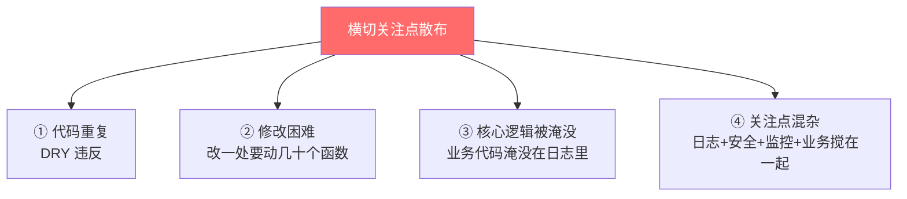

| 痛点 | 表现 |
|------|------|
| **代码重复（DRY 违反）** | 同样的 `LOG_D("enter ...")` + 耗时记录，复制了几十遍 |
| **修改困难** | 想把日志从 `LOG_D` 换成 `LOG_I`，要改几十个函数 |
| **核心逻辑被淹没** | `rt_sem_take` 的核心逻辑被夹在日志和耗时记录中间，可读性差 |
| **关注点混杂** | 日志、安全校验、性能监控、业务逻辑全挤在一个函数里 |

### 1.3 横切关注点：不属于任何单一模块

```text
核心关注点（纵向）：
  rt_sem_take 的"获取信号量"逻辑
  rt_mb_send 的"发送邮件"逻辑
  uart_init 的"初始化串口"逻辑
  → 这些是每个模块的核心业务

横切关注点（横向，贯穿所有模块）：
  日志：每个 API 都要记录调用
  安全：每个 API 都要校验权限
  性能：每个 API 都要统计耗时
  错误：每个 API 都要处理失败
  → 这些不属于任何单一模块，但又到处都需要
```

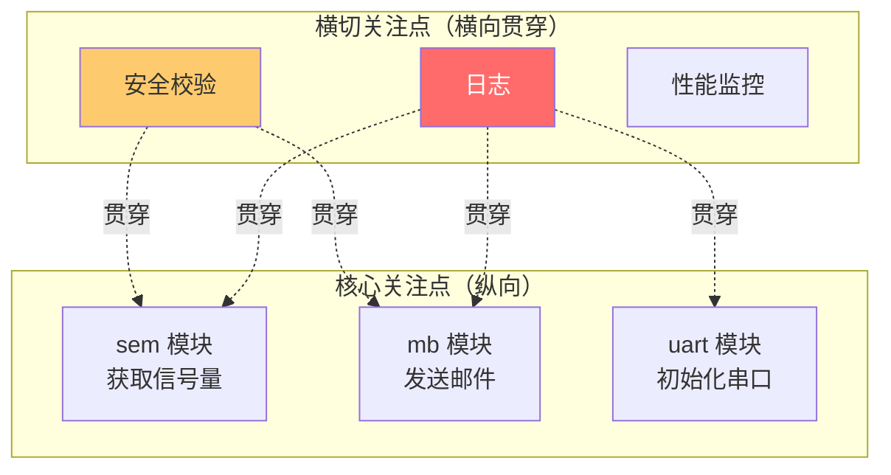

> [!note] "横切"的直觉
> 想象把核心业务画成纵向的柱子（sem 模块、mb 模块、uart 模块），把日志/安全/监控画成横向的刀——这把刀**横着切过所有柱子**。这就是"横切关注点（cross-cutting concern）"的由来：它不属于任何一根柱子，却又切过每一根。

### 1.4 AOP 的解法：抽成切面

```c
/* ✅ AOP 思路：把日志抽成"切面"，业务函数保持纯粹 */
/* 业务函数只写核心逻辑，不掺日志 */
rt_err_t rt_sem_take(rt_sem_t sem, rt_int32_t timeout) {
    /* 只有核心逻辑：获取信号量 */
    RT_ASSERT(sem != RT_NULL);
    /* ... 纯粹的信号量获取 ... */
    return ret;
}

/* 日志作为"切面"在函数边界被织入（具体怎么织入见第 3-4 节） */
/* 你不在业务函数里写日志，日志由 AOP 机制自动注入 */
```

AOP 把"散落的横切代码"集中成"切面"，业务函数保持纯粹，切面在合适的时机自动注入。问题只剩一个：**C 语言没有 AOP 关键字，怎么注入？** 答案是第 3 节的"五种织入时机"。

---

## 2. AOP 四要素：Java 术语 → C 映射

AOP 起源于 Java/Spring，有一套专门术语。C 语言没有这些关键字，但完全可以用这些概念理解 C 里的对应机制。

### 2.1 四要素速查

| 术语 | 中文 | 含义 | Java/Spring | C 语言对应 |
|------|------|------|-------------|-----------|
| **Aspect** | 切面 | 横切关注点的模块化封装 | `@Aspect` 标注的类 | 一组 Hook 函数 + 注册宏 |
| **Pointcut** | 切入点 | "在哪里"织入（哪些函数的哪些位置） | `@Pointcut("execution(...)")` | 埋点位置（函数边界/切换处/启动时） |
| **Advice** | 通知 | "织入什么"（切面里具体执行的代码） | `@Before` / `@After` / `@Around` | Hook 函数体本身 |
| **Weaving** | 织入 | "怎么把切面注入到目标" | 编译期/类加载期/运行期 | C 的五种织入时机（见第 3 节） |

### 2.2 通知类型（Advice）

通知按"织入时机相对目标函数"分为五种：

| 通知类型 | 相对目标函数的位置 | C 语言的实现 |
|---------|------------------|-------------|
| **Before**（前置通知） | 目标函数**之前**执行 | 启动代码在调 `main` 前先跑 `$Sub$$main` |
| **After**（后置通知） | 目标函数**之后**执行（无论成功失败） | `$Sub$$main` 里调完 `rtthread_startup` 后的处理 |
| **After-Returning**（返回通知） | 目标函数**成功返回后**执行 | 完成回调（如 DMA TC 中断） |
| **After-Throwing**（异常通知） | 目标函数**抛异常后**执行 | 错误钩子、HardFault_Handler |
| **Around**（环绕通知） | **包围**目标函数（前后都能插代码，甚至能不调目标） | `$Super$$/$Sub$$`（可决定是否调原函数） |

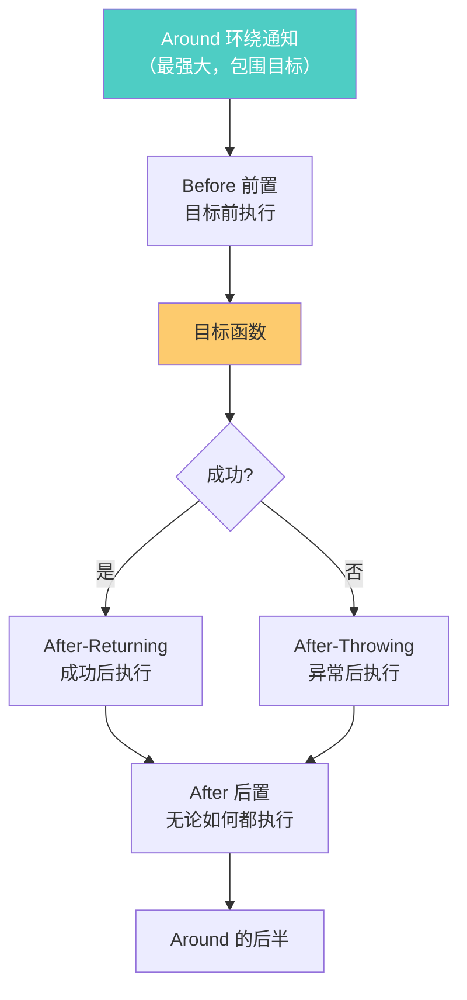

> [!note] Around 通知 = `$Super$$/$Sub$$`
> Spring 的 Around 通知最强大——它包围目标函数，能决定"调不调原函数、调几次、改参数、改返回值"。C 语言里最接近 Around 的就是 ARMCC 的 `$Super$$/$Sub$$`：`$Sub$$main` 包围了原 `main`，可以决定是否调 `$Super$$main`（原 main）。详见第 4 节。

### 2.3 切入点的表达

切入点回答"在哪里织入"：

```text
Java 的切入点表达式（声明式）：
  @Pointcut("execution(* com.example.*.*(..))")
  → 匹配 com.example 包下所有方法

C 语言的切入点（命令式，靠埋点）：
  ① 函数边界     → $Sub$$main 包围 main
  ② 线程切换点   → rt_schedule 里埋的 if (hook) hook()
  ③ 对象创建点   → rt_object_init 里埋的 hook
  ④ 启动时点     → 链接脚本收集的 .rti_fn 段
  ⑤ 硬件事件点   → 向量表里的中断入口
```

C 没有"声明式切入点表达式"，而是靠**在源码里手动埋点**。这是 C 实现 AOP 的本质局限——你必须显式地在某个位置写下 `if (hook) hook(...)`，而 Java/Spring 能靠注解自动匹配。

> [!tip] Java 是声明式，C 是命令式
> Java 的 AOP：你写 `@Before("execution(* *.*(..))")`，框架自动找到所有匹配的方法织入。C 的 AOP：你必须手动在某个位置写 `if (hook) hook()`，框架（内核）作者已经替你埋好了这些点。**C 程序员是 AOP 的"使用者"（挂 Hook），内核作者是 AOP 的"提供者"（埋点）。**

---

## 3. C 语言的五种织入时机：本篇的灵魂

这是整篇的核心。C 没有 AOP 关键字，但能用**五个不同的时机**把切面注入主流程。理解这一节，你就能把整个"工程"目录里那些"感觉很像"的机制，统一归类到一个框架下。

```mermaid
flowchart TD
    A["C 语言的五种织入时机"] --> B["① 链接期织入<br/>$Super$$/$Sub$$"]
    A --> C["② 启动期织入<br/>INIT_EXPORT 段收集"]
    A --> D["③ 运行期织入<br/>Hook / 回调"]
    A --> E["④ 编译期织入<br/>宏包裹"]
    A --> F["⑤ 硬件织入<br/>中断 / 向量表"]

    B --> B1["时机：程序入口"]
    C --> C1["时机：main 之前"]
    D --> D1["时机：事件发生"]
    E --> E1["时机：预处理"]
    F --> F1["时机：硬件触发"]

    style A fill:#fdcb6e,color:#333
    style B fill:#4ecdc4,color:#fff
    style C fill:#74b9ff,color:#fff
    style D fill:#fdcb6e,color:#333
    style E fill:#a29bfe,color:#fff
    style F fill:#ff6b6b,color:#fff
```

### 3.1 五种时机对照表

| 时机 | 织入者 | 切入点 | 谁是 AOP 提供者 | 谁是 AOP 使用者 | 灵活度 |
|------|--------|--------|----------------|----------------|--------|
| **链接期** | 链接器 | 函数入口（`main`） | 工具链（ARMCC） | RTOS 移植者 | 低（固定函数） |
| **启动期** | 启动代码 + 链接脚本 | 启动序列 | RTOS 内核（段设计） | 驱动开发者 | 中（按级别） |
| **运行期** | 框架运行时 | 任意埋点位置 | 内核作者（埋 if hook） | 应用开发者 | **高**（随时挂/摘） |
| **编译期** | 预处理器 | 宏调用处 | 宏定义者 | 宏使用者 | 低（编译期定死） |
| **硬件** | CPU + NVIC | 中断事件 | 芯片厂商 + 向量表 | ISR 编写者 | 中（按事件） |

### 3.2 五种时机的"谁动谁"模型

```text
① 链接期：链接器改写 main 的入口
   原本：reset → main
   织入后：reset → $Sub$$main → rtthread_startup → $Super$$main
   特点：用户完全无感，工具链替你织

② 启动期：链接器收集散落的函数指针到段，启动代码遍历调
   原本：main 里手写 uart_init(); spi_init();
   织入后：各模块写 INIT_EXPORT(uart_init) → 段里自动收集 → 启动代码遍历调
   特点：模块自注册，main 免维护

③ 运行期：内核在执行路径上埋 if (hook) hook()
   原本：内核切换线程时直接切
   织入后：切换前 if (scheduler_hook) scheduler_hook(from, to)
   特点：运行时随时挂载/摘除，最灵活

④ 编译期：宏在调用处展开，把切面包进业务
   原本：LOG_D(...) 直接写在函数里
   织入后：宏包裹把日志+业务+日志展平到一处
   特点：编译期定死，无运行期开销

⑤ 硬件：CPU 按向量表跳转
   原本：主循环跑业务
   织入后：事件来 → 硬件打断主循环 → 跳 ISR
   特点：最硬核，连软件代理人都省了
```

> [!important] 五种时机是"渐进增强"
> 从链接期到硬件，织入越来越"侵入式"、越来越"实时"：链接期最隐蔽（用户无感），运行期最灵活（随时挂），硬件最硬核（不可阻止）。它们对应不同的横切需求——启动相关用链接/启动期，观测/扩展用运行期，紧急响应用硬件。**成熟的嵌入式系统五种都用**，各司其职。

---

## 4. 五种 C 语言 AOP 实现

### 4.1 实现一：链接期织入（`$Super$$/$Sub$$`）

**时机**：链接期  
**切入点**：程序入口 `main`  
**通知类型**：Around（环绕，可决定是否调原函数）

ARMCC 编译器提供的 `$Super$$` / `$Sub$$` 机制，能在不改用户 `main` 的情况下，把 RTOS 启动逻辑"织入"程序入口。

```c
/* 用户的 main —— 保持纯粹，不知道 RTOS 的存在 */
int main(void) {
    /* 用户业务代码 */
    while (1);
}

/* RT-Thread 织入的"切面"：$Sub$$main 包围了原 main */
int $Sub$$main(void) {
    /* Around 通知：前置部分 */
    rtthread_startup();      /* RTOS 启动（调度器/定时器/初始化） */

    /* 由 RTOS 决定何时调原 main（$Super$$main） */
    /* 通常永不返回：用户的 main 被当作一个任务调度执行 */
    return 0;
}
```

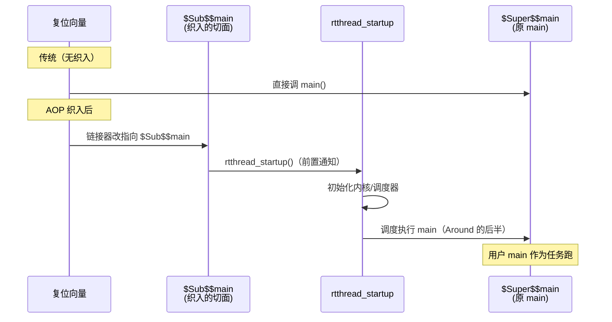

**设计精髓**：① **非侵入式**——不改用户的 `main()`；② **透明性**——用户代码无需感知 RTOS；③ **Around 语义**——`$Sub$$` 可决定是否调 `$Super$$`、何时调。

> [!note] 这是编译器/链接器级别的 AOP
> `$Super$$/$Sub$$` 是 ARMCC 特有的链接器特性（GCC 有类似 `__wrap`/`__real`）。它属于 AOP 里最"魔法"的一层——织入发生在链接期，源码里完全看不到。普通项目慎用（工具链绑定），但 RTOS 启动接管这种场景，它是最优雅的选择。

### 4.2 实现二：启动期织入（INIT_EXPORT 段收集）

**时机**：启动期（main 之前）  
**切入点**：启动序列  
**通知类型**：Before（在 main 之前执行）

这是 [[C/工程/自动初始化机制|自动初始化机制]] 的本质——用段属性 + 链接脚本，让模块自注册，启动代码遍历段调用。

```c
/* 各模块只写注册宏，不写调用语句 */
/* uart.c */
INIT_BOARD_EXPORT(uart_init);   /* 切面：uart 自注册 */

/* spi.c */
INIT_DEVICE_EXPORT(spi_init);   /* 切面：spi 自注册 */

/* main.c —— 完全不知道有哪些 init */
int main(void) {
    /* uart_init/spi_init 已在 main 之前被自动调用 */
}
```

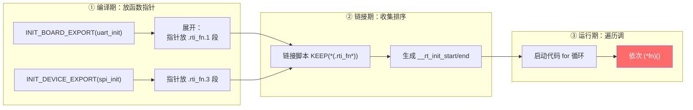

**设计精髓**：① **模块自治**——每个模块自己注册，main 免维护；② **优先级编排**——用段名后缀（`.1`/`.3`/`.6`）控制初始化顺序；③ **零运行期开销**——函数指针放 Flash，不占 RAM。

> [!tip] 这是最优雅的"启动期切面"
> 没有 INIT_EXPORT 的世界：main 里手写几十个 init，顺序错了崩、漏了崩、改一个动全身。有了它：模块自治注册，链接器收集，启动代码点名。这是 RT-Thread/Linux 把"初始化"这个横切关注点模块化的经典做法。详见 [[C/工程/自动初始化机制|自动初始化机制]]。

### 4.3 实现三：运行期织入（Hook / 回调）

**时机**：运行期（事件发生时）  
**切入点**：内核执行路径上的埋点  
**通知类型**：Before / After / Around（看埋点位置）  
**灵活度**：最高（运行时随时挂载/摘除）

这是最灵活、最常用的 AOP 形态。内核作者在执行路径上**埋点**（`if (hook) hook(...)`），应用开发者运行时挂载自己的切面。

```c
/* 内核作者埋的"切入点"（scheduler.c） */
void rt_schedule(void) {
    /* ... 即将切换线程 ... */
    RT_OBJECT_HOOK_CALL(rt_scheduler_hook, (from, to));  /* ★ 埋点 */
    /* ... 执行切换 ... */
}

/* 应用开发者写的"通知"（app.c） */
static void my_trace(struct rt_thread *from, struct rt_thread *to) {
    rt_kprintf("switch: %s -> %s\n", from->name, to->name);
}

/* 运行时挂载切面 */
rt_scheduler_sethook(my_trace);
```

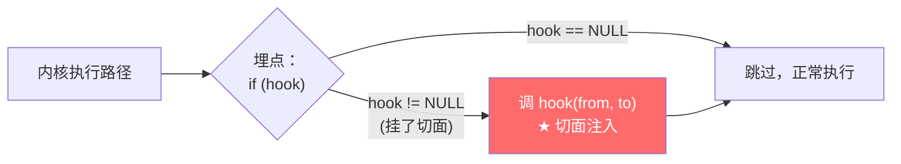

**设计精髓**：① **运行时灵活**——随时 `sethook`/`sethook(NULL)` 挂载摘除；② **多埋点**——切换点/空闲点/对象创建点，覆盖各种切入点；③ **零侵入**——不改内核源码就能扩展。

> [!important] 这就是回调/钩子的 AOP 视角
> [[C/工程/回调函数|回调函数]] 篇讲的"空抽屉→留电话→拨电话"三步机制，用 AOP 视角看就是：**切入点（埋点）+ 通知（hook 函数）+ 织入（运行时调用）**。RT-Thread 的三大神钩子（空闲/调度器/对象）就是三个预定义的切入点，应用挂不同的通知实现不同的横切需求（低功耗/Trace/泄漏排查）。

### 4.4 实现四：编译期织入（宏包裹）

**时机**：预处理期（编译前）  
**切入点**：宏调用处  
**通知类型**：Around（宏包围业务）

宏在预处理阶段展开，能把"切面代码"（日志/断言/计时）和"业务代码"展平到一起。这是 C 最朴素的 AOP——没有运行期机制，全靠预处理。

```c
/* 定义一个"环绕切面"宏：自动加日志+计时 */
#define TRACE_CALL(fn, ...)                          \
    do {                                             \
        rt_tick_t _s = rt_tick_get();                \
        LOG_D("enter " #fn);                         \
        fn(__VA_ARGS__);                             \
        LOG_D("exit " #fn " (%d ticks)",             \
              rt_tick_get() - _s);                   \
    } while(0)

/* 业务函数保持纯粹 */
rt_err_t rt_sem_take(rt_sem_t sem, rt_int32_t t) {
    /* 只有核心逻辑 */
}

/* 调用时用宏包裹，切面自动注入 */
TRACE_CALL(rt_sem_take, sem, 100);
/* 预处理后展开成：计时 + 日志 + rt_sem_take + 日志 */
```

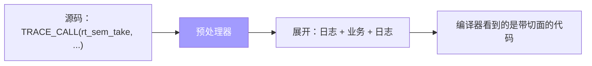

**设计精髓**：① **零运行期机制**——纯预处理，不需要内核支持；② **类型安全弱**——宏没类型检查（[[C/工程/内联函数|内联函数]]更安全）；③ **可移植**——任何 C 编译器都能用。

> [!warning] 宏包裹的局限
> 宏 AOP 的痛点：① 宏是文本替换，没类型检查，副作用风险（`MAX(x++, y++)`）；② 调试困难（展开后看不到原始结构）；③ 只能在"调用处"包裹，无法在"函数内部"织入。现代 C 更推荐用 inline 函数替代宏，但宏在 AOP（包裹式日志/断言）上仍有不可替代的价值。

### 4.5 实现五：硬件织入（中断 + 向量表）

**时机**：硬件事件发生瞬间  
**切入点**：中断向量表  
**通知类型**：最硬核的 Around（打断任何代码，强行注入）

中断是 AOP 的硬件形态——CPU 按向量表跳转，在硬件事件发生时**强行打断**主流程，执行 ISR。连软件代理人都省了，直接硬件织入。

```c
/* 向量表：硬件查这张"切入点表" */
__attribute__((section(".isr_vector")))
const void *g_pfnVectors[] = {
    /* ... */
    EXTI0_IRQHandler,       /* 第 23 项：PA0 下降沿的切入点 */
    /* ... */
};

/* ISR：硬件织入的"通知" */
void EXTI0_IRQHandler(void) {
    /* 硬件强行打断主循环，跳到这里执行 */
    HAL_GPIO_EXTI_IRQHandler(GPIO_PIN_0);
}
```

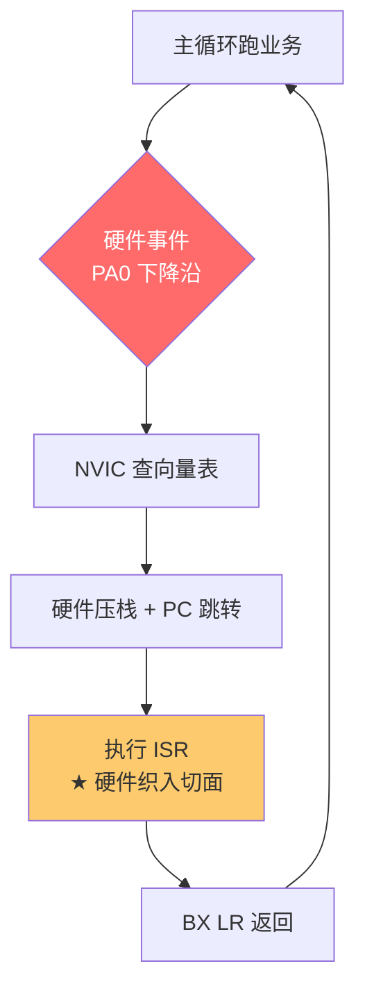

**设计精髓**：① **不可阻止**——硬件事件来了一定会打断（除非关中断）；② **实时性最强**——零延迟响应；③ **独立优先级**——高优先级能打断低优先级 ISR。

> [!note] 中断是"硬件替你织的切面"
> [[嵌入式/中断/中断的基础理解|中断的基础理解]] 讲的中断机制，用 AOP 视角看：向量表是"切入点表"，ISR 是"通知"，NVIC 是"织入器"。硬件事件来临时，CPU 把切面（ISR）强行织入到当前执行流——这是 AOP 最硬核、最实时的形态。和回调的区别：回调的代理人是软件框架，中断的代理人是硬件。

### 4.6 五种实现的对照与选型

```mermaid
flowchart TD
    Q["要织入什么切面？"] --> Q1{"启动相关？"}
    Q1 -- "接管程序入口" --> R1["用 $Super$$/$Sub$$<br/>(链接期)"]
    Q1 -- "模块初始化" --> R2["用 INIT_EXPORT<br/>(启动期)"]
    Q1 -- "否" --> Q2{"需要运行时灵活挂摘？"}
    Q2 -- "是" --> R3["用 Hook/回调<br/>(运行期)"]
    Q2 -- "否" --> Q3{"需要硬件实时响应？"}
    Q3 -- "是" --> R4["用 中断<br/>(硬件)"]
    Q3 -- "否" --> R5["用 宏包裹<br/>(编译期)"]
    style R3 fill:#fdcb6e,color:#333
    style R4 fill:#ff6b6b,color:#fff
```

| 切面需求 | 推荐实现 | 例子 |
|---------|---------|------|
| 接管程序入口 | 链接期 `$Super$$` | RTOS 启动 |
| 模块初始化 | 启动期 INIT_EXPORT | 驱动自注册 |
| 线程切换 Trace | 运行期 Hook | 调度器钩子 |
| 函数调用日志 | 编译期 宏包裹 | TRACE_CALL |
| 紧急硬件响应 | 硬件 中断 | 按键/通信/故障 |
| 栈溢出兜底 | 运行期 Hook | 调度器检查+钩子 |
| 空闲低功耗 | 运行期 Hook | 空闲钩子 |

---

## 5. RT-Thread AOP 实战：一个宏串起整个内核的切面

### 5.1 RT_OBJECT_HOOK_CALL：C 语言 AOP 的"标准动作"

RT-Thread 内核里，几乎每个关键事件都埋着一行这样的代码：

```c
RT_OBJECT_HOOK_CALL(rt_scheduler_hook, (from_thread, to_thread));
```

这个宏的展开结果（带 `RT_USING_HOOK` 开关时）是：

```c
#define RT_OBJECT_HOOK_CALL(func, argv) \
    do { \
        if (func) func argv; \
    } while (0)
```

把它套进调度器代码看，织入点长这样：

```c
/* 调度器内部的"切入点声明" */
#ifdef RT_USING_HOOK
    static void (*rt_scheduler_hook)(rt_thread_t from, rt_thread_t to) = RT_NULL;

    /* "注册器"——用户用这个挂自己的切面 */
    void rt_scheduler_sethook(void (*hook)(rt_thread_t from, rt_thread_t to))
    {
        rt_scheduler_hook = hook;
    }
#endif

void rt_schedule(void)
{
    /* ... 选出 to_thread ... */
    if (to_thread != curr_thread)
    {
        /* 织入点：内核流程执行到这里，自动回调用户的切面 */
        RT_OBJECT_HOOK_CALL(rt_scheduler_hook, (from_thread, to_thread));
        /* ... 真正切换上下文 ... */
    }
}
```

> [!tip] AOP 三要素一眼对应
> - **切入点** = `rt_schedule()` 里发生线程切换的那一行；
> - **通知** = `RT_OBJECT_HOOK_CALL(...)` 这条语句；
> - **切面** = 你用 `rt_scheduler_sethook()` 注册进去的那个函数。
> - **织入器** = `RT_USING_HOOK` 编译开关 + 那个 `if (func) func argv`。

### 5.2 RT-Thread 的三大"预定义切入点"

RT-Thread 不是一个宏走天下——它在内核各处**预埋了一整套切入点**，用户只管往里挂函数。最常用的三个：

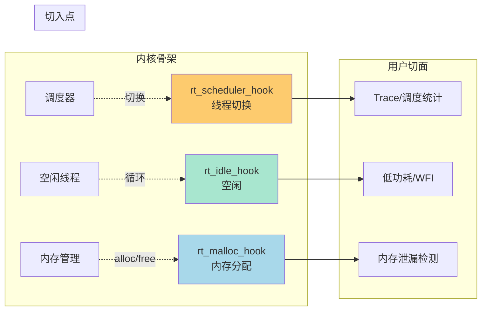

| 钩子 | 触发时机 | 注册函数 | 典型切面用途 |
|------|----------|----------|--------------|
| `rt_scheduler_hook` | 每次线程切换 | `rt_scheduler_sethook()` | CPU 利用率统计、调度时序 Trace |
| `rt_idle_hook` | 空闲线程每轮循环 | `rt_thread_idle_sethook()` | 进 WFI 低功耗、喂看门狗、后台整理 |
| `rt_malloc_hook` | 每次 `rt_malloc` 成功 | `rt_malloc_sethook()` | 内存用量统计、配额限制 |

> [!example]- 源码实证：调度器里两处织入
> ```c
> // 5.Scheduler 第476行——切前通知（可做 Trace）
> RT_OBJECT_HOOK_CALL(rt_scheduler_hook, (from_thread, to_thread));
>
> // 第505行——切换前再通知一次（可做收尾/统计）
> RT_OBJECT_HOOK_CALL(rt_scheduler_switch_hook, (from_thread));
> ```
> 同一次调度里 RT-Thread 织了**两个**切入点——一个在前（before）、一个在后（after），这正是 AOP 里"前置通知 / 后置通知"的标准分类。

### 5.3 你自己的模块也能这么写

把 RT-Thread 的套路搬到自己的驱动里，成本极低：

```c
/* motor 模块预留一个切面接口 */
typedef void (*motor_hook_t)(int event);
static motor_hook_t g_motor_hook;

void motor_set_hook(motor_hook_t hook) { g_motor_hook = hook; }

static void motor_event(int event)
{
    RT_OBJECT_HOOK_CALL(g_motor_hook, (event));  /* 织入点 */
}
```

上层无需改 motor 源码，注册一个 hook 就能监听所有事件——这就是 AOP 的"业务代码保持纯粹"。

---

## 6. 经典切面场景：AOP 到底拿来干嘛

无论用哪种织入时机，AOP 落地的场景高度收敛。下面五个占了实际工程 90% 的用量。

### 6.1 日志与 Trace

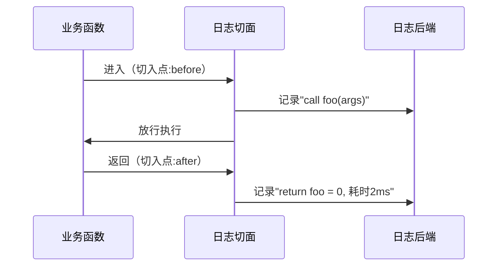

实现方式随织入时机不同：编译期用宏包裹（`TRACE_CALL`），运行期用 Hook，启动期用 `$Sub$$main` 框住整个程序。

### 6.2 性能监控

在切入点记录时间戳，after 时算差值。RT-Thread 的 `rt_scheduler_hook` 天然适合做"每个线程被切了多少次、累计跑了多久"的统计。

### 6.3 权限/参数校验

前置通知里检查入参合法性、调用者权限，不通过就拒绝执行。嵌入式里常见于"关键命令必须先过校验切面"。

### 6.4 资源管理

before 申请资源、after 释放资源——AOP 让"成对操作"不再散落。内存钩子 `rt_malloc_hook` / `rt_free_hook` 就是典型：每次分配/释放都记账，泄漏无处藏身。

### 6.5 事务与容错

把"开始事务 → 业务 → 提交/回滚"包成切面，业务函数只写纯逻辑。这与第 4 节的栈溢出钩子同理：正常路径不操心异常，异常来了切面兜底。

| 场景 | 通知类型 | 常见织入时机 | 典型实现 |
|------|----------|--------------|----------|
| 日志/Trace | before+after | 编译期宏 / 运行期 Hook | `TRACE_CALL`、`scheduler_hook` |
| 性能监控 | around | 运行期 Hook | 时间戳配对 |
| 参数校验 | before | 编译期宏 / 运行期 Hook | 断言、权限检查 |
| 资源管理 | around | 运行期 Hook | `malloc/free_hook` |
| 事务容错 | after(异常) | 运行期 Hook | `stack_overflow_hook` |

> [!note] 通知类型小抄
> - **before**：切入点之前执行（校验、日志）；
> - **after**：之后执行（收尾、日志）；
> - **around**：包裹整个过程，能决定是否放行、何时执行原逻辑（性能、资源、事务）。

---

## 7. AOP vs 装饰器模式 vs 中间件：三种"包裹注入"

这三种范式长得像——都是"在主逻辑外面套一层"——但定位完全不同。区分它们能避免乱套概念。

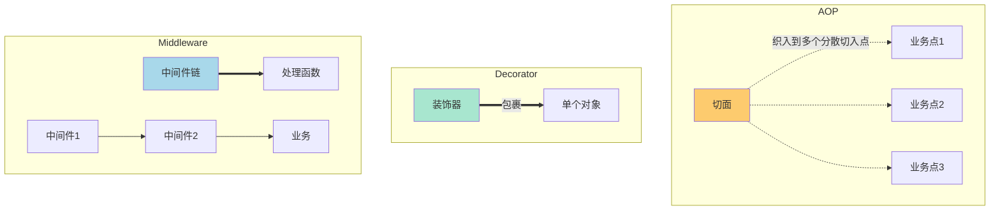

| 维度 | AOP | 装饰器模式 | 中间件（管道） |
|------|-----|------------|----------------|
| 包裹对象 | **多个分散切入点** | 单个对象/函数 | 单条请求流 |
| 切入依据 | 横切关注点（日志、安全） | 增强单个对象能力 | 请求处理链 |
| 织入方 | 框架/编译器/链接器 | 手动一层层套 | 框架按顺序串联 |
| 典型代表 | RT-Thread Hook、Java Spring AOP | Python `@decorator`、Java IO 流 | Express、RTOS 消息管道 |
| C 里像谁 | `rt_scheduler_sethook` | `fopen` 包 `open` | RT-Thread `rt_workqueue` 链 |

> [!important] 一句话区分
> - **AOP**：一把切面撒到很多地方（横向）；
> - **装饰器**：把一个对象裹了又裹（纵向加深）；
> - **中间件**：把请求排成一队依次过滤（流水线）。
> 嵌入式里最常见的是 AOP——因为 C 没有"对象包装"语法，但 Hook/Export 机制天然横切。

---

## 8. AOP 的代价与陷阱

AOP 不是银弹。织入得越隐晦，代价越大。下面四个坑是实际工程里反复踩的。

### 8.1 调试困难：控制流被"隐形"了

业务函数里看不到切面，但切面确实在执行。新人读 `motor_event()` 时不会想到"这里还藏着一个 hook"。

> [!warning] 真实事故
> 一个线程切换钩子里 `printf` 打了日志，结果调度器被拖慢 10 倍，整个系统实时性崩溃。bug 表现为"业务函数莫名超时"，但谁也想不到根因在一个看似无关的 hook 里。

**对策**：切面必须有统一命名（`*_hook`）、集中注册、并在文档/注释里标注切入点。

### 8.2 顺序依赖：多个切面打架

一个切入点可能挂了多个切面，执行顺序就成了问题。后注册的覆盖先注册的（单 hook 指针），或按链表顺序依次跑（多 hook 链）。顺序错了，日志时序、资源申请都会错乱。

### 8.3 性能开销：切面不是免费的

每次经过切入点都要 `if (func) func(...)`——一次判断 + 一次间接调用。在中断或高频路径（如 `rt_schedule`）里，切面必须极短、极快，否则拖垮实时性。

### 8.4 过度切面：把简单问题复杂化

不是所有横切逻辑都该用 AOP。如果某个"切面"其实只服务一个业务点，直接写在那里比绕一圈 hook 更清晰。AOP 适合**真正散布**的逻辑。

| 陷阱 | 表现 | 对策 |
|------|------|------|
| 控制流隐形 | bug 看不懂、定位难 | 统一命名 + 切入点文档化 |
| 顺序依赖 | 多切面结果错乱 | 注册顺序约定 / 用链表式 hook |
| 性能开销 | 高频路径变慢 | 关键路径禁 hook 或 `inline` |
| 过度切面 | 简单逻辑被绕复杂 | 只对"真散布"的逻辑用 AOP |

> [!tip] 判断该不该用 AOP 的三问
> 1. 这段逻辑是否**跨越多个模块**？否→直接写。
> 2. 业务函数**愿意为它分心**吗？愿意→直接写。
> 3. 它是**横切关注点**（日志/安全/监控/容错）吗？是→用 AOP。

---

## 9. 一页总结：面向切面编程的全貌

```mermaid
flowchart TD
    P["横切关注点<br/>日志/安全/监控/容错"] --> A["抽成切面 Aspect"]
    A --> W{"选哪种织入时机？"}
    W -- "链接期" --> L["$Super$$/$Sub$$<br/>接管 main"]
    W -- "启动期" --> S["INIT_*_EXPORT<br/>模块自注册"]
    W -- "运行期" --> H["Hook / 回调<br/>RT_OBJECT_HOOK_CALL"]
    W -- "编译期" --> C["宏包裹<br/>TRACE_CALL"]
    W -- "硬件" --> I["中断 ISR<br/>NVIC 织入"]
    L --> B["业务流程保持纯粹"]
    S --> B
    H --> B
    C --> B
    I --> B
    style P fill:#ff6b6b,color:#fff
    style A fill:#fdcb6e,color:#333
    style B fill:#a8e6cf,color:#333
```

**三句话讲透 AOP**：

1. **问题**：日志、安全这类逻辑散在每个函数里，既脏又难改；
2. **办法**：把它们抽成切面，在切入点由织入器自动插进去，业务代码只管业务；
3. **C 的做法**：没有 AOP 关键字，但用五种织入时机（链接/启动/运行/编译/硬件）达到了同样效果——你早就在用，只是没意识到它们是一家人。

> [!abstract] 速查口诀
> **散则抽，抽则面；点入机织，业务自纯。**
> - 散 = 横切关注点散落多处
> - 面 = 抽成切面
> - 点 = 切入点
> - 机 = 织入时机五选一
> - 织 = 织入器自动插入
> - 纯 = 业务代码保持纯粹

> [!example]- 决策树：遇到一个横切需求怎么办
> ```
> 这段逻辑是否跨多个模块？
> ├─ 否 → 直接写进业务函数，别上 AOP
> └─ 是 → 它属于哪类织入时机？
>        ├─ 接管程序入口 → 链接期 $Super$$
>        ├─ 模块自注册  → 启动期 INIT_EXPORT
>        ├─ 运行时要挂摘 → 运行期 Hook
>        ├─ 编译期已确定 → 编译期 宏包裹
>        └─ 硬件实时响应 → 中断 ISR
> ```

---

## 继续阅读

- [[C/工程/回调函数]] — 运行期 AOP 的基础构件：Hook 本质就是框架替你调的回调
- [[C/工程/自动初始化机制]] — 启动期 AOP 的完整实现：`INIT_*_EXPORT` 全家族
- [[C/工程/显示调用和隐式调用]] — 本篇的纲领篇：五种调用里 AOP 属于"隐式调用"的极致
- [[嵌入式/中断/中断的基础理解]] — 硬件 AOP：向量表即切入点表，NVIC 即织入器
- [[防御性编程]] — 切面的高频应用：校验、容错、兜底全是横切关注点

---

## 面试高频问题

> [!example]- Q1：什么是面向切面编程？C 语言能实现 AOP 吗？
> AOP 解决**横切关注点**问题——日志、安全、监控这类逻辑散布在很多模块里，既不属于任何一个、又难集中管理。AOP 把它们抽成**切面**，在**切入点**上由**织入器**自动插入，让业务代码保持纯粹。
> C 没有原生 AOP 关键字，但完全能实现——Linux 内核和 RT-Thread 用了**五种织入时机**：链接期（`$Super$$/$Sub$$`）、启动期（`INIT_EXPORT`）、运行期（Hook/回调）、编译期（宏包裹）、硬件（中断）。它们本质都是 AOP，只是织入时机不同。

> [!example]- Q2：RT-Thread 的 Hook 机制算不算 AOP？为什么？
> 算，而且是教科书级的运行期 AOP。`rt_scheduler_sethook()` 注册一个函数指针，调度器在切换线程时用 `RT_OBJECT_HOOK_CALL` 自动回调——切入点是"线程切换"，通知是那次调用，切面是用户注册的统计/Trace 函数，织入器是 `RT_USING_HOOK` 编译开关。用户完全不用改内核源码就能注入逻辑，这正是 AOP"业务代码保持纯粹"的精髓。

> [!example]- Q3：`$Super$$` 和 `$Sub$$` 是什么？为什么说它是链接期 AOP？
> 这是 ARM 链接器的符号机制：定义 `$Sub$$main` 后，链接器把所有对 `main` 的调用**重定向**到 `$Sub$$main`，而你可以在它里面调 `$Super$$main()` 转回真正的 main。于是你在**不改 main 源码、不重新编译**的前提下，于链接期"包裹"了程序入口——RT-Thread 就靠这个在 main 前后插入 RTOS 启动。它是 AOP 因为切入点是 main、切面是 Sub 函数、织入时机是链接。

> [!example]- Q4：AOP 有什么代价？工程里怎么规避？
> 主要四个坑：①**控制流隐形**——业务代码里看不到切面，调试难，对策是统一命名（`*_hook`）+ 切入点文档化；②**顺序依赖**——多切面顺序不定，对策是约定注册顺序或用链表式 hook；③**性能开销**——每次切入点多一次判断+间接调用，对策是高频路径禁 hook 或 inline；④**过度切面**——单点逻辑硬套 AOP，对策是只对真正散布的逻辑用。判断标准：跨多模块、属横切关注点、业务函数不愿分心，三者满足才上 AOP。

> [!example]- Q5：AOP、装饰器模式、中间件有什么区别？
> 都是"包裹注入"，但定位不同：**AOP** 是把一个切面**横向**撒到多个分散切入点；**装饰器**是**纵向**把单个对象裹了又裹，加深它的能力；**中间件**是把一条请求**排成队**依次过滤。嵌入式里 AOP 最常见，因为 C 没有"对象包装"语法，但 Hook/Export 天然横切。典型对应：RT-Thread scheduler_hook=AOP，fopen 包 open=装饰器，消息队列链=中间件。

> [!example]- Q6：什么场景适合用 AOP？什么场景不适合？
> **适合**：真正**散布**的横切关注点——日志/Trace、性能监控、参数校验、资源管理（成对 alloc/free）、事务容错。
> **不适合**：只服务单一业务点的逻辑（直接写更清晰）、强实时中断里（hook 的判断+调用有开销）、需要复杂返回值控制的（C 的 hook 通常 void，不好回传决策）。
> 一句话：散则抽面，独则直写。

> [!example]- Q7：中断算不算 AOP 的一种？它和 Hook 有什么本质区别？
> 算，它是**硬件层**的 AOP。向量表是切入点表，ISR 是通知，NVIC 是织入器——硬件事件一来，CPU 把 ISR 强行织入当前执行流。
> 和 Hook 的区别：Hook 的织入器是**软件框架**（可关、可摘、时机可控）；中断的织入器是**硬件**（除非关中断否则不可阻止，实时性最强）。两者都是 AOP，只是代理人不同——一个软件替你调，一个硬件替你调。

---

> **下一篇建议**：回到 [[C/工程/显示调用和隐式调用]] 看这五种机制如何统一在"调用"的框架下，或去 [[嵌入式/中断/中断的基础理解]] 看硬件 AOP 的完整机制。

