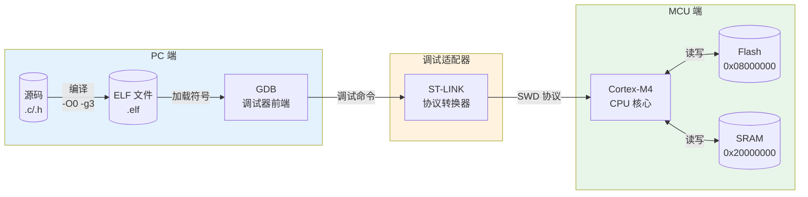
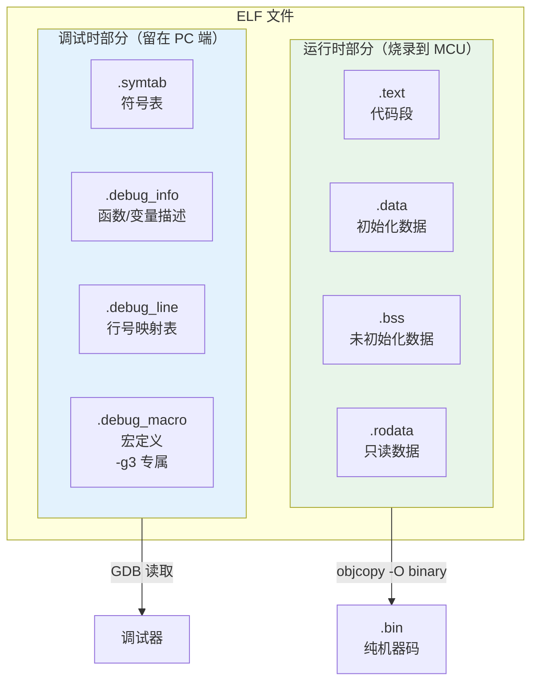
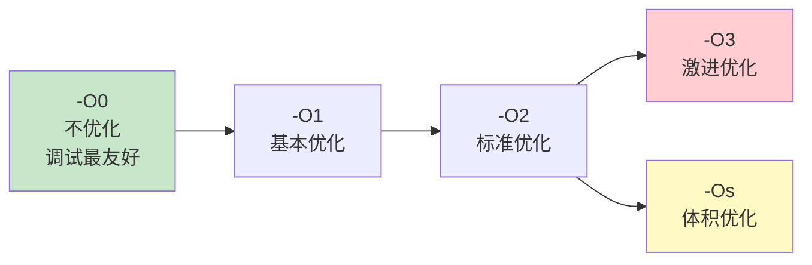
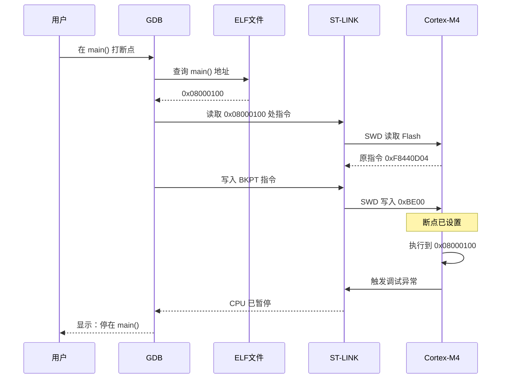
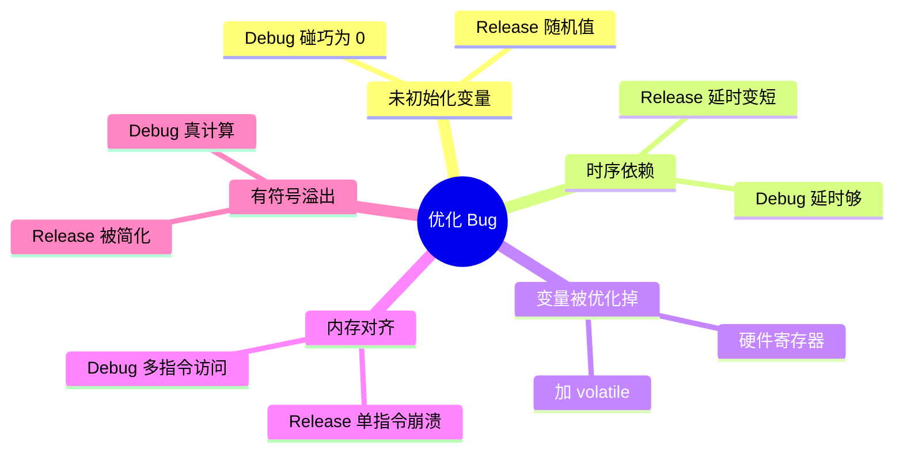
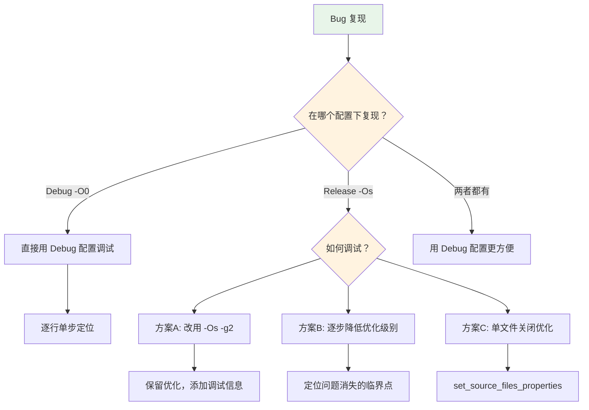

> [!abstract] 核心本质
> 调试的本质是**符号解析与指令控制的协作过程**：GDB 通过 ELF 中的符号表和 DWARF 信息，将源码级操作翻译成地址级操作，再通过 ST-LINK/SWD 协议控制 MCU 执行。理解这条链路，是高效调试的基础。

---

## 一、调试链路全景图

### 1.1 五层协作模型



### 1.2 各层职责

| 层级 | 组件 | 核心职责 | 关键配置 |
|------|------|---------|---------|
| 源码层 | `.c/.h` | 业务逻辑实现 | - |
| 编译层 | `arm-none-eabi-gcc` | 生成 ELF（机器码 + 符号） | `-O0 -g3` |
| 调试前端 | GDB | 符号解析、断点管理、用户交互 | `launch.json` |
| 协议转换 | ST-LINK | GDB 命令 ↔ SWD 信号 | SWD 频率、复位模式 |
| 目标执行 | Cortex-M4 | 执行指令、响应断点 | - |

---

## 二、ELF 文件结构深度解析

### 2.1 ELF 双重身份



### 2.2 符号文件本质

> **符号文件** = "名字 → 地址" 映射表 + "源码 → 机器码" 翻译字典

| 信息类型 | 存储位置 | 用途 |
|---------|---------|------|
| 函数地址 | `.symtab` / `.debug_info` | 断点定位 |
| 行号映射 | `.debug_line` | 源码级单步 |
| 变量位置 | `.debug_info` | 变量查看 |
| 宏定义 | `.debug_macro` | 宏展开查看（`-g3`） |

> [!warning] 黄金法则
> **固件与符号文件必须严格匹配** —— 一个字节都不能差。版本不匹配会导致断点乱跳、变量值错误、函数名错位。

### 2.3 常用分析命令

```bash
# 查看 ELF 段结构
arm-none-eabi-readelf -S build/Debug/Smartcar_V1.elf

# 查看符号表
arm-none-eabi-nm build/Debug/Smartcar_V1.elf | grep main

# 查看段大小
arm-none-eabi-size build/Debug/Smartcar_V1.elf

# 反汇编
arm-none-eabi-objdump -d build/Debug/Smartcar_V1.elf
```

---

## 三、编译优化与调试符号

### 3.1 优化级别光谱



| 级别 | 调试友好度 | 代码体积 | 执行速度 | 典型用途 |
|------|-----------|---------|---------|---------|
| `-O0` | ⭐⭐⭐⭐⭐ | 最大 | 最慢 | 开发调试 |
| `-O1` | ⭐⭐⭐ | 中等 | 较快 | 集成测试 |
| `-O2` | ⭐⭐ | 较小 | 快 | 性能调优 |
| `-O3` | ⭐ | 可能更大 | 最快 | 计算密集 |
| `-Os` | ⭐⭐ | **最小** | 中等 | 量产发布 |
| `-Og` | ⭐⭐⭐⭐ | 中等 | 较快 | 调试优化版 |

### 3.2 调试符号级别

| 级别 | 包含信息 | ELF 体积增量 | 典型用途 |
|------|---------|-------------|---------|
| `-g0` | 无调试信息 | 基准 | 量产发布 |
| `-g1` | 函数地址 + 行号 | +10~20% | 最小可调试 |
| `-g2` | 完整 DWARF 信息 | +30~50% | 标准调试 |
| `-g3` | 完整 DWARF + 宏定义 | +40~60% | 深度调试 |

### 3.3 工程配置示例

```cmake
# gcc-arm-none-eabi.cmake 关键配置

# Debug 配置：最大调试能力
set(CMAKE_C_FLAGS_DEBUG "-O0 -g3")

# Release 配置：最小体积，无调试信息
set(CMAKE_C_FLAGS_RELEASE "-Os -g0")

# 折中方案：保留优化，添加调试信息
# set(CMAKE_C_FLAGS_RELEASE "-Os -g2")
```

---

## 四、断点工作原理

### 4.1 断点注入流程



### 4.2 硬件断点 vs 软件断点

| 类型 | 原理 | 数量限制 | 适用场景 |
|------|------|---------|---------|
| **软件断点** | 替换指令为 `BKPT` | 无限制 | Flash 中的代码 |
| **硬件断点** | 使用 CPU 断点寄存器 | **Cortex-M4 仅 6 个** | RAM 代码、Flash 只读区 |

> [!danger] 致命陷阱
> Cortex-M4 只有 **6 个硬件断点寄存器**。如果在 Flash 只读区域设置过多断点，会报错 "Too many breakpoints"。

---

## 五、优化相关 Bug 类型

### 5.1 常见问题分类



### 5.2 典型案例与修复

#### 案例1：变量被优化掉

```c
// ❌ 错误：读取操作可能被删除
uint32_t *reg = (uint32_t *)0x40000000;
uint32_t value = *reg;  // 没使用 value，编译器可能删除

// ✅ 正确：使用 volatile
volatile uint32_t *reg = (volatile uint32_t *)0x40000000;
uint32_t value = *reg;  // 保证读取
```

#### 案例2：延时被优化

```c
// ❌ 错误：循环可能被删除
void delay_us(uint32_t us) {
    for (uint32_t i = 0; i < us * 10; i++);
}

// ✅ 正确：使用 volatile
void delay_us(uint32_t us) {
    for (volatile uint32_t i = 0; i < us * 10; i++);
}
```

### 5.3 volatile 使用场景

| 场景 | 原因 |
|------|------|
| 硬件寄存器 | 外部硬件会修改值 |
| 中断共享变量 | ISR 会异步修改 |
| RTOS 任务间共享 | 多任务并发访问 |
| 延时循环 | 防止被优化删除 |

---

## 六、launch.json 关键配置解析

### 6.1 核心字段

```json
{
    "name": "STM32Cube: Debug Smartcar_V1 (ST-LINK)",
    "type": "stlinkgdbtarget",
    "request": "launch",
    "deviceName": "STM32F407ZG",
    "deviceCore": "Cortex-M4",
    "runEntry": "main",
    "imagesAndSymbols": [{
        "imageFileName": "${workspaceFolder}/build/Debug/Smartcar_V1.elf",
        "symbolFileName": "${workspaceFolder}/build/Debug/Smartcar_V1.elf"
    }],
    "serverInterface": "SWD",
    "serverInterfaceFrequency": "1000",
    "serverReset": "Connect under reset"
}
```

### 6.2 字段含义速查

| 字段 | 含义 | 调试影响 |
|------|------|---------|
| `imageFileName` | 烧录的镜像文件 | 决定 MCU 运行什么代码 |
| `symbolFileName` | 符号文件 | 决定 GDB 如何解析地址 |
| `runEntry` | 入口函数 | 下载后自动停在 main |
| `serverReset` | 复位模式 | "Connect under reset" 解决时钟配置错误 |
| `serverInterfaceFrequency` | SWD 频率 | 连接不稳定时降低 |

---

## 七、Bug 调试决策树



---

## 八、避坑清单

> [!warning] 调试避坑指南
> 1. **固件与 ELF 必须匹配** —— 版本不一致会导致断点乱跳
> 2. **硬件断点有限** —— Cortex-M4 只有 6 个
> 3. **Release Bug 需特殊处理** —— 用 `-Os -g2` 或单文件关闭优化
> 4. **volatile 不能省** —— 硬件寄存器、共享变量、延时循环
> 5. **初始化所有变量** —— 避免未初始化变量的随机行为

---

## 九、日志信息

> [!note] 学习日志
> - **2026-04-02**：完成调试全景数据流知识体系构建，涵盖 ELF 结构、优化级别、断点原理、优化 Bug 类型等核心内容。

---

## 🔗 知识延伸

- ⬆️ **上位知识**：[[嵌入式开发工具链]]、[[Cortex-M4 架构]]
- ⬇️ **下位知识**：[[HardFault 排查]]、[[GDB 命令手册]]、[[链接脚本解析]]
- ➡️ **平级关联**：[[ST-LINK 调试器]]、[[SWD 协议]]、[[CMake 构建系统]]
- [批次1：调试全景（你先建立“大脑地图”）_你现在的调试链@20260402_205414](../../copilot/copilot-conversations/批次1：调试全景（你先建立“大脑地图”）_你现在的调试链@20260402_205414.md)