## 【问题诊断】

你笔记里对 CMake 三层职责的理解已经正确。现在我来帮你**系统化构建 CMake 知识体系**——从本质认知到 CMakeLists.txt 编写规范，再到你项目中的三层架构设计理念。这些内容能让你理解"为什么用 CMake"以及"怎么写好 CMakeLists.txt"。

---

## 【CMake 本质认知】

### CMake 是什么？


**一句话定义**：CMake 是**构建系统生成器**（Build System Generator），不是编译器，也不是构建器。它把 `CMakeLists.txt` 翻译成平台相关的构建文件（Makefile、Ninja、VS 工程）。

### CMake 在工具链中的位置

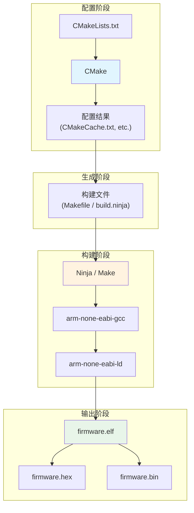

### 为什么嵌入式需要 CMake？

| 痛点 | 传统 Makefile | CMake 方案 |
|------|---------------|------------|
| **跨平台** | Windows/Linux 命令不同 | 统一抽象，自动适配 |
| **依赖管理** | 手动写 `.d` 文件规则 | 自动推导头文件依赖 |
| **IDE 集成** | 各 IDE 格式不同 | 生成 VS/Keil/CLion 工程 |
| **交叉编译** | 手动设置工具链变量 | `toolchain file` 统一管理 |
| **模块复用** | 复制粘贴 Makefile | `find_package` / `add_subdirectory` |
| **增量编译** | 手动写依赖规则 | 自动处理，只编译改动文件 |

---

## 【CMakeLists.txt 核心功能】

### CMakeLists.txt 是什么？

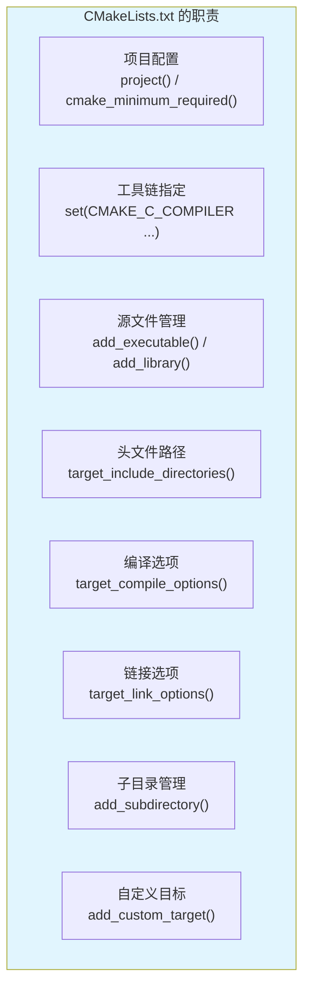

### 核心 CMake 函数速查

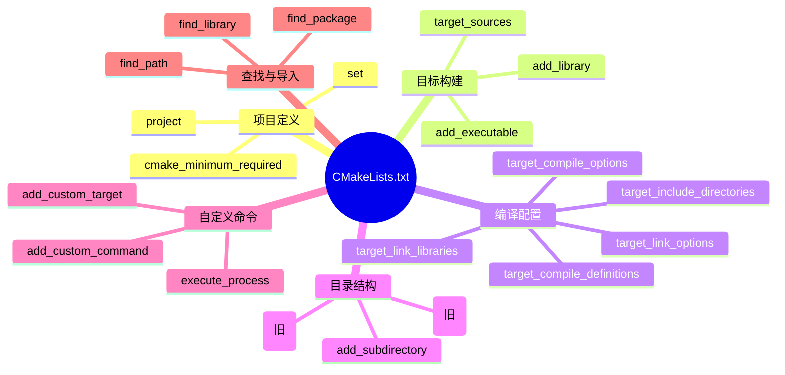

### 典型嵌入式 CMakeLists.txt 结构

```cmake
# ==================== 1. 项目定义 ====================
cmake_minimum_required(VERSION 3.22)

# 交叉编译工具链文件（必须在 project 之前）
set(CMAKE_TOOLCHAIN_FILE ${CMAKE_SOURCE_DIR}/cmake/toolchain.cmake)

project(Smartcar_V1 C ASM)

# ==================== 2. 编译器配置 ====================
set(MCU_FAMILY STM32F4)
set(MCU_TYPE STM32F407xx)
set(CPU_PARAMETERS 
    -mcpu=cortex-m4
    -mfpu=fpv4-sp-d16
    -mfloat-abi=hard
)

# ==================== 3. 编译选项 ====================
add_compile_options(
    ${CPU_PARAMETERS}
    -Wall
    -Wextra
    -Wpedantic
    -Os                      # 优化等级
    -ffunction-sections      # 每个函数独立段
    -fdata-sections          # 每个数据独立段
)

# ==================== 4. 链接选项 ====================
add_link_options(
    ${CPU_PARAMETERS}
    -specs=nano.specs        # 精简 libc
    -specs=nosys.specs       # 无操作系统
    -Wl,--gc-sections        # 链接时删除未使用段
    -Wl,-Map=${PROJECT_NAME}.map
)

# ==================== 5. 链接脚本 ====================
set(LINKER_SCRIPT ${CMAKE_SOURCE_DIR}/ld/STM32F407VETx_FLASH.ld)

# ==================== 6. 源文件与目标 ====================
add_executable(${PROJECT_NAME}
    ${APP_SOURCES}
    ${HAL_SOURCES}
    # ...
)

target_include_directories(${PROJECT_NAME} PRIVATE
    ${CMAKE_SOURCE_DIR}/App
    ${CMAKE_SOURCE_DIR}/Drivers
)

target_link_libraries(${PROJECT_NAME} PRIVATE
    -T${LINKER_SCRIPT}
)

# ==================== 7. 后处理（生成 hex/bin） ====================
add_custom_command(TARGET ${PROJECT_NAME} POST_BUILD
    COMMAND ${CMAKE_OBJCOPY} -O ihex $<TARGET_FILE:${PROJECT_NAME}> ${PROJECT_NAME}.hex
    COMMAND ${CMAKE_OBJCOPY} -O binary $<TARGET_FILE:${PROJECT_NAME}> ${PROJECT_NAME}.bin
    COMMENT "Generating hex and bin files..."
)
```

---

## 【你的项目三层架构解析】

### 三层架构设计理念

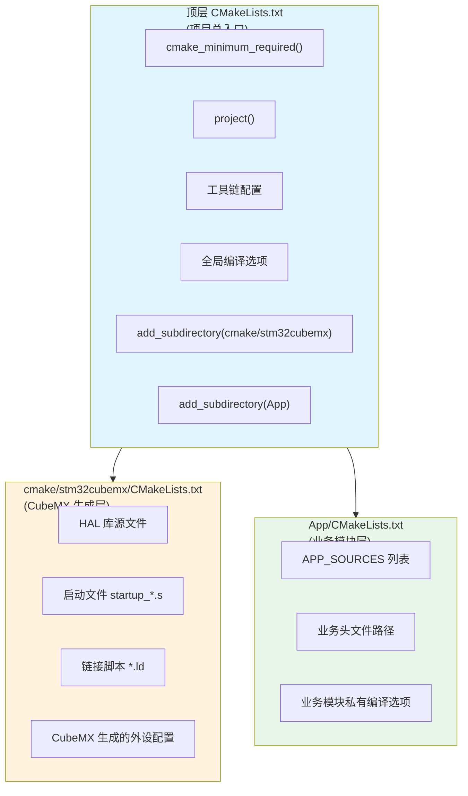

### 三层职责详解

| 层级 | 文件位置 | 职责 | 维护方式 |
|------|----------|------|----------|
| **顶层** | `CMakeLists.txt` | 项目定义、工具链、全局配置、子目录入口 | 手工维护 |
| **CubeMX 层** | `cmake/stm32cubemx/CMakeLists.txt` | HAL 库、启动文件、链接脚本 | CubeMX 生成覆盖 |
| **App 层** | `App/CMakeLists.txt` | 业务源文件、业务头文件路径 | 手工维护 |

### 为什么这样分层？

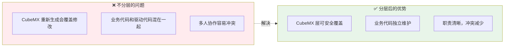

---

## 【CMakeLists.txt 编写规范】

### 核心原则

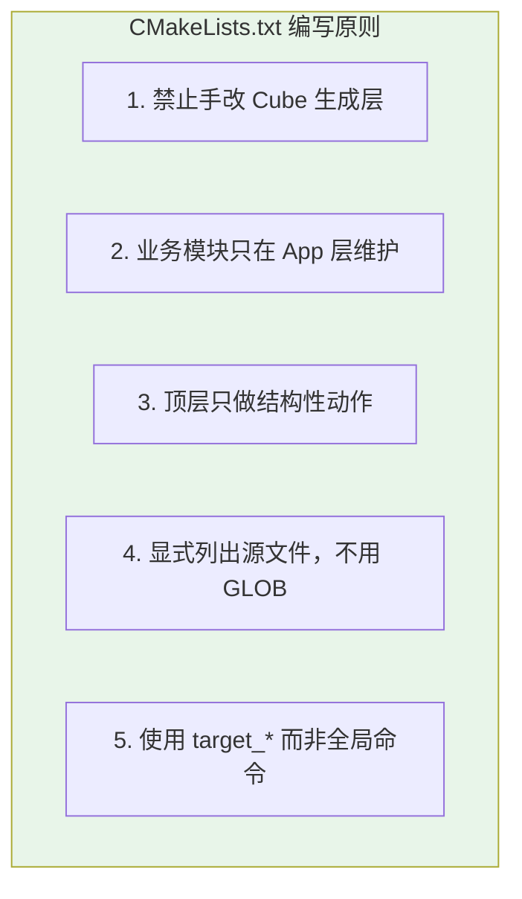

### 为什么不用 GLOB？

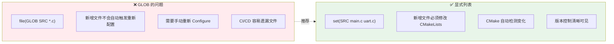

### target_* vs 全局命令

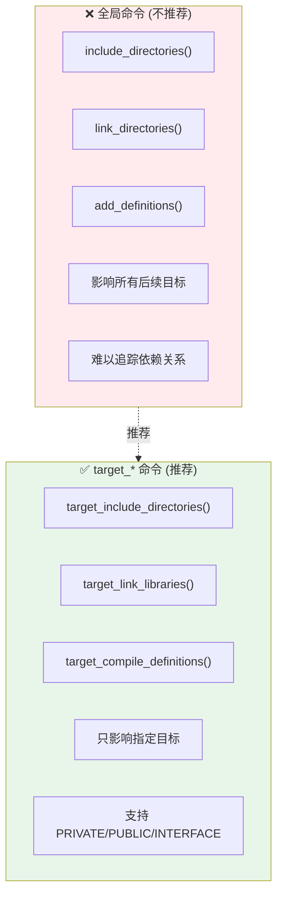

### PRIVATE / PUBLIC / INTERFACE 详解

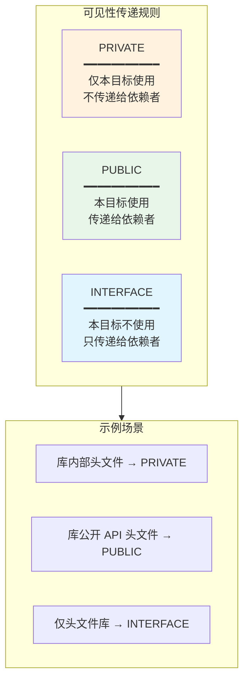

```cmake
# 示例：App 模块配置
target_include_directories(${PROJECT_NAME} PRIVATE
    ${CMAKE_SOURCE_DIR}/App           # 业务头文件，仅本目标使用
)

target_include_directories(${PROJECT_NAME} PUBLIC
    ${CMAKE_SOURCE_DIR}/Drivers/CMSIS # 驱动头文件，可能被其他模块使用
)

target_compile_definitions(${PROJECT_NAME} PRIVATE
    STM32F407xx                       # 芯片型号定义
    USE_HAL_DRIVER                    # HAL 库开关
)
```

---

## 【变更模块的标准动作】

### 新增源文件流程

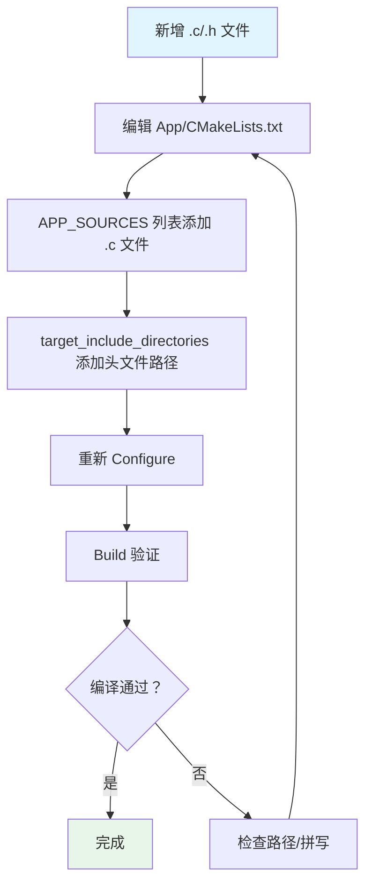

### 实际操作示例

```cmake
# App/CMakeLists.txt

# ==================== 源文件列表 ====================
set(APP_SOURCES
    # 主程序
    main.c
    
    # 驱动模块
    Drivers/uart.c
    Drivers/spi.c
    Drivers/i2c.c
    
    # 业务模块
    App/motor_control.c
    App/sensor_process.c
    App/pid_controller.c
    
    # 新增文件在这里添加 ↓
    App/encoder.c          # ← 新增
)

# ==================== 头文件路径 ====================
target_include_directories(${PROJECT_NAME} PRIVATE
    ${CMAKE_SOURCE_DIR}/App
    ${CMAKE_SOURCE_DIR}/App/Drivers
    ${CMAKE_SOURCE_DIR}/App/App
    
    # 新增路径在这里添加 ↓
    ${CMAKE_SOURCE_DIR}/App/Encoder    # ← 新增（如果需要）
)
```

---

## 【CMake 构建流程】

### 完整构建流程

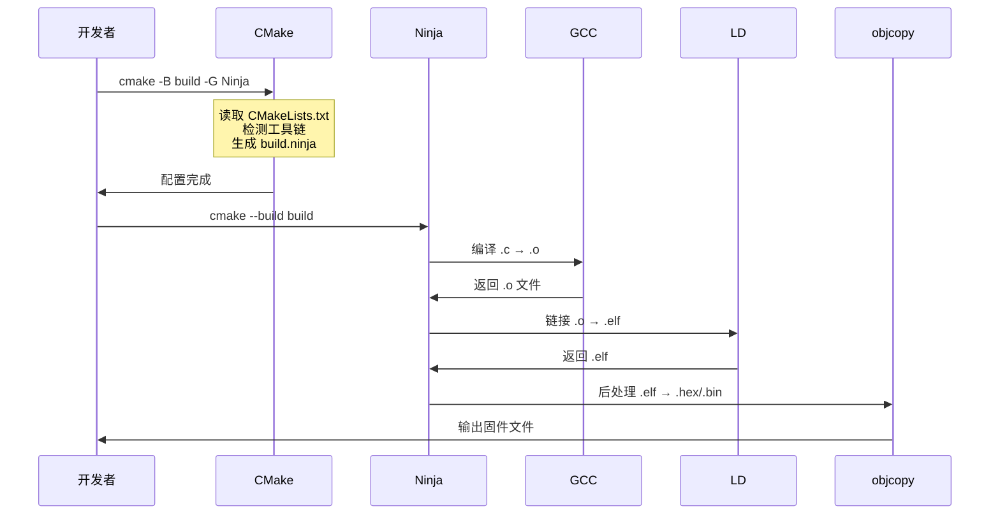

### 常用 CMake 命令

```bash
# 1. 配置项目（生成构建文件）
cmake -B build -G Ninja -DCMAKE_BUILD_TYPE=Debug

# 2. 编译项目
cmake --build build

# 3. 清理构建产物
cmake --build build --target clean

# 4. 重新配置（修改 CMakeLists.txt 后）
cmake -B build

# 5. 查看详细编译命令
cmake --build build -- VERBOSE=1

# 6. 安装（嵌入式一般不用）
cmake --install build
```

---

## 【交叉编译工具链文件】

### toolchain.cmake 示例

```cmake
# cmake/toolchain.cmake

# ==================== 工具链路径 ====================
set(TOOLCHAIN_PREFIX arm-none-eabi-)
set(CMAKE_C_COMPILER ${TOOLCHAIN_PREFIX}gcc)
set(CMAKE_CXX_COMPILER ${TOOLCHAIN_PREFIX}g++)
set(CMAKE_ASM_COMPILER ${TOOLCHAIN_PREFIX}gcc)
set(CMAKE_LINKER ${TOOLCHAIN_PREFIX}ld)
set(CMAKE_OBJCOPY ${TOOLCHAIN_PREFIX}objcopy)
set(CMAKE_OBJDUMP ${TOOLCHAIN_PREFIX}objdump)
set(CMAKE_SIZE ${TOOLCHAIN_PREFIX}size)

# ==================== 交叉编译标志 ====================
set(CMAKE_CROSSCOMPILING TRUE)
set(CMAKE_TRY_COMPILE_TARGET_TYPE STATIC_LIBRARY)

# ==================== 查找工具 ====================
find_program(CMAKE_C_COMPILER ${TOOLCHAIN_PREFIX}gcc REQUIRED)
find_program(CMAKE_CXX_COMPILER ${TOOLCHAIN_PREFIX}g++ REQUIRED)
find_program(CMAKE_ASM_COMPILER ${TOOLCHAIN_PREFIX}gcc REQUIRED)
```

### 工具链文件的作用


---

## 【大师的工程建议】

### CMakeLists.txt 检查清单

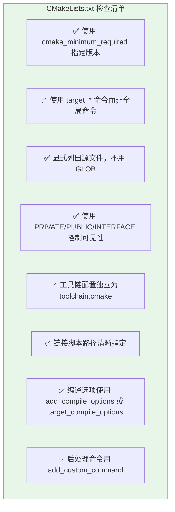

### 避坑指南

| 问题 | 现象 | 解决方案 |
|------|------|----------|
| **GLOB 不更新** | 新增文件没编译 | 改用显式列表 |
| **全局命令污染** | 头文件路径混乱 | 用 `target_include_directories` |
| **工具链未生效** | 用了系统 gcc | 检查 `CMAKE_TOOLCHAIN_FILE` |
| **链接脚本未找到** | 链接失败 | 检查路径是否正确 |
| **增量编译失效** | 每次全量编译 | 检查 `CMAKE_CONFIGURE_DEPENDS` |

### 推荐的项目结构

```
Smartcar_V1/
├── CMakeLists.txt              # 顶层入口
├── cmake/
│   ├── toolchain.cmake         # 工具链配置
│   └── stm32cubemx/
│       └── CMakeLists.txt      # CubeMX 生成层
├── App/
│   ├── CMakeLists.txt          # 业务模块层
│   ├── main.c
│   └── ...
├── Drivers/                    # HAL 库（CubeMX 管理）
├── ld/
│   └── STM32F407VETx_FLASH.ld  # 链接脚本
└── build/                      # 构建输出目录
```

---

**一句话总结**：CMake 是**构建系统的翻译官**，CMakeLists.txt 是你写给它的**构建说明书**。你的三层架构设计（顶层入口 + CubeMX 层 + App 层）是嵌入式项目的最佳实践——让 CubeMX 生成的代码和业务代码各司其职，互不干扰。

---

## 🔗 知识延伸

- ⬆️ **上位知识**：[[_MOC-开发流水线总览]]、[[嵌入式开发工具链]]
- ➡️ **平级关联**：[[配置文件链路]]、[[文件格式]]
- ⬇️ **下位知识**：toolchain.cmake 编写规范、CMakePresets.json 详解
