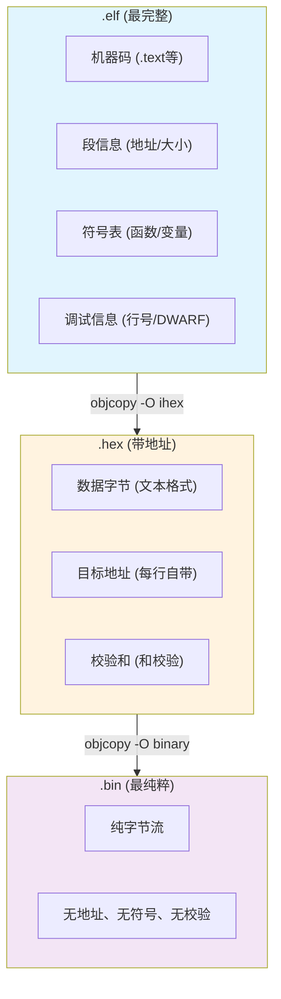
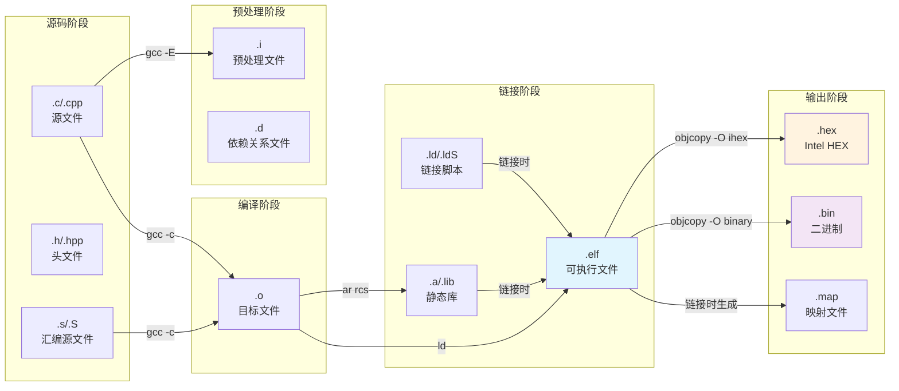
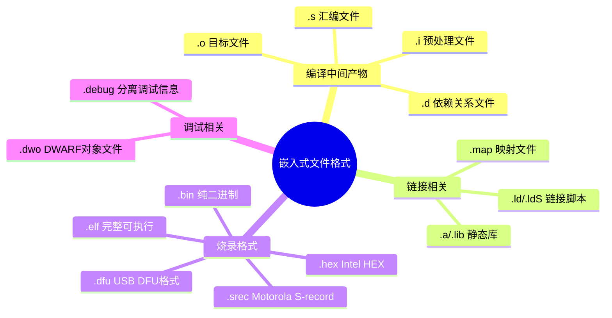
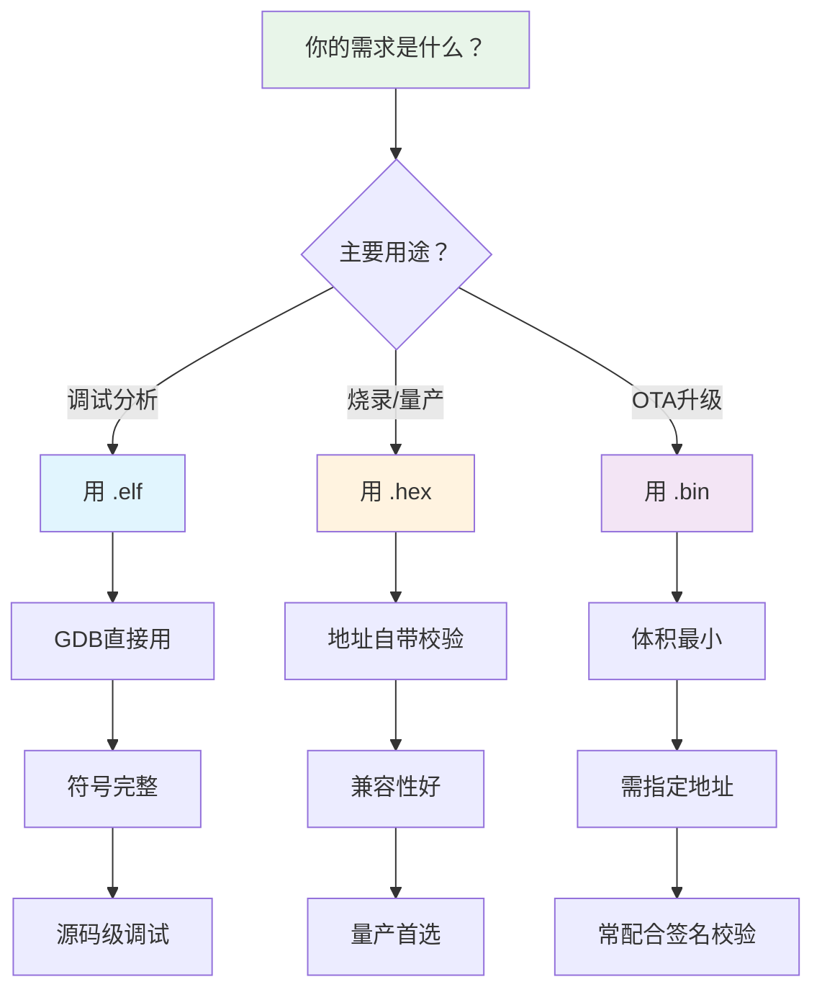
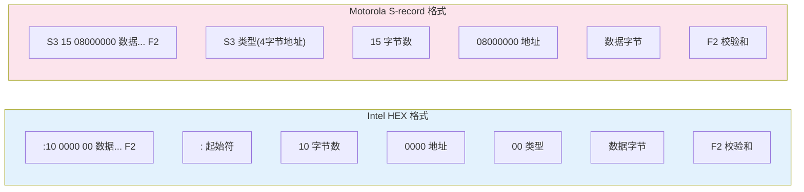
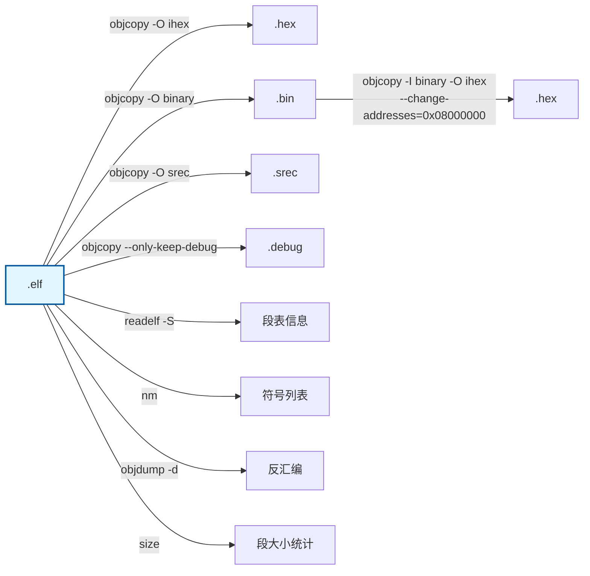
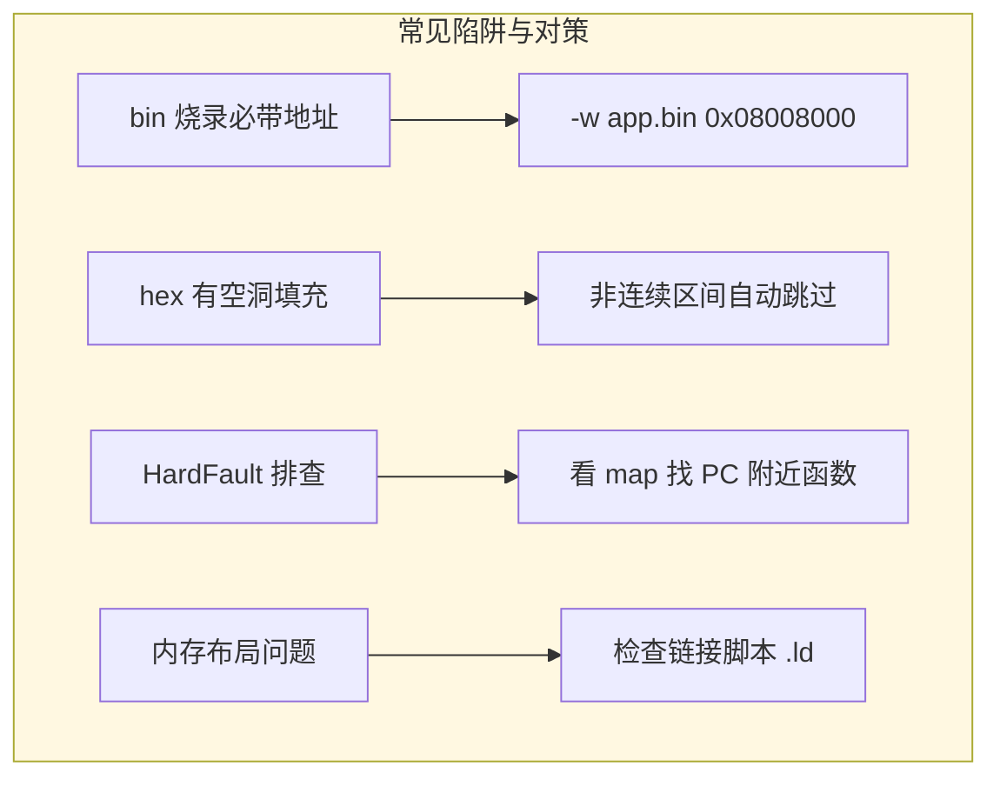
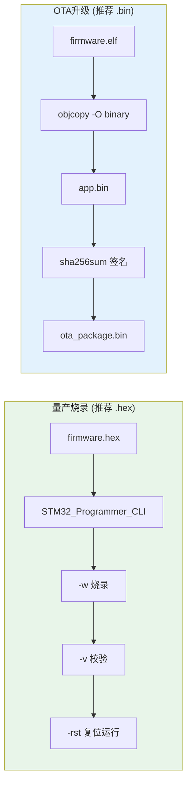

---
aliases:
  - elf/hex/bin
  - 固件文件格式
  - 编译产物
tags:
  - 调试/知识体系
  - 编译/产物
date: 2026-04-01
status: 🌿草稿
---

## 【核心三件套的深度剖析】

### 信息含量递减图

### 三者的本质区别

| 特性 | .elf | .hex | .bin |
|------|------|------|------|
| **地址信息** | 段头表完整记录 | 每行自带地址 | 无，需外部指定 |
| **符号信息** | 完整符号表 | 无 | 无 |
| **调试信息** | DWARF完整 | 无 | 无 |
| **空洞处理** | 支持（.bss段） | 支持（跳过不写） | 填充0x00或0xFF |
| **典型大小** | 最大 | 中等（文本编码+开销） | 最小 |
| **主要用途** | 调试、分析 | 烧录、量产 | OTA、Bootloader |

---

## 【补充：嵌入式常见文件格式全景】

### 编译链路全景图

### 文件格式分类总览

---

## 【工程实践：文件选型决策树】

---

## 【Intel HEX vs Motorola S-record 格式对比】

---

## 【文件转换关系图】

---

## 【大师的工程建议】

### 避坑清单流程图

### 量产推荐流程

---

**一句话总结**：`.elf` 是调试的根，`.hex` 是烧录的盾，`.bin` 是传输的剑。理解它们的本质，你就能在"烧不进去"、"跑不起来"、"符号找不到"这些问题面前游刃有余。

---

## 🔗 知识延伸

- ⬆️ **上位知识**：[[_MOC-开发流水线总览]]、[[调试全景数据流]]
- ➡️ **平级关联**：[[CMake]]（产物如何生成）、[[配置文件链路]]（产物的烧录配置）
- ⬇️ **下位知识**：链接脚本 `.ld` 解析、objcopy 用法