---
aliases:
  - ISP
  - In-System Programming
  - 救砖
  - Bootloader 烧录
  - 下载模式
tags:
  - 调试/知识体系
  - 烧录/ISP
  - STM32
  - ESP32
  - CH552
date: 2026-06-27
status: 🌿草稿
---

> [!abstract] 核心本质
> ISP（In-System Programming，在系统编程）= **不依赖专用调试器，靠芯片内置 Bootloader 完成烧录**。它的价值是"**兜底救砖**"：当 SWD 引脚被锁死、固件跑飞、甚至没有调试器时，ISP 是最后一根稻草。不同芯片的 ISP 方式截然不同（STM32 用 BOOT0+UART、ESP32 用 GPIO0+USB、CH552 用 D+/D-），但原理统一：**让芯片上电时跑 ROM 里的 Bootloader，而不是跑用户的烂固件**。

---

## 一、ISP 的统一原理

### 1.1 为什么 ISP 能救砖

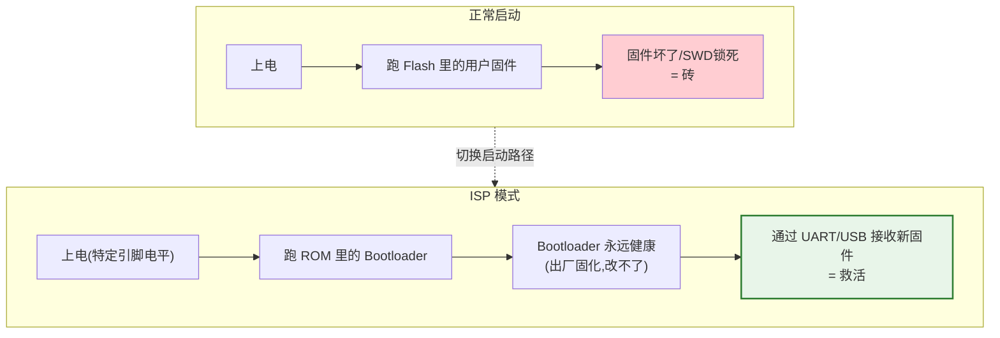

> [!important] ISP 救砖的根本保证
> Bootloader 存在 **ROM（只读，出厂光刻）**，**任何操作都改不了它**。所以无论你的固件多烂、Flash 多乱，只要 ROM 没物理损坏，就能进 ISP 重烧。**ROM 是芯片的"救命稻草"。**

### 1.2 ISP vs SWD 烧录

| 维度 | SWD/JTAG 烧录 | ISP 烧录 |
|------|--------------|----------|
| **需要** | 调试器（ST-Link 等） | 一根线（UART/USB） |
| **速度** | 快 | 慢-中 |
| **依赖** | SWD 引脚可用 | Bootloader 可用 |
| **能救砖** | 引脚锁死时 ❌ | ✅（BOOT 引脚硬件级） |
| **能调试** | ✅ | ❌（只烧不调） |
| **场景** | 日常开发 | 量产/救砖/无调试器 |

> [!tip] 经验法则
> 日常开发用 SWD（快+能调试）；**救砖和无调试器场景用 ISP**。两者互补，不冲突。

---

## 二、三种芯片的 ISP 方式对比

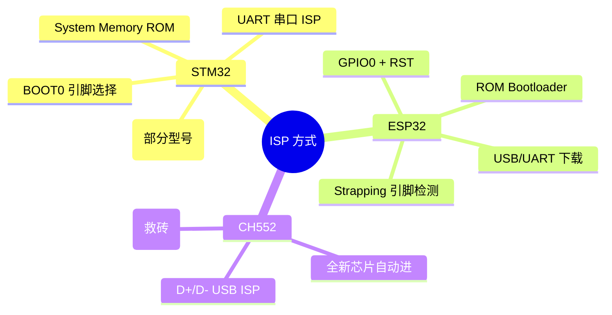

---

## 三、STM32 ISP：BOOT0 + System Memory

### 3.1 启动模式（BOOT0 / BOOT1）

STM32 通过 BOOT0、BOOT1(PB2) 引脚**硬件选择**上电跑哪段代码：

| BOOT1(PB2) | BOOT0 | 启动区域 | 用途 |
|-----------|-------|---------|------|
| x | **0** | **Main Flash** (0x08000000) | ✅ 正常运行（99%场景） |
| 0 | **1** | **System Memory** (0x1FFF F000) | 🔄 **ISP 串口烧录模式** |
| 1 | 1 | SRAM | 调试模式（很少用） |

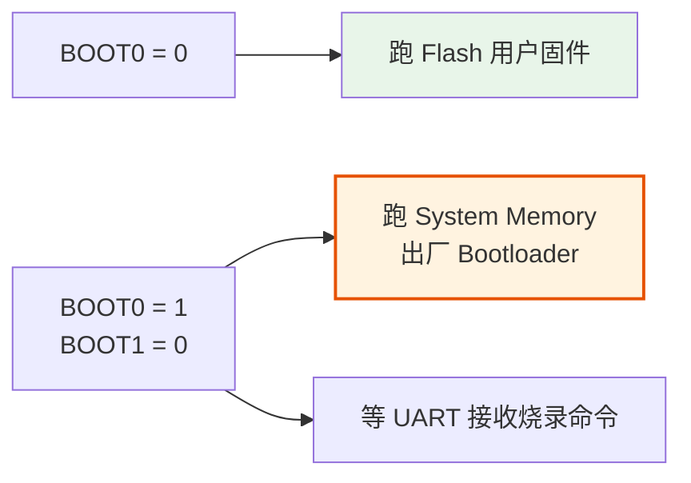

### 3.2 STM32 ISP 烧录流程

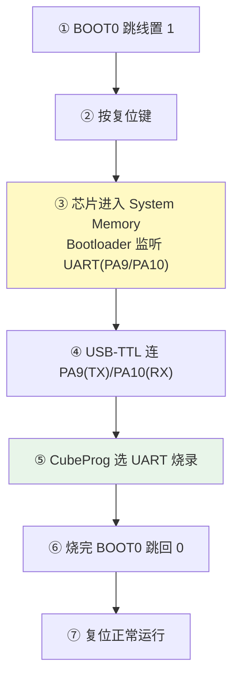

### 3.3 STM32 ISP 命令（CubeProg）

```bash
# 通过 UART 连接 ISP（COM3，波特率由 Bootloader 自动协商）
STM32_Programmer_CLI -c port=COM3 br=115200

# 烧录
STM32_Programmer_CLI -c port=COM3 br=115200 -w firmware.hex -v -rst
```

> [!warning] BOOT1(PB2) 被外部拉高
> 串口烧录时如果 PB2 被外部电路拉高，即使 BOOT0=1 也会进 **SRAM 模式**而非 ISP。检查 PB2 电平。

### 3.4 部分 STM32 支持 USB-DFU

F4 等型号的 System Memory Bootloader 还支持 USB DFU 模式（无需 USB-TTL）：

```bash
# USB DFU 模式（BOOT0=1，USB 连芯片原生 USB 口）
STM32_Programmer_CLI -c port=usb -w firmware.hex
```

---

## 四、ESP32 ISP：GPIO0 + RST 下载模式

### 4.1 Strapping 引脚机制

ESP32 上电时检测一批 **Strapping 引脚**的电平，决定启动模式。关键引脚是 **GPIO0**：

| GPIO0 | 启动模式 |
|-------|---------|
| **高（默认上拉）** | 正常启动，跑 Flash |
| **低（接 GND）** | 🔄 **下载模式（ISP）** |

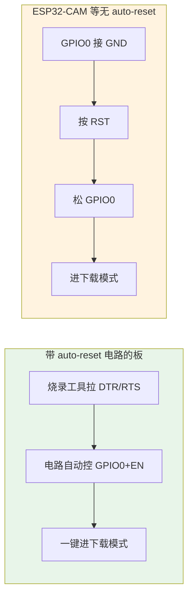

### 4.2 ESP32 下载模式流程

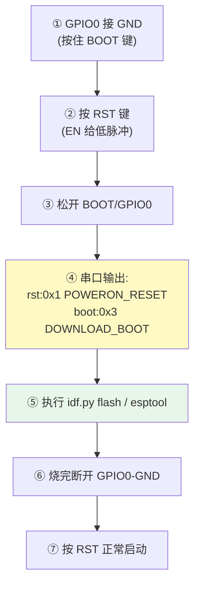

> [!tip] 识别是否进入下载模式
> 进下载模式后，串口会打印 `DOWNLOAD_BOOT(UART0/UART1/SDIO...)`。若看到的是正常启动日志（没这行），说明没进去，重新操作 GPIO0+RST。

### 4.3 ESP32 自动下载电路原理

带 auto-reset 的板子（多数 ESP32 DevKit），烧录工具通过 **DTR/RTS** 两根 USB 控制线自动控制 EN(=RST) 和 GPIO0：

```
DTR=高 RTS=低 → EN=低(复位) GPIO0=低 → 进下载模式
DTR=低 RTS=高 → EN=高 GPIO0=高 → 正常运行
```

这就是为什么带 auto-reset 的板子 `idf.py flash` 全自动，而 ESP32-CAM 要手动。

---

## 五、CH552 ISP：USB 免工具 + UART 救砖

### 5.1 CH552 的独特优势：USB ISP

CH552 内置 USB 控制器，Bootloader 支持**直接通过 USB D+/D- 烧录**，无需任何 USB-TTL：

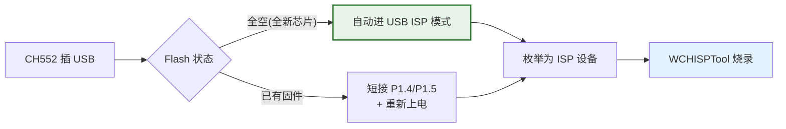

### 5.2 CH552 USB ISP 流程

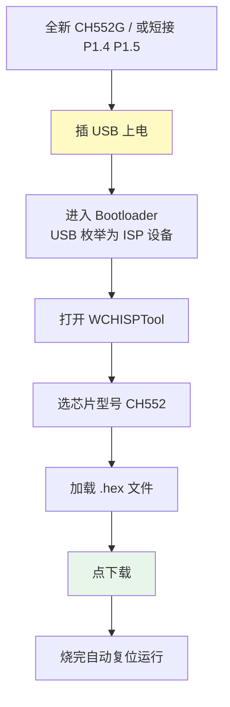

> [!tip] 新手超友好
> CH552 全新芯片**第一次烧录不需要任何短接**——Flash 全空时 Bootloader 自动接管。插上 USB，打开 WCHISPTool 直接烧。

### 5.3 CH552 烧录工具

| 工具 | 平台 | 说明 |
|------|------|------|
| **WCHISPTool**（官方） | Windows | GUI，新手首选 |
| **ch55xtool** | 跨平台 | 命令行/第三方 |
| **vnproch55x** | Windows | WCH 另一工具 |

```bash
# ch55xtool 命令行烧录
ch55xtool flash firmware.hex
```

### 5.4 CH552 救砖：UART ISP

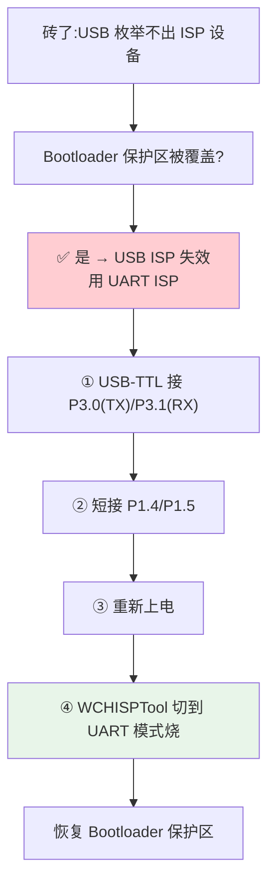

> [!danger] CH552 的禁区：0x3800~0x3FFF
> 这 2KB 是 **USB ISP Bootloader 保护区**。一旦用户固件覆盖它，**USB 烧录永久失效**，只能靠 UART ISP 救（且需额外 USB-TTL）。烧录前务必检查 hex 大小 < 14KB。

---

## 六、救砖大全（按症状对号入座）

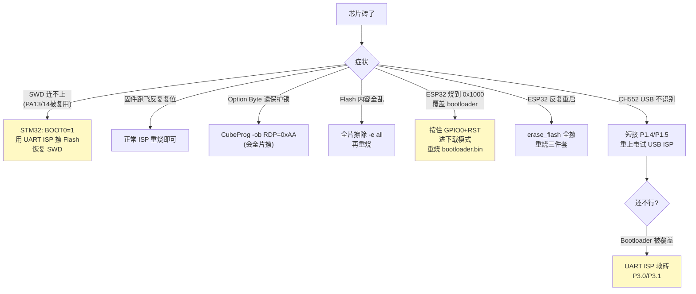

### STM32 SWD 锁死经典救法（Connect under reset）

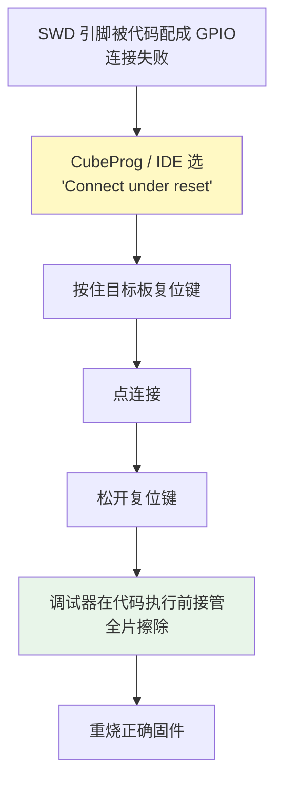

> [!important] Connect under reset 原理
> 按住复位时 CPU 不跑代码（SWD 引脚还是默认功能），此时调试器连入 → 松开复位瞬间调试器已接管 → 擦掉坏固件。这是 SWD 锁死的**官方救法**。

---

## 七、三种 ISP 横向对比

| 维度 | STM32 | ESP32 | CH552 |
|------|-------|-------|-------|
| **触发方式** | BOOT0=1 + 复位 | GPIO0=GND + RST | 全空自动 / 短接 P1.4 P1.5 |
| **接口** | UART(PA9/10) / USB-DFU | UART/USB | USB(D+/D-) / UART(P3.0/1) |
| **Bootloader 位置** | System Memory ROM | ROM | Flash 0x3800~(可被覆盖!) |
| **Bootloader 可破坏** | ❌ ROM 只读 | ❌ ROM 只读 | ⚠️ **可被覆盖**(需 UART 救) |
| **免调试器** | ✅(需 USB-TTL) | ✅(需 USB-TTL/USB) | ✅✅(直插 USB) |
| **救砖难度** | 低（Connect under reset） | 低（GPIO0+RST） | 中（Bootloader 易坏） |

> [!abstract] 关键洞察
> STM32 和 ESP32 的 Bootloader 在 **ROM**，绝对安全；CH552 的 Bootloader 在 **Flash 保护区**，有被覆盖风险。**这就是为什么 CH552 有"救砖"概念，而 STM32/ESP32 基本砖不了。**

---

## 八、避坑清单

> [!warning] ISP 与救砖常见坑
> 1. **STM32 串口烧录 PB2 被拉高** → 进 SRAM 模式而非 ISP，检查 BOOT1(PB2)
> 2. **ESP32 没进下载模式就烧** → 报 "Failed to connect"，重新 GPIO0+RST
> 3. **ESP32 烧错地址覆盖 bootloader** → 0x1000 是禁区，重烧 bootloader.bin
> 4. **CH552 固件 > 14KB** → 覆盖 Bootloader 保护区 → USB 失效
> 5. **CubeProg UART 波特率不匹配** → Bootloader 自动协商，固定用 115200 最稳
> 6. **救砖时不校验** → 看似救活实则数据错，务必 `-v`
> 7. **RDP 读保护乱设** → 设了忘了密码=芯片报废，开发期别开

---

## 🔗 知识延伸

- ⬆️ **上位知识**：[[_MOC-开发流水线总览]]、[[烧录原理与下载算法]]（ISP 是无调试器的烧录路径）
- ➡️ **平级关联**：[[烧录工具与命令]]（ISP 用什么工具）、[[ESP32-D0WDQ6的启动流程和内存详细]]（ROM Bootloader 的角色）、[[STM32F103C8T6]]（BOOT0/1 详解）、[[CH552G]]（USB ISP 详解）
- ⬇️ **下位知识**：ESP32 Strapping 引脚全集、STM32 System Memory Bootloader 协议、CH552 Bootloader 保护区结构、USB DFU 协议
