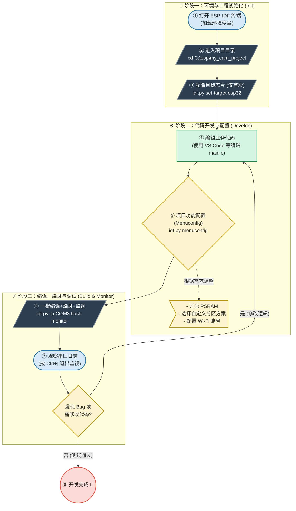

---
aliases:
  - ESP-IDF 命令
  - idf.py 命令
  - ESP32 环境搭建
created: 2026-04-13
chip: Esp32
tags:
  - 调试/知识体系
  - 烧录/ESP32
  - ESP32
  - 基础工具
status: 🌿草稿
---

# ESP-IDF 基础指令（环境/项目/编译/串口/烧录）


## 一、环境相关

### 1.1 进入 ESP-IDF 环境

```bash
# ========== Windows（你大概率是这个） ==========
# 方式一：开始菜单搜索
开始菜单 → ESP-IDF 5.x CMD
# 点击后自动打开一个配置好环境的命令行终端

# 方式二：手动导入（如果在普通 CMD/PowerShell 中）
C:\Espressif\frameworks\esp-idf-v5.1.2\export.bat
# 每次新开终端都要执行一次！

# ========== Linux / macOS ==========
# 每次新开终端执行
. $HOME/esp/esp-idf/export.sh

# 或者写入 ~/.bashrc 永久生效
echo "alias get_idf='. $HOME/esp/esp-idf/export.sh'" >> ~/.bashrc
# 之后每次输入 get_idf 即可
```

### 1.2 验证环境是否正常

```bash
# 检查 ESP-IDF 版本
idf.py --version
# 输出示例：ESP-IDF v5.1.2

# 检查 Python 环境
python --version
# 输出示例：Python 3.11.x

# 检查 esptool 是否可用
esptool.py version
# 输出示例：esptool.py v4.7.0

# 检查 CMake 版本
cmake --version
```

---

## 二、项目操作命令

### 2.1 创建项目

```bash
# 方式一：从模板创建空项目
idf.py create-project my_cam_project
cd my_cam_project

# 方式二：从官方示例复制（推荐新手）
# 示例库路径：esp-idf/examples/
cp -r $IDF_PATH/examples/peripherals/camera/my_cam_project
cd my_cam_project
```

项目目录结构：

```
my_cam_project/
├── CMakeLists.txt       ← 项目构建配置
├── main/
│   ├── CMakeLists.txt   ← 组件依赖声明
│   └── main.c           ← 你的代码（app_main 在这里）
├── components/          ← 自定义组件（可选）
└── sdkconfig.defaults   ← 默认配置（推荐创建）
```

### 2.2 设置目标芯片

```bash
# 必须在项目目录内执行！
idf.py set-target esp32

# 如果之前设过其他芯片，会提示需要 fullclean
idf.py fullclean
idf.py set-target esp32
```

### 2.3 配置项目

```bash
# 打开图形化配置菜单
idf.py menuconfig
```

常用配置路径：

- `Serial flasher config` → Flash 大小、速度、模式
- `Partition Table` → 分区方案选择
- `Component config → ESP32` → PSRAM 开关、CPU 频率
- `Component config → FreeRTOS` → tick 频率、任务优先级
- `Component config → Wi-Fi` → 缓冲数量
- `Component config → Log` → 日志等级

退出方式：按 `Q` 然后按 `Y` 保存

---

## 三、编译命令

```bash
# 基础编译（只编译，不烧录）
idf.py build

# fullclean（清空所有编译产物，从头来）
idf.py fullclean
# 场景：改了 sdkconfig 重要项、切换目标芯片、编译出错怀疑缓存问题

# 重新编译（只编译改动的文件，速度快）
idf.py build
# 增量编译，只重编修改过的 .c 文件

# 查看编译后固件大小
idf.py size
```

输出示例：

```
Total sizes:
  Used static DRAM:   59488 bytes (  186 KB)
  Used static IRAM:   27812 bytes (   27 KB)
  Used Flash:        876544 bytes (  856 KB)
  Used PSRAM:        0 bytes
```

---

## 四、串口相关

### 4.1 查找串口号

```bash
# Windows
mode
# 或者
mode COM*
# 或者设备管理器 → 端口(COM和LPT) → 查看 USB-Serial 的 COM 号

# Linux
ls /dev/ttyUSB*
ls /dev/ttyACM*
# 输出示例：/dev/ttyUSB0

# macOS
ls /dev/cu.usbserial*
# 输出示例：/dev/cu.usbserial-110
```

### 4.2 设置串口权限（Linux 需要）

```bash
# 添加当前用户到 dialout 组
sudo usermod -aG dialout $USER
# 重新登录后生效，或者临时：
sudo chmod 666 /dev/ttyUSB0
```

### 4.3 串口监视器（查看日志输出）

```bash
# 启动串口监视器
idf.py -p COM3 monitor
# 或 Linux：idf.py -p /dev/ttyUSB0 monitor

# 退出监视器：Ctrl + ]

# 常用波特率设置（默认 115200）
idf.py -p COM3 -b 115200 monitor

# 指定波特率配置（在 menuconfig 中修改）
# Component config → ESP console → UART baudrate
```

### 4.4 串口监视器快捷键

| 快捷键 | 功能 |
| --- | --- |
| `Ctrl + ]` | 退出监视器 |
| `Ctrl + T, Ctrl + H` | 显示帮助 |
| `Ctrl + T, Ctrl + R` | 复位芯片（通过 RTS/DTR） |
| `Ctrl + T, Ctrl + F` | 刷一次编译并烧录 |

---

## 五、烧录命令

### 5.1 一条龙：编译 + 烧录 + 监视

```bash
# 最常用命令！
idf.py -p COM3 flash monitor
```

执行流程：

1. 检查是否已编译 → 没有则自动编译
2. `esptool.py` 自动进入下载模式
3. 烧录 `bootloader.bin` → `0x1000`
4. 烧录 `partitions.bin` → `0x8000`
5. 烧录 `app.bin` → `0x10000`（地址由分区表决定）
6. 自动复位芯片
7. 打开串口监视器

### 5.2 只烧录不监视

```bash
idf.py -p COM3 flash
```

### 5.3 指定波特率烧录（加速）

```bash
# 默认 460800，可以提高到 921600（部分 USB-TTL 不支持）
idf.py -p COM3 -b 921600 flash
```

### 5.4 只擦除 Flash

```bash
# 擦除整个 Flash（恢复出厂状态）
idf.py -p COM3 erase-flash

# 擦除后需要重新烧录
idf.py -p COM3 flash monitor
```

### 5.5 烧录单个文件到指定地址（高级）

```bash
# 使用 esptool.py 直接烧录
esptool.py -p COM3 -b 460800 write_flash 0x10000 my_app.bin
#                                   ↑地址      ↑文件

# 烧录分区表
esptool.py -p COM3 write_flash 0x8000 partitions.bin

# 烧录 bootloader
esptool.py -p COM3 write_flash 0x1000 bootloader.bin
```

### 5.6 ESP32-CAM 手动进入烧录模式

因为 ESP32-CAM 没有 auto-reset 电路，大部分情况需要手动操作：

1. GPIO 0 引脚接 GND（按住板上的 BOOT 键，如果有）
2. 按一下 RST 键（或给 RST 引脚一个低电平脉冲）
3. 松开 BOOT 键
4. 现在芯片进入下载模式，串口输出：
   `"rst:0x1 (POWERON_RESET),boot:0x3 (DOWNLOAD_BOOT(UART0/UART1/SDIO_REI_REO_V2))"`
5. 执行烧录命令
6. 烧录完成后，断开 GPIO 0 的 GND
7. 按一下 RST，正常启动

---

## 六、调试相关（已移出）

> [!note] 内容已迁移
> 调试相关（ESP_LOG 日志、panic 排查、GDB 调试）已独立到 [[ESP32调试]]。

---

## 七、esptool.py 底层命令（已整合）

> [!note] 内容已迁移
> esptool.py 的完整命令（chip_id / flash_id / read_flash / verify_flash / erase_region / write_flash 地址规则 / 量产流程）已整合到 [[烧录工具与命令]] 的「esptool.py」章节，并与 STM32CubeProgrammer 做了横向对比。
>
> 本篇聚焦 ESP-IDF 环境/项目/编译/串口监视器（idf.py 高层命令）。

---

## 八、命令速查表

| 操作 | 命令 |
| --- | --- |
| 进入环境 | 开始菜单 → ESP-IDF 5.x CMD |
| 创建项目 | `idf.py create-project xxx` |
| 设置芯片 | `idf.py set-target esp32` |
| 图形化配置 | `idf.py menuconfig` |
| 编译 | `idf.py build` |
| 烧录 | `idf.py -p COM3 flash` |
| 编译+烧录+监视 | `idf.py -p COM3 flash monitor` |
| 串口监视 | `idf.py -p COM3 monitor` |
| 退出监视 | `Ctrl + ]` |
| 清空编译 | `idf.py fullclean` |
| 擦除 Flash | `idf.py -p COM3 erase-flash` |
| 查看固件大小 | `idf.py size` |
| 查看芯片信息 | `esptool.py -p COM3 chip_id` |
| 查看串口号 | 设备管理器 → 端口 |
| 查看串口号 | `ls /dev/ttyUSB*` |

---

## 九、ESP32-CAM 典型开发流程




**正确的日常动作**

**A. 安装环境：只做一次**  
如果环境坏了，或者你真要换版本，才用：

`eim.exe wizard --idf-features ide`

而且建议：

- target 先只选 esp32
- 安装路径固定一个
- 不要选 all，除非你真要多芯片开发

---

**B. 新建项目：不要用 wizard**  
你要新建项目时，用这些：

1. VS Code 里：

`ESP-IDF: New Project`

2. 或者手动复制 example
    
3. 或者自己建工程目录
    

这时候**不是重装环境**。

---

**C. 日常开发：只激活环境**  
进入项目后：

`cd C:\Users\tao93\Desktop\ESP32\hello_world . C:\Espressif\tools\Microsoft.v6.0.PowerShell_profile.ps1 idf.py build idf.py -p COM3 flash idf.py -p COM3 monitor`

---

**你可以这样理解“下载”的层次**

`安装 ESP-IDF = 下载“厨房 + 炊具” 新建项目 = 新拿一个菜板开始做菜 项目额外组件下载 = 这次做菜顺手补买一个特殊调料`

所以：

`wizard = 装厨房 new project = 开始做新菜 build = 开火做菜 extra component download = 补调料`

---

**对你当前学习路线的最简建议**

你现在只学经典 ESP32-CAM，用这套就够：

`芯片 target：esp32 ESP-IDF 环境：固定一套 工作区：固定一个 新建项目：不用 wizard 摄像头组件：等真正做 camera 项目时再按需下`

---

## 🔗 知识延伸

- ⬆️ **上位知识**：[[_MOC-开发流水线总览]]、[[sdkconfig]]（idf.py 操作的配置）
- ➡️ **平级关联**：[[烧录工具与命令]]（esptool 底层命令）、[[ESP32-D0WDQ6的启动流程和内存详细]]（烧录地址由来）、[[ESP32调试]]（日志/panic 排查）
- ⬇️ **下位知识**：ESP-IDF 组件管理（idf.py add-dependency）、自定义分区表